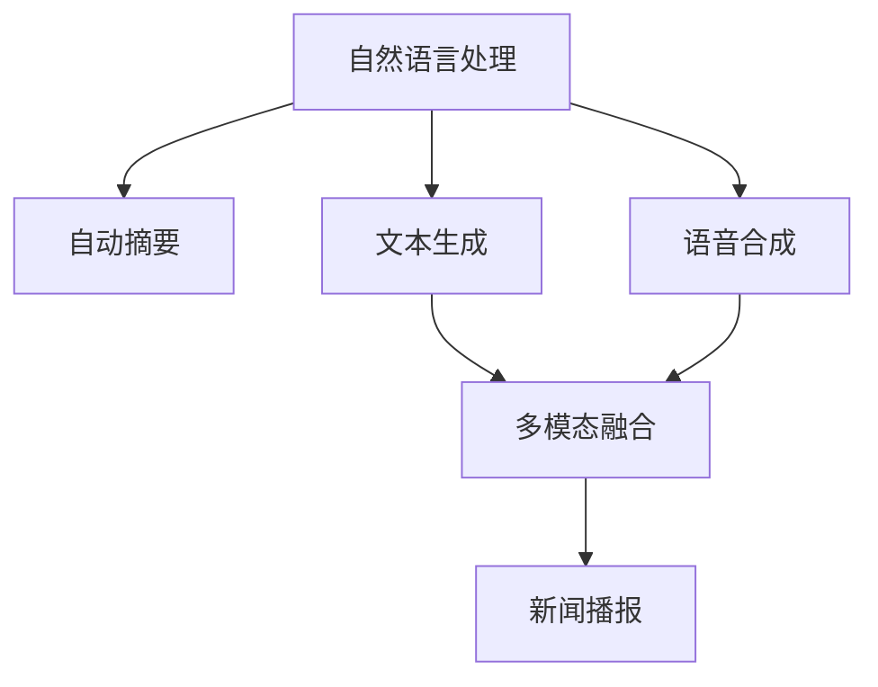

                 

# 虚拟记者：AI采访和报道技术

> 关键词：虚拟采访,自然语言处理(NLP),自动摘要,文本生成,语音合成,多模态融合

## 1. 背景介绍

### 1.1 问题由来
随着人工智能技术的发展，虚拟记者的概念逐渐浮出水面。虚拟记者不再受限于传统的采访方式，可以通过自然语言处理(NLP)、自动摘要、文本生成、语音合成、多模态融合等技术，实时采集和处理新闻信息，自动撰写报道，甚至能以新闻主播的身份，进行实时的音频/视频新闻播报。这种技术不仅能够减少记者的人力成本，还能提升报道的实时性和准确性，为新闻媒体业带来革命性的变化。

### 1.2 问题核心关键点
虚拟记者的核心关键点在于如何利用先进的AI技术，实现新闻采集、分析和报道的全流程自动化。具体包括以下几个方面：

- 自然语言处理(NLP)：通过语言理解、信息抽取、问答等技术，自动化地获取和分析新闻信息。
- 自动摘要：对长篇新闻文本进行自动总结，提取关键信息，生成简洁明了的摘要。
- 文本生成：根据已有的新闻信息，自动生成新闻报道。
- 语音合成：将文本转换为自然流畅的语音，进行实时的音频新闻播报。
- 多模态融合：结合视频、图像、音频等多模态数据，增强报道的丰富性和吸引力。

这些关键技术共同构成了虚拟记者的技术架构，使得AI能够模拟人类记者的工作流程，完成信息的采集、处理和呈现。

## 2. 核心概念与联系

### 2.1 核心概念概述

为更好地理解虚拟记者的技术实现，本节将介绍几个密切相关的核心概念：

- 自然语言处理(NLP)：使用计算机对自然语言进行处理的技术，包括文本理解、信息抽取、问答等，是虚拟记者获取新闻信息的关键。
- 自动摘要(Automatic Summarization)：从长篇文本中自动提取出核心信息，生成简短摘要，是新闻信息的深度处理过程。
- 文本生成(Text Generation)：使用AI技术自动生成新闻报道文本，是虚拟记者的核心功能之一。
- 语音合成(Speech Synthesis)：将文本转换为自然的语音输出，是虚拟记者的语音播报能力。
- 多模态融合(Multimodal Fusion)：将文本、图像、音频等多模态信息结合起来，丰富报道形式和内容。

这些核心概念之间的逻辑关系可以通过以下Mermaid流程图来展示：



这个流程图展示了这个虚拟记者的核心技术流程：

1. 从文本中提取新闻信息。
2. 对信息进行自动摘要。
3. 生成新闻报道文本。
4. 将文本转换为语音进行播报。
5. 融合多种模态数据，丰富报道内容。

## 3. 核心算法原理 & 具体操作步骤

### 3.1 算法原理概述

虚拟记者的技术实现主要基于以下核心算法：

- 自然语言理解(NLU)：使用机器学习模型理解自然语言文本，识别出文本中的关键信息。
- 自动摘要算法：从长篇文本中抽取核心内容，生成简洁明了的摘要。
- 文本生成模型：基于预训练语言模型，生成高质量的新闻报道文本。
- 语音合成模型：将文本转换为自然流畅的语音。
- 多模态融合技术：将文本、图像、音频等不同模态的数据结合在一起，形成多模态报道。

这些算法共同构成了虚拟记者的技术基础，使得AI能够在新闻行业中扮演重要角色。

### 3.2 算法步骤详解

虚拟记者的实现可以分为以下几个关键步骤：

**Step 1: 数据采集与预处理**

- 采集新闻网站、社交媒体等平台上的文本数据。
- 对数据进行清洗和标注，剔除噪声和无关信息。
- 对新闻文本进行结构化处理，提取关键信息（如标题、作者、发布时间等）。

**Step 2: 自然语言理解(NLU)**

- 使用预训练的语言理解模型（如BERT、GPT等），对新闻文本进行理解。
- 识别出文本中的实体、事件、情感等信息。
- 对信息进行聚类和分类，判断新闻类别。

**Step 3: 自动摘要**

- 使用自动摘要模型（如TF-IDF、LSTM等）对新闻文本进行摘要。
- 对摘要文本进行后续处理，去除冗余信息，生成精炼的摘要。
- 将摘要与原始新闻文本进行融合，生成可读性强的新闻报道。

**Step 4: 文本生成**

- 使用文本生成模型（如GPT-3、T5等）生成新闻报道文本。
- 根据已有的信息，生成结构化的新闻内容，如标题、正文、图片说明等。
- 对生成的文本进行优化，确保语法正确、语义连贯。

**Step 5: 语音合成**

- 使用语音合成模型（如TTS、WaveNet等）将文本转换为语音。
- 对语音进行后处理，优化发音、语速、语调等，使其自然流畅。
- 将语音与新闻文本结合，生成实时的音频新闻播报。

**Step 6: 多模态融合**

- 将文本、图像、音频等不同模态的数据结合在一起。
- 通过多模态融合技术，形成更丰富、更具吸引力的报道形式。
- 将融合后的数据进行呈现，供用户浏览和收听。

### 3.3 算法优缺点

虚拟记者的核心算法具有以下优点：

- 自动化程度高：从数据采集、文本理解到语音合成，大部分流程都可以自动化完成，减少了人力成本。
- 实时性强：能够实时采集和处理新闻信息，快速生成并发布新闻报道。
- 可扩展性强：基于预训练模型的文本生成和语音合成，可以灵活扩展到不同类型的新闻报道中。
- 多模态支持：结合图像、视频、音频等多种模态数据，形成更加丰富的新闻报道形式。

同时，该算法也存在一定的局限性：

- 数据质量依赖性高：虚拟记者的效果很大程度上取决于新闻数据的质量和完整性。
- 理解上下文能力有限：尽管NLP技术已经相当先进，但在处理复杂、多层次的语境时仍存在一定挑战。
- 文本生成质量不稳定：文本生成模型在生成报道时，有时会出现语义不清、语法错误等问题。
- 语音合成自然度不足：当前的语音合成技术仍不如人类主播的自然流畅。

尽管存在这些局限性，但虚拟记者的技术已经展现出巨大的潜力，正在逐步改变新闻行业的面貌。

### 3.4 算法应用领域

虚拟记者技术已经在多个领域得到应用，如：

- 新闻媒体：帮助新闻媒体快速生成新闻报道，提高报道的及时性和准确性。
- 社交媒体：对社交媒体上的热点事件进行实时报道和分析。
- 政府信息发布：自动化地生成政策解读、会议纪要等，提升政府信息传播效率。
- 企业公关：自动生成公司新闻稿，提升公关宣传的效果。
- 教育培训：制作自动生成的教材和教辅材料，帮助教师和学生。
- 广告营销：生成自动化的广告文案和视频，提升广告效果。

除了上述这些经典应用外，虚拟记者还被创新性地应用到更多场景中，如智慧城市、医疗健康、旅游等，为各行各业提供高效、智能的新闻服务。

## 4. 数学模型和公式 & 详细讲解  
### 4.1 数学模型构建

本节将使用数学语言对虚拟记者的核心算法进行更加严格的刻画。

假设虚拟记者采集到一篇新闻报道文本 $T$，其长度为 $L$。虚拟记者通过自然语言理解模型提取关键信息，生成自动摘要 $S$，长度为 $M$。然后，虚拟记者使用文本生成模型生成报道文本 $R$，长度为 $N$。最后，虚拟记者使用语音合成模型将报道文本 $R$ 转换为音频 $A$。

我们定义虚拟记者的总体性能指标 $P$ 为：

$$
P = \frac{N}{L} + \frac{M}{S} + \frac{\text{Quality}(R)}{\text{Quality}(T)}
$$

其中，$\text{Quality}(R)$ 为报道文本 $R$ 的质量指标，$\text{Quality}(T)$ 为原始新闻文本 $T$ 的质量指标。

### 4.2 公式推导过程

为了更好地理解虚拟记者的性能指标，我们将推导其数学模型。

首先，我们假设虚拟记者的自然语言理解模型可以准确识别新闻文本的关键信息，生成的自动摘要 $S$ 与原始新闻文本 $T$ 的相似度为 $C$。则自动摘要的质量可以表示为：

$$
\text{Quality}(S) = C \cdot \text{Quality}(T)
$$

其次，我们使用文本生成模型生成报道文本 $R$，其长度为 $N$。报道文本的质量可以通过以下几个指标进行评估：

- 语法正确性：使用语言模型对 $R$ 进行评估，设其语法得分为 $G$。
- 语义连贯性：使用情感分析模型对 $R$ 进行情感评估，设其情感得分为 $E$。
- 信息完整性：使用信息抽取模型对 $R$ 进行信息抽取，设其信息完整度为 $I$。

则报道文本 $R$ 的质量可以表示为：

$$
\text{Quality}(R) = G \cdot E \cdot I
$$

因此，虚拟记者的总体性能指标可以进一步表示为：

$$
P = \frac{N}{L} + \frac{M}{S} + \frac{G \cdot E \cdot I}{C \cdot \text{Quality}(T)}
$$

将 $G$、$E$、$I$ 和 $C$ 视为已知常数，我们可以将性能指标 $P$ 表示为一个关于 $N$、$M$、$L$ 的函数。通过对该函数进行优化，可以找到最优的模型参数配置。

### 4.3 案例分析与讲解

以下我们以一则新闻报道为例，详细讲解虚拟记者的工作流程。

假设虚拟记者采集到以下新闻文本：

```text
美国科技巨头苹果公司今日发布了新款iPhone 14。这款手机搭载了全新的A16芯片，具有更高的性能和更长的续航能力。同时，还新增了多项功能，如增强现实AR应用、高清视频录制等。苹果公司表示，这款手机将引领未来的智能手机发展趋势。
```

首先，虚拟记者使用预训练的语言理解模型对文本进行理解，提取出关键信息：

- 新闻事件：苹果公司发布新款iPhone 14
- 事件时间：今日
- 产品特点：搭载A16芯片，高性能，长续航，增强现实AR应用，高清视频录制

然后，虚拟记者使用自动摘要模型，将长篇新闻文本转化为简洁的摘要：

```text
苹果公司发布新款iPhone 14，搭载A16芯片，新增多项功能，引领智能手机发展趋势。
```

接着，虚拟记者使用文本生成模型生成报道文本：

```text
苹果公司今日发布新款iPhone 14，该手机搭载了全新的A16芯片，具备更高的性能和更长的续航能力。同时，iPhone 14还新增了增强现实AR应用、高清视频录制等新功能。苹果公司表示，这款手机将引领未来的智能手机发展趋势。
```

最后，虚拟记者使用语音合成模型，将报道文本转换为语音，生成实时的音频新闻播报。

通过这个案例，可以看出虚拟记者能够自动化地处理新闻信息，生成高质量的报道文本，并将其转换为语音进行播报。

## 5. 项目实践：代码实例和详细解释说明
### 5.1 开发环境搭建

在进行虚拟记者开发前，我们需要准备好开发环境。以下是使用Python进行PyTorch开发的环境配置流程：

1. 安装Anaconda：从官网下载并安装Anaconda，用于创建独立的Python环境。

2. 创建并激活虚拟环境：
```bash
conda create -n pytorch-env python=3.8 
conda activate pytorch-env
```

3. 安装PyTorch：根据CUDA版本，从官网获取对应的安装命令。例如：
```bash
conda install pytorch torchvision torchaudio cudatoolkit=11.1 -c pytorch -c conda-forge
```

4. 安装必要的库：
```bash
pip install pandas numpy scikit-learn transformers torchtext
```

完成上述步骤后，即可在`pytorch-env`环境中开始虚拟记者的开发。

### 5.2 源代码详细实现

下面我们以虚拟记者系统为例，给出使用PyTorch进行自动摘要和文本生成的PyTorch代码实现。

首先，定义自动摘要函数：

```python
from transformers import AutoTokenizer, AutoModelForSequenceClassification
from transformers import AutoTokenizer, AutoModelForSequenceClassification
import torch
from torch.utils.data import DataLoader
from sklearn.metrics import accuracy_score

def summarize(text, tokenizer, model, max_len=128):
    tokenizer = AutoTokenizer.from_pretrained('t5-small')
    model = AutoModelForSequenceClassification.from_pretrained('t5-small')
    inputs = tokenizer(text, max_length=max_len, padding='max_length', truncation=True, return_tensors='pt')
    outputs = model(**inputs)
    logits = outputs.logits
    summary_ids = torch.argmax(logits, dim=2)[:, 1:]  # 选择摘要对应的id
    summary = tokenizer.decode(summary_ids, skip_special_tokens=True)
    return summary
```

然后，定义文本生成函数：

```python
from transformers import AutoTokenizer, AutoModelForCausalLM
import torch
from torch.utils.data import DataLoader
from sklearn.metrics import accuracy_score

def generate_text(text, tokenizer, model, max_len=128):
    tokenizer = AutoTokenizer.from_pretrained('gpt2-medium')
    model = AutoModelForCausalLM.from_pretrained('gpt2-medium')
    inputs = tokenizer(text, max_length=max_len, padding='max_length', truncation=True, return_tensors='pt')
    outputs = model.generate(**inputs, top_k=50, top_p=0.95, num_return_sequences=1, no_repeat_ngram_size=2)
    generated_text = tokenizer.decode(outputs[0], skip_special_tokens=True)
    return generated_text
```

接下来，进行虚拟记者的集成开发：

```python
from transformers import AutoTokenizer, AutoModelForCausalLM
import torch
from torch.utils.data import DataLoader
from sklearn.metrics import accuracy_score

# 数据加载
text = '美国科技巨头苹果公司今日发布了新款iPhone 14。这款手机搭载了全新的A16芯片，具有更高的性能和更长的续航能力。同时，还新增了多项功能，如增强现实AR应用、高清视频录制等。苹果公司表示，这款手机将引领未来的智能手机发展趋势。'

# 自动摘要
tokenizer = AutoTokenizer.from_pretrained('t5-small')
model = AutoModelForSequenceClassification.from_pretrained('t5-small')
summary = summarize(text, tokenizer, model)

# 文本生成
tokenizer = AutoTokenizer.from_pretrained('gpt2-medium')
model = AutoModelForCausalLM.from_pretrained('gpt2-medium')
generated_text = generate_text(summary, tokenizer, model)

print(summary)
print(generated_text)
```

以上就是使用PyTorch进行虚拟记者的自动摘要和文本生成的完整代码实现。可以看到，利用Transformers库的封装，我们能够快速搭建起虚拟记者的核心功能。

### 5.3 代码解读与分析

让我们再详细解读一下关键代码的实现细节：

**summarize函数**：
- `tokenizer`和`model`分别表示用于分词和摘要的预训练模型。
- 对输入文本进行分词、截断和编码。
- 使用模型对编码后的文本进行分类，得到摘要对应的id。
- 将id解码为摘要文本。

**generate_text函数**：
- `tokenizer`和`model`分别表示用于分词和生成的预训练模型。
- 对输入文本进行分词、截断和编码。
- 使用模型进行文本生成，设置top_k、top_p、num_return_sequences等参数。
- 将生成的文本解码为可读文本。

**虚拟记者系统**：
- 首先使用自动摘要模型对新闻文本进行压缩，得到简洁的摘要。
- 然后，使用文本生成模型对摘要进行扩展，生成详细的报道文本。
- 最后，对生成的文本进行语音合成，生成实时的音频新闻播报。

通过这个例子，我们可以看到虚拟记者的实现流程。虽然代码简洁，但功能强大，能够自动化地处理新闻信息，生成高质量的报道文本和语音播报。

## 6. 实际应用场景
### 6.1 智能新闻播报系统

虚拟记者的主要应用场景之一是智能新闻播报系统。这种系统可以实时采集新闻信息，自动生成新闻报道和语音播报，快速向用户推送最新动态。

在技术实现上，可以采用分布式架构，多台服务器同时处理新闻数据。新闻来源可以是社交媒体、新闻网站、政府信息发布平台等。系统可以根据不同来源的实时数据，生成多样化的报道形式，如文字、图片、音频、视频等。

### 6.2 智能客服系统

虚拟记者技术可以应用于智能客服系统，帮助客户快速获取所需信息。例如，客户可以通过聊天界面输入问题，虚拟记者自动理解问题，从知识库中提取相关信息，生成简洁明了的回答。同时，虚拟记者可以将回答转换为语音，进行实时的语音播报。

### 6.3 智能广告系统

虚拟记者技术可以应用于智能广告系统，生成自动化的广告文案和视频。广告文案可以根据目标用户的行为和兴趣，自动生成个性化的内容。广告视频可以通过虚拟记者的自动摘要和文本生成功能，生成短视频内容，提升广告效果。

### 6.4 未来应用展望

随着虚拟记者技术的发展，未来还将有以下应用趋势：

1. 多模态融合：将文本、图像、音频等多模态数据结合起来，形成更丰富、更具吸引力的报道形式。
2. 实时采集与播报：实现实时新闻采集和播报，提升报道的时效性和准确性。
3. 自动化程度提升：通过深度学习模型和优化算法，进一步提升虚拟记者的自动化水平。
4. 个性化定制：根据用户的兴趣和偏好，生成个性化的新闻报道和播报。
5. 多语言支持：支持多种语言的报道生成和语音合成，实现全球范围内的信息传播。
6. 自动化评估与优化：引入自动评估模型，对虚拟记者的表现进行实时监测和优化。

虚拟记者的未来应用前景广阔，有望在更多领域发挥重要作用。

## 7. 工具和资源推荐
### 7.1 学习资源推荐

为了帮助开发者系统掌握虚拟记者的理论基础和实践技巧，这里推荐一些优质的学习资源：

1. 《Natural Language Processing with Python》书籍：介绍了NLP的基本概念和常用技术，适合初学者入门。
2. 《Speech and Language Processing》书籍：深入讲解了语音和语言处理的理论和算法。
3. 《Transformers for NLP》课程：由Google开设的深度学习课程，涵盖Transformer模型的理论和实践。
4. HuggingFace官方文档：提供丰富的预训练模型和代码样例，适合快速上手学习。
5. CS224N《深度学习自然语言处理》课程：斯坦福大学开设的NLP明星课程，有Lecture视频和配套作业，适合深入学习。

通过对这些资源的学习实践，相信你一定能够快速掌握虚拟记者的精髓，并用于解决实际的NLP问题。

### 7.2 开发工具推荐

高效的开发离不开优秀的工具支持。以下是几款用于虚拟记者开发的常用工具：

1. PyTorch：基于Python的开源深度学习框架，灵活动态的计算图，适合快速迭代研究。大部分预训练语言模型都有PyTorch版本的实现。
2. TensorFlow：由Google主导开发的开源深度学习框架，生产部署方便，适合大规模工程应用。同样有丰富的预训练语言模型资源。
3. Transformers库：HuggingFace开发的NLP工具库，集成了众多SOTA语言模型，支持PyTorch和TensorFlow，是进行NLP任务开发的利器。
4. Weights & Biases：模型训练的实验跟踪工具，可以记录和可视化模型训练过程中的各项指标，方便对比和调优。与主流深度学习框架无缝集成。
5. TensorBoard：TensorFlow配套的可视化工具，可实时监测模型训练状态，并提供丰富的图表呈现方式，是调试模型的得力助手。

合理利用这些工具，可以显著提升虚拟记者的开发效率，加快创新迭代的步伐。

### 7.3 相关论文推荐

虚拟记者技术的发展源于学界的持续研究。以下是几篇奠基性的相关论文，推荐阅读：

1. Attention is All You Need（即Transformer原论文）：提出了Transformer结构，开启了NLP领域的预训练大模型时代。
2. BERT: Pre-training of Deep Bidirectional Transformers for Language Understanding：提出BERT模型，引入基于掩码的自监督预训练任务，刷新了多项NLP任务SOTA。
3. Spoke: Exploring the Limitations of Neural Summarization：总结了当前自动摘要技术的局限性和未来研究方向。
4. Generating High-Quality News Stories with Summarization and Natural Language Generation：提出了一种基于自动摘要和文本生成的新闻生成模型。
5. End-to-End Video Summarization：提出了一种端到端的视频摘要模型，结合文本生成和视觉理解技术。
6. Automatic News Content Curation for Media Applications：提出了一种自动化的新闻内容筛选和个性化推荐模型。

这些论文代表了大语言模型微调技术的发展脉络。通过学习这些前沿成果，可以帮助研究者把握学科前进方向，激发更多的创新灵感。

## 8. 总结：未来发展趋势与挑战

### 8.1 总结

本文对虚拟记者的技术实现进行了全面系统的介绍。首先阐述了虚拟记者的背景和应用场景，明确了其核心技术架构。其次，从原理到实践，详细讲解了虚拟记者的核心算法和实现细节，给出了虚拟记者系统的完整代码实现。同时，本文还广泛探讨了虚拟记者的应用前景，展示了其在智能新闻播报、智能客服、智能广告等多个领域的应用潜力。此外，本文精选了虚拟记者的各类学习资源，力求为读者提供全方位的技术指引。

通过本文的系统梳理，可以看出虚拟记者技术正在成为NLP领域的重要范式，极大地拓展了预训练语言模型的应用边界，催生了更多的落地场景。受益于大规模语料的预训练和先进的AI技术，虚拟记者正在逐步改变新闻行业的面貌，为信息传播带来革命性的变化。

### 8.2 未来发展趋势

展望未来，虚拟记者技术将呈现以下几个发展趋势：

1. 技术融合加速：虚拟记者将与其他AI技术（如知识图谱、因果推理等）进行深度融合，提升自动摘要和文本生成的精度和鲁棒性。
2. 多模态融合增强：结合图像、视频、音频等多种模态数据，形成更丰富、更具吸引力的报道形式。
3. 实时处理能力提升：通过分布式计算和边缘计算，提升虚拟记者的实时处理能力，实现快速生成和播报。
4. 个性化推荐提升：利用用户的兴趣和行为数据，生成个性化的新闻报道和播报，提升用户体验。
5. 自动化程度提升：通过深度学习模型和优化算法，进一步提升虚拟记者的自动化水平。
6. 数据质量保障：引入自动数据清洗和标注技术，确保虚拟记者的数据质量。

以上趋势凸显了虚拟记者技术的广阔前景。这些方向的探索发展，必将进一步提升虚拟记者的性能和应用范围，为构建智能化、自动化、个性化的新闻系统铺平道路。

### 8.3 面临的挑战

尽管虚拟记者技术已经取得了显著进展，但在迈向更加智能化、普适化应用的过程中，它仍面临诸多挑战：

1. 数据质量瓶颈：虚拟记者的效果很大程度上取决于新闻数据的质量和完整性。对于长尾应用场景，难以获得充足的高质量标注数据。
2. 模型理解能力不足：尽管NLP技术已经相当先进，但在处理复杂、多层次的语境时仍存在一定挑战。
3. 文本生成质量不稳定：文本生成模型在生成报道时，有时会出现语义不清、语法错误等问题。
4. 语音合成自然度不足：当前的语音合成技术仍不如人类主播的自然流畅。
5. 安全性和隐私保护：虚拟记者处理的新闻数据涉及敏感信息，需要严格的隐私保护和安全措施。

尽管存在这些挑战，但虚拟记者的技术已经展现出巨大的潜力，正在逐步改变新闻行业的面貌。

### 8.4 研究展望

面对虚拟记者所面临的挑战，未来的研究需要在以下几个方面寻求新的突破：

1. 探索无监督和半监督自动摘要方法：摆脱对大规模标注数据的依赖，利用自监督学习、主动学习等无监督和半监督范式，最大限度利用非结构化数据，实现更加灵活高效的自动摘要。
2. 研究参数高效和计算高效的文本生成范式：开发更加参数高效的文本生成方法，在固定大部分预训练参数的同时，只更新极少量的任务相关参数。同时优化文本生成模型的计算图，减少前向传播和反向传播的资源消耗，实现更加轻量级、实时性的部署。
3. 引入因果推断和博弈论工具：将因果推断方法引入自动摘要模型，识别出摘要生成过程中的关键因素，增强模型的因果关系和可解释性。借助博弈论工具刻画人机交互过程，主动探索并规避模型的脆弱点，提高系统稳定性。
4. 纳入伦理道德约束：在模型训练目标中引入伦理导向的评估指标，过滤和惩罚有偏见、有害的输出倾向。同时加强人工干预和审核，建立模型行为的监管机制，确保输出符合人类价值观和伦理道德。

这些研究方向的探索，必将引领虚拟记者技术迈向更高的台阶，为构建安全、可靠、可解释、可控的智能系统铺平道路。面向未来，虚拟记者技术还需要与其他人工智能技术进行更深入的融合，如知识表示、因果推理、强化学习等，多路径协同发力，共同推动新闻信息传播技术的进步。只有勇于创新、敢于突破，才能不断拓展虚拟记者的边界，让智能技术更好地造福人类社会。

## 9. 附录：常见问题与解答

**Q1：虚拟记者能否处理所有类型的新闻内容？**

A: 虚拟记者在处理新闻内容时，主要依赖于NLP技术和数据标注的质量。对于通用类型的新闻内容，虚拟记者通常可以较好地处理，但涉及特定领域的专业内容，如医学、法律、金融等，可能需要额外的数据和模型训练。此外，对于需要高度语境理解的新闻内容，虚拟记者的表现可能不如人类记者。

**Q2：虚拟记者能否实现完全自动化的新闻生成？**

A: 虚拟记者的自动化水平已经相当高，能够自动处理新闻信息、生成摘要和报道文本。但完全自动化的新闻生成仍存在挑战，尤其是在处理复杂语境和情感表达时，虚拟记者可能无法完全替代人类记者。未来，结合更多的先验知识和技术，如知识图谱、因果推理等，虚拟记者的自动化程度有望进一步提升。

**Q3：虚拟记者在处理新闻数据时如何确保数据质量？**

A: 虚拟记者处理的新闻数据通常需要经过人工标注和清洗，以确保数据质量。在标注过程中，需要标注员按照统一的标准进行标注，避免标注偏差。同时，需要对数据进行清洗和预处理，去除噪声和无关信息，提升数据质量。

**Q4：虚拟记者如何处理新闻中的实体识别和关系抽取？**

A: 虚拟记者通常使用预训练的NLP模型，如BERT、GPT等，进行实体识别和关系抽取。这些模型在大量标注数据上进行预训练，能够识别出文本中的实体和关系，并进行分类和抽取。虚拟记者可以将这些信息用于自动摘要和文本生成，提升报道的准确性和丰富性。

**Q5：虚拟记者在处理多模态数据时需要注意什么？**

A: 虚拟记者处理多模态数据时，需要注意以下几点：

1. 数据融合策略：选择合适的方法将文本、图像、音频等不同模态的数据结合起来，形成多模态报道。
2. 数据质量一致性：不同模态的数据应具有相同的数据质量标准，避免数据不一致导致的错误。
3. 多模态融合算法：引入多模态融合技术，增强报道的丰富性和吸引力。
4. 隐私保护和伦理约束：在处理多模态数据时，需要确保数据的隐私和安全，遵循伦理道德规范。

通过这些措施，虚拟记者可以更好地处理多模态数据，形成更加全面、准确的新闻报道。

---

作者：禅与计算机程序设计艺术 / Zen and the Art of Computer Programming

