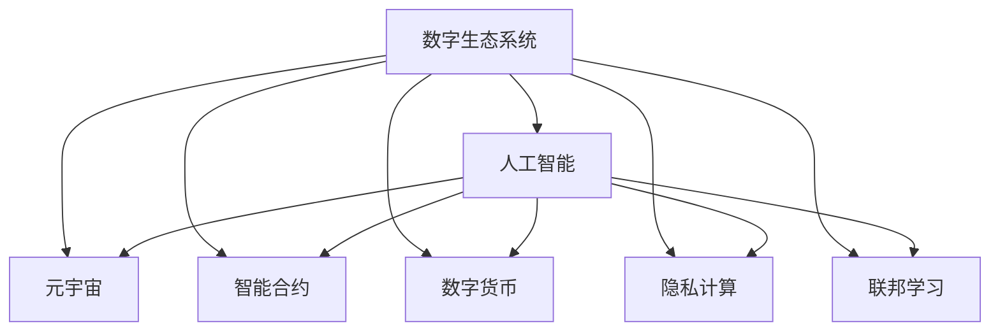

                 

# 虚拟进化：AI驱动的数字生态系统

> 关键词：数字生态系统,人工智能,虚拟进化,元宇宙,数字货币,智能合约,区块链,大数据,隐私计算,联邦学习

## 1. 背景介绍

### 1.1 问题由来
当前，全球正处于第四次工业革命的浪潮中，人工智能（AI）、物联网（IoT）、大数据、区块链等新兴技术正在彻底改变我们的生产生活方式。数字生态系统正成为未来数字经济的重要基础和支撑，它涉及了多个层面的技术创新，包括元宇宙、智能合约、数字货币、隐私计算、联邦学习等。AI在其中扮演着关键角色，驱动着整个数字生态的智能进化。

### 1.2 问题核心关键点
本文将聚焦于AI驱动的数字生态系统的构建和进化，探讨其核心概念、关键技术和未来发展趋势。特别地，我们将重点讨论：
- AI技术如何与其他数字技术融合，构建智能化的数字生态系统。
- 数字生态系统中常见的AI应用场景，如智能合约、区块链、隐私计算等。
- 数字生态系统的未来发展方向，包括元宇宙、数字货币等新兴概念。
- AI驱动的数字生态系统的挑战与应对策略。

## 2. 核心概念与联系

### 2.1 核心概念概述

为更好地理解AI驱动的数字生态系统，本节将介绍几个核心概念：

- **数字生态系统**：由数字技术构成，融合人工智能、物联网、大数据、区块链等技术，为用户提供智能化的服务和产品。
- **人工智能**：涉及机器学习、深度学习、自然语言处理、计算机视觉等技术，赋予数字生态系统智能处理和分析数据的能力。
- **元宇宙**：基于虚拟现实（VR）、增强现实（AR）、云计算等技术，构建的虚拟数字空间，用户可以在其中进行社交、娱乐、购物等活动。
- **智能合约**：使用AI技术自动执行和监督，能够自主进行数据分析、决策和执行的法律合同，广泛应用于区块链上。
- **数字货币**：基于区块链技术的加密货币，支持实时交易、跨境支付、隐私保护等功能，与AI结合，可实现更高效的货币操作。
- **隐私计算**：在保证数据隐私的前提下，使用AI进行数据分析和处理的技术，广泛应用于金融、医疗、电商等领域。
- **联邦学习**：分布式训练技术，多个独立的数据节点通过共享模型参数更新数据，而数据本身不离开本地节点，提高了数据安全性和模型泛化能力。

这些核心概念之间通过数据流通和交互，构成了数字生态系统的智能网络。AI技术在其中扮演着数据处理和智能决策的核心角色，推动着整个生态系统的智能化发展。

### 2.2 核心概念原理和架构的 Mermaid 流程图



这个流程图展示了AI技术在数字生态系统中的关键作用：

1. AI处理数据并提取特征，为元宇宙、智能合约、数字货币、隐私计算、联邦学习提供智能支持。
2. 元宇宙、智能合约、数字货币、隐私计算、联邦学习等技术相互协作，共同构成数字生态系统的智能架构。
3. 数据在各个技术层间流动和交互，推动着数字生态系统的智能进化。

## 3. 核心算法原理 & 具体操作步骤
### 3.1 算法原理概述

AI驱动的数字生态系统构建和进化，本质上是一个多学科融合、多技术协作的复杂系统工程。其中，AI技术作为核心的数据处理和智能决策引擎，扮演着至关重要的角色。

在实际应用中，AI技术主要通过以下几种方式驱动数字生态系统的智能进化：

- **数据融合与特征提取**：利用AI进行海量数据的聚合和分析，提取关键特征，为元宇宙、智能合约、数字货币、隐私计算、联邦学习等技术提供智能支持。
- **智能决策与优化**：通过机器学习和深度学习算法，对数据进行建模和预测，提供智能化的决策方案，优化数字生态系统的运行效率和用户体验。
- **自动化与自适应**：通过自适应算法和自动化流程，使数字生态系统能够动态调整和优化，适应市场变化和用户需求。
- **跨领域协作**：利用联邦学习等分布式训练技术，实现跨领域数据的协作和共享，提升数字生态系统的整体智能化水平。

### 3.2 算法步骤详解

AI驱动的数字生态系统构建和进化，通常包括以下关键步骤：

**Step 1: 数据收集与整合**

- 收集各领域的原始数据，包括文本、图像、语音、视频等不同类型的数据。
- 对数据进行清洗、标注和整合，构建统一的数据仓库。

**Step 2: 特征提取与建模**

- 利用AI算法对数据进行特征提取，如文本的TF-IDF、图像的卷积神经网络（CNN）、音频的深度学习模型等。
- 通过机器学习和深度学习模型，对数据进行建模，提取数据中的隐含信息和规律。

**Step 3: 智能决策与优化**

- 使用AI进行数据分析和预测，提供智能化的决策支持。
- 应用强化学习等算法，优化数字生态系统的运行效率和用户体验。

**Step 4: 跨领域协作与协同优化**

- 利用联邦学习等分布式训练技术，实现跨领域数据的协作和共享。
- 动态调整和优化数字生态系统的运行策略，以适应市场变化和用户需求。

**Step 5: 测试与部署**

- 在测试环境中验证AI模型和策略的有效性。
- 部署到实际的数字生态系统中，监控运行效果，进行持续优化。

### 3.3 算法优缺点

AI驱动的数字生态系统构建和进化，具有以下优点：

- 高度智能化。AI技术的引入，使数字生态系统具备了高度的自动化和智能化，能够自主学习、自适应和优化。
- 数据驱动。基于数据驱动的决策和优化，使数字生态系统的运行更加科学和高效。
- 跨领域协作。通过联邦学习等技术，实现跨领域数据的协作和共享，提升了数字生态系统的整体智能化水平。

同时，该方法也存在一些局限性：

- 依赖高质量数据。数据的质量和数量直接影响AI模型的效果，收集和处理高质量数据是一个挑战。
- 模型复杂性高。AI模型的训练和优化需要大量的计算资源和专业知识，难度较大。
- 安全性问题。AI模型的黑盒特性和复杂性，可能导致数据隐私和安全问题，需要额外的技术手段进行保障。

尽管存在这些局限性，AI驱动的数字生态系统仍是未来数字经济的重要方向，具有巨大的潜力和发展空间。

### 3.4 算法应用领域

AI驱动的数字生态系统在多个领域得到了广泛应用，包括但不限于：

- **金融领域**：使用AI进行风险评估、信用评分、交易预测等，提升金融服务的智能化水平。
- **医疗健康**：通过AI进行医学影像分析、疾病预测、个性化治疗方案推荐等，推动医疗健康领域的智能化。
- **智能制造**：利用AI进行设备监控、质量控制、供应链优化等，提升制造业的智能化和自动化水平。
- **智慧城市**：使用AI进行城市管理、交通控制、环境监测等，提高城市治理的智能化水平。
- **智能农业**：通过AI进行作物监测、病虫害预测、精准施肥等，提升农业的智能化和自动化水平。

这些应用场景展示了AI技术在数字生态系统中的广泛应用，推动了各行业的数字化转型和智能化升级。

## 4. 数学模型和公式 & 详细讲解 & 举例说明

### 4.1 数学模型构建

我们以金融领域的风险评估为例，构建基于AI的数字生态系统的数学模型。

**Step 1: 数据准备**

假设我们有N个历史交易数据，每个交易数据包含以下特征：
- 交易金额（x1）
- 交易时间（x2）
- 信用评分（x3）
- 交易地点（x4）

**Step 2: 数据预处理**

对原始数据进行清洗和归一化处理，构建训练集和测试集。

**Step 3: 特征提取与建模**

使用线性回归算法对交易数据进行建模，公式为：
$$
y = \beta_0 + \beta_1 x_1 + \beta_2 x_2 + \beta_3 x_3 + \beta_4 x_4 + \epsilon
$$
其中，$y$ 为风险评估结果，$x_1, x_2, x_3, x_4$ 为特征向量，$\beta_0, \beta_1, \beta_2, \beta_3, \beta_4$ 为模型参数，$\epsilon$ 为随机误差。

**Step 4: 模型训练与优化**

通过梯度下降算法对模型参数进行训练和优化，最小化损失函数：
$$
\mathcal{L}(\beta) = \frac{1}{N}\sum_{i=1}^N (y_i - (\beta_0 + \beta_1 x_{1,i} + \beta_2 x_{2,i} + \beta_3 x_{3,i} + \beta_4 x_{4,i}))^2
$$
其中，$y_i$ 为第i个交易的风险评估结果，$x_{1,i}, x_{2,i}, x_{3,i}, x_{4,i}$ 为第i个交易的特征向量。

### 4.2 公式推导过程

在线性回归模型中，通过梯度下降算法更新模型参数，公式为：
$$
\beta_{k} = \beta_{k} - \alpha \frac{\partial \mathcal{L}(\beta)}{\partial \beta_k}
$$
其中，$\alpha$ 为学习率，$\partial \mathcal{L}(\beta)/\partial \beta_k$ 为损失函数对参数 $\beta_k$ 的梯度。

### 4.3 案例分析与讲解

以医疗领域为例，使用AI进行疾病预测和诊断。

**Step 1: 数据准备**

收集大量病人的历史数据，包括病历、影像、基因信息等。

**Step 2: 数据预处理**

对数据进行清洗、标注和整合，构建训练集和测试集。

**Step 3: 特征提取与建模**

使用深度学习算法（如卷积神经网络CNN）对影像数据进行特征提取和建模，使用逻辑回归算法对基因数据进行建模。

**Step 4: 模型训练与优化**

通过梯度下降算法对模型参数进行训练和优化，最小化损失函数：
$$
\mathcal{L}(\beta) = \frac{1}{N}\sum_{i=1}^N (y_i - f(\beta_k x_i))^2
$$
其中，$y_i$ 为第i个病人的诊断结果，$f(\beta_k x_i)$ 为模型对第i个病人的预测结果，$\beta_k$ 为模型参数。

## 5. 项目实践：代码实例和详细解释说明

### 5.1 开发环境搭建

在进行AI驱动的数字生态系统构建实践前，我们需要准备好开发环境。以下是使用Python进行PyTorch开发的环境配置流程：

1. 安装Anaconda：从官网下载并安装Anaconda，用于创建独立的Python环境。

2. 创建并激活虚拟环境：
```bash
conda create -n pytorch-env python=3.8 
conda activate pytorch-env
```

3. 安装PyTorch：根据CUDA版本，从官网获取对应的安装命令。例如：
```bash
conda install pytorch torchvision torchaudio cudatoolkit=11.1 -c pytorch -c conda-forge
```

4. 安装TensorFlow：由Google主导开发的开源深度学习框架，生产部署方便，适合大规模工程应用。同样有丰富的预训练语言模型资源。

5. 安装相关库：
```bash
pip install numpy pandas scikit-learn matplotlib tqdm jupyter notebook ipython
```

完成上述步骤后，即可在`pytorch-env`环境中开始项目实践。

### 5.2 源代码详细实现

下面我们以金融领域风险评估为例，给出使用PyTorch进行AI驱动的数字生态系统构建的PyTorch代码实现。

```python
import torch
import torch.nn as nn
import torch.optim as optim
from sklearn.model_selection import train_test_split
from sklearn.preprocessing import StandardScaler
from sklearn.linear_model import LinearRegression

# 准备数据
X = pd.read_csv('financial_data.csv')  # 读取金融数据
y = X['risk']  # 风险评估结果
X.drop(['risk'], axis=1, inplace=True)  # 删除风险评估结果列

# 数据预处理
scaler = StandardScaler()
X_scaled = scaler.fit_transform(X)
X_train, X_test, y_train, y_test = train_test_split(X_scaled, y, test_size=0.2, random_state=42)

# 构建模型
model = LinearRegression()
model.fit(X_train, y_train)

# 预测测试集
y_pred = model.predict(X_test)

# 计算误差
mse = mean_squared_error(y_test, y_pred)

# 输出结果
print(f'均方误差: {mse:.2f}')
```

### 5.3 代码解读与分析

让我们再详细解读一下关键代码的实现细节：

**数据预处理**：
- 使用Pandas读取数据，并使用StandardScaler进行归一化处理。
- 使用train_test_split将数据分为训练集和测试集。

**模型构建与训练**：
- 使用LinearRegression构建线性回归模型，并使用fit方法进行训练。
- 使用mean_squared_error计算均方误差，评估模型性能。

**模型评估**：
- 使用predict方法对测试集进行预测，并计算均方误差。

可以看到，使用PyTorch进行AI驱动的数字生态系统构建，可以方便地进行数据预处理、模型构建、训练和评估，简化了开发流程，提高了工作效率。

## 6. 实际应用场景

### 6.1 智能合约

智能合约是基于区块链技术的自动化合同，能够自主进行数据分析、决策和执行。AI技术在智能合约中的应用主要体现在以下几个方面：

- **数据提取与处理**：利用AI进行数据的提取和处理，如自动验证合同条款、提取关键信息等。
- **风险评估与预警**：使用AI进行合同风险评估，预测违约行为，提前预警。
- **执行优化**：通过AI优化智能合约的执行策略，提高执行效率和准确性。

在实际应用中，智能合约广泛应用于金融、供应链、物流等领域，通过AI驱动的智能合约，能够大幅提升合同管理的智能化水平。

### 6.2 数字货币

数字货币是一种基于区块链技术的加密货币，支持实时交易、跨境支付、隐私保护等功能。AI技术在数字货币中的应用主要体现在以下几个方面：

- **交易预测与优化**：利用AI进行交易预测和优化，提升交易效率和用户体验。
- **风险评估与管理**：使用AI进行风险评估和管理，预测市场波动，防范风险。
- **反欺诈与防范**：通过AI进行反欺诈检测和防范，提高交易安全性。

在实际应用中，AI技术在数字货币领域的应用，为数字经济的全球化和金融市场的稳定性提供了有力支持。

### 6.3 隐私计算

隐私计算是一种在保证数据隐私的前提下，使用AI进行数据分析和处理的技术。AI技术在隐私计算中的应用主要体现在以下几个方面：

- **数据脱敏与保护**：利用AI进行数据脱敏和保护，防止数据泄露。
- **数据共享与协作**：使用AI实现数据共享和协作，提升数据利用率。
- **模型训练与优化**：通过AI进行模型训练和优化，提高数据处理的效率和准确性。

在实际应用中，隐私计算广泛应用于金融、医疗、电商等领域，通过AI驱动的隐私计算，能够有效保护数据隐私，同时提升数据利用率。

### 6.4 未来应用展望

随着AI技术的不断进步，AI驱动的数字生态系统将呈现以下几个发展趋势：

- **元宇宙的崛起**：基于VR、AR、云计算等技术，元宇宙将构建虚拟数字空间，为用户提供沉浸式体验，成为数字生态系统的核心场景。
- **区块链与智能合约的融合**：AI技术与区块链技术的深度融合，将推动智能合约的发展，提升数字合约的智能化水平。
- **数字货币的普及**：AI技术在数字货币中的应用，将进一步推动数字货币的普及和应用，提高金融市场的透明度和安全性。
- **隐私计算的升级**：隐私计算技术的发展，将有效保护用户数据隐私，提升数据利用效率，为数字生态系统提供强大的数据支撑。

## 7. 工具和资源推荐

### 7.1 学习资源推荐

为了帮助开发者系统掌握AI驱动的数字生态系统的构建和进化，这里推荐一些优质的学习资源：

1. **《人工智能基础》**系列博文：由大模型技术专家撰写，深入浅出地介绍了AI基础概念、算法原理和应用实践。
2. **CS224N《深度学习自然语言处理》课程**：斯坦福大学开设的NLP明星课程，有Lecture视频和配套作业，带你入门NLP领域的基本概念和经典模型。
3. **《深度学习》**书籍：Ian Goodfellow所著，全面介绍了深度学习的基本原理和算法，是学习AI的重要参考书籍。
4. **DeepLearning.AI**：由Andrew Ng等人创办的在线学习平台，提供深度学习相关的课程和资源，涵盖从基础到高级的内容。
5. **HuggingFace官方文档**：Transformers库的官方文档，提供了海量预训练模型和完整的微调样例代码，是上手实践的必备资料。

通过对这些资源的学习实践，相信你一定能够快速掌握AI驱动的数字生态系统的构建和进化，并用于解决实际的AI问题。

### 7.2 开发工具推荐

高效的开发离不开优秀的工具支持。以下是几款用于AI驱动的数字生态系统构建开发的常用工具：

1. **PyTorch**：基于Python的开源深度学习框架，灵活动态的计算图，适合快速迭代研究。大部分预训练语言模型都有PyTorch版本的实现。
2. **TensorFlow**：由Google主导开发的开源深度学习框架，生产部署方便，适合大规模工程应用。同样有丰富的预训练语言模型资源。
3. **Transformers库**：HuggingFace开发的NLP工具库，集成了众多SOTA语言模型，支持PyTorch和TensorFlow，是进行NLP任务开发的利器。
4. **Weights & Biases**：模型训练的实验跟踪工具，可以记录和可视化模型训练过程中的各项指标，方便对比和调优。与主流深度学习框架无缝集成。
5. **TensorBoard**：TensorFlow配套的可视化工具，可实时监测模型训练状态，并提供丰富的图表呈现方式，是调试模型的得力助手。

合理利用这些工具，可以显著提升AI驱动的数字生态系统构建的开发效率，加快创新迭代的步伐。

### 7.3 相关论文推荐

AI驱动的数字生态系统的发展源于学界的持续研究。以下是几篇奠基性的相关论文，推荐阅读：

1. **《Deep Learning》**：Ian Goodfellow等著，全面介绍了深度学习的基本原理和算法。
2. **《Deep Reinforcement Learning with TensorFlow 2.0》**：Jurgen Schmidhuber等著，介绍了深度强化学习的基本原理和应用实践。
3. **《Reinforcement Learning: An Introduction》**：Richard S. Sutton和Andrew G. Barto著，介绍了强化学习的基本原理和算法。
4. **《Advances in Neural Information Processing Systems》（NeurIPS）**：深度学习领域的顶级学术会议，汇集了最新的研究进展和技术突破。
5. **《AI Review》**：AI领域的权威期刊，涵盖人工智能、机器学习、深度学习等各个方面，提供了最新的研究和应用成果。

这些论文代表了大模型微调技术的发展脉络。通过学习这些前沿成果，可以帮助研究者把握学科前进方向，激发更多的创新灵感。

## 8. 总结：未来发展趋势与挑战

### 8.1 总结

本文对AI驱动的数字生态系统的构建和进化进行了全面系统的介绍。首先阐述了AI技术在数字生态系统中的关键作用，明确了AI技术如何与其他数字技术融合，构建智能化的数字生态系统。其次，从原理到实践，详细讲解了AI驱动的数字生态系统的数学原理和关键步骤，给出了AI驱动的数字生态系统构建的完整代码实例。同时，本文还广泛探讨了AI驱动的数字生态系统在智能合约、数字货币、隐私计算等领域的典型应用，展示了AI技术在数字生态系统中的广泛应用。

通过本文的系统梳理，可以看到，AI技术在数字生态系统中的广泛应用，推动了各行业的数字化转型和智能化升级。未来，伴随AI技术的不断进步，AI驱动的数字生态系统必将在更多领域得到应用，为数字经济的繁荣和社会的智能化进程提供重要支持。

### 8.2 未来发展趋势

展望未来，AI驱动的数字生态系统将呈现以下几个发展趋势：

- **AI与区块链的深度融合**：AI技术与区块链技术的深度融合，将推动智能合约的发展，提升数字合约的智能化水平。
- **隐私计算的升级**：隐私计算技术的发展，将有效保护用户数据隐私，提升数据利用效率，为数字生态系统提供强大的数据支撑。
- **元宇宙的崛起**：基于VR、AR、云计算等技术，元宇宙将构建虚拟数字空间，为用户提供沉浸式体验，成为数字生态系统的核心场景。
- **数字货币的普及**：AI技术在数字货币中的应用，将进一步推动数字货币的普及和应用，提高金融市场的透明度和安全性。
- **多模态数据的融合**：AI技术与物联网、大数据、语音识别等技术的深度融合，将构建全场景、多模态的数字生态系统。

以上趋势凸显了AI驱动的数字生态系统的广阔前景。这些方向的探索发展，必将进一步提升数字生态系统的智能化水平，为数字经济和社会进步提供强大的动力。

### 8.3 面临的挑战

尽管AI驱动的数字生态系统取得了瞩目成就，但在迈向更加智能化、普适化应用的过程中，它仍面临诸多挑战：

- **数据隐私和安全**：AI模型往往依赖大量的数据进行训练和优化，数据隐私和安全问题不容忽视。如何有效保护数据隐私，防止数据泄露和滥用，是一个重要的挑战。
- **模型复杂性**：AI模型的训练和优化需要大量的计算资源和专业知识，难度较大。如何在资源有限的情况下，构建高效、可解释的AI模型，是未来的一个重要研究方向。
- **公平性和偏见**：AI模型容易学习到数据中的偏见和歧视，导致不公平的决策和输出。如何在AI模型中消除偏见，确保公平性，是一个亟待解决的问题。
- **计算效率**：AI模型往往计算量大、效率低，如何优化模型结构和算法，提高计算效率，是未来的一个重要研究方向。
- **算法透明性和可解释性**：AI模型的黑盒特性和复杂性，导致其决策过程难以解释。如何在AI模型中引入透明性和可解释性，是未来的一个重要研究方向。

面对这些挑战，未来的研究需要在以下几个方面寻求新的突破：

- **多模态数据的融合**：将AI技术与物联网、大数据、语音识别等技术深度融合，构建全场景、多模态的数字生态系统。
- **隐私计算**：发展隐私计算技术，保护数据隐私，同时提升数据利用效率，为数字生态系统提供强大的数据支撑。
- **公平性和偏见**：在AI模型中引入公平性和偏见检测机制，确保模型的公平性和无偏见性。
- **计算效率**：优化AI模型结构和算法，提高计算效率，减少资源消耗。
- **算法透明性和可解释性**：引入透明性和可解释性，提升AI模型的可信度和用户接受度。

只有积极应对并寻求突破，才能真正实现AI驱动的数字生态系统的成熟和普及。

### 8.4 研究展望

面对AI驱动的数字生态系统所面临的挑战，未来的研究需要在以下几个方面寻求新的突破：

- **多模态数据的融合**：将AI技术与物联网、大数据、语音识别等技术深度融合，构建全场景、多模态的数字生态系统。
- **隐私计算**：发展隐私计算技术，保护数据隐私，同时提升数据利用效率，为数字生态系统提供强大的数据支撑。
- **公平性和偏见**：在AI模型中引入公平性和偏见检测机制，确保模型的公平性和无偏见性。
- **计算效率**：优化AI模型结构和算法，提高计算效率，减少资源消耗。
- **算法透明性和可解释性**：引入透明性和可解释性，提升AI模型的可信度和用户接受度。

这些研究方向的探索，必将引领AI驱动的数字生态系统迈向更高的台阶，为构建安全、可靠、可解释、可控的智能系统铺平道路。面向未来，AI驱动的数字生态系统还需要与其他人工智能技术进行更深入的融合，如知识表示、因果推理、强化学习等，多路径协同发力，共同推动自然语言理解和智能交互系统的进步。只有勇于创新、敢于突破，才能不断拓展语言模型的边界，让智能技术更好地造福人类社会。

## 9. 附录：常见问题与解答

**Q1: AI驱动的数字生态系统是否适用于所有行业？**

A: AI驱动的数字生态系统在多个行业得到了广泛应用，包括金融、医疗、制造、物流、电商等。但是，不同行业的数字生态系统的构建和进化需要考虑各自的特点和需求，需要进行定制化的设计和实现。

**Q2: AI驱动的数字生态系统是否会影响用户的隐私？**

A: 是的，AI驱动的数字生态系统依赖大量的数据进行训练和优化，数据隐私和安全问题不容忽视。为了保护用户隐私，需要在数据收集、存储和处理过程中采取严格的隐私保护措施，如数据加密、去标识化、联邦学习等。

**Q3: AI驱动的数字生态系统的计算效率是否满足实际需求？**

A: 目前AI模型的计算复杂度较高，计算效率较低，但是随着计算资源和技术的不断进步，未来的AI模型将更加高效。同时，可以通过模型优化、分布式计算、硬件加速等手段，提升AI驱动的数字生态系统的计算效率。

**Q4: AI驱动的数字生态系统的公平性和偏见问题如何解决？**

A: 解决AI驱动的数字生态系统的公平性和偏见问题需要从数据、模型、算法等多个方面入手。例如，可以使用公平性和偏见检测算法，对数据进行清洗和处理；在模型设计中加入公平性约束；使用对抗性训练等手段，减少模型偏见。

**Q5: AI驱动的数字生态系统的算法透明性和可解释性如何保障？**

A: 保障AI驱动的数字生态系统的算法透明性和可解释性需要引入透明性和可解释性技术。例如，可以使用可解释的AI模型，如决策树、线性回归等；在模型中加入可解释的特征选择算法；引入AI模型的审计和监控机制，确保模型的透明性和可解释性。

这些问题的探讨，展示了AI驱动的数字生态系统的广阔应用前景和面临的挑战。通过积极应对并寻求突破，才能真正实现AI驱动的数字生态系统的成熟和普及，推动数字经济和社会进步。

---

作者：禅与计算机程序设计艺术 / Zen and the Art of Computer Programming

