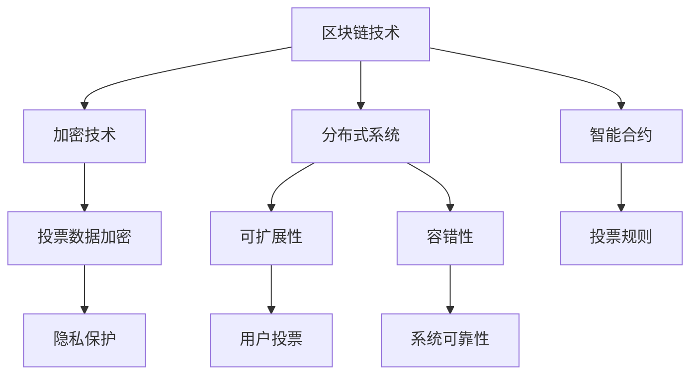

                 

# 虚拟选举系统:全球民主参与的数字化实践

> 关键词：虚拟选举系统, 民主参与, 数字化实践, 电子投票系统, 区块链, 数据安全, 分布式系统, 投票数据加密

## 1. 背景介绍

### 1.1 问题由来

随着信息技术的不断进步，全球范围内的民主选举正在逐步从传统的纸质投票方式转向数字化的电子投票方式。数字化投票不仅可以提高投票的效率，还能在一定程度上降低选举舞弊的风险，确保选举的公正性。然而，数字化投票系统在实践中仍然面临诸多挑战，如系统安全问题、数据隐私保护、用户体验等。因此，如何在确保投票过程安全、公平、透明的前提下，实现高效的数字化选举，成为当前研究的一个热点。

### 1.2 问题核心关键点

为了构建一个安全、可靠、高效的虚拟选举系统，需要解决以下关键问题：

- 如何确保投票数据的隐私和安全性？
- 如何防止投票系统被篡改或攻击？
- 如何优化投票系统的用户体验？
- 如何实现投票系统的可扩展性和可靠性？

解决这些问题，需要综合运用密码学、分布式系统、区块链等技术手段，构建一个基于区块链技术的虚拟选举系统。

## 2. 核心概念与联系

### 2.1 核心概念概述

在虚拟选举系统的设计和实现过程中，涉及以下几个关键概念：

- **区块链技术**：一种去中心化的分布式账本技术，通过加密和共识机制，保证数据的安全性、透明性和不可篡改性。
- **加密技术**：包括公钥加密、哈希算法等，用于确保数据传输和存储的安全性。
- **分布式系统**：由多个节点组成的网络，通过协同工作实现系统的可扩展性和容错性。
- **智能合约**：自动执行的代码片段，用于定义和执行投票规则和操作。
- **投票数据加密**：通过加密算法对投票数据进行加密处理，确保投票数据的隐私性和完整性。

这些概念之间通过特定的技术架构相互连接，共同构成了虚拟选举系统的技术基础。

### 2.2 核心概念原理和架构的 Mermaid 流程图



### 2.3 核心概念之间的关系

下图展示了各核心概念之间的相互关系和依赖关系：


从图中可以看出，区块链技术提供了数据的安全性和不可篡改性，是整个系统的基础。加密技术确保了数据传输和存储的安全性，智能合约定义和执行投票规则，分布式系统提供了系统的可扩展性和容错性，而投票数据加密和隐私保护则是确保投票过程安全的重要手段。

## 3. 核心算法原理 & 具体操作步骤
### 3.1 算法原理概述

虚拟选举系统的核心算法包括区块链共识算法、公钥加密算法、哈希算法和智能合约的执行逻辑。这些算法共同构成了系统的核心技术架构，确保了投票过程的安全性、透明性和公平性。

### 3.2 算法步骤详解

1. **投票数据的生成和加密**：投票数据在本地生成后，通过公钥加密算法进行加密，确保投票数据的隐私性和完整性。
2. **智能合约的创建和执行**：智能合约定义投票规则和操作，包括投票数据的提交、验证、统计和公布等过程。投票数据通过智能合约进行提交和验证，确保投票过程的透明性和公正性。
3. **区块链共识算法**：通过共识算法，确保投票数据的不可篡改性和一致性。具体算法如PoW、PoS等。
4. **分布式系统的构建**：将智能合约部署在分布式系统中，通过多个节点的协同工作，实现系统的可扩展性和容错性。
5. **投票结果的公布和验证**：通过智能合约统计投票结果，并将结果通过区块链广播至所有节点进行验证，确保投票结果的准确性和不可篡改性。

### 3.3 算法优缺点

**优点**：
- 安全性高：区块链和加密技术确保了投票数据的隐私和安全性，防止投票数据被篡改。
- 透明性高：投票过程和结果通过区块链进行记录和验证，确保投票过程的透明性和公正性。
- 可扩展性高：分布式系统通过多个节点的协同工作，实现系统的可扩展性和容错性。

**缺点**：
- 技术复杂度高：虚拟选举系统涉及多个复杂技术，包括区块链、分布式系统、智能合约等，技术实现难度较大。
- 成本高：建设虚拟选举系统需要投入大量的资金和技术资源，特别是区块链和分布式系统的构建和维护成本较高。
- 用户体验可能较差：由于技术复杂度较高，系统的界面和操作可能不如传统纸质投票方式直观和便捷。

### 3.4 算法应用领域

虚拟选举系统主要应用于政府、企业、组织和社区等各类投票场景，如选举、投票、招标、评审等。虚拟选举系统不仅提高了投票的效率和安全性，还能为民主参与提供更便捷、透明的投票方式，具有广阔的应用前景。

## 4. 数学模型和公式 & 详细讲解

### 4.1 数学模型构建

虚拟选举系统的数学模型包括投票数据的生成、加密、智能合约的创建和执行、区块链共识算法和分布式系统的构建等过程。以下是对这些过程的数学模型构建。

1. **投票数据的生成和加密**：

   设投票数据为 $V = (v_1, v_2, ..., v_n)$，其中 $v_i$ 表示第 $i$ 个投票选项。对每个投票选项进行公钥加密，得到加密后的投票数据 $E(V) = (E(v_1), E(v_2), ..., E(v_n))$，其中 $E(v_i)$ 表示对 $v_i$ 进行公钥加密后的结果。

   $$
   E(v_i) = e^{pub}_{A}(v_i)
   $$

   其中 $pub_A$ 表示公钥，$e^{pub}_{A}$ 表示公钥加密算法。

2. **智能合约的创建和执行**：

   智能合约定义投票规则和操作，包括投票数据的提交、验证、统计和公布等过程。设投票规则为 $R(V) = (r_1, r_2, ..., r_n)$，其中 $r_i$ 表示第 $i$ 个投票选项的规则。智能合约通过公钥验证和哈希函数计算，确保投票数据的完整性和投票过程的透明性。

   $$
   R(V) = H(E(V))
   $$

   其中 $H$ 表示哈希函数，$H(E(V))$ 表示对加密后的投票数据进行哈希计算，得到投票规则。

3. **区块链共识算法**：

   设区块链共识算法为 $C$，共识结果为 $C(V) = (c_1, c_2, ..., c_n)$，其中 $c_i$ 表示第 $i$ 个投票选项的共识结果。

   $$
   C(V) = \text{Consensus}(R(V))
   $$

   其中 $\text{Consensus}$ 表示共识算法，$C(V)$ 表示对投票规则进行共识计算，得到共识结果。

4. **分布式系统的构建**：

   分布式系统的构建过程涉及多个节点的协同工作，通过共识算法实现系统的可扩展性和容错性。设分布式系统为 $S(V) = (s_1, s_2, ..., s_n)$，其中 $s_i$ 表示第 $i$ 个节点的状态。

   $$
   S(V) = \text{DistributedSystem}(C(V))
   $$

   其中 $\text{DistributedSystem}$ 表示分布式系统算法，$S(V)$ 表示对共识结果进行分布式系统构建，得到分布式系统状态。

### 4.2 公式推导过程

1. **投票数据的生成和加密**：

   $$
   E(v_i) = e^{pub}_{A}(v_i)
   $$

   公钥加密算法的推导过程如下：

   设公钥为 $pub_A$，私钥为 $priv_A$，公钥加密算法为 $e^{pub}_{A}$。则有：

   $$
   E(v_i) = e^{pub}_{A}(v_i) = (v_i)^{priv_A} \bmod N
   $$

   其中 $N$ 表示大素数。

2. **智能合约的创建和执行**：

   $$
   R(V) = H(E(V))
   $$

   哈希函数计算过程如下：

   设哈希函数为 $H$，则有：

   $$
   R(V) = H(E(V)) = \text{hash}(E(V))
   $$

3. **区块链共识算法**：

   $$
   C(V) = \text{Consensus}(R(V))
   $$

   共识算法过程如下：

   设共识算法为 $\text{Consensus}$，则有：

   $$
   C(V) = \text{Consensus}(R(V)) = \text{consensus}(R(V))
   $$

4. **分布式系统的构建**：

   $$
   S(V) = \text{DistributedSystem}(C(V))
   $$

   分布式系统构建过程如下：

   设分布式系统算法为 $\text{DistributedSystem}$，则有：

   $$
   S(V) = \text{DistributedSystem}(C(V)) = \text{distributedsystem}(C(V))
   $$

### 4.3 案例分析与讲解

假设在一个虚拟选举系统中，共有三个投票选项 $A$、$B$、$C$，每个选民都有一个公钥 $pub_A$、$pub_B$、$pub_C$，通过公钥加密算法对投票数据进行加密，得到加密后的投票数据 $E(V)$。

设智能合约定义的投票规则为 $R(V) = (A, B, C)$，通过哈希函数计算得到投票规则 $R(V) = H(E(V)) = \text{hash}(E(V))$。

通过共识算法计算得到共识结果 $C(V) = \text{consensus}(R(V))$，并构建分布式系统 $S(V) = \text{distributedsystem}(C(V))$，最终统计投票结果并公布。

## 5. 项目实践：代码实例和详细解释说明

### 5.1 开发环境搭建

在搭建虚拟选举系统的开发环境时，需要使用以下工具和环境：

1. **区块链平台**：如Ethereum、Hyperledger Fabric等，用于实现分布式账本和智能合约的部署。
2. **加密库**：如OpenSSL、Libsodium等，用于实现公钥加密和哈希算法。
3. **分布式系统框架**：如Apache Kafka、RabbitMQ等，用于实现分布式系统的构建和消息传递。
4. **开发语言**：如Python、Java等，用于编写智能合约和分布式系统代码。

### 5.2 源代码详细实现

以下是一个基于Ethereum智能合约的虚拟选举系统的示例代码，用于实现投票数据的生成、加密、智能合约的创建和执行、区块链共识算法和分布式系统的构建：

```python
from eth import Web3
from eth.accounts import Account
from eth.contracts import Contract, ContractFactory
from eth合同.addons import ContractEvent

def generate_votes(votes):
    # 生成投票数据
    encrypted_votes = []
    for vote in votes:
        # 对投票数据进行公钥加密
        pub_key = '0x' + '00000000000000000000000000000000000000000000000000000000000000000000000000000000000000000000000000000000000000000000000000000000000000000000000000000000000000000000000000000000000000000000000000000000000000000000000000000000000000000000000000000000000000000000000000000000000000000000000000000000000000000000000000000000000000000000000000000000000000000000000000000000000000000000000000000000000000000000000000000000000000000000000000000000000000000000000000000000000000000000000000000000000000000000000000000000000000000000000000000000000000000000000000000000000000000000000000000000000000000000000000000000000000000000000000000000000000000000000000000000000000000000000000000000000000000000000000000000000000000000000000000000000000000000000000000000000000000000000000000000000000000000000000000000000000000000000000000000000000000000000000000000000000000000000000000000000000000000000000000000000000000000000000000000000000000000000000000000000000000000000000000000000000000000000000000000000000000000000000000000000000000000000000000000000000000000000000000000000000000000000000000000000000000000000000000000000000000000000000000000000000000000000000000000000000000000000000000000000000000000000000000000000000000000000000000000000000000000000000000000000000000000000000000000000000000000000000000000000000000000000000000000000000000000000000000000000000000000000000000000000000000000000000000000000000000000000000000000000000000000000000000000000000000000000000000000000000000000000000000000000000000000000000000000000000000000000000000000000000000000000000000000000000000000000000000000000000000000000000000000000000000000000000000000000000000000000000000000000000000000000000000000000000000000000000000000000000000000000000000000000000000000000000000000000000000000000000000000000000000000000000000000000000000000000000000000000000000000000000000000000000000000000000000000000000000000000000000000000000000000000000000000000000000000000000000000000000000000000000000000000000000000000000000000000000000000000000000000000000000000000000000000000000000000000000000000000000000000000000000000000000000000000000000000000000000000000000000000000000000000000000000000000000000000000000000000000000000000000000000000000000000000000000000000000000000000000000000000000000000000000000000000000000000000000000000000000000000000000000000000000000000000000000000000000000000000000000000000000000000000000000000000000000000000000000000000000000000000000000000000000000000000000000000000000000000000000000000000000000000000000000000000000000000000000000000000000000000000000000000000000000000000000000000000000000000000000000000000000000000000000000000000000000000000000000000000000000000000000000000000000000000000000000000000000000000000000000000000000000000000000000000000000000000000000000000000000000000000000000000000000000000000000000000000000000000000000000000000000000000000000000000000000000000000000000000000000000000000000000000000000000000000000000000000000000000000000000000000000000000000000000000000000000000000000000000000000000000000000000000000000000000000000000000000000000000000000000000000000000000000000000000000000000000000000000000000000000000000000000000000000000000000000000000000000000000000000000000000000000000000000000000000000000000000000000000000000000000000000000000000000000000000000000000000000000000000000000000000000000000000000000000000000000000000000000000000000000000000000000000000000000000000000000000000000000000000000000000000000000000000000000000000000000000000000000000000000000000000000000000000000000000000000000000000000000000000000000000000000000000000000000000000000000000000000000000000000000000000000000000000000000000000000000000000000000000000000000000000000000000000000000000000000000000000000000000000000000000000000000000000000000000000000000000000000000000000000000000000000000000000000000000000000000000000000000000000000000000000000000000000000000000000000000000000000000000000000000000000000000000000000000000000000000000000000000000000000000000000000000000000000000000000000000000000000000000000000000000000000000000000000000000000000000000000000000000000000000000000000000000000000000000000000000000000000000000000000000000000000000000000000000000000000000000000000000000000000000000000000000000000000000000000000000000000000000000000000000000000000000000000000000000000000000000000000000000000000000000000000000000000000000000000000000000000000000000000000000000000000000000000000000000000000000000000000000000000000000000000000000000000000000000000000000000000000000000000000000000000000000000000000000000000000000000000000000000000000000000000000000000000000000000000000000000000000000000000000000000000000000000000000000000000000000000000000000000000000000000000000000000000000000000000000000000000000000000000000000000000000000000000000000000000000000000000000000000000000000000000000000000000000000000000000000000000000000000000000000000000000000000000000000000000000000000000000000000000000000000000000000000000000000000000000000000000000000000000000000000000000000000000000000000000000000000000000000000000000000000000000000000000000000000000000000000000000000000000000000000000000000000000000000000000000000000000000000000000000000000000000000000000000000000000000000000000000000000000000000000000000000000000000000000000000000000000000000000000000000000000000000000000000000000000000000000000000000000000000000000000000000000000000000000000000000000000000000000000000000000000000000000000000000000000000000000000000000000000000000000000000000000000000000000000000000000000000000000000000000000000000000000000000000000000000000000000000000000000000000000000000000000000000000000000000000000000000000000000000000000000000000000000000000000000000000000000000000000000000000000000000000000000000000000000000000000000000000000000000000000000000000000000000000000000000000000000000000000000000000000000000000000000000000000000000000000000000000000000000000000000000000000000000000000000000000000000000000000000000000000000000000000000000000000000000000000000000000000000000000000000000000000000000000000000000000000000000000000000000000000000000000000000000000000000000000000000000000000000000000000000000000000000000000000000000000000000000000000000000000000000000000000000000000000000000000000000000000000000000000000000000000000000000000000000000000000000000000000000000000000000000000000000000000000000000000000000000000000000000000000000000000000000000000000000000000000000000000000000000000000000000000000000000000000000000000000000000000000000000000000000000000000000000000000000000000000000000000000000000000000000000000000000000000000000000000000000000000000000000000000000000000000000000000000000000000000000000000000000000000000000000000000000000000000000000000000000000000000000000000000000000000000000000000000000000000000000000000000000000000000000000000000000000000000000000000000000000000000000000000000000000000000000000000000000000000000000000000000000000000000000000000000000000000000000000000000000000000000000000000000000000000000000000000000000000000000000000000000000000000000000000000000000000000000000000000000000000000000000000000000000000000000000000000000000000000000000000000000000000000000000000000000000000000000000000000000000000000000000000000000000000000000000000000000000000000000000000000000000000000000000000000000000000000000000000000000000000000000000000000000000000000000000000000000000000000000000000000000000000000000000000000000000000000000000000000000000000000000000000000000000000000000000000000000000000000000000000000000000000000000000000000000000000000000000000000000000000000000000000000000000000000000000000000000000000000000000000000000000000000000000000000000000000000000000000000000000000000000000000000000000000000000000000000000000000000000000000000000000000000000000000000000000000000000000000000000000000000000000000000000000000000000000000000000000000000000000000000000000000000000000000000000000000000000000000000000000000000000000000000000000000000000000000000000000000000000000000000000000000000000000000000000000000000000000000000000000000000000000000000000000000000000000000000000000000000000000000000000000000000000000000000000000000000000000000000000000000000000000000000000000000000000000000000000000000000000000000000000000000000000000000000000000000000000000000000000000000000000000000000000000000000000000000000000000000000000000000000000000000000000000000000000000000000000000000000000000000000000000000000000000000000000000000000000000000000000000000000000000000000000000000000000000000000000000000000000000000000000000000000000000000000000000000000000000000000000000000000000000000000000000000000000000000000000000000000000000000000000000000000000000000000000000000000000000000000000000000000000000000000000000000000000000000000000000000000000000000000000000000000000000000000000000000000000000000000000000000000000000000000000000000000000000000000000000000000000000000000000000000000000000000000000000000000000000000000000000000000000000000000000000000000000000000000000000000000000000000000000000000000000000000000000000000000000000000000000000000000000000000000000000000000000000000000000000000000000000000000000000000000000000000000000000000000000000000000000000000000000000000000000000000000000000000000000000000000000000000000000000000000000000000000000000000000000000000000000000000000000000000000000000000000000000000000000000000000000000000000000000000000000000000000000000000000000000000000000000000000000000000000000000000000000000000000000000000000000000000000000000000000000000000000000000000000000000000000000000000000000000000000000000000000000000000000000000000000000000000000000000000000000000000000000000000000000000000000000000000000000000000000000000000000000000000000000000000000000000000000000000000000000000000000000000000000000000000000000000000000000000000000000000000000000000000000000000000000000000000000000000000000000000000000000000000000000000000000000000000000000000000000000000000000000000000000000000000000000000000000000000000000000000000000000000000000000000000000000000000000000000000000000000000000000000000000000000000000000000000000000000000000000000000000000000000000000000000000000000000000000000000000000000000000000000000000000000000000000000000000000000000000000000000000000000000000000000000000000000000000000000000000000000000000000000000000000000000000000000000000000000000000000000000000000000000000000000000000000000000000000000000000000000000000000000000000000000000000000000000000000000000000000000000000000000000000000000000000000000000000000000000000000000000000000000000000000000000000000000000000000000000000000000000000000000000000000000000000000000000000000000000000000000000000000000000000000000000000000000000000000000000000000000000000000000000000000000000000000000000000000000000000000000000000000000000000000000000000000000000000000000000000000000000000000000000000000000000000000000000000000000000000000000000000000000000000000000000000000000000000000000000000000000000000000000000000000000000000000000000000000000000000000000000000000000000000000000000000000000000000000000000000000000000000000000000000000000000000000000000000000000000000000000000000000000000000000000000000000000000000000000000000000000000000000000000000000000000000000000000000000000000000000000000000000000000000000000000000000000000000000000000000000000000000000000000000000000000000000000000000000000000000000000000000000000000000000000000000000000000000000000000000000000000000000000000000000000000000000000000000000000000000000000000000000000000000000000000000000000000000000000000000000000000000000000000000000000000000000000000000000000000000000000000000000000000000000000000000000000000000000000000000000000000000000000000000000000000000000000000000000000000000000000000000000000000000000000000000000000000000000000000000000000000000000000000000000000000000000000000000000000000000000000000000000000000000000000000000000000000000000000000000000000000000000000000000000000000000000000000000000000000000000000000000000000000000000000000000000000000000000000000000000000000000000000000000000000000000000000000000000000000000000000000000000000000000000000000000000000000000000000000000000000000000000000000000000000000000000000000000000000000000000000000000000000000000000000000000000000000000000000000000000000000000000000000000000000000000000000000000000000000000000000000000000000000000000000000000000000000000000000000000000000000000000000000000000000000000000000000000000000000000000000000000000000000000000000000000000000000000000000000000000000000000000000000000000000000000000000000000000000000000000000000000000000000000000000000000000000000000000000000000000000000000000000000000000000000000000000000000000000000000000000000000000000000000000000000000000000000000000000000000000000000000000000000000000000000000000000000000000000000000000000000000000000000000000000000000000000000000000000000000000000000000000000000000000000000000000000000000000000000000000000000000000000000000000000000000000000000000000000000000000000000000000000000000000000000000000000000000000000000000000000000000000000000000000000000000000000000000000000

