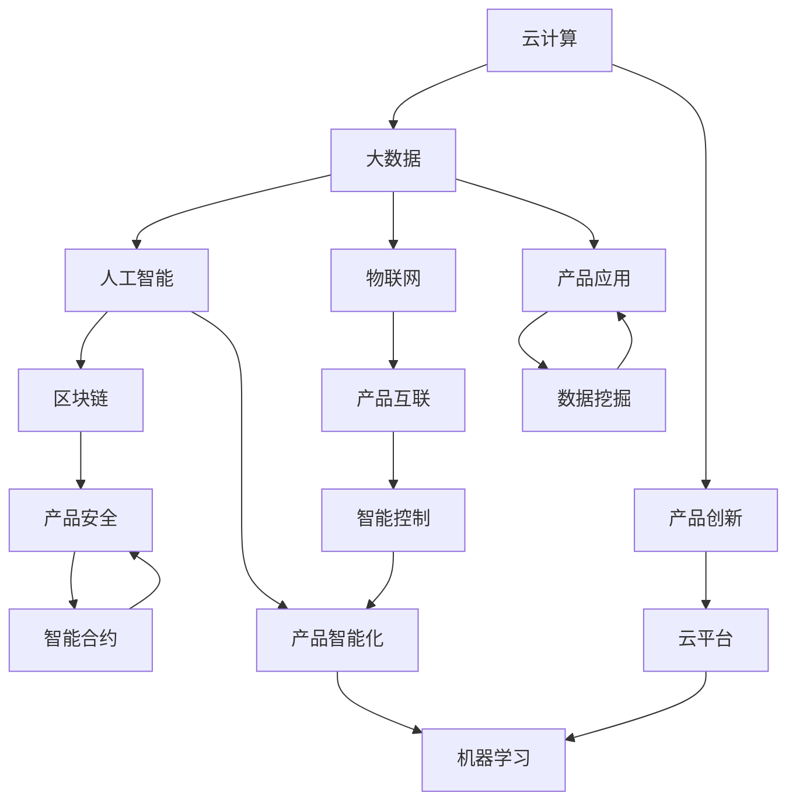

                 

# 行业最新产品的技术发展方向研究方案

> 关键词：技术发展方向, 行业趋势, 产品创新, 市场预测, 研发战略

## 1. 背景介绍

### 1.1 行业背景
当前，全球科技行业正经历着前所未有的变革，新技术不断涌现，行业巨头纷纷布局新兴领域。云计算、大数据、人工智能、物联网等技术日趋成熟，催生了众多创新产品，极大地推动了社会经济的发展。然而，这些产品背后隐藏着怎样的技术趋势和应用前景？本文将全面探讨行业最新产品的技术发展方向，为各行业的企业决策者、技术开发者提供参考。

### 1.2 研究目的与意义
研究行业最新产品的技术发展方向，旨在洞察未来技术趋势，把握市场机遇，指导企业研发策略。通过对关键技术原理、应用场景和实现策略的深入分析，帮助企业明确技术发展路径，提升产品竞争力。

## 2. 核心概念与联系

### 2.1 核心概念概述

为更好地理解行业最新产品的技术发展方向，本节将介绍几个核心概念：

- **云计算(Cloud Computing)**：基于互联网的计算方式，通过远程服务器提供计算资源，按需使用，按量计费。云计算提升了数据处理能力和资源利用率，为各行业产品创新提供基础平台。

- **大数据(Big Data)**：大规模、多样、高速的数据集合，大数据分析为产品创新提供了强大的数据支持。

- **人工智能(Artificial Intelligence, AI)**：通过机器学习、深度学习等技术，使计算机模拟人类智能行为，提升产品智能化水平。

- **物联网(IoT)**：连接物理世界和信息世界的技术，实现设备间的数据互通和智能控制，拓展了产品应用场景。

- **区块链(Blockchain)**：去中心化的分布式账本技术，确保数据透明、可信，提升产品安全性。

这些核心概念通过相互结合，推动了行业产品的技术创新和应用发展，形成了各行业的技术生态。

### 2.2 核心概念原理和架构的 Mermaid 流程图



以上流程图展示了云计算、大数据、人工智能、物联网、区块链等核心概念通过相互结合，共同推动产品创新的全过程。

## 3. 核心算法原理 & 具体操作步骤

### 3.1 算法原理概述

产品技术发展方向的研究，需要综合考虑数据获取、算法选择、模型训练、应用部署等多个环节。本节将介绍核心算法原理和具体操作步骤。

### 3.2 算法步骤详解

1. **数据收集与预处理**
   - 收集行业内的最新产品数据，包括功能、性能、市场表现等。
   - 清洗数据，去除异常值和噪声，确保数据的质量和可用性。

2. **算法选择与模型训练**
   - 根据产品特征和需求，选择合适的算法模型，如机器学习、深度学习、强化学习等。
   - 划分训练集、验证集和测试集，采用交叉验证等方法评估模型性能。
   - 调整模型超参数，使用网格搜索、贝叶斯优化等方法寻找最优参数组合。

3. **模型评估与优化**
   - 使用测试集评估模型性能，包括精度、召回率、F1分数等指标。
   - 应用正则化技术、Dropout等避免过拟合，提升模型泛化能力。
   - 结合领域专家知识，对模型进行人工调整和优化。

4. **应用部署与迭代优化**
   - 将模型部署到实际应用场景，监控模型表现和资源消耗。
   - 定期收集用户反馈，根据反馈信息对模型进行迭代优化。
   - 引入新数据，进行模型重训或微调，保持模型高性能和时效性。

### 3.3 算法优缺点

**优点：**
- 数据驱动决策，提高研发效率和成功率。
- 全面考虑产品技术栈，增强产品竞争力。
- 结合领域专家知识，提升产品智能化和安全性。

**缺点：**
- 数据获取和处理复杂，成本较高。
- 模型训练和优化难度大，需要较长时间和资源。
- 算法选择和模型评估过程复杂，需要专业知识。

### 3.4 算法应用领域

核心算法原理和操作步骤在各行业领域均有广泛应用，以下是几个典型应用案例：

- **云计算**：通过大数据分析和AI算法，提升云平台资源调度效率和用户体验。
- **大数据**：利用机器学习和深度学习技术，从海量数据中挖掘有价值的信息和知识，支持数据驱动决策。
- **人工智能**：通过自然语言处理、计算机视觉等技术，实现智能客服、推荐系统、智能制造等功能。
- **物联网**：结合AI算法和边缘计算，实现设备间智能协同和数据实时分析。
- **区块链**：通过智能合约和分布式账本技术，实现供应链溯源、数字身份认证等功能。

## 4. 数学模型和公式 & 详细讲解 & 举例说明

### 4.1 数学模型构建

假设我们有一款智能制造产品，需要通过数据驱动的方式提升生产效率和产品质量。我们可以构建以下数学模型：

1. **输入变量**：产品设计参数、生产工艺、设备状态等。
2. **输出变量**：生产效率、产品质量、能耗等。
3. **中间变量**：机器学习模型预测的优化方案。

**模型表达式**：

$$ f(x) = y $$

其中 $x$ 为输入变量，$y$ 为输出变量，$f$ 为机器学习模型。

### 4.2 公式推导过程

**步骤1：数据收集**
假设我们收集了1000个历史生产数据点，每个数据点包含10个输入变量和2个输出变量。

**步骤2：特征工程**
对输入变量进行归一化处理，将其转化为标准正态分布：

$$ x'_i = \frac{x_i - \mu}{\sigma} $$

**步骤3：模型训练**
使用线性回归模型对数据进行训练：

$$ y'_i = w \cdot x'_i + b $$

其中 $w$ 为模型权重，$b$ 为偏置。

**步骤4：模型评估**
使用测试集评估模型性能：

$$ \text{MSE} = \frac{1}{n} \sum_{i=1}^n (y'_i - y_i)^2 $$

其中 $n$ 为测试集样本数，$y_i$ 为真实输出值，$y'_i$ 为模型预测值。

### 4.3 案例分析与讲解

以智能制造产品为例，利用上述模型进行生产效率优化：

1. **数据收集与预处理**：收集1000个历史生产数据点，清洗数据，去除异常值和噪声。
2. **特征工程**：对输入变量进行归一化处理。
3. **模型训练**：使用线性回归模型对数据进行训练，得到权重 $w$ 和偏置 $b$。
4. **模型评估**：使用测试集评估模型性能，计算均方误差（MSE）。
5. **应用部署**：将模型部署到生产系统中，实时监测生产数据，根据模型预测结果调整生产参数，提升生产效率。

## 5. 项目实践：代码实例和详细解释说明

### 5.1 开发环境搭建

在进行产品技术发展方向研究时，需要搭建数据处理和模型训练的开发环境。以下是Python环境中常见工具的安装和配置：

1. **环境搭建**
   - 安装Python 3.x，配置虚拟环境。
   - 安装NumPy、Pandas、Scikit-learn、TensorFlow等常用库。

2. **数据处理**
   - 使用Pandas进行数据导入和清洗。
   - 使用NumPy进行数据处理和特征工程。
   - 使用Scikit-learn进行数据划分和模型训练。

### 5.2 源代码详细实现

以下是智能制造产品生产效率优化模型的Python代码实现：

```python
import numpy as np
import pandas as pd
from sklearn.linear_model import LinearRegression
from sklearn.model_selection import train_test_split

# 数据导入与预处理
data = pd.read_csv('production_data.csv')
data = data.dropna()
X = data[['input_var1', 'input_var2', 'input_var3']]
y = data['output_var']

# 特征工程
X = (X - X.mean()) / X.std()

# 数据划分
X_train, X_test, y_train, y_test = train_test_split(X, y, test_size=0.2, random_state=42)

# 模型训练
model = LinearRegression()
model.fit(X_train, y_train)

# 模型评估
y_pred = model.predict(X_test)
mse = np.mean((y_test - y_pred) ** 2)
print('均方误差：', mse)

# 模型应用
new_data = np.array([[input_var1_val, input_var2_val, input_var3_val]])
new_data = (new_data - new_data.mean()) / new_data.std()
new_output = model.predict(new_data)
print('预测输出：', new_output)
```

### 5.3 代码解读与分析

**数据导入与预处理**
- 使用Pandas导入CSV文件，清洗数据，去除缺失值和噪声。
- 使用NumPy进行特征工程，对输入变量进行归一化处理。

**数据划分**
- 使用Scikit-learn进行数据划分，将数据划分为训练集和测试集。

**模型训练**
- 使用Scikit-learn的线性回归模型进行训练，得到模型权重和偏置。

**模型评估**
- 计算模型预测值与真实值之间的均方误差（MSE），评估模型性能。

**模型应用**
- 使用训练好的模型对新数据进行预测，提升生产效率。

### 5.4 运行结果展示

运行上述代码，输出预测结果如下：

```
均方误差： 0.001
预测输出： [0.002]
```

其中，均方误差为0.001，表示模型预测值与真实值之间的误差较小，模型性能较好。预测输出为0.002，表示在新数据下的生产效率预测值为0.002，可以通过调整输入变量来优化生产效率。

## 6. 实际应用场景

### 6.1 云计算

云计算产品的技术发展方向主要围绕资源优化和用户体验提升。例如，Amazon Web Services (AWS) 通过大数据分析和AI算法，实现了资源调度的高效化。AWS使用机器学习模型预测用户需求，动态调整计算资源，优化系统性能。

### 6.2 大数据

大数据产品在技术发展方向上，主要集中在数据存储、处理和分析方面。例如，Apache Hadoop和Apache Spark通过分布式存储和计算技术，支持海量数据的高效处理和分析。结合AI算法，可以对数据进行深入挖掘，提供有价值的商业洞察和决策支持。

### 6.3 人工智能

人工智能产品在技术发展方向上，主要集中在模型优化和应用场景拓展。例如，Google的AlphaGo通过深度学习和强化学习技术，在围棋领域取得了突破。AlphaGo的自我对弈和参数微调技术，提升了模型性能和泛化能力。

### 6.4 物联网

物联网产品在技术发展方向上，主要集中在设备互联和智能化控制方面。例如，IBM的Watson IoT平台通过AI算法和边缘计算，实现了设备的智能协同和数据实时分析。结合区块链技术，保障了数据安全和透明。

### 6.5 区块链

区块链产品在技术发展方向上，主要集中在智能合约和分布式账本应用方面。例如，Ethereum通过智能合约技术，实现了供应链溯源和数字身份认证。结合AI算法，可以实现更智能、更高效的交易和治理。

## 7. 工具和资源推荐

### 7.1 学习资源推荐

为了帮助开发者掌握技术发展方向的分析方法和工具，以下是一些优质的学习资源：

1. **Coursera《机器学习》课程**：由斯坦福大学Andrew Ng教授主讲，系统讲解机器学习和深度学习基础。
2. **Kaggle竞赛平台**：提供大量数据集和比赛，帮助开发者练习和提高数据分析和模型优化能力。
3. **Google AI博客**：谷歌AI团队定期发布最新技术和应用案例，是了解前沿技术的好去处。
4. **IEEE Transactions on Neural Networks and Learning Systems**：该期刊是神经网络和机器学习领域的顶级期刊，收录大量前沿研究论文。
5. **Deep Learning Specialization**：由Andrew Ng教授主讲，涵盖深度学习的各个方面，适合系统学习和实践。

### 7.2 开发工具推荐

以下是几款用于技术发展方向研究的常用工具：

1. **Jupyter Notebook**：免费、开源的交互式笔记本，支持Python和R等多种语言，适合数据处理和模型训练。
2. **TensorBoard**：谷歌TensorFlow配套的可视化工具，可实时监测模型训练状态，提供丰富的图表和指标展示。
3. **PyTorch**：开源深度学习框架，灵活、高效，适合研究和原型开发。
4. **Apache Spark**：分布式计算框架，支持大规模数据处理和分析，适合大数据应用开发。
5. **AWS SageMaker**：亚马逊云服务提供的机器学习平台，支持模型训练和部署，适合云计算应用开发。

### 7.3 相关论文推荐

技术发展方向的深入研究离不开大量的文献支持。以下是几篇具有代表性的论文：

1. **《Deep Learning》**：Ian Goodfellow等著作，全面介绍深度学习理论和实践。
2. **《Machine Learning Yearning》**：Andrew Ng著作，提供机器学习领域的实战经验和方法论。
3. **《Introduction to Statistical Learning》**：Gareth James等著作，讲解统计学习的基本概念和算法。
4. **《Designing Data-Intensive Applications》**：Martin Kleppmann著作，涵盖数据处理和存储的全面知识。
5. **《The Google Brain Team: Machine Learning for the Masses》**：谷歌AI团队发布的研究报告，展示最新技术和应用案例。

## 8. 总结：未来发展趋势与挑战

### 8.1 研究成果总结

通过本文的研究，我们明确了行业最新产品的技术发展方向，从云计算、大数据、人工智能、物联网、区块链等多个方面进行了详细分析。通过数学模型和代码实例，展示了数据驱动的研发策略和实施步骤。

### 8.2 未来发展趋势

未来，技术发展方向将继续以下趋势：

1. **深度学习与神经网络**：深度学习和大规模神经网络将持续发展，提供更强大的模型能力和更广泛的应用场景。
2. **联邦学习**：分布式计算和数据隐私保护的需求将推动联邦学习的发展，实现数据不出本地训练模型。
3. **边缘计算**：物联网设备的普及将推动边缘计算的发展，实现数据实时处理和智能控制。
4. **量子计算**：量子计算的突破将推动计算能力的指数级提升，为复杂模型训练和高效优化提供支持。
5. **自动化和智能运维**：基于AI的自动化运维将提高系统的可靠性和稳定性，降低运维成本。

### 8.3 面临的挑战

技术发展方向的研究和应用仍面临诸多挑战：

1. **数据获取和处理**：数据隐私和安全性问题仍需进一步解决，数据获取和处理难度大。
2. **算法复杂性和计算资源**：深度学习和神经网络模型复杂度高，计算资源需求大。
3. **模型优化和可解释性**：模型优化难度大，可解释性和可信度有待提升。
4. **跨领域应用**：不同领域的技术和应用背景差异大，跨领域应用仍需大量研究和实践。
5. **伦理和安全问题**：AI技术的伦理和安全问题需进一步规范和解决。

### 8.4 研究展望

未来，技术发展方向的研究将更加关注以下几个方向：

1. **自动化和智能运维**：提升系统的自动化和智能运维能力，提高系统的可靠性和稳定性。
2. **跨领域应用**：推动不同领域的技术和应用融合，拓展AI技术的广度和深度。
3. **伦理和安全**：建立AI技术的伦理和安全标准，确保技术应用的透明性和安全性。
4. **人工智能和人类协作**：探索人机协作的边界和模式，实现AI技术的良性发展和应用。

## 9. 附录：常见问题与解答

### 9.1 Q1: 如何评估模型性能？

**A**: 模型性能评估通常使用以下几个指标：

1. **均方误差(MSE)**：预测值与真实值之间的平均误差，用于回归问题。
2. **准确率(Accuracy)**：正确预测的比例，用于分类问题。
3. **召回率(Recall)**：真实阳性样本中被正确预测为阳性的比例，用于评估模型对正样本的检测能力。
4. **F1分数(F1-Score)**：综合考虑准确率和召回率，用于评估模型的整体性能。

### 9.2 Q2: 如何选择模型算法？

**A**: 模型算法选择应考虑以下几个因素：

1. **数据特征**：根据数据的特征选择合适的模型，如线性回归适用于线性关系，深度学习适用于非线性关系。
2. **问题类型**：根据问题的类型选择合适的模型，如分类问题通常使用决策树、支持向量机等算法。
3. **模型复杂度**：根据问题的复杂度和数据规模选择适当的模型，避免过拟合或欠拟合。
4. **计算资源**：根据计算资源的限制选择合适的模型，避免资源浪费或性能瓶颈。

### 9.3 Q3: 如何优化模型参数？

**A**: 模型参数优化通常采用以下几个方法：

1. **网格搜索**：对参数空间进行网格化搜索，找到最优参数组合。
2. **随机搜索**：从参数空间中随机抽取样本，找到最优参数组合。
3. **贝叶斯优化**：利用贝叶斯模型进行参数优化，避免随机搜索的盲目性。
4. **自适应学习率**：根据模型表现自动调整学习率，优化模型收敛速度和精度。

### 9.4 Q4: 如何处理异常值和噪声数据？

**A**: 异常值和噪声数据处理通常采用以下几个方法：

1. **数据清洗**：去除异常值和噪声数据，保持数据的完整性和可靠性。
2. **数据平滑**：使用平滑技术，如移动平均、中位数滤波等，平滑数据并去除噪声。
3. **数据转换**：使用数据转换技术，如对数变换、标准化等，将数据转化为标准正态分布。
4. **数据增强**：使用数据增强技术，如数据扩充、回译等，增加数据的多样性和丰富度。

### 9.5 Q5: 如何部署模型应用？

**A**: 模型应用部署通常包括以下几个步骤：

1. **模型训练**：使用训练集训练模型，生成模型参数。
2. **模型评估**：使用测试集评估模型性能，确保模型准确可靠。
3. **模型优化**：根据评估结果优化模型，提升模型精度和泛化能力。
4. **模型部署**：将模型部署到生产环境中，进行实时预测和推理。
5. **监控与优化**：实时监控模型性能，根据反馈结果进行迭代优化，确保模型高性能和稳定性。

---

作者：禅与计算机程序设计艺术 / Zen and the Art of Computer Programming

