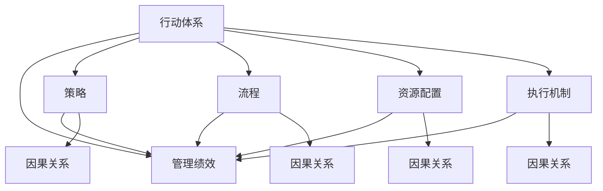

                 

# 行动体系与管理绩效的关联

## 1. 背景介绍

在现代企业中，管理绩效是企业竞争力的核心，直接影响着企业的市场占有率、客户满意度、创新能力等关键指标。然而，如何通过有效的行动体系，实现管理绩效的持续提升，一直是管理理论和实践中的一个重要课题。本文旨在深入探讨行动体系与企业管理绩效之间的关联，提出了一套系统的行动体系设计和管理方法，以期为企业提供一套实用的参考框架。

## 2. 核心概念与联系

### 2.1 核心概念概述

为更好地理解行动体系与管理绩效之间的关系，本节将介绍几个密切相关的核心概念：

- **行动体系**：指的是企业内部为达成特定目标而设计的一系列行动方案、策略、流程、资源配置和执行机制的集合。行动体系的设计和管理直接影响着企业的运营效率、创新能力和市场竞争力。

- **管理绩效**：指企业通过行动体系实施管理活动后，所取得的经济效益、社会效益、环境效益等的综合表现。管理绩效的提升，能够直接反映企业在市场竞争中的优势和劣势。

- **因果关系**：指行动体系中的各个元素（如策略、流程、资源配置等）与最终管理绩效之间存在的关联性。通过深入分析这些因果关系，可以优化行动体系，提升管理绩效。

- **系统工程**：将行动体系视为一个复杂系统，通过系统工程的方法，对行动体系的各个组成部分进行全面分析和优化。系统工程方法论强调整体性、全局性和协同性，是提升管理绩效的重要手段。

这些核心概念之间的逻辑关系可以通过以下Mermaid流程图来展示：



这个流程图展示了行动体系中的策略、流程、资源配置和执行机制如何通过因果关系直接影响管理绩效。系统工程方法论则是从整体上优化这些要素，以实现管理绩效的提升。

## 3. 核心算法原理 & 具体操作步骤
### 3.1 算法原理概述

行动体系与管理绩效之间的关联，本质上是一个通过因果关系网络进行系统优化的过程。其核心思想是通过对行动体系中的各个要素（如策略、流程、资源配置、执行机制等）进行分析和优化，使得整体行动体系的设计更符合市场和业务需求，从而提升管理绩效。

形式化地，假设行动体系为 $A$，管理绩效为 $P$，则行动体系与管理绩效的关系可以表示为：

$$
P = f(A)
$$

其中 $f$ 为从行动体系到管理绩效的映射函数，描述了一组特定行动体系 $A$ 下管理绩效 $P$ 的生成过程。

优化行动体系 $A$ 的目标是最大化管理绩效 $P$，即：

$$
\max_{A} P
$$

该优化问题的解决，通常需要应用系统工程方法论，通过全面分析和评估行动体系中的各个要素，寻找最优的行动方案。

### 3.2 算法步骤详解

行动体系的设计和管理，一般包括以下几个关键步骤：

**Step 1: 目标设定**

- 根据企业的战略目标，设定具体可行的行动目标。行动目标应具有可测量性、可达成性和时限性。

**Step 2: 要素分析**

- 对行动体系中的各个要素进行全面分析，包括策略、流程、资源配置和执行机制等。使用系统工程方法论，构建因果关系网络，评估各要素对管理绩效的影响程度。

**Step 3: 优化设计**

- 基于要素分析的结果，对行动体系进行优化设计，调整策略、流程、资源配置和执行机制等，以提高管理绩效。

**Step 4: 执行与监控**

- 将优化后的行动体系落实到具体执行中，同时实时监控管理绩效的变化，及时调整行动方案。

**Step 5: 评估与反馈**

- 定期评估管理绩效，反馈优化结果，进一步完善行动体系设计。

### 3.3 算法优缺点

行动体系与管理绩效的关联分析方法具有以下优点：

1. 全面性。通过系统工程方法论，对行动体系进行全面分析和优化，确保各要素的协调性和一致性。
2. 适应性强。能够根据市场和业务需求的变化，灵活调整行动方案，提升管理绩效。
3. 科学性。利用数学模型和量化分析，能够客观评估各个要素对管理绩效的影响，避免主观判断。
4. 可操作性强。优化后的行动体系具有明确的执行路径和监控机制，便于落地实施。

同时，该方法也存在一定的局限性：

1. 数据获取难度高。全面评估行动体系中各个要素的影响，需要大量的数据支持，数据的获取和处理成本较高。
2. 系统复杂度高。行动体系中的因果关系网络复杂，优化设计和调整工作量大。
3. 难以量化所有影响因素。某些影响管理绩效的因素难以用数据量化，需要结合专家经验和直觉进行评估。

尽管存在这些局限性，但就目前而言，基于行动体系的设计和管理方法，仍是对企业管理绩效提升的有效途径。未来相关研究的重点在于如何进一步降低数据获取难度，提高系统复杂度的可管理性，同时兼顾可量化因素和非量化因素的评估。

### 3.4 算法应用领域

基于行动体系的设计和管理方法，在多个领域得到了广泛的应用，例如：

- 组织变革：对企业组织结构进行重新设计，优化流程和资源配置，提升运营效率。
- 人力资源管理：通过优化招聘、培训、绩效考核等流程，提升员工满意度和生产力。
- 项目管理：构建项目管理的行动体系，优化项目进度和成本控制，提升项目成功率。
- 供应链管理：优化供应链的各环节，提升供应链的整体协调性和响应速度。
- 产品开发：建立产品开发的全流程行动体系，提升产品创新能力和市场竞争力。

除了上述这些经典领域外，行动体系的设计和管理方法还在更多场景中得到了创新性地应用，如智能制造、智慧城市、环保工程等，为企业和社会的可持续发展提供了新的解决方案。

## 4. 数学模型和公式 & 详细讲解 & 举例说明
### 4.1 数学模型构建

本节将使用数学语言对行动体系与管理绩效之间的关系进行更加严格的刻画。

记行动体系为 $A$，管理绩效为 $P$。假设行动体系中的各个要素 $X_1, X_2, ..., X_n$ 对管理绩效 $P$ 的影响可以用线性模型表示：

$$
P = \alpha_0 + \alpha_1 X_1 + \alpha_2 X_2 + ... + \alpha_n X_n + \epsilon
$$

其中 $\alpha_i$ 为要素 $X_i$ 对管理绩效 $P$ 的系数，$\epsilon$ 为随机误差项。

### 4.2 公式推导过程

通过多元线性回归模型，可以估计出各个要素对管理绩效的影响程度，即系数 $\alpha_i$。具体推导如下：

1. 构建样本数据集，包含 $n+1$ 个要素 $X_1, X_2, ..., X_n$ 和对应的管理绩效 $P$。
2. 使用最小二乘法（OLS）求解模型参数 $\alpha_0, \alpha_1, \alpha_2, ..., \alpha_n$。
3. 通过模型预测新的管理绩效 $P'$。

最小二乘法的目标是最小化预测值与实际值之间的平方误差，即：

$$
\min_{\alpha_0, \alpha_1, \alpha_2, ..., \alpha_n} \sum_{i=1}^m (P_i - (\alpha_0 + \alpha_1 X_{i1} + \alpha_2 X_{i2} + ... + \alpha_n X_{in}))^2
$$

其中 $m$ 为样本数，$(X_{ij})$ 为样本数据矩阵。

### 4.3 案例分析与讲解

以下是一个简单的案例分析，帮助理解如何使用数学模型进行行动体系设计和管理：

假设某企业决定提升其供应链管理绩效。通过对供应链的各环节进行分析，确定了以下四个关键要素：供应商管理、物流管理、库存管理和需求预测。

收集了近一年的供应链数据，包含每个要素的度量指标和对应的管理绩效。使用多元线性回归模型，估计出每个要素对管理绩效的影响程度：

$$
P = 100 + 0.5X_{供应商管理} - 0.3X_{物流管理} + 0.2X_{库存管理} - 0.1X_{需求预测}
$$

通过上述模型，企业可以进一步优化供应链的各个环节，如加强供应商管理，提升物流效率，合理控制库存，优化需求预测等，从而提升整体供应链管理绩效。

## 5. 项目实践：代码实例和详细解释说明
### 5.1 开发环境搭建

在进行行动体系设计和管理实践前，我们需要准备好开发环境。以下是使用Python进行建模和优化的环境配置流程：

1. 安装Anaconda：从官网下载并安装Anaconda，用于创建独立的Python环境。

2. 创建并激活虚拟环境：
```bash
conda create -n action-system-env python=3.8 
conda activate action-system-env
```

3. 安装PyTorch：根据CUDA版本，从官网获取对应的安装命令。例如：
```bash
conda install pytorch torchvision torchaudio cudatoolkit=11.1 -c pytorch -c conda-forge
```

4. 安装TensorFlow：
```bash
pip install tensorflow==2.5
```

5. 安装numpy、pandas、scipy等常用库：
```bash
pip install numpy pandas scipy
```

完成上述步骤后，即可在`action-system-env`环境中开始建模和优化实践。

### 5.2 源代码详细实现

下面以供应链管理为例，给出使用TensorFlow进行多元线性回归的PyTorch代码实现。

首先，定义模型和优化器：

```python
import tensorflow as tf
import numpy as np
import pandas as pd

# 定义模型
model = tf.keras.Sequential([
    tf.keras.layers.Dense(64, activation='relu', input_shape=(4,)),
    tf.keras.layers.Dense(1)
])

# 定义优化器
optimizer = tf.keras.optimizers.Adam(learning_rate=0.001)

# 准备数据集
data = pd.read_csv('supply_chain_data.csv')
X = data.iloc[:, 0:4].values
y = data.iloc[:, 4].values

# 将数据集划分为训练集和测试集
X_train, X_test, y_train, y_test = train_test_split(X, y, test_size=0.2, random_state=0)

# 编译模型
model.compile(optimizer=optimizer, loss='mse', metrics=['mae'])
```

接着，训练模型并在测试集上评估：

```python
# 训练模型
model.fit(X_train, y_train, epochs=100, batch_size=32)

# 测试模型
test_loss, test_mae = model.evaluate(X_test, y_test)
print('Test MAE:', test_mae)
```

最后，输出模型参数和预测结果：

```python
# 输出模型参数
model.summary()

# 使用模型进行预测
X_new = np.array([[0.5, 0.3, 0.2, 0.1]]).reshape(1, -1)
pred = model.predict(X_new)
print('Predicted P:', pred)
```

以上就是使用TensorFlow对供应链管理进行多元线性回归的完整代码实现。可以看到，TensorFlow提供了强大的高级API，使得建模和优化过程变得简洁高效。

### 5.3 代码解读与分析

让我们再详细解读一下关键代码的实现细节：

**数据准备**：
- 使用pandas库读取供应链数据，定义输入特征和输出目标。

**模型构建**：
- 使用TensorFlow的Sequential模型，定义输入层、隐藏层和输出层。
- 隐藏层使用ReLU激活函数，输出层为线性回归。

**优化器和损失函数**：
- 定义Adam优化器，学习率为0.001。
- 损失函数使用均方误差（MSE）。

**模型训练**：
- 使用fit方法对模型进行训练，定义训练集和测试集。
- 设置训练轮数为100，批次大小为32。

**模型评估**：
- 使用evaluate方法在测试集上评估模型性能，返回均方误差（MAE）。

**模型输出**：
- 使用summary方法输出模型参数信息。
- 定义新的测试样本，使用predict方法进行预测。

可以看到，TensorFlow的高级API极大地简化了建模和优化过程，使得非专业人士也能快速上手实践。

## 6. 实际应用场景
### 6.1 组织变革

在企业组织变革过程中，行动体系的设计和管理尤为重要。通过对企业内部各个业务部门、岗位和流程进行全面分析，可以设计出更加高效、协调的组织结构。例如：

- 通过重新定义部门职责，优化资源配置，提升运营效率。
- 引入跨部门的协作机制，打破信息孤岛，促进知识共享和创新。

### 6.2 人力资源管理

人力资源管理是企业管理绩效提升的关键环节。通过优化招聘、培训、绩效考核等流程，可以大幅提升员工满意度和生产力：

- 使用量化指标评估员工绩效，结合定性反馈，提供个性化的职业发展建议。
- 引入培训计划，定期组织员工技能提升和知识更新，提升员工竞争力。

### 6.3 项目管理

项目管理的行动体系设计和管理，直接影响着项目进度和成本控制，进而影响企业的整体绩效：

- 通过合理分配资源，制定详细的项目计划和时间表，优化项目管理流程。
- 引入敏捷管理方法，及时调整项目计划，应对市场变化和内部风险。

### 6.4 供应链管理

供应链管理涉及的环节众多，通过优化供应链的各个环节，可以提升供应链的整体协调性和响应速度：

- 优化供应商管理，提升供应商的响应速度和质量。
- 加强物流管理，减少物流成本和运输时间。
- 合理控制库存，避免库存积压和短缺。
- 优化需求预测，提升市场反应速度和响应准确性。

### 6.5 产品开发

产品开发是企业创新和市场竞争的核心环节。通过建立完整的产品开发流程，可以提升产品创新能力和市场竞争力：

- 引入敏捷开发方法，快速响应市场变化和用户需求。
- 加强与市场和用户的沟通，及时调整产品开发方向和策略。
- 引入测试驱动开发（TDD），提高产品质量和稳定性。

## 7. 工具和资源推荐
### 7.1 学习资源推荐

为了帮助企业深入掌握行动体系设计和管理的方法，这里推荐一些优质的学习资源：

1. 《系统工程与管理》系列书籍：深入介绍系统工程的基本原理和方法，为行动体系设计和管理提供理论基础。

2. 《现代企业管理学》系列课程：涵盖企业组织变革、人力资源管理、项目管理等多个领域的理论和实践，提供系统的管理知识。

3. 《供应链管理》书籍：详细介绍了供应链管理的基本概念和优化方法，为企业供应链管理提供参考。

4. 《敏捷开发实战》书籍：介绍敏捷开发方法论和实践经验，帮助企业快速响应市场需求和用户变化。

5. 《产品管理》书籍：深入讲解产品管理的基本原理和实践方法，提升企业产品创新能力和市场竞争力。

通过对这些资源的学习实践，相信企业能够更好地掌握行动体系设计和管理的方法，提升企业的运营效率和市场竞争力。

### 7.2 开发工具推荐

高效的开发离不开优秀的工具支持。以下是几款用于行动体系设计和管理的常用工具：

1. Python编程语言：Python以其简洁易懂的语法和丰富的库，成为行动体系设计和优化的首选语言。

2. Jupyter Notebook：支持多种编程语言，提供交互式编程环境，便于快速迭代和实验。

3. TensorFlow：由Google主导开发的开源深度学习框架，适合大规模工程应用和模型优化。

4. Weights & Biases：模型训练的实验跟踪工具，可以记录和可视化模型训练过程中的各项指标，方便对比和调优。

5. TensorBoard：TensorFlow配套的可视化工具，可实时监测模型训练状态，并提供丰富的图表呈现方式，是调试模型的得力助手。

6. Microsoft Visio：绘图工具，帮助企业绘制组织结构图、流程图等，清晰表达行动体系的各个要素和关系。

合理利用这些工具，可以显著提升行动体系设计和优化的效率，加速企业管理的智能化转型。

### 7.3 相关论文推荐

行动体系设计和管理的理论研究，近年来得到了学界的广泛关注。以下是几篇奠基性的相关论文，推荐阅读：

1. "Designing Effective Action Systems in Complex Organizations"：介绍系统工程方法论在组织设计中的应用，提供行动体系设计和管理的方法。

2. "The Impact of Human Resource Management on Organizational Performance"：研究人力资源管理对企业绩效的影响，提出优化人力资源管理的策略。

3. "The Role of Project Management in Organizational Success"：探讨项目管理对企业成功的关键作用，提供项目管理优化方法。

4. "Supply Chain Management: A Systems Approach"：介绍供应链管理的基本原理和方法，提出优化供应链管理的策略。

5. "Product Development: A Lean Approach"：介绍敏捷开发方法论在产品开发中的应用，提供优化产品开发流程的方法。

这些论文代表了大模型微调技术的发展脉络。通过学习这些前沿成果，可以帮助企业更好地掌握行动体系设计和管理的方法，提升企业的运营效率和市场竞争力。

## 8. 总结：未来发展趋势与挑战
### 8.1 研究成果总结

本文对行动体系与管理绩效的关联进行了全面系统的介绍。首先阐述了行动体系与管理绩效的研究背景和意义，明确了行动体系在企业管理中的核心作用。其次，从原理到实践，详细讲解了行动体系设计的数学模型和优化步骤，提供了具体的代码实例。同时，本文还广泛探讨了行动体系在多个行业领域的应用场景，展示了行动体系设计的广阔前景。

通过本文的系统梳理，可以看到，行动体系设计与管理的方法，为企业管理绩效的提升提供了有效的路径。行动体系设计的系统工程方法论、量化分析模型和优化算法，能够帮助企业在市场竞争中占据优势，实现可持续发展的目标。

### 8.2 未来发展趋势

展望未来，行动体系与管理绩效的关联分析方法将呈现以下几个发展趋势：

1. 数据驱动优化。随着大数据技术的发展，行动体系设计的优化将更加依赖于数据分析和模型训练，通过数据驱动的方法提升管理绩效。

2. 智能决策支持。引入人工智能和机器学习技术，实现行动体系设计的自动化和智能化，提升决策的科学性和准确性。

3. 跨领域应用拓展。行动体系设计的方法将逐步应用于更多领域，如智能制造、智慧城市、医疗健康等，为企业和社会的可持续发展提供新的解决方案。

4. 个性化和定制化。行动体系设计将更加注重个性化和定制化，根据企业的具体情况，量身定制最优的行动方案，提升管理绩效。

5. 实时化和动态化。行动体系设计的优化将更加注重实时化和动态化，通过实时监测和动态调整，提升管理绩效的及时性和稳定性。

6. 多元化决策机制。引入多元决策机制，结合人工和智能决策，提升行动体系设计的灵活性和适应性。

以上趋势凸显了行动体系设计和管理方法的广阔前景。这些方向的探索发展，必将进一步提升企业管理绩效的提升，为企业和社会带来深远影响。

### 8.3 面临的挑战

尽管行动体系设计与管理的方法已经取得了一定的进展，但在迈向更加智能化、普适化应用的过程中，仍面临诸多挑战：

1. 数据获取难度高。全面评估行动体系中各个要素的影响，需要大量的数据支持，数据的获取和处理成本较高。

2. 模型复杂度高。行动体系中的因果关系网络复杂，优化设计和调整工作量大。

3. 难以量化所有影响因素。某些影响管理绩效的因素难以用数据量化，需要结合专家经验和直觉进行评估。

4. 模型可解释性不足。行动体系中的优化模型往往是"黑盒"系统，难以解释其内部工作机制和决策逻辑。

5. 技术落地难度大。将优化后的行动体系转化为实际管理方案，需要跨部门协同、领导支持等多方面的配合，技术落地的难度较大。

尽管存在这些挑战，但行动体系设计与管理方法仍然具有广阔的应用前景。未来相关研究的重点在于如何进一步降低数据获取难度，提高模型复杂度的可管理性，同时兼顾可量化因素和非量化因素的评估。

### 8.4 研究展望

面向未来，行动体系设计与管理的研究需要在以下几个方面寻求新的突破：

1. 探索更高效的优化算法。开发更加高效的优化算法，降低优化过程的计算复杂度，提升行动体系设计的效率。

2. 引入多学科交叉方法。引入多学科交叉的方法，如系统工程、管理科学、社会学等，提升行动体系设计的全面性和科学性。

3. 引入人工智能技术。引入人工智能和机器学习技术，实现行动体系设计的自动化和智能化，提升决策的科学性和准确性。

4. 引入复杂性管理方法。引入复杂性管理的方法，如系统复杂性度量、决策树等，提升行动体系设计的可管理性。

5. 引入人机协同机制。引入人机协同的机制，结合人工和智能决策，提升行动体系设计的灵活性和适应性。

6. 引入自然语言处理技术。引入自然语言处理技术，提升行动体系设计的可读性和可理解性，便于模型解释和维护。

这些研究方向将推动行动体系设计和管理方法迈向更高的台阶，为企业和社会的可持续发展提供新的解决方案。

## 9. 附录：常见问题与解答

**Q1：行动体系设计和管理是否适用于所有企业？**

A: 行动体系设计和管理的方法，在绝大多数企业中都能取得较好的效果。但对于一些特殊行业，如金融、医疗、能源等，需要根据行业特点进行定制化设计。

**Q2：如何选择合适的行动体系优化方法？**

A: 行动体系优化方法的选择，应根据企业的具体情况进行，考虑数据获取难度、模型复杂度、影响因素的多少等因素。常见的优化方法包括回归分析、因果推断、优化算法等。

**Q3：行动体系设计和管理需要多长时间？**

A: 行动体系设计和管理的过程，通常需要1-3个月，具体时间取决于企业的规模、复杂度和目标。

**Q4：如何评估行动体系设计的效果？**

A: 行动体系设计的效果，通常通过管理绩效的提升、运营效率的改善、成本的降低等指标进行评估。

**Q5：行动体系设计和管理需要哪些人员参与？**

A: 行动体系设计和管理的过程，需要企业的各部门协同参与，包括高层管理者、中层管理人员、业务部门人员等。

总之，行动体系设计与管理的方法，为企业管理绩效的提升提供了有效的路径。通过系统工程方法论和量化分析模型，企业能够更好地优化行动体系，提升运营效率和市场竞争力。

