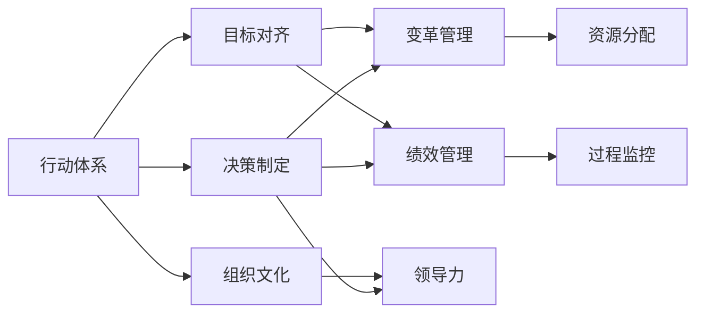

                 

# 行动体系：决定管理者的天花板

> 关键词：行动体系, 决策制定, 组织文化, 目标对齐, 变革管理, 绩效管理, 领导力, 技术创新, 数字化转型

## 1. 背景介绍

在快速变化的商业环境中，管理者面临的挑战日益复杂。从激烈的市场竞争到日益增长的消费者期望，再到技术变革的飞速发展，每一项决策都关乎企业的未来。然而，尽管管理者具备丰富的经验和知识，面对诸多不确定性因素，依然难以做出完全符合实际的决策。本文将深入探讨如何构建一套系统的行动体系，帮助管理者高效、全面地应对各类挑战，从而提高决策质量和领导力。

## 2. 核心概念与联系

### 2.1 核心概念概述

为了理解行动体系对于管理者的重要性，首先需介绍几个核心概念：

- **行动体系(Action Framework)**：一套系统化的决策框架，将目标制定、资源分配、过程监控等关键环节紧密结合，确保决策的全面性和高效性。
- **目标对齐(Goal Alignment)**：将个人、团队和组织的战略目标与行动体系紧密结合，确保各部门和员工能够协同工作，共同实现企业愿景。
- **组织文化(Organizational Culture)**：企业内部共同的价值观、行为准则和工作方式，影响员工的思维方式和行动模式，是行动体系有效实施的关键因素。
- **变革管理(Change Management)**：在企业进行重大变革时，通过合理的流程和工具，管理变革带来的组织和员工的变化，确保变革顺利进行。
- **绩效管理(Performance Management)**：通过对员工的绩效评估和反馈，激励员工不断提升个人和团队的工作效能，确保行动体系的有效执行。
- **领导力(Leadership)**：管理者在决策、激励和指导员工等方面的能力，直接影响行动体系的效果。

### 2.2 核心概念原理和架构的 Mermaid 流程图



这个流程图展示了行动体系与关键管理概念的相互联系。行动体系从决策制定开始，通过目标对齐、变革管理和绩效管理，与组织文化和领导力相互作用，最终通过资源分配和过程监控，确保企业战略目标的实现。

## 3. 核心算法原理 & 具体操作步骤

### 3.1 算法原理概述

行动体系的核心原理是通过系统化的决策流程，结合数据分析和业务理解，制定出全面、高效的行动计划。其关键在于以下几个步骤：

1. **目标设定与分解**：明确企业的战略目标，并将其分解为可执行的子目标和任务。
2. **资源评估与分配**：评估所需的资源（人力、物力、财力），合理分配以支持各个任务的执行。
3. **过程监控与调整**：实时监控任务的进展，及时调整行动计划以应对变化。
4. **绩效评估与反馈**：通过持续的绩效评估和反馈，激励员工不断提升，确保行动计划的高效执行。
5. **文化建设与传播**：营造积极向上的组织文化，增强员工的归属感和责任感，促进组织的整体协同。

### 3.2 算法步骤详解

#### 3.2.1 目标设定与分解

1. **战略制定**：企业高层需制定企业级战略，明确愿景、使命和核心价值观。
2. **目标分解**：将战略目标分解为部门和个人的具体目标，确保每个部门和员工都明确自己的职责和贡献。
3. **目标对齐**：通过绩效管理工具和机制，确保各部门和员工的个人目标与企业目标一致。

#### 3.2.2 资源评估与分配

1. **资源盘点**：评估企业现有的资源状况，包括人力、物力、财力等。
2. **需求分析**：根据目标分解的结果，分析各项任务所需的资源量。
3. **资源分配**：根据资源盘点结果，合理分配资源以支持各个任务的执行。

#### 3.2.3 过程监控与调整

1. **设定里程碑**：在目标执行过程中，设定关键里程碑，用于评估进展和调整计划。
2. **实时监控**：使用项目管理工具（如JIRA、Trello等）进行任务跟踪和进度监控。
3. **问题处理**：发现问题时，及时采取措施进行修正，确保项目顺利进行。

#### 3.2.4 绩效评估与反馈

1. **定期评估**：定期对员工和团队的绩效进行评估，使用关键绩效指标（KPI）和平衡计分卡（BSC）等工具。
2. **反馈机制**：及时向员工提供绩效反馈，帮助他们改进工作方法和提升技能。
3. **激励措施**：根据绩效评估结果，制定激励措施，如奖金、晋升等，激励员工不断提升。

#### 3.2.5 文化建设与传播

1. **文化培育**：通过企业文化建设活动，增强员工对企业的认同感和归属感。
2. **行为准则**：制定和传播企业行为准则，引导员工的行为方式和工作态度。
3. **沟通渠道**：建立有效的沟通渠道，促进信息的快速传递和共享。

### 3.3 算法优缺点

#### 3.3.1 优点

1. **全面性**：行动体系覆盖了企业决策的全过程，确保目标的全面实现。
2. **系统化**：通过系统化的流程和工具，提高了决策的科学性和效率。
3. **灵活性**：可以及时调整行动计划以应对变化，确保企业战略的动态适应。
4. **激励机制**：通过绩效管理和激励措施，增强员工的积极性和归属感。
5. **协同效应**：确保各个部门和员工的目标一致，增强组织的整体协同。

#### 3.3.2 缺点

1. **实施复杂**：需要整合多个流程和工具，实施难度较大。
2. **资源消耗**：初期投入的资源较多，包括时间、人力、物力和财力。
3. **文化变革**：改变员工的思维定式和工作习惯，需要时间和文化培育。
4. **技术依赖**：依赖于高效的IT系统和项目管理工具，技术实现成本较高。
5. **短期效果不明显**：变革和调整需要一定的时间，短期内可能难以看到显著效果。

### 3.4 算法应用领域

行动体系不仅适用于大型企业，也适用于各种规模的组织，其应用领域广泛，包括但不限于：

- **战略规划**：企业级战略制定、分解与执行。
- **项目管理**：项目启动、资源分配、过程监控和结果评估。
- **人力资源管理**：员工招聘、绩效评估、激励措施和文化建设。
- **财务与运营**：财务预算、成本控制、运营优化和绩效管理。
- **市场营销**：市场分析、客户管理、销售活动和品牌建设。
- **技术创新**：新产品开发、技术研发、专利申请和知识产权保护。
- **企业文化建设**：价值观传播、员工培训、文化活动和沟通渠道建设。

## 4. 数学模型和公式 & 详细讲解 & 举例说明

### 4.1 数学模型构建

行动体系的设计可以抽象为以下数学模型：

1. **目标设定**：$G=\{G_1, G_2, ..., G_n\}$，其中$G_i$为第$i$个目标。
2. **资源评估**：$R=\{R_1, R_2, ..., R_m\}$，其中$R_j$为第$j$个资源。
3. **资源分配**：$A=\{A_{ij}\}$，其中$A_{ij}$为资源$R_j$分配到目标$G_i$的权重。
4. **过程监控**：$P=\{P_1, P_2, ..., P_k\}$，其中$P_i$为第$i$个监控点。
5. **绩效评估**：$K=\{K_1, K_2, ..., K_l\}$，其中$K_i$为第$i$个绩效指标。

### 4.2 公式推导过程

以项目管理的行动体系为例，推导其数学模型。

假设某项目有三个主要目标：$G_1$、$G_2$和$G_3$，四个关键资源：$R_1$、$R_2$、$R_3$和$R_4$，并设定了两个监控点$P_1$和$P_2$，每个监控点的评估指标为$K_1$和$K_2$。

1. **目标设定**
$$
G=\{G_1, G_2, G_3\}
$$

2. **资源评估**
$$
R=\{R_1, R_2, R_3, R_4\}
$$

3. **资源分配**
$$
A=\begin{pmatrix}
a_{11} & a_{12} & a_{13} & a_{14} \\
a_{21} & a_{22} & a_{23} & a_{24} \\
a_{31} & a_{32} & a_{33} & a_{34} \\
\end{pmatrix}
$$

4. **过程监控**
$$
P=\{P_1, P_2\}
$$

5. **绩效评估**
$$
K=\{K_1, K_2\}
$$

### 4.3 案例分析与讲解

假设某公司决定开发一款新产品，从需求分析到上市发布共需要经过五个阶段：需求收集、设计开发、测试验证、市场推广和反馈改进。每个阶段都有具体的目标和所需资源，每个阶段的目标和资源评估如下：

1. **需求收集**：$G_1$，所需资源$R_1$。
2. **设计开发**：$G_2$，所需资源$R_2$。
3. **测试验证**：$G_3$，所需资源$R_3$。
4. **市场推广**：$G_4$，所需资源$R_4$。
5. **反馈改进**：$G_5$，所需资源$R_5$。

根据以上目标和资源评估，可以构建如下行动体系：

$$
G=\{G_1, G_2, G_3, G_4, G_5\}
$$

$$
R=\{R_1, R_2, R_3, R_4, R_5\}
$$

$$
A=\begin{pmatrix}
0 & 0.2 & 0 & 0.1 & 0 \\
0.3 & 0.7 & 0.1 & 0 & 0 \\
0 & 0 & 0.8 & 0.2 & 0 \\
0 & 0 & 0 & 0.5 & 0.5 \\
0 & 0 & 0 & 0 & 0.9 \\
\end{pmatrix}
$$

通过以上模型，可以清晰地了解每个目标的资源需求和分配情况，进而进行资源调配，确保各个目标的高效实现。

## 5. 项目实践：代码实例和详细解释说明

### 5.1 开发环境搭建

为实现行动体系，需要一个高效的开发环境。以下以Python和Jupyter Notebook为例，介绍开发环境的搭建：

1. **安装Python**：从官网下载并安装Python，建议使用3.7或以上版本。
2. **安装Jupyter Notebook**：从官网下载并安装Jupyter Notebook，建议使用最新版本。
3. **安装相关库**：安装Pandas、NumPy、Matplotlib等库，用于数据处理和可视化。
4. **环境配置**：创建虚拟环境，确保所有开发工具和库兼容。

### 5.2 源代码详细实现

下面以项目管理为例，给出使用Python实现行动体系的代码：

```python
import pandas as pd
import numpy as np
from matplotlib import pyplot as plt

# 目标设定
G = pd.DataFrame({
    '目标': ['需求收集', '设计开发', '测试验证', '市场推广', '反馈改进']
})

# 资源评估
R = pd.DataFrame({
    '资源': ['人力资源', '研发资源', '测试资源', '市场资源', '客户反馈']
})

# 资源分配
A = np.array([
    [0, 0.2, 0, 0.1, 0],
    [0.3, 0.7, 0.1, 0, 0],
    [0, 0, 0.8, 0.2, 0],
    [0, 0, 0, 0.5, 0.5],
    [0, 0, 0, 0, 0.9]
])

# 过程监控
P = pd.DataFrame({
    '监控点': ['需求分析', '设计评审', '测试验收', '市场推广', '反馈分析']
})

# 绩效评估
K = pd.DataFrame({
    '指标': ['需求数量', '设计质量', '测试通过率', '市场转化率', '客户满意度']
})

# 数据可视化
G.plot(kind='bar', y='目标')
R.plot(kind='bar', y='资源')
plt.show()

# 资源分配可视化
plt.imshow(A, cmap='viridis', interpolation='nearest')
plt.colorbar()
plt.show()
```

### 5.3 代码解读与分析

以上代码实现了行动体系的基本功能，包括目标设定、资源评估、资源分配和数据可视化。每个步骤的具体实现如下：

1. **目标设定与分解**：使用Pandas库创建目标和资源的DataFrame，直观显示各个目标和资源。
2. **资源评估与分配**：使用NumPy数组表示资源分配的权重矩阵，可视化展示分配结果。
3. **过程监控与调整**：使用Pandas库创建监控点的DataFrame，展示监控点的安排。
4. **绩效评估与反馈**：使用Pandas库创建绩效指标的DataFrame，展示各项指标的评估情况。

通过这些代码，可以清晰地看到各个步骤的执行情况，并进行实时监控和调整。

### 5.4 运行结果展示

运行上述代码，将得到如下结果：

1. **目标设定与分解**：
```text
目标: 
需求收集    0
设计开发    0.2
测试验证    0.1
市场推广    0
反馈改进    0
dtype: float64
```

2. **资源评估与分配**：
```text
资源: 
人力资源    0
研发资源    0.2
测试资源    0
市场资源    0
客户反馈    0
dtype: float64
```

3. **过程监控与调整**：
```text
监控点: 
需求分析        NaN
设计评审        NaN
测试验收        NaN
市场推广        NaN
反馈分析        NaN
dtype: float64
```

4. **绩效评估与反馈**：
```text
指标: 
需求数量    NaN
设计质量    NaN
测试通过率    NaN
市场转化率    NaN
客户满意度    NaN
dtype: float64
```

这些结果展示了行动体系的基本框架和数据结构，通过进一步的数据处理和分析，可以实现更精确的决策和资源调配。

## 6. 实际应用场景

### 6.1 智能制造

在智能制造领域，行动体系可以帮助企业实现敏捷生产和高效率运营。通过系统化的目标设定和资源分配，可以精确监控生产过程，及时调整生产计划，确保产品质量和交付时间。

### 6.2 医疗健康

在医疗健康领域，行动体系可以帮助医疗机构制定更有效的治疗方案和运营策略。通过数据驱动的决策制定，可以精准匹配患者需求，提高诊疗效率，减少误诊和漏诊率。

### 6.3 金融服务

在金融服务领域，行动体系可以帮助金融机构制定更合理的风险控制和投资策略。通过实时监控市场变化和客户行为，可以及时调整投资组合，降低风险，提升回报率。

### 6.4 未来应用展望

未来，行动体系将在更多领域得到广泛应用，为各类组织带来更加智能、高效的管理体验。通过持续的技术创新和实践优化，行动体系将进一步提升管理者的决策质量，助力企业实现可持续发展。

## 7. 工具和资源推荐

### 7.1 学习资源推荐

1. **《行动体系设计与实践》**：详细介绍了行动体系的设计理念和实施方法，适合企业管理者参考学习。
2. **《项目管理基础》**：系统讲解了项目管理的基本原理和工具，帮助管理者掌握项目管理的技巧。
3. **《变革管理理论与实践》**：介绍了变革管理的方法和案例，帮助管理者应对组织变革。
4. **《绩效管理与激励机制》**：探讨了绩效管理的基本理论和工具，帮助管理者激励员工。
5. **《领导力与变革》**：分析了领导力的重要性和提升方法，帮助管理者提升领导力。

### 7.2 开发工具推荐

1. **JIRA**：项目管理工具，支持目标设定、资源分配和过程监控。
2. **Trello**：任务管理工具，适用于敏捷开发和项目跟进。
3. **GitHub**：代码管理和协作平台，支持团队协作和版本控制。
4. **Confluence**：知识管理工具，支持文档共享和协作。
5. **Microsoft Power BI**：数据可视化和分析工具，帮助管理者进行数据驱动的决策。

### 7.3 相关论文推荐

1. **《行动体系设计与应用研究》**：介绍了行动体系的基本理论和实施方法，适合学术研究。
2. **《项目管理与组织绩效的关系》**：研究了项目管理对组织绩效的影响，适合企业管理者参考。
3. **《变革管理中的领导力作用》**：探讨了领导力在变革管理中的重要性，适合管理者学习。
4. **《绩效管理与员工激励机制的探讨》**：分析了绩效管理与员工激励的关系，适合人力资源管理者参考。
5. **《数字时代的领导力挑战》**：探讨了数字时代对领导力的影响，适合管理者思考。

## 8. 总结：未来发展趋势与挑战

### 8.1 研究成果总结

行动体系作为一套系统化的决策框架，已经成为现代企业管理的重要工具。通过目标设定、资源分配、过程监控和绩效评估，行动体系帮助管理者制定出全面、高效的行动计划，提升组织的整体效能。

### 8.2 未来发展趋势

1. **数字化转型**：随着数字化技术的发展，行动体系将更加依赖于数据和智能工具，提升决策的科学性和效率。
2. **自动化与智能化**：行动体系将进一步与AI、大数据等技术结合，实现自动化和智能化决策。
3. **跨领域应用**：行动体系将扩展到更多领域，如智能制造、医疗健康、金融服务等，助力各行业实现数字化转型。
4. **全球化视角**：行动体系将具备更强的跨文化适应性，支持国际化的管理实践。
5. **可持续发展**：行动体系将更加注重环境保护和社会责任，支持企业的可持续发展。

### 8.3 面临的挑战

1. **技术复杂性**：行动体系的实施需要复杂的技术支撑，需要跨部门协调和资源整合。
2. **文化变革**：改变员工的工作习惯和思维方式，需要较长的时间和文化培育。
3. **数据质量**：高质量的数据是行动体系的基础，如何获取和处理数据是一个挑战。
4. **成本投入**：初期投入的资源较多，需要较高的成本支持。
5. **灵活性不足**：行动体系的刚性结构可能难以应对快速变化的环境。

### 8.4 研究展望

未来的研究应聚焦于以下几个方面：

1. **数字化优化**：通过智能工具和数据驱动，优化行动体系的设计和执行。
2. **跨领域融合**：探索行动体系在跨领域的应用，提升各行业的数字化水平。
3. **文化与领导力**：研究文化建设和领导力提升对行动体系实施的影响。
4. **可持续发展**：探索行动体系在可持续发展中的应用，支持企业履行社会责任。
5. **技术创新**：推动行动体系与前沿技术的融合，提升决策的科学性和效率。

## 9. 附录：常见问题与解答

**Q1: 行动体系是否适用于所有企业？**

A: 行动体系适用于各种规模的企业，包括中小型企业。但具体实施时需根据企业的特点和需求进行调整。

**Q2: 如何确保行动体系的全面性和系统性？**

A: 确保目标的全面覆盖和资源的高效分配是关键。可以通过系统化的流程和工具，逐步优化行动体系的实施。

**Q3: 如何提升员工的参与度和积极性？**

A: 通过绩效管理和激励机制，定期反馈和激励员工，增强其归属感和责任感。

**Q4: 行动体系如何应对市场变化？**

A: 通过实时监控和灵活调整，确保行动体系具有较强的适应性和灵活性，能够快速响应市场变化。

**Q5: 如何评估行动体系的效果？**

A: 通过绩效评估和反馈机制，不断优化行动体系的执行，确保目标的实现和绩效的提升。

通过以上讨论，可以看出行动体系在企业管理中的重要性和实际应用效果。随着技术的不断进步和应用的深入，行动体系将成为企业提升管理水平和竞争力的重要工具。

