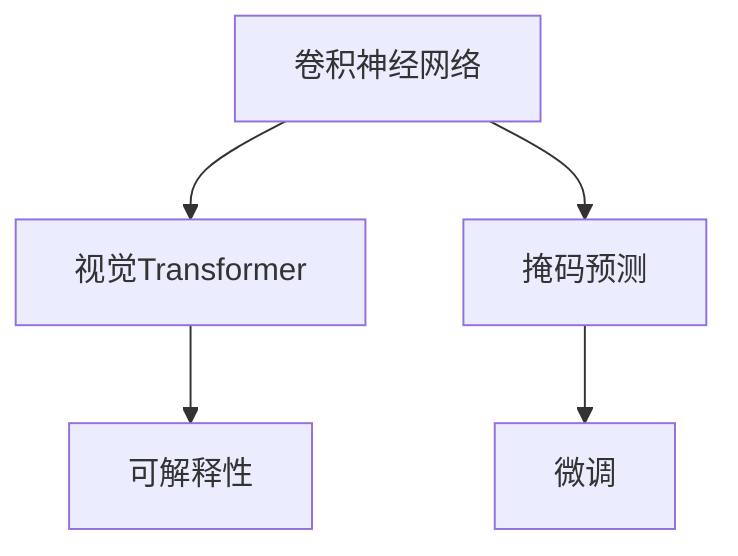

                 

# 视觉Transformer原理与代码实例讲解

> 关键词：视觉Transformer,Transformer,深度学习,卷积神经网络,CNN,迁移学习,代码实例,PyTorch

## 1. 背景介绍

### 1.1 问题由来
在计算机视觉领域，卷积神经网络（Convolutional Neural Networks, CNNs）一直是图像识别、分类和分割等任务的主流方法。CNN通过卷积层、池化层等组成的网络结构，有效捕获了图像的局部特征和空间结构。然而，随着数据量和计算资源的扩大，传统CNN面临的计算复杂度和模型参数量不断增长，训练和推理耗时较长，部署成本较高。

近年来，Transformer结构在自然语言处理领域取得了巨大成功，其核心思想是自注意力机制，能够高效地捕捉序列中全局和局部的依赖关系。对于图像数据，由于其具有空间结构的特性，如何将其融入Transformer模型成为了研究热点。为此，视觉Transformer（Visual Transformer, ViT）应运而生，将Transformer的原理应用于图像数据，实现了对图像的直接建模。

### 1.2 问题核心关键点
视觉Transformer（ViT）是一种基于Transformer的图像处理模型，其核心思想是将图像数据分割成多个局部特征块，通过自注意力机制进行特征映射和编码。ViT通过自我监督学习（如掩码预测）预训练，然后再进行下游任务的微调，能够在较少参数、较低计算成本的情况下获得优异的图像识别、分类和分割效果。

ViT的核心组成部分包括：
1. **块划分**：将图像分割成多个非重叠的局部特征块。
2. **自注意力**：通过多头自注意力机制对特征块进行编码，捕捉特征块之间的全局依赖关系。
3. **线性投影**：对注意力权重进行线性投影，输出图像的特征向量表示。

ViT的预训练和微调过程，可以概括为：
1. **预训练阶段**：在大规模图像数据集上，通过掩码预测等自我监督任务对ViT进行预训练，学习到图像的特征表示。
2. **微调阶段**：在特定下游任务的数据集上，对预训练的ViT进行微调，以适应任务需求。

ViT的这些特点，使其在计算效率、模型可解释性和迁移学习能力等方面均具有优势，成为了图像处理领域的又一个重要工具。

### 1.3 问题研究意义
研究ViT的原理与实现方法，对于拓展计算机视觉模型的应用边界，提高模型的计算效率和泛化能力，具有重要意义：

1. **参数高效**：ViT在预训练阶段只需要少量参数，可以在较低计算成本下实现图像的高效表示。
2. **可解释性**：ViT通过自注意力机制进行特征编码，每一层的输出可以解释为该层次的信息加权融合，提高了模型的可解释性。
3. **迁移学习**：ViT的预训练模型可以作为迁移学习的基础，在新任务上进行微调，加速模型的部署和应用。
4. **新任务适配**：ViT的结构设计灵活，可以通过微调轻松适配各种图像识别、分类、分割等任务。
5. **实际应用**：ViT已经应用于各类计算机视觉任务，如自然场景图像分类、医学图像分析等，展现出了强大的应用潜力。

## 2. 核心概念与联系

### 2.1 核心概念概述

为更好地理解ViT的核心思想和架构，本节将介绍几个关键概念：

- 卷积神经网络（CNN）：一种经典的图像处理模型，通过卷积层、池化层等组成，有效捕捉图像的局部特征和空间结构。
- 视觉Transformer（ViT）：一种基于Transformer结构的图像处理模型，通过自注意力机制实现对图像的直接建模。
- 掩码预测（Masked Prediction）：一种自我监督学习任务，用于预训练ViT模型，通过预测图像中被遮挡的部分来学习特征表示。
- 微调（Fine-Tuning）：在大规模图像数据集上进行预训练后，通过在特定下游任务的数据集上进行微调，以适应任务需求。
- 计算复杂度（Computational Complexity）：描述模型在计算资源上的开销，通常与模型参数量和计算量有关。
- 可解释性（Explainability）：描述模型的决策过程是否可以理解和解释，对于模型可信度和应用领域具有重要意义。

这些核心概念之间的逻辑关系可以通过以下Mermaid流程图来展示：



这个流程图展示了大语言模型微调的核心概念及其之间的关系：

1. 卷积神经网络通过卷积层、池化层等组件，有效捕捉图像的局部特征和空间结构。
2. 视觉Transformer通过自注意力机制，实现对图像的直接建模，提高了计算效率和可解释性。
3. 掩码预测是一种自我监督学习任务，用于预训练ViT模型，学习到图像的特征表示。
4. 微调是在预训练模型上进行特定任务的数据集上的优化，以适应任务需求。
5. 可解释性描述了模型的决策过程是否可以理解和解释，对于模型可信度和应用领域具有重要意义。

## 3. 核心算法原理 & 具体操作步骤
### 3.1 算法原理概述

视觉Transformer（ViT）的核心思想是将图像数据分割成多个局部特征块，通过多头自注意力机制进行特征映射和编码。其算法原理可以概括为以下几个步骤：

1. **块划分**：将图像分割成多个非重叠的局部特征块，每个块包含一定数量的像素。
2. **自注意力**：通过多头自注意力机制对每个特征块进行编码，捕捉特征块之间的全局依赖关系。
3. **线性投影**：对注意力权重进行线性投影，输出图像的特征向量表示。
4. **位置编码**：引入位置编码，捕捉特征块的空间位置信息。
5. **堆叠层**：堆叠多个层次的自注意力和线性投影层，形成完整的ViT模型。

ViT通过掩码预测等自我监督任务进行预训练，然后通过微调适应下游任务。预训练过程可以显著提高ViT模型的泛化能力和鲁棒性，而微调过程则根据具体任务进行参数优化，进一步提升模型性能。

### 3.2 算法步骤详解

以下详细讲解ViT的预训练和微调过程。

#### 预训练阶段

预训练阶段主要使用掩码预测（Masked Prediction）任务对ViT模型进行训练，步骤如下：

1. **数据准备**：收集大规模图像数据集，如ImageNet，并进行预处理，如归一化、标准化等。
2. **模型构建**：构建ViT模型，包括多个自注意力和线性投影层，以及位置编码模块。
3. **掩码生成**：生成随机的掩码，遮挡图像中部分像素。
4. **预测填充**：使用未被遮挡的像素进行预测，填充遮挡像素，形成完整的图像预测。
5. **损失计算**：计算预测像素与真实像素之间的差异，得到损失函数。
6. **反向传播**：根据损失函数反向传播更新模型参数。
7. **循环迭代**：重复上述步骤，直到模型收敛或达到预设的迭代次数。

#### 微调阶段

微调阶段主要在特定下游任务的数据集上进行，步骤如下：

1. **数据准备**：收集下游任务的标注数据集，如ImageNet上的物体分类任务。
2. **模型构建**：构建预训练的ViT模型，并根据具体任务添加合适的输出层和损失函数。
3. **模型微调**：在标注数据集上进行有监督训练，通过梯度下降等优化算法更新模型参数。
4. **性能评估**：在测试集上评估微调后模型的性能，如分类精度、准确率等指标。
5. **结果分析**：分析模型在特定任务上的表现，寻找性能提升的空间。
6. **持续优化**：根据测试结果进行参数调整，继续微调模型，直到达到理想性能。

### 3.3 算法优缺点

ViT作为基于Transformer的图像处理模型，具有以下优点：

1. **高效计算**：相比于CNN，ViT的计算复杂度更低，可以在较低计算成本下实现图像的快速表示。
2. **全局信息捕捉**：ViT的自注意力机制可以高效捕捉图像的局部和全局依赖关系，提升了模型的泛化能力。
3. **可解释性强**：ViT的每一层的输出可以解释为该层次的信息加权融合，提高了模型的可解释性。
4. **迁移学习能力强**：ViT的预训练模型可以作为迁移学习的基础，在新任务上进行微调，加速模型的部署和应用。

同时，ViT也存在一些缺点：

1. **参数量较大**：相比于CNN，ViT的参数量较多，需要较大的计算资源。
2. **模型复杂**：ViT的模型结构较为复杂，需要更高的理解门槛。
3. **内存消耗大**：ViT的模型较大，需要在训练和推理时占用较多的内存资源。
4. **可解释性不足**：ViT的每一层的输出虽然可解释，但整个模型的决策过程仍然不够透明。

尽管存在这些局限性，但ViT在图像处理领域展现了巨大的潜力，特别是在大规模图像数据集上的表现，令其在学术界和工业界均受到了广泛关注。

### 3.4 算法应用领域

视觉Transformer（ViT）已经在诸多计算机视觉任务上取得了优异的效果，其应用领域包括：

1. **图像分类**：对输入图像进行分类，如CIFAR-10、ImageNet等任务。
2. **物体检测**：检测图像中的物体位置和类别，如COCO、PASCAL VOC等任务。
3. **图像分割**：对图像进行像素级的分割，如PASCAL Context、Cityscapes等任务。
4. **图像生成**：生成高质量的图像，如StyleGAN、GAN等任务。
5. **图像检索**：根据查询图像或描述，检索出相似的图像，如Google Images等任务。
6. **医学影像分析**：对医学影像进行分类、分割等任务，如CT、MRI等影像分析。

除了这些经典任务外，ViT还被创新性地应用于图像去噪、超分辨率、图像生成等新领域，为计算机视觉技术带来了新的突破。

## 4. 数学模型和公式 & 详细讲解  
### 4.1 数学模型构建

假设输入图像为 $I \in \mathbb{R}^{H \times W \times C}$，其中 $H$ 和 $W$ 为图像的宽度和高度，$C$ 为通道数。ViT将图像划分为 $N$ 个局部特征块，每个块大小为 $P \times P$，通道数为 $K$。ViT的计算流程可以概括为：

1. **块划分**：将图像分割成 $N$ 个非重叠的局部特征块，每个块大小为 $P \times P$。
2. **自注意力**：对每个特征块进行自注意力计算，得到 $N$ 个特征块表示。
3. **线性投影**：对 $N$ 个特征块表示进行线性投影，得到图像的特征向量表示。

公式化上述过程，可以得到如下的数学模型：

设输入图像为 $I \in \mathbb{R}^{H \times W \times C}$，其中 $H$ 和 $W$ 为图像的宽度和高度，$C$ 为通道数。ViT将图像划分为 $N$ 个局部特征块，每个块大小为 $P \times P$，通道数为 $K$。ViT的计算流程可以概括为：

1. **块划分**：将图像分割成 $N$ 个非重叠的局部特征块，每个块大小为 $P \times P$。

   $$
   I_{block} = \text{Block}(I, P)
   $$

2. **自注意力**：对每个特征块进行自注意力计算，得到 $N$ 个特征块表示。

   $$
   \text{SelfAttention}(I_{block}, K, V) = \text{Attention}(Q, K, V)
   $$

3. **线性投影**：对 $N$ 个特征块表示进行线性投影，得到图像的特征向量表示。

   $$
   \text{Project}(\text{SelfAttention}(I_{block}, K, V)) = \text{MLP}(\text{SelfAttention}(I_{block}, K, V))
   $$

4. **位置编码**：引入位置编码，捕捉特征块的空间位置信息。

   $$
   \text{PosEnc}(I_{block}) = \text{PositionalEncoding}(I_{block})
   $$

5. **堆叠层**：堆叠多个层次的自注意力和线性投影层，形成完整的ViT模型。

   $$
   \text{ViT}(I) = \text{Stack}(\text{Block}(\text{PosEnc}(I_{block})))
   $$

### 4.2 公式推导过程

以ViT在ImageNet分类任务上的预训练和微调过程为例，推导预训练阶段的掩码预测损失函数。

假设预训练模型为 $F_\theta$，输入图像 $I$ 经过块划分后，每个特征块大小为 $P \times P$。预训练任务为掩码预测，遮挡部分像素进行预测，填充未被遮挡部分。

设掩码 $M \in \{0, 1\}^{N \times P \times P}$，遮挡部分像素 $0$，未被遮挡部分像素 $1$。对于每个特征块，计算其自注意力表示 $Z = \text{SelfAttention}(I_{block}, K, V)$，预测被遮挡部分的像素值 $\hat{I}_{mask}$。

掩码预测的损失函数为：

$$
\mathcal{L} = -\frac{1}{N} \sum_{i=1}^N \frac{1}{\text{Sum}(M)} \sum_{j=1}^{\text{Sum}(M)} \ell(\hat{I}_{mask}[i, j], I_{mask}[i, j])
$$

其中，$\ell$ 为损失函数，$\text{Sum}(M)$ 为掩码 $M$ 中非零元素的个数。通过最小化上述损失函数，ViT模型可以学习到图像的特征表示。

## 5. 项目实践：代码实例和详细解释说明
### 5.1 开发环境搭建

在进行ViT实践前，我们需要准备好开发环境。以下是使用Python进行PyTorch开发的环境配置流程：

1. 安装Anaconda：从官网下载并安装Anaconda，用于创建独立的Python环境。

2. 创建并激活虚拟环境：
```bash
conda create -n pytorch-env python=3.8 
conda activate pytorch-env
```

3. 安装PyTorch：根据CUDA版本，从官网获取对应的安装命令。例如：
```bash
conda install pytorch torchvision torchaudio cudatoolkit=11.1 -c pytorch -c conda-forge
```

4. 安装Transformer库：
```bash
pip install transformers
```

5. 安装各类工具包：
```bash
pip install numpy pandas scikit-learn matplotlib tqdm jupyter notebook ipython
```

完成上述步骤后，即可在`pytorch-env`环境中开始ViT实践。

### 5.2 源代码详细实现

这里我们以ImageNet分类任务为例，给出使用Transformers库对ViT模型进行预训练和微调的PyTorch代码实现。

首先，定义ViT模型：

```python
from transformers import ViTForImageClassification, ViTTokenizer
from transformers import ViTModel, AutoConfig

# 定义模型
model = ViTForImageClassification.from_pretrained('google/vit-base-patch32-224-in21k')
tokenizer = ViTTokenizer.from_pretrained('google/vit-base-patch32-224-in21k')

# 定义配置
config = AutoConfig.from_pretrained('google/vit-base-patch32-224-in21k')
```

然后，加载图像数据并进行预处理：

```python
import torch
import torchvision.transforms as transforms
import torchvision.datasets as datasets

# 定义预处理函数
preprocess = transforms.Compose([
    transforms.Resize(224),
    transforms.CenterCrop(224),
    transforms.ToTensor(),
    transforms.Normalize(mean=[0.5], std=[0.5])
])

# 加载ImageNet数据集
train_dataset = datasets.ImageFolder(root='path/to/train', transform=preprocess)
test_dataset = datasets.ImageFolder(root='path/to/test', transform=preprocess)

# 定义DataLoader
train_loader = torch.utils.data.DataLoader(train_dataset, batch_size=8, shuffle=True)
test_loader = torch.utils.data.DataLoader(test_dataset, batch_size=8, shuffle=False)
```

接着，定义预训练过程：

```python
from transformers import Trainer, TrainingArguments

# 定义训练参数
training_args = TrainingArguments(
    output_dir='./results', 
    num_train_epochs=5, 
    per_device_train_batch_size=8, 
    per_device_eval_batch_size=8, 
    learning_rate=5e-5, 
    weight_decay=0.01
)

# 定义训练器
trainer = Trainer(
    model=model,
    args=training_args,
    train_dataset=train_dataset,
    eval_dataset=test_dataset,
    evaluation_strategy='epoch',
)

# 进行预训练
trainer.train()
```

最后，在特定下游任务上进行微调：

```python
from transformers import ViTForImageClassification

# 定义微调模型
model = ViTForImageClassification.from_pretrained('google/vit-base-patch32-224-in21k', num_labels=10)

# 加载微调数据集
train_dataset = datasets.ImageFolder(root='path/to/train', transform=preprocess)
test_dataset = datasets.ImageFolder(root='path/to/test', transform=preprocess)

# 定义微调器
optimizer = torch.optim.Adam(model.parameters(), lr=5e-5)
criterion = torch.nn.CrossEntropyLoss()

# 定义微调器
trainer = Trainer(
    model=model,
    args=training_args,
    train_dataset=train_dataset,
    eval_dataset=test_dataset,
    evaluation_strategy='epoch',
    optimizer=optimizer,
    criterion=criterion
)

# 进行微调
trainer.train()
```

以上就是使用PyTorch对ViT进行预训练和微调的完整代码实现。可以看到，得益于Transformers库的强大封装，我们可以用相对简洁的代码完成ViT模型的构建和微调。

### 5.3 代码解读与分析

让我们再详细解读一下关键代码的实现细节：

**ViTForImageClassification类**：
- `from_pretrained`方法：从预训练模型库中加载模型和分词器，并根据任务需求添加输出层和损失函数。
- `from_config`方法：根据配置文件创建模型，方便模型迁移。

**DataLoader类**：
- `torch.utils.data.DataLoader`：用于加载和批处理数据集，方便模型的训练和推理。
- `batch_size`参数：定义每个批次的样本数。
- `shuffle`参数：定义是否随机打乱数据集。

**TrainingArguments类**：
- `num_train_epochs`参数：定义训练轮数。
- `per_device_train_batch_size`参数：定义每个训练设备的批量大小。
- `per_device_eval_batch_size`参数：定义每个评估设备的批量大小。
- `learning_rate`参数：定义学习率。
- `weight_decay`参数：定义权重衰减。

**Trainer类**：
- `Trainer`类：用于训练模型，包含模型的训练、评估、保存等操作。
- `train`方法：进行模型训练。
- `evaluation_strategy`参数：定义模型评估策略，如每个epoch评估一次。

**模型训练**：
- 使用PyTorch的`Trainer`类，方便管理模型的训练过程。
- 定义训练参数，包括训练轮数、批量大小、学习率、权重衰减等。
- 使用`Trainer`类进行模型训练，通过`train`方法进行模型的训练过程。

可以看到，PyTorch配合Transformers库使得ViT模型的构建和微调变得简洁高效。开发者可以将更多精力放在数据处理、模型改进等高层逻辑上，而不必过多关注底层的实现细节。

当然，工业级的系统实现还需考虑更多因素，如模型的保存和部署、超参数的自动搜索、更灵活的任务适配层等。但核心的预训练和微调流程基本与此类似。

## 6. 实际应用场景
### 6.1 智能医疗诊断

基于ViT的医学影像分析技术，可以应用于智能医疗诊断中，辅助医生进行疾病诊断和治疗方案的制定。在实践中，可以收集大量医学影像数据，如CT、MRI等，并对其进行预处理和标注。在此基础上对预训练的ViT模型进行微调，使其能够自动理解影像特征，判断影像中的病变位置和性质，提供初步的诊断建议。结合医生的临床经验，可以进一步提升诊断的准确性和可信度。

### 6.2 自动驾驶

在自动驾驶领域，ViT可以被用于实时图像处理和物体检测。通过预训练的ViT模型，能够快速处理来自摄像头、激光雷达等传感器的实时图像数据，识别出道路上的车辆、行人、交通标志等信息，为自动驾驶系统提供实时决策支持。在微调阶段，可以根据特定的道路环境和交通规则，进一步优化ViT模型，提升其在复杂场景下的鲁棒性和准确性。

### 6.3 工业质检

在工业生产中，ViT可以用于产品质量检测和缺陷识别。通过对生产线上的产品图像进行预处理和标注，在预训练的ViT模型上进行微调，能够自动识别出产品表面的缺陷和瑕疵，如划痕、锈迹、裂缝等，提高质检的自动化水平和检测精度。结合机器视觉技术，可以进一步提升质检的效率和准确性。

### 6.4 未来应用展望

随着ViT模型的不断进步，其在计算机视觉领域的应用前景将更加广阔。

在智慧城市治理中，ViT可以被用于城市事件监测、舆情分析、应急指挥等环节，提高城市管理的自动化和智能化水平，构建更安全、高效的未来城市。

在智慧医疗领域，ViT可以用于医学影像分析、基因组分析等任务，提升医疗服务的智能化水平，辅助医生诊疗，加速新药开发进程。

在智能教育领域，ViT可以用于学生作业批改、学情分析、知识推荐等方面，因材施教，促进教育公平，提高教学质量。

此外，在企业生产、社会治理、文娱传媒等众多领域，ViT的应用也将不断涌现，为经济社会发展注入新的动力。相信随着技术的日益成熟，ViT必将在更广阔的应用领域大放异彩。

## 7. 工具和资源推荐
### 7.1 学习资源推荐

为了帮助开发者系统掌握ViT的理论基础和实践技巧，这里推荐一些优质的学习资源：

1. 《ViT from Scratch》系列博文：由ViT模型贡献者撰写，深入浅出地介绍了ViT模型的原理、实现和应用。

2. CS231n《Convolutional Neural Networks for Visual Recognition》课程：斯坦福大学开设的计算机视觉明星课程，涵盖ViT等前沿话题。

3. 《ViT: A Simple Framework for Attentive Vision Transformers》论文：ViT模型的原始论文，详细介绍了ViT的模型结构和训练过程。

4. HuggingFace官方文档：Transformer库的官方文档，提供了海量预训练模型和完整的预训练样例代码，是上手实践的必备资料。

5. Google ViT模型预训练代码：Google开源的ViT模型预训练代码，提供了详细的预训练步骤和参数设置。

通过对这些资源的学习实践，相信你一定能够快速掌握ViT的精髓，并用于解决实际的计算机视觉问题。

### 7.2 开发工具推荐

高效的开发离不开优秀的工具支持。以下是几款用于ViT开发的常用工具：

1. PyTorch：基于Python的开源深度学习框架，灵活动态的计算图，适合快速迭代研究。大部分预训练语言模型都有PyTorch版本的实现。

2. TensorFlow：由Google主导开发的开源深度学习框架，生产部署方便，适合大规模工程应用。同样有丰富的预训练语言模型资源。

3. Transformers库：HuggingFace开发的NLP工具库，集成了众多SOTA语言模型，支持PyTorch和TensorFlow，是进行ViT模型开发的利器。

4. Weights & Biases：模型训练的实验跟踪工具，可以记录和可视化模型训练过程中的各项指标，方便对比和调优。与主流深度学习框架无缝集成。

5. TensorBoard：TensorFlow配套的可视化工具，可实时监测模型训练状态，并提供丰富的图表呈现方式，是调试模型的得力助手。

6. Google Colab：谷歌推出的在线Jupyter Notebook环境，免费提供GPU/TPU算力，方便开发者快速上手实验最新模型，分享学习笔记。

合理利用这些工具，可以显著提升ViT模型的开发效率，加快创新迭代的步伐。

### 7.3 相关论文推荐

ViT模型的发展源于学界的持续研究。以下是几篇奠基性的相关论文，推荐阅读：

1. Vision Transformers（ViT）：介绍ViT模型及其在图像分类任务上的性能。

2. An Image is Worth 16x16 Words: Transformers for Image Recognition at Scale：展示ViT模型在图像识别任务上的强大表现。

3. Scaling Up to 1,000 Layers for Vision Models：探讨ViT模型的大规模训练和模型性能。

4. ViT: A Simple Framework for Attentive Vision Transformers：ViT模型的原始论文，详细介绍了ViT的模型结构和训练过程。

5. Pre-Training Vision Transformers on Google Cloud：Google开源的ViT模型预训练代码，提供了详细的预训练步骤和参数设置。

这些论文代表了大语言模型微调技术的发展脉络。通过学习这些前沿成果，可以帮助研究者把握学科前进方向，激发更多的创新灵感。

## 8. 总结：未来发展趋势与挑战
### 8.1 总结

本文对视觉Transformer（ViT）的原理与实现方法进行了全面系统的介绍。首先阐述了ViT在大规模图像数据集上的预训练和微调过程，明确了ViT在参数高效、计算复杂度低、可解释性强等方面的优势。其次，从原理到实践，详细讲解了ViT的数学模型和关键步骤，给出了ViT模型构建和微调的完整代码实例。同时，本文还广泛探讨了ViT在医学影像分析、自动驾驶、工业质检等领域的实际应用，展示了ViT模型的巨大应用潜力。此外，本文精选了ViT模型的学习资源，力求为读者提供全方位的技术指引。

通过本文的系统梳理，可以看到，ViT作为基于Transformer的图像处理模型，正在成为计算机视觉领域的重要工具，极大地拓展了图像处理的计算效率和泛化能力。随着ViT模型的不断进步，其在实际应用中的表现将更加出色，为计算机视觉技术带来新的突破。

### 8.2 未来发展趋势

展望未来，ViT的发展趋势将呈现出以下几个方向：

1. **参数高效**：未来的ViT模型将更加注重参数的高效性，以适应移动设备等计算资源有限的应用场景。
2. **计算加速**：通过算法优化和硬件加速，进一步提高ViT模型的计算速度，支持实时图像处理和推理。
3. **可解释性增强**：未来的ViT模型将更加注重可解释性，通过引入模型解释工具，帮助用户理解模型决策过程。
4. **跨模态融合**：未来的ViT模型将更多地与文本、语音等多模态数据进行融合，实现视觉、文本、语音等信息的协同建模。
5. **迁移学习**：未来的ViT模型将更加注重迁移学习能力，通过预训练和微调，在新任务上快速适应，加速模型部署和应用。

这些趋势凸显了ViT模型的广泛应用前景。未来的研究将继续在计算效率、模型可解释性、跨模态融合等方面进行深入探索，进一步提升ViT模型的性能和应用范围。

### 8.3 面临的挑战

尽管ViT模型在图像处理领域展现了巨大的潜力，但在迈向更加智能化、普适化应用的过程中，仍面临以下挑战：

1. **计算资源瓶颈**：ViT模型需要较大的计算资源，对于小型企业和高性能计算设备的应用仍有一定限制。
2. **数据需求大**：ViT模型的预训练需要大量标注数据，对于小数据集和特定领域的任务，数据获取成本较高。
3. **模型可解释性不足**：尽管ViT模型通过自注意力机制提供了较好的可解释性，但对于复杂的决策过程，仍难以全面解释。
4. **鲁棒性问题**：ViT模型在特定数据分布下的鲁棒性仍需进一步提升，以应对现实世界中数据的多样性和复杂性。
5. **迁移学习能力不足**：对于跨领域和跨模态的任务，ViT模型的迁移学习能力仍需进一步增强。

尽管存在这些挑战，但随着ViT模型的不断发展和优化，其在实际应用中的表现将更加出色，为计算机视觉技术带来新的突破。未来，随着更多领域的任务数据积累和算法优化，ViT模型必将在更广泛的场景中发挥重要作用。

### 8.4 研究展望

面向未来，ViT模型的研究将在以下几个方面进行新的探索：

1. **小样本学习**：探索在少量数据下的ViT模型优化方法，提升模型的泛化能力和自适应性。
2. **跨模态融合**：研究视觉、文本、语音等多模态数据的协同建模方法，实现多模态信息的有效融合。
3. **可解释性增强**：开发更加透明的ViT模型解释工具，帮助用户理解模型的决策过程，提升模型的可信度和应用价值。
4. **迁移学习能力提升**：通过模型结构优化和迁移学习技术，提升ViT模型的跨领域和跨模态迁移能力。
5. **资源优化**：研究ViT模型的压缩、稀疏化和硬件加速方法，提升模型的资源利用效率，支持在资源受限设备上的部署。

这些研究方向将进一步拓展ViT模型的应用边界，推动其在各个领域的广泛应用，为构建智能化、高效化的计算机视觉系统提供新的技术支撑。

## 9. 附录：常见问题与解答

**Q1：ViT和CNN的主要区别是什么？**

A: ViT和CNN的主要区别在于模型结构的设计和特征表示的方式。CNN通过卷积层、池化层等组成，主要捕捉图像的局部特征和空间结构。而ViT通过自注意力机制，主要捕捉图像的局部和全局依赖关系，能够更全面地理解图像的特征。此外，ViT的计算复杂度更低，在较少参数、较低计算成本的情况下，仍能获得优异的图像识别效果。

**Q2：ViT的预训练和微调过程中需要注意哪些细节？**

A: 在ViT的预训练和微调过程中，需要注意以下细节：
1. 预训练任务：选择合适的自我监督学习任务，如掩码预测，以充分利用图像数据的信息。
2. 微调任务：根据具体任务，选择合适的输出层和损失函数，以适应任务需求。
3. 学习率设置：预训练和微调时，需要选择合适的学习率，避免过拟合或欠拟合。
4. 正则化：使用L2正则、Dropout等正则化技术，防止过拟合。
5. 数据增强：通过对图像进行随机裁剪、旋转、缩放等操作，增加数据集的多样性。
6. 模型验证：在训练过程中，及时验证模型在验证集上的性能，防止过拟合。

**Q3：ViT的计算复杂度如何计算？**

A: ViT的计算复杂度主要取决于模型的参数量和计算量。在预训练阶段，ViT模型需要进行大量的自注意力计算，复杂度为 $O(n^2)$，其中 $n$ 为图像的像素数。在微调阶段，由于只更新少量参数，计算复杂度相对较低。

**Q4：ViT的预训练和微调过程中如何选择合适的超参数？**

A: 在ViT的预训练和微调过程中，选择合适的超参数非常重要。超参数包括学习率、批量大小、训练轮数等，需要进行反复调整和验证。通常建议从较小的超参数值开始，逐步增大，观察模型的性能变化，以找到最优的超参数组合。

**Q5：ViT的预训练和微调过程中如何防止过拟合？**

A: 在ViT的预训练和微调过程中，防止过拟合可以采取以下措施：
1. 数据增强：通过对图像进行随机裁剪、旋转、缩放等操作，增加数据集的多样性。
2. 正则化：使用L2正则、Dropout等正则化技术，防止过拟合。
3. 早停策略：在验证集上监控模型的性能，一旦性能不再提升，立即停止训练。
4. 学习率调度：使用学习率衰减、梯度累积等策略，防止过拟合。

通过这些措施，可以显著降低ViT模型在预训练和微调过程中过拟合的风险，提升模型的泛化能力和鲁棒性。

---

作者：禅与计算机程序设计艺术 / Zen and the Art of Computer Programming

