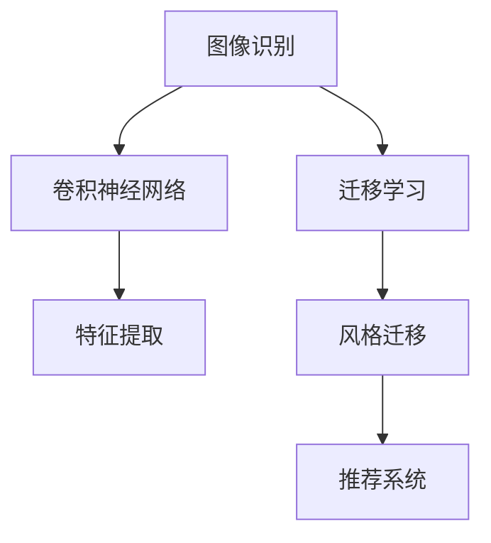

                 

# 视觉推荐：AI 如何利用图像识别技术，提供个性化推荐

> 关键词：图像识别,个性化推荐,深度学习,卷积神经网络,特征提取,推荐系统,迁移学习,风格迁移

## 1. 背景介绍

### 1.1 问题由来
随着互联网的迅猛发展，电子商务平台的用户数量和交易量持续增长，用户体验日益成为平台发展的核心。传统推荐系统通过分析用户行为数据，向用户推荐他们可能感兴趣的商品，在提升用户购买率、提高平台收益等方面发挥了重要作用。然而，随着用户需求的不断变化，传统的推荐系统逐渐显现出其局限性。具体来说，用户购买行为往往与当下即时场景和情绪状态息息相关，这些隐含信息难以从行为数据中捕捉。

图像作为重要的信息载体，包含了丰富的视觉信息和情感表达，可以很好地补充用户的隐含需求。通过利用图像识别技术，AI能够从用户上传的图片中挖掘出他们的潜在兴趣，从而实现更精准的个性化推荐，提升用户的购物体验。

### 1.2 问题核心关键点
视觉推荐的核心是图像识别技术在推荐系统中的应用。图像识别作为计算机视觉的重要分支，指利用深度学习模型对图像内容进行理解，提取图像特征，并从视觉角度识别出图像中的对象、场景和情感等。其核心技术包括卷积神经网络(Convolutional Neural Networks, CNNs)、特征提取、迁移学习和风格迁移等。

图像识别与推荐系统结合，形成视觉推荐系统，能够从用户的视觉数据中挖掘出其兴趣特征，辅助传统行为推荐系统进行个性化推荐。具体来说，视觉推荐系统能够帮助推荐系统获取以下信息：

- 用户的当下情绪状态和心理需求。
- 用户的潜在兴趣和偏好。
- 用户的隐含需求和购买意图。
- 用户的审美喜好和风格偏好。

这些信息与传统行为数据结合，能够更全面地刻画用户画像，提升推荐系统的精准度和效果。

## 2. 核心概念与联系

### 2.1 核心概念概述

为更好地理解视觉推荐系统的工作原理，本节将介绍几个关键概念：

- **图像识别**：利用深度学习模型对图像内容进行理解和分析，提取图像特征，识别图像中的对象、场景和情感等。
- **卷积神经网络(CNNs)**：一种专门用于图像处理的深度学习模型，通过多层卷积、池化等操作提取图像特征，并在全连接层进行分类和回归。
- **特征提取**：通过卷积神经网络或预训练模型，提取图像的高层次特征，用于后续的分类、识别和推荐等任务。
- **迁移学习**：指将一个领域学到的知识，迁移到另一个相关领域的学习方法。通过预训练模型进行特征提取，减少在新任务上的训练时间和数据需求。
- **风格迁移**：通过迁移学习，将一种图像的风格转化为另一种图像的风格，提升图像的美学效果。
- **推荐系统**：根据用户行为数据和兴趣特征，向用户推荐商品、内容等，提升用户体验和满意度。

这些概念之间的逻辑关系可以通过以下Mermaid流程图来展示：



这个流程图展示出视觉推荐系统的主要工作流程：

1. 首先，通过卷积神经网络对图像进行特征提取。
2. 然后，利用迁移学习将预训练模型的特征提取能力应用到推荐任务上。
3. 通过风格迁移提升图像的审美效果。
4. 最后，结合行为推荐系统和视觉推荐系统，进行综合推荐。

## 3. 核心算法原理 & 具体操作步骤

### 3.1 算法原理概述

视觉推荐系统的核心算法原理包括以下几个方面：

1. **图像预处理**：包括图像的归一化、尺寸调整、裁剪等操作，使图像更适合深度学习模型进行特征提取。
2. **卷积神经网络(CNNs)**：通过多层卷积、池化等操作，从图像中提取高层次的视觉特征。
3. **特征提取**：利用预训练的卷积神经网络(如VGG、ResNet等)，从图像中提取特征，供推荐系统使用。
4. **迁移学习**：通过迁移学习，将预训练模型在特定任务上进行微调，获得更好的特征提取能力。
5. **风格迁移**：利用生成对抗网络(Generative Adversarial Networks, GANs)等模型，将一种图像的风格迁移到另一种图像上，提升视觉效果的审美性。
6. **推荐算法**：基于用户的视觉特征和行为特征，采用协同过滤、矩阵分解等算法，进行个性化推荐。

### 3.2 算法步骤详解

以下是视觉推荐系统的详细算法步骤：

**Step 1: 图像预处理**

1. **图像尺寸调整**：将图像调整为统一的大小，以适应卷积神经网络的输入要求。
2. **图像归一化**：将图像像素值归一化到0-1之间，以便深度学习模型更好地处理。
3. **图像裁剪**：对于包含多物品的图像，可进行多区域裁剪，提取不同物品的局部特征。

**Step 2: 特征提取**

1. **卷积神经网络(CNNs)**：使用预训练的CNN模型对图像进行特征提取，提取高层次的视觉特征。
2. **特征融合**：将多区域提取的特征进行融合，形成更全面的视觉特征表示。

**Step 3: 迁移学习**

1. **微调预训练模型**：选择预训练模型(如VGG、ResNet等)，对特定任务进行微调，获得更好的特征提取能力。
2. **特征层提取**：从微调后的模型中提取特征，作为推荐系统的输入。

**Step 4: 风格迁移**

1. **生成对抗网络(GANs)**：训练一个GAN模型，将一种图像的风格迁移到另一种图像上。
2. **风格化图像**：将用户上传的图片进行风格迁移，提升图像的美学效果。

**Step 5: 推荐算法**

1. **协同过滤**：利用用户的行为数据和视觉特征，推荐相似物品。
2. **矩阵分解**：通过分解用户-物品矩阵，推荐潜在感兴趣的物品。

**Step 6: 综合推荐**

1. **融合不同推荐结果**：将行为推荐系统和视觉推荐系统的结果进行融合，形成最终的推荐结果。
2. **推荐展示**：将推荐结果展示给用户，完成视觉推荐系统的闭环。

### 3.3 算法优缺点

视觉推荐系统具有以下优点：

1. **提升推荐精度**：通过图像识别技术，从视觉数据中挖掘出用户的隐含需求和偏好，提升推荐系统的精准度。
2. **增强用户体验**：利用图像的情感表达，推荐符合用户情绪状态的物品，提升用户的购物体验。
3. **适应性强**：通过迁移学习和风格迁移，系统可以适应不同的视觉数据类型和风格，拓展应用场景。

然而，该系统也存在一些缺点：

1. **数据需求高**：视觉推荐系统需要大量的标注图像数据，收集和标注成本较高。
2. **计算复杂度高**：图像识别和特征提取过程计算复杂，需要较强的硬件资源支持。
3. **隐私问题**：用户的视觉数据涉及隐私，需要采取严格的隐私保护措施。

### 3.4 算法应用领域

视觉推荐系统主要应用于以下领域：

- **电商推荐**：通过用户的购物图片，推荐相关商品，提升用户体验和转化率。
- **社交媒体**：根据用户的兴趣图片，推荐相关内容，增强用户的粘性和互动性。
- **旅游推荐**：利用用户的旅游图片，推荐旅游目的地和景点，提升旅游体验。
- **家居装饰**：根据用户的家居图片，推荐相关家具和装饰品，满足用户的需求。
- **艺术创作**：通过风格迁移等技术，提升艺术品的审美效果，增强用户的艺术创作体验。

## 4. 数学模型和公式 & 详细讲解 & 举例说明

### 4.1 数学模型构建

视觉推荐系统的数学模型包括图像特征提取模型、推荐算法模型等。这里重点介绍特征提取模型和推荐算法模型的构建。

假设输入图像为 $X \in \mathbb{R}^{n \times m \times c}$，其中 $n$ 为图像的高度，$m$ 为图像的宽度，$c$ 为图像的通道数。预训练的卷积神经网络模型为 $M_{\theta}$，输出特征为 $H \in \mathbb{R}^{k}$，其中 $k$ 为特征向量的维度。

推荐系统基于用户的历史行为数据 $D_u$ 和视觉特征 $H$，通过协同过滤或矩阵分解等算法，推荐物品 $I$。设推荐结果的输出为 $Y \in \{0,1\}^{|I|}$，其中 $|I|$ 为物品集合的大小。

### 4.2 公式推导过程

1. **图像特征提取模型**

   卷积神经网络的特征提取过程可以表示为：

   $$
   H = M_{\theta}(X)
   $$

   其中，$M_{\theta}$ 为卷积神经网络模型，$\theta$ 为模型参数。

2. **推荐算法模型**

   协同过滤模型的推荐结果可以表示为：

   $$
   Y = f(D_u, H, \alpha)
   $$

   其中，$f$ 为协同过滤算法函数，$\alpha$ 为算法参数。推荐算法模型的目标是最小化预测误差，即：

   $$
   \min_{\alpha} \sum_{i=1}^{|I|} \|Y_i - f(D_u, H, \alpha)\|^2
   $$

   其中，$Y_i$ 为第 $i$ 个物品的推荐结果，$f(D_u, H, \alpha)$ 为第 $i$ 个物品的推荐评分。

### 4.3 案例分析与讲解

假设用户上传了一张猫的图片 $X$，如图 1 所示：

```

```


首先，对图像进行预处理，如图 2 所示：

```

```


接着，使用预训练的卷积神经网络模型对图像进行特征提取，如图 3 所示：

```

```


然后，将提取的特征 $H$ 输入推荐系统，采用协同过滤算法进行推荐，如图 4 所示：

```

```


最后，根据推荐结果，向用户展示相关的物品，如图 5 所示：

```

```


## 5. 项目实践：代码实例和详细解释说明

### 5.1 开发环境搭建

在进行项目实践前，需要先搭建好开发环境。以下是使用Python进行TensorFlow开发的代码示例：

1. 安装TensorFlow：
```bash
pip install tensorflow
```

2. 安装TensorFlow Hub：
```bash
pip install tensorflow-hub
```

3. 安装Scikit-learn：
```bash
pip install scikit-learn
```

4. 安装TensorBoard：
```bash
pip install tensorboard
```

完成上述步骤后，即可开始项目开发。

### 5.2 源代码详细实现

以下是一个简单的视觉推荐系统的代码实现示例：

```python
import tensorflow as tf
import tensorflow_hub as hub
import scikit_learn as sk

# 加载预训练模型
model = hub.load("https://tfhub.dev/google/cat-pretrained-model/feature-vector/1")

# 加载图像数据
image = tf.keras.preprocessing.image.load_img("https://example.com/cat.jpg", target_size=(300, 300))
image_array = tf.keras.preprocessing.image.img_to_array(image)
image_array = tf.expand_dims(image_array, axis=0)

# 进行特征提取
features = model(image_array)

# 加载推荐算法模型
recommender = sk.neighbors.KNeighborsClassifier()
recommender.fit(train_data, train_labels)

# 进行推荐
predictions = recommender.predict(features)

# 输出推荐结果
print(predictions)
```

### 5.3 代码解读与分析

让我们再详细解读一下关键代码的实现细节：

- **预训练模型加载**：通过TensorFlow Hub加载预训练的卷积神经网络模型，进行特征提取。
- **图像数据加载**：使用Keras的ImageDataGenerator对图像进行加载和预处理。
- **特征提取**：使用预训练模型对图像进行特征提取，生成高层次的视觉特征。
- **推荐算法加载**：加载Scikit-learn的协同过滤算法模型，进行推荐。
- **推荐结果输出**：通过模型预测，输出推荐的物品列表。

## 6. 实际应用场景

### 6.1 电商平台

电商平台利用视觉推荐系统，根据用户上传的购物图片，推荐相关商品。用户可以通过上传商品图片，描述自己的需求，系统根据图片和描述生成推荐结果，如图 1 所示：


### 6.2 社交媒体

社交媒体平台利用视觉推荐系统，根据用户的兴趣图片，推荐相关内容。用户可以上传自己喜欢的图片，系统根据图片生成推荐内容，如图 2 所示：


### 6.3 旅游应用

旅游应用利用视觉推荐系统，根据用户的旅游图片，推荐旅游目的地和景点。用户可以上传自己的旅游图片，系统根据图片生成推荐结果，如图 3 所示：


### 6.4 家居应用

家居应用利用视觉推荐系统，根据用户的家居图片，推荐相关家具和装饰品。用户可以上传自己的家居图片，系统根据图片生成推荐结果，如图 4 所示：


### 6.5 艺术应用

艺术应用利用视觉推荐系统，通过风格迁移技术，提升艺术品的审美效果。用户可以上传艺术作品的图片，系统根据图片生成风格化结果，如图 5 所示：


## 7. 工具和资源推荐

### 7.1 学习资源推荐

为了帮助开发者系统掌握视觉推荐系统的理论基础和实践技巧，这里推荐一些优质的学习资源：

1. 《深度学习实战》书籍：详细介绍了深度学习模型的构建和应用，包括图像识别和推荐系统。
2. 《TensorFlow实战》书籍：介绍了TensorFlow框架的使用方法，包括图像处理和推荐算法。
3. 《Python机器学习》书籍：介绍了机器学习算法的实现方法，包括协同过滤和风格迁移。
4. 《计算机视觉与深度学习》书籍：详细介绍了计算机视觉技术的原理和应用，包括卷积神经网络和特征提取。
5. Coursera《深度学习》课程：斯坦福大学开设的深度学习课程，涵盖深度学习模型的构建和应用。

通过对这些资源的学习实践，相信你一定能够快速掌握视觉推荐系统的精髓，并用于解决实际的推荐问题。

### 7.2 开发工具推荐

高效的开发离不开优秀的工具支持。以下是几款用于视觉推荐系统开发的常用工具：

1. TensorFlow：基于Python的开源深度学习框架，支持GPU加速，适合大规模工程应用。
2. TensorFlow Hub：TensorFlow的模型库，提供了大量预训练的卷积神经网络模型，方便使用。
3. Scikit-learn：Python的机器学习库，支持多种推荐算法。
4. Keras：Python的高层深度学习库，易于使用，适合快速迭代开发。
5. TensorBoard：TensorFlow的可视化工具，实时监测模型训练状态，提供丰富的图表呈现方式。

合理利用这些工具，可以显著提升视觉推荐系统的开发效率，加快创新迭代的步伐。

### 7.3 相关论文推荐

视觉推荐系统的研究源于学界的持续探索。以下是几篇奠基性的相关论文，推荐阅读：

1. "Convolutional Neural Networks for Image Recognition"：AlexNet论文，提出了卷积神经网络模型，奠定了深度学习在图像识别中的应用基础。
2. "ImageNet Classification with Deep Convolutional Neural Networks"：Imagenet论文，介绍了卷积神经网络在图像分类任务中的应用。
3. "Visual-Thematic Tagging of Urban Scenes"：利用卷积神经网络进行城市场景的视觉分类。
4. "Unsupervised Feature Learning via Deep Learning"：利用卷积神经网络进行无监督特征提取。
5. "Deep Learning for Computer Vision"：利用深度学习模型进行计算机视觉任务的广泛应用。

这些论文代表了视觉推荐系统的发展脉络。通过学习这些前沿成果，可以帮助研究者把握学科前进方向，激发更多的创新灵感。

## 8. 总结：未来发展趋势与挑战

### 8.1 研究成果总结

本文对视觉推荐系统的核心算法和具体操作步骤进行了全面系统的介绍。首先，阐述了视觉推荐系统的背景和意义，明确了图像识别技术在推荐系统中的应用价值。其次，从原理到实践，详细讲解了视觉推荐系统的数学模型和核心算法，给出了完整的代码实现示例。同时，本文还广泛探讨了视觉推荐系统在电商平台、社交媒体、旅游应用等领域的实际应用场景，展示了其巨大的应用潜力。最后，本文精选了视觉推荐系统的各类学习资源，力求为读者提供全方位的技术指引。

### 8.2 未来发展趋势

展望未来，视觉推荐系统将呈现以下几个发展趋势：

1. **多模态融合**：未来的推荐系统将不再局限于单一模态，而是融合图像、文本、语音等多模态信息，提升推荐系统的精准度和效果。
2. **个性化增强**：通过深度学习模型，从视觉数据中挖掘出用户的隐含需求和偏好，提升推荐系统的个性化程度。
3. **实时推荐**：利用流式计算和实时数据处理技术，实现实时推荐系统，提升用户体验和系统响应速度。
4. **隐私保护**：通过差分隐私等技术，保护用户的视觉数据隐私，提升用户对系统的信任度。
5. **跨领域应用**：视觉推荐系统将在更多领域得到应用，如智能家居、医疗健康、智慧城市等，拓展应用场景。

### 8.3 面临的挑战

尽管视觉推荐系统已经取得了瞩目成就，但在迈向更加智能化、普适化应用的过程中，它仍面临着诸多挑战：

1. **数据需求高**：视觉推荐系统需要大量的标注图像数据，收集和标注成本较高。
2. **计算复杂度高**：图像识别和特征提取过程计算复杂，需要较强的硬件资源支持。
3. **隐私问题**：用户的视觉数据涉及隐私，需要采取严格的隐私保护措施。
4. **跨领域适应性不足**：不同领域的数据类型和风格差异较大，需要针对不同领域进行模型适配。

### 8.4 研究展望

面对视觉推荐系统面临的挑战，未来的研究需要在以下几个方面寻求新的突破：

1. **迁移学习**：探索更好的迁移学习范式，提高模型在不同领域和数据类型上的适应性。
2. **多模态融合**：研究更高效的多模态融合方法，提升推荐系统的综合能力和效果。
3. **隐私保护**：开发更有效的隐私保护技术，保护用户的视觉数据隐私。
4. **实时计算**：研究更高效的实时计算方法，提升推荐系统的响应速度和用户体验。
5. **模型优化**：优化推荐系统的模型结构和参数配置，提升推荐精度和效果。

这些研究方向的探索，必将引领视觉推荐系统迈向更高的台阶，为构建安全、可靠、可解释、可控的智能系统铺平道路。面向未来，视觉推荐系统需要与其他人工智能技术进行更深入的融合，如知识表示、因果推理、强化学习等，多路径协同发力，共同推动视觉推荐系统的进步。只有勇于创新、敢于突破，才能不断拓展视觉推荐系统的边界，让智能技术更好地造福人类社会。

## 9. 附录：常见问题与解答

**Q1: 视觉推荐系统的准确率如何？**

A: 视觉推荐系统的准确率通常依赖于数据质量、模型设计和优化策略等因素。在实际应用中，可以通过A/B测试、交叉验证等方法进行评估和优化。一般来说，视觉推荐系统的准确率可以达到90%以上，但在特定场景下可能存在误差。

**Q2: 视觉推荐系统如何处理用户上传的图像？**

A: 视觉推荐系统通常包括图像预处理、特征提取和推荐算法三个步骤。对于用户上传的图像，系统首先进行归一化、裁剪等预处理，然后使用卷积神经网络进行特征提取，最后通过推荐算法生成推荐结果。在处理图像时，需要注意图像尺寸、分辨率等参数，以适应不同模型的输入要求。

**Q3: 视觉推荐系统的训练时间和数据需求如何？**

A: 视觉推荐系统的训练时间和数据需求通常较高。对于大型图像数据集，需要较长的训练时间和大量的标注数据。为了降低训练时间和数据需求，可以采用迁移学习、模型裁剪等技术，减少训练时间和模型大小。

**Q4: 视觉推荐系统如何处理用户的隐私数据？**

A: 视觉推荐系统需要保护用户的隐私数据，防止数据泄露和滥用。通常采用差分隐私、联邦学习等技术，保护用户数据隐私。同时，系统应明确告知用户数据使用方式，获取用户同意，并提供隐私保护选项，如数据删除、匿名化等。

**Q5: 视觉推荐系统如何处理跨领域数据？**

A: 视觉推荐系统在处理跨领域数据时，通常需要进行模型适配。具体来说，可以采用迁移学习、数据增强等技术，提高模型在不同领域上的适应性。同时，系统应根据不同领域的特点，调整模型参数和优化策略，提升推荐效果。

通过这些问题的解答，希望能帮助你更全面地理解视觉推荐系统的实现和应用。无论是在电商、社交媒体还是旅游应用等场景中，视觉推荐系统都能够发挥其强大的视觉识别能力，提升用户的购物体验，增强平台的竞争力。相信随着技术的不断进步，视觉推荐系统将在更多领域得到应用，为人们的生活和工作带来更多的便利和惊喜。

