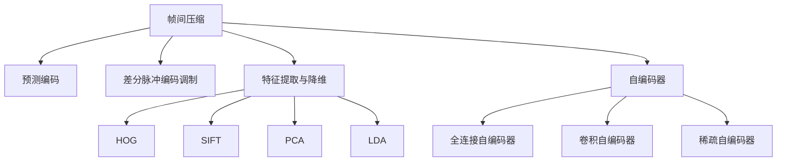

                 

# 视频数据的低维压缩技术

## 1. 背景介绍

视频数据因其丰富的信息和多样化的应用场景而受到广泛关注。然而，视频数据的高维特性和高带宽要求使其存储和传输成本高昂，限制了其在实际应用中的普及。为了解决这一问题，研究者们提出了多种低维压缩技术，旨在通过降维或压缩的方式减少视频数据占用的存储空间和带宽，降低其对存储和传输系统的负担。本博客将深入探讨视频数据的低维压缩技术，包括其核心概念、核心算法、具体操作步骤、实际应用场景以及未来发展趋势和挑战。

## 2. 核心概念与联系

### 2.1 核心概念概述

视频数据低维压缩技术旨在通过对视频帧或帧间信息的处理，将高维的视频数据转化为低维的形式，以减少其存储和传输成本。常见的低维压缩技术包括帧间压缩、特征提取与降维、以及深度学习中的自编码器等。

- **帧间压缩**：通过分析视频帧间的冗余信息，实现压缩比的高效提升。常见的帧间压缩算法包括预测编码、差分脉冲编码调制(DPCM)等。
- **特征提取与降维**：通过提取视频帧的关键特征，并在低维空间中进行表示，减少数据维度。常用的特征提取方法包括HOG（Histogram of Oriented Gradients）、SIFT（Scale-Invariant Feature Transform）等，降维方法包括PCA（Principal Component Analysis）、LDA（Linear Discriminant Analysis）等。
- **自编码器**：一种深度学习模型，能够学习数据的压缩表示，并在解码时尽可能还原原始数据。自编码器模型包括全连接自编码器、卷积自编码器、稀疏自编码器等。

这些核心概念之间的逻辑关系可以通过以下Mermaid流程图来展示：



这个流程图展示了大规模视频数据压缩的各个核心概念及其之间的联系：

1. 帧间压缩通过对视频帧间冗余信息的分析，实现高效率的压缩。
2. 特征提取与降维通过提取视频帧的关键特征，并在低维空间中进行表示，减少数据维度。
3. 自编码器通过学习数据的压缩表示，进一步提升压缩效率。

## 3. 核心算法原理 & 具体操作步骤

### 3.1 算法原理概述

视频数据的低维压缩技术主要基于两个原理：冗余信息的消除和特征的降维表示。冗余信息的消除旨在通过分析视频帧间或帧内的相似性，减少存储空间和传输带宽。特征的降维表示则通过提取关键特征，并利用降维算法将这些特征压缩到低维空间中。

冗余信息消除通常使用预测编码和差分脉冲编码调制(DPCM)等算法。预测编码通过利用当前帧与前一帧的相似性，减少存储空间。DPCM通过将当前帧与前一帧的差值进行编码，进一步压缩视频数据。

特征降维表示主要使用PCA和LDA等降维算法，将高维特征映射到低维空间中。PCA通过寻找数据的主成分，实现降维，保留数据的主要特征。LDA则通过寻找最能区分不同类别的特征，实现降维，同时保留分类信息。

### 3.2 算法步骤详解

低维压缩技术的详细步骤通常包括以下几个方面：

1. **数据预处理**：对视频数据进行去噪、归一化等预处理操作，以提高后续算法的准确性。
2. **特征提取**：从视频帧中提取关键特征，常用的方法包括HOG、SIFT等。
3. **特征降维**：利用PCA、LDA等降维算法，将特征映射到低维空间中。
4. **冗余信息消除**：通过预测编码或DPCM等算法，消除视频帧间的冗余信息。
5. **压缩与存储**：对低维特征进行压缩，存储压缩后的数据。

下面以PCA为例，详细讲解其操作步骤：

- **数据标准化**：对特征进行标准化处理，即均值归零、方差缩放为1。
- **计算协方差矩阵**：计算特征向量的协方差矩阵。
- **特征值分解**：对协方差矩阵进行特征值分解，得到特征值和特征向量。
- **选择特征**：选择包含最多信息量的特征向量，作为降维后的特征。
- **重构数据**：将降维后的特征重构为原始数据。

### 3.3 算法优缺点

视频数据低维压缩技术的主要优点包括：

1. **高压缩比**：通过消除冗余信息和降维表示，能够显著减少视频数据的存储空间和传输带宽。
2. **实时性**：低维压缩技术通常具有较快的处理速度，适用于实时视频流处理。
3. **可扩展性**：可以与其他视频处理技术结合使用，如帧间压缩、自编码器等。

然而，低维压缩技术也存在一些局限性：

1. **精度损失**：在降维过程中，一些重要信息可能被忽略，导致重构后的视频质量下降。
2. **计算复杂度**：高维数据的降维和重构计算复杂度较高，特别是在大规模数据集上。
3. **模型选择**：不同的降维算法适用于不同的数据类型和应用场景，选择不当可能导致效果不佳。

### 3.4 算法应用领域

视频数据低维压缩技术在许多领域都有广泛的应用，包括但不限于：

1. **视频流传输**：通过压缩减少视频数据量，提高网络带宽的利用效率。
2. **视频存储**：减少视频数据的存储空间需求，提高存储设备的利用率。
3. **视频监控**：通过压缩降低监控视频的存储和传输成本，提高系统的可靠性。
4. **视频编解码**：结合帧间压缩、自编码器等技术，优化视频编解码效率。

## 4. 数学模型和公式 & 详细讲解

### 4.1 数学模型构建

视频数据的低维压缩技术通常基于以下数学模型：

- **PCA模型**：假设数据集 $\mathbf{X}$ 由 $n$ 个 $m$ 维的数据点组成，$\mathbf{X} \in \mathbb{R}^{n \times m}$。PCA的目标是将 $\mathbf{X}$ 映射到一个低维空间 $\mathbf{Y}$，其中 $\mathbf{Y} \in \mathbb{R}^{n \times k}$，$k < m$。

  $$
  \mathbf{Y} = \mathbf{X} \mathbf{A}
  $$

  其中 $\mathbf{A} \in \mathbb{R}^{m \times k}$ 为投影矩阵，$\mathbf{A} \mathbf{A}^T$ 为协方差矩阵的特征向量矩阵。

- **LDA模型**：假设数据集 $\mathbf{X}$ 由 $n$ 个 $m$ 维的数据点组成，$\mathbf{X} \in \mathbb{R}^{n \times m}$。LDA的目标是将 $\mathbf{X}$ 映射到一个低维空间 $\mathbf{Y}$，同时保留分类信息。

  $$
  \mathbf{Y} = \mathbf{X} \mathbf{A} \mathbf{W}
  $$

  其中 $\mathbf{A} \in \mathbb{R}^{m \times k}$ 为投影矩阵，$\mathbf{W} \in \mathbb{R}^{k \times m}$ 为权重矩阵，$\mathbf{W} \mathbf{W}^T$ 为类别之间的散布矩阵。

### 4.2 公式推导过程

以PCA为例，详细推导其公式。

- **数据标准化**：

  $$
  \mathbf{X}_{\text{standardized}} = \frac{\mathbf{X} - \mathbf{X}^*}{\sigma}
  $$

  其中 $\mathbf{X}^*$ 为数据均值，$\sigma$ 为数据标准差。

- **计算协方差矩阵**：

  $$
  \mathbf{S} = \frac{1}{n-1} \mathbf{X}_{\text{standardized}}^T \mathbf{X}_{\text{standardized}}
  $$

- **特征值分解**：

  $$
  \mathbf{S} = \mathbf{V} \mathbf{D} \mathbf{V}^T
  $$

  其中 $\mathbf{V} \in \mathbb{R}^{m \times m}$ 为特征向量矩阵，$\mathbf{D} \in \mathbb{R}^{m \times m}$ 为对角矩阵，对角线上元素为特征值。

- **选择特征**：

  $$
  \mathbf{A} = \mathbf{V}^T \mathbf{D}^k \mathbf{V}
  $$

  其中 $k$ 为保留的特征数量。

- **重构数据**：

  $$
  \mathbf{Y} = \mathbf{X} \mathbf{A}
  $$

### 4.3 案例分析与讲解

假设有一组包含100个视频帧的数据集，每个视频帧包含1000个特征。为了将数据集压缩到低维空间，我们选择保留100个特征，并使用PCA进行降维。具体步骤如下：

1. **数据标准化**：

  $$
  \mathbf{X}_{\text{standardized}} = \frac{\mathbf{X} - \mathbf{X}^*}{\sigma}
  $$

2. **计算协方差矩阵**：

  $$
  \mathbf{S} = \frac{1}{100-1} \mathbf{X}_{\text{standardized}}^T \mathbf{X}_{\text{standardized}}
  $$

3. **特征值分解**：

  $$
  \mathbf{S} = \mathbf{V} \mathbf{D} \mathbf{V}^T
  $$

4. **选择特征**：

  $$
  \mathbf{A} = \mathbf{V}^T \mathbf{D}^{100} \mathbf{V}
  $$

5. **重构数据**：

  $$
  \mathbf{Y} = \mathbf{X} \mathbf{A}
  $$

## 5. 项目实践：代码实例和详细解释说明

### 5.1 开发环境搭建

在进行低维压缩技术开发前，我们需要准备好开发环境。以下是使用Python进行OpenCV开发的环境配置流程：

1. 安装Anaconda：从官网下载并安装Anaconda，用于创建独立的Python环境。

2. 创建并激活虚拟环境：
```bash
conda create -n opencv-env python=3.8 
conda activate opencv-env
```

3. 安装OpenCV：
```bash
pip install opencv-python-headless
```

4. 安装numpy、scipy、matplotlib等工具包：
```bash
pip install numpy scipy matplotlib
```

完成上述步骤后，即可在`opencv-env`环境中开始低维压缩实践。

### 5.2 源代码详细实现

下面我们以PCA为例，给出使用OpenCV库进行PCA算法实现的Python代码实现。

```python
import cv2
import numpy as np
from sklearn.decomposition import PCA

# 加载视频文件
cap = cv2.VideoCapture('video.mp4')

# 获取视频帧数、宽度和高度
frame_count = int(cap.get(cv2.CAP_PROP_FRAME_COUNT))
width = int(cap.get(cv2.CAP_PROP_FRAME_WIDTH))
height = int(cap.get(cv2.CAP_PROP_FRAME_HEIGHT))

# 创建输出视频文件
fourcc = cv2.VideoWriter_fourcc(*'mp4v')
out = cv2.VideoWriter('output.mp4', fourcc, 30.0, (width, height))

# 提取视频帧并计算PCA
frame_count = int(cap.get(cv2.CAP_PROP_FRAME_COUNT))
frames = np.empty((frame_count, height, width, 3), dtype=np.uint8)

for frame_idx in range(frame_count):
    ret, frame = cap.read()
    if ret:
        frames[frame_idx] = frame

# 计算PCA并重构帧
pca = PCA(n_components=100)
pca.fit(frames)

for frame_idx in range(frame_count):
    frame = frames[frame_idx]
    frame = pca.transform(frame)
    frame = pca.inverse_transform(frame)
    out.write(frame)

cap.release()
out.release()
```

以上就是使用OpenCV对视频进行PCA算法实现的完整代码。可以看到，通过调用OpenCV的VideoCapture和VideoWriter函数，可以方便地进行视频流的读取和写入。通过sklearn库的PCA函数，可以完成特征的降维和重构。

### 5.3 代码解读与分析

让我们再详细解读一下关键代码的实现细节：

- **视频流读取**：使用VideoCapture函数读取视频文件，获取视频帧数、宽度和高度。
- **视频流写入**：使用VideoWriter函数创建输出视频文件，指定编码格式和帧率。
- **PCA计算**：通过sklearn库的PCA函数计算PCA，保留100个特征。
- **帧重构**：对每帧进行PCA降维和重构，再通过VideoWriter函数写入输出视频流。

## 6. 实际应用场景

### 6.1 视频监控

在视频监控系统中，实时视频流的存储和传输是主要瓶颈。通过低维压缩技术，可以在不显著影响监控效果的情况下，大幅减少视频数据的存储空间和传输带宽，提升系统的可靠性和实时性。

在实际应用中，可以选择适当的帧间压缩算法（如预测编码、DPCM）和降维算法（如PCA、LDA）对视频数据进行压缩。对于高清监控视频，可以使用卷积自编码器等深度学习技术，实现更高的压缩效率和更好的重构效果。

### 6.2 视频编解码

视频编解码是视频压缩技术的重要组成部分。低维压缩技术可以通过降维和特征提取，进一步提升编解码的效率。例如，可以将视频帧的关键特征提取出来，进行PCA降维，然后再进行压缩，从而减少编解码的计算量和存储空间。

在实际应用中，可以使用深度学习技术，如卷积自编码器、稀疏自编码器等，对视频帧进行特征提取和降维，提升编解码的效率和重构质量。

### 6.3 视频搜索

视频搜索是视频处理中的重要任务，如何高效地检索相似视频内容是一个挑战。低维压缩技术可以通过降维和特征提取，将视频数据压缩到低维空间中，从而提高检索效率。

在实际应用中，可以使用PCA、LDA等降维算法，对视频数据进行压缩，然后使用相似度度量算法（如余弦相似度）进行检索。如果需要更高的检索效率，可以使用基于哈希的方法，将视频数据压缩到哈希空间中，进行快速检索。

## 7. 工具和资源推荐

### 7.1 学习资源推荐

为了帮助开发者系统掌握视频数据低维压缩技术，这里推荐一些优质的学习资源：

1. 《OpenCV官方文档》：OpenCV官方文档提供了丰富的视频处理和低维压缩算法实现，是学习视频压缩技术的必备资料。
2. 《Python计算机视觉编程》：该书详细介绍了Python在计算机视觉中的应用，包括视频处理和低维压缩技术。
3. 《深度学习在视频处理中的应用》：该书介绍了深度学习在视频压缩和处理中的应用，包括自编码器和卷积神经网络等技术。

通过对这些资源的学习实践，相信你一定能够快速掌握视频数据低维压缩技术的精髓，并用于解决实际的视频处理问题。

### 7.2 开发工具推荐

高效的开发离不开优秀的工具支持。以下是几款用于视频数据低维压缩开发的常用工具：

1. OpenCV：基于开源的计算机视觉库，支持多种视频处理和低维压缩算法，提供简单易用的接口。
2. Python：作为通用编程语言，Python具有丰富的库和工具支持，适用于各种视频处理任务。
3. Scikit-learn：提供了多种机器学习算法，包括PCA、LDA等降维算法，适用于数据降维和特征提取。

合理利用这些工具，可以显著提升视频数据低维压缩任务的开发效率，加快创新迭代的步伐。

### 7.3 相关论文推荐

视频数据低维压缩技术的研究已经取得了一定的进展，以下是几篇奠基性的相关论文，推荐阅读：

1. "Video Compression by Prediction from Only a Few Frames"：该论文提出了基于预测的帧间压缩算法，能够在保持高压缩比的同时，保持视频质量。
2. "Video Retrieval via Tensor Network Compression and Sparse Tensor Factorization"：该论文使用张量网络压缩技术，对视频数据进行高效压缩和检索。
3. "Deep Learning for Video Compression: From Frame Prediction to Feature Sparsity"：该论文介绍了深度学习在视频压缩中的应用，包括卷积自编码器和稀疏自编码器等技术。

这些论文代表了大规模视频数据压缩技术的发展脉络。通过学习这些前沿成果，可以帮助研究者把握学科前进方向，激发更多的创新灵感。

## 8. 总结：未来发展趋势与挑战

### 8.1 总结

本文对视频数据的低维压缩技术进行了全面系统的介绍。首先阐述了视频数据低维压缩技术的研究背景和意义，明确了低维压缩在提高视频存储和传输效率方面的独特价值。其次，从原理到实践，详细讲解了低维压缩的数学原理和关键步骤，给出了低维压缩任务开发的完整代码实例。同时，本文还广泛探讨了低维压缩技术在视频监控、视频编解码、视频搜索等多个领域的应用前景，展示了低维压缩技术的巨大潜力。

通过本文的系统梳理，可以看到，视频数据低维压缩技术正在成为视频处理的重要范式，极大地拓展了视频数据的存储和传输能力，为视频监控、视频编解码等应用带来了新的突破。未来，伴随视频压缩技术的持续演进，视频数据低维压缩必将在更多的应用场景中发挥重要作用。

### 8.2 未来发展趋势

展望未来，视频数据低维压缩技术将呈现以下几个发展趋势：

1. **深度学习的应用**：随着深度学习技术的不断发展，低维压缩技术将更多地融合深度学习，提升压缩效率和重构质量。
2. **多模态数据的融合**：视频数据通常与其他多模态数据（如图像、语音）结合使用，未来的低维压缩技术也将更多地融合多模态信息，提高系统的综合性能。
3. **实时性的提升**：视频数据的实时处理和传输是重要的应用需求，未来的低维压缩技术将更多地考虑实时性，提高处理速度。
4. **压缩比的高效提升**：如何进一步提升压缩比，减少视频数据的存储和传输成本，将是未来研究的重要方向。
5. **边缘计算的引入**：随着边缘计算技术的发展，未来的低维压缩技术将更多地向边缘设备部署，实现更高效的视频处理和传输。

以上趋势凸显了视频数据低维压缩技术的广阔前景。这些方向的探索发展，必将进一步提升视频数据处理的能力，推动视频技术的普及和应用。

### 8.3 面临的挑战

尽管视频数据低维压缩技术已经取得了一定的进展，但在迈向更加智能化、普适化应用的过程中，它仍面临着诸多挑战：

1. **压缩质量和重构效果**：在压缩过程中如何平衡压缩比和视频质量，是未来研究的重要挑战。
2. **计算复杂度**：高维数据的降维和重构计算复杂度较高，特别是在大规模数据集上。
3. **模型选择和优化**：如何选择合适的降维算法和特征提取方法，并对其进行优化，是未来研究的难点。
4. **实时性**：在实时视频流处理中，如何提高压缩和解压缩的速度，是实际应用中的挑战。
5. **边缘计算的资源限制**：在边缘计算设备上，如何提高压缩算法的效率，降低计算资源消耗，是未来研究的方向。

### 8.4 研究展望

面对视频数据低维压缩技术所面临的挑战，未来的研究需要在以下几个方面寻求新的突破：

1. **深度学习与低维压缩的融合**：将深度学习与低维压缩技术结合，利用深度学习的高压缩比特性，进一步提升低维压缩效率。
2. **多模态数据的融合与降维**：结合图像、语音等多模态数据，进行综合的特征提取和降维，提升系统的综合性能。
3. **实时性优化**：优化压缩和解压缩算法，提升实时处理能力，满足视频流处理的实时性需求。
4. **边缘计算的应用**：将低维压缩技术部署到边缘计算设备上，实现更高效的视频处理和传输。
5. **边缘计算的资源优化**：针对边缘计算设备的资源限制，优化压缩算法，提高资源利用效率。

这些研究方向的探索，必将引领视频数据低维压缩技术迈向更高的台阶，为视频技术的普及和应用带来新的突破。面向未来，视频数据低维压缩技术还需要与其他视频处理技术进行更深入的融合，共同推动视频技术的发展。只有勇于创新、敢于突破，才能不断拓展视频处理技术的边界，让视频技术更好地服务于社会。

## 9. 附录：常见问题与解答

**Q1：视频数据低维压缩技术的主要优点和缺点是什么？**

A: 视频数据低维压缩技术的主要优点包括：

1. **高压缩比**：通过消除冗余信息和降维表示，能够显著减少视频数据的存储空间和传输带宽。
2. **实时性**：低维压缩技术通常具有较快的处理速度，适用于实时视频流处理。
3. **可扩展性**：可以与其他视频处理技术结合使用，如帧间压缩、自编码器等。

然而，低维压缩技术也存在一些局限性：

1. **精度损失**：在降维过程中，一些重要信息可能被忽略，导致重构后的视频质量下降。
2. **计算复杂度**：高维数据的降维和重构计算复杂度较高，特别是在大规模数据集上。
3. **模型选择**：不同的降维算法适用于不同的数据类型和应用场景，选择不当可能导致效果不佳。

**Q2：如何选择合适的视频压缩算法？**

A: 选择合适的视频压缩算法需要考虑以下几个因素：

1. **压缩比要求**：根据实际需求，确定压缩比的要求，选择相应的压缩算法。
2. **视频质量要求**：确定重构视频的质量要求，选择相应压缩算法。
3. **计算资源限制**：考虑计算资源的限制，选择高效、实时的压缩算法。
4. **应用场景**：根据应用场景，选择合适的压缩算法，如实时视频流处理、大规模视频存储等。

常用的视频压缩算法包括预测编码、差分脉冲编码调制(DPCM)、PCA、LDA等。

**Q3：如何提升视频压缩技术的实时性？**

A: 提升视频压缩技术的实时性可以通过以下几个方面进行优化：

1. **硬件加速**：利用GPU、FPGA等硬件加速设备，提升压缩和解压缩的速度。
2. **算法优化**：优化压缩和解压缩算法，提高计算效率。
3. **分块处理**：将视频数据分成多个块进行并行处理，提升处理速度。
4. **边缘计算**：将视频压缩算法部署到边缘设备上，实现更高效的视频处理和传输。

**Q4：视频压缩技术在实际应用中需要注意哪些问题？**

A: 视频压缩技术在实际应用中需要注意以下几个问题：

1. **压缩比和视频质量**：在压缩过程中，如何平衡压缩比和视频质量，是实际应用中的挑战。
2. **计算资源限制**：在实时视频流处理中，如何提高压缩和解压缩的速度，是实际应用中的挑战。
3. **边缘计算的资源限制**：在边缘计算设备上，如何提高压缩算法的效率，降低计算资源消耗，是实际应用中的挑战。

## 附录：常见问题与解答

**Q1：视频数据低维压缩技术的主要优点和缺点是什么？**

A: 视频数据低维压缩技术的主要优点包括：

1. **高压缩比**：通过消除冗余信息和降维表示，能够显著减少视频数据的存储空间和传输带宽。
2. **实时性**：低维压缩技术通常具有较快的处理速度，适用于实时视频流处理。
3. **可扩展性**：可以与其他视频处理技术结合使用，如帧间压缩、自编码器等。

然而，低维压缩技术也存在一些局限性：

1. **精度损失**：在降维过程中，一些重要信息可能被忽略，导致重构后的视频质量下降。
2. **计算复杂度**：高维数据的降维和重构计算复杂度较高，特别是在大规模数据集上。
3. **模型选择**：不同的降维算法适用于不同的数据类型和应用场景，选择不当可能导致效果不佳。

**Q2：如何选择合适的视频压缩算法？**

A: 选择合适的视频压缩算法需要考虑以下几个因素：

1. **压缩比要求**：根据实际需求，确定压缩比的要求，选择相应的压缩算法。
2. **视频质量要求**：确定重构视频的质量要求，选择相应压缩算法。
3. **计算资源限制**：考虑计算资源的限制，选择高效、实时的压缩算法。
4. **应用场景**：根据应用场景，选择合适的压缩算法，如实时视频流处理、大规模视频存储等。

常用的视频压缩算法包括预测编码、差分脉冲编码调制(DPCM)、PCA、LDA等。

**Q3：如何提升视频压缩技术的实时性？**

A: 提升视频压缩技术的实时性可以通过以下几个方面进行优化：

1. **硬件加速**：利用GPU、FPGA等硬件加速设备，提升压缩和解压缩的速度。
2. **算法优化**：优化压缩和解压缩算法，提高计算效率。
3. **分块处理**：将视频数据分成多个块进行并行处理，提升处理速度。
4. **边缘计算**：将视频压缩算法部署到边缘设备上，实现更高效的视频处理和传输。

**Q4：视频压缩技术在实际应用中需要注意哪些问题？**

A: 视频压缩技术在实际应用中需要注意以下几个问题：

1. **压缩比和视频质量**：在压缩过程中，如何平衡压缩比和视频质量，是实际应用中的挑战。
2. **计算资源限制**：在实时视频流处理中，如何提高压缩和解压缩的速度，是实际应用中的挑战。
3. **边缘计算的资源限制**：在边缘计算设备上，如何提高压缩算法的效率，降低计算资源消耗，是实际应用中的挑战。

## 附录：常见问题与解答

**Q1：视频数据低维压缩技术的主要优点和缺点是什么？**

A: 视频数据低维压缩技术的主要优点包括：

1. **高压缩比**：通过消除冗余信息和降维表示，能够显著减少视频数据的存储空间和传输带宽。
2. **实时性**：低维压缩技术通常具有较快的处理速度，适用于实时视频流处理。
3. **可扩展性**：可以与其他视频处理技术结合使用，如帧间压缩、自编码器等。

然而，低维压缩技术也存在一些局限性：

1. **精度损失**：在降维过程中，一些重要信息可能被忽略，导致重构后的视频质量下降。
2. **计算复杂度**：高维数据的降维和重构计算复杂度较高，特别是在大规模数据集上。
3. **模型选择**：不同的降维算法适用于不同的数据类型和应用场景，选择不当可能导致效果不佳。

**Q2：如何选择合适的视频压缩算法？**

A: 选择合适的视频压缩算法需要考虑以下几个因素：

1. **压缩比要求**：根据实际需求，确定压缩比的要求，选择相应的压缩算法。
2. **视频质量要求**：确定重构视频的质量要求，选择相应压缩算法。
3. **计算资源限制**：考虑计算资源的限制，选择高效、实时的压缩算法。
4. **应用场景**：根据应用场景，选择合适的压缩算法，如实时视频流处理、大规模视频存储等。

常用的视频压缩算法包括预测编码、差分脉冲编码调制(DPCM)、PCA、LDA等。

**Q3：如何提升视频压缩技术的实时性？**

A: 提升视频压缩技术的实时性可以通过以下几个方面进行优化：

1. **硬件加速**：利用GPU、FPGA等硬件加速设备，提升压缩和解压缩的速度。
2. **算法优化**：优化压缩和解压缩算法，提高计算效率。
3. **分块处理**：将视频数据分成多个块进行并行处理，提升处理速度。
4. **边缘计算**：将视频压缩算法部署到边缘设备上，实现更高效的视频处理和传输。

**Q4：视频压缩技术在实际应用中需要注意哪些问题？**

A: 视频压缩技术在实际应用中需要注意以下几个问题：

1. **压缩比和视频质量**：在压缩过程中，如何平衡压缩比和视频质量，是实际应用中的挑战。
2. **计算资源限制**：在实时视频流处理中，如何提高压缩和解压缩的速度，是实际应用中的挑战。
3. **边缘计算的资源限制**：在边缘计算设备上，如何提高压缩算法的效率，降低计算资源消耗，是实际应用中的挑战。

---

作者：禅与计算机程序设计艺术 / Zen and the Art of Computer Programming

