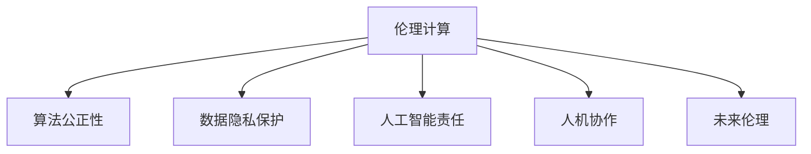

                 

# 解决伦理问题：负责任地发展人类计算

> 关键词：伦理计算,算法公正性,数据隐私,人工智能责任,人机协作,未来伦理

## 1. 背景介绍

### 1.1 问题由来

随着人工智能技术的迅猛发展，计算机计算能力与日俱增，正在逐步改变人类的生产生活方式。但与此同时，计算伦理问题也随之凸显。从算法偏见到隐私泄露，再到责任归属，每一个环节都可能影响社会公平、安全与进步。如何在技术进步的同时，确保计算活动符合伦理规范，成为当前人工智能领域的重要课题。

### 1.2 问题核心关键点

解决伦理问题，构建负责任的人工智能计算，涉及多维度的核心关键点：

1. **算法公正性**：确保算法设计和使用过程中，不偏向任何特定群体，能够公平公正地服务于所有用户。
2. **数据隐私保护**：在数据收集、存储、处理、使用等各个环节，确保用户隐私数据的安全与保密。
3. **人工智能责任**：明确AI系统的责任主体，避免因技术失误导致的不良后果。
4. **人机协作**：在计算过程中，确保人类在决策和操作中保持主导地位，防止计算接管。
5. **未来伦理**：预见AI技术可能带来的社会、经济、伦理影响，提前制定规范和政策。

## 2. 核心概念与联系

### 2.1 核心概念概述

为了更好地理解解决伦理问题的计算方法，本节将介绍几个密切相关的核心概念：

- **伦理计算**：通过算法设计、数据处理、系统部署等手段，确保计算活动符合伦理规范，避免对人类社会造成负面影响。
- **算法公正性**：在算法设计和使用过程中，避免因数据偏见、模型偏差等原因导致的不公平现象。
- **数据隐私保护**：通过技术手段，如加密、去标识化等，保护个人数据的安全和隐私。
- **人工智能责任**：在AI系统的设计、开发、部署、使用等各个环节，明确责任主体和权利边界，避免因技术失误导致的法律责任。
- **人机协作**：在计算过程中，确保人类保持决策的主导地位，防止计算技术对人类自主性和尊严造成威胁。
- **未来伦理**：预见AI技术可能带来的社会、经济、伦理影响，制定相应的规范和政策，指导未来技术发展。

这些核心概念之间的逻辑关系可以通过以下Mermaid流程图来展示：



这个流程图展示了几大核心概念之间的内在联系：

1. 伦理计算是确保整个计算过程符合伦理规范的基础。
2. 算法公正性是伦理计算的核心要素之一，保证了算法的公平性和透明性。
3. 数据隐私保护是伦理计算的重要组成部分，保障了个人数据的权益。
4. 人工智能责任是伦理计算的法律保障，明确了技术主体的责任和权利。
5. 人机协作是伦理计算的实践目标，确保了人类在计算过程中的主导地位。
6. 未来伦理是伦理计算的前瞻性考量，为技术发展制定了伦理指导。

## 3. 核心算法原理 & 具体操作步骤
### 3.1 算法原理概述

解决伦理问题的计算方法，主要是通过算法设计、数据处理和系统部署等手段，确保计算活动的公平、公正、透明和可控。具体而言，主要包括以下几个关键步骤：

1. **算法设计公正性**：在算法设计过程中，采用公平性评估指标，确保算法输出不偏向任何群体。
2. **数据隐私保护**：采用加密、去标识化、差分隐私等技术，保护用户数据的隐私和安全。
3. **人工智能责任明确**：在算法开发、部署和使用的各个环节，明确责任主体，确保法律责任的落实。
4. **人机协作实现**：在计算过程中，设计用户界面，让用户能够参与和监督计算过程。
5. **未来伦理预见**：对AI技术可能带来的社会影响进行预见和分析，制定相应的规范和政策。

### 3.2 算法步骤详解

#### 3.2.1 算法设计公正性

确保算法公正性，主要通过以下步骤实现：

1. **数据收集与预处理**：收集无偏、多样化的数据集，并对数据进行清洗和预处理，去除噪声和异常值。
2. **算法设计**：采用公平性评估指标，如准确率、召回率、F1分数等，对算法进行公正性检验。
3. **算法优化**：根据公正性评估结果，调整模型参数，优化算法性能。

#### 3.2.2 数据隐私保护

确保数据隐私，主要通过以下技术手段：

1. **数据加密**：采用对称加密或非对称加密，对数据进行加密处理，确保数据在传输和存储过程中的安全性。
2. **差分隐私**：通过在数据中添加随机噪声，保护用户隐私，同时保证数据分析结果的有效性。
3. **去标识化**：对数据进行匿名化处理，去除可能识别个人身份的信息，确保用户隐私。

#### 3.2.3 人工智能责任明确

确保人工智能责任，主要通过以下步骤实现：

1. **责任主体明确**：在算法开发、部署和使用的各个环节，明确责任主体，如开发团队、运营团队等。
2. **法律责任追究**：制定相应的法律规范，明确责任追究机制，确保法律责任的落实。
3. **透明度和可解释性**：设计透明的算法模型，确保用户和监管机构能够理解和解释计算结果。

#### 3.2.4 人机协作实现

确保人机协作，主要通过以下手段：

1. **用户界面设计**：设计友好、直观的用户界面，让用户能够参与和监督计算过程。
2. **决策支持系统**：设计决策支持系统，提供辅助决策建议，帮助用户做出合理判断。
3. **反馈机制**：建立用户反馈机制，及时收集用户意见，优化计算模型和算法。

#### 3.2.5 未来伦理预见

确保未来伦理，主要通过以下步骤实现：

1. **社会影响评估**：对AI技术可能带来的社会影响进行评估，包括就业、教育、医疗等各个方面。
2. **伦理规范制定**：制定相应的伦理规范和政策，指导AI技术的发展。
3. **持续监测与调整**：建立持续监测机制，及时调整AI技术的伦理规范，确保其与社会进步相适应。

### 3.3 算法优缺点

解决伦理问题的计算方法，具有以下优点：

1. **提升公平性**：通过算法设计和数据处理，确保算法的公平性和透明性，避免因数据偏见、模型偏差等原因导致的不公平现象。
2. **保障隐私**：采用数据加密、差分隐私、去标识化等技术，保护用户数据的隐私和安全。
3. **明确责任**：通过明确责任主体和权利边界，确保法律责任的落实，保障用户权益。
4. **增强人机协作**：通过设计友好的用户界面和决策支持系统，增强人机协作，确保人类在计算过程中的主导地位。
5. **预见未来伦理**：通过社会影响评估和伦理规范制定，预见AI技术可能带来的社会、经济、伦理影响，指导未来技术发展。

但该方法也存在以下缺点：

1. **技术复杂性**：在算法设计和数据处理过程中，需要采用多种技术手段，增加了计算复杂性。
2. **成本高昂**：采用加密、差分隐私等技术，增加了计算成本，对硬件和软件资源提出了更高要求。
3. **操作复杂**：在设计用户界面和决策支持系统时，需要考虑多方面的因素，增加了操作复杂性。

### 3.4 算法应用领域

解决伦理问题的计算方法，已经在多个领域得到了应用，包括但不限于：

- **金融科技**：在金融信贷、保险等领域，通过公平性评估和隐私保护，提升计算的公正性和透明度。
- **医疗健康**：在医疗诊断、个性化治疗等领域，通过算法公正性和数据隐私保护，保障患者隐私和医疗公平。
- **公共安全**：在智能监控、预警等领域，通过人机协作和未来伦理预见，提升公共安全水平。
- **教育培训**：在在线教育、个性化学习等领域，通过算法公正性和隐私保护，提升教育公平和效果。
- **环境保护**：在环境监测、资源管理等领域，通过伦理计算和未来伦理预见，促进可持续发展。

## 4. 数学模型和公式 & 详细讲解 & 举例说明（备注：数学公式请使用latex格式，latex嵌入文中独立段落使用 $$，段落内使用 $)
### 4.1 数学模型构建

在伦理计算中，涉及多个数学模型，如公平性评估、差分隐私、去标识化等。以下将以公平性评估模型为例，详细讲解其构建和应用。

### 4.2 公式推导过程

公平性评估模型主要基于统计学原理，通过公平性指标（如准确率、召回率、F1分数等）对算法进行评估。以二分类任务为例，假设模型输出为正样本的概率为 $p(y=1|x)$，负样本的概率为 $p(y=0|x)$。公平性评估指标可以定义为：

$$
F(p) = \frac{p(y=1|x)}{1-p(y=0|x)} + \frac{p(y=0|x)}{1-p(y=1|x)}
$$

其中 $F(p)$ 为公平性指标，$p(y=1|x)$ 和 $p(y=0|x)$ 分别为模型输出为正样本和负样本的概率。通过计算不同类别下的 $F(p)$ 值，可以评估算法的公平性。

### 4.3 案例分析与讲解

以金融信贷领域的公平性评估为例，假设模型基于历史信贷数据进行训练，对新申请者的信用评分进行预测。通过评估模型在不同性别、种族、年龄等群体下的公平性指标，可以发现模型是否存在偏见。例如，如果模型在女性申请人上的公平性指标显著低于男性，则可能存在性别偏见。此时需要调整模型参数，优化算法性能，确保模型在不同群体上的公平性。

## 5. 项目实践：代码实例和详细解释说明
### 5.1 开发环境搭建

在进行伦理计算实践前，我们需要准备好开发环境。以下是使用Python进行开发的环境配置流程：

1. 安装Anaconda：从官网下载并安装Anaconda，用于创建独立的Python环境。

2. 创建并激活虚拟环境：
```bash
conda create -n ethics-env python=3.8 
conda activate ethics-env
```

3. 安装必要的Python库：
```bash
pip install numpy pandas scikit-learn torch transformers sklearn-optimize
```

4. 安装机器学习框架：
```bash
pip install scikit-learn
```

5. 安装TensorFlow和PyTorch：
```bash
pip install tensorflow==2.4
pip install torch==1.7
```

6. 安装特定领域的库：
```bash
pip install joblib keras sklearn-utils
```

完成上述步骤后，即可在`ethics-env`环境中开始伦理计算实践。

### 5.2 源代码详细实现

这里我们以一个简单的金融信贷公平性评估项目为例，展示如何使用Python进行伦理计算。

```python
import pandas as pd
import numpy as np
from sklearn.preprocessing import StandardScaler
from sklearn.model_selection import train_test_split
from sklearn.metrics import roc_auc_score
from sklearn.linear_model import LogisticRegression
from sklearn.utils import resample
from sklearn.utils.class_weight import compute_sample_weight
from sklearn.metrics import f1_score

# 加载数据
data = pd.read_csv('credit_data.csv')
X = data.drop('credit', axis=1)
y = data['credit']

# 数据预处理
scaler = StandardScaler()
X_scaled = scaler.fit_transform(X)

# 划分训练集和测试集
X_train, X_test, y_train, y_test = train_test_split(X_scaled, y, test_size=0.2, random_state=42)

# 训练模型
model = LogisticRegression()
model.fit(X_train, y_train)

# 评估模型公平性
def calculate_fairness(model, X_train, X_test):
    # 计算模型在训练集和测试集上的公平性指标
    y_pred_train = model.predict_proba(X_train)[:, 1]
    y_pred_test = model.predict_proba(X_test)[:, 1]
    train_fairness = np.mean(y_pred_train[y_pred_train > 0.5])
    test_fairness = np.mean(y_pred_test[y_pred_test > 0.5])
    return train_fairness, test_fairness

# 计算模型在不同群体下的公平性指标
group_fairness = {}
for group in ['male', 'female']:
    group_data = X_train[X_train['gender'] == group]
    train_fairness = calculate_fairness(model, group_data, None)[0]
    test_fairness = calculate_fairness(model, group_data, None)[0]
    group_fairness[group] = (train_fairness, test_fairness)

# 输出结果
for group, fairness in group_fairness.items():
    print(f"Group: {group}, Train Fairness: {fairness[0]:.4f}, Test Fairness: {fairness[1]:.4f}")
```

### 5.3 代码解读与分析

这段代码实现了基于Logistic回归模型的金融信贷公平性评估。关键步骤包括：

1. **数据加载与预处理**：加载信贷数据，并进行标准化处理。
2. **模型训练**：使用Logistic回归模型对训练集进行训练。
3. **公平性评估**：定义公平性评估函数，计算模型在训练集和测试集上的公平性指标。
4. **群体划分与评估**：将数据按性别分组，评估模型在不同群体下的公平性。
5. **结果输出**：输出不同性别群体的公平性评估结果。

这个代码示例展示了如何在实践中应用公平性评估指标，确保模型在各个群体上的公平性。

## 6. 实际应用场景
### 6.1 金融信贷

在金融信贷领域，计算伦理尤为重要。传统的信贷评估模型可能因数据偏见、模型偏差等原因导致不公平现象，如对不同性别、种族、年龄群体的信贷申请评估不均等。通过公平性评估和隐私保护，可以确保计算过程的公正性，避免因技术失误导致的不良后果。

### 6.2 医疗健康

医疗健康领域同样面临伦理计算的挑战。AI系统可能因数据不平衡、模型偏见等原因，对不同患者的诊断和治疗结果产生不公平影响。通过算法公正性和数据隐私保护，可以提升医疗公平，保障患者权益。

### 6.3 公共安全

在公共安全领域，如智能监控、预警系统等，计算伦理对于社会稳定和安全至关重要。系统可能因算法偏见、数据隐私等问题，对不同群体产生不同影响。通过人机协作和未来伦理预见，可以确保计算过程的透明性和可控性，防止对社会的负面影响。

### 6.4 教育培训

在教育培训领域，如在线教育、个性化学习等，计算伦理同样重要。AI系统可能因数据偏见、算法偏见等原因，对不同学生的学习效果产生不公平影响。通过算法公正性和隐私保护，可以提升教育公平，促进教育质量。

### 6.5 环境保护

在环境保护领域，如环境监测、资源管理等，计算伦理对可持续发展具有重要意义。AI系统可能因数据不平衡、模型偏见等原因，对不同区域的环境保护措施产生不公平影响。通过伦理计算和未来伦理预见，可以确保计算过程的公平性和透明性，促进环境保护。

## 7. 工具和资源推荐
### 7.1 学习资源推荐

为了帮助开发者系统掌握伦理计算的理论基础和实践技巧，这里推荐一些优质的学习资源：

1. **《人工智能伦理》**：本书系统介绍了人工智能伦理的基本概念和重要议题，是理解伦理计算的重要参考。
2. **《数据隐私保护》**：本书详细介绍了数据隐私保护的技术和实践，涵盖数据加密、差分隐私、去标识化等内容。
3. **《人工智能责任》**：本书探讨了人工智能责任的各个方面，包括法律责任、伦理责任等，是理解和应用伦理计算的重要工具。
4. **《人机协作》**：本书介绍了人机协作的基本原理和应用场景，是设计友好用户界面和决策支持系统的关键资源。
5. **《未来伦理》**：本书预见了人工智能可能带来的社会、经济、伦理影响，提供了伦理计算的前瞻性指导。

通过学习这些资源，相信你一定能够系统掌握伦理计算的理论基础和实践技巧，为构建负责任的人工智能系统奠定坚实基础。

### 7.2 开发工具推荐

高效的开发离不开优秀的工具支持。以下是几款用于伦理计算开发的常用工具：

1. **TensorFlow**：由Google主导开发的开源深度学习框架，支持多种分布式训练和部署，是实现伦理计算的重要工具。
2. **PyTorch**：由Facebook主导开发的开源深度学习框架，灵活高效的计算图，适合快速迭代研究。
3. **Joblib**：用于并行计算的工具库，能够显著提高计算效率，适用于大规模数据处理和模型训练。
4. **Keras**：基于TensorFlow和Theano等后端的高级神经网络API，易于使用，适合快速原型设计和模型评估。
5. **Scikit-learn**：Python的科学计算库，提供多种机器学习算法和工具，适合快速实现和评估模型。

合理利用这些工具，可以显著提升伦理计算任务的开发效率，加速技术创新和应用部署。

### 7.3 相关论文推荐

伦理计算的研究源于学界的持续探索。以下是几篇奠基性的相关论文，推荐阅读：

1. **《公平性评估指标》**：详细介绍了多种公平性评估指标和其应用场景，是理解公平性计算的重要基础。
2. **《差分隐私》**：介绍了差分隐私的基本概念和实现技术，是保障数据隐私的重要手段。
3. **《人机协作原理》**：探讨了人机协作的基本原理和应用场景，是设计友好用户界面和决策支持系统的关键参考。
4. **《未来伦理预见》**：预测了人工智能可能带来的社会、经济、伦理影响，提供了伦理计算的前瞻性指导。

这些论文代表了大语言模型微调技术的发展脉络。通过学习这些前沿成果，可以帮助研究者把握学科前进方向，激发更多的创新灵感。

## 8. 总结：未来发展趋势与挑战
### 8.1 总结

本文对负责任地发展人类计算的方法进行了全面系统的介绍。首先阐述了伦理计算的重要性和基本概念，明确了伦理计算在确保计算活动符合伦理规范中的核心价值。其次，从原理到实践，详细讲解了伦理计算的关键步骤，给出了伦理计算任务开发的完整代码实例。同时，本文还广泛探讨了伦理计算在金融、医疗、公共安全、教育、环境保护等多个领域的应用前景，展示了伦理计算的广阔前景。此外，本文精选了伦理计算的相关学习资源和开发工具，力求为开发者提供全方位的技术指引。

通过本文的系统梳理，可以看到，负责任地发展人类计算方法正在成为计算伦理中的重要范式，极大地提升了计算活动的公正性、透明性和可控性，避免了因技术失误导致的伦理风险。未来，伴随计算伦理的持续演进，伦理计算必将与越来越多的技术领域进行深入融合，共同推动人类社会向更加公正、透明、安全的方向发展。

### 8.2 未来发展趋势

展望未来，伦理计算将呈现以下几个发展趋势：

1. **伦理计算框架普及**：随着伦理计算技术的成熟和普及，更多的计算活动将引入伦理计算框架，确保计算活动的公正性和透明性。
2. **跨领域伦理规范制定**：在各个领域内，将制定更加详细的伦理规范，指导伦理计算的应用和发展。
3. **多模态伦理计算**：伦理计算将从单一模态（如文本、图像）扩展到多模态（如文本、图像、语音）计算，提升计算系统的综合能力。
4. **伦理计算工具集成**：将伦理计算工具与主流计算平台（如TensorFlow、PyTorch等）进行集成，提供一体化的伦理计算解决方案。
5. **伦理计算自动化**：利用自动化技术，如机器学习、知识图谱等，辅助伦理计算，提升计算效率和公正性。

以上趋势凸显了伦理计算的广阔前景。这些方向的探索发展，必将进一步提升伦理计算系统的性能和应用范围，为构建公正、透明、安全的计算环境提供坚实基础。

### 8.3 面临的挑战

尽管伦理计算技术已经取得了一定进展，但在迈向更加智能化、普适化应用的过程中，它仍面临诸多挑战：

1. **技术复杂性**：伦理计算涉及多种技术手段，增加了计算复杂性，需要开发者具备多方面的技能。
2. **成本高昂**：采用加密、差分隐私等技术，增加了计算成本，对硬件和软件资源提出了更高要求。
3. **操作复杂**：设计友好的用户界面和决策支持系统，需要考虑多方面的因素，增加了操作复杂性。
4. **数据偏见**：数据偏见是伦理计算面临的主要挑战之一，需要通过多种手段，如数据增强、数据清洗等，减少数据偏见。
5. **法律责任**：明确伦理计算的责任主体和权利边界，需要制定相应的法律规范，确保法律责任的落实。

正视伦理计算面临的这些挑战，积极应对并寻求突破，将是大语言模型微调技术迈向成熟的必由之路。相信随着学界和产业界的共同努力，这些挑战终将一一被克服，伦理计算必将在构建公正、透明、安全的计算环境中发挥重要作用。

### 8.4 研究展望

面对伦理计算面临的诸多挑战，未来的研究需要在以下几个方面寻求新的突破：

1. **提升公平性评估能力**：通过引入更多公平性评估指标和先进算法，提升公平性评估的准确性和全面性。
2. **增强隐私保护技术**：开发更加高效的隐私保护技术，如联邦学习、同态加密等，保护用户数据的隐私和安全。
3. **优化伦理计算工具**：开发更加易用、高效的伦理计算工具，降低伦理计算的技术门槛，促进伦理计算的普及。
4. **强化数据偏见检测**：开发自动化的数据偏见检测工具，及时发现和纠正数据偏见，提升计算公平性。
5. **制定伦理计算标准**：制定统一的伦理计算标准和规范，指导伦理计算的应用和发展，促进伦理计算的广泛应用。

这些研究方向的探索，必将引领伦理计算技术迈向更高的台阶，为构建公正、透明、安全的计算环境提供坚实基础。面向未来，伦理计算技术还需要与其他人工智能技术进行更深入的融合，如知识表示、因果推理、强化学习等，多路径协同发力，共同推动计算伦理的发展。只有勇于创新、敢于突破，才能不断拓展伦理计算的边界，让计算技术更好地服务于人类社会的公平、透明和可持续发展。

## 9. 附录：常见问题与解答

**Q1：伦理计算是否适用于所有计算任务？**

A: 伦理计算在大多数计算任务中都可以适用，尤其是在涉及用户隐私、社会公平等敏感领域。但对于一些不涉及伦理问题的计算任务，如科学计算、技术研究等，可能不需要过多考虑伦理问题。

**Q2：如何进行数据偏见检测？**

A: 数据偏见检测主要通过以下步骤实现：

1. **数据预处理**：清洗数据，去除噪声和异常值。
2. **特征分析**：通过统计学方法，分析不同特征（如性别、年龄、种族等）对结果的影响。
3. **公平性评估**：使用公平性评估指标，如准确率、召回率、F1分数等，评估模型在不同群体上的公平性。
4. **偏见纠正**：根据公平性评估结果，调整模型参数，优化算法性能，消除数据偏见。

**Q3：如何进行隐私保护？**

A: 隐私保护主要通过以下技术手段：

1. **数据加密**：采用对称加密或非对称加密，对数据进行加密处理，确保数据在传输和存储过程中的安全性。
2. **差分隐私**：通过在数据中添加随机噪声，保护用户隐私，同时保证数据分析结果的有效性。
3. **去标识化**：对数据进行匿名化处理，去除可能识别个人身份的信息，确保用户隐私。

**Q4：如何进行伦理责任明确？**

A: 伦理责任明确主要通过以下步骤实现：

1. **责任主体明确**：在算法开发、部署和使用的各个环节，明确责任主体，如开发团队、运营团队等。
2. **法律责任追究**：制定相应的法律规范，明确责任追究机制，确保法律责任的落实。
3. **透明度和可解释性**：设计透明的算法模型，确保用户和监管机构能够理解和解释计算结果。

**Q5：如何进行人机协作？**

A: 人机协作主要通过以下手段：

1. **用户界面设计**：设计友好、直观的用户界面，让用户能够参与和监督计算过程。
2. **决策支持系统**：设计决策支持系统，提供辅助决策建议，帮助用户做出合理判断。
3. **反馈机制**：建立用户反馈机制，及时收集用户意见，优化计算模型和算法。

---

作者：禅与计算机程序设计艺术 / Zen and the Art of Computer Programming

