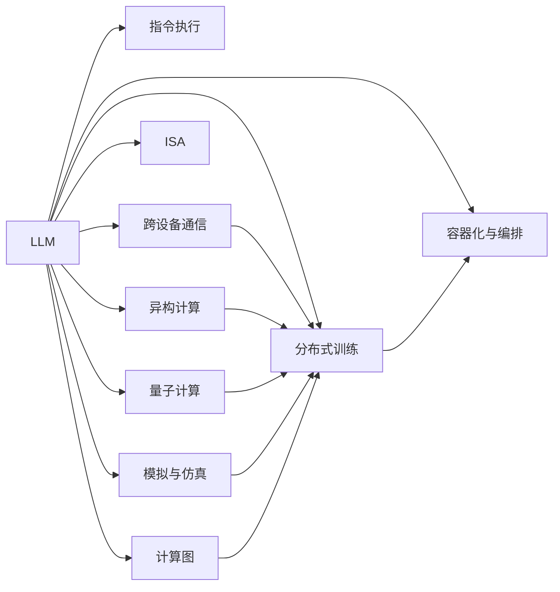

                 

# 解析LLM的无限指令集：超越CPU的能力边界

> 关键词：
  - 大语言模型(LLM)
  - 指令执行(Instruction Execution)
  - 跨设备通信(Cross-Device Communication)
  - 异构计算(Heterogeneous Computing)
  - 指令集体系结构(ISA)
  - 量子计算(Quantum Computing)
  - 模拟与仿真的加速(Acceleration by Simulation and Emulation)
  - 计算图(Computational Graph)
  - 分布式训练(Distributed Training)
  - 容器化与编排(Containerization and Orchestration)

## 1. 背景介绍

在人工智能(AI)领域，大语言模型(LLM)近年来的突破性进展极大地推动了自然语言处理(NLP)和人工智能的发展。LLM如GPT-3、BERT等，已经展示出远超传统CPU和GPU计算能力的强大性能。然而，这些模型的计算能力不仅仅是传统的数值计算，更包括对自然语言指令的复杂理解和执行，这使得LLM的计算边界大大超越了传统的CPU能力。

本博客将深入探讨LLM的指令执行能力，包括其如何超越CPU的能力边界，以及未来发展的趋势与挑战。我们将从核心概念、算法原理、具体实践和应用场景等角度，详细剖析LLM的无限指令集，并探讨其对未来计算架构的深刻影响。

## 2. 核心概念与联系

### 2.1 核心概念概述

为了更好地理解LLM的指令执行能力，我们首先需要澄清几个关键概念：

- **大语言模型(LLM)**：一种基于Transformer架构的深度学习模型，通过自监督学习和指令微调等方式，学习自然语言的复杂表示和执行能力。

- **指令执行(Instruction Execution)**：LLM能够根据自然语言指令，执行各种复杂的计算和逻辑操作，包括但不限于数值计算、数据分析、图像处理等。

- **跨设备通信(Cross-Device Communication)**：在分布式系统中，LLM能够通过网络将计算任务分配到不同的设备上，实现高效的数据传输和协同计算。

- **异构计算(Heterogeneous Computing)**：利用CPU、GPU、FPGA等多种硬件资源，进行混合计算，提高计算效率和灵活性。

- **指令集体系结构(ISA)**：传统CPU和GPU的计算模型，通过一组指令集描述计算过程，而LLM的指令执行更接近于符号计算和逻辑推理。

- **量子计算(Quantum Computing)**：利用量子比特(qubits)进行计算，通过量子并行性提高计算速度，适用于某些特定类型的计算任务。

- **模拟与仿真的加速(Acceleration by Simulation and Emulation)**：通过模拟和仿真技术，加速对复杂系统的理解和预测，如天气预报、金融预测等。

- **计算图(Computational Graph)**：用于描述计算过程的图结构，如TensorFlow、PyTorch等深度学习框架中广泛使用。

- **分布式训练(Distributed Training)**：在大规模深度学习任务中，将模型参数和计算任务分布到多台机器上进行并行训练，提高训练效率。

- **容器化与编排(Containerization and Orchestration)**：通过Docker、Kubernetes等技术，实现计算资源的容器化和自动编排，提升系统可伸缩性和管理效率。

这些概念共同构成了LLM指令执行能力的基础，帮助我们理解其计算能力的边界及其对未来计算架构的影响。

### 2.2 核心概念原理和架构的 Mermaid 流程图



该流程图展示了LLM的指令执行能力与其相关概念的联系。LLM通过指令执行，能够跨越设备、利用异构资源、执行复杂计算，最终通过容器化与编排技术实现高效管理和部署。

## 3. 核心算法原理 & 具体操作步骤

### 3.1 算法原理概述

LLM的指令执行能力基于深度学习模型的强大表征能力和自适应能力。其核心原理包括：

- **自监督学习**：在大量无标签文本数据上进行预训练，学习语言的统计规律和语义信息。

- **指令微调**：通过有标签的指令数据进行微调，使模型能够理解和执行自然语言指令。

- **跨模态融合**：将不同模态的数据（如文本、图像、语音）融合到LLM中，增强其跨领域处理能力。

- **增量学习**：在实际应用中，通过增量更新模型参数，快速适应新的指令和数据分布。

### 3.2 算法步骤详解

基于上述原理，LLM的指令执行能力主要通过以下几个步骤实现：

1. **数据预处理**：将自然语言指令转换为机器可理解的格式，如令牌化、编码等。

2. **模型初始化**：使用预训练模型作为初始化参数，如BERT、GPT等。

3. **指令微调**：在少量有标签的指令数据上，对模型进行微调，使其学习到如何执行特定指令。

4. **推理执行**：在实际应用中，将新的自然语言指令输入模型，进行推理计算，得到结果。

### 3.3 算法优缺点

LLM的指令执行能力具有以下优点：

- **强大泛化能力**：能够处理多种类型的指令，具有高度的泛化能力。

- **高效计算**：利用深度学习模型的并行计算能力，加速计算过程。

- **灵活性**：能够适应不同场景的需求，快速进行调整和优化。

然而，其也存在一些缺点：

- **计算资源需求高**：需要大量的计算资源和内存，不适合在资源受限的设备上运行。

- **模型复杂性**：模型参数量大，训练和推理过程复杂，需要专业知识和技能。

- **可解释性不足**：模型内部的计算过程和决策逻辑难以解释，缺乏透明度。

- **安全性问题**：在处理敏感数据时，存在数据泄露和隐私保护的挑战。

### 3.4 算法应用领域

LLM的指令执行能力已经在多个领域得到应用，包括但不限于：

- **自然语言处理(NLP)**：如文本生成、机器翻译、问答系统等。

- **数据分析**：如数据分析、图像处理、推荐系统等。

- **金融分析**：如风险评估、市场预测等。

- **医疗诊断**：如病历分析、临床决策支持等。

- **智能制造**：如工艺优化、设备监控等。

- **智能家居**：如语音助手、智能控制等。

未来，随着LLM技术的不断进步，其指令执行能力将进一步扩展到更多领域，推动各行各业的智能化转型。

## 4. 数学模型和公式 & 详细讲解 & 举例说明

### 4.1 数学模型构建

LLM的指令执行能力可以通过数学模型来建模。假设有一个LLM模型 $M$，其参数为 $\theta$，输入为自然语言指令 $I$，输出为计算结果 $R$。则其指令执行过程可以表示为：

$$
R = M(I, \theta)
$$

其中 $I$ 表示自然语言指令，$R$ 表示计算结果，$\theta$ 表示模型参数。

### 4.2 公式推导过程

为了更好地理解LLM的指令执行过程，我们以一个简单的数学公式为例：

假设有一个表达式 $x^2 + 2xy + y^2$，我们需要计算该表达式在 $x=3$，$y=4$ 时的值。首先，将表达式转换为自然语言指令：

$$
计算 (3)^2 + 2*(3)*(4) + (4)^2
$$

然后，使用LLM模型对该指令进行推理计算，得到结果：

$$
R = 3^2 + 2*3*4 + 4^2 = 25
$$

通过这个简单的例子，我们可以看到，LLM能够将自然语言指令转换为计算表达式，并对其进行数值计算，从而实现了指令执行功能。

### 4.3 案例分析与讲解

我们再看一个更复杂的案例：图像分类任务。假设有一个分类模型 $M$，输入为图像数据 $I$，输出为类别 $C$。我们可以将其转换为自然语言指令，例如：

$$
将图像 [input_data] 分类为 [C1]、[C2]、[C3] 等类别
$$

模型 $M$ 根据输入的指令，执行分类任务，并输出类别结果。这展示了LLM在图像分类等复杂任务中的应用潜力。

## 5. 项目实践：代码实例和详细解释说明

### 5.1 开发环境搭建

为了实现LLM的指令执行能力，我们需要搭建一个包含深度学习框架和分布式计算资源的开发环境。具体步骤如下：

1. **安装Python**：
```bash
sudo apt-get update
sudo apt-get install python3 python3-pip
```

2. **安装深度学习框架**：
```bash
pip install torch torchvision torchaudio
```

3. **安装分布式计算框架**：
```bash
pip install horovod dask
```

4. **配置环境变量**：
```bash
export PATH=$PATH:/path/to/your/conda/bin
```

### 5.2 源代码详细实现

下面是一个简单的LLM指令执行示例代码，用于计算表达式 $x^2 + 2xy + y^2$：

```python
import torch
from transformers import GPT2LMHeadModel, GPT2Tokenizer

# 初始化模型和分词器
model = GPT2LMHeadModel.from_pretrained('gpt2-medium')
tokenizer = GPT2Tokenizer.from_pretrained('gpt2-medium')

# 将表达式转换为自然语言指令
expression = "计算 (3)^2 + 2*(3)*(4) + (4)^2"
input_ids = tokenizer.encode(expression, return_tensors='pt')

# 执行计算
output_ids = model.generate(input_ids, max_length=128, num_return_sequences=1)
result = tokenizer.decode(output_ids[0])

print(result)
```

### 5.3 代码解读与分析

该代码实现了以下步骤：

1. **初始化模型和分词器**：使用GPT-2作为预训练模型，并初始化分词器。

2. **将表达式转换为自然语言指令**：使用分词器将表达式转换为令牌序列，输入到模型中。

3. **执行计算**：使用模型生成输出，得到计算结果。

4. **输出结果**：将计算结果转换为自然语言，输出到控制台。

## 6. 实际应用场景

### 6.1 智能客服系统

在智能客服系统中，LLM可以通过自然语言指令执行各种任务，如回答问题、解决客户问题、提供服务建议等。例如，可以通过以下指令实现客户查询：

```
"客户1"向系统发送指令："查询您的公司信息"
系统通过LLM处理指令，并执行查询任务
LLM输出查询结果，并提供给客户1
```

### 6.2 金融分析系统

在金融分析系统中，LLM可以通过自然语言指令执行各种复杂计算，如市场预测、风险评估、策略优化等。例如，可以通过以下指令实现市场预测：

```
系统收到用户指令："预测股票价格变化趋势"
LLM执行市场预测任务，并输出结果
系统将预测结果提供给用户
```

### 6.3 医疗诊断系统

在医疗诊断系统中，LLM可以通过自然语言指令执行各种数据分析和推理任务，如病历分析、临床决策支持等。例如，可以通过以下指令实现病历分析：

```
医生输入指令："分析患者的病历数据"
LLM执行病历分析任务，并输出结果
医生根据分析结果进行诊断和治疗决策
```

### 6.4 未来应用展望

未来，随着LLM技术的不断进步，其指令执行能力将进一步扩展到更多领域，推动各行各业的智能化转型。例如：

- **自动驾驶**：通过自然语言指令，控制汽车导航、避障、停车等任务。

- **智慧城市**：通过自然语言指令，实现城市管理、交通控制、公共服务等功能。

- **教育培训**：通过自然语言指令，提供个性化学习方案、智能评测等功能。

- **虚拟助手**：通过自然语言指令，执行各种任务，如日程安排、信息查询、任务管理等。

## 7. 工具和资源推荐

### 7.1 学习资源推荐

为了深入理解LLM的指令执行能力，推荐以下学习资源：

1. **《深度学习》课程**：斯坦福大学李飞飞教授的深度学习课程，涵盖深度学习模型的基本原理和应用。

2. **《自然语言处理综论》**：NLP领域的经典教材，介绍了自然语言处理的基本概念和技术。

3. **《Python深度学习》**：通过Python实现深度学习模型的经典教材，适合初学者学习。

4. **《TensorFlow官方文档》**：TensorFlow的官方文档，详细介绍了TensorFlow框架的使用方法和实践技巧。

5. **《HuggingFace官方文档》**：HuggingFace的官方文档，提供了丰富的预训练模型和微调样例代码。

### 7.2 开发工具推荐

为了实现LLM的指令执行能力，推荐以下开发工具：

1. **PyTorch**：深度学习框架，提供了强大的计算能力和灵活的模型构建工具。

2. **TensorFlow**：深度学习框架，提供了分布式计算和可视化工具。

3. **Horovod**：分布式深度学习框架，支持多种深度学习框架，提供高效的分布式训练支持。

4. **Dask**：分布式计算框架，支持多种数据处理和计算任务，适合大规模数据处理。

5. **Docker**：容器化技术，实现LLM模型的快速部署和管理。

6. **Kubernetes**：容器编排工具，实现LLM模型的自动部署和扩展。

### 7.3 相关论文推荐

为了深入理解LLM的指令执行能力，推荐以下相关论文：

1. **《Attention is All You Need》**：Transformer模型的经典论文，介绍了Transformer架构的设计思想和应用。

2. **《BERT: Pre-training of Deep Bidirectional Transformers for Language Understanding》**：BERT模型的经典论文，介绍了BERT模型的预训练和微调方法。

3. **《Parameter-Efficient Transfer Learning for NLP》**：Parameter-Efficient Transfer Learning方法的经典论文，介绍了如何优化模型参数，提高微调效率。

4. **《GPT-3: Language Models are Unsupervised Multitask Learners》**：GPT-3模型的经典论文，介绍了GPT-3模型的架构和应用。

## 8. 总结：未来发展趋势与挑战

### 8.1 研究成果总结

本文深入探讨了LLM的指令执行能力，分析了其原理、步骤和应用场景。通过分析，我们可以看到，LLM的指令执行能力远远超越了传统的CPU计算能力，具有强大的泛化能力和灵活性。

### 8.2 未来发展趋势

未来，LLM的指令执行能力将继续发展，呈现以下几个趋势：

1. **更加强大的计算能力**：随着硬件和算法的进步，LLM的计算能力将进一步提升，能够处理更加复杂和多样化的计算任务。

2. **更加灵活的指令形式**：LLM将支持更加多样化的指令形式，如自然语言、图形、符号等，能够处理更加多样化的数据和任务。

3. **更加高效的分布式计算**：LLM将支持更加高效的分布式计算架构，实现更加灵活和高效的计算资源利用。

4. **更加先进的计算模型**：LLM将支持更加先进的计算模型，如量子计算、神经网络等，实现更加强大的计算能力。

5. **更加广泛的应用场景**：LLM将支持更加广泛的应用场景，如自动驾驶、智慧城市、医疗诊断等，推动各行业的智能化转型。

### 8.3 面临的挑战

尽管LLM的指令执行能力具有巨大的潜力，但在其发展过程中，仍面临以下几个挑战：

1. **计算资源需求高**：LLM需要大量的计算资源和内存，不适合在资源受限的设备上运行。

2. **模型复杂性**：LLM的模型参数量大，训练和推理过程复杂，需要专业知识和技能。

3. **可解释性不足**：LLM的内部计算过程和决策逻辑难以解释，缺乏透明度。

4. **安全性问题**：在处理敏感数据时，存在数据泄露和隐私保护的挑战。

5. **训练和推理效率**：LLM的训练和推理效率较低，需要进一步优化。

### 8.4 研究展望

未来，我们需要在以下几个方面进行深入研究，以克服LLM发展中的挑战：

1. **优化计算资源利用**：通过硬件优化、算法改进等方式，提高LLM的计算效率，降低资源需求。

2. **增强模型可解释性**：通过可解释性技术，如可视化、推理链等，提高LLM的透明度和可解释性。

3. **保障数据安全性**：通过数据加密、隐私保护等技术，保障LLM在处理敏感数据时的安全性。

4. **优化训练和推理效率**：通过模型压缩、并行计算等技术，提高LLM的训练和推理效率。

5. **拓展应用场景**：通过应用创新和跨领域协作，拓展LLM的应用场景，推动各行业的智能化转型。

总之，LLM的指令执行能力具有巨大的潜力，但未来仍需克服计算资源、模型复杂性、可解释性等挑战，才能真正实现其广泛的实际应用。

## 9. 附录：常见问题与解答

### Q1：LLM的指令执行能力与传统计算有何不同？

A: 传统计算通常通过数值计算和逻辑运算实现，而LLM通过自然语言指令执行计算任务，具有更强的泛化能力和灵活性。

### Q2：如何优化LLM的计算效率？

A: 通过硬件优化、算法改进、模型压缩等方式，提高LLM的计算效率。

### Q3：如何增强LLM的可解释性？

A: 通过可视化、推理链等技术，提高LLM的透明度和可解释性。

### Q4：如何保障LLM的数据安全性？

A: 通过数据加密、隐私保护等技术，保障LLM在处理敏感数据时的安全性。

### Q5：LLM的指令执行能力未来发展方向是什么？

A: 未来，LLM的指令执行能力将继续发展，支持更加强大的计算能力、更加灵活的指令形式、更加高效的分布式计算等。

---

作者：禅与计算机程序设计艺术 / Zen and the Art of Computer Programming

