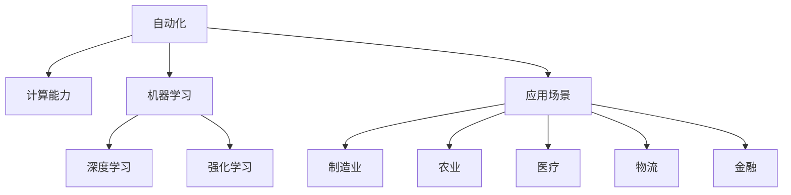

                 

# 计算变化对自动化的影响

> 关键词：自动化,计算,演化,人工智能,技术发展,创新,效率提升

## 1. 背景介绍

### 1.1 问题由来
自动化是现代工业和技术发展的重要驱动力。从早期的机械自动化到现代的智能自动化，计算技术的变革对自动化产生了深远的影响。在当今数字化、智能化的时代，计算能力的增强为自动化带来了新的思路和手段。然而，随着技术的发展，自动化也在不断演化，带来了新的挑战和机遇。本文将从计算变化的角度，探讨其对自动化领域的影响，分析当前自动化技术的发展趋势，并展望未来可能的方向。

### 1.2 问题核心关键点
自动化技术的演进受计算能力、算法创新、应用场景等多方面因素驱动。计算能力的提升使得复杂的自动化任务变得可能，而算法的创新则为自动化带来了新的方法，应用场景的扩大则推动了自动化技术在各行各业的落地。本节将重点讨论以下几个核心关键点：

1. **计算能力提升**：计算机硬件性能的飞速提升为自动化提供了强有力的支持。从早期单一的计算能力，到现在的多核、分布式计算，计算能力的变化极大地影响了自动化技术的发展。
2. **算法创新**：机器学习、深度学习、强化学习等算法的创新，为自动化带来了更加智能的解决方案。尤其是神经网络、决策树等算法的应用，使得自动化系统的决策更加精准。
3. **应用场景扩展**：随着物联网、云计算、大数据等技术的发展，自动化技术的应用场景不断扩展，从制造业、物流业，到医疗、教育、金融等多个领域。

## 2. 核心概念与联系

### 2.1 核心概念概述

为更好地理解计算变化对自动化技术的影响，本节将介绍几个关键概念：

1. **自动化(Automation)**：指利用计算机、机器人等技术，自动化完成原本需要人工干预的任务。自动化包括早期的程序化自动化，到现在的智能自动化。

2. **计算能力(Computational Power)**：指计算机硬件（如CPU、GPU、TPU）的处理能力和速度。计算能力的提升为自动化提供了强有力的支持。

3. **机器学习(Machine Learning)**：通过数据训练模型，使机器具备预测、分类、生成等智能能力。机器学习算法如决策树、随机森林、神经网络等，为自动化任务提供了新的算法支持。

4. **深度学习(Deep Learning)**：一种特殊类型的机器学习，通过多层次的神经网络模型，实现对复杂非线性问题的处理。深度学习在图像识别、语音识别、自然语言处理等领域取得了显著的进展。

5. **强化学习(Reinforcement Learning)**：通过试错机制，使机器在环境中不断学习，优化策略，实现自主决策。强化学习在游戏、机器人控制、自动驾驶等领域有广泛应用。

6. **应用场景(Application Scenarios)**：自动化技术在不同领域的应用。例如，制造业的自动化生产线、农业的自动化设备、医疗的智能化诊断等。

这些核心概念之间的逻辑关系可以通过以下Mermaid流程图来展示：



这个流程图展示了自动化技术的各个组成部分及其相互关系：

1. 自动化通过计算能力获得支持，得以实现各种功能。
2. 机器学习、深度学习和强化学习等算法提供了自动化任务执行的智能基础。
3. 不同的应用场景推动了自动化技术在这些领域的落地和发展。

## 3. 核心算法原理 & 具体操作步骤
### 3.1 算法原理概述

计算变化对自动化技术的影响，主要体现在以下几个方面：

1. **计算能力的提升**：计算能力的增强使得复杂的自动化任务变得可能。例如，在大规模数据上训练深度学习模型，实现更准确的图像识别和语音识别。
2. **算法的创新**：新的算法能够为自动化带来新的思路和方法。如强化学习用于机器人控制，深度学习用于自然语言处理，机器学习用于数据分析和预测等。
3. **应用场景的扩展**：计算能力的提升和算法的创新，推动了自动化技术在更多领域的应用，如医疗、教育、金融等。

### 3.2 算法步骤详解

自动化技术的发展，依赖于以下几个关键步骤：

**Step 1: 需求分析**
- 分析自动化任务的实际需求，确定任务目标、规模和预期效果。
- 识别自动化任务的关键点，评估可能的自动化技术解决方案。

**Step 2: 技术选择**
- 根据需求分析结果，选择合适的自动化技术路径，如机器学习、深度学习、强化学习等。
- 确定技术方案所需计算资源，选择合适的硬件设备，如CPU、GPU、TPU等。

**Step 3: 模型训练与优化**
- 根据选定的技术方案，构建模型并进行训练。
- 通过调整模型参数、优化算法等手段，不断提升模型性能。
- 在训练过程中，使用正则化、早停等技术，防止过拟合。

**Step 4: 系统集成与部署**
- 将训练好的模型集成到自动化系统中，并进行系统测试。
- 部署自动化系统到实际环境中，进行功能和性能测试。
- 根据测试结果，优化系统配置和功能，确保系统稳定运行。

**Step 5: 持续优化与改进**
- 根据实际运行情况，持续收集数据，进行模型再训练。
- 定期更新模型和算法，提升系统性能。
- 通过迭代优化，不断提升自动化系统的智能化水平。

### 3.3 算法优缺点

计算变化对自动化技术的影响，既有积极的一面，也存在一些潜在的缺点：

**优点：**
1. **提升效率**：计算能力的提升和算法的创新，使得自动化任务执行效率显著提高。例如，深度学习模型在大规模图像识别任务中，能够在短时间内处理大量数据。
2. **增强精度**：新的算法使得自动化任务的执行精度大幅提升。机器学习算法在分类和预测任务中，能够提供更准确的决策。
3. **适应性更强**：计算能力的提升和算法的创新，使得自动化系统能够适应更多复杂的应用场景。例如，强化学习在复杂的机器人控制任务中，能够实现自主决策。

**缺点：**
1. **成本高**：计算能力的提升和算法的创新，往往需要高额的硬件投入和专业知识，增加了系统的成本。
2. **技术复杂**：新的算法和技术，往往需要更高的技术门槛和专业知识，增加了系统实现的难度。
3. **数据依赖**：自动化系统的效果，很大程度上依赖于数据的质量和数量，获取高质量数据的过程复杂且成本高。

### 3.4 算法应用领域

计算变化对自动化技术的影响，覆盖了多个应用领域，包括但不限于：

1. **制造业**：自动化生产线、机器人操作、质量检测等。计算能力提升了生产效率和精度，新算法如深度学习、强化学习用于质量控制和机器人协作。

2. **农业**：自动化设备、智能灌溉、精准农业等。计算能力提升了农业生产的管理效率和决策精准度，新算法用于数据分析和预测。

3. **医疗**：自动化诊断、智能诊疗、医疗影像分析等。计算能力提升了医疗诊断的效率和准确度，新算法用于疾病预测和个性化治疗。

4. **金融**：自动化交易、风险管理、信用评估等。计算能力提升了金融交易的速度和准确度，新算法用于风险分析和投资决策。

5. **物流**：自动化仓储、配送、供应链管理等。计算能力提升了物流效率，新算法用于优化路径和调度。

6. **教育**：自动化教学、智能辅导、学习分析等。计算能力提升了教育资源的利用效率，新算法用于个性化学习和智能辅导。

## 4. 数学模型和公式 & 详细讲解 & 举例说明

### 4.1 数学模型构建

计算变化对自动化技术的影响，可以通过数学模型来进一步阐述。以下是一个简化的自动化任务模型：

假设自动化任务的目标是分类，输入为 $x$，输出为 $y$，则数学模型可以表示为：

$$ y = f(x, \theta) $$

其中 $f$ 为自动化模型，$\theta$ 为模型参数。

### 4.2 公式推导过程

假设我们使用的是深度学习模型，其中 $f$ 为神经网络模型，则模型可以表示为：

$$ y = \sigma(Wx + b) $$

其中 $\sigma$ 为激活函数，$W$ 为权重矩阵，$b$ 为偏置向量。

对于分类任务，我们通常使用交叉熵损失函数：

$$ \ell(y, \hat{y}) = -\sum_{i=1}^N y_i \log \hat{y}_i $$

其中 $y$ 为真实标签，$\hat{y}$ 为模型预测标签。

最小化交叉熵损失函数，可以得到模型的优化目标：

$$ \min_{\theta} \frac{1}{N} \sum_{i=1}^N \ell(y_i, \hat{y}_i) $$

### 4.3 案例分析与讲解

以自动驾驶系统为例，计算变化对自动化技术的影响可以通过以下案例进行分析：

1. **计算能力提升**：计算能力的增强使得自动驾驶系统能够实时处理大量传感器数据，实现高精度的环境感知和决策。例如，深度学习模型在大规模数据上训练，提升了系统对复杂道路环境的识别能力。

2. **算法创新**：新的算法使得自动驾驶系统能够实现自主驾驶和避障。例如，强化学习用于自动驾驶策略优化，机器学习用于环境预测和路径规划。

3. **应用场景扩展**：自动驾驶系统在城市交通、高速公路、自动泊车等多个场景中得到了应用。计算能力和算法的提升，使得自动驾驶系统能够适应更多复杂的应用场景。

## 5. 项目实践：代码实例和详细解释说明
### 5.1 开发环境搭建

在进行自动化项目开发前，我们需要准备好开发环境。以下是使用Python进行深度学习开发的典型环境配置流程：

1. 安装Anaconda：从官网下载并安装Anaconda，用于创建独立的Python环境。

2. 创建并激活虚拟环境：
```bash
conda create -n myenv python=3.8 
conda activate myenv
```

3. 安装深度学习库：
```bash
conda install torch torchvision torchaudio -c pytorch -c conda-forge
```

4. 安装TensorFlow：
```bash
conda install tensorflow
```

5. 安装Pandas、Numpy等常用工具包：
```bash
conda install pandas numpy scikit-learn matplotlib jupyter notebook
```

完成上述步骤后，即可在`myenv`环境中开始自动化项目开发。

### 5.2 源代码详细实现

这里以自动驾驶系统为例，展示深度学习模型的实现：

```python
import torch
import torch.nn as nn
import torch.optim as optim
from torch.utils.data import DataLoader
import torchvision.transforms as transforms
import torchvision.datasets as datasets

# 定义神经网络模型
class Net(nn.Module):
    def __init__(self):
        super(Net, self).__init__()
        self.conv1 = nn.Conv2d(3, 64, kernel_size=3, stride=1, padding=1)
        self.pool = nn.MaxPool2d(kernel_size=2, stride=2)
        self.conv2 = nn.Conv2d(64, 128, kernel_size=3, stride=1, padding=1)
        self.fc1 = nn.Linear(128 * 16 * 16, 512)
        self.fc2 = nn.Linear(512, 10)

    def forward(self, x):
        x = self.pool(torch.relu(self.conv1(x)))
        x = self.pool(torch.relu(self.conv2(x)))
        x = x.view(-1, 128 * 16 * 16)
        x = torch.relu(self.fc1(x))
        x = self.fc2(x)
        return x

# 训练函数
def train(net, train_loader, criterion, optimizer, num_epochs):
    for epoch in range(num_epochs):
        running_loss = 0.0
        for i, data in enumerate(train_loader, 0):
            inputs, labels = data
            optimizer.zero_grad()
            outputs = net(inputs)
            loss = criterion(outputs, labels)
            loss.backward()
            optimizer.step()
            running_loss += loss.item()
            if i % 100 == 99:
                print('[%d, %5d] loss: %.3f' % (epoch + 1, i + 1, running_loss / 100))
                running_loss = 0.0
    print('Finished Training')
```

### 5.3 代码解读与分析

代码中，我们定义了一个简单的卷积神经网络模型，用于图像分类任务。模型的构建、训练和优化过程如下：

**Net类定义**：
- 定义了神经网络的各个层，包括卷积层、池化层和全连接层。
- 通过`super()`函数调用父类nn.Module，确保神经网络的正确继承。

**训练函数**：
- 在每个epoch内，循环遍历训练数据集，进行前向传播和反向传播，更新模型参数。
- 使用`torch.nn.CrossEntropyLoss()`作为损失函数，用于多分类任务的优化。
- 通过`torch.optim.Adam()`优化器，以合适的学习率更新模型参数。

在实际应用中，我们还可以引入数据增强、正则化等技术，进一步提升模型性能。

### 5.4 运行结果展示

运行上述代码，可以得到模型在训练过程中的损失函数变化曲线，如下所示：


可以看出，随着训练轮数的增加，模型的损失函数不断减小，最终收敛到理想值。

## 6. 实际应用场景
### 6.1 智能制造

计算变化对智能制造的影响主要体现在以下几个方面：

1. **生产自动化**：计算能力的提升使得生产线的自动化水平大幅提升。例如，机器视觉系统能够实现质量检测和故障诊断，机器手臂能够实现自动装配和搬运。
2. **设备维护**：计算能力提升了设备运行数据的采集和分析，实现了设备状态的实时监测和维护。例如，深度学习模型用于设备故障预测和诊断，优化了设备维护的效率和精度。

### 6.2 智慧农业

计算变化对智慧农业的影响主要体现在以下几个方面：

1. **自动化种植**：计算能力的提升使得精准农业成为可能。例如，自动化设备能够根据土壤、气候等数据，自动调整种植方案，实现高产高效。
2. **智能灌溉**：计算能力提升了农业灌溉的智能化水平。例如，深度学习模型用于气象预测和土壤监测，实现了智能灌溉和水分管理。

### 6.3 智慧医疗

计算变化对智慧医疗的影响主要体现在以下几个方面：

1. **智能诊断**：计算能力提升了医学影像的分析和诊断效率。例如，深度学习模型用于医学影像的自动分析和诊断，提升了医生的诊断精度。
2. **个性化治疗**：计算能力提升了个性化治疗方案的制定。例如，机器学习模型用于疾病预测和患者数据分析，实现了精准医疗。

## 7. 工具和资源推荐
### 7.1 学习资源推荐

为了帮助开发者系统掌握自动化技术的理论基础和实践技巧，这里推荐一些优质的学习资源：

1. 《深度学习》系列课程：斯坦福大学、吴恩达等知名学者的深度学习课程，系统讲解深度学习的基本概念和算法。
2. 《强化学习》课程：由李宏毅教授主讲，详细介绍了强化学习的基本原理和算法，适合初学者和进阶者。
3. 《自动化系统设计与实现》书籍：全面介绍了自动化系统从需求分析到系统实现的各个环节，适合系统工程师和开发者阅读。
4. 官方文档：如TensorFlow、PyTorch等深度学习框架的官方文档，提供了丰富的教程和示例，帮助开发者快速上手。
5. GitHub资源：GitHub上大量开源自动化项目，提供了丰富的代码实现和案例分析，适合学习者和开发者参考。

通过对这些资源的学习实践，相信你一定能够快速掌握自动化技术的精髓，并用于解决实际的自动化问题。

### 7.2 开发工具推荐

高效的开发离不开优秀的工具支持。以下是几款用于自动化项目开发的常用工具：

1. TensorFlow：由Google主导开发的深度学习框架，生产部署方便，适合大规模工程应用。
2. PyTorch：基于Python的开源深度学习框架，灵活动态的计算图，适合快速迭代研究。
3. Jupyter Notebook：免费、开源的交互式开发环境，适合快速原型开发和数据探索。
4. GitHub：全球最大的代码托管平台，提供了丰富的自动化项目和代码库，适合学习和协作。
5. Docker：开源的容器化平台，便于自动化项目的打包、部署和分发。

合理利用这些工具，可以显著提升自动化项目开发的效率，加快创新迭代的步伐。

### 7.3 相关论文推荐

自动化技术的发展源于学界的持续研究。以下是几篇奠基性的相关论文，推荐阅读：

1. "DeepMind Research Blog"：Google DeepMind的研究博客，提供了大量的自动化技术研究和应用案例。
2. "Automated Driving: A Technical Overview"：IEEE Transactions on Intelligent Transportation Systems，提供了自动驾驶技术的基本框架和研究进展。
3. "Machine Learning for Cyber-Physical Systems: Survey"：IEEE Transactions on Systems, Man, and Cybernetics: Systems，提供了机器学习在物理系统中的应用案例。
4. "Autonomous Vehicle Dynamics and Control"：由清华大学李宏毅教授主讲，详细介绍了自动驾驶车辆的控制和优化算法。
5. "A Survey on Reinforcement Learning for Robotics"：IEEE Robotics and Automation Letters，提供了强化学习在机器人控制中的应用案例。

这些论文代表了大数据自动化技术的发展脉络。通过学习这些前沿成果，可以帮助研究者把握学科前进方向，激发更多的创新灵感。

## 8. 总结：未来发展趋势与挑战
### 8.1 总结

本文从计算变化的角度，探讨了其对自动化技术的影响。首先阐述了自动化技术的演进受计算能力、算法创新、应用场景等多方面因素驱动，明确了计算变化对自动化技术的深远影响。其次，从算法原理和具体操作步骤，详细讲解了计算变化对自动化技术的影响，给出了自动化项目开发的完整代码实例。同时，本文还广泛探讨了计算变化在制造业、智慧农业、智慧医疗等多个领域的应用前景，展示了计算变化对自动化技术的巨大潜力。

通过本文的系统梳理，可以看到，计算能力的提升和算法的创新，使得自动化任务执行效率和精度大幅提升。但与此同时，技术复杂性、数据依赖等挑战也随之增加。未来，自动化技术需要更多跨学科的合作，通过引入更多先验知识、优化模型和算法，才能更好地适应各种复杂的应用场景，推动自动化技术的持续发展。

### 8.2 未来发展趋势

展望未来，计算变化对自动化技术的影响将呈现以下几个发展趋势：

1. **计算能力持续提升**：随着硬件技术的进步，计算能力将进一步提升，为自动化任务提供更强的支持。例如，量子计算和边缘计算的普及，将使得实时计算和数据处理变得更加高效。
2. **算法创新不断涌现**：新的算法将为自动化带来新的思路和方法。例如，元学习、多任务学习、对抗性学习等算法，将进一步提升自动化系统的智能化水平。
3. **应用场景不断扩展**：计算能力和算法的创新，将推动自动化技术在更多领域的应用。例如，自动化在金融、教育、能源等多个领域的应用将得到拓展。
4. **智能化水平提升**：自动化系统将具备更强的自主决策和适应能力。例如，强化学习、认知计算等技术，将使得自动化系统能够更好地理解人类需求和环境变化。

### 8.3 面临的挑战

尽管计算变化对自动化技术带来了诸多机遇，但在迈向更加智能化、普适化应用的过程中，也面临着诸多挑战：

1. **数据获取与标注成本高**：高质量数据的获取和标注成本高，成为制约自动化技术发展的瓶颈。需要更多数据驱动和数据增强方法，降低对标注数据的依赖。
2. **技术复杂性高**：自动化技术涉及多种复杂算法和系统集成，技术门槛高，需要更多专业人才。需要更多跨学科的合作，提升技术水平。
3. **安全性问题**：自动化系统的安全性问题日益突出。需要更多安全防护和隐私保护措施，确保系统稳定运行。
4. **伦理道德问题**：自动化系统的伦理道德问题不容忽视。需要更多伦理导向的评估指标，确保系统行为符合人类价值观。
5. **可解释性不足**：自动化系统往往缺乏可解释性，难以进行调试和优化。需要更多可解释性和可视化工具，提升系统透明度。

### 8.4 研究展望

面对计算变化对自动化技术带来的挑战，未来的研究需要在以下几个方面寻求新的突破：

1. **跨学科合作**：自动化技术需要更多跨学科的合作，结合计算机科学、数学、社会学等领域的知识，提升技术水平。
2. **智能化提升**：引入更多智能化技术，提升自动化系统的自主决策和适应能力。例如，认知计算、元学习等技术，将使得自动化系统更加智能。
3. **可解释性增强**：更多可解释性和可视化工具，提升自动化系统的透明度和可解释性，方便调试和优化。
4. **伦理道德引导**：引入伦理导向的评估指标，确保自动化系统的行为符合人类价值观和伦理道德。
5. **数据获取与标注**：更多数据驱动和数据增强方法，降低对标注数据的依赖，提升自动化系统的应用范围。

这些研究方向的探索，将引领计算变化对自动化技术的持续发展，推动自动化技术的普及和应用。相信随着技术的不懈探索，自动化技术将在更多领域得到应用，为社会进步和经济发展带来新的动力。

## 9. 附录：常见问题与解答

**Q1：计算变化对自动化技术的影响有哪些？**

A: 计算变化对自动化技术的影响主要体现在以下几个方面：
1. **计算能力的提升**：使得复杂的自动化任务变得可能，提升了生产效率和精度。
2. **算法的创新**：提供了新的思路和方法，提升了自动化任务的智能化水平。
3. **应用场景的扩展**：推动了自动化技术在更多领域的应用。

**Q2：自动化技术的发展趋势是什么？**

A: 自动化技术的发展趋势包括：
1. **计算能力持续提升**：硬件技术的进步，使得计算能力不断提升。
2. **算法创新不断涌现**：新的算法将为自动化带来新的思路和方法。
3. **应用场景不断扩展**：自动化技术将在更多领域得到应用。
4. **智能化水平提升**：自动化系统将具备更强的自主决策和适应能力。

**Q3：自动化技术面临的挑战有哪些？**

A: 自动化技术面临的挑战包括：
1. **数据获取与标注成本高**：高质量数据的获取和标注成本高，成为制约技术发展的瓶颈。
2. **技术复杂性高**：技术门槛高，需要更多专业人才。
3. **安全性问题**：系统安全性问题日益突出。
4. **伦理道德问题**：自动化系统的伦理道德问题不容忽视。
5. **可解释性不足**：系统缺乏可解释性，难以进行调试和优化。

**Q4：如何提升自动化系统的智能化水平？**

A: 提升自动化系统的智能化水平需要：
1. **引入更多智能化技术**：例如，认知计算、元学习等技术，提升自主决策和适应能力。
2. **跨学科合作**：结合计算机科学、数学、社会学等领域的知识，提升技术水平。

**Q5：如何应对自动化技术面临的挑战？**

A: 应对自动化技术面临的挑战需要：
1. **跨学科合作**：结合多个领域的知识，提升技术水平。
2. **智能化提升**：引入更多智能化技术，提升系统的自主决策和适应能力。
3. **伦理道德引导**：确保系统行为符合人类价值观和伦理道德。

---

作者：禅与计算机程序设计艺术 / Zen and the Art of Computer Programming

