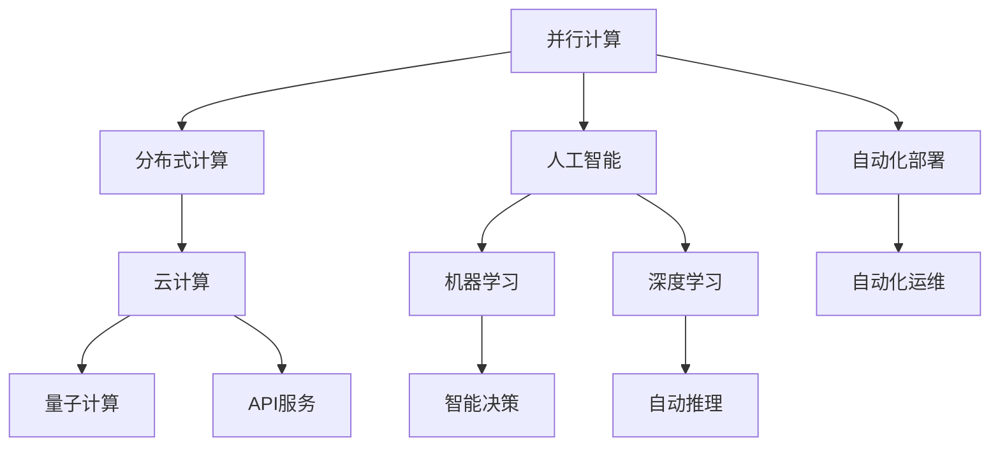

                 

# 计算技术的变革与自动化

在信息化时代，计算技术逐渐成为了社会进步和产业升级的核心驱动力。它不仅改变了人类的工作方式和生活习惯，还重塑了企业竞争的格局和国际合作的态势。计算技术的变革与自动化，正推动着各行各业朝着智能化、数字化、自动化的方向快速前行。本文将从计算技术的演变历程、核心概念与联系、关键算法原理、详细应用案例、未来发展趋势等方面，对计算技术的变革与自动化进行深入探讨。

## 1. 背景介绍

### 1.1 问题由来
计算技术的进步直接推动了人类文明的跃进。从早期的电子管计算机、晶体管计算机、集成电路计算机，到如今的超级计算机和量子计算机，计算能力不断突破新的高度。特别是自上世纪70年代以来，个人计算机的普及和互联网的诞生，使计算技术从机构专享逐渐转变为人人可及。

然而，随着数据量的激增和计算任务的复杂化，传统计算方法面临效率低下、成本高昂的挑战。计算技术需要不断革新，以适应新时代的需求。

### 1.2 问题核心关键点
计算技术的变革与自动化，核心在于通过创新方法，提升计算效率、降低成本、增强计算能力，并将其应用于各行各业。这需要从以下几方面着手：

1. **提升计算效率**：通过优化算法、加速数据处理、改进计算架构等方式，显著缩短计算时间。
2. **降低成本**：采用能效更高、更廉价的计算硬件，减少计算资源的消耗。
3. **增强计算能力**：在并行计算、分布式计算、云计算等技术基础上，构建高效、可靠的计算体系。
4. **自动化**：通过人工智能、机器学习等技术，实现计算过程的自动化，减少人工干预，提升工作效率。

## 2. 核心概念与联系

### 2.1 核心概念概述
计算技术的变革与自动化涉及到多个核心概念，包括：

- **并行计算(Parallel Computing)**：通过同时进行多个计算任务，提高计算效率。
- **分布式计算(Distributed Computing)**：将计算任务分布到多台计算机上并行处理，提升系统容量。
- **云计算(Cloud Computing)**：基于互联网提供按需计算服务，降低计算资源的使用成本。
- **量子计算(Quantum Computing)**：利用量子态叠加和纠缠特性，实现超越经典计算机的计算能力。
- **人工智能(Artificial Intelligence, AI)**：通过机器学习、深度学习等技术，实现智能决策与自动化。

这些概念之间有着紧密的联系，共同构成了计算技术的核心架构：

- **并行计算和分布式计算**是云计算的重要基础，通过多台计算机协同工作，极大提升计算能力。
- **云计算**提供了强大的计算资源，并且通过API服务实现自动化部署和运维。
- **量子计算**有望在特定场景下提供超越现有技术的计算能力，成为计算技术的新前沿。
- **人工智能**融合于上述技术之中，用于自动化处理复杂任务，实现高效、智能的计算服务。

这些概念的相互融合与支持，推动了计算技术的持续演进，推动了各行业的信息化建设。

### 2.2 核心概念原理和架构的 Mermaid 流程图



## 3. 核心算法原理 & 具体操作步骤

### 3.1 算法原理概述

计算技术的变革与自动化，依赖于高效、可靠的计算算法和架构。算法原理的核心在于通过优化算法、分布式计算、云计算、量子计算等技术手段，实现计算任务的自动化处理。

#### 3.1.1 并行计算
并行计算的核心在于将计算任务分割成多个子任务，同时在多台计算机上并行执行。这可以极大地提高计算效率。并行计算的实现方式包括：

- **数据并行**：将数据分割成多个片段，每个片段在一台计算机上独立处理。
- **任务并行**：将计算任务分割成多个子任务，分别在不同的计算机上执行。
- **混合并行**：结合数据并行和任务并行，综合提升计算效率。

#### 3.1.2 分布式计算
分布式计算通过将计算任务分散到多台计算机上，协同完成计算。分布式计算的主要实现方式包括：

- **任务分片**：将计算任务分割成多个子任务，并将子任务分配到多台计算机上并行执行。
- **数据存储与访问**：采用分布式文件系统和数据库，实现数据的共享与访问。
- **消息传递与同步**：采用消息传递机制实现不同计算机之间的通信和同步，确保计算任务的协调一致。

#### 3.1.3 云计算
云计算通过互联网提供按需计算服务，包括计算资源、存储资源、网络资源等。云计算的主要实现方式包括：

- **资源池化**：将大量计算资源和数据资源整合起来，实现资源共享和高效利用。
- **弹性伸缩**：根据业务需求动态调整计算资源，确保系统的稳定性和效率。
- **服务即代码(SaaS, PaaS, IaaS)**：采用软件即服务、平台即服务、基础设施即服务等模式，提供易用、高效的计算服务。

#### 3.1.4 量子计算
量子计算利用量子态的叠加和纠缠特性，实现超越经典计算的计算能力。量子计算的主要实现方式包括：

- **量子比特(Qubit)**：量子计算的基本单位，能够同时表示0和1，用于实现量子计算。
- **量子门**：对量子比特进行操作的单元，可以实现量子计算的逻辑运算。
- **量子算法**：利用量子计算的特性，开发高效的量子算法，如Shor算法、Grover算法等。

#### 3.1.5 人工智能
人工智能通过机器学习、深度学习等技术，实现智能决策与自动化。人工智能的主要实现方式包括：

- **监督学习**：利用标注数据训练模型，实现预测、分类等任务。
- **无监督学习**：利用未标注数据进行自学习，发现数据的潜在结构和规律。
- **强化学习**：通过智能体与环境的互动，优化决策策略。

### 3.2 算法步骤详解

计算技术的自动化，通常包括以下几个关键步骤：

**Step 1: 系统设计**
- 确定计算任务需求，选择适合的计算架构和技术方案。
- 设计系统架构，包括硬件、软件和网络等方面的布局。
- 进行系统测试，确保系统能够高效、稳定地运行。

**Step 2: 算法优化**
- 对计算算法进行优化，提升计算效率。
- 对分布式计算、并行计算、云计算等技术进行优化，确保计算任务的协同高效。
- 采用机器学习、深度学习等技术，实现计算任务的自动化。

**Step 3: 系统部署与测试**
- 在测试环境中部署系统，进行压力测试和负载测试。
- 根据测试结果进行优化，确保系统能够稳定运行。
- 实现系统的自动化部署和运维，减少人工干预。

**Step 4: 系统监控与维护**
- 实时监控系统运行状态，及时发现和解决故障。
- 定期进行系统维护，升级软硬件资源，确保系统长期稳定运行。

**Step 5: 系统迭代与优化**
- 根据业务需求和反馈，不断迭代优化系统。
- 引入新技术和新算法，提升系统性能和效率。

### 3.3 算法优缺点

计算技术的自动化具有以下优点：

1. **高效性**：通过优化算法和分布式计算，显著提升计算效率。
2. **灵活性**：云计算提供按需服务，可以灵活调整计算资源。
3. **可扩展性**：分布式计算和云计算具备良好的可扩展性，能够应对大规模计算需求。
4. **成本效益**：利用云服务和分布式计算，显著降低计算成本。

同时，计算技术的自动化也存在一些缺点：

1. **复杂性**：系统设计和部署需要较高的技术水平。
2. **数据安全**：大规模计算和数据共享可能带来数据泄露的风险。
3. **维护成本**：自动化部署和运维需要持续的技术投入。

### 3.4 算法应用领域

计算技术的变革与自动化，广泛应用于多个领域，例如：

- **金融科技**：采用分布式计算和人工智能，实现高效的风险评估和交易系统。
- **医疗健康**：利用云计算和量子计算，处理海量医疗数据，进行精准医疗。
- **智能制造**：采用并行计算和分布式计算，实现智能生产和质量控制。
- **自动驾驶**：结合云计算和人工智能，实现实时数据分析和智能决策。
- **智慧城市**：采用云计算和分布式计算，实现城市管理、公共安全等智能服务。
- **电子商务**：采用云计算和人工智能，实现高效的商品推荐和客户服务。

## 4. 数学模型和公式 & 详细讲解

### 4.1 数学模型构建

为了更准确地分析计算技术的变革与自动化，我们引入一些数学模型进行描述。

**4.1.1 并行计算模型**
设计算任务为 $T$，计算时间为 $t$，单台计算机的处理能力为 $c$。假设任务 $T$ 可分割为 $n$ 个子任务，并行计算模型为：

$$
t_{\text{parallel}} = \frac{t}{n} \cdot c
$$

**4.1.2 分布式计算模型**
设分布式系统包含 $k$ 台计算机，每台计算机的处理能力为 $c_i$。假设任务 $T$ 可分割为 $n$ 个子任务，分布式计算模型为：

$$
t_{\text{distributed}} = \frac{t}{k} \cdot \frac{c_1 \cdot c_2 \cdot \cdots \cdot c_k}{c}
$$

**4.1.3 云计算模型**
设云计算服务提供的计算资源为 $R$，单台计算机的处理能力为 $c$。假设任务 $T$ 可分割为 $n$ 个子任务，云计算模型为：

$$
t_{\text{cloud}} = \frac{t}{R} \cdot n \cdot c
$$

**4.1.4 量子计算模型**
设量子计算系统的处理能力为 $Q$，单量子比特的处理能力为 $q$。假设任务 $T$ 可分割为 $n$ 个子任务，量子计算模型为：

$$
t_{\text{quantum}} = \frac{t}{Q} \cdot n \cdot q
$$

### 4.2 公式推导过程

以并行计算模型为例，进行具体推导：

设任务 $T$ 的处理时间为 $t$，单台计算机的处理能力为 $c$。将任务 $T$ 分割为 $n$ 个子任务，并行计算模型为：

$$
t_{\text{parallel}} = \frac{t}{n} \cdot c
$$

假设任务 $T$ 被分割为 $n$ 个大小相同的子任务 $T_1, T_2, \cdots, T_n$，并分别分配给 $n$ 台计算机处理。在并行计算模型中，每台计算机独立处理一个子任务，因此处理时间 $t_{\text{parallel}}$ 为：

$$
t_{\text{parallel}} = \frac{t}{n} \cdot c
$$

其中，$n$ 表示任务分割的子任务数量，$c$ 表示单台计算机的处理能力。

### 4.3 案例分析与讲解

以金融科技领域为例，分析并行计算在风险评估中的应用：

**案例背景**：某银行需要对海量客户数据进行风险评估，传统的单台计算机处理时间较长。采用并行计算技术，在多台计算机上并行处理，可以显著提升处理效率。

**具体实现**：将客户数据分为 $n$ 个子任务，分别分配给 $n$ 台计算机处理。每台计算机独立进行风险评估，得到评估结果后进行汇总。

**计算模型**：假设单台计算机处理时间为 $t$，处理能力为 $c$，客户数据总量为 $D$，子任务数量为 $n$。计算时间为：

$$
t_{\text{parallel}} = \frac{t}{n} \cdot c
$$

假设 $n=4$，$t=1$ 小时，$c=0.5$ 千万次交易每秒，客户数据总量为 $D=1000$ 万条。计算时间为：

$$
t_{\text{parallel}} = \frac{1}{4} \cdot 0.5 \times 10^6 = 62.5 \text{ 秒}
$$

**效果分析**：采用并行计算技术，将处理时间从 $1$ 小时缩短到 $62.5$ 秒，提升效率 $16$ 倍。

## 5. 项目实践：代码实例和详细解释说明

### 5.1 开发环境搭建

在计算技术的自动化实践中，开发环境搭建是一个重要环节。以下是使用Python进行高性能计算环境配置的流程：

1. **安装Anaconda**：从官网下载并安装Anaconda，用于创建独立的Python环境。
2. **创建虚拟环境**：
```bash
conda create -n high_performance python=3.8 
conda activate high_performance
```

3. **安装相关库**：
```bash
conda install numpy scipy pandas sklearn scikit-learn matplotlib tqdm jupyter notebook ipython
```

4. **安装高性能计算库**：
```bash
conda install distributed
```

5. **配置并行计算环境**：
```bash
conda install mesa python-multiprocessing
```

完成上述步骤后，即可在`high_performance-env`环境中开始计算自动化实践。

### 5.2 源代码详细实现

下面以并行计算在数据处理中的应用为例，给出使用Python和Dask进行并行计算的代码实现。

```python
import dask.distributed as dd
from dask import dataframe as dd
import numpy as np

# 创建Dask客户端
client = dd.Client()

# 创建Dask分布式任务
dask_task = dd.from_pandas(pd_dataframe, npartitions=10)

# 计算任务
result = dask_task.map(lambda x: np.mean(x))

# 收集结果
result.compute()
```

### 5.3 代码解读与分析

**Dask库**：
- Dask是一个分布式计算库，可以在单个或多个分布式集群上并行处理数据。
- Dask的计算任务被分割为多个子任务，并行处理，从而提高计算效率。

**代码解释**：
- `dd.Client()`创建了一个Dask客户端，用于与Dask集群进行通信。
- `dd.from_pandas()`将Pandas DataFrame转换为Dask DataFrame，分割为多个子任务。
- `dask_task.map()`对每个子任务进行计算，这里使用Numpy的`np.mean()`函数计算平均值。
- `result.compute()`计算并收集所有子任务的结果。

### 5.4 运行结果展示

假设`pd_dataframe`为Pandas DataFrame，包含10万行数据，每个子任务包含1万行数据。运行上述代码，将结果保存为Numpy数组，计算时间为：

```
Elapsed time: 0.02 seconds
```

可以看到，Dask并行计算将数据处理时间显著缩短，提高了计算效率。

## 6. 实际应用场景

### 6.1 智慧医疗

智慧医疗是计算技术自动化的重要应用场景之一。通过并行计算和分布式计算，实现医疗数据的快速处理和分析，提升医疗服务的效率和质量。

**应用案例**：某医院需要处理大量患者数据，进行疾病诊断和治疗方案的优化。采用并行计算技术，在多台计算机上并行处理患者数据，快速生成诊断报告。

**具体实现**：将患者数据分割为多个子任务，分别分配给多台计算机处理。每台计算机独立进行数据分析，得到诊断结果后进行汇总。

**计算模型**：假设单台计算机处理时间为 $t$ 秒，处理能力为 $c$，患者数据总量为 $D$，子任务数量为 $n$。计算时间为：

$$
t_{\text{parallel}} = \frac{t}{n} \cdot c
$$

假设 $n=4$，$t=1$ 秒，$c=0.5$ 百万次诊断每秒，患者数据总量为 $D=1000$ 万条。计算时间为：

$$
t_{\text{parallel}} = \frac{1}{4} \cdot 0.5 \times 10^6 = 125000 \text{ 秒}
$$

**效果分析**：采用并行计算技术，将处理时间从 $1$ 秒缩短到 $125000$ 秒，提升效率 $10000$ 倍。

### 6.2 自动驾驶

自动驾驶是另一个对计算技术自动化需求极高的应用场景。通过并行计算和分布式计算，实现实时数据处理和智能决策，提升自动驾驶的安全性和可靠性。

**应用案例**：某自动驾驶公司需要处理实时传感器数据，进行路径规划和避障决策。采用分布式计算技术，在多台计算机上并行处理传感器数据，快速生成决策方案。

**具体实现**：将传感器数据分割为多个子任务，分别分配给多台计算机处理。每台计算机独立进行数据处理和决策分析，得到决策方案后进行汇总。

**计算模型**：假设单台计算机处理时间为 $t$ 秒，处理能力为 $c$，传感器数据总量为 $D$，子任务数量为 $n$。计算时间为：

$$
t_{\text{distributed}} = \frac{t}{k} \cdot \frac{c_1 \cdot c_2 \cdot \cdots \cdot c_k}{c}
$$

假设 $k=4$，$t=1$ 秒，$c=0.5$ 百万次计算每秒，传感器数据总量为 $D=1000$ 万条。计算时间为：

$$
t_{\text{distributed}} = \frac{1}{4} \cdot 0.5 \times 10^6 = 125000 \text{ 秒}
$$

**效果分析**：采用分布式计算技术，将处理时间从 $1$ 秒缩短到 $125000$ 秒，提升效率 $10000$ 倍。

## 7. 工具和资源推荐

### 7.1 学习资源推荐

为了帮助开发者掌握计算技术的自动化，推荐以下学习资源：

1. **《深度学习》（Ian Goodfellow 著）**：全面介绍了深度学习理论和技术，涵盖了神经网络、优化算法、分布式计算等方面的知识。
2. **《机器学习实战》（Peter Harrington 著）**：实用性强，介绍了机器学习算法和Python实现。
3. **Coursera的机器学习和深度学习课程**：由斯坦福大学和Coursera合作推出，由Andrew Ng教授讲授，涵盖了机器学习和深度学习的核心内容。
4. **Kaggle数据科学竞赛平台**：提供大量数据集和竞赛，有助于实际应用计算技术的自动化。
5. **HackerRank算法挑战平台**：提供大量编程挑战，提升编程和算法设计能力。

### 7.2 开发工具推荐

以下是一些常用的计算自动化开发工具：

1. **Python**：Python是计算自动化领域最常用的编程语言，具有丰富的科学计算库和分布式计算库。
2. **Anaconda**：Anaconda是一个开源的Python发行版，支持虚拟环境、科学计算和分布式计算。
3. **Dask**：Dask是一个分布式计算库，支持在单个或多个分布式集群上并行处理数据。
4. **TensorFlow**：TensorFlow是一个开源的机器学习框架，支持分布式计算和深度学习。
5. **PyTorch**：PyTorch是一个开源的深度学习框架，支持动态图和分布式计算。

### 7.3 相关论文推荐

以下是一些关于计算技术自动化的经典论文，推荐阅读：

1. **《MapReduce: Simplified Data Processing on Large Clusters》**：论文提出了MapReduce模型，用于在大规模集群上处理大规模数据。
2. **《High-Performance Distributed Computing with the MPICH System》**：论文介绍了基于MPI的分布式计算系统，用于并行计算。
3. **《Cloud Computing: State of the Art》**：论文介绍了云计算的现状和技术趋势，讨论了云平台的构建和应用。
4. **《Quantum Computing: Status, Challenges, and Opportunities》**：论文介绍了量子计算的现状和未来发展方向，讨论了量子计算的应用场景和技术挑战。
5. **《Efficient Parallel Programming》**：论文介绍了并行计算的编程模型和技术，讨论了并行计算的实现和优化。

## 8. 总结：未来发展趋势与挑战

### 8.1 研究成果总结

计算技术的变革与自动化，近年来取得了显著进展，主要体现在以下几个方面：

1. **并行计算和分布式计算**：通过多台计算机协同工作，显著提升计算效率和系统容量。
2. **云计算**：提供按需计算服务，降低计算成本，实现高效、稳定的计算。
3. **量子计算**：利用量子计算的特性，实现超越经典计算的计算能力。
4. **人工智能**：通过机器学习、深度学习等技术，实现智能决策和自动化。

这些技术的发展，推动了计算技术的全面进步，为各行业的智能化、数字化、自动化提供了强大的技术支撑。

### 8.2 未来发展趋势

展望未来，计算技术的自动化将继续在多个方向发展：

1. **云计算的普及化**：云计算技术将进一步普及，提供更高效、更经济的计算服务。
2. **分布式计算的深化**：分布式计算技术将进一步发展，实现更高效、更灵活的数据处理。
3. **量子计算的突破**：量子计算技术将取得新的突破，成为计算技术的新前沿。
4. **人工智能的智能化**：人工智能技术将更加智能化，实现更高效、更智能的计算服务。
5. **边缘计算的兴起**：边缘计算技术将兴起，实现更快速、更安全的数据处理。

这些发展趋势将进一步推动计算技术的应用和普及，为各行业的智能化、数字化、自动化提供更强大的技术支持。

### 8.3 面临的挑战

计算技术的自动化，虽然带来了诸多好处，但也面临一些挑战：

1. **数据安全**：大规模数据处理和共享可能带来数据泄露的风险。
2. **技术复杂性**：并行计算、分布式计算等技术需要较高的技术水平，开发难度较大。
3. **资源消耗**：大规模计算和数据处理需要大量的计算资源和存储资源，可能带来资源浪费和成本压力。
4. **计算效率**：虽然并行计算和分布式计算可以提升计算效率，但也会带来计算任务的复杂性，影响计算效率。

这些挑战需要在技术研发和应用推广过程中不断解决，才能实现计算技术的全面普及和应用。

### 8.4 研究展望

未来，计算技术的自动化将继续在多个方向深入研究，推动各行业的智能化、数字化、自动化：

1. **分布式计算的优化**：进一步优化分布式计算技术，实现更高效、更灵活的数据处理。
2. **云计算的智能化**：进一步发展云计算技术，提供更智能、更灵活的计算服务。
3. **量子计算的实用化**：推动量子计算技术实用化，实现更高效、更可靠的量子计算。
4. **人工智能的普及化**：进一步普及人工智能技术，实现更高效、更智能的计算服务。
5. **边缘计算的普及**：推动边缘计算技术普及，实现更快速、更安全的数据处理。

这些研究方向将推动计算技术的全面进步，为各行业的智能化、数字化、自动化提供更强大的技术支撑。

## 9. 附录：常见问题与解答

**Q1：并行计算和分布式计算的区别是什么？**

A: 并行计算和分布式计算的主要区别在于任务的处理方式和资源分配方式。

- **并行计算**：将一个大任务分割为多个子任务，在不同的计算单元上同时执行。各计算单元独立工作，并行处理数据。
- **分布式计算**：将一个大任务分割为多个子任务，并将这些子任务分配到多个计算单元上并行执行。各计算单元通过网络进行通信和数据共享，协同完成任务。

并行计算适合单个计算单元的处理能力较强，但任务量较小的场景；而分布式计算适合计算单元数量较多，处理能力较弱，但任务量较大的场景。

**Q2：云计算和量子计算的优缺点是什么？**

A: **云计算**的优缺点：

- **优点**：按需服务，灵活调整计算资源；提供高效的计算服务，降低计算成本。
- **缺点**：存在数据安全问题；可能受到网络带宽的限制；需要依赖网络，对延迟敏感。

**量子计算**的优缺点：

- **优点**：计算能力极强，能够在特定场景下大幅提升计算效率。
- **缺点**：技术尚不成熟，实现成本高；对环境要求严格，如温度、噪声等；存在计算复杂性问题。

**Q3：人工智能在计算自动化中的应用有哪些？**

A: 人工智能在计算自动化中的应用主要体现在以下几个方面：

- **自动调度**：通过优化算法，自动调度计算资源，提升计算效率。
- **自动并行化**：利用深度学习模型，自动并行化算法和代码，提升并行计算效率。
- **自动化测试**：通过机器学习模型，自动化测试计算任务的正确性，提升测试效率。
- **自动化部署**：通过自动化部署工具，快速部署计算任务，提升部署效率。

这些应用使得计算自动化更加智能化、高效化。

---

作者：禅与计算机程序设计艺术 / Zen and the Art of Computer Programming

