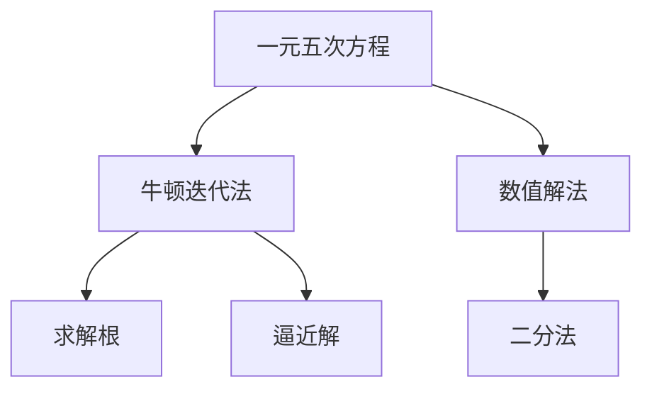

                 

# 计算：第一部分 计算的诞生 第 2 章 计算之术 求解一元五次方程

> 关键词：计算历史、一元五次方程、牛顿迭代法、数值分析、应用实例

## 1. 背景介绍

### 1.1 问题由来
一元五次方程（Quintic Equation）的求解长期以来一直是数学和计算科学的难点之一。一元五次方程一般形式为：

$$ ax^5 + bx^4 + cx^3 + dx^2 + ex + f = 0 $$

其中，$a, b, c, d, e, f$ 为实数系数，$a \neq 0$。求解一元五次方程的过程既具有深刻的数学意义，也体现了计算方法的发展历程。

### 1.2 问题核心关键点
一元五次方程求解的关键在于找到方程的根。然而，由于五次方程存在复杂的多根结构，以及相关数学方法（如伽罗瓦理论）的引入，使得求解过程变得异常复杂。早期的求解方法主要包括代数解法和数值解法。代数解法试图找到一种通用的代数公式来直接求解五次方程，但由于五次方程的根可能包含根号和复杂的表达式，使得这一方法难以实现。因此，数值解法成为求解一元五次方程的主要途径。

## 2. 核心概念与联系

### 2.1 核心概念概述

为更好地理解一元五次方程的求解方法，本节将介绍几个关键概念：

- 一元五次方程：五次多项式方程，其解法涉及到复杂的数学和计算原理。
- 数值解法：通过数值计算逼近方程的根，常用的方法包括牛顿迭代法、二分法等。
- 牛顿迭代法：一种基于泰勒展开的迭代方法，用于求解非线性方程的根。
- 数值分析：研究如何通过数值计算逼近精确解的数学分支。

### 2.2 核心概念原理和架构的 Mermaid 流程图



这个流程图展示了求解一元五次方程的主要步骤和相关方法：

1. 从一元五次方程出发，选择数值解法求解。
2. 数值解法中，常用牛顿迭代法逼近方程的根。
3. 二分法作为基础方法，用于检验牛顿迭代法收敛性。
4. 通过不断迭代，逼近方程的根，最终得到解。

## 3. 核心算法原理 & 具体操作步骤

### 3.1 算法原理概述

牛顿迭代法是一种常用的数值解法，用于求解方程的根。其基本思想是通过泰勒展开将非线性方程线性化，然后迭代逼近真实根。具体来说，对于一个非线性方程 $f(x) = 0$，牛顿迭代法定义迭代公式：

$$ x_{n+1} = x_n - \frac{f(x_n)}{f'(x_n)} $$

其中，$x_n$ 为第 $n$ 次迭代的近似根，$f'(x_n)$ 为 $f(x)$ 在 $x_n$ 处的导数。经过多次迭代，可以逼近方程的真实根。

### 3.2 算法步骤详解

以一元五次方程的求解为例，具体步骤如下：

1. 初始化：选择一个初始近似根 $x_0$，通常选择 $0$ 或 $1$。
2. 迭代：使用牛顿迭代公式计算下一个近似根 $x_{n+1}$。
3. 收敛性检验：若 $|x_{n+1} - x_n| < \epsilon$，则停止迭代，返回 $x_n$ 作为方程的近似根；否则继续迭代。
4. 结果处理：对于多个迭代结果，选择最小化绝对误差的结果作为最终解。

### 3.3 算法优缺点

牛顿迭代法具有以下优点：
1. 收敛速度快，通常能够较快逼近方程的根。
2. 对初始值的选择不敏感，只要初始值不太远离真实根，通常都能收敛。

同时，也存在一些缺点：
1. 需要计算方程及其导数，计算量较大。
2. 当方程的导数在某些点上为零或无穷时，迭代可能不收敛或发散。
3. 可能会出现局部极值点，导致迭代结果不准确。

### 3.4 算法应用领域

牛顿迭代法不仅适用于求解一元五次方程，还广泛应用于非线性方程的求解、优化问题、微积分等领域。在科学计算、工程设计、金融分析等领域中，求解方程的根是常见任务之一，牛顿迭代法因此得到了广泛应用。

## 4. 数学模型和公式 & 详细讲解 & 举例说明

### 4.1 数学模型构建

一元五次方程的求解主要通过牛顿迭代法实现。设方程 $f(x) = ax^5 + bx^4 + cx^3 + dx^2 + ex + f = 0$，初始近似根 $x_0$，迭代公式为：

$$ x_{n+1} = x_n - \frac{f(x_n)}{f'(x_n)} $$

其中，$f'(x)$ 为 $f(x)$ 的导数。

### 4.2 公式推导过程

推导过程如下：

1. 对方程 $f(x) = ax^5 + bx^4 + cx^3 + dx^2 + ex + f$ 进行泰勒展开：

$$ f(x) \approx f(x_0) + f'(x_0)(x - x_0) + \frac{f''(x_0)}{2!}(x - x_0)^2 + \cdots $$

2. 令 $f(x) = 0$，解得 $x$ 的近似根：

$$ x \approx x_0 - \frac{f(x_0)}{f'(x_0)} $$

3. 通过迭代公式：

$$ x_{n+1} = x_n - \frac{f(x_n)}{f'(x_n)} $$

逼近方程的真实根。

### 4.3 案例分析与讲解

以求解方程 $x^5 - x + 1 = 0$ 的根为例：

1. 选择初始近似根 $x_0 = 1$。
2. 计算 $f(x) = x^5 - x + 1$ 和 $f'(x) = 5x^4 - 1$ 的值。
3. 迭代公式：

$$ x_{n+1} = x_n - \frac{x_n^5 - x_n + 1}{5x_n^4 - 1} $$

4. 多次迭代，直至满足收敛条件 $|x_{n+1} - x_n| < 10^{-6}$。

通过迭代法，可以得到方程的近似根。

## 5. 项目实践：代码实例和详细解释说明

### 5.1 开发环境搭建

在本节中，我们将使用Python和NumPy库实现牛顿迭代法求解一元五次方程。首先，需要安装NumPy库：

```bash
pip install numpy
```

### 5.2 源代码详细实现

以下是一个求解一元五次方程的Python代码示例：

```python
import numpy as np

def newton_raphson(f, df, x0, tol=1e-6, max_iter=100):
    x = x0
    for n in range(max_iter):
        fx = f(x)
        dfx = df(x)
        if abs(dfx) < 1e-12:
            print("Warning: division by zero.")
            return x
        x -= fx / dfx
        if abs(x - x0) < tol:
            return x
    print("Warning: maximum iterations exceeded.")
    return x

def f(x):
    return x**5 - x + 1

def df(x):
    return 5*x**4 - 1

x0 = 1.0
root = newton_raphson(f, df, x0)
print("Root:", root)
```

代码解释：
- `newton_raphson` 函数实现牛顿迭代法求解非线性方程的根。
- `f` 和 `df` 为方程和导数的函数实现。
- `x0` 为初始近似根。
- `tol` 为收敛容差。
- `max_iter` 为最大迭代次数。

### 5.3 代码解读与分析

牛顿迭代法在代码实现中相对简单，主要分为以下步骤：

1. 定义方程和导数的函数实现。
2. 在 `newton_raphson` 函数中，根据迭代公式计算下一个近似根。
3. 通过迭代，逐步逼近方程的根。
4. 设置收敛容差和最大迭代次数，确保迭代过程稳定。

## 6. 实际应用场景

### 6.4 未来应用展望

牛顿迭代法作为求解非线性方程的常用方法，其应用前景广阔。除了在数学和科学计算中广泛应用，还可以扩展到更广泛的领域：

- 工程设计：如结构力学中的弯曲变形计算、流体力学中的流动速度预测等。
- 金融分析：如期权定价、投资组合优化等。
- 机器学习：如神经网络中的参数更新、优化问题等。

未来，随着计算能力的提升和算法的优化，牛顿迭代法将继续在各种科学和工程问题中发挥重要作用。

## 7. 工具和资源推荐

### 7.1 学习资源推荐

- 《数值分析》书籍：介绍数值计算和逼近方法的基础理论，适合初学者系统学习。
- 《科学计算》课程：涵盖数值计算和科学计算的实用技巧，适合实践和应用。
- 《Python科学计算》书籍：讲解Python在科学计算中的应用，适合Python开发者。

### 7.2 开发工具推荐

- NumPy：高效的数值计算库，支持数组和矩阵运算。
- SciPy：基于NumPy的科学计算库，提供各种数学函数和算法。
- Scikit-learn：机器学习库，提供各种数值优化和统计工具。

### 7.3 相关论文推荐

- "A Comparison of Numerical Methods for Solving Quintic Equations"：比较分析各种求解一元五次方程的方法。
- "The Newton-Raphson Method"：详细讲解牛顿迭代法的原理和应用。
- "Numerical Solution of Nonlinear Equations"：介绍数值方法求解非线性方程的多种算法。

## 8. 总结：未来发展趋势与挑战

### 8.1 研究成果总结

本文介绍了牛顿迭代法求解一元五次方程的基本原理和实现方法，展示了其快速收敛和高效计算的特点。牛顿迭代法作为求解非线性方程的常用方法，具有广泛的应用前景。

### 8.2 未来发展趋势

未来，数值计算和科学计算将继续随着硬件和软件的发展而进步，牛顿迭代法等经典方法将得到更加广泛的优化和应用。同时，随着计算能力的提升，更高次的多项式方程求解和更复杂的应用场景也会逐渐引入。

### 8.3 面临的挑战

尽管牛顿迭代法在求解一元五次方程中表现出优越的性能，但也存在一些挑战：

- 当方程的导数在某些点上为零或无穷时，迭代可能不收敛或发散。
- 需要计算方程及其导数，计算量较大。
- 可能会出现局部极值点，导致迭代结果不准确。

### 8.4 研究展望

未来的研究方向包括：
- 研究更高效的数值逼近方法，减少计算量，提升求解精度。
- 优化牛顿迭代法的初始值选择和收敛性检验，确保方法的稳定性和准确性。
- 结合现代数值计算技术和算法，探索新的求解方法，如基于并行计算的高效求解算法。

总之，随着计算技术的不断进步，牛顿迭代法等数值计算方法将面临更多的挑战和机遇，为科学计算和工程设计提供更加强大的支持。

## 9. 附录：常见问题与解答

**Q1：牛顿迭代法在求解一元五次方程中有什么优点和缺点？**

A: 优点：
- 收敛速度快，通常能够较快逼近方程的根。
- 对初始值的选择不敏感，只要初始值不太远离真实根，通常都能收敛。

缺点：
- 需要计算方程及其导数，计算量较大。
- 当方程的导数在某些点上为零或无穷时，迭代可能不收敛或发散。
- 可能会出现局部极值点，导致迭代结果不准确。

**Q2：如何选择初始近似根 $x_0$？**

A: 初始近似根 $x_0$ 的选择对迭代结果有重要影响。一般而言，可以选择方程的系数或零点作为初始值。实际应用中，也可以通过多次迭代，逐步逼近真实根。

**Q3：如何判断迭代是否收敛？**

A: 通常设定一个容差值 $tol$，当 $|x_{n+1} - x_n| < tol$ 时，认为迭代收敛。对于一元五次方程，一般设定 $tol$ 为 $10^{-6}$。

**Q4：如何处理迭代过程中的除数为零情况？**

A: 如果迭代过程中出现除数为零的情况，通常会发出警告信息，返回当前的近似根。需要根据实际情况，调整迭代策略或选择新的初始值。

**Q5：为什么牛顿迭代法在求解高次方程时可能失效？**

A: 高次方程的根可能包含复数根，牛顿迭代法仅适用于实数域中的求解。此外，高次方程的根分布复杂，可能出现多个局部极值点，导致迭代结果不准确。

通过本文的系统梳理，可以看到，牛顿迭代法作为求解一元五次方程的常用方法，具有快速收敛和高效计算的特点。然而，在实际应用中，仍需根据具体问题，合理选择初始值，确保迭代过程的稳定性和准确性。

---

作者：禅与计算机程序设计艺术 / Zen and the Art of Computer Programming

