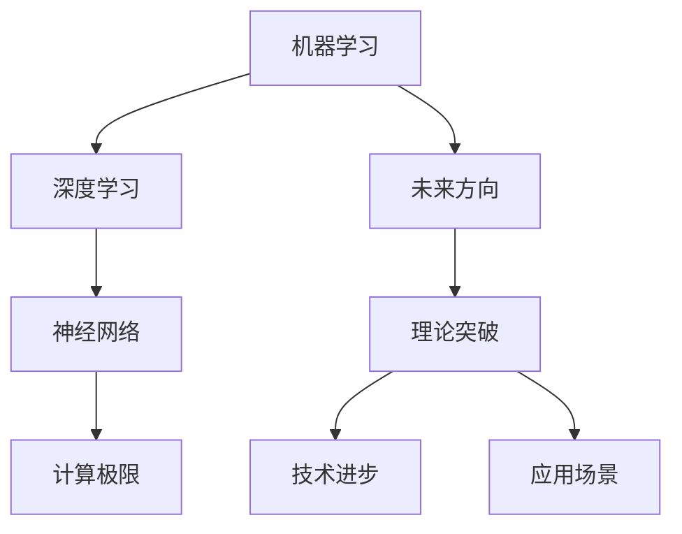

                 

# 计算：第四部分 计算的极限 第 12 章 机器能思考吗 未来的方向

> 关键词：机器学习, 人工智能, 深度学习, 神经网络, 计算极限, 未来方向

## 1. 背景介绍

### 1.1 问题由来
在计算科学的第四部分，我们探讨了计算机和计算极限的问题。随着计算机科学的发展，人工智能（AI）特别是深度学习（Deep Learning）技术的应用日益广泛。深度学习的核心在于利用神经网络模拟人脑的计算过程，从而实现对数据的处理和分析。然而，机器是否能够真正思考，成为近年来科技界和社会大众关注的焦点。本章将深入探讨机器学习的本质，并展望未来人工智能技术的发展方向。

### 1.2 问题核心关键点
机器能否思考的问题，本质上是人工智能的哲学问题。从技术角度看，机器能否思考取决于以下几个关键点：

1. **深度学习模型的能力**：深度学习模型是否能够通过训练，掌握复杂的语言和逻辑推理能力。
2. **模型解释性**：模型能否被解释，其决策过程是否透明。
3. **模型泛化能力**：模型在不同数据集上的表现是否稳定，是否能够处理新数据。
4. **模型安全性**：模型是否会输出有害、歧视性的内容，是否容易被欺骗。

## 2. 核心概念与联系

### 2.1 核心概念概述

为更好地理解机器能否思考的问题，本节将介绍几个密切相关的核心概念：

- **机器学习**（Machine Learning）：通过数据和算法，让机器从经验中学习并优化性能的一种技术。
- **深度学习**（Deep Learning）：一种特殊的机器学习方法，通过构建多层神经网络模型，模拟人脑的神经元连接过程。
- **神经网络**（Neural Network）：由多个神经元（或称为节点）组成的网络，用于处理和分析数据。
- **计算极限**（Computational Limit）：指计算能力在理论和实践上的边界，包括计算速度、存储容量、能量消耗等方面。
- **未来方向**（Future Direction）：指人工智能技术的未来发展趋势，包括理论突破、技术进步、应用场景等。

这些核心概念之间的逻辑关系可以通过以下Mermaid流程图来展示：



这个流程图展示了几大核心概念之间的关联性：

1. 机器学习是深度学习的基础，通过深度学习模型（如神经网络）进行学习和推理。
2. 计算极限是深度学习模型应用的前提，涉及计算速度、存储容量、能量消耗等方面。
3. 未来方向是深度学习模型的目标，包括理论突破、技术进步和应用场景的拓展。

这些概念共同构成了深度学习及其应用的技术框架，使得机器学习能够实现复杂的数据分析和任务处理。

## 3. 核心算法原理 & 具体操作步骤
### 3.1 算法原理概述

机器能否思考的问题，涉及到深度学习模型的本质和应用。本章将从理论和实践两个方面，探讨机器学习模型的能力。

在深度学习中，模型通过训练数据学习到数据的内在规律，能够对新数据进行分类、预测、生成等任务。其核心在于神经网络的结构和参数。神经网络由多层神经元组成，每一层接收前一层的输出作为输入，通过激活函数和权重进行计算，最终输出结果。

深度学习的算法原理主要包括：

1. **前向传播**：将输入数据通过神经网络进行计算，得到模型的预测结果。
2. **反向传播**：通过计算预测结果与真实结果的误差，反向调整神经元之间的权重，以减少误差。
3. **损失函数**：定义模型预测结果与真实结果之间的差异，用于指导反向传播的过程。

### 3.2 算法步骤详解

深度学习模型的训练和推理过程，主要包括以下几个步骤：

**Step 1: 准备数据集**

- 收集并标注训练数据集，确保数据集的多样性和代表性。
- 将数据集划分为训练集、验证集和测试集，以评估模型的性能。

**Step 2: 构建神经网络模型**

- 选择合适的神经网络架构，如卷积神经网络（CNN）、循环神经网络（RNN）、长短期记忆网络（LSTM）等。
- 定义模型的输入层、隐藏层和输出层，以及各层的神经元数量和激活函数。

**Step 3: 设置训练参数**

- 选择合适的优化算法（如SGD、Adam等），设置学习率、批大小、迭代轮数等。
- 应用正则化技术（如L2正则、Dropout等），防止过拟合。
- 设置训练过程中的检查点（checkpoint），保存模型状态。

**Step 4: 执行训练**

- 对训练集数据进行批处理，前向传播计算预测结果。
- 计算预测结果与真实结果的误差，反向传播更新权重。
- 周期性在验证集上评估模型性能，根据性能指标决定是否终止训练。

**Step 5: 测试和部署**

- 在测试集上评估训练后的模型性能，对比训练前后的精度提升。
- 使用训练后的模型对新数据进行推理预测，集成到实际的应用系统中。
- 持续收集新的数据，定期重新训练模型，以适应数据分布的变化。

以上是深度学习模型的训练和推理的一般流程。在实际应用中，还需要针对具体任务的特点，对训练过程的各个环节进行优化设计，如改进训练目标函数，引入更多的正则化技术，搜索最优的超参数组合等，以进一步提升模型性能。

### 3.3 算法优缺点

深度学习模型具有以下优点：

1. **强大的学习能力**：通过训练数据学习到复杂的数据规律，能够处理多种类型的任务。
2. **高度自动化**：模型训练和推理过程自动完成，减少了人工干预的复杂度。
3. **多任务处理**：模型可以同时处理多个任务，实现任务融合和任务切换。

同时，深度学习模型也存在一些局限性：

1. **数据需求量大**：深度学习模型需要大量的标注数据进行训练，数据获取成本较高。
2. **模型复杂度高**：深度学习模型的结构复杂，训练和推理过程中计算资源消耗大。
3. **模型解释性差**：深度学习模型通常被视为“黑盒”，其决策过程难以解释。
4. **泛化能力有限**：深度学习模型在训练数据上表现良好，但在新数据上泛化能力不足。
5. **模型安全性问题**：深度学习模型容易受到对抗样本的欺骗，输出结果可能不安全。

尽管存在这些局限性，但深度学习模型在处理图像、语音、自然语言等多种任务上已经取得了显著的成果，成为人工智能技术的重要支柱。未来相关研究的重点在于如何进一步提高模型的泛化能力，增强模型的可解释性，提升模型的安全性，以及优化模型训练和推理的效率。

### 3.4 算法应用领域

深度学习模型已经在多个领域得到了广泛应用，包括但不限于：

- **计算机视觉**：图像分类、物体检测、图像分割等任务。
- **自然语言处理**：文本分类、情感分析、机器翻译、文本生成等任务。
- **语音识别**：语音转文本、语音情感识别、语音合成等任务。
- **智能推荐**：商品推荐、新闻推荐、视频推荐等任务。
- **医疗诊断**：图像诊断、病理分析、智能问诊等任务。

除了这些经典应用外，深度学习模型还在金融、交通、制造、农业等多个领域找到了应用场景，带来了新的技术突破和业务价值。随着深度学习技术的不断发展，未来其在更多领域的应用前景令人期待。

## 4. 数学模型和公式 & 详细讲解 & 举例说明

### 4.1 数学模型构建

在本节中，我们将使用数学语言对深度学习模型的训练和推理过程进行更加严格的刻画。

记深度学习模型为 $M_{\theta}$，其中 $\theta$ 为模型的可学习参数。假设训练数据集为 $D=\{(x_i,y_i)\}_{i=1}^N$，其中 $x_i$ 为输入数据，$y_i$ 为标签。深度学习模型的训练目标是最小化损失函数 $\mathcal{L}(\theta)$。

常用的损失函数包括交叉熵损失、均方误差损失等。以交叉熵损失为例，假设模型在输入 $x_i$ 上的输出为 $\hat{y}$，真实标签为 $y_i$，则交叉熵损失函数为：

$$
\ell(M_{\theta}(x_i),y_i) = -[y_i\log \hat{y}_i + (1-y_i)\log (1-\hat{y}_i)]
$$

通过梯度下降等优化算法，模型参数 $\theta$ 不断更新，使得损失函数 $\mathcal{L}(\theta)$ 最小化。优化目标为：

$$
\theta^* = \mathop{\arg\min}_{\theta} \mathcal{L}(\theta)
$$

在得到损失函数的梯度后，即可带入优化算法更新模型参数。重复上述过程直至收敛，最终得到最优模型参数 $\theta^*$。

### 4.2 公式推导过程

下面以二分类任务为例，推导交叉熵损失函数及其梯度的计算公式。

假设模型 $M_{\theta}$ 在输入 $x_i$ 上的输出为 $\hat{y}=M_{\theta}(x_i) \in [0,1]$，表示样本属于正类的概率。真实标签 $y_i \in \{0,1\}$。则二分类交叉熵损失函数定义为：

$$
\ell(M_{\theta}(x_i),y_i) = -[y_i\log \hat{y}_i + (1-y_i)\log (1-\hat{y}_i)]
$$

将其代入经验风险公式，得：

$$
\mathcal{L}(\theta) = -\frac{1}{N}\sum_{i=1}^N [y_i\log M_{\theta}(x_i)+(1-y_i)\log(1-M_{\theta}(x_i))]
$$

根据链式法则，损失函数对参数 $\theta_k$ 的梯度为：

$$
\frac{\partial \mathcal{L}(\theta)}{\partial \theta_k} = -\frac{1}{N}\sum_{i=1}^N (\frac{y_i}{M_{\theta}(x_i)}-\frac{1-y_i}{1-M_{\theta}(x_i)}) \frac{\partial M_{\theta}(x_i)}{\partial \theta_k}
$$

其中 $\frac{\partial M_{\theta}(x_i)}{\partial \theta_k}$ 可进一步递归展开，利用自动微分技术完成计算。

在得到损失函数的梯度后，即可带入优化算法，完成模型的迭代优化。重复上述过程直至收敛，最终得到适应下游任务的最优模型参数 $\theta^*$。

### 4.3 案例分析与讲解

以图像分类任务为例，分析深度学习模型的训练和推理过程。

在图像分类任务中，输入数据为图像 $x$，模型输出为图像属于不同类别的概率 $p(y|x)$。模型的结构如图1所示，其中 $h_1, h_2, \cdots, h_L$ 为隐藏层，$f(x)$ 为激活函数，$w_i, b_i$ 为权重和偏置。


假设模型在训练集 $D=\{(x_i,y_i)\}_{i=1}^N$ 上进行训练，损失函数为交叉熵损失，优化算法为AdamW。训练过程如下：

1. 对训练集数据进行批处理，前向传播计算预测结果 $\hat{y}_i = f(\cdots f(w_L h_L + b_L) + b_L)$。
2. 计算预测结果与真实结果的误差 $\ell_i = -y_i\log \hat{y}_i + (1-y_i)\log (1-\hat{y}_i)$。
3. 计算梯度 $\frac{\partial \mathcal{L}(\theta)}{\partial \theta_k}$，使用AdamW算法更新模型参数。
4. 周期性在验证集上评估模型性能，根据性能指标决定是否终止训练。

在测试集上，对新图像数据进行推理预测，得到图像属于不同类别的概率，选择概率最大的类别作为最终预测结果。

通过上述过程，深度学习模型能够从训练数据中学习到图像分类的规律，并应用到新数据上进行分类预测。

## 5. 项目实践：代码实例和详细解释说明
### 5.1 开发环境搭建

在进行深度学习模型的训练和推理前，我们需要准备好开发环境。以下是使用Python进行TensorFlow开发的环境配置流程：

1. 安装Anaconda：从官网下载并安装Anaconda，用于创建独立的Python环境。

2. 创建并激活虚拟环境：
```bash
conda create -n tensorflow-env python=3.8 
conda activate tensorflow-env
```

3. 安装TensorFlow：根据CUDA版本，从官网获取对应的安装命令。例如：
```bash
conda install tensorflow tensorflow-gpu -c conda-forge
```

4. 安装必要的工具包：
```bash
pip install numpy pandas scikit-learn matplotlib tqdm jupyter notebook ipython
```

完成上述步骤后，即可在`tensorflow-env`环境中开始深度学习模型的实践。

### 5.2 源代码详细实现

下面以图像分类任务为例，给出使用TensorFlow对深度学习模型进行训练的PyTorch代码实现。

首先，定义模型的输入输出和损失函数：

```python
import tensorflow as tf
from tensorflow.keras import layers, models

# 定义模型结构
model = models.Sequential()
model.add(layers.Conv2D(32, (3, 3), activation='relu', input_shape=(28, 28, 1)))
model.add(layers.MaxPooling2D((2, 2)))
model.add(layers.Conv2D(64, (3, 3), activation='relu'))
model.add(layers.MaxPooling2D((2, 2)))
model.add(layers.Flatten())
model.add(layers.Dense(64, activation='relu'))
model.add(layers.Dense(10, activation='softmax'))

# 定义损失函数
loss_fn = tf.keras.losses.SparseCategoricalCrossentropy(from_logits=True)

# 定义优化器
optimizer = tf.keras.optimizers.Adam(learning_rate=0.001)
```

然后，定义训练和评估函数：

```python
from tensorflow.keras.datasets import mnist
from tensorflow.keras.utils import to_categorical

# 加载MNIST数据集
(x_train, y_train), (x_test, y_test) = mnist.load_data()
x_train, x_test = x_train / 255.0, x_test / 255.0

# 数据预处理
x_train = x_train.reshape((x_train.shape[0], 28, 28, 1))
y_train = to_categorical(y_train, num_classes=10)

# 定义训练和评估函数
def train_epoch(model, data, batch_size, optimizer, loss_fn):
    dataloader = tf.data.Dataset.from_tensor_slices((data['inputs'], data['labels']))
    dataloader = dataloader.batch(batch_size)
    model.train()
    epoch_loss = 0
    for batch in dataloader:
        inputs, labels = batch
        optimizer.zero_grad()
        with tf.GradientTape() as tape:
            outputs = model(inputs)
            loss = loss_fn(labels, outputs)
        loss.backward()
        optimizer.apply_gradients(tape.gradient(outputs, model.trainable_variables))
        epoch_loss += loss.numpy()
    return epoch_loss / len(dataloader)

def evaluate(model, data, batch_size, loss_fn):
    dataloader = tf.data.Dataset.from_tensor_slices((data['inputs'], data['labels']))
    dataloader = dataloader.batch(batch_size)
    model.eval()
    preds = []
    labels = []
    with tf.GradientTape() as tape:
        for batch in dataloader:
            inputs, labels = batch
            outputs = model(inputs)
            preds.append(outputs.numpy())
            labels.append(labels.numpy())
    return tf.keras.metrics.sparse_categorical_accuracy(labels, preds)

# 启动训练流程并在测试集上评估
epochs = 5
batch_size = 32

for epoch in range(epochs):
    loss = train_epoch(model, x_train, batch_size, optimizer, loss_fn)
    print(f"Epoch {epoch+1}, train loss: {loss:.3f}")
    
    print(f"Epoch {epoch+1}, test accuracy: {evaluate(model, x_test, batch_size, loss_fn)}")
    
print("Final test accuracy:", evaluate(model, x_test, batch_size, loss_fn))
```

以上就是使用TensorFlow对深度学习模型进行图像分类任务训练的完整代码实现。可以看到，TensorFlow提供了强大的API和工具库，使得深度学习模型的构建和训练变得简洁高效。

### 5.3 代码解读与分析

让我们再详细解读一下关键代码的实现细节：

**定义模型结构**：
- 使用Sequential模型，堆叠多个卷积层和全连接层。
- 卷积层用于提取图像特征，全连接层用于分类预测。

**损失函数和优化器**：
- 使用SparseCategoricalCrossentropy损失函数，计算预测结果与真实标签之间的交叉熵。
- 使用Adam优化器，动态调整学习率。

**训练和评估函数**：
- 使用tf.data.Dataset对数据进行批处理，方便模型的前向传播和反向传播。
- 在每个批次上计算梯度并更新模型参数，使用tf.GradientTape自动记录梯度。
- 在验证集上评估模型性能，使用SparseCategoricalAccuracy计算分类准确率。

**训练流程**：
- 在每个epoch内，对训练集数据进行批处理，计算预测结果和损失函数。
- 使用梯度累积和Adam优化器更新模型参数。
- 在测试集上评估模型性能，对比训练前后的准确率。

可以看到，TensorFlow提供了丰富的API和工具库，使得深度学习模型的开发和训练变得更加便捷。开发者可以将更多精力放在模型的优化和任务适配上，而不必过多关注底层的实现细节。

当然，工业级的系统实现还需考虑更多因素，如模型的保存和部署、超参数的自动搜索、更灵活的任务适配层等。但核心的深度学习模型训练流程基本与此类似。

## 6. 实际应用场景
### 6.1 智能推荐系统

基于深度学习模型的智能推荐系统，已经广泛应用于电商、视频、音乐等多个领域。推荐系统通过分析用户的行为数据和偏好，为用户推荐最符合其兴趣的商品、内容等。

在技术实现上，可以收集用户的浏览、点击、购买、评分等行为数据，构建深度学习模型进行训练。模型能够学习到用户行为的内在规律，从而预测用户对新物品的兴趣。在生成推荐列表时，先对候选物品进行预处理，再由模型计算用户与物品之间的相似度，最终根据相似度进行排序推荐。

### 6.2 医疗诊断

深度学习模型在医疗诊断领域也有广泛应用，能够辅助医生进行疾病诊断和治疗方案制定。在图像诊断任务中，通过收集和标注大量的医学影像数据，训练深度学习模型进行疾病识别和病变分析。在自然语言处理任务中，通过分析医生的病历记录，训练模型进行疾病预测和诊断。

在实际应用中，推荐使用GPU/TPU等高性能设备进行训练，以提高计算效率。同时，还需要对模型进行持续更新和优化，以适应医学领域的数据分布变化。

### 6.3 金融风险控制

深度学习模型在金融领域的应用也逐渐增多，特别是在风险控制和欺诈检测等方面。通过分析客户的交易数据和行为模式，深度学习模型能够实时监测异常交易和潜在风险。在实际应用中，通常将模型集成到实时监控系统中，实现自动化风险预警。

在模型构建时，需要考虑模型的鲁棒性和泛化能力，以应对复杂的金融环境。同时，还需要对模型进行定期的评估和优化，以应对数据分布的变化。

### 6.4 未来应用展望

随着深度学习技术的不断发展，未来其在更多领域的应用前景令人期待。

在智慧城市治理中，深度学习模型可以应用于城市事件监测、舆情分析、应急指挥等环节，提高城市管理的自动化和智能化水平，构建更安全、高效的未来城市。

在智能交通系统中，深度学习模型可以应用于车辆识别、交通流量预测、自动驾驶等任务，提高交通管理的效率和安全性。

在工业制造中，深度学习模型可以应用于质量检测、故障诊断、生产优化等任务，提高生产效率和产品质量。

除此之外，深度学习技术还在农业、物流、环保等多个领域找到了应用场景，带来了新的技术突破和业务价值。随着技术的不断进步，深度学习模型必将在更多领域发挥更大的作用。

## 7. 工具和资源推荐
### 7.1 学习资源推荐

为了帮助开发者系统掌握深度学习模型的理论基础和实践技巧，这里推荐一些优质的学习资源：

1. 《深度学习》（Ian Goodfellow等著）：全面介绍了深度学习模型的原理、算法和应用，适合深度学习初学者的入门读物。
2. 《Python深度学习》（Francois Chollet等著）：TensorFlow的官方教程，详细介绍了TensorFlow的基本使用方法和深度学习模型的构建和训练。
3. Coursera《深度学习专项课程》：斯坦福大学开设的深度学习专项课程，包含视频讲解和编程作业，适合系统学习深度学习模型。
4. Arxiv预印本：深度学习领域的最新研究成果和论文，适合跟踪前沿技术和理论进展。
5. Kaggle竞赛：深度学习领域的实际应用竞赛，通过解决实际问题，提升深度学习模型的实战能力。

通过对这些资源的学习实践，相信你一定能够快速掌握深度学习模型的精髓，并用于解决实际的NLP问题。
###  7.2 开发工具推荐

高效的开发离不开优秀的工具支持。以下是几款用于深度学习模型开发的常用工具：

1. TensorFlow：由Google主导开发的深度学习框架，功能强大，支持GPU/TPU等高性能设备。
2. PyTorch：由Facebook主导开发的深度学习框架，灵活性高，易于使用。
3. Keras：高层次的深度学习API，支持TensorFlow、Theano和CNTK等后端，易于上手。
4. Jupyter Notebook：基于Web的交互式编程环境，适合开发和调试深度学习模型。
5. Visual Studio Code：强大的代码编辑器，支持Python和深度学习框架的开发。

合理利用这些工具，可以显著提升深度学习模型的开发效率，加快创新迭代的步伐。

### 7.3 相关论文推荐

深度学习模型的发展源于学界的持续研究。以下是几篇奠基性的相关论文，推荐阅读：

1. Deep Neural Networks for Image Recognition（AlexNet论文）：提出AlexNet模型，为深度学习模型处理图像识别任务奠定了基础。
2. ImageNet Classification with Deep Convolutional Neural Networks（VGG论文）：提出VGG模型，展示了深度卷积神经网络在图像分类任务上的强大能力。
3. Convolutional Neural Networks for Sentence Classification（ResNet论文）：提出ResNet模型，展示了深度残差网络在自然语言处理任务上的良好性能。
4. Attention is All You Need（Transformer论文）：提出Transformer模型，展示了自注意力机制在机器翻译等任务上的效果。
5. Generating Counterfactual Questions for Dynamic Question Answering（Prompt-based Learning论文）：提出Prompt-based Learning方法，利用提示模板引导深度学习模型生成回答问题。

这些论文代表了大规模深度学习模型的发展脉络。通过学习这些前沿成果，可以帮助研究者把握学科前进方向，激发更多的创新灵感。

## 8. 总结：未来发展趋势与挑战
### 8.1 总结

本文对深度学习模型的训练和推理过程进行了全面系统的介绍。首先阐述了深度学习模型的本质和应用，明确了深度学习模型在处理复杂数据、执行多样化任务方面的能力。其次，从理论和实践两个方面，详细讲解了深度学习模型的训练和推理过程，给出了深度学习模型的代码实例。同时，本文还探讨了深度学习模型在多个领域的应用前景，展示了深度学习模型的广泛应用价值。

通过本文的系统梳理，可以看到，深度学习模型在处理复杂数据和执行多样化任务上已经取得了显著的成果，成为人工智能技术的重要支柱。未来，随着深度学习模型的不断发展，其在更多领域的应用前景令人期待。

### 8.2 未来发展趋势

深度学习模型的未来发展趋势主要包括以下几个方面：

1. **模型规模持续增大**：随着算力成本的下降和数据规模的扩张，深度学习模型的参数量将持续增长。超大模型的出现，将进一步提升模型的表现能力。
2. **模型结构更加复杂**：深度学习模型将从二维卷积神经网络扩展到三维卷积神经网络、图神经网络等，以适应更复杂的数据结构。
3. **模型泛化能力提升**：未来深度学习模型将更注重泛化能力的提升，通过迁移学习、对抗训练等方法，增强模型在不同数据分布上的表现。
4. **模型可解释性增强**：未来深度学习模型将更加注重可解释性，通过引入符号化的先验知识、因果推断等方法，增强模型决策过程的透明性。
5. **模型安全性提升**：未来深度学习模型将更加注重安全性，通过对抗训练、知识图谱等方法，防止模型受到攻击和欺骗，保障模型的输出安全。
6. **多模态数据融合**：未来深度学习模型将更多地融合多模态数据，如图像、语音、文本等，实现跨模态的信息整合和协同推理。

以上趋势凸显了深度学习模型的巨大潜力，未来其将在更多领域发挥更大的作用。

### 8.3 面临的挑战

尽管深度学习模型已经取得了显著的成果，但在迈向更加智能化、普适化应用的过程中，它仍面临着诸多挑战：

1. **数据需求量大**：深度学习模型需要大量的标注数据进行训练，数据获取成本较高，特别是在小数据集上。
2. **模型复杂度高**：深度学习模型的结构复杂，训练和推理过程中计算资源消耗大。
3. **模型泛化能力不足**：深度学习模型在训练数据上表现良好，但在新数据上泛化能力不足，容易受到数据分布变化的影响。
4. **模型安全性问题**：深度学习模型容易受到对抗样本的欺骗，输出结果可能不安全。
5. **模型可解释性差**：深度学习模型通常被视为“黑盒”，其决策过程难以解释。

尽管存在这些挑战，但深度学习模型在处理复杂数据和执行多样化任务上已经取得了显著的成果，成为人工智能技术的重要支柱。未来相关研究的重点在于如何进一步提高模型的泛化能力，增强模型的可解释性，提升模型的安全性，以及优化模型训练和推理的效率。

### 8.4 研究展望

面对深度学习模型所面临的挑战，未来的研究需要在以下几个方面寻求新的突破：

1. **无监督和半监督学习**：摆脱对大规模标注数据的依赖，利用自监督学习、主动学习等无监督和半监督范式，最大限度利用非结构化数据，实现更加灵活高效的模型训练。
2. **参数高效和计算高效的模型**：开发更加参数高效的模型，在固定大部分预训练参数的情况下，只更新极少量的任务相关参数。同时优化模型计算图，减少前向传播和反向传播的资源消耗，实现更加轻量级、实时性的部署。
3. **因果推断和对比学习**：引入因果推断和对比学习思想，增强模型建立稳定因果关系的能力，学习更加普适、鲁棒的语言表征，从而提升模型泛化性和抗干扰能力。
4. **多模态数据的融合**：将符号化的先验知识，如知识图谱、逻辑规则等，与神经网络模型进行巧妙融合，引导模型学习更准确、合理的语言模型。同时加强不同模态数据的整合，实现视觉、语音等多模态信息与文本信息的协同建模。
5. **模型解释性增强**：通过引入因果分析方法，识别出模型决策的关键特征，增强模型决策过程的透明性和逻辑性。借助博弈论工具刻画人机交互过程，主动探索并规避模型的脆弱点，提高系统稳定性。
6. **模型安全性提升**：在模型训练目标中引入伦理导向的评估指标，过滤和惩罚有偏见、有害的输出倾向。同时加强人工干预和审核，建立模型行为的监管机制，确保输出符合人类价值观和伦理道德。

这些研究方向的探索，必将引领深度学习模型迈向更高的台阶，为构建安全、可靠、可解释、可控的智能系统铺平道路。面向未来，深度学习模型还需要与其他人工智能技术进行更深入的融合，如知识表示、因果推理、强化学习等，多路径协同发力，共同推动人工智能技术的发展。

## 9. 附录：常见问题与解答

**Q1：深度学习模型能否像人类一样思考？**

A: 深度学习模型目前还不能像人类一样思考。深度学习模型是通过大量数据训练得到的，其决策过程是基于数据的内在规律，而非真正的逻辑推理和思维过程。尽管深度学习模型在某些任务上取得了显著的成果，但其与人类智能的差距依然很大。未来，随着人工智能技术的不断发展，深度学习模型有望在某些特定任务上模拟人类的智能行为，但在全面理解和思考上仍然有很长的路要走。

**Q2：深度学习模型的局限性有哪些？**

A: 深度学习模型的局限性主要包括以下几个方面：
1. 数据需求量大：深度学习模型需要大量的标注数据进行训练，数据获取成本较高。
2. 模型复杂度高：深度学习模型的结构复杂，训练和推理过程中计算资源消耗大。
3. 模型泛化能力不足：深度学习模型在训练数据上表现良好，但在新数据上泛化能力不足。
4. 模型安全性问题：深度学习模型容易受到对抗样本的欺骗，输出结果可能不安全。
5. 模型可解释性差：深度学习模型通常被视为“黑盒”，其决策过程难以解释。

尽管存在这些局限性，但深度学习模型在处理复杂数据和执行多样化任务上已经取得了显著的成果，成为人工智能技术的重要支柱。未来相关研究的重点在于如何进一步提高模型的泛化能力，增强模型的可解释性，提升模型的安全性，以及优化模型训练和推理的效率。

**Q3：如何提高深度学习模型的泛化能力？**

A: 提高深度学习模型的泛化能力，可以从以下几个方面入手：
1. 引入更多的训练数据：增加训练数据的多样性和代表性，使得模型能够学习到更广泛的数据规律。
2. 引入对抗训练：通过对抗样本的攻击和防御，增强模型的鲁棒性，减少模型对输入的依赖。
3. 引入正则化技术：使用L2正则、Dropout等正则化技术，防止模型过拟合。
4. 引入迁移学习：利用在其他领域训练好的模型作为初始化权重，加速模型的训练，提升模型的泛化能力。
5. 引入多模态数据融合：将视觉、语音、文本等多模态数据进行融合，增强模型的理解和推理能力。

这些方法都可以有效提高深度学习模型的泛化能力，使其在新的数据分布上表现更好。

**Q4：深度学习模型的安全性问题有哪些？**

A: 深度学习模型的安全性问题主要包括以下几个方面：
1. 对抗样本攻击：攻击者通过微小扰动，欺骗模型输出错误结果。
2. 输出偏见：模型输出可能包含有害、歧视性的内容，造成安全风险。
3. 数据隐私问题：深度学习模型需要大量数据进行训练，数据隐私保护问题需要特别注意。

为应对这些问题，可以采用以下措施：
1. 对抗训练：通过引入对抗样本的训练，增强模型的鲁棒性。
2. 知识图谱：引入知识图谱等先验知识，减少模型对输入的依赖。
3. 数据加密和隐私保护：对数据进行加密处理，保护数据隐私。
4. 模型解释性增强：通过引入因果分析方法，增强模型决策过程的透明性和逻辑性。

这些措施可以提升深度学习模型的安全性，使其在实际应用中更加可靠。

**Q5：深度学习模型的可解释性问题有哪些？**

A: 深度学习模型的可解释性问题主要包括以下几个方面：
1. 模型决策过程不透明：深度学习模型通常被视为“黑盒”，其决策过程难以解释。
2. 输出结果不可解释：模型输出结果可能无法直观理解，难以进行人为干预。

为解决这些问题，可以采用以下措施：
1. 引入因果分析方法：通过因果分析方法，识别出模型决策的关键特征，增强模型决策过程的透明性。
2. 引入对抗训练：通过对抗训练，增强模型的鲁棒性，减少模型对输入的依赖。
3. 引入知识图谱：引入知识图谱等先验知识，减少模型对输入的依赖。

这些措施可以提升深度学习模型的可解释性，使其在实际应用中更加可靠。

**Q6：深度学习模型的未来发展方向有哪些？**

A: 深度学习模型的未来发展方向主要包括以下几个方面：
1. 模型规模持续增大：随着算力成本的下降和数据规模的扩张，深度学习模型的参数量将持续增长，超大模型的出现将进一步提升模型的表现能力。
2. 模型结构更加复杂：深度学习模型将从二维卷积神经网络扩展到三维卷积神经网络、图神经网络等，以适应更复杂的数据结构。
3. 模型泛化能力提升：未来深度学习模型将更注重泛化能力的提升，通过迁移学习、对抗训练等方法，增强模型在不同数据分布上的表现。
4. 模型可解释性增强：未来深度学习模型将更加注重可解释性，通过引入符号化的先验知识、因果推断等方法，增强模型决策过程的透明性。
5. 模型安全性提升：未来深度学习模型将更加注重安全性，通过对抗训练、知识图谱等方法，防止模型受到攻击和欺骗，保障模型的输出安全。
6. 多模态数据的融合：未来深度学习模型将更多地融合多模态数据，如图像、语音、文本等，实现跨模态的信息整合和协同推理。

这些发展方向凸显了深度学习模型的巨大潜力，未来其将在更多领域发挥更大的作用。

---

作者：禅与计算机程序设计艺术 / Zen and the Art of Computer Programming

