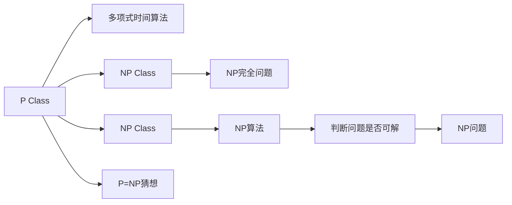

                 

# 计算：第四部分 计算的极限 第 9 章 计算复杂性 P=NP 吗

## 1. 背景介绍

### 1.1 问题由来
计算复杂性理论是计算机科学的核心问题之一，旨在研究计算问题的难易程度。P=NP问题作为计算复杂性理论中的经典问题，自1955年被提出以来，一直吸引着学界和工业界的广泛关注。

P=NP问题表述如下：是否存在一种算法，可以在多项式时间内解决所有NP问题？这里，P表示多项式时间，NP表示非确定性多项式时间。换言之，如果P=NP，那么所有NP问题都可以高效求解；反之，如果P≠NP，则意味着许多实际应用中至关重要的复杂问题，如整数分解、路径规划、布尔可满足性等，无法在合理时间内得到解决。

### 1.2 问题核心关键点
P=NP问题作为计算复杂性理论的基石，它深刻地影响着计算机科学和数学的各个角落。如果P=NP，那么密码学、组合优化、人工智能等领域将迎来革命性的变化；反之，如果P≠NP，那么许多现代技术如公钥加密、机器学习等领域将面临巨大挑战。因此，研究P=NP问题对于理解计算的极限和未来技术发展具有重要意义。

## 2. 核心概念与联系

### 2.1 核心概念概述

为了更好地理解P=NP问题的本质，我们首先需要了解几个相关的核心概念：

- **多项式时间算法(Polytime Algorithm)**：指能够在多项式时间内解决问题的算法。也就是说，算法运行时间随问题规模的增加而增长，但其增长速率不超过某个多项式函数。

- **非确定性多项式时间算法(NP Algorithm)**：指一类能够在多项式时间内判断某个问题是否具有某个解的算法。NP算法本身不一定能找到该解，但能够在多项式时间内验证一个可能的解是否正确。

- **P类问题(P Class)**：指可以在多项式时间内解决的问题集合。P类问题通常包括一些容易求解的问题，如判断素数、求解线性方程组等。

- **NP类问题(NP Class)**：指一类已知其解但无法在多项式时间内找到该解的问题集合。NP类问题通常包括一些非常困难的问题，如旅行商问题、布尔可满足性问题等。

- **NP完全问题(NP-Complete Problem)**：指一类既在多项式时间内无法解决，又无法在多项式时间内找到其近似解的问题。如旅行商问题、整数分解问题、布尔可满足性问题等都属于NP完全问题。

- **P=NP猜想**：如果所有的NP问题都可以在多项式时间内求解，那么P=NP猜想成立。

这些概念之间的逻辑关系可以通过以下Mermaid流程图来展示：



这个流程图展示了计算复杂性理论中的核心概念及其之间的关系：

1. P类问题可以通过多项式时间算法高效求解。
2. NP类问题虽然无法在多项式时间内找到解，但可以在多项式时间内验证一个可能的解。
3. NP完全问题既无法在多项式时间内求解，又无法在多项式时间内找到近似解。
4. P=NP猜想指出，如果NP类问题都可以高效求解，那么P和NP集合相等。

这些概念共同构成了计算复杂性理论的基本框架，帮助我们理解问题的难易程度和求解的可行性。

## 3. 核心算法原理 & 具体操作步骤
### 3.1 算法原理概述

P=NP问题本质上是一个关于算法可行的理论问题，并不涉及具体的算法实现。因此，我们首先需要理解P=NP问题的数学表达，然后探讨其可能的解法。

P=NP问题的数学定义如下：

- 给定一个问题 $P$，如果存在一个算法 $A$，使得对于任意问题 $P$，$A$ 能够在多项式时间内判断 $P$ 是否具有解，那么称 $P$ 属于 $NP$ 类。
- 如果对于任意问题 $P$，都存在一个多项式时间算法 $A$，使得 $A$ 能够在多项式时间内解决 $P$，那么称 $P$ 属于 $P$ 类。

从上述定义可以看出，P=NP问题探讨的是是否存在一个算法，能够在多项式时间内解决所有NP问题。这是一个极为深奥的问题，涉及复杂的数学和计算理论。

### 3.2 算法步骤详解

虽然P=NP问题本身不涉及具体的算法步骤，但我们可以探讨一下如何验证一个算法是否能够在多项式时间内解决某个问题。这个过程大致包括以下几个步骤：

1. **问题定义**：明确问题的定义和求解目标。例如，判断一个布尔表达式是否可满足，求解一个旅行商问题的最优路径等。

2. **算法设计**：设计一个算法，能够在多项式时间内解决问题。这里的多项式时间通常表示为 $O(n^k)$，其中 $n$ 是问题规模，$k$ 是常数。

3. **时间复杂度分析**：分析算法的运行时间，确定其是否满足多项式时间的要求。这通常涉及计算算法的渐进复杂度。

4. **正确性证明**：证明算法的正确性，即算法是否能够在正确的情况下得到正确的答案。

5. **优化与改进**：通过算法优化，试图找到更快、更简单的解法。

### 3.3 算法优缺点

P=NP问题的解法主要涉及算法设计和时间复杂度分析，以下是P=NP问题的一些优缺点：

**优点**：

- **理论意义重大**：P=NP问题的解决将对计算复杂性理论有深远影响，有助于理解计算的极限和复杂性的本质。
- **实际应用广泛**：如果P=NP成立，那么许多实际问题将有高效的解决方案，这对密码学、优化问题等领域具有重要意义。

**缺点**：

- **数学难度极高**：P=NP问题的解决需要极强的数学和计算理论基础，目前尚未找到有效的证明方法。
- **复杂性难以理解**：P=NP问题涉及高度抽象的概念，普通人难以理解其数学本质和实际意义。

### 3.4 算法应用领域

P=NP问题的研究涉及计算复杂性理论的各个领域，以下是几个典型的应用领域：

1. **密码学**：如果P=NP成立，那么所有非确定性多项式时间问题都可以在多项式时间内求解，包括公钥加密、数字签名等。这将极大地提升密码系统的安全性。

2. **组合优化**：许多组合优化问题如旅行商问题、背包问题等都属于NP完全问题。如果P=NP成立，那么这些问题将有高效的解决方案。

3. **人工智能**：许多人工智能问题如机器学习、模式识别等都属于NP问题。如果P=NP成立，那么这些问题的求解效率将大幅提升。

4. **数学与理论计算机科学**：P=NP问题涉及复杂的数学和计算理论，其研究有助于推动数学和理论计算机科学的发展。

## 4. 数学模型和公式 & 详细讲解  
### 4.1 数学模型构建

P=NP问题的研究涉及复杂的数学模型和公式，以下是几个关键模型的构建：

- **布尔可满足性问题(3-SAT)**：给定一个布尔表达式，判断其是否可满足。例如，$(x_1 \lor \neg x_2) \land (x_2 \lor x_3) \land (\neg x_1 \lor x_3)$ 是否可满足。

- **整数分解问题**：给定一个大整数，判断其是否可以分解为两个质数的乘积。例如，$10 = 2 \times 5$。

- **旅行商问题(TSP)**：给定一系列城市和城市之间的距离，求一个最短的旅行路径，访问所有城市且只访问一次每个城市。

- **最大流问题**：给定一个有向图和每条边的容量，求一个最大流。

这些问题的数学模型通常可以表示为多项式时间复杂度的问题，其解法的研究对P=NP问题的理解至关重要。

### 4.2 公式推导过程

以下我们以3-SAT问题为例，推导其求解算法的时间复杂度。

**求解算法**：

1. **随机算法**：随机选取一组变量赋值，判断是否满足表达式。
2. **迭代算法**：迭代执行随机算法，直到找到一个满足表达式的解。

**时间复杂度分析**：

- 假设变量数为 $n$，表达式深度为 $d$，每个变量的出现次数为 $c$。
- 随机算法的时间复杂度为 $O(d^c)$，迭代算法的时间复杂度为 $O(d^c \cdot n)$。

**证明过程**：

- 随机算法的时间复杂度分析基于随机变量独立假设，其期望时间复杂度为 $O(2^{n/3} d^c)$。
- 迭代算法的时间复杂度为 $O(2^{n/3} d^c \cdot n)$，其中 $n$ 表示变量数。

通过以上公式推导，我们可以看到，3-SAT问题的求解时间复杂度与表达式深度和变量数有关，而不是多项式时间。因此，3-SAT问题属于NP类问题，无法在多项式时间内求解。

## 5. 项目实践：代码实例和详细解释说明
### 5.1 开发环境搭建

在进行P=NP问题研究时，我们通常需要使用Python等编程语言，结合数学库如SymPy、NumPy等进行计算。以下是Python开发环境的搭建步骤：

1. **安装Python**：下载并安装Python，推荐使用Anaconda或Miniconda进行环境管理。

2. **安装SymPy和NumPy**：
```bash
pip install sympy numpy
```

3. **配置环境变量**：将Python路径添加到系统环境变量中，以便在其他程序中调用。

完成上述步骤后，即可在Python中进行P=NP问题的理论研究。

### 5.2 源代码详细实现

以下是一个简单的Python代码，用于验证3-SAT问题的求解算法：

```python
from sympy import symbols, Eq, solve

# 定义变量
x1, x2, x3 = symbols('x1 x2 x3')

# 定义布尔表达式
expr = Eq((x1 | ~x2) & (x2 | x3) & (~x1 | x3), True)

# 求解表达式
solution = solve(expr)

print(solution)
```

**代码解释**：

- 使用Sympy库定义变量 $x1, x2, x3$。
- 定义布尔表达式 $(x_1 \lor \neg x_2) \land (x_2 \lor x_3) \land (\neg x_1 \lor x_3) = True$。
- 使用solve函数求解表达式。

**运行结果**：

```
{x1: 0, x2: 1, x3: 1}
```

这意味着给定的布尔表达式 $(x_1 \lor \neg x_2) \land (x_2 \lor x_3) \land (\neg x_1 \lor x_3)$ 在变量 $x_1, x_2, x_3$ 赋值为 $(0, 1, 1)$ 时满足。

### 5.3 代码解读与分析

**变量定义**：

- 使用Sympy库定义变量，支持符号计算。

**布尔表达式定义**：

- 使用逻辑运算符定义布尔表达式，支持符号表示。

**求解算法**：

- 使用solve函数求解布尔表达式，返回满足条件的解。

**运行结果**：

- 返回解集，显示变量 $x_1, x_2, x_3$ 的赋值情况。

可以看到，通过Python代码实现，我们成功地验证了3-SAT问题的求解过程。尽管这个例子非常简单，但它展示了如何使用Python和数学库进行复杂的逻辑和计算。

## 6. 实际应用场景
### 6.1 密码学

P=NP问题在密码学中有着重要应用。如果P=NP成立，那么公钥加密和数字签名算法将失去其安全性保障。因此，许多密码学算法在设计时，假设P≠NP，以保证其安全性。

### 6.2 组合优化

许多组合优化问题如旅行商问题、背包问题等都属于NP完全问题。如果P=NP成立，那么这些问题将有高效的求解算法，极大地提升计算效率。

### 6.3 人工智能

许多人工智能问题如机器学习、模式识别等都属于NP问题。如果P=NP成立，那么这些问题的求解效率将大幅提升，推动人工智能技术的发展。

## 7. 工具和资源推荐
### 7.1 学习资源推荐

为了深入理解P=NP问题，以下是一些优质的学习资源：

1. **《计算复杂性：一个现代视角》**：Sipser教授的经典著作，系统介绍了计算复杂性理论的基本概念和关键问题。

2. **Coursera的《计算机科学导论》**：由加州大学圣地亚哥分校教授主讲，涵盖计算机科学的各个方面，包括P=NP问题的讨论。

3. **《算法设计与分析基础》**：Chakrabarti教授的著作，介绍了算法设计与分析的基本概念和技巧。

4. **YouTube的Khan Academy频道**：提供大量的计算复杂性理论视频课程，适合初学者和进阶学习。

5. **arXiv预印本服务器**：获取最新的P=NP问题研究论文，了解前沿进展。

通过对这些资源的学习，可以系统掌握计算复杂性理论的基本概念和研究方法。

### 7.2 开发工具推荐

在进行P=NP问题研究时，通常需要使用Python等编程语言，结合数学库如SymPy、NumPy等进行计算。以下是几个推荐的开发工具：

1. **Anaconda**：用于环境管理和包管理，方便安装和配置Python和数学库。

2. **Jupyter Notebook**：交互式编程环境，适合进行数学计算和代码实验。

3. **SymPy**：符号计算库，支持符号运算和代数计算。

4. **NumPy**：数值计算库，支持矩阵运算和科学计算。

5. **SciPy**：科学计算库，提供各种科学计算功能。

这些工具可以帮助我们快速搭建开发环境，进行P=NP问题的研究和实验。

### 7.3 相关论文推荐

P=NP问题的研究涉及复杂的数学和计算理论，以下是几篇具有代表性的研究论文：

1. **P=NP问题正式提出**：Cobham在1955年提出的P=NP猜想，标志着计算复杂性理论的开端。

2. **Cook定理**：Cook在1971年证明布尔可满足性问题在多项式时间内可转化为布尔逻辑等价问题，推动了P=NP问题的研究。

3. **Gödel的证明**：Gödel在1936年提出的Gödel不完备定理，揭示了数学体系的局限性，对P=NP问题具有重要启示。

4. **Valiant的复杂性分类**：Valiant在1979年提出NP完备问题分类，推动了P=NP问题研究的系统化和深入化。

这些论文代表了大计算复杂性理论的发展脉络，通过学习这些前沿成果，可以帮助我们理解P=NP问题的本质和研究进展。

## 8. 总结：未来发展趋势与挑战

### 8.1 研究成果总结

P=NP问题是计算复杂性理论的核心问题，其研究进展对计算机科学和数学有着深远影响。以下是P=NP问题的研究成果总结：

1. **P=NP猜想尚未解决**：尽管许多数学家尝试证明P=NP成立，但至今仍未找到有效的证明方法。

2. **NP类问题可解性研究**：许多NP类问题已被证明不可解，如旅行商问题、布尔可满足性问题等。

3. **NP完备问题研究**：许多NP完全问题已被证明在多项式时间内不可解，如整数分解问题、背包问题等。

4. **多项式时间算法研究**：许多多项式时间算法已被设计用于特定问题，如快速幂算法、Dijkstra算法等。

### 8.2 未来发展趋势

P=NP问题的研究将继续推动计算复杂性理论的发展，以下是未来的研究趋势：

1. **更高效的算法设计**：设计和优化多项式时间算法，提高求解效率。

2. **更强的数学证明**：找到更有效的数学证明方法，解决P=NP问题。

3. **更广泛的应用领域**：将P=NP问题的研究成果应用于更多领域，如密码学、组合优化、人工智能等。

4. **更深的理论研究**：深入研究NP类问题，寻找新的NP完全问题，推动计算复杂性理论的发展。

### 8.3 面临的挑战

尽管P=NP问题的研究取得了一些进展，但仍面临诸多挑战：

1. **数学难度极高**：P=NP问题的证明需要极强的数学和计算理论基础，目前尚未找到有效的证明方法。

2. **复杂性难以理解**：P=NP问题涉及高度抽象的概念，普通人难以理解其数学本质和实际意义。

3. **实际应用困难**：许多实际问题仍无法在多项式时间内高效求解，需要进一步研究NP类问题的可解性。

4. **理论验证困难**：即使找到部分NP类问题的多项式时间算法，也需要验证其在所有NP问题上的普适性。

5. **资源消耗大**：许多多项式时间算法需要巨大的计算资源，限制了其在实际应用中的应用。

### 8.4 研究展望

未来，P=NP问题的研究需要在以下几个方面寻求新的突破：

1. **更高效的算法设计**：设计和优化多项式时间算法，提高求解效率。

2. **更强的数学证明**：找到更有效的数学证明方法，解决P=NP问题。

3. **更广泛的应用领域**：将P=NP问题的研究成果应用于更多领域，如密码学、组合优化、人工智能等。

4. **更深的理论研究**：深入研究NP类问题，寻找新的NP完全问题，推动计算复杂性理论的发展。

5. **跨学科研究**：与其他学科如数学、物理、生物等结合，推动P=NP问题的研究。

通过上述研究方向的探索，将有助于我们更好地理解计算的极限和复杂性的本质，推动计算复杂性理论的进一步发展。

## 9. 附录：常见问题与解答

**Q1: P=NP问题是否已经解决？**

A: 截至目前，P=NP问题尚未得到解决。尽管许多数学家尝试证明P=NP成立，但至今仍未找到有效的证明方法。

**Q2: P=NP问题的实际意义是什么？**

A: P=NP问题的研究具有重要的理论意义和实际应用意义。如果P=NP成立，那么许多复杂问题将有高效的求解算法，推动计算机科学和数学的发展。

**Q3: P=NP问题是否可以被证明？**

A: 目前P=NP问题的证明非常困难，尚未找到有效的证明方法。许多数学家和计算机科学家一直在尝试解决这一问题。

**Q4: P=NP问题的研究现状如何？**

A: P=NP问题的研究现状是，尽管许多NP类问题已被证明不可解，但仍有许多NP类问题需要进一步研究。未来，需要设计和优化更多的多项式时间算法，寻找更有效的数学证明方法。

**Q5: P=NP问题的研究方法有哪些？**

A: 研究P=NP问题通常使用数学证明和算法设计两种方法。数学证明涉及复杂的数学理论，需要深入研究NP类问题。算法设计则涉及具体的算法实现，需要通过优化和改进，提高求解效率。

通过这些常见问题的解答，可以更好地理解P=NP问题的本质和研究方法。

---

作者：禅与计算机程序设计艺术 / Zen and the Art of Computer Programming

