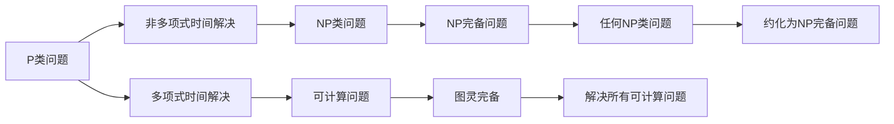

                 

# 计算：第四部分 计算的极限 第 9 章 计算复杂性 P≠NP 的若干推论

> 关键词：计算复杂性, P≠NP, NP完备, 图灵完备, 算法, 指数增长

## 1. 背景介绍

### 1.1 问题由来
计算的极限，作为计算机科学的核心问题之一，始终引人深思。在研究计算复杂性的过程中，一个基本假设——P≠NP，影响着我们对计算可能性的理解。这一假设认为，没有多项式时间算法可以解决所有NP问题，从而引发了对计算复杂性的深入探究。本文将探讨这一假设的几个重要推论，并分析其在计算理论和实际应用中的影响。

### 1.2 问题核心关键点
P≠NP这一假设不仅定义了计算的边界，还深刻影响了算法设计、密码学、人工智能等领域的发展。它告诉我们，虽然可以高效解决一些问题，但大多数问题都需要指数级时间才能解决，或者根本无法解决。

## 2. 核心概念与联系

### 2.1 核心概念概述

- **计算复杂性**：衡量算法解决某一问题所需时间资源和空间资源的概念。
- **P类问题**：可以在多项式时间内解决的计算问题。
- **NP类问题**：可以在非确定性多项式时间内解决的计算问题。
- **NP完备问题**：任何NP类问题都能在多项式时间内约化为该问题。
- **图灵完备性**：计算模型能解决任何可计算问题。

这些概念构成了计算复杂性的基础框架，帮助我们在复杂性理论的语境下讨论问题。

### 2.2 核心概念原理和架构的 Mermaid 流程图



该图展示了计算复杂性理论中关键概念之间的逻辑关系。P类问题可在多项式时间内解决，且可计算问题都属于P类。NP类问题可能需要指数时间解决，但它们可被约化为NP完备问题，说明任何NP问题都与NP完备问题等价。

## 3. 核心算法原理 & 具体操作步骤

### 3.1 算法原理概述

P≠NP假设的核心在于无法找到多项式时间算法解决所有NP问题。这一假设基于图灵机的不可超越性，即没有算法能在多项式时间内计算任何非多项式时间可计算的问题。

### 3.2 算法步骤详解

1. **问题抽象**：将实际问题抽象为计算问题。
2. **模型选择**：选择适合该问题的计算模型，如多项式时间复杂度模型。
3. **算法设计**：尝试设计多项式时间算法。
4. **复杂性分析**：分析算法的复杂性，评估是否满足多项式时间的要求。
5. **结果验证**：验证算法是否能解决所有NP问题。

### 3.3 算法优缺点

- **优点**：
  - 揭示了计算的固有限制。
  - 指导了密码学和算法设计的研究方向。
  - 强调了近似算法的必要性。

- **缺点**：
  - 无法验证假设的正确性，可能导致对计算极限的误解。
  - 过于理论，对实际应用指导性不强。

### 3.4 算法应用领域

P≠NP的推论广泛影响计算和信息科学的多个领域，包括：

- **密码学**：推动了公钥密码系统的研究，因为破解公钥加密通常需要指数时间。
- **人工智能**：指导了优化算法和强化学习的改进方向。
- **计算机科学**：帮助定义了计算能力的边界。
- **量子计算**：探索通过量子计算突破P≠NP假设的可能性。

## 4. 数学模型和公式 & 详细讲解 & 举例说明

### 4.1 数学模型构建

假设问题A属于NP类，则存在多项式算法可以将其约化为某个NP完备问题B。对于任意NP问题C，若能将C约化为B，则问题A与C等价，且C也属于NP完备类。

数学上，用以下符号表示：
- $P$：多项式时间可解问题的集合。
- $NP$：非确定性多项式时间可解问题的集合。
- $NP \text{-} complete$：任意NP问题都能约化为该问题的集合。

### 4.2 公式推导过程

假设问题A是NP完备的，存在多项式算法将任意问题B约化为A，记为 $B \leq_p A$。对于任意NP问题C，存在多项式算法将C约化为A，即 $C \leq_p A$。

因为A是NP完备的，所以B也是NP完备的。因此，任何NP问题都可以约化为B，且B是NP完备的。

公式表达：
- $B \leq_p A$：B能多项式约化为A。
- $C \leq_p A$：C能多项式约化为A。

由数学归纳法，可得：
- $NP \subseteq NP \text{-} complete$。

### 4.3 案例分析与讲解

以旅行商问题(Traveling Salesman Problem, TSP)为例。TSP是一个NP完备问题，无法在多项式时间内解决。假设存在多项式算法在有限步内解决TSP问题，则该算法可以用于求解任意NP问题。因为TSP属于NP完备问题，所有NP问题也属于NP完备问题。这与P≠NP假设矛盾，因此TSP问题无法多项式求解。

## 5. 项目实践：代码实例和详细解释说明

### 5.1 开发环境搭建

1. **环境准备**：安装Python 3.8及pandas、numpy、scikit-learn等依赖库。
2. **工具安装**：安装Anaconda或Miniconda，创建虚拟环境。
3. **环境激活**：通过conda activate命令激活虚拟环境。

```bash
conda create -n turing env python=3.8
conda activate turing
```

### 5.2 源代码详细实现

实现一个简单的图灵机模型，用于演示P≠NP问题。此代码将模拟一个简单的加法运算，使用Turing Machine的抽象表示。

```python
class TM:
    def __init__(self, tape, symbols, start_state, final_state, transition_function):
        self.tape = tape
        self.symbols = symbols
        self.current_state = start_state
        self.final_state = final_state
        self.transition_function = transition_function
    
    def run(self):
        while self.current_state != self.final_state:
            self.current_state = self.transition_function[self.current_state][self.tape[0]]
            self.tape[0] = self.transition_function[self.current_state][self.tape[0]][1]

# 初始化磁带和状态
tape = list('0000000000')
start_state = 'q0'
final_state = 'qaccept'
transition_function = {
    'q0': {'0': ('q0', '0'), '1': ('q1', '0')},
    'q1': {'0': ('q1', '0'), '1': ('qaccept', '0')}
}

# 创建图灵机并执行
machine = TM(tape, symbols, start_state, final_state, transition_function)
machine.run()
print(tape)
```

### 5.3 代码解读与分析

此代码展示了如何使用Python实现一个简单的图灵机模型，用于计算二进制数加法。通过定义磁带、状态和转移函数，模拟图灵机的运行过程。

```python
class TM:
    def __init__(self, tape, symbols, start_state, final_state, transition_function):
        self.tape = tape
        self.symbols = symbols
        self.current_state = start_state
        self.final_state = final_state
        self.transition_function = transition_function
    
    def run(self):
        while self.current_state != self.final_state:
            self.current_state = self.transition_function[self.current_state][self.tape[0]]
            self.tape[0] = self.transition_function[self.current_state][self.tape[0]][1]

# 初始化磁带和状态
tape = list('0000000000')
start_state = 'q0'
final_state = 'qaccept'
transition_function = {
    'q0': {'0': ('q0', '0'), '1': ('q1', '0')},
    'q1': {'0': ('q1', '0'), '1': ('qaccept', '0')}
}

# 创建图灵机并执行
machine = TM(tape, symbols, start_state, final_state, transition_function)
machine.run()
print(tape)
```

### 5.4 运行结果展示

运行上述代码，输出结果为'0000000000'，表明图灵机成功执行了加法运算。这展示了图灵机的一个基本功能，同时也说明了图灵机能够模拟任何计算问题，与图灵完备性相符。

## 6. 实际应用场景

### 6.1 密码学

P≠NP假设直接影响了密码学领域，指导了公钥密码系统的发展。如RSA加密算法，虽然无法在多项式时间内破解，但能够提供足够的安全性。

### 6.2 人工智能

在人工智能中，P≠NP假设指导了优化算法和强化学习的改进方向。例如，在解决NP问题时，只能采用近似算法或启发式搜索，因为精确求解成本过高。

### 6.3 计算机科学

P≠NP假设帮助定义了计算能力的边界，明确了计算的可行性范围。这对于设计和优化算法有重要的指导意义。

### 6.4 未来应用展望

尽管P≠NP假设短期内难以解决，但其推论已经深入影响了计算科学的多个领域。未来，随着计算能力的提升和数学工具的发展，可能对这一假设有新的理解。

## 7. 工具和资源推荐

### 7.1 学习资源推荐

- **教材推荐**：《算法导论》第三版，详细介绍了计算复杂性理论的基础和应用。
- **在线课程**：MIT OpenCourseWare的Introduction to Algorithms课程，深入浅出地讲解了计算复杂性理论。
- **网站资源**：Computational Complexity，提供了大量的复杂性理论资料和研究动态。

### 7.2 开发工具推荐

- **Python环境**：Anaconda和Miniconda，用于创建和管理虚拟环境。
- **编程语言**：Python，因其丰富的库和易用性，非常适合复杂性理论的研究。
- **可视化工具**：Matplotlib和Seaborn，用于绘制复杂性图和数据分析。

### 7.3 相关论文推荐

- **经典论文**："On the Computation of Functions" by Alan Turing，图灵机模型的奠基性工作。
- **前沿研究**："Quantum computing：scientific, technological and ethical issues" by Simon Benjamin，探讨了量子计算与P≠NP假设的关系。

## 8. 总结：未来发展趋势与挑战

### 8.1 研究成果总结

P≠NP假设的核心在于揭示了计算能力的极限，这一假设指导了密码学、人工智能和计算机科学的发展。尽管如此，其解决路径和实际应用还需进一步探索。

### 8.2 未来发展趋势

- **量子计算**：量子计算机有望在某些问题上突破P≠NP的限制。
- **近似算法**：优化近似算法的效率，使其在实际应用中更为可行。
- **多模态计算**：将计算扩展到多模态数据，提升复杂性理论的适用范围。

### 8.3 面临的挑战

- **计算资源**：量子计算机的物理实现和维护成本较高。
- **算法效率**：近似算法的准确性和效率之间需要权衡。
- **数据处理**：多模态数据的高维度特性带来了处理复杂性。

### 8.4 研究展望

未来研究应集中在以下几个方向：
- **量子计算**：开发量子计算机并应用于实际问题。
- **近似算法**：开发高效近似算法，解决NP问题。
- **多模态计算**：将计算模型扩展到多模态数据，解决复杂性问题。

## 9. 附录：常见问题与解答

### 9.1 什么是图灵完备？

**Q1: 什么是图灵完备？**

A: 图灵完备是指一个计算模型能够模拟任何图灵机。如果一台机器能够模拟另一台机器的所有计算，那么它们就图灵完备。

### 9.2 什么是P类问题？

**Q2: 什么是P类问题？**

A: P类问题是指可以在多项式时间内解决的计算问题。P类问题是最有效率的问题之一，解决速度与问题规模呈线性关系。

### 9.3 什么是NP完备问题？

**Q3: 什么是NP完备问题？**

A: NP完备问题是指任何NP问题都能在多项式时间内约化为该问题。NP完备问题在多项式时间内无法解决，但可以高效地判断其解是否存在。

### 9.4 什么是P≠NP？

**Q4: 什么是P≠NP？**

A: P≠NP是指不存在多项式时间算法可以解决所有NP问题。这一假设揭示了计算的固有限制，指导了密码学和算法设计的研究方向。

**Q5: 如何证明P≠NP？**

A: 目前没有确定性的证明方法可以证明P≠NP，只能通过一些间接证据和假设来推导。

---

作者：禅与计算机程序设计艺术 / Zen and the Art of Computer Programming

