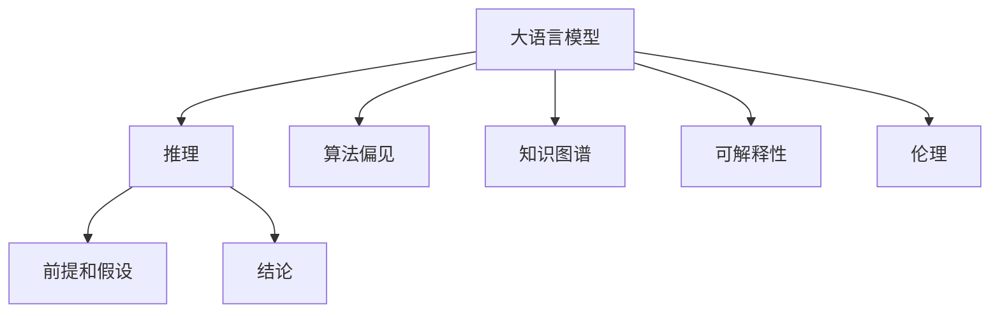

                 

# 语言≠思维：大模型的推理误区

> 关键词：语言模型,推理误区,深度学习,大模型,自然语言处理(NLP),认知科学,算法偏见,知识图谱,模型解释性,AI伦理

## 1. 背景介绍

### 1.1 问题由来

近年来，人工智能领域的发展已经从传统的基于规则的专家系统，逐步转向基于数据和深度学习的智能模型。其中，语言模型作为NLP领域的核心技术，已经在大规模语料上取得了显著的进展，如BERT、GPT、XLNet等预训练模型已经展示了强大的语言理解能力。然而，语言模型虽然能够流畅地生成文本，但其背后的推理逻辑却常常受到质疑。

人工智能的终极目标是构建具备人类智能的系统，实现对自然语言的理解和生成。尽管深度学习模型在语言生成和理解上取得了巨大的成功，但它们缺乏像人类那样的"常识"和"逻辑"推理能力，常常表现出推理上的"误区"。这种误区不仅影响了模型的性能，也引发了对其智能性、可解释性以及伦理性的深刻思考。

### 1.2 问题核心关键点

大模型推理误区主要体现在以下几个方面：
1. **算法偏见**：模型学习到的知识往往存在偏差，反映了训练数据的局限性。这种偏差可能会在推理过程中被放大，导致模型输出不合理的结果。
2. **知识盲点**：模型缺乏系统性的知识图谱，难以处理超出训练集的知识。例如，模型可能无法理解常见的常识性问题或生僻领域的问题。
3. **因果关系模糊**：模型无法区分事件的因果关系，常常在输出上表现出逻辑上的不一致性。
4. **推理过程缺乏可解释性**：模型内部的推理过程难以解释，使得用户对其输出结果缺乏信任。
5. **伦理风险**：模型可能会生成有害的输出内容，如歧视、虚假信息等，引发伦理道德问题。

这些关键点凸显了大模型推理误区的多维度问题，亟需学界和产业界共同努力，以提升模型的智能性和可靠性。

## 2. 核心概念与联系

### 2.1 核心概念概述

为更好地理解大模型推理误区的成因及解决方法，本节将介绍几个密切相关的核心概念：

- **大语言模型(Large Language Model, LLM)**：以自回归(如GPT)或自编码(如BERT)模型为代表的大规模预训练语言模型。通过在大规模无标签文本语料上进行预训练，学习通用的语言表示，具备强大的语言理解和生成能力。

- **推理(R reasoning)**：在自然语言处理领域，推理指的是从给定前提和假设出发，推导或判断出结论的过程。对于大模型而言，推理能力不仅涉及文本的理解，还包括对常识、逻辑规则等外部知识的运用。

- **算法偏见(Algorithm Bias)**：模型在训练过程中学习到的知识存在偏差，反映了训练数据的局限性。这种偏差可能会在推理过程中被放大，导致模型输出不合理的结果。

- **知识图谱(Knowledge Graph)**：一种用于表示实体之间关系的图结构，包含了丰富的常识性知识。知识图谱可以帮助模型在推理过程中使用更全面、更系统化的知识，避免知识盲点。

- **可解释性(Explainability)**：指模型的推理过程和输出结果可以被解释和理解。这对于提高用户对模型的信任度和接受度至关重要。

- **伦理(Ethics)**：模型在生成输出时，应当遵循社会伦理道德规范，避免生成有害或歧视性的内容。

这些核心概念之间的逻辑关系可以通过以下Mermaid流程图来展示：



这个流程图展示了大语言模型的核心概念及其之间的关系：

1. 大语言模型通过预训练获得基础能力。
2. 推理能力体现在对前提和假设的理解和推导上。
3. 算法偏见可能影响推理过程和输出结果。
4. 知识图谱可以丰富模型的知识库，提高推理能力。
5. 可解释性有助于提升用户对模型的信任度。
6. 伦理约束是模型生成输出的重要指导原则。

这些概念共同构成了大语言模型的推理能力框架，使其能够在各种场景下发挥强大的语言理解和生成能力。通过理解这些核心概念，我们可以更好地把握大语言模型的工作原理和优化方向。

## 3. 核心算法原理 & 具体操作步骤
### 3.1 算法原理概述

大模型的推理能力主要依赖于其在语料库上的预训练，以及微调过程的优化。其核心思想是：通过预训练获得语言表示能力，再通过微调学习特定领域的知识，最终实现对自然语言的有效推理。

形式化地，假设预训练语言模型为 $M_{\theta}$，其中 $\theta$ 为预训练得到的模型参数。给定推理任务 $T$ 的前提 $P$ 和假设 $H$，微调的目标是找到新的模型参数 $\hat{\theta}$，使得：

$$
\hat{\theta}=\mathop{\arg\min}_{\theta} \mathcal{L}(M_{\theta},P,H)
$$

其中 $\mathcal{L}$ 为针对推理任务 $T$ 设计的损失函数，用于衡量模型推理输出与目标结论之间的差异。常见的损失函数包括逻辑回归损失、最大化准确率等。

通过梯度下降等优化算法，微调过程不断更新模型参数 $\theta$，最小化损失函数 $\mathcal{L}$，使得模型推理输出逼近正确的结论。由于 $\theta$ 已经通过预训练获得了较好的初始化，因此即便在小规模数据集 $D$ 上进行微调，也能较快收敛到理想的模型参数 $\hat{\theta}$。

### 3.2 算法步骤详解

基于推理的大语言模型微调一般包括以下几个关键步骤：

**Step 1: 准备预训练模型和数据集**
- 选择合适的预训练语言模型 $M_{\theta}$ 作为初始化参数，如 BERT、GPT 等。
- 准备推理任务 $T$ 的前提和假设数据集 $D=\{(P_i, H_i)\}_{i=1}^N$，划分为训练集、验证集和测试集。一般要求前提和假设与预训练数据的分布不要差异过大。

**Step 2: 添加任务适配层**
- 根据推理任务类型，在预训练模型顶层设计合适的输出层和损失函数。
- 对于二值推理任务，通常在顶层添加逻辑回归分类器。
- 对于多值推理任务，使用多分类交叉熵损失函数。

**Step 3: 设置微调超参数**
- 选择合适的优化算法及其参数，如 AdamW、SGD 等，设置学习率、批大小、迭代轮数等。
- 设置正则化技术及强度，包括权重衰减、Dropout、Early Stopping等。
- 确定冻结预训练参数的策略，如仅微调顶层，或全部参数都参与微调。

**Step 4: 执行梯度训练**
- 将训练集数据分批次输入模型，前向传播计算损失函数。
- 反向传播计算参数梯度，根据设定的优化算法和学习率更新模型参数。
- 周期性在验证集上评估模型性能，根据性能指标决定是否触发 Early Stopping。
- 重复上述步骤直到满足预设的迭代轮数或 Early Stopping 条件。

**Step 5: 测试和部署**
- 在测试集上评估微调后模型 $M_{\hat{\theta}}$ 的性能，对比微调前后的精度提升。
- 使用微调后的模型对新样本进行推理预测，集成到实际的应用系统中。
- 持续收集新的数据，定期重新微调模型，以适应数据分布的变化。

以上是基于推理的大语言模型微调的一般流程。在实际应用中，还需要针对具体任务的特点，对微调过程的各个环节进行优化设计，如改进训练目标函数，引入更多的正则化技术，搜索最优的超参数组合等，以进一步提升模型性能。

### 3.3 算法优缺点

基于推理的大语言模型微调方法具有以下优点：
1. 推理能力强。利用预训练模型已经学习到的语言表示能力，模型能够在推理任务上取得较好的性能。
2. 数据需求低。相比于其他NLP任务，微调所需的标注数据量较小，可以快速完成模型训练。
3. 可解释性好。推理过程可以追溯到预训练模型和微调目标函数，便于理解和解释。
4. 模型通用性强。同一预训练模型可以适配多种不同的推理任务，灵活性高。

同时，该方法也存在一定的局限性：
1. 推理依赖前提假设。如果前提假设包含错误信息，模型输出的结果也可能出错。
2. 知识图谱缺失。现有模型缺乏对外部知识的整合，难以处理超出训练集的知识。
3. 逻辑关系复杂。推理任务的逻辑关系可能非常复杂，模型难以准确推理。
4. 伦理问题未解决。模型在生成推理输出时，可能存在伦理道德风险。

尽管存在这些局限性，但就目前而言，基于推理的微调方法仍是大模型应用的重要范式。未来相关研究的重点在于如何进一步提高推理过程的可解释性和鲁棒性，加强模型对外部知识的整合，以及避免推理中的伦理风险。

### 3.4 算法应用领域

基于推理的大语言模型微调方法，已经在推理问答、逻辑推理、生成对话等多个NLP任务上取得了优异的效果，成为NLP技术落地应用的重要手段。

- **推理问答**：通过推理前提和假设，判断给定结论是否正确。将前提和假设对作为微调数据，训练模型学习推理逻辑。
- **逻辑推理**：将推理问题转化为逻辑表达式，使用逻辑回归分类器进行推理。
- **生成对话**：根据前提和假设生成自然语言对话，使机器人能够进行有意义的人机交互。
- **知识图谱**：利用推理模型整合知识图谱中的实体和关系，构建更全面的知识表示。
- **自然语言推理(NLI)**：判断一个文本假设是否蕴含、矛盾或中立于另一个文本前提。通过微调模型学习判断逻辑关系。
- **图像推理**：结合视觉和语言信息，进行图像识别和推理。将图像和描述作为微调数据，训练模型学习图像和语言的交互推理。

除了上述这些经典任务外，推理模型还被创新性地应用到更多场景中，如问答系统、智能助手、推荐系统等，为NLP技术带来了全新的突破。随着预训练模型和推理方法的不断进步，相信NLP技术将在更广阔的应用领域大放异彩。

## 4. 数学模型和公式 & 详细讲解 & 举例说明
### 4.1 数学模型构建

本节将使用数学语言对基于推理的大语言模型微调过程进行更加严格的刻画。

记预训练语言模型为 $M_{\theta}$，其中 $\theta$ 为模型参数。假设推理任务 $T$ 的前提和假设分别为 $P=\{x_1, x_2, ..., x_n\}$ 和 $H=\{y_1, y_2, ..., y_n\}$。

定义模型 $M_{\theta}$ 在前提和假设 $P, H$ 上的推理损失函数为 $\ell(M_{\theta}(P), H)$，则在数据集 $D$ 上的经验风险为：

$$
\mathcal{L}(\theta) = \frac{1}{N} \sum_{i=1}^N \ell(M_{\theta}(P_i), H_i)
$$

微调的优化目标是最小化经验风险，即找到最优参数：

$$
\theta^* = \mathop{\arg\min}_{\theta} \mathcal{L}(\theta)
$$

在实践中，我们通常使用基于梯度的优化算法（如SGD、Adam等）来近似求解上述最优化问题。设 $\eta$ 为学习率，$\lambda$ 为正则化系数，则参数的更新公式为：

$$
\theta \leftarrow \theta - \eta \nabla_{\theta}\mathcal{L}(\theta) - \eta\lambda\theta
$$

其中 $\nabla_{\theta}\mathcal{L}(\theta)$ 为损失函数对参数 $\theta$ 的梯度，可通过反向传播算法高效计算。

### 4.2 公式推导过程

以下我们以二值推理任务为例，推导逻辑回归损失函数及其梯度的计算公式。

假设模型 $M_{\theta}$ 在前提 $P$ 上的输出为 $\hat{y}=M_{\theta}(P) \in [0,1]$，表示推理结论为正类的概率。真实标签 $H \in \{0,1\}$。则二值推理任务中的逻辑回归损失函数定义为：

$$
\ell(M_{\theta}(P),H) = -[y\log \hat{y} + (1-y)\log (1-\hat{y})]
$$

将其代入经验风险公式，得：

$$
\mathcal{L}(\theta) = -\frac{1}{N}\sum_{i=1}^N [H_i\log M_{\theta}(P_i)+(1-H_i)\log(1-M_{\theta}(P_i))]
$$

根据链式法则，损失函数对参数 $\theta_k$ 的梯度为：

$$
\frac{\partial \mathcal{L}(\theta)}{\partial \theta_k} = -\frac{1}{N}\sum_{i=1}^N (\frac{H_i}{M_{\theta}(P_i)}-\frac{1-H_i}{1-M_{\theta}(P_i)}) \frac{\partial M_{\theta}(P_i)}{\partial \theta_k}
$$

其中 $\frac{\partial M_{\theta}(P_i)}{\partial \theta_k}$ 可进一步递归展开，利用自动微分技术完成计算。

在得到损失函数的梯度后，即可带入参数更新公式，完成模型的迭代优化。重复上述过程直至收敛，最终得到适应推理任务的最优模型参数 $\theta^*$。

## 5. 项目实践：代码实例和详细解释说明
### 5.1 开发环境搭建

在进行推理模型微调实践前，我们需要准备好开发环境。以下是使用Python进行PyTorch开发的环境配置流程：

1. 安装Anaconda：从官网下载并安装Anaconda，用于创建独立的Python环境。

2. 创建并激活虚拟环境：
```bash
conda create -n pytorch-env python=3.8 
conda activate pytorch-env
```

3. 安装PyTorch：根据CUDA版本，从官网获取对应的安装命令。例如：
```bash
conda install pytorch torchvision torchaudio cudatoolkit=11.1 -c pytorch -c conda-forge
```

4. 安装Transformers库：
```bash
pip install transformers
```

5. 安装各类工具包：
```bash
pip install numpy pandas scikit-learn matplotlib tqdm jupyter notebook ipython
```

完成上述步骤后，即可在`pytorch-env`环境中开始推理模型微调的实践。

### 5.2 源代码详细实现

这里我们以逻辑推理任务为例，给出使用Transformers库对BERT模型进行微调的PyTorch代码实现。

首先，定义逻辑推理任务的数据处理函数：

```python
from transformers import BertTokenizer
from torch.utils.data import Dataset
import torch

class LogicDataset(Dataset):
    def __init__(self, premises, hypotheses, labels, tokenizer, max_len=128):
        self.premises = premises
        self.hypotheses = hypotheses
        self.labels = labels
        self.tokenizer = tokenizer
        self.max_len = max_len
        
    def __len__(self):
        return len(self.premises)
    
    def __getitem__(self, item):
        premise = self.premises[item]
        hypothesis = self.hypotheses[item]
        label = self.labels[item]
        
        encoding = self.tokenizer(premise, return_tensors='pt', max_length=self.max_len, padding='max_length', truncation=True)
        input_ids = encoding['input_ids'][0]
        attention_mask = encoding['attention_mask'][0]
        
        # 对假设进行编码
        hypothesis_tokenized = self.tokenizer(hypothesis, return_tensors='pt', max_length=self.max_len, padding='max_length', truncation=True)
        hypothesis_ids = hypothesis_tokenized['input_ids'][0]
        hypothesis_mask = hypothesis_tokenized['attention_mask'][0]
        
        # 将前提和假设拼接
        premise_ids = torch.cat([input_ids, hypothesis_ids], dim=-1)
        premise_mask = torch.cat([attention_mask, hypothesis_mask], dim=-1)
        
        # 添加特殊标记
        special_ids = [tokenizer.cls_token_id, tokenizer.sep_token_id]
        special_mask = [1, 1]
        premise_ids = torch.cat([special_ids, premise_ids, special_ids], dim=0)
        premise_mask = torch.cat([special_mask, premise_mask, special_mask], dim=0)
        
        # 将标签转换为独热编码
        label_ids = torch.zeros(3, dtype=torch.long)
        label_ids[label] = 1
        label_ids = label_ids.to('cuda')
        
        return {'input_ids': premise_ids, 
                'attention_mask': premise_mask,
                'hypothesis_ids': hypothesis_ids,
                'hypothesis_mask': hypothesis_mask,
                'labels': label_ids}

# 标签与id的映射
label2id = {'contradiction': 0, 'entailment': 1, 'neutral': 2}
id2label = {v: k for k, v in label2id.items()}

# 创建dataset
tokenizer = BertTokenizer.from_pretrained('bert-base-cased')

train_dataset = LogicDataset(train_premises, train_hypotheses, train_labels, tokenizer)
dev_dataset = LogicDataset(dev_premises, dev_hypotheses, dev_labels, tokenizer)
test_dataset = LogicDataset(test_premises, test_hypotheses, test_labels, tokenizer)
```

然后，定义模型和优化器：

```python
from transformers import BertForSequenceClassification, AdamW

model = BertForSequenceClassification.from_pretrained('bert-base-cased', num_labels=len(label2id))

optimizer = AdamW(model.parameters(), lr=2e-5)
```

接着，定义训练和评估函数：

```python
from torch.utils.data import DataLoader
from tqdm import tqdm
from sklearn.metrics import classification_report

device = torch.device('cuda') if torch.cuda.is_available() else torch.device('cpu')
model.to(device)

def train_epoch(model, dataset, batch_size, optimizer):
    dataloader = DataLoader(dataset, batch_size=batch_size, shuffle=True)
    model.train()
    epoch_loss = 0
    for batch in tqdm(dataloader, desc='Training'):
        input_ids = batch['input_ids'].to(device)
        attention_mask = batch['attention_mask'].to(device)
        hypothesis_ids = batch['hypothesis_ids'].to(device)
        hypothesis_mask = batch['hypothesis_mask'].to(device)
        labels = batch['labels'].to(device)
        model.zero_grad()
        outputs = model(input_ids, attention_mask=attention_mask, hypothesis_ids=hypothesis_ids, hypothesis_mask=hypothesis_mask)
        loss = outputs.loss
        epoch_loss += loss.item()
        loss.backward()
        optimizer.step()
    return epoch_loss / len(dataloader)

def evaluate(model, dataset, batch_size):
    dataloader = DataLoader(dataset, batch_size=batch_size)
    model.eval()
    preds, labels = [], []
    with torch.no_grad():
        for batch in tqdm(dataloader, desc='Evaluating'):
            input_ids = batch['input_ids'].to(device)
            attention_mask = batch['attention_mask'].to(device)
            hypothesis_ids = batch['hypothesis_ids'].to(device)
            hypothesis_mask = batch['hypothesis_mask'].to(device)
            batch_labels = batch['labels'].to(device)
            outputs = model(input_ids, attention_mask=attention_mask, hypothesis_ids=hypothesis_ids, hypothesis_mask=hypothesis_mask)
            batch_preds = outputs.logits.argmax(dim=2).to('cpu').tolist()
            batch_labels = batch_labels.to('cpu').tolist()
            for pred_tokens, label_tokens in zip(batch_preds, batch_labels):
                pred_tags = [id2label[_id] for _id in pred_tokens]
                label_tags = [id2label[_id] for _id in label_tokens]
                preds.append(pred_tags[:len(label_tokens)])
                labels.append(label_tags)
                
    print(classification_report(labels, preds))
```

最后，启动训练流程并在测试集上评估：

```python
epochs = 5
batch_size = 16

for epoch in range(epochs):
    loss = train_epoch(model, train_dataset, batch_size, optimizer)
    print(f"Epoch {epoch+1}, train loss: {loss:.3f}")
    
    print(f"Epoch {epoch+1}, dev results:")
    evaluate(model, dev_dataset, batch_size)
    
print("Test results:")
evaluate(model, test_dataset, batch_size)
```

以上就是使用PyTorch对BERT进行逻辑推理任务微调的完整代码实现。可以看到，得益于Transformers库的强大封装，我们可以用相对简洁的代码完成BERT模型的加载和微调。

### 5.3 代码解读与分析

让我们再详细解读一下关键代码的实现细节：

**LogicDataset类**：
- `__init__`方法：初始化前提、假设、标签、分词器等关键组件。
- `__len__`方法：返回数据集的样本数量。
- `__getitem__`方法：对单个样本进行处理，将前提和假设输入编码为token ids，将标签转换为独热编码，并对其进行定长padding，最终返回模型所需的输入。

**label2id和id2label字典**：
- 定义了标签与数字id之间的映射关系，用于将预测结果解码回真实的标签。

**训练和评估函数**：
- 使用PyTorch的DataLoader对数据集进行批次化加载，供模型训练和推理使用。
- 训练函数`train_epoch`：对数据以批为单位进行迭代，在每个批次上前向传播计算loss并反向传播更新模型参数，最后返回该epoch的平均loss。
- 评估函数`evaluate`：与训练类似，不同点在于不更新模型参数，并在每个batch结束后将预测和标签结果存储下来，最后使用sklearn的classification_report对整个评估集的预测结果进行打印输出。

**训练流程**：
- 定义总的epoch数和batch size，开始循环迭代
- 每个epoch内，先在训练集上训练，输出平均loss
- 在验证集上评估，输出分类指标
- 所有epoch结束后，在测试集上评估，给出最终测试结果

可以看到，PyTorch配合Transformers库使得BERT微调的代码实现变得简洁高效。开发者可以将更多精力放在数据处理、模型改进等高层逻辑上，而不必过多关注底层的实现细节。

当然，工业级的系统实现还需考虑更多因素，如模型的保存和部署、超参数的自动搜索、更灵活的任务适配层等。但核心的微调范式基本与此类似。

## 6. 实际应用场景
### 6.1 智能客服系统

基于大语言模型微调的推理技术，可以广泛应用于智能客服系统的构建。传统客服往往需要配备大量人力，高峰期响应缓慢，且一致性和专业性难以保证。而使用微调后的推理模型，可以7x24小时不间断服务，快速响应客户咨询，用自然流畅的语言解答各类常见问题。

在技术实现上，可以收集企业内部的历史客服对话记录，将问题和最佳答复构建成监督数据，在此基础上对预训练推理模型进行微调。微调后的推理模型能够自动理解用户意图，匹配最合适的答复模板进行回复。对于客户提出的新问题，还可以接入检索系统实时搜索相关内容，动态组织生成回答。如此构建的智能客服系统，能大幅提升客户咨询体验和问题解决效率。

### 6.2 金融舆情监测

金融机构需要实时监测市场舆论动向，以便及时应对负面信息传播，规避金融风险。传统的人工监测方式成本高、效率低，难以应对网络时代海量信息爆发的挑战。基于大语言模型微调的文本推理技术，为金融舆情监测提供了新的解决方案。

具体而言，可以收集金融领域相关的新闻、报道、评论等文本数据，并对其进行主题标注和情感标注。在此基础上对预训练语言模型进行微调，使其能够自动判断文本属于何种主题，情感倾向是正面、中性还是负面。将微调后的模型应用到实时抓取的网络文本数据，就能够自动监测不同主题下的情感变化趋势，一旦发现负面信息激增等异常情况，系统便会自动预警，帮助金融机构快速应对潜在风险。

### 6.3 个性化推荐系统

当前的推荐系统往往只依赖用户的历史行为数据进行物品推荐，无法深入理解用户的真实兴趣偏好。基于大语言模型微调技术，个性化推荐系统可以更好地挖掘用户行为背后的语义信息，从而提供更精准、多样的推荐内容。

在实践中，可以收集用户浏览、点击、评论、分享等行为数据，提取和用户交互的物品标题、描述、标签等文本内容。将文本内容作为模型输入，用户的后续行为（如是否点击、购买等）作为监督信号，在此基础上微调预训练语言模型。微调后的模型能够从文本内容中准确把握用户的兴趣点。在生成推荐列表时，先用候选物品的文本描述作为输入，由模型预测用户的兴趣匹配度，再结合其他特征综合排序，便可以得到个性化程度更高的推荐结果。

### 6.4 未来应用展望

随着大语言模型和推理方法的不断发展，基于推理的微调方法将在更多领域得到应用，为传统行业带来变革性影响。

在智慧医疗领域，基于微调的推理模型可以用于医疗问答、病历分析、药物研发等应用，提升医疗服务的智能化水平，辅助医生诊疗，加速新药开发进程。

在智能教育领域，微调技术可应用于作业批改、学情分析、知识推荐等方面，因材施教，促进教育公平，提高教学质量。

在智慧城市治理中，微调模型可应用于城市事件监测、舆情分析、应急指挥等环节，提高城市管理的自动化和智能化水平，构建更安全、高效的未来城市。

此外，在企业生产、社会治理、文娱传媒等众多领域，基于大模型微调的推理模型也将不断涌现，为NLP技术带来了全新的突破。随着预训练模型和推理方法的不断进步，相信NLP技术将在更广阔的应用领域大放异彩。

## 7. 工具和资源推荐
### 7.1 学习资源推荐

为了帮助开发者系统掌握大语言模型推理的理论基础和实践技巧，这里推荐一些优质的学习资源：

1. 《Transformer从原理到实践》系列博文：由大模型技术专家撰写，深入浅出地介绍了Transformer原理、推理任务、微调技术等前沿话题。

2. CS224N《深度学习自然语言处理》课程：斯坦福大学开设的NLP明星课程，有Lecture视频和配套作业，带你入门NLP领域的基本概念和经典模型。

3. 《Natural Language Processing with Transformers》书籍：Transformers库的作者所著，全面介绍了如何使用Transformers库进行NLP任务开发，包括推理任务在内的诸多范式。

4. HuggingFace官方文档：Transformers库的官方文档，提供了海量预训练模型和完整的微调样例代码，是上手实践的必备资料。

5. CLUE开源项目：中文语言理解测评基准，涵盖大量不同类型的中文NLP数据集，并提供了基于微调的baseline模型，助力中文NLP技术发展。

通过对这些资源的学习实践，相信你一定能够快速掌握大语言模型推理的精髓，并用于解决实际的NLP问题。
###  7.2 开发工具推荐

高效的开发离不开优秀的工具支持。以下是几款用于大语言模型微调开发的常用工具：

1. PyTorch：基于Python的开源深度学习框架，灵活动态的计算图，适合快速迭代研究。大部分预训练语言模型都有PyTorch版本的实现。

2. TensorFlow：由Google主导开发的开源深度学习框架，生产部署方便，适合大规模工程应用。同样有丰富的预训练语言模型资源。

3. Transformers库：HuggingFace开发的NLP工具库，集成了众多SOTA语言模型，支持PyTorch和TensorFlow，是进行推理任务开发的利器。

4. Weights & Biases：模型训练的实验跟踪工具，可以记录和可视化模型训练过程中的各项指标，方便对比和调优。与主流深度学习框架无缝集成。

5. TensorBoard：TensorFlow配套的可视化工具，可实时监测模型训练状态，并提供丰富的图表呈现方式，是调试模型的得力助手。

6. Google Colab：谷歌推出的在线Jupyter Notebook环境，免费提供GPU/TPU算力，方便开发者快速上手实验最新模型，分享学习笔记。

合理利用这些工具，可以显著提升大语言模型微调的开发效率，加快创新迭代的步伐。

### 7.3 相关论文推荐

大语言模型和推理技术的发展源于学界的持续研究。以下是几篇奠基性的相关论文，推荐阅读：

1. Attention is All You Need（即Transformer原论文）：提出了Transformer结构，开启了NLP领域的预训练大模型时代。

2. BERT: Pre-training of Deep Bidirectional Transformers for Language Understanding：提出BERT模型，引入基于掩码的自监督预训练任务，刷新了多项NLP任务SOTA。

3. Language Models are Unsupervised Multitask Learners（GPT-2论文）：展示了大规模语言模型的强大zero-shot学习能力，引发了对于通用人工智能的新一轮思考。

4. Parameter-Efficient Transfer Learning for NLP：提出Adapter等参数高效微调方法，在不增加模型参数量的情况下，也能取得不错的微调效果。

5. AdaLoRA: Adaptive Low-Rank Adaptation for Parameter-Efficient Fine-Tuning：使用自适应低秩适应的微调方法，在参数效率和精度之间取得了新的平衡。

6. Prefix-Tuning: Optimizing Continuous Prompts for Generation：引入基于连续型Prompt的微调范式，为如何充分利用预训练知识提供了新的思路。

这些论文代表了大语言模型微调技术的发展脉络。通过学习这些前沿成果，可以帮助研究者把握学科前进方向，激发更多的创新灵感。

## 8. 总结：未来发展趋势与挑战

### 8.1 总结

本文对基于推理的大语言模型微调方法进行了全面系统的介绍。首先阐述了大语言模型和推理任务的研究背景和意义，明确了微调在拓展预训练模型应用、提升推理性能方面的独特价值。其次，从原理到实践，详细讲解了推理任务的数学原理和关键步骤，给出了推理任务开发的完整代码实例。同时，本文还广泛探讨了推理任务在智能客服、金融舆情、个性化推荐等多个领域的应用前景，展示了推理任务的巨大潜力。此外，本文精选了推理任务的各类学习资源，力求为读者提供全方位的技术指引。

通过本文的系统梳理，可以看到，基于推理的微调方法正在成为NLP领域的重要范式，极大地拓展了预训练语言模型的应用边界，催生了更多的落地场景。受益于大规模语料的预训练，微调推理模型以更低的时间和标注成本，在小样本条件下也能取得不俗的效果，有力推动了NLP技术的产业化进程。未来，伴随预训练语言模型和推理方法的不断进步，相信NLP技术将在更广阔的应用领域大放异彩，深刻影响人类的生产生活方式。

### 8.2 未来发展趋势

展望未来，大语言模型推理技术将呈现以下几个发展趋势：

1. 模型规模持续增大。随着算力成本的下降和数据规模的扩张，预训练语言模型的参数量还将持续增长。超大规模语言模型蕴含的丰富语言知识，有望支撑更加复杂多变的推理任务微调。

2. 推理方法日趋多样。除了传统的逻辑回归外，未来会涌现更多推理方法，如概率图模型、因果推断等，增强模型的推理能力。

3. 知识图谱成为重要组成部分。推理模型需要更多的常识性知识，知识图谱将成为推理任务的重要组成部分。

4. 因果推理成为热点。结合因果推断思想，增强模型的因果关系建模能力，提高推理输出的一致性和鲁棒性。

5. 模型可解释性增强。推理模型的可解释性将成为未来发展的重要方向，用户对模型的信任度和接受度将大大提升。

6. 伦理约束不断强化。推理模型的输出需遵循伦理道德规范，避免有害信息的生成，确保模型的安全性。

以上趋势凸显了大语言模型推理技术的广阔前景。这些方向的探索发展，必将进一步提升模型的智能性和可靠性，推动人工智能技术的进步。

### 8.3 面临的挑战

尽管大语言模型推理技术已经取得了瞩目成就，但在迈向更加智能化、普适化应用的过程中，它仍面临着诸多挑战：

1. 推理依赖前提假设。如果前提假设包含错误信息，模型输出的结果也可能出错。

2. 知识图谱缺失。现有模型缺乏对外部知识的整合，难以处理超出训练集的知识。

3. 逻辑关系复杂。推理任务的逻辑关系可能非常复杂，模型难以准确推理。

4. 伦理问题未解决。模型在生成推理输出时，可能存在伦理道德风险。

尽管存在这些局限性，但就目前而言，基于推理的微调方法仍是大模型应用的重要范式。未来相关研究的重点在于如何进一步提高推理过程的可解释性和鲁棒性，加强模型对外部知识的整合，以及避免推理中的伦理风险。

### 8.4 研究展望

面对大语言模型推理所面临的种种挑战，未来的研究需要在以下几个方面寻求新的突破：

1. 探索无监督和半监督推理方法。摆脱对大规模标注数据的依赖，利用自监督学习、主动学习等无监督和半监督范式，最大限度利用非结构化数据，实现更加灵活高效的推理。

2. 研究因果推断和对比学习范式。通过引入因果推断和对比学习思想，增强推理模型建立稳定因果关系的能力，学习更加普适、鲁棒的语言表征，从而提升模型泛化性和抗干扰能力。

3. 结合符号化的先验知识。将符号化的先验知识，如知识图谱、逻辑规则等，与神经网络模型进行巧妙融合，引导推理过程学习更准确、合理的语言模型。

4. 结合符号化的先验知识。将符号化的先验知识，如知识图谱、逻辑规则等，与神经网络模型进行巧妙融合，引导推理过程学习更准确、合理的语言模型。

5. 引入更多外部知识。将外部知识与推理模型进行结合，如专家知识库、逻辑规则等，增强模型的推理能力。

这些研究方向的探索，必将引领大语言模型推理技术迈向更高的台阶，为构建安全、可靠、可解释、可控的智能系统铺平道路。面向未来，大语言模型推理技术还需要与其他人工智能技术进行更深入的融合，如知识表示、因果推理、强化学习等，多路径协同发力，共同推动自然语言推理系统的进步。只有勇于创新、敢于突破，才能不断拓展语言模型的边界，让智能技术更好地造福人类社会。

## 9. 附录：常见问题与解答

**Q1：大语言模型推理是否适用于所有NLP任务？**

A: 大语言模型推理在大多数NLP任务上都能取得不错的效果，特别是对于数据量较小的任务。但对于一些特定领域的任务，如医学、法律等，仅仅依靠通用语料预训练的模型可能难以很好地适应。此时需要在特定领域语料上进一步预训练，再进行推理，才能获得理想效果。此外，对于一些需要时效性、个性化很强的任务，如对话、推荐等，推理方法也需要针对性的改进优化。

**Q2：推理过程中如何选择合适的学习率？**

A: 推理的学习率一般要比预训练时小1-2个数量级，如果使用过大的学习率，容易破坏预训练权重，导致过拟合。一般建议从1e-5开始调参，逐步减小学习率，直至收敛。也可以使用warmup策略，在开始阶段使用较小的学习率，再逐渐过渡到预设值。需要注意的是，不同的优化器(如AdamW、Adafactor等)以及不同的学习率调度策略，可能需要设置不同的学习率阈值。

**Q3：推理模型在落地部署时需要注意哪些问题？**

A: 将推理模型转化为实际应用，还需要考虑以下因素：
1. 模型裁剪：去除不必要的层和参数，减小模型尺寸，加快推理速度
2. 量化加速：将浮点模型转为定点模型，压缩存储空间，提高计算效率
3. 服务化封装：将模型封装为标准化服务接口，便于集成调用
4. 弹性伸缩：根据请求流量动态调整资源配置，平衡服务质量和成本
5. 监控告警：实时采集系统指标，设置异常告警阈值，确保服务稳定性
6. 安全防护：采用访问鉴权、数据脱敏等措施，保障数据和模型安全

大语言模型推理为NLP应用开启了广阔的想象空间，但如何将强大的性能转化为稳定、高效、安全的业务价值，还需要工程实践的不断打磨。唯有从数据、算法、工程、业务等多个维度协同发力，才能真正实现人工智能技术在垂直行业的规模化落地。总之，推理需要开发者根据具体任务，不断迭代和优化模型、数据和算法，方能得到理想的效果。

---

作者：禅与计算机程序设计艺术 / Zen and the Art of Computer Programming

