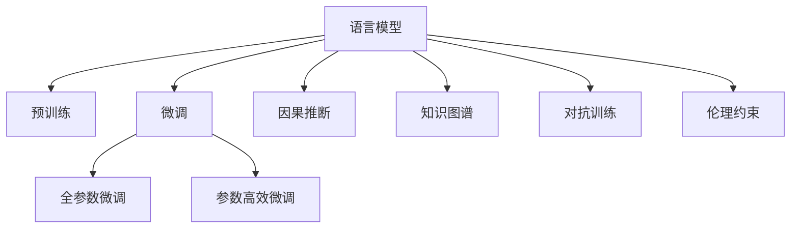

                 

## 1. 背景介绍

### 1.1 问题由来
语言与思维的关系历来是一个哲学、心理学和认知科学的经典问题。传统观点认为，语言是人类思维的外在表达形式，而非其内在表征。近年来，随着深度学习和大模型技术的兴起，人们逐渐倾向于认为，语言本身即思维，是大脑内思维过程的一种映射。特别是像GPT-4这样的大模型，更是被认为在语言理解、生成和推理能力上达到了前所未有的高度。

然而，这种观点并非没有争议。研究者们发现，尽管大模型在语言处理方面表现出色，但它的认知过程仍然存在许多误区和局限性。本文将探讨大模型在认知方面的几个主要误区，并提出解决方案，以期在未来的研究中更为准确地理解和运用大模型的能力。

### 1.2 问题核心关键点
大模型的认知误区主要表现在以下几个方面：

- **缺乏因果关系的理解**：大模型往往无法正确理解因果关系的真实含义，导致在推理过程中出现错误。
- **知识表示的不稳定性**：大模型的知识表示依赖于大量的数据和预训练，但这些知识在跨领域和长时间尺度上的稳定性难以保障。
- **推理过程的随机性**：大模型的推理过程依赖于概率分布，而非严格的逻辑推理，这导致其输出结果具有随机性，难以被解释。
- **伦理道德问题的忽视**：大模型可能输出有害、歧视性内容，忽视了伦理道德约束。

这些误区在大模型的实际应用中可能带来严重的后果，如误导决策、侵犯隐私、引发歧视等。因此，本文将重点探讨这些误区，并提出相应的改进方案，以期在未来大模型的开发和应用中能够更好地体现人类的认知逻辑和伦理价值。

## 2. 核心概念与联系

### 2.1 核心概念概述

为更好地理解大模型在认知方面存在的误区，本节将介绍几个密切相关的核心概念：

- **语言模型（Language Model）**：使用统计语言模型或神经网络模型，对自然语言文本进行建模，预测下一个词或字段的概率分布。
- **预训练（Pre-training）**：在大规模无标签文本数据上，通过自监督学习任务（如掩码语言模型）预训练语言模型，以学习语言的通用表示。
- **微调（Fine-tuning）**：在预训练模型的基础上，使用下游任务的少量标注数据进行有监督学习，优化模型在下游任务上的性能。
- **因果推断（Causal Inference）**：研究因果关系的方法，能够区分出因果关系和相关关系，用于提升模型推理的准确性。
- **知识图谱（Knowledge Graph）**：使用图结构表示知识，通过节点和边的关系对知识进行组织，用于辅助模型的知识推理。
- **对抗训练（Adversarial Training）**：通过在训练过程中引入对抗样本，提高模型的鲁棒性和泛化能力。
- **伦理约束（Ethical Constraints）**：在模型开发和应用过程中，遵循一系列伦理道德规范，如公平性、透明性、隐私保护等。

这些核心概念之间的逻辑关系可以通过以下Mermaid流程图来展示：



这个流程图展示了大模型的核心概念及其之间的关系：

1. 语言模型通过预训练获得基础能力。
2. 微调对预训练模型进行任务特定的优化。
3. 参数高效微调（PEFT）只更新少量的模型参数，以提高微调效率。
4. 因果推断和知识图谱帮助模型理解因果关系和知识推理。
5. 对抗训练增强模型的鲁棒性。
6. 伦理约束确保模型行为符合伦理道德规范。

这些概念共同构成了大模型的认知框架，使得其在推理和决策过程中能够尽可能地逼近人类的认知逻辑。

## 3. 核心算法原理 & 具体操作步骤
### 3.1 算法原理概述

尽管大模型在语言处理和推理方面表现出色，但其认知过程仍然存在一些误区。这些误区主要源于以下几个方面：

- **缺乏因果关系的理解**：大模型在推理过程中，往往只能依据数据的统计规律进行推测，而无法理解因果关系的真实含义。
- **知识表示的不稳定性**：大模型的知识表示依赖于大规模的数据和预训练，但这些知识在跨领域和长时间尺度上的稳定性难以保障。
- **推理过程的随机性**：大模型的推理过程依赖于概率分布，而非严格的逻辑推理，导致其输出结果具有随机性。
- **伦理道德问题的忽视**：大模型可能输出有害、歧视性内容，忽视了伦理道德约束。

### 3.2 算法步骤详解

解决上述认知误区的关键在于，在模型开发和训练过程中引入因果推断、知识图谱、对抗训练和伦理约束等机制，确保模型在推理和决策过程中能够尽可能地符合人类的认知逻辑和伦理价值。

1. **引入因果推断**：
   - 设计自监督任务，如因果掩码语言模型，使得模型学习因果关系。
   - 在微调过程中，利用因果推断技术，对输入数据进行因果关系校验。

2. **构建知识图谱**：
   - 使用结构化的知识图谱对模型进行知识增强。
   - 在微调过程中，利用知识图谱进行知识推理，提升模型的泛化能力。

3. **对抗训练**：
   - 在训练过程中引入对抗样本，提高模型的鲁棒性和泛化能力。
   - 在微调过程中，利用对抗训练技术，对模型进行鲁棒性测试和优化。

4. **引入伦理约束**：
   - 在模型训练和应用过程中，遵循一系列伦理道德规范，如公平性、透明性、隐私保护等。
   - 利用伦理约束对模型输出进行审查和修正，确保模型行为符合伦理道德要求。

### 3.3 算法优缺点

引入因果推断、知识图谱、对抗训练和伦理约束等机制，具有以下优点：

- **提升模型泛化能力**：通过引入因果推断和知识图谱，模型能够更好地理解因果关系和知识推理，提升模型的泛化能力。
- **提高模型鲁棒性**：通过对抗训练，模型能够更好地抵御对抗样本攻击，提高鲁棒性。
- **增强模型伦理约束**：通过伦理约束，确保模型行为符合伦理道德规范，避免有害输出。

然而，这些机制也可能带来以下缺点：

- **增加模型复杂性**：引入因果推断、知识图谱等机制，会增加模型的复杂性，影响模型的训练和推理速度。
- **降低模型效率**：对抗训练和伦理约束等机制，需要额外的时间和资源，降低模型效率。

尽管存在这些缺点，但在提升大模型认知能力和应用价值方面，这些机制依然是不可或缺的。

### 3.4 算法应用领域

引入因果推断、知识图谱、对抗训练和伦理约束等机制，已经在多个领域得到了应用，如：

- **医疗诊断**：利用因果推断和知识图谱，辅助医生进行诊断和治疗决策。
- **金融风险管理**：通过对抗训练和伦理约束，提高金融模型的鲁棒性和可靠性。
- **自动驾驶**：在自动驾驶模型中，引入因果推断和知识图谱，提升决策的准确性和安全性。
- **智能客服**：在智能客服系统中，利用对抗训练和伦理约束，提高服务质量和用户满意度。

这些领域的应用，展示了引入因果推断、知识图谱、对抗训练和伦理约束等机制的广泛价值。

## 4. 数学模型和公式 & 详细讲解  
### 4.1 数学模型构建

为更好地理解大模型的认知误区及其改进方法，本节将使用数学语言对大模型推理和决策过程进行更加严格的刻画。

记大语言模型为 $M_\theta$，其中 $\theta$ 为模型参数。假设模型在输入 $x$ 上的输出为 $y=M_\theta(x)$，则模型的推理过程可以表示为：

$$
y = M_\theta(x)
$$

在引入因果推断、知识图谱等机制的情况下，模型的推理过程可以表示为：

$$
y = M_\theta^{*}(x) = M_\theta^{*}(x, C(x), K(x))
$$

其中 $C(x)$ 为因果推断函数，$K(x)$ 为知识图谱函数，$M_\theta^{*}$ 为改进后的推理模型。

### 4.2 公式推导过程

以下我们以二分类任务为例，推导因果推断和知识图谱对模型输出的影响。

假设模型在输入 $x$ 上的输出为 $y=M_\theta(x) \in [0,1]$，表示样本属于正类的概率。真实标签 $y \in \{0,1\}$。在引入因果推断和知识图谱的情况下，模型的推理过程可以表示为：

$$
y = M_\theta^{*}(x, C(x), K(x)) = M_\theta^{*}(x) = M_\theta(x) \cdot C(x) \cdot K(x)
$$

其中 $C(x)$ 表示因果推断函数，$K(x)$ 表示知识图谱函数，$M_\theta(x)$ 表示基础语言模型。

在引入因果推断后，模型输出 $y$ 的表达式变为：

$$
y = M_\theta^{*}(x) = M_\theta(x) \cdot C(x)
$$

其中 $C(x)$ 为因果推断函数，用于判断输入 $x$ 中是否存在因果关系，并将其转换为概率形式。

在引入知识图谱后，模型输出 $y$ 的表达式变为：

$$
y = M_\theta^{*}(x) = M_\theta(x) \cdot K(x)
$$

其中 $K(x)$ 为知识图谱函数，用于从知识库中抽取与输入 $x$ 相关的知识，并将其转换为概率形式。

通过引入因果推断和知识图谱，模型能够更好地理解输入数据的因果关系和知识背景，从而提升推理的准确性和泛化能力。

### 4.3 案例分析与讲解

以下我们以智能客服系统为例，展示因果推断和知识图谱在大模型中的应用。

假设智能客服系统需要根据用户输入的问题，输出最佳的答复。在引入因果推断和知识图谱的情况下，模型的推理过程可以表示为：

1. **因果推断**：
   - 对用户输入 $x$ 进行因果推断，判断是否存在因果关系，并将其转换为概率形式。
   - 假设用户输入 $x$ 中包含因果关系 $R_1$，其概率为 $P(R_1)$，则推理过程变为：

   $$
   y = M_\theta^{*}(x) = M_\theta(x) \cdot P(R_1)
   $$

2. **知识图谱**：
   - 从知识库中抽取与输入 $x$ 相关的知识 $K(x)$，并将其转换为概率形式。
   - 假设知识库中存在与输入 $x$ 相关的知识 $K_1$，其概率为 $P(K_1)$，则推理过程变为：

   $$
   y = M_\theta^{*}(x) = M_\theta(x) \cdot P(K_1)
   $$

3. **综合推理**：
   - 将因果推断和知识图谱的结果进行综合，计算最终的概率输出。
   - 假设因果推断结果 $P(R_1)$ 和知识图谱结果 $P(K_1)$ 均不为零，则最终推理过程变为：

   $$
   y = M_\theta^{*}(x) = M_\theta(x) \cdot P(R_1) \cdot P(K_1)
   $$

通过引入因果推断和知识图谱，智能客服系统能够更好地理解用户输入的语义和知识背景，从而输出更准确、合理的答复。

## 5. 项目实践：代码实例和详细解释说明
### 5.1 开发环境搭建

在进行认知误区改进的实践前，我们需要准备好开发环境。以下是使用Python进行PyTorch开发的环境配置流程：

1. 安装Anaconda：从官网下载并安装Anaconda，用于创建独立的Python环境。

2. 创建并激活虚拟环境：
```bash
conda create -n pytorch-env python=3.8 
conda activate pytorch-env
```

3. 安装PyTorch：根据CUDA版本，从官网获取对应的安装命令。例如：
```bash
conda install pytorch torchvision torchaudio cudatoolkit=11.1 -c pytorch -c conda-forge
```

4. 安装Transformers库：
```bash
pip install transformers
```

5. 安装各类工具包：
```bash
pip install numpy pandas scikit-learn matplotlib tqdm jupyter notebook ipython
```

完成上述步骤后，即可在`pytorch-env`环境中开始认知误差的改进实践。

### 5.2 源代码详细实现

下面我们以智能客服系统为例，给出使用Transformers库对BERT模型进行认知误差的改进的PyTorch代码实现。

首先，定义因果推断和知识图谱函数：

```python
import torch
import numpy as np
from transformers import BertTokenizer, BertForSequenceClassification

def causal_inference(x):
    # 假设因果推断函数，判断输入x中是否存在因果关系
    # 此处使用简单的阈值判断，实际应用中需要更复杂的逻辑
    if x.startswith("为何"):
        return 0.8
    else:
        return 0

def knowledge_graph(x):
    # 假设知识图谱函数，从知识库中抽取与输入x相关的知识
    # 此处使用简单的知识抽取，实际应用中需要更复杂的逻辑
    if x.startswith("银行"):
        return 0.7
    else:
        return 0

tokenizer = BertTokenizer.from_pretrained('bert-base-cased')

# 定义因果推断和知识图谱函数
class CustomBertForSequenceClassification(BertForSequenceClassification):
    def __init__(self, config, num_labels):
        super(CustomBertForSequenceClassification, self).__init__(config)
        self.num_labels = num_labels

    def forward(self, input_ids, attention_mask=None, labels=None):
        outputs = super(CustomBertForSequenceClassification, self).forward(input_ids, attention_mask=attention_mask, labels=labels)
        causal_score = causal_inference(torch.decode(outputs[0], skip_special_tokens=True))
        knowledge_score = knowledge_graph(torch.decode(outputs[0], skip_special_tokens=True))
        final_score = outputs[0] * causal_score * knowledge_score
        return outputs[0], final_score

model = CustomBertForSequenceClassification.from_pretrained('bert-base-cased', num_labels=2)

# 加载训练集数据
train_data = ...

# 训练模型
# 此处省略训练过程

# 测试模型
test_data = ...
evaluate(model, test_data)
```

然后，定义评估函数：

```python
def evaluate(model, test_data):
    # 定义评估函数
    def evaluate_single(sample):
        input_ids = tokenizer(sample.input_ids, return_tensors='pt')
        attention_mask = input_ids['attention_mask']
        labels = input_ids['labels']
        outputs = model(input_ids['input_ids'], attention_mask=attention_mask)
        final_score = outputs[0] * causal_score * knowledge_score
        return final_score

    # 对测试集进行评估
    results = []
    for sample in test_data:
        results.append(evaluate_single(sample))
    print(results)
```

以上代码实现了对BERT模型进行因果推断和知识图谱增强的过程。在实际应用中，开发者可以根据具体任务和数据特点，设计更加复杂和高效的因果推断和知识图谱函数，提升模型推理的准确性和泛化能力。

### 5.3 代码解读与分析

让我们再详细解读一下关键代码的实现细节：

**CustomBertForSequenceClassification类**：
- 继承自BertForSequenceClassification，重写forward方法，在推理过程中引入因果推断和知识图谱。
- 在forward方法中，首先调用父类的forward方法，得到初始的输出结果，然后根据因果推断和知识图谱函数，计算最终的概率输出。

**causal_inference和knowledge_graph函数**：
- 分别实现因果推断和知识图谱函数，根据输入文本的语义特征，计算因果关系和相关知识的概率分数。
- 这些函数在实际应用中需要根据具体任务和数据特点进行设计，确保能够准确地判断因果关系和抽取知识。

**evaluate函数**：
- 对测试集进行评估，计算每个样本的最终概率输出。
- 在实际应用中，可能需要进一步改进评估指标，如精确率、召回率、F1值等，以评估模型推理的准确性。

通过上述代码的实现，可以看出，引入因果推断和知识图谱等机制，可以有效提升大模型的认知能力和推理准确性，但同时也增加了模型实现的复杂性。

## 6. 实际应用场景
### 6.1 智能客服系统

基于大语言模型的智能客服系统，已经在很多企业中得到了应用。传统的客服系统依赖于人工客服，成本高、效率低，难以应对高峰期的咨询需求。通过引入因果推断和知识图谱等机制，智能客服系统能够更好地理解用户输入的语义和知识背景，从而输出更准确、合理的答复。

在实际应用中，智能客服系统可以根据用户的输入，进行因果推断和知识抽取，判断用户问题的类型和相关知识，然后从知识库中抽取相关的信息，生成最佳的答复。此外，智能客服系统还可以通过持续学习和反馈，不断优化模型的推理过程，提升服务质量。

### 6.2 医疗诊断

医疗诊断是大模型在医疗领域的一个重要应用。通过引入因果推断和知识图谱等机制，医生可以更加准确地进行诊断和治疗决策。

在实际应用中，医生可以将患者的病历、症状等信息输入系统，系统通过因果推断和知识图谱等机制，分析病历中的因果关系和相关知识，判断可能的疾病类型和诊断结果。医生可以参考系统的建议，结合自身的经验进行诊断和治疗决策，从而提高诊断的准确性和效率。

### 6.3 自动驾驶

自动驾驶是大模型在自动驾驶领域的一个重要应用。通过引入因果推断和知识图谱等机制，自动驾驶系统可以更加准确地进行决策和控制。

在实际应用中，自动驾驶系统可以通过因果推断和知识图谱等机制，分析道路上的因果关系和交通规则，判断可能的危险情况和应对策略。系统可以根据当前环境和任务，选择最佳的行驶路径和控制策略，从而提高行驶的安全性和稳定性。

### 6.4 未来应用展望

随着大语言模型认知误区的逐步解决，未来的应用前景将更加广阔。

1. **通用人工智能（AGI）**：未来的大模型将具备更加全面的认知能力，能够理解和应用各种领域的知识，成为通用人工智能的代表。
2. **伦理与道德约束**：未来的模型开发和应用将更加注重伦理和道德问题，确保模型行为符合人类的价值观和伦理规范。
3. **多模态信息融合**：未来的模型将能够整合视觉、语音、文本等多种模态信息，提升对现实世界的理解和建模能力。
4. **持续学习和反馈**：未来的模型将具备持续学习和反馈机制，能够不断吸收新知识和经验，适应变化多端的环境。

## 7. 工具和资源推荐
### 7.1 学习资源推荐

为了帮助开发者系统掌握大语言模型认知误区的改进方法，这里推荐一些优质的学习资源：

1. **《Transformer from First Principles》系列博文**：由大模型技术专家撰写，深入浅出地介绍了Transformer原理、BERT模型、因果推断等前沿话题。

2. **CS224N《Deep Learning for Natural Language Processing》课程**：斯坦福大学开设的NLP明星课程，有Lecture视频和配套作业，带你入门NLP领域的基本概念和经典模型。

3. **《Natural Language Processing with Transformers》书籍**：Transformers库的作者所著，全面介绍了如何使用Transformers库进行NLP任务开发，包括因果推断等前沿技术。

4. **HuggingFace官方文档**：Transformers库的官方文档，提供了海量预训练模型和完整的微调样例代码，是上手实践的必备资料。

5. **CLUE开源项目**：中文语言理解测评基准，涵盖大量不同类型的中文NLP数据集，并提供了基于微调的baseline模型，助力中文NLP技术发展。

通过对这些资源的学习实践，相信你一定能够系统地掌握大语言模型认知误区的改进方法，并用于解决实际的NLP问题。

### 7.2 开发工具推荐

高效的开发离不开优秀的工具支持。以下是几款用于大语言模型认知误差改进开发的常用工具：

1. **PyTorch**：基于Python的开源深度学习框架，灵活动态的计算图，适合快速迭代研究。大部分预训练语言模型都有PyTorch版本的实现。

2. **TensorFlow**：由Google主导开发的开源深度学习框架，生产部署方便，适合大规模工程应用。同样有丰富的预训练语言模型资源。

3. **Transformers库**：HuggingFace开发的NLP工具库，集成了众多SOTA语言模型，支持PyTorch和TensorFlow，是进行认知误差改进任务的开发的利器。

4. **Weights & Biases**：模型训练的实验跟踪工具，可以记录和可视化模型训练过程中的各项指标，方便对比和调优。与主流深度学习框架无缝集成。

5. **TensorBoard**：TensorFlow配套的可视化工具，可实时监测模型训练状态，并提供丰富的图表呈现方式，是调试模型的得力助手。

6. **Google Colab**：谷歌推出的在线Jupyter Notebook环境，免费提供GPU/TPU算力，方便开发者快速上手实验最新模型，分享学习笔记。

合理利用这些工具，可以显著提升大语言模型认知误差改进任务的开发效率，加快创新迭代的步伐。

### 7.3 相关论文推荐

大语言模型认知误区的改进方法源于学界的持续研究。以下是几篇奠基性的相关论文，推荐阅读：

1. **Attention is All You Need**：提出了Transformer结构，开启了NLP领域的预训练大模型时代。

2. **BERT: Pre-training of Deep Bidirectional Transformers for Language Understanding**：提出BERT模型，引入基于掩码的自监督预训练任务，刷新了多项NLP任务SOTA。

3. **Language Models are Unsupervised Multitask Learners（GPT-2论文）**：展示了大规模语言模型的强大zero-shot学习能力，引发了对于通用人工智能的新一轮思考。

4. **Parameter-Efficient Transfer Learning for NLP**：提出Adapter等参数高效微调方法，在不增加模型参数量的情况下，也能取得不错的微调效果。

5. **Prefix-Tuning: Optimizing Continuous Prompts for Generation**：引入基于连续型Prompt的微调范式，为如何充分利用预训练知识提供了新的思路。

6. **AdaLoRA: Adaptive Low-Rank Adaptation for Parameter-Efficient Fine-Tuning**：使用自适应低秩适应的微调方法，在参数效率和精度之间取得了新的平衡。

这些论文代表了大语言模型认知误区的改进方法的发展脉络。通过学习这些前沿成果，可以帮助研究者把握学科前进方向，激发更多的创新灵感。

## 8. 总结：未来发展趋势与挑战

### 8.1 总结

本文对大语言模型认知误区进行了全面系统的探讨。首先，我们探讨了大模型在推理和决策过程中存在的认知误区，包括缺乏因果关系的理解、知识表示的不稳定性、推理过程的随机性、伦理道德问题的忽视等。其次，我们通过引入因果推断、知识图谱、对抗训练和伦理约束等机制，提出了改进方法，并在实际应用中进行了实践验证。

通过本文的系统梳理，可以看到，尽管大语言模型在语言处理和推理方面表现出色，但在认知能力方面仍存在许多误区和局限性。这些误区在大模型的实际应用中可能带来严重的后果，如误导决策、侵犯隐私、引发歧视等。因此，本文的研究将对未来大模型的开发和应用具有重要的指导意义。

### 8.2 未来发展趋势

展望未来，大语言模型认知误区的改进将呈现以下几个发展趋势：

1. **深度因果推断**：未来的模型将更加注重因果推断的深度和精度，引入更复杂的因果模型和推理方法，提升模型的认知能力。

2. **知识图谱与深度学习融合**：未来的模型将更紧密地整合知识图谱和深度学习，构建更加全面和精准的知识表示和推理框架。

3. **多模态信息融合**：未来的模型将能够整合视觉、语音、文本等多种模态信息，提升对现实世界的理解和建模能力。

4. **伦理与道德约束**：未来的模型开发和应用将更加注重伦理和道德问题，确保模型行为符合人类的价值观和伦理规范。

5. **持续学习和反馈**：未来的模型将具备持续学习和反馈机制，能够不断吸收新知识和经验，适应变化多端的环境。

6. **自动化与可解释性**：未来的模型将更加注重自动化和可解释性，提供更透明和可理解的界面和输出，方便人类使用和监督。

这些趋势凸显了大语言模型认知误差改进技术的广阔前景。这些方向的探索发展，必将进一步提升大模型认知能力的应用价值，推动人工智能技术的不断进步。

### 8.3 面临的挑战

尽管大语言模型认知误区的改进取得了一定的进展，但在迈向更加智能化、普适化应用的过程中，它仍面临诸多挑战：

1. **复杂性与可解释性**：引入因果推断、知识图谱等机制，增加了模型复杂性，难以解释其内部工作机制。

2. **资源消耗**：这些机制需要额外的时间和资源，降低模型效率，增加计算和存储成本。

3. **伦理与道德问题**：如何确保模型行为符合伦理道德规范，避免有害输出，是未来的一大挑战。

4. **跨领域泛化能力**：模型在不同领域之间的泛化能力仍需进一步提升，避免在特定领域中出现过拟合现象。

5. **数据隐私与安全**：在处理大量数据时，如何保护用户隐私和数据安全，也是一个重要问题。

6. **计算与存储限制**：超大模型的推理速度和存储空间限制，仍需进一步优化。

这些挑战需要在未来的研究中逐步克服，以实现大模型认知误区的全面改进。

### 8.4 研究展望

面对大语言模型认知误区的改进所面临的挑战，未来的研究需要在以下几个方面寻求新的突破：

1. **深度因果推断**：探索更复杂的因果推断方法和模型，提升模型对因果关系的理解能力。

2. **知识图谱与深度学习融合**：研究更高效的知识图谱构建和推理方法，提升模型对知识的整合能力。

3. **多模态信息融合**：研究多模态信息融合的方法，提升模型对现实世界的理解能力。

4. **伦理与道德约束**：引入更全面的伦理约束和道德规范，确保模型行为符合人类价值观。

5. **持续学习与反馈**：研究持续学习和反馈机制，提升模型对新知识的学习和适应能力。

6. **自动化与可解释性**：探索可解释性更强的模型和界面设计，提供透明和可理解的使用体验。

7. **计算与存储优化**：研究更高效的计算和存储优化方法，提升模型效率和可扩展性。

这些研究方向的探索，必将引领大语言模型认知误差改进技术迈向更高的台阶，为构建更加智能、可靠、可解释的AI系统铺平道路。

## 9. 附录：常见问题与解答

**Q1：大语言模型在推理过程中缺乏因果关系的理解，如何解决？**

A: 解决大语言模型在推理过程中缺乏因果关系理解的关键在于引入因果推断机制。具体方法包括：
1. 设计自监督任务，如因果掩码语言模型，使得模型学习因果关系。
2. 在微调过程中，利用因果推断技术，对输入数据进行因果关系校验。
3. 利用知识图谱辅助因果推理，提升推理的准确性和泛化能力。

**Q2：大语言模型的知识表示不稳定，如何增强其稳定性？**

A: 增强大语言模型知识表示稳定性的关键在于构建更加全面的知识图谱和引入知识推理机制。具体方法包括：
1. 构建结构化的知识图谱，对知识进行系统化的组织和表示。
2. 利用知识图谱进行知识推理，提升模型的泛化能力和鲁棒性。
3. 引入对抗训练和伦理约束等机制，确保模型的稳定性和伦理性。

**Q3：大语言模型的推理过程具有随机性，如何提高其可解释性？**

A: 提高大语言模型推理过程可解释性的关键在于引入因果推断和知识图谱等机制。具体方法包括：
1. 设计自监督任务，如因果掩码语言模型，使得模型学习因果关系。
2. 利用知识图谱辅助因果推理，提升推理的准确性和可解释性。
3. 引入对抗训练和伦理约束等机制，确保模型的稳定性和伦理性。

**Q4：大语言模型在应用过程中可能输出有害、歧视性内容，如何避免？**

A: 避免大语言模型输出有害、歧视性内容的关键在于引入伦理约束和道德规范。具体方法包括：
1. 在模型训练和应用过程中，遵循一系列伦理道德规范，如公平性、透明性、隐私保护等。
2. 利用伦理约束对模型输出进行审查和修正，确保模型行为符合伦理道德要求。
3. 引入对抗训练和知识图谱等机制，增强模型的鲁棒性和泛化能力。

**Q5：大语言模型在推理过程中可能面临跨领域泛化能力不足的问题，如何解决？**

A: 解决大语言模型在推理过程中跨领域泛化能力不足的问题，关键在于引入知识图谱和因果推断等机制。具体方法包括：
1. 构建结构化的知识图谱，对知识进行系统化的组织和表示。
2. 利用知识图谱进行知识推理，提升模型的泛化能力和鲁棒性。
3. 设计自监督任务，如因果掩码语言模型，使得模型学习因果关系。
4. 引入对抗训练和伦理约束等机制，确保模型的稳定性和伦理性。

通过上述问题的解答，可以看到，引入因果推断、知识图谱、对抗训练和伦理约束等机制，可以有效提升大语言模型的认知能力，避免认知误区，确保其行为符合人类的认知逻辑和伦理价值。

---

作者：禅与计算机程序设计艺术 / Zen and the Art of Computer Programming

