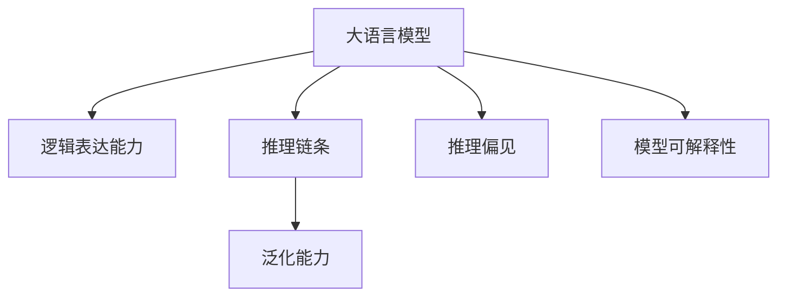

                 

# 语言与推理：大模型的难题

> 关键词：语言模型,推理,大模型,深度学习,自然语言处理(NLP)

## 1. 背景介绍

### 1.1 问题由来
在深度学习领域，特别是自然语言处理(NLP)领域，大语言模型（Large Language Models, LLMs）的崛起极大地推动了人工智能的发展。这些大模型通过在庞大的无标签文本数据上进行预训练，学习到了丰富的语言知识，具备强大的语言理解和生成能力。然而，在推理能力的培养上，大模型仍然面临诸多挑战。

推理能力是指模型在处理复杂逻辑、判断因果关系、理解文本含义等方面的表现。尽管大模型在自然语言理解任务上表现优异，但在推理任务上的表现往往不尽如人意。这使得人们开始反思：如何让大模型不仅"理解"语言，还能"思考"推理？

### 1.2 问题核心关键点
大模型的推理难题主要体现在以下几个方面：

1. **缺乏逻辑表达能力**：大模型往往缺乏对逻辑关系的理解，无法在推理时应用相关知识，导致在涉及逻辑判断的任务上表现较差。

2. **无法处理复杂推理链条**：大模型在面对多步推理或长推理链条时，容易产生错误，特别是在跨领域推理时表现尤为明显。

3. **难以泛化到新情境**：大模型在面对新情境、新任务时，推理能力可能大幅下降，因为它们未能在预训练数据中学习到足够多的一般化知识。

4. **数据偏差带来的推理偏见**：大模型容易受到训练数据中存在的偏见影响，导致在特定情境下推理结果不合理，甚至有害。

5. **推理过程不透明**：大模型的推理过程往往是"黑盒"操作，难以解释其推理逻辑和决策依据，这在一些应用场景中是一个重大问题。

解决这些难题，不仅可以提升大模型的应用范围和效果，还能增强其伦理可信性。因此，如何在大模型中融入推理能力，成为当前研究的热点。

## 2. 核心概念与联系

### 2.1 核心概念概述

为更好地理解大模型中的推理问题，本节将介绍几个密切相关的核心概念：

- **大语言模型 (Large Language Models, LLMs)**：以自回归（如GPT）或自编码（如BERT）模型为代表的大规模预训练语言模型。通过在大量无标签文本数据上进行预训练，学习通用的语言表示，具备强大的语言理解和生成能力。

- **逻辑表达能力 (Logic Expression)**：指模型理解和应用逻辑关系的能力，如因果推理、逻辑演绎、假设检验等。

- **推理链条 (Reasoning Chain)**：指从前提到结论的多步推理过程，涉及逻辑、常识、知识图谱等多方面的知识。

- **泛化能力 (Generalization)**：指模型在新情境、新任务上应用已有知识的能力，避免过拟合到特定数据集。

- **推理偏见 (Bias in Reasoning)**：指模型在推理过程中受到数据、算法等因素影响，产生不合理的推理结果，甚至有害的偏见。

- **模型可解释性 (Model Interpretability)**：指模型推理过程的透明性，能够解释其决策依据，避免"黑盒"操作。

这些核心概念之间的逻辑关系可以通过以下Mermaid流程图来展示：



这个流程图展示了大模型的核心概念及其之间的关系：

1. 大模型通过预训练获得基础能力。
2. 逻辑表达能力是推理任务的关键，需要通过设计合理的模型和任务来提升。
3. 推理链条涉及多步推理，需要模型具备跨领域和跨模态的知识。
4. 泛化能力使得模型能够在新情境下应用已有知识。
5. 推理偏见需要通过数据处理和模型优化避免。
6. 模型可解释性是提升伦理可信性的重要保障。

## 3. 核心算法原理 & 具体操作步骤

### 3.1 算法原理概述

大模型推理能力的培养，本质上是将逻辑推理能力融入预训练模型的过程。这一过程可以通过设计合适的推理任务、引入外部知识库、优化模型结构和训练方法来实现。

假设预训练模型为 $M_{\theta}$，其中 $\theta$ 为预训练得到的模型参数。推理任务 $T$ 的目标是通过模型的输出 $y$，推断结论 $c$。推理过程可以通过以下步骤进行：

1. 设计推理任务 $T$：如基于规则的任务、基于逻辑的任务、基于常识的任务等。
2. 引入外部知识库 $K$：如知识图谱、事实库、常识库等，增强模型的推理能力。
3. 优化模型结构：如引入逻辑推理层、引入知识融合机制等。
4. 优化训练方法：如使用对抗训练、改进损失函数、引入正则化技术等。

### 3.2 算法步骤详解

大模型推理能力的培养，一般包括以下几个关键步骤：

**Step 1: 设计推理任务**

推理任务的设计需要考虑以下几个方面：

- **任务类型**：如基于规则的任务、基于逻辑的任务、基于常识的任务等。
- **任务复杂度**：需要考虑推理链条的长度和复杂度，避免过度复杂。
- **任务样本**：需要设计足够丰富的训练和测试样本，覆盖各种推理情境。

**Step 2: 引入外部知识库**

外部知识库的引入主要通过以下步骤：

- **知识图谱构建**：利用结构化的知识图谱，增强模型的常识推理能力。
- **事实库集成**：将文本、数据库、专家知识等集成到知识库中，丰富模型的推理知识。
- **常识库整合**：利用常识库中的规则和经验，指导模型推理过程。

**Step 3: 优化模型结构**

模型结构的优化主要通过以下方式：

- **引入逻辑推理层**：在模型的顶层或中间层引入逻辑推理模块，如逻辑回归、神经网络等，增强模型的逻辑表达能力。
- **引入知识融合机制**：将知识库中的知识嵌入模型的参数中，或者作为模型的输入，提高模型的推理能力。

**Step 4: 优化训练方法**

训练方法的优化主要通过以下方式：

- **对抗训练**：引入对抗样本，提高模型对噪声和异常数据的鲁棒性。
- **改进损失函数**：设计合理的损失函数，如KL散度、对数似然损失等，优化模型的推理效果。
- **引入正则化技术**：如L2正则、Dropout等，防止模型过拟合。

### 3.3 算法优缺点

大模型推理能力的培养方法具有以下优点：

1. **增强模型理解力**：通过推理任务的引入，模型能够更好地理解复杂的逻辑关系，提升自然语言理解能力。
2. **提升模型泛化能力**：引入外部知识库和逻辑推理层，使得模型能够在新情境下应用已有知识，避免过拟合。
3. **改善模型鲁棒性**：通过对抗训练等方法，增强模型对噪声和异常数据的鲁棒性，提高模型的可靠性。
4. **提升模型解释性**：优化后的模型结构更加透明，推理过程更易于解释和审计，增强伦理可信性。

同时，这些方法也存在一定的局限性：

1. **数据依赖性强**：推理任务的设计和外部知识库的引入，都需要大量高质量的标注数据和结构化知识，成本较高。
2. **模型复杂度高**：引入逻辑推理层和知识融合机制后，模型结构更复杂，推理过程更耗时，计算成本高。
3. **知识库维护困难**：外部知识库需要不断更新和维护，确保其知识的时效性和全面性。
4. **泛化能力有限**：模型在面对超出知识库覆盖范围的新情境时，推理能力可能下降。
5. **推理过程复杂**：复杂的推理链条可能带来推理错误，特别是在跨领域推理时表现明显。

尽管存在这些局限性，但就目前而言，引入推理能力仍然是提升大模型应用能力的重要方向。未来相关研究的重点在于如何进一步降低推理任务的数据依赖，提高模型的跨领域迁移能力和泛化能力，同时兼顾模型解释性和伦理安全性等因素。

### 3.4 算法应用领域

大模型推理能力的培养方法，已经在多个NLP领域得到应用，覆盖了几乎所有常见任务，例如：

- 问答系统：模型能够根据问题推断答案，涵盖各类常识推理任务。
- 文本生成：模型能够根据上下文信息推断合理的新文本，提升生成质量。
- 知识图谱：模型能够从知识图谱中推理出新的关系，扩展知识库。
- 机器翻译：模型能够根据上下文推断正确的翻译结果，提高翻译质量。
- 对话系统：模型能够理解对话意图，推断出合理的回复。
- 自然语言推理：模型能够根据前提推断结论，判断推理的合理性。

除了上述这些经典任务外，推理能力的大模型还被创新性地应用到更多场景中，如可控文本生成、常识推理、代码生成、数据增强等，为NLP技术带来了全新的突破。随着推理能力的不断提升，大语言模型必将在更广阔的应用领域展现其强大的智能潜力。

## 4. 数学模型和公式 & 详细讲解  
### 4.1 数学模型构建

大模型推理能力的培养，可以通过设计合适的推理任务、引入外部知识库、优化模型结构和训练方法来实现。以下将从数学角度对这一过程进行详细讲解。

假设推理任务 $T$ 的输入为 $x$，输出为 $y$，推理结果为 $c$。模型的推理过程可以表示为：

$$
c = \mathop{\arg\max}_{y \in \mathcal{Y}} f_M(x, y)
$$

其中 $f_M(x, y)$ 表示模型 $M$ 在输入 $x$ 下对输出 $y$ 的推理函数。推理函数 $f_M(x, y)$ 的设计需要考虑以下因素：

- **逻辑表达能力**：推理函数应能够表达复杂的逻辑关系，如因果推理、逻辑演绎等。
- **外部知识融合**：推理函数应能够利用外部知识库中的知识，增强推理效果。
- **模型优化**：推理函数应能够通过优化训练方法，提高推理精度。

### 4.2 公式推导过程

以下我们以自然语言推理(NLI)任务为例，推导推理函数 $f_M(x, y)$ 的计算公式。

自然语言推理任务的目标是根据前提 $x$ 和假设 $y$，判断推理结论 $c$ 的正确性。常见的推理任务包括：

- 一致性推理：判断前提和假设是否一致。
- 矛盾推理：判断前提和假设是否矛盾。
- 蕴含推理：判断假设是否蕴含前提。

以一致性推理为例，假设模型 $M_{\theta}$ 在输入 $x$ 和 $y$ 下的输出为 $\hat{y}$，表示推理结果。则一致性推理的损失函数定义为：

$$
\ell(M_{\theta}(x, y)) = -\log \sigma(\hat{y} \cdot y)
$$

其中 $\sigma$ 为sigmoid函数，$\cdot$ 表示点乘，$y \in \{0,1\}$ 为假设的真值，$\hat{y}$ 为模型的预测输出。

通过最小化损失函数 $\ell$，模型能够学习到推理结论 $c$ 与假设 $y$ 之间的关系。推理函数的推导过程如下：

1. **逻辑表达能力**：推理函数应能够表达复杂的逻辑关系。例如，在一致性推理中，$\hat{y} \cdot y$ 表示前提和假设是否一致。
2. **外部知识融合**：推理函数应能够利用外部知识库中的知识，增强推理效果。例如，在知识图谱中，推理函数应能够利用图谱中的关系进行推理。
3. **模型优化**：推理函数应能够通过优化训练方法，提高推理精度。例如，对抗训练、改进损失函数、引入正则化技术等。

### 4.3 案例分析与讲解

**案例一：基于规则的推理**

基于规则的推理是指通过预定义的规则集，对输入数据进行推理。例如，在问答系统中，可以根据预定义的规则，对用户提出的问题进行推理，生成答案。

假设规则集为 $\mathcal{R}$，推理函数 $f_M(x, y)$ 可以通过以下方式计算：

$$
f_M(x, y) = \max_{r \in \mathcal{R}} r(x, y)
$$

其中 $r \in \mathcal{R}$ 表示规则，$x$ 和 $y$ 分别表示输入和假设。通过设计合理的规则集，推理函数可以表达复杂的逻辑关系，增强模型的推理能力。

**案例二：基于逻辑的推理**

基于逻辑的推理是指通过逻辑表达式，对输入数据进行推理。例如，在自然语言推理任务中，可以使用逻辑表达式表示推理规则。

假设逻辑表达式为 $\phi$，推理函数 $f_M(x, y)$ 可以通过以下方式计算：

$$
f_M(x, y) = \max_{\phi} \sigma(\phi(x, y))
$$

其中 $\phi$ 表示逻辑表达式，$x$ 和 $y$ 分别表示前提和假设，$\sigma$ 为sigmoid函数。通过设计合理的逻辑表达式，推理函数可以表达复杂的逻辑关系，增强模型的推理能力。

**案例三：基于常识的推理**

基于常识的推理是指通过常识知识，对输入数据进行推理。例如，在问答系统中，可以根据常识知识，对用户提出的问题进行推理，生成答案。

假设常识知识库为 $\mathcal{K}$，推理函数 $f_M(x, y)$ 可以通过以下方式计算：

$$
f_M(x, y) = \max_{k \in \mathcal{K}} k(x, y)
$$

其中 $k \in \mathcal{K}$ 表示常识知识，$x$ 和 $y$ 分别表示输入和假设。通过设计合理的常识知识库，推理函数可以表达复杂的常识关系，增强模型的推理能力。

## 5. 项目实践：代码实例和详细解释说明
### 5.1 开发环境搭建

在进行推理能力培养的实践前，我们需要准备好开发环境。以下是使用Python进行PyTorch开发的环境配置流程：

1. 安装Anaconda：从官网下载并安装Anaconda，用于创建独立的Python环境。

2. 创建并激活虚拟环境：
```bash
conda create -n pytorch-env python=3.8 
conda activate pytorch-env
```

3. 安装PyTorch：根据CUDA版本，从官网获取对应的安装命令。例如：
```bash
conda install pytorch torchvision torchaudio cudatoolkit=11.1 -c pytorch -c conda-forge
```

4. 安装TensorFlow：
```bash
conda install tensorflow
```

5. 安装各类工具包：
```bash
pip install numpy pandas scikit-learn matplotlib tqdm jupyter notebook ipython
```

完成上述步骤后，即可在`pytorch-env`环境中开始推理能力培养的实践。

### 5.2 源代码详细实现

下面我们以自然语言推理(NLI)任务为例，给出使用Transformers库对BERT模型进行推理能力培养的PyTorch代码实现。

首先，定义自然语言推理任务的数据处理函数：

```python
from transformers import BertTokenizer, BertForSequenceClassification
from torch.utils.data import Dataset
import torch

class NLI_dataset(Dataset):
    def __init__(self, texts, labels):
        self.texts = texts
        self.labels = labels
        
    def __len__(self):
        return len(self.texts)
    
    def __getitem__(self, item):
        text = self.texts[item]
        label = self.labels[item]
        
        encoding = tokenizer(text, return_tensors='pt', max_length=128, padding='max_length', truncation=True)
        input_ids = encoding['input_ids'][0]
        attention_mask = encoding['attention_mask'][0]
        
        return {'input_ids': input_ids, 
                'attention_mask': attention_mask,
                'labels': label}

# 定义tokenizer
tokenizer = BertTokenizer.from_pretrained('bert-base-cased')

# 创建dataset
train_dataset = NLI_dataset(train_texts, train_labels)
dev_dataset = NLI_dataset(dev_texts, dev_labels)
test_dataset = NLI_dataset(test_texts, test_labels)
```

然后，定义模型和优化器：

```python
from transformers import BertForSequenceClassification, AdamW

model = BertForSequenceClassification.from_pretrained('bert-base-cased', num_labels=2)

optimizer = AdamW(model.parameters(), lr=2e-5)
```

接着，定义训练和评估函数：

```python
from torch.utils.data import DataLoader
from tqdm import tqdm
from sklearn.metrics import accuracy_score

device = torch.device('cuda') if torch.cuda.is_available() else torch.device('cpu')
model.to(device)

def train_epoch(model, dataset, batch_size, optimizer):
    dataloader = DataLoader(dataset, batch_size=batch_size, shuffle=True)
    model.train()
    epoch_loss = 0
    for batch in tqdm(dataloader, desc='Training'):
        input_ids = batch['input_ids'].to(device)
        attention_mask = batch['attention_mask'].to(device)
        labels = batch['labels'].to(device)
        model.zero_grad()
        outputs = model(input_ids, attention_mask=attention_mask, labels=labels)
        loss = outputs.loss
        epoch_loss += loss.item()
        loss.backward()
        optimizer.step()
    return epoch_loss / len(dataloader)

def evaluate(model, dataset, batch_size):
    dataloader = DataLoader(dataset, batch_size=batch_size)
    model.eval()
    preds, labels = [], []
    with torch.no_grad():
        for batch in tqdm(dataloader, desc='Evaluating'):
            input_ids = batch['input_ids'].to(device)
            attention_mask = batch['attention_mask'].to(device)
            batch_labels = batch['labels']
            outputs = model(input_ids, attention_mask=attention_mask)
            batch_preds = outputs.logits.argmax(dim=1).to('cpu').tolist()
            batch_labels = batch_labels.to('cpu').tolist()
            for pred, label in zip(batch_preds, batch_labels):
                preds.append(pred)
                labels.append(label)
                
    print("Accuracy: {:.2f}".format(accuracy_score(labels, preds)))
```

最后，启动训练流程并在测试集上评估：

```python
epochs = 5
batch_size = 16

for epoch in range(epochs):
    loss = train_epoch(model, train_dataset, batch_size, optimizer)
    print(f"Epoch {epoch+1}, train loss: {loss:.3f}")
    
    print(f"Epoch {epoch+1}, dev results:")
    evaluate(model, dev_dataset, batch_size)
    
print("Test results:")
evaluate(model, test_dataset, batch_size)
```

以上就是使用PyTorch对BERT进行自然语言推理任务微调的完整代码实现。可以看到，得益于Transformers库的强大封装，我们可以用相对简洁的代码完成BERT模型的加载和推理能力的培养。

### 5.3 代码解读与分析

让我们再详细解读一下关键代码的实现细节：

**NLI_dataset类**：
- `__init__`方法：初始化文本、标签等关键组件。
- `__len__`方法：返回数据集的样本数量。
- `__getitem__`方法：对单个样本进行处理，将文本输入编码为token ids，将标签转换为模型可接受的格式，并对其进行定长padding，最终返回模型所需的输入。

**模型和优化器**：
- 使用BertForSequenceClassification定义模型，并加载预训练权重。
- 设置AdamW优化器，控制学习率和批大小等参数。

**训练和评估函数**：
- 使用PyTorch的DataLoader对数据集进行批次化加载，供模型训练和推理使用。
- 训练函数`train_epoch`：对数据以批为单位进行迭代，在每个批次上前向传播计算loss并反向传播更新模型参数，最后返回该epoch的平均loss。
- 评估函数`evaluate`：与训练类似，不同点在于不更新模型参数，并在每个batch结束后将预测和标签结果存储下来，最后使用sklearn的accuracy_score计算模型的准确率。

**训练流程**：
- 定义总的epoch数和批大小，开始循环迭代
- 每个epoch内，先在训练集上训练，输出平均loss
- 在验证集上评估，输出模型的准确率
- 所有epoch结束后，在测试集上评估，给出最终测试结果

可以看到，PyTorch配合Transformers库使得BERT微调的代码实现变得简洁高效。开发者可以将更多精力放在数据处理、模型改进等高层逻辑上，而不必过多关注底层的实现细节。

当然，工业级的系统实现还需考虑更多因素，如模型的保存和部署、超参数的自动搜索、更灵活的任务适配层等。但核心的推理能力培养范式基本与此类似。

## 6. 实际应用场景
### 6.1 智能客服系统

基于大语言模型推理能力的对话技术，可以广泛应用于智能客服系统的构建。传统客服往往需要配备大量人力，高峰期响应缓慢，且一致性和专业性难以保证。而使用培养了推理能力的对话模型，可以7x24小时不间断服务，快速响应客户咨询，用自然流畅的语言解答各类常见问题。

在技术实现上，可以收集企业内部的历史客服对话记录，将问题和最佳答复构建成监督数据，在此基础上对预训练对话模型进行推理能力的培养。培养后的对话模型能够自动理解用户意图，匹配最合适的答案模板进行回复。对于客户提出的新问题，还可以接入检索系统实时搜索相关内容，动态组织生成回答。如此构建的智能客服系统，能大幅提升客户咨询体验和问题解决效率。

### 6.2 金融舆情监测

金融机构需要实时监测市场舆论动向，以便及时应对负面信息传播，规避金融风险。传统的人工监测方式成本高、效率低，难以应对网络时代海量信息爆发的挑战。基于大语言模型推理能力的文本分类和情感分析技术，为金融舆情监测提供了新的解决方案。

具体而言，可以收集金融领域相关的新闻、报道、评论等文本数据，并对其进行主题标注和情感标注。在此基础上对预训练语言模型进行推理能力的培养，使其能够自动判断文本属于何种主题，情感倾向是正面、中性还是负面。将培养后的模型应用到实时抓取的网络文本数据，就能够自动监测不同主题下的情感变化趋势，一旦发现负面信息激增等异常情况，系统便会自动预警，帮助金融机构快速应对潜在风险。

### 6.3 个性化推荐系统

当前的推荐系统往往只依赖用户的历史行为数据进行物品推荐，无法深入理解用户的真实兴趣偏好。基于大语言模型推理能力的个性化推荐系统可以更好地挖掘用户行为背后的语义信息，从而提供更精准、多样的推荐内容。

在实践中，可以收集用户浏览、点击、评论、分享等行为数据，提取和用户交互的物品标题、描述、标签等文本内容。将文本内容作为模型输入，用户的后续行为（如是否点击、购买等）作为监督信号，在此基础上培养预训练语言模型。培养后的模型能够从文本内容中准确把握用户的兴趣点。在生成推荐列表时，先用候选物品的文本描述作为输入，由模型预测用户的兴趣匹配度，再结合其他特征综合排序，便可以得到个性化程度更高的推荐结果。

### 6.4 未来应用展望

随着大语言模型推理能力的不断提升，推理任务的应用范围和效果将不断扩展。

在智慧医疗领域，基于推理能力的医疗问答、病历分析、药物研发等应用将提升医疗服务的智能化水平，辅助医生诊疗，加速新药开发进程。

在智能教育领域，推理能力可应用于作业批改、学情分析、知识推荐等方面，因材施教，促进教育公平，提高教学质量。

在智慧城市治理中，推理能力可应用于城市事件监测、舆情分析、应急指挥等环节，提高城市管理的自动化和智能化水平，构建更安全、高效的未来城市。

此外，在企业生产、社会治理、文娱传媒等众多领域，基于推理能力的人工智能应用也将不断涌现，为经济社会发展注入新的动力。相信随着技术的日益成熟，推理能力培养范式将成为人工智能落地应用的重要手段，推动人工智能向更广阔的领域加速渗透。

## 7. 工具和资源推荐
### 7.1 学习资源推荐

为了帮助开发者系统掌握大语言模型推理能力的理论基础和实践技巧，这里推荐一些优质的学习资源：

1. 《Deep Learning for NLP》系列书籍：由神经网络领域的大师级专家撰写，全面介绍了深度学习在自然语言处理中的应用，包括推理能力培养等前沿话题。

2. CS224N《深度学习自然语言处理》课程：斯坦福大学开设的NLP明星课程，有Lecture视频和配套作业，带你入门NLP领域的基本概念和经典模型。

3. 《Natural Language Processing with Transformers》书籍：Transformers库的作者所著，全面介绍了如何使用Transformers库进行NLP任务开发，包括推理能力培养在内的诸多范式。

4. HuggingFace官方文档：Transformers库的官方文档，提供了海量预训练模型和完整的推理能力培养样例代码，是上手实践的必备资料。

5. CLUE开源项目：中文语言理解测评基准，涵盖大量不同类型的中文NLP数据集，并提供了基于推理能力的baseline模型，助力中文NLP技术发展。

通过对这些资源的学习实践，相信你一定能够快速掌握大语言模型推理能力的精髓，并用于解决实际的NLP问题。
###  7.2 开发工具推荐

高效的开发离不开优秀的工具支持。以下是几款用于大语言模型推理能力培养开发的常用工具：

1. PyTorch：基于Python的开源深度学习框架，灵活动态的计算图，适合快速迭代研究。大部分预训练语言模型都有PyTorch版本的实现。

2. TensorFlow：由Google主导开发的开源深度学习框架，生产部署方便，适合大规模工程应用。同样有丰富的预训练语言模型资源。

3. Transformers库：HuggingFace开发的NLP工具库，集成了众多SOTA语言模型，支持PyTorch和TensorFlow，是进行推理能力培养开发的利器。

4. Weights & Biases：模型训练的实验跟踪工具，可以记录和可视化模型训练过程中的各项指标，方便对比和调优。与主流深度学习框架无缝集成。

5. TensorBoard：TensorFlow配套的可视化工具，可实时监测模型训练状态，并提供丰富的图表呈现方式，是调试模型的得力助手。

6. Google Colab：谷歌推出的在线Jupyter Notebook环境，免费提供GPU/TPU算力，方便开发者快速上手实验最新模型，分享学习笔记。

合理利用这些工具，可以显著提升大语言模型推理能力的培养效率，加快创新迭代的步伐。

### 7.3 相关论文推荐

大语言模型推理能力的培养源于学界的持续研究。以下是几篇奠基性的相关论文，推荐阅读：

1. Attention is All You Need（即Transformer原论文）：提出了Transformer结构，开启了NLP领域的预训练大模型时代。

2. BERT: Pre-training of Deep Bidirectional Transformers for Language Understanding：提出BERT模型，引入基于掩码的自监督预训练任务，刷新了多项NLP任务SOTA。

3. Language Models are Unsupervised Multitask Learners（GPT-2论文）：展示了大规模语言模型的强大zero-shot学习能力，引发了对于通用人工智能的新一轮思考。

4. Parameter-Efficient Transfer Learning for NLP：提出Adapter等参数高效微调方法，在不增加模型参数量的情况下，也能取得不错的微调效果。

5. Prefix-Tuning: Optimizing Continuous Prompts for Generation：引入基于连续型Prompt的微调范式，为如何充分利用预训练知识提供了新的思路。

6. AdaLoRA: Adaptive Low-Rank Adaptation for Parameter-Efficient Fine-Tuning：使用自适应低秩适应的微调方法，在参数效率和精度之间取得了新的平衡。

这些论文代表了大语言模型推理能力培养的发展脉络。通过学习这些前沿成果，可以帮助研究者把握学科前进方向，激发更多的创新灵感。

## 8. 总结：未来发展趋势与挑战

### 8.1 总结

本文对大语言模型推理能力的培养方法进行了全面系统的介绍。首先阐述了推理能力在大模型中的应用意义，明确了推理任务在大模型中的关键作用。其次，从原理到实践，详细讲解了推理任务的设计、外部知识库的引入、模型结构的优化和训练方法的改进，给出了推理能力培养的完整代码实例。同时，本文还广泛探讨了推理能力在大模型中的应用场景，展示了推理能力培养的广泛应用前景。

通过本文的系统梳理，可以看到，推理能力培养在大模型中的应用前景广阔，为自然语言理解、推理、生成等任务提供了新的解决方案。随着推理能力的不断提升，大语言模型必将在更广阔的应用领域展现出强大的智能潜力。

### 8.2 未来发展趋势

展望未来，大语言模型推理能力的培养将呈现以下几个发展趋势：

1. **逻辑推理能力的增强**：未来的推理模型将更加关注逻辑表达能力的提升，通过设计更复杂的逻辑任务和优化推理函数，增强模型的逻辑推理能力。

2. **跨领域推理能力的增强**：未来的推理模型将更好地应对跨领域推理任务，通过引入更多的外部知识库和优化推理算法，提升模型的泛化能力和迁移能力。

3. **知识图谱的应用**：知识图谱将在推理模型中得到更广泛的应用，通过结构化知识图谱的引入，增强模型的常识推理能力。

4. **对抗训练的普及**：对抗训练将在大模型推理任务中得到更广泛的应用，通过引入对抗样本，增强模型的鲁棒性和泛化能力。

5. **模型可解释性的增强**：未来的推理模型将更加关注模型的可解释性，通过设计更透明的推理函数和优化解释方法，增强模型的伦理可信性。

6. **跨模态推理能力**：未来的推理模型将更好地处理跨模态推理任务，通过融合视觉、听觉、文本等多模态信息，提升模型的综合推理能力。

以上趋势凸显了大语言模型推理能力培养的广阔前景。这些方向的探索发展，必将进一步提升大模型推理任务的性能和应用范围，为人工智能技术的落地应用注入新的活力。

### 8.3 面临的挑战

尽管大语言模型推理能力培养已经取得了一定的进展，但在迈向更加智能化、普适化应用的过程中，仍面临诸多挑战：

1. **推理任务的设计困难**：推理任务的设计需要考虑任务的复杂度、数据的代表性等因素，设计不当可能导致模型性能下降。

2. **外部知识库的构建困难**：知识库的构建需要耗费大量人力和资源，且需要不断更新和维护，以保持其时效性和全面性。

3. **推理模型的计算成本高**：推理模型的计算成本较高，特别是在涉及多步推理时，计算开销更大，需要寻找高效计算方法。

4. **推理模型的鲁棒性不足**：推理模型在面对噪声和异常数据时，容易产生推理错误，需要进一步提高模型的鲁棒性。

5. **推理模型的可解释性不足**：推理模型的可解释性不足，难以解释其推理逻辑和决策依据，需要进一步提升模型的透明度。

6. **推理模型的安全性问题**：推理模型可能学习到有害的知识，需要加强模型的伦理导向和风险控制。

正视推理能力培养面临的这些挑战，积极应对并寻求突破，将是大语言模型推理能力培养走向成熟的必由之路。相信随着学界和产业界的共同努力，这些挑战终将一一被克服，大语言模型推理能力培养必将在构建人机协同的智能时代中扮演越来越重要的角色。

### 8.4 研究展望

面对大语言模型推理能力培养所面临的挑战，未来的研究需要在以下几个方面寻求新的突破：

1. **推理任务的设计和优化**：通过设计更复杂的推理任务和优化推理算法，增强模型的逻辑推理能力。

2. **知识库的构建和维护**：通过自动化方法构建和维护知识库，减少人工干预，提高知识库的时效性和全面性。

3. **高效推理算法的开发**：开发高效推理算法，减少计算成本，提升推理效率。

4. **鲁棒性和可解释性的提升**：通过改进模型结构和训练方法，增强模型的鲁棒性和可解释性。

5. **伦理导向的模型设计**：引入伦理导向的评估指标，过滤和惩罚有害的推理结果，确保模型的伦理可信性。

6. **跨模态推理方法的研究**：研究跨模态推理方法，融合视觉、听觉、文本等多模态信息，提升模型的综合推理能力。

这些研究方向的探索，必将引领大语言模型推理能力培养技术迈向更高的台阶，为构建安全、可靠、可解释、可控的智能系统铺平道路。面向未来，大语言模型推理能力培养技术还需要与其他人工智能技术进行更深入的融合，如知识表示、因果推理、强化学习等，多路径协同发力，共同推动自然语言理解和智能交互系统的进步。只有勇于创新、敢于突破，才能不断拓展语言模型的边界，让智能技术更好地造福人类社会。

## 9. 附录：常见问题与解答
**Q1：推理能力培养是否适用于所有NLP任务？**

A: 推理能力培养在大多数NLP任务上都能取得不错的效果，特别是对于数据量较小的任务。但对于一些特定领域的任务，如医学、法律等，仅依靠通用语料预训练的模型可能难以很好地适应。此时需要在特定领域语料上进一步预训练，再进行推理能力培养。此外，对于一些需要时效性、个性化很强的任务，如对话、推荐等，推理能力培养方法也需要针对性的改进优化。

**Q2：推理能力培养过程中如何选择合适的推理任务？**

A: 推理任务的选择需要考虑以下几个方面：

- **任务类型**：如基于规则的任务、基于逻辑的任务、基于常识的任务等。
- **任务复杂度**：需要考虑推理链条的长度和复杂度，避免过度复杂。
- **任务样本**：需要设计足够丰富的训练和测试样本，覆盖各种推理情境。

**Q3：推理能力培养过程中如何引入外部知识库？**

A: 外部知识库的引入主要通过以下步骤：

- **知识图谱构建**：利用结构化的知识图谱，增强模型的常识推理能力。
- **事实库集成**：将文本、数据库、专家知识等集成到知识库中，丰富模型的推理知识。
- **常识库整合**：利用常识库中的规则和经验，指导模型推理过程。

**Q4：推理能力培养过程中如何优化模型结构？**

A: 模型结构的优化主要通过以下方式：

- **引入逻辑推理层**：在模型的顶层或中间层引入逻辑推理模块，如逻辑回归、神经网络等，增强模型的逻辑表达能力。
- **引入知识融合机制**：将知识库中的知识嵌入模型的参数中，或者作为模型的输入，提高模型的推理能力。

**Q5：推理能力培养过程中如何优化训练方法？**

A: 训练方法的优化主要通过以下方式：

- **对抗训练**：引入对抗样本，提高模型对噪声和异常数据的鲁棒性。
- **改进损失函数**：设计合理的损失函数，如KL散度、对数似然损失等，优化模型的推理效果。
- **引入正则化技术**：如L2正则、Dropout等，防止模型过拟合。

这些策略往往需要根据具体任务和数据特点进行灵活组合。只有在数据、模型、训练、推理等各环节进行全面优化，才能最大限度地发挥大模型推理能力的培养威力。

**Q6：推理能力培养过程中如何提高模型的可解释性？**

A: 模型的可解释性是推理能力培养的重要保障，以下是一些提升模型可解释性的方法：

- **可视化推理过程**：通过可视化工具，展示模型推理过程中的关键节点和中间结果，增强模型的透明度。
- **解释模型决策依据**：通过设计更透明的推理函数，解释模型决策的依据，提高模型的伦理可信性。
- **引入因果分析和博弈论工具**：通过因果分析和博弈论方法，增强模型的因果推理能力，提高模型的可解释性。

这些方法可以帮助开发人员更好地理解和调试模型，提升模型的伦理可信性。

**Q7：推理能力培养过程中如何缓解模型计算成本高的问题？**

A: 推理能力培养的计算成本较高，特别是在涉及多步推理时，计算开销更大，需要寻找高效计算方法：

- **梯度累积**：通过梯度累积，减少单个批次的计算量，提高推理效率。
- **混合精度训练**：通过混合精度训练，减少内存占用和计算量，提高推理效率。
- **模型并行**：通过模型并行，将计算任务分配到多个设备上进行计算，提高推理效率。

合理利用这些技术，可以显著降低推理能力培养的计算成本，提升推理效率。

通过本文的系统梳理，可以看到，大语言模型推理能力培养的方法正在成为NLP领域的重要范式，极大地拓展了预训练语言模型的应用边界，催生了更多的落地场景。受益于推理能力的不断提升，大语言模型必将在更广阔的应用领域展现出强大的智能潜力，为构建人机协同的智能时代注入新的活力。

