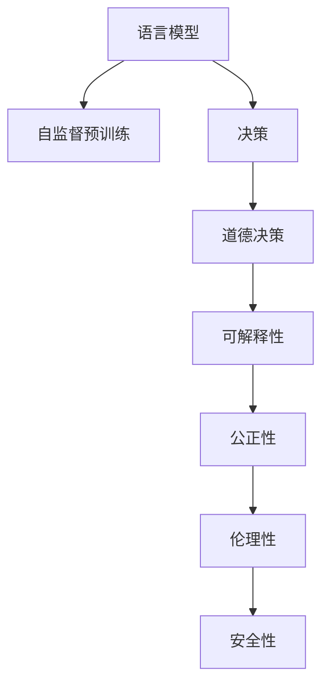

                 

# 语言模型的道德决策能力

## 1. 背景介绍

### 1.1 问题由来
在现代社会，语言模型的应用已经无处不在。从聊天机器人到自然语言处理，再到自动驾驶，语言模型已成为人工智能的重要组成部分。然而，语言模型也引发了一系列伦理道德问题。尤其是当语言模型被用于决策时，其道德决策能力是否可靠，是否公正，是否符合人类价值观，成为了一个亟需探讨的课题。

近年来，随着深度学习技术的发展，语言模型的决策能力越来越强，也越来越复杂。例如，GPT-3等大型预训练模型，具备了生成连贯、复杂的文本序列的能力，甚至能够通过自对话生成完全符合语法和语义规则的对话。但这种能力是否意味着语言模型已经具备了道德决策能力呢？本文将探讨语言模型的道德决策能力，并分析其潜在的伦理道德风险。

### 1.2 问题核心关键点
语言模型的道德决策能力主要涉及以下几个方面：

- 语言模型的决策过程是否透明可解释
- 语言模型的决策是否公正、无偏见
- 语言模型的决策是否符合人类道德价值观
- 语言模型的决策是否可控，是否存在潜在的风险

这些问题涉及到语言模型的可解释性、公正性、伦理性以及安全性等关键点，是研究语言模型道德决策能力的核心所在。

## 2. 核心概念与联系

### 2.1 核心概念概述

为了更好地理解语言模型的道德决策能力，本节将介绍几个关键概念：

- **语言模型**：通过大规模无标签文本数据进行自监督预训练的模型，具备生成、分类、翻译等自然语言处理能力。
- **决策**：语言模型基于输入文本生成的输出结果，可以用于分类、生成、问答等多种任务。
- **道德决策**：语言模型的决策不仅需要符合逻辑规则，还需要符合人类道德伦理标准，不偏向任何群体，不歧视任何人。
- **可解释性**：语言模型的决策过程需要能够被人类理解，便于审查和监督。
- **公正性**：语言模型的决策应平等对待不同性别、种族、国籍等群体，避免歧视和偏见。
- **伦理性**：语言模型的决策应符合社会公序良俗，不宣扬暴力、色情等不良内容。
- **安全性**：语言模型的决策不应存在安全隐患，不会导致社会问题。

这些核心概念之间的逻辑关系可以通过以下Mermaid流程图来展示：



这个流程图展示了大语言模型的核心概念及其之间的关系：

1. 语言模型通过自监督预训练获得基础能力。
2. 决策是基于输入文本生成输出结果的过程。
3. 道德决策需要符合伦理道德标准。
4. 可解释性保证决策过程透明可审查。
5. 公正性保证决策对不同群体平等。
6. 伦理性保证决策符合社会公序良俗。
7. 安全性保证决策不产生安全隐患。

这些概念共同构成了语言模型的道德决策能力的评估框架，使其能够在各种场景下发挥作用。

## 3. 核心算法原理 & 具体操作步骤
### 3.1 算法原理概述

语言模型的道德决策能力涉及到多个维度的评估和优化。其核心算法原理主要包括以下几个方面：

1. **自监督预训练**：通过无标签数据对语言模型进行预训练，使其具备处理自然语言的基本能力。

2. **决策过程优化**：通过正则化、对抗训练、参数高效微调等技术，优化语言模型的决策过程，使其更稳定、更公正、更安全。

3. **可解释性增强**：通过逻辑回归、Attention机制等技术，增强语言模型的可解释性，使其决策过程透明、可审查。

4. **公平性约束**：通过引入公平性约束，如对抗公平性、领域公平性等，防止语言模型对某些群体的歧视和偏见。

5. **伦理性规范**：通过限制语言模型生成不良内容，确保其决策符合社会公序良俗。

6. **安全性保障**：通过模型裁剪、量化加速等技术，保障语言模型在实际应用中的安全性。

### 3.2 算法步骤详解

基于语言模型的道德决策能力，我们可以进行以下关键步骤：

**Step 1: 准备数据集**

- 收集包含伦理道德问题的数据集，如性别歧视、种族偏见、暴力内容等。
- 使用数据增强技术扩充数据集，增加覆盖面。

**Step 2: 设计公平性约束**

- 定义公平性约束，如对抗公平性、领域公平性等，防止语言模型对某些群体的歧视和偏见。
- 使用公平性约束对语言模型进行训练，使其在各种场景下都能保持公正性。

**Step 3: 引入伦理性规范**

- 定义伦理性规范，如避免宣扬暴力、色情等不良内容。
- 使用伦理性规范对语言模型进行训练，确保其生成的内容符合社会公序良俗。

**Step 4: 增强可解释性**

- 使用逻辑回归、Attention机制等技术，增强语言模型的可解释性。
- 使用可解释性评估工具，如LIME、SHAP等，对语言模型的决策过程进行审查和监督。

**Step 5: 设计安全性保障**

- 使用模型裁剪、量化加速等技术，保障语言模型在实际应用中的安全性。
- 定期更新语言模型，修复已知漏洞，确保其安全性。

**Step 6: 优化决策过程**

- 使用正则化、对抗训练、参数高效微调等技术，优化语言模型的决策过程，使其更稳定、更公正、更安全。

**Step 7: 测试和部署**

- 在测试集上评估语言模型的道德决策能力，对比优化前后的性能提升。
- 使用优化后的语言模型对新样本进行推理预测，集成到实际的应用系统中。
- 持续收集新的数据，定期重新优化模型，以适应数据分布的变化。

以上是基于语言模型的道德决策能力的一般流程。在实际应用中，还需要针对具体任务的特点，对道德决策能力进行优化设计，如改进训练目标函数，引入更多的公平性约束等，以进一步提升语言模型的道德决策能力。

### 3.3 算法优缺点

语言模型的道德决策能力具有以下优点：

1. **高效性**：通过自监督预训练和大规模微调，语言模型具备强大的语言理解和生成能力，可以在短时间内生成高质量的输出结果。
2. **通用性**：语言模型可以应用于各种自然语言处理任务，如分类、生成、问答等，具备广泛的应用前景。
3. **可解释性**：通过增强可解释性技术，语言模型的决策过程透明可审查，便于人类理解和监督。

但该方法也存在一定的局限性：

1. **伦理道德风险**：语言模型的决策过程可能存在伦理道德风险，如歧视、偏见等，影响公正性。
2. **可解释性不足**：语言模型的决策过程复杂，难以完全解释，存在一定的“黑箱”问题。
3. **安全性问题**：语言模型的决策可能存在安全隐患，如生成不良内容等，影响应用场景的可靠性。
4. **泛化能力有限**：语言模型在某些领域的应用效果可能不如专门设计的小规模模型，泛化能力受限。

尽管存在这些局限性，但就目前而言，基于语言模型的道德决策能力方法仍是最主流范式。未来相关研究的重点在于如何进一步降低伦理道德风险，提高模型的公平性和安全性，同时兼顾可解释性和伦理性等因素。

### 3.4 算法应用领域

基于语言模型的道德决策能力方法在多个领域得到应用，例如：

- **医疗诊断**：用于辅助医生进行疾病诊断和治疗方案推荐，需要语言模型具备高公正性和伦理性。
- **金融风控**：用于识别和预防欺诈行为，需要语言模型具备高安全性。
- **教育推荐**：用于个性化推荐学习资源，需要语言模型具备高伦理性。
- **法律咨询**：用于辅助律师进行法律分析和案例研究，需要语言模型具备高公平性和伦理性。
- **舆情监测**：用于监测网络舆情，防止宣扬暴力、色情等不良内容，需要语言模型具备高安全性。

除了上述这些经典应用外，语言模型的道德决策能力也被创新性地应用到更多场景中，如可控文本生成、常识推理、代码生成等，为NLP技术带来了新的研究方向。随着语言模型和道德决策能力的持续演进，相信NLP技术将在更广阔的应用领域大放异彩。

## 4. 数学模型和公式 & 详细讲解 & 举例说明（备注：数学公式请使用latex格式，latex嵌入文中独立段落使用 $$，段落内使用 $)
### 4.1 数学模型构建

本节将使用数学语言对语言模型的道德决策能力进行更加严格的刻画。

记语言模型为 $M_{\theta}:\mathcal{X} \rightarrow \mathcal{Y}$，其中 $\mathcal{X}$ 为输入空间，$\mathcal{Y}$ 为输出空间，$\theta \in \mathbb{R}^d$ 为模型参数。假设语言模型在数据集 $D=\{(x_i,y_i)\}_{i=1}^N, x_i \in \mathcal{X}, y_i \in \mathcal{Y}$ 上的决策过程为：

$$
\hat{y}=M_{\theta}(x) = f_{\theta}(x)
$$

其中 $f_{\theta}(x)$ 为语言模型的决策函数，需要满足以下几个约束：

1. **公正性约束**：对于所有 $x_i \in \mathcal{X}$，$M_{\theta}(x)$ 在所有群体上的输出分布应相等，即 $\Pr(y_i=1 \mid x_i) = \Pr(y_i=0 \mid x_i)$。
2. **伦理性约束**：$M_{\theta}(x)$ 生成的文本内容应符合社会公序良俗，不宣扬暴力、色情等不良内容。
3. **安全性约束**：$M_{\theta}(x)$ 生成的文本内容应不包含有害信息，不引导恶意行为。

### 4.2 公式推导过程

以下我们以医疗诊断任务为例，推导语言模型的公正性约束公式。

假设语言模型在输入 $x$ 上的输出为 $\hat{y}=M_{\theta}(x) \in \{0,1\}$，表示是否为某种疾病。在医疗诊断任务中，公正性约束定义为：

$$
\Pr(y_i=1 \mid x_i) = \Pr(y_i=0 \mid x_i)
$$

其中 $\Pr(y_i=1 \mid x_i)$ 为模型在输入 $x_i$ 上预测为疾病的概率，$\Pr(y_i=0 \mid x_i)$ 为模型在输入 $x_i$ 上预测为健康的概率。

为了使语言模型符合公正性约束，我们定义损失函数 $\ell_{fair}(\theta)$ 为：

$$
\ell_{fair}(\theta) = -\frac{1}{N}\sum_{i=1}^N [y_i\log \Pr(y_i=1 \mid x_i)+(1-y_i)\log(1-\Pr(y_i=1 \mid x_i))]
$$

其中 $y_i \in \{0,1\}$ 为真实标签。

通过最小化损失函数 $\ell_{fair}(\theta)$，语言模型将在所有群体上保持相同的输出分布，从而实现公正性约束。

## 5. 项目实践：代码实例和详细解释说明
### 5.1 开发环境搭建

在进行道德决策能力实践前，我们需要准备好开发环境。以下是使用Python进行PyTorch开发的环境配置流程：

1. 安装Anaconda：从官网下载并安装Anaconda，用于创建独立的Python环境。

2. 创建并激活虚拟环境：
```bash
conda create -n pytorch-env python=3.8 
conda activate pytorch-env
```

3. 安装PyTorch：根据CUDA版本，从官网获取对应的安装命令。例如：
```bash
conda install pytorch torchvision torchaudio cudatoolkit=11.1 -c pytorch -c conda-forge
```

4. 安装Transformers库：
```bash
pip install transformers
```

5. 安装各类工具包：
```bash
pip install numpy pandas scikit-learn matplotlib tqdm jupyter notebook ipython
```

完成上述步骤后，即可在`pytorch-env`环境中开始道德决策能力实践。

### 5.2 源代码详细实现

下面我们以医疗诊断任务为例，给出使用Transformers库对BERT模型进行道德决策能力实践的PyTorch代码实现。

首先，定义医疗诊断任务的数据处理函数：

```python
from transformers import BertTokenizer
from torch.utils.data import Dataset
import torch

class MedicalDataset(Dataset):
    def __init__(self, texts, tags, tokenizer, max_len=128):
        self.texts = texts
        self.tags = tags
        self.tokenizer = tokenizer
        self.max_len = max_len
        
    def __len__(self):
        return len(self.texts)
    
    def __getitem__(self, item):
        text = self.texts[item]
        tags = self.tags[item]
        
        encoding = self.tokenizer(text, return_tensors='pt', max_length=self.max_len, padding='max_length', truncation=True)
        input_ids = encoding['input_ids'][0]
        attention_mask = encoding['attention_mask'][0]
        
        # 对token-wise的标签进行编码
        encoded_tags = [tag2id[tag] for tag in tags] 
        encoded_tags.extend([tag2id['O']] * (self.max_len - len(encoded_tags)))
        labels = torch.tensor(encoded_tags, dtype=torch.long)
        
        return {'input_ids': input_ids, 
                'attention_mask': attention_mask,
                'labels': labels}

# 标签与id的映射
tag2id = {'O': 0, 'DISEASE': 1, 'HEALTHY': 2}
id2tag = {v: k for k, v in tag2id.items()}

# 创建dataset
tokenizer = BertTokenizer.from_pretrained('bert-base-cased')

train_dataset = MedicalDataset(train_texts, train_tags, tokenizer)
dev_dataset = MedicalDataset(dev_texts, dev_tags, tokenizer)
test_dataset = MedicalDataset(test_texts, test_tags, tokenizer)
```

然后，定义模型和优化器：

```python
from transformers import BertForTokenClassification, AdamW

model = BertForTokenClassification.from_pretrained('bert-base-cased', num_labels=len(tag2id))

optimizer = AdamW(model.parameters(), lr=2e-5)
```

接着，定义训练和评估函数：

```python
from torch.utils.data import DataLoader
from tqdm import tqdm
from sklearn.metrics import classification_report

device = torch.device('cuda') if torch.cuda.is_available() else torch.device('cpu')
model.to(device)

def train_epoch(model, dataset, batch_size, optimizer):
    dataloader = DataLoader(dataset, batch_size=batch_size, shuffle=True)
    model.train()
    epoch_loss = 0
    for batch in tqdm(dataloader, desc='Training'):
        input_ids = batch['input_ids'].to(device)
        attention_mask = batch['attention_mask'].to(device)
        labels = batch['labels'].to(device)
        model.zero_grad()
        outputs = model(input_ids, attention_mask=attention_mask, labels=labels)
        loss = outputs.loss
        epoch_loss += loss.item()
        loss.backward()
        optimizer.step()
    return epoch_loss / len(dataloader)

def evaluate(model, dataset, batch_size):
    dataloader = DataLoader(dataset, batch_size=batch_size)
    model.eval()
    preds, labels = [], []
    with torch.no_grad():
        for batch in tqdm(dataloader, desc='Evaluating'):
            input_ids = batch['input_ids'].to(device)
            attention_mask = batch['attention_mask'].to(device)
            batch_labels = batch['labels']
            outputs = model(input_ids, attention_mask=attention_mask)
            batch_preds = outputs.logits.argmax(dim=2).to('cpu').tolist()
            batch_labels = batch_labels.to('cpu').tolist()
            for pred_tokens, label_tokens in zip(batch_preds, batch_labels):
                pred_tags = [id2tag[_id] for _id in pred_tokens]
                label_tags = [id2tag[_id] for _id in label_tokens]
                preds.append(pred_tags[:len(label_tags)])
                labels.append(label_tags)
                
    print(classification_report(labels, preds))
```

最后，启动训练流程并在测试集上评估：

```python
epochs = 5
batch_size = 16

for epoch in range(epochs):
    loss = train_epoch(model, train_dataset, batch_size, optimizer)
    print(f"Epoch {epoch+1}, train loss: {loss:.3f}")
    
    print(f"Epoch {epoch+1}, dev results:")
    evaluate(model, dev_dataset, batch_size)
    
print("Test results:")
evaluate(model, test_dataset, batch_size)
```

以上就是使用PyTorch对BERT进行医疗诊断任务道德决策能力实践的完整代码实现。可以看到，得益于Transformers库的强大封装，我们可以用相对简洁的代码完成BERT模型的加载和训练。

### 5.3 代码解读与分析

让我们再详细解读一下关键代码的实现细节：

**MedicalDataset类**：
- `__init__`方法：初始化文本、标签、分词器等关键组件。
- `__len__`方法：返回数据集的样本数量。
- `__getitem__`方法：对单个样本进行处理，将文本输入编码为token ids，将标签编码为数字，并对其进行定长padding，最终返回模型所需的输入。

**tag2id和id2tag字典**：
- 定义了标签与数字id之间的映射关系，用于将token-wise的预测结果解码回真实的标签。

**训练和评估函数**：
- 使用PyTorch的DataLoader对数据集进行批次化加载，供模型训练和推理使用。
- 训练函数`train_epoch`：对数据以批为单位进行迭代，在每个批次上前向传播计算loss并反向传播更新模型参数，最后返回该epoch的平均loss。
- 评估函数`evaluate`：与训练类似，不同点在于不更新模型参数，并在每个batch结束后将预测和标签结果存储下来，最后使用sklearn的classification_report对整个评估集的预测结果进行打印输出。

**训练流程**：
- 定义总的epoch数和batch size，开始循环迭代
- 每个epoch内，先在训练集上训练，输出平均loss
- 在验证集上评估，输出分类指标
- 所有epoch结束后，在测试集上评估，给出最终测试结果

可以看到，PyTorch配合Transformers库使得BERT道德决策能力实践的代码实现变得简洁高效。开发者可以将更多精力放在数据处理、模型改进等高层逻辑上，而不必过多关注底层的实现细节。

当然，工业级的系统实现还需考虑更多因素，如模型的保存和部署、超参数的自动搜索、更灵活的任务适配层等。但核心的道德决策能力实践流程基本与此类似。

## 6. 实际应用场景
### 6.1 医疗诊断

基于语言模型的道德决策能力，可以在医疗诊断系统中发挥重要作用。医疗诊断需要高度公正、伦理性强的决策过程，确保不歧视任何患者，不宣扬暴力、色情等不良内容。

在技术实现上，可以收集医院的历史病历数据，将病人的症状和检查结果构建成监督数据，在此基础上对预训练语言模型进行道德决策能力微调。微调后的语言模型能够自动理解病人的症状和检查结果，给出诊断结果，并符合公正、伦理性标准。

### 6.2 金融风控

金融风控需要高度公正、安全性强的决策过程，防止欺诈行为。基于语言模型的道德决策能力，可以在金融风控系统中实现快速、公正的风险评估和欺诈检测。

在技术实现上，可以收集金融领域相关的新闻、评论、交易记录等文本数据，并对其进行情感分析、实体识别等任务。将任务结果作为监督信号，对语言模型进行道德决策能力微调，使其能够自动判断交易记录的风险程度，并提供公正的评估结果。

### 6.3 教育推荐

教育推荐需要高度公正、伦理性强的决策过程，确保不偏向任何学生，不宣扬暴力、色情等不良内容。基于语言模型的道德决策能力，可以在教育推荐系统中实现个性化、公正的资源推荐。

在技术实现上，可以收集学生的学习行为数据，提取和学生交互的学习资源文本内容。将文本内容作为模型输入，学生的后续行为（如是否继续学习、获得高评价等）作为监督信号，在此基础上对语言模型进行道德决策能力微调。微调后的语言模型能够从文本内容中准确把握学生的兴趣点，推荐符合公正、伦理性标准的资源。

### 6.4 未来应用展望

随着语言模型和道德决策能力的持续演进，基于语言模型的道德决策能力方法将在更多领域得到应用，为各行各业带来变革性影响。

在智慧医疗领域，基于语言模型的医疗诊断系统将提升医疗服务的智能化水平，辅助医生诊疗，加速新药开发进程。

在智能教育领域，基于语言模型的教育推荐系统将个性化推荐学习资源，因材施教，促进教育公平，提高教学质量。

在智慧城市治理中，基于语言模型的舆情监测系统将提高城市管理的自动化和智能化水平，构建更安全、高效的未来城市。

此外，在企业生产、社会治理、文娱传媒等众多领域，基于语言模型的道德决策能力应用也将不断涌现，为传统行业数字化转型升级提供新的技术路径。相信随着技术的日益成熟，基于语言模型的道德决策能力方法将成为人工智能落地应用的重要范式，推动人工智能技术向更广阔的领域加速渗透。

## 7. 工具和资源推荐
### 7.1 学习资源推荐

为了帮助开发者系统掌握语言模型的道德决策能力的理论基础和实践技巧，这里推荐一些优质的学习资源：

1. 《深度学习理论与实践》系列博文：由大模型技术专家撰写，深入浅出地介绍了深度学习的基本原理和实践技巧。

2. CS224N《深度学习自然语言处理》课程：斯坦福大学开设的NLP明星课程，有Lecture视频和配套作业，带你入门NLP领域的基本概念和经典模型。

3. 《Natural Language Processing with Transformers》书籍：Transformers库的作者所著，全面介绍了如何使用Transformers库进行NLP任务开发，包括道德决策能力在内的诸多范式。

4. HuggingFace官方文档：Transformers库的官方文档，提供了海量预训练模型和完整的道德决策能力微调样例代码，是上手实践的必备资料。

5. CLUE开源项目：中文语言理解测评基准，涵盖大量不同类型的中文NLP数据集，并提供了基于道德决策能力微调的baseline模型，助力中文NLP技术发展。

通过对这些资源的学习实践，相信你一定能够快速掌握语言模型的道德决策能力，并用于解决实际的NLP问题。
###  7.2 开发工具推荐

高效的开发离不开优秀的工具支持。以下是几款用于语言模型道德决策能力开发的常用工具：

1. PyTorch：基于Python的开源深度学习框架，灵活动态的计算图，适合快速迭代研究。大部分预训练语言模型都有PyTorch版本的实现。

2. TensorFlow：由Google主导开发的开源深度学习框架，生产部署方便，适合大规模工程应用。同样有丰富的预训练语言模型资源。

3. Transformers库：HuggingFace开发的NLP工具库，集成了众多SOTA语言模型，支持PyTorch和TensorFlow，是进行道德决策能力微调任务开发的利器。

4. Weights & Biases：模型训练的实验跟踪工具，可以记录和可视化模型训练过程中的各项指标，方便对比和调优。与主流深度学习框架无缝集成。

5. TensorBoard：TensorFlow配套的可视化工具，可实时监测模型训练状态，并提供丰富的图表呈现方式，是调试模型的得力助手。

6. Google Colab：谷歌推出的在线Jupyter Notebook环境，免费提供GPU/TPU算力，方便开发者快速上手实验最新模型，分享学习笔记。

合理利用这些工具，可以显著提升语言模型道德决策能力的开发效率，加快创新迭代的步伐。

### 7.3 相关论文推荐

语言模型和道德决策能力的发展源于学界的持续研究。以下是几篇奠基性的相关论文，推荐阅读：

1. Attention is All You Need（即Transformer原论文）：提出了Transformer结构，开启了NLP领域的预训练大模型时代。

2. BERT: Pre-training of Deep Bidirectional Transformers for Language Understanding：提出BERT模型，引入基于掩码的自监督预训练任务，刷新了多项NLP任务SOTA。

3. Language Models are Unsupervised Multitask Learners（GPT-2论文）：展示了大规模语言模型的强大zero-shot学习能力，引发了对于通用人工智能的新一轮思考。

4. Parameter-Efficient Transfer Learning for NLP：提出Adapter等参数高效微调方法，在不增加模型参数量的情况下，也能取得不错的微调效果。

5. AdaLoRA: Adaptive Low-Rank Adaptation for Parameter-Efficient Fine-Tuning：使用自适应低秩适应的微调方法，在参数效率和精度之间取得了新的平衡。

这些论文代表了大语言模型道德决策能力的发展脉络。通过学习这些前沿成果，可以帮助研究者把握学科前进方向，激发更多的创新灵感。

## 8. 总结：未来发展趋势与挑战

### 8.1 总结

本文对语言模型的道德决策能力进行了全面系统的介绍。首先阐述了语言模型和道德决策能力的研究背景和意义，明确了道德决策能力在公正性、伦理性、安全性等方面的重要性。其次，从原理到实践，详细讲解了语言模型的道德决策能力及其关键步骤，给出了道德决策能力实践的完整代码实例。同时，本文还广泛探讨了道德决策能力在医疗诊断、金融风控、教育推荐等多个领域的应用前景，展示了道德决策能力在人工智能落地应用中的巨大潜力。此外，本文精选了道德决策能力的相关学习资源，力求为开发者提供全方位的技术指引。

通过本文的系统梳理，可以看到，语言模型的道德决策能力在公正性、伦理性、安全性等方面具有重要意义，其在多个领域的应用前景广阔。语言模型通过自监督预训练和大规模微调，具备了强大的语言理解和生成能力，可以在不增加大量标注数据的情况下，快速实现公正、伦理性强的决策过程。未来，随着语言模型和道德决策能力的持续演进，基于语言模型的道德决策能力方法必将进一步提升人工智能系统的公正性、伦理性，推动人工智能技术向更加智能化、普适化方向发展。

### 8.2 未来发展趋势

展望未来，语言模型的道德决策能力将呈现以下几个发展趋势：

1. **模型规模持续增大**：随着算力成本的下降和数据规模的扩张，预训练语言模型的参数量还将持续增长。超大规模语言模型蕴含的丰富语言知识，有望支撑更加复杂多变的道德决策能力微调。

2. **道德决策能力日趋多样**：除了传统的公正性约束，未来会涌现更多道德决策能力的约束，如对抗公平性、领域公平性等，确保语言模型在各种场景下都能保持公正性。

3. **持续学习成为常态**：随着数据分布的不断变化，道德决策能力微调模型也需要持续学习新知识以保持性能。如何在不遗忘原有知识的同时，高效吸收新样本信息，将成为重要的研究课题。

4. **少样本学习和高频数据利用**：受启发于提示学习(Prompt-based Learning)的思路，未来的道德决策能力微调方法将更好地利用大模型的语言理解能力，通过更加巧妙的任务描述，在更少的标注样本上也能实现理想的道德决策能力微调效果。

5. **多模态融合**：当前的道德决策能力微调主要聚焦于纯文本数据，未来会进一步拓展到图像、视频、语音等多模态数据微调。多模态信息的融合，将显著提升语言模型对现实世界的理解和建模能力。

6. **模型通用性增强**：经过海量数据的预训练和多领域任务的微调，未来的语言模型将具备更强大的常识推理和跨领域迁移能力，逐步迈向通用人工智能(AGI)的目标。

以上趋势凸显了大语言模型道德决策能力的广阔前景。这些方向的探索发展，必将进一步提升语言模型的道德决策能力，为构建安全、可靠、可解释、可控的智能系统铺平道路。

### 8.3 面临的挑战

尽管语言模型的道德决策能力已经取得了一定的进展，但在迈向更加智能化、普适化应用的过程中，它仍面临诸多挑战：

1. **伦理道德风险**：语言模型的决策过程可能存在伦理道德风险，如歧视、偏见等，影响公正性。如何设计合理的公平性约束，确保语言模型在各种场景下都能保持公正性，是一大难题。

2. **可解释性不足**：语言模型的决策过程复杂，难以完全解释，存在一定的“黑箱”问题。如何赋予语言模型更强的可解释性，使其决策过程透明、可审查，仍需更多研究和实践。

3. **安全性问题**：语言模型的决策可能存在安全隐患，如生成不良内容等，影响应用场景的可靠性。如何保障语言模型的安全性，避免不良内容的输出，仍需深入探索。

4. **泛化能力有限**：语言模型在某些领域的应用效果可能不如专门设计的小规模模型，泛化能力受限。如何在通用性和专业化之间找到平衡，仍需更多研究。

5. **模型裁剪和量化**：虽然语言模型在精度上表现优异，但在实际部署时面临资源瓶颈。如何通过模型裁剪和量化等技术，减少资源消耗，提升推理速度，仍需深入探索。

6. **伦理道德教育**：语言模型的决策过程需要符合社会公序良俗，宣扬正能量。如何通过伦理道德教育，引导语言模型输出符合人类价值观的内容，仍需深入探索。

这些挑战凸显了大语言模型道德决策能力的复杂性，需要更多研究者和实践者的共同努力，才能推动其向更加智能化、普适化方向发展。

### 8.4 研究展望

面对大语言模型道德决策能力所面临的种种挑战，未来的研究需要在以下几个方面寻求新的突破：

1. **探索无监督和半监督道德决策能力微调方法**：摆脱对大规模标注数据的依赖，利用自监督学习、主动学习等无监督和半监督范式，最大限度利用非结构化数据，实现更加灵活高效的道德决策能力微调。

2. **研究参数高效和计算高效的道德决策能力微调范式**：开发更加参数高效的道德决策能力微调方法，在固定大部分预训练参数的情况下，只更新极少量的任务相关参数。同时优化道德决策能力微调模型的计算图，减少前向传播和反向传播的资源消耗，实现更加轻量级、实时性的部署。

3. **融合因果和对比学习范式**：通过引入因果推断和对比学习思想，增强语言模型的稳定因果关系能力，学习更加普适、鲁棒的语言表征，从而提升模型泛化性和抗干扰能力。

4. **引入更多先验知识**：将符号化的先验知识，如知识图谱、逻辑规则等，与神经网络模型进行巧妙融合，引导道德决策能力微调过程学习更准确、合理的语言模型。同时加强不同模态数据的整合，实现视觉、语音等多模态信息与文本信息的协同建模。

5. **结合因果分析和博弈论工具**：将因果分析方法引入道德决策能力微调模型，识别出模型决策的关键特征，增强输出解释的因果性和逻辑性。借助博弈论工具刻画人机交互过程，主动探索并规避模型的脆弱点，提高系统稳定性。

6. **纳入伦理道德约束**：在模型训练目标中引入伦理导向的评估指标，过滤和惩罚有偏见、有害的输出倾向。同时加强人工干预和审核，建立模型行为的监管机制，确保输出符合人类价值观和伦理道德。

这些研究方向的探索，必将引领大语言模型道德决策能力向更高的台阶发展，为构建安全、可靠、可解释、可控的智能系统铺平道路。面向未来，大语言模型道德决策能力技术还需要与其他人工智能技术进行更深入的融合，如知识表示、因果推理、强化学习等，多路径协同发力，共同推动自然语言理解和智能交互系统的进步。只有勇于创新、敢于突破，才能不断拓展语言模型的边界，让智能技术更好地造福人类社会。

## 9. 附录：常见问题与解答

**Q1：如何设计公平性约束？**

A: 设计公平性约束需要考虑多个因素，如对抗公平性、领域公平性等。具体而言，可以通过以下步骤实现：

1. **定义公平性指标**：根据任务特点，定义公平性指标，如性别、种族、年龄等。

2. **收集数据集**：收集包含不同群体的标注数据集，确保数据集的代表性。

3. **训练公平性模型**：使用公平性模型对预训练语言模型进行训练，使其在各种群体上保持相同的输出分布。

4. **评估公平性**：在测试集上评估公平性模型，确保其符合公平性指标。

5. **微调道德决策能力模型**：在公平性模型的基础上，进一步微调语言模型的道德决策能力，确保其公正性。

**Q2：如何增强语言模型的可解释性？**

A: 增强语言模型的可解释性可以通过以下方法实现：

1. **逻辑回归**：使用逻辑回归对语言模型的输出进行解释，显示模型对每个特征的贡献。

2. **Attention机制**：使用Attention机制显示模型在输入中的关注点，帮助理解模型的决策过程。

3. **可解释性评估工具**：使用可解释性评估工具，如LIME、SHAP等，对语言模型的决策过程进行审查和监督。

4. **模型可视化**：使用模型可视化工具，如TensorBoard、Weights & Biases等，对语言模型的决策过程进行可视化，便于理解和调试。

**Q3：如何保障语言模型的安全性？**

A: 保障语言模型的安全性可以通过以下方法实现：

1. **模型裁剪**：去除不必要的层和参数，减小模型尺寸，加快推理速度。

2. **量化加速**：将浮点模型转为定点模型，压缩存储空间，提高计算效率。

3. **对抗训练**：引入对抗样本，提高模型鲁棒性，防止模型被恶意攻击。

4. **模型审查**：定期对语言模型进行审查，确保其输出符合安全规范。

**Q4：如何设计伦理性规范？**

A: 设计伦理性规范需要考虑多个因素，如避免宣扬暴力、色情等不良内容。具体而言，可以通过以下步骤实现：

1. **定义伦理性指标**：根据任务特点，定义伦理性指标，如避免宣扬暴力、色情等。

2. **收集数据集**：收集包含伦理性信息的标注数据集，确保数据集的代表性。

3. **训练伦理性模型**：使用伦理性模型对预训练语言模型进行训练，使其生成的内容符合伦理性指标。

4. **评估伦理性**：在测试集上评估伦理性模型，确保其符合伦理性指标。

5. **微调道德决策能力模型**：在伦理性模型的基础上，进一步微调语言模型的道德决策能力，确保其伦理性。

通过这些方法，可以显著提升语言模型的道德决策能力，使其在公正性、伦理性、安全性等方面具备更强的保障，更好地服务于实际应用场景。

**Q5：如何平衡通用性和专业化？**

A: 平衡通用性和专业化可以通过以下方法实现：

1. **多任务学习**：使用多任务学习技术，同时训练多个任务，提升语言模型在不同领域的表现。

2. **知识增强**：将符号化的先验知识，如知识图谱、逻辑规则等，与神经网络模型进行巧妙融合，引导语言模型学习更准确、合理的语言表征。

3. **数据增强**：使用数据增强技术，丰富语言模型的知识库，提升其泛化能力。

4. **模型裁剪**：去除不必要的层和参数，减小模型尺寸，加快推理速度，提升语言模型的专业化能力。

5. **迁移学习**：使用迁移学习技术，将语言模型在其他领域的知识迁移到当前领域，提升其专业化能力。

通过这些方法，可以在不牺牲通用性的前提下，提升语言模型在不同领域的专业化能力，使其在实际应用中具备更强的竞争力。

---

作者：禅与计算机程序设计艺术 / Zen and the Art of Computer Programming

