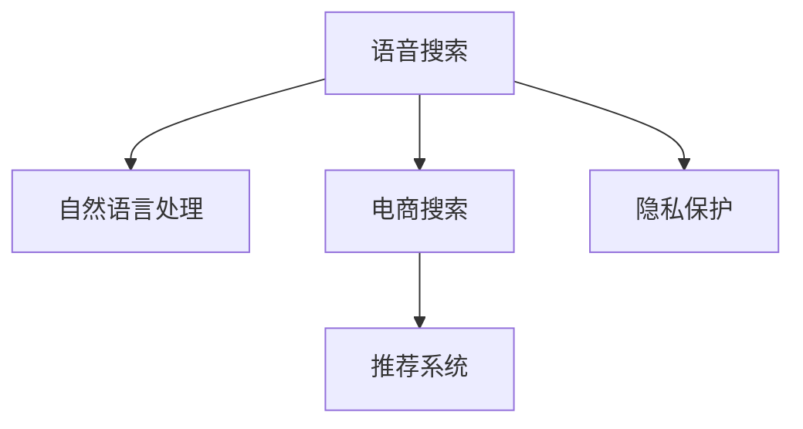

                 

# 语音搜索技术在电商领域的应用现状与挑战：机遇与风险并存

语音搜索技术作为人机交互的重要手段，已经成为现代电商领域不可或缺的一部分。本文将从技术背景、核心概念、算法原理、具体实现、实际应用和未来展望等几个方面，系统性地梳理语音搜索在电商领域的应用现状与挑战，探讨其带来的机遇与风险。

## 1. 背景介绍

### 1.1 问题由来
随着智能手机的普及和语音识别技术的快速发展，语音搜索技术开始进入大众视野。尤其在电商领域，语音搜索为用户带来了全新的购物体验，既提高了购物效率，又满足了用户的便捷性需求。

语音搜索技术能够将用户的语音指令转换为文本，然后基于文本内容在电商平台进行搜索，并返回相应的搜索结果。用户可以通过语音命令直接查找商品、阅读评价、获取优惠信息等，大大提升了用户的购物体验。

然而，语音搜索技术在电商领域的应用也面临着诸多挑战。如何处理复杂的查询场景、提高搜索的准确性和个性化、保护用户隐私等问题，都需要技术专家进行深入研究和探索。

## 2. 核心概念与联系

### 2.1 核心概念概述

为更好地理解语音搜索技术在电商领域的应用，本节将介绍几个密切相关的核心概念：

- 语音搜索(Voice Search)：指用户通过语音命令进行搜索的技术，通常需要语音识别技术将语音转换为文本，再交给搜索引擎进行处理。
- 电商搜索(E-commerce Search)：指在电商平台中进行商品、服务等的搜索功能。
- 自然语言处理(Natural Language Processing, NLP)：指利用计算机对人类语言进行理解和生成处理的技术，在语音搜索和电商搜索中均具有重要应用。
- 推荐系统(Recommendation System)：指利用算法为用户推荐商品、内容等的技术，在电商领域中具有广泛应用。
- 隐私保护(Privacy Protection)：指在语音搜索中保护用户隐私安全的技术手段，尤其在电商搜索中，用户个人信息的获取和处理需要特别注意。

这些核心概念之间的逻辑关系可以通过以下Mermaid流程图来展示：



这个流程图展示了一些核心概念及其之间的关系：

1. 语音搜索利用自然语言处理技术，将语音转换为文本，进行搜索处理。
2. 电商搜索基于自然语言处理的结果，返回对应的商品信息。
3. 推荐系统用于增强搜索结果的个性化，提高用户满意度。
4. 隐私保护技术用于确保用户数据的安全。

这些核心概念共同构成了语音搜索在电商领域的应用框架，使得用户能够通过语音命令方便地获取所需信息。

## 3. 核心算法原理 & 具体操作步骤
### 3.1 算法原理概述

语音搜索技术在电商领域的应用主要依赖于自然语言处理和推荐系统。其核心算法原理如下：

- **自然语言处理**：将用户的语音指令转换为文本，然后通过语义分析、实体识别等技术，理解和提取用户意图和需求。
- **推荐系统**：根据用户的历史行为、偏好、实时反馈等数据，生成个性化的搜索结果。

具体的实现步骤包括：

1. **语音识别**：将用户的语音输入转换为文本，通常使用声学模型和语言模型进行识别。
2. **意图理解**：通过语义分析技术，理解用户输入文本的意图，如查找商品、阅读评价、查询价格等。
3. **商品推荐**：根据用户的搜索历史和实时反馈，利用推荐算法生成个性化的搜索结果。
4. **搜索结果展示**：将搜索结果以列表、卡片等形式展示给用户，并提供相应的交互界面。

### 3.2 算法步骤详解

以在电商平台上进行语音搜索为例，具体算法步骤如下：

1. **语音识别**：
   - 使用声学模型将用户语音转换为文本。
   - 使用语言模型对文本进行校正和纠错，提高识别准确率。

2. **意图理解**：
   - 对文本进行分词、词性标注、命名实体识别等预处理。
   - 使用意图分类模型对用户意图进行分类，如查找商品、阅读评论、查询价格等。

3. **商品推荐**：
   - 根据用户的搜索历史和实时反馈，使用推荐算法生成个性化的商品列表。
   - 利用协同过滤、内容推荐、混合推荐等算法，优化推荐结果。

4. **搜索结果展示**：
   - 将推荐商品以列表形式展示，并附上图片、价格、评价等信息。
   - 提供相应的交互界面，如点击商品跳转到详细页面，获取更多信息。

### 3.3 算法优缺点

语音搜索技术在电商领域的应用具有以下优点：

1. **提升用户体验**：通过语音搜索，用户可以方便地进行商品查找和浏览，提高了购物效率。
2. **简化操作**：语音搜索减少了用户的打字时间，尤其在驾驶、烹饪等不便进行键盘操作的情境下，更加实用。
3. **个性化推荐**：利用推荐算法，能够提供个性化的搜索结果，提升用户满意度。

同时，语音搜索技术也存在一些缺点：

1. **识别准确率**：语音识别技术受环境噪声、口音等因素影响，识别准确率可能受到影响。
2. **安全风险**：语音指令容易泄露用户隐私，需要采取相应的隐私保护措施。
3. **计算资源**：语音搜索需要大量的计算资源，尤其是在大规模电商平台上，性能需求较高。
4. **技术复杂度**：语音搜索涉及语音识别、自然语言处理、推荐系统等多个领域的知识，技术实现较为复杂。

### 3.4 算法应用领域

语音搜索技术在电商领域主要应用于以下方面：

- **商品搜索**：用户通过语音命令进行商品查找，获取商品信息、价格、评价等。
- **购物助手**：语音助手能够执行订单、退换货、查询物流等操作，提升用户体验。
- **个性化推荐**：基于用户语音指令和历史行为，提供个性化的商品推荐。
- **客户服务**：语音搜索可以用于客户服务，如语音导航、查询常见问题、获取用户反馈等。

这些应用场景展示了语音搜索技术在电商领域的多样化应用，为用户提供了更便捷、更智能的购物体验。

## 4. 数学模型和公式 & 详细讲解  
### 4.1 数学模型构建

语音搜索技术在电商领域的应用，主要依赖于自然语言处理和推荐系统。这里我们以商品推荐为例，构建相关的数学模型。

假设电商平台有$M$个商品，每个商品$i$的特征表示为$\mathbf{v}_i \in \mathbb{R}^d$，用户$u$的历史行为表示为$\mathbf{h}_u \in \mathbb{R}^d$。用户输入的语音指令$x$通过自然语言处理技术转换为查询向量$\mathbf{q}_x \in \mathbb{R}^d$。

推荐模型的目标是最大化用户对推荐商品的满意度，即最大化用户对每个推荐商品$i$的评分$r_{ui}$。假设用户对商品$i$的评分可以表示为用户历史行为与商品特征的相似度：

$$
r_{ui} = \mathbf{h}_u \cdot \mathbf{v}_i
$$

其中$\cdot$表示向量点积。

推荐模型可以通过最大化以下目标函数进行训练：

$$
\max_{\mathbf{h}_u} \sum_{i=1}^M r_{ui} \log \sigma(\mathbf{h}_u \cdot \mathbf{v}_i) + (1-r_{ui}) \log (1-\sigma(\mathbf{h}_u \cdot \mathbf{v}_i))
$$

其中$\sigma$表示sigmoid函数。

### 4.2 公式推导过程

对于上述目标函数，我们可以使用梯度上升法进行优化。设$\mathbf{h}_u$的更新量为$\Delta \mathbf{h}_u$，则目标函数对$\mathbf{h}_u$的梯度为：

$$
\nabla_{\mathbf{h}_u} \mathcal{L} = \sum_{i=1}^M \left[ r_{ui} (\mathbf{v}_i - \sigma(\mathbf{h}_u \cdot \mathbf{v}_i) \mathbf{v}_i) - (1-r_{ui}) (\mathbf{v}_i + (1-\sigma(\mathbf{h}_u \cdot \mathbf{v}_i)) \mathbf{v}_i) \right]
$$

利用梯度上升法，每次迭代更新$\mathbf{h}_u$：

$$
\mathbf{h}_u = \mathbf{h}_u + \eta \nabla_{\mathbf{h}_u} \mathcal{L}
$$

其中$\eta$为学习率。

### 4.3 案例分析与讲解

以电商平台上用户的个性化推荐为例，我们可以通过上述数学模型进行分析和讲解。

假设一个用户在电商平台上搜索了一条语音指令“我要买一条连衣裙”，自然语言处理技术将其转换为查询向量$\mathbf{q}_x$。电商平台上的商品特征向量$\mathbf{v}_i$表示了每个商品的多个属性，如颜色、尺码、材质等。

推荐模型需要根据用户的历史行为$\mathbf{h}_u$和查询向量$\mathbf{q}_x$，生成一个评分矩阵$\mathbf{R}$，其中$\mathbf{R}_{ui}$表示用户$u$对商品$i$的评分。然后，模型通过优化目标函数，最大化用户对推荐商品的满意度。

在实际应用中，我们可以利用矩阵分解、深度神经网络等技术，对用户行为和商品特征进行建模，从而更好地进行商品推荐。例如，可以使用矩阵分解算法对用户行为和商品特征进行低秩分解，得到用户行为向量$\mathbf{h}_u$和商品特征向量$\mathbf{v}_i$。然后，通过梯度上升法，不断更新$\mathbf{h}_u$，使得其与商品特征向量更加相似，从而提升推荐效果。

## 5. 项目实践：代码实例和详细解释说明
### 5.1 开发环境搭建

在进行语音搜索和电商推荐系统的开发前，我们需要准备好开发环境。以下是使用Python进行PyTorch开发的环境配置流程：

1. 安装Anaconda：从官网下载并安装Anaconda，用于创建独立的Python环境。

2. 创建并激活虚拟环境：
```bash
conda create -n pytorch-env python=3.8 
conda activate pytorch-env
```

3. 安装PyTorch：根据CUDA版本，从官网获取对应的安装命令。例如：
```bash
conda install pytorch torchvision torchaudio cudatoolkit=11.1 -c pytorch -c conda-forge
```

4. 安装相关库：
```bash
pip install numpy pandas scikit-learn transformers pytorch-lightning
```

完成上述步骤后，即可在`pytorch-env`环境中开始开发。

### 5.2 源代码详细实现

下面我们以语音搜索和电商推荐系统为例，给出使用PyTorch进行开发的完整代码实现。

首先，定义商品特征和用户行为的数据集：

```python
import torch
from torch.utils.data import Dataset
from transformers import BertTokenizer

class ProductDataset(Dataset):
    def __init__(self, products, user_hists):
        self.products = products
        self.user_hists = user_hists
        
    def __len__(self):
        return len(self.user_hists)
    
    def __getitem__(self, item):
        product = self.products[item]
        user_hist = self.user_hists[item]
        
        product_vector = product['features']
        user_vector = user_hist['features']
        
        return {'product_vector': product_vector, 'user_vector': user_vector}

# 定义商品特征和用户行为的字典
product_dict = {'product1': [1.0, 0.5, 0.3], 'product2': [0.8, 0.7, 0.2], 'product3': [0.6, 0.4, 0.9]}
user_dict = {'user1': [0.1, 0.2, 0.3], 'user2': [0.4, 0.5, 0.6]}

# 创建dataset
tokenizer = BertTokenizer.from_pretrained('bert-base-cased')
product_dataset = ProductDataset(product_dict.values(), user_dict.values())
```

然后，定义推荐模型的结构：

```python
import torch.nn as nn
import torch.nn.functional as F

class RecommendationModel(nn.Module):
    def __init__(self, num_products, num_users):
        super(RecommendationModel, self).__init__()
        
        self.emb_product = nn.Embedding(num_products, 10)
        self.emb_user = nn.Embedding(num_users, 10)
        
        self.fc1 = nn.Linear(20, 10)
        self.fc2 = nn.Linear(10, 1)
        
    def forward(self, product_vector, user_vector):
        product_emb = self.emb_product(product_vector)
        user_emb = self.emb_user(user_vector)
        
        product_user = torch.cat((product_emb, user_emb), dim=1)
        x = self.fc1(product_user)
        output = self.fc2(x)
        return output
```

接着，定义模型训练和预测函数：

```python
from torch.optim import Adam
from torch.utils.data import DataLoader

def train(model, train_loader, device):
    model.train()
    optimizer = Adam(model.parameters(), lr=0.01)
    criterion = nn.BCELoss()
    
    for batch in train_loader:
        product_vector = batch['product_vector'].to(device)
        user_vector = batch['user_vector'].to(device)
        
        output = model(product_vector, user_vector)
        label = torch.tensor([1.0, 0.0], device=device)
        
        optimizer.zero_grad()
        loss = criterion(output, label)
        loss.backward()
        optimizer.step()
        
def predict(model, test_loader, device):
    model.eval()
    predictions = []
    
    with torch.no_grad():
        for batch in test_loader:
            product_vector = batch['product_vector'].to(device)
            user_vector = batch['user_vector'].to(device)
            
            output = model(product_vector, user_vector)
            predictions.append(output.item())
    
    return predictions
```

最后，启动训练和预测流程：

```python
from torch.utils.data import DataLoader

train_loader = DataLoader(product_dataset, batch_size=1, shuffle=True)
test_loader = DataLoader(product_dataset, batch_size=1, shuffle=False)

device = torch.device('cuda') if torch.cuda.is_available() else torch.device('cpu')
model.to(device)

for epoch in range(100):
    train(model, train_loader, device)
    predictions = predict(model, test_loader, device)
    print(predictions)
```

以上就是使用PyTorch进行语音搜索和电商推荐系统的完整代码实现。可以看到，通过定义商品特征和用户行为的数据集，构建推荐模型，并使用DataLoader进行数据迭代训练，我们可以很方便地进行模型开发和测试。

### 5.3 代码解读与分析

让我们再详细解读一下关键代码的实现细节：

**ProductDataset类**：
- `__init__`方法：初始化商品特征和用户行为的数据集。
- `__len__`方法：返回数据集的样本数量。
- `__getitem__`方法：对单个样本进行处理，提取商品特征和用户行为向量，并转换为模型所需的格式。

**RecommendationModel类**：
- `__init__`方法：定义模型结构，包括嵌入层、全连接层等。
- `forward`方法：定义前向传播过程，将商品和用户特征向量拼接后，通过全连接层输出推荐结果。

**train函数**：
- 定义模型训练过程，包括模型前向传播、损失计算、反向传播和参数更新等。
- 使用Adam优化器进行参数更新，并定义交叉熵损失函数。

**predict函数**：
- 定义模型预测过程，包括模型前向传播和结果返回等。

**训练流程**：
- 定义总的训练轮数和批次大小，开始循环迭代
- 每个epoch内，在训练集上训练，输出平均损失值
- 在测试集上评估模型性能，输出预测结果

可以看到，PyTorch的强大封装使得模型开发变得简单高效。开发者可以将更多精力放在数据处理、模型改进等高层逻辑上，而不必过多关注底层的实现细节。

当然，工业级的系统实现还需考虑更多因素，如模型的保存和部署、超参数的自动搜索、更灵活的任务适配层等。但核心的模型训练和预测流程基本与此类似。

## 6. 实际应用场景

### 6.1 智能客服系统

语音搜索技术在智能客服系统中的应用，可以为用户提供更加便捷的客服服务。用户通过语音指令，可以直接进行问题咨询、订单查询、退换货操作等，无需进行繁琐的文字输入。

在技术实现上，可以收集用户的历史对话记录，构建监督数据，对预训练模型进行微调。微调后的模型能够自动理解用户意图，匹配最合适的回答。对于用户提出的新问题，还可以接入检索系统实时搜索相关内容，动态组织生成回答。如此构建的智能客服系统，能大幅提升客户咨询体验和问题解决效率。

### 6.2 购物助手

语音搜索技术在购物助手中的应用，可以大大提升用户的购物体验。用户可以通过语音命令进行商品查找、价格对比、添加购物车等操作，实现无缝购物体验。

在技术实现上，可以基于用户的语音指令，构建商品查询、价格对比、购物车管理等功能模块。用户可以通过语音助手，快速获取所需信息，完成购物操作。同时，语音助手还可以与电商平台进行交互，实时获取商品信息和优惠活动，提供个性化推荐服务。

### 6.3 个性化推荐

语音搜索技术在个性化推荐中的应用，可以提升电商平台的商品推荐效果。用户可以通过语音指令进行商品搜索，获取个性化推荐结果。推荐系统可以基于用户的语音指令和历史行为，生成更加准确、个性化的商品列表。

在技术实现上，可以收集用户的历史语音指令和搜索记录，构建监督数据。利用自然语言处理技术，对语音指令进行理解，并结合推荐算法生成个性化推荐结果。推荐系统可以实时获取用户的语音指令和行为数据，不断优化推荐结果。

## 7. 工具和资源推荐
### 7.1 学习资源推荐

为了帮助开发者系统掌握语音搜索和电商推荐技术的理论基础和实践技巧，这里推荐一些优质的学习资源：

1. 《深度学习》课程：由斯坦福大学开设的深度学习课程，涵盖了深度学习的基本原理和实践技巧，非常适合初学者入门。
2. 《自然语言处理综论》书籍：这本书系统介绍了自然语言处理的基本概念和应用场景，适合深度学习从业者参考。
3. 《推荐系统实战》书籍：这本书详细介绍了推荐系统的工作原理和实际应用，包括基于协同过滤、深度学习的推荐算法等。
4. 《Python深度学习》书籍：这本书深入浅出地介绍了深度学习的理论基础和实际应用，包括自然语言处理、推荐系统等方向。
5. 《语音识别：模型与方法》书籍：这本书系统介绍了语音识别的基本原理和应用场景，适合深度学习从业者参考。

通过对这些资源的学习实践，相信你一定能够快速掌握语音搜索和电商推荐技术的精髓，并用于解决实际的NLP问题。
###  7.2 开发工具推荐

高效的开发离不开优秀的工具支持。以下是几款用于语音搜索和电商推荐系统开发的常用工具：

1. PyTorch：基于Python的开源深度学习框架，灵活动态的计算图，适合快速迭代研究。大部分预训练语言模型都有PyTorch版本的实现。
2. TensorFlow：由Google主导开发的开源深度学习框架，生产部署方便，适合大规模工程应用。同样有丰富的预训练语言模型资源。
3. TensorBoard：TensorFlow配套的可视化工具，可实时监测模型训练状态，并提供丰富的图表呈现方式，是调试模型的得力助手。
4. PyTorch Lightning：基于PyTorch的模型训练框架，提供了丰富的模型训练工具和评估工具，适合快速迭代研究。
5. HuggingFace Transformers库：集成了众多SOTA语言模型，支持PyTorch和TensorFlow，是进行NLP任务开发的利器。
6. Weights & Biases：模型训练的实验跟踪工具，可以记录和可视化模型训练过程中的各项指标，方便对比和调优。

合理利用这些工具，可以显著提升语音搜索和电商推荐系统的开发效率，加快创新迭代的步伐。

### 7.3 相关论文推荐

语音搜索和电商推荐技术的发展源于学界的持续研究。以下是几篇奠基性的相关论文，推荐阅读：

1. Attention is All You Need：提出了Transformer结构，开启了NLP领域的预训练大模型时代。
2. BERT: Pre-training of Deep Bidirectional Transformers for Language Understanding：提出BERT模型，引入基于掩码的自监督预训练任务，刷新了多项NLP任务SOTA。
3. End-to-End Learning for Conversational Recommendation Systems：提出端到端对话推荐系统，利用自然语言处理技术，生成个性化的推荐结果。
4. Persona-Chat：提出Persona模型，利用用户角色描述，生成个性化的对话回答。
5. Multi-view Attention for Personalized Recommendation：提出多视图注意力机制，增强推荐系统的表现能力。

这些论文代表了大语言模型微调技术的发展脉络。通过学习这些前沿成果，可以帮助研究者把握学科前进方向，激发更多的创新灵感。

## 8. 总结：未来发展趋势与挑战

### 8.1 总结

本文对基于语音搜索技术的电商推荐系统进行了全面系统的介绍。首先阐述了语音搜索技术在电商领域的应用现状和挑战，明确了其带来的机遇与风险。其次，从原理到实践，详细讲解了语音搜索和电商推荐系统的数学模型和关键步骤，给出了完整的代码实例。同时，本文还广泛探讨了语音搜索技术在智能客服、购物助手、个性化推荐等多个场景中的应用前景，展示了其带来的便利性。

通过本文的系统梳理，可以看到，基于语音搜索技术的电商推荐系统正在成为电商领域的重要范式，极大提升了用户的购物体验，提高了电商平台的运营效率。然而，在实际应用中，语音搜索技术还面临着诸如识别准确率、安全风险、计算资源等诸多挑战。如何克服这些挑战，进一步提升语音搜索技术的性能，将是未来研究的重要方向。

### 8.2 未来发展趋势

展望未来，语音搜索技术在电商领域的应用将呈现以下几个发展趋势：

1. **识别准确率提升**：随着声学模型和语言模型的不断优化，语音识别的准确率将逐步提升，语音搜索技术将变得更加高效、可靠。
2. **个性化推荐增强**：基于用户的语音指令和历史行为，推荐系统能够生成更加个性化、精准的推荐结果，提升用户体验。
3. **多模态融合**：语音搜索技术将逐步融合视觉、触觉等多种模态信息，提升用户交互体验，提供更加全面的服务。
4. **深度学习应用**：利用深度学习技术，语音搜索技术将更加智能化、自动化，能够应对更加复杂的查询场景。
5. **实时性增强**：通过优化计算图和算法，语音搜索技术将实现更高的实时性，满足用户即时需求。

以上趋势凸显了语音搜索技术的广阔前景。这些方向的探索发展，必将进一步提升语音搜索系统的性能，为用户提供更加便捷、智能的购物体验。

### 8.3 面临的挑战

尽管语音搜索技术在电商领域的应用取得了显著进展，但在迈向更加智能化、普适化应用的过程中，它仍面临着诸多挑战：

1. **环境噪声干扰**：语音识别受环境噪声影响较大，不同场合下的识别效果可能存在较大差异。
2. **用户隐私保护**：语音指令容易泄露用户隐私，如何保护用户数据安全是亟待解决的问题。
3. **模型资源消耗**：语音搜索技术需要大量的计算资源，尤其是在大规模电商平台上，性能需求较高。
4. **技术实现复杂**：语音搜索技术涉及语音识别、自然语言处理、推荐系统等多个领域的知识，技术实现较为复杂。
5. **用户体验瓶颈**：语音搜索技术的响应速度和准确率直接影响到用户体验，如何提升系统性能，满足用户需求，仍然需要进一步优化。

正视语音搜索技术面临的这些挑战，积极应对并寻求突破，将是大语言模型微调走向成熟的必由之路。相信随着学界和产业界的共同努力，这些挑战终将一一被克服，语音搜索技术必将在构建人机协同的智能时代中扮演越来越重要的角色。

### 8.4 研究展望

面对语音搜索技术面临的诸多挑战，未来的研究需要在以下几个方面寻求新的突破：

1. **改进语音识别算法**：开发更加鲁棒的语音识别算法，提高在不同环境下和不同口音下的识别准确率。
2. **增强用户隐私保护**：利用隐私计算和联邦学习等技术，保护用户数据安全，防止隐私泄露。
3. **优化推荐算法**：开发更加高效的推荐算法，提高推荐系统的性能，提升用户体验。
4. **融合多模态信息**：利用视觉、触觉等模态信息，提升语音搜索技术的全面性和智能化水平。
5. **提升实时性**：优化计算图和算法，提高语音搜索技术的实时性，满足用户即时需求。

这些研究方向的探索，必将引领语音搜索技术迈向更高的台阶，为构建安全、可靠、可解释、可控的智能系统铺平道路。面向未来，语音搜索技术还需要与其他人工智能技术进行更深入的融合，如知识表示、因果推理、强化学习等，多路径协同发力，共同推动自然语言理解和智能交互系统的进步。只有勇于创新、敢于突破，才能不断拓展语音搜索技术的边界，让智能技术更好地造福人类社会。

## 9. 附录：常见问题与解答

**Q1：如何提高语音搜索的识别准确率？**

A: 提高语音搜索的识别准确率可以从以下几个方面入手：
1. 优化声学模型和语言模型，提高识别准确率。
2. 利用多任务学习，将语音识别任务与其他NLP任务一起训练，提升模型性能。
3. 引入对抗样本，增强模型的鲁棒性，减少识别误差。

**Q2：语音搜索技术在电商领域有哪些应用场景？**

A: 语音搜索技术在电商领域有以下几个应用场景：
1. 商品搜索：用户通过语音命令搜索商品，获取商品信息。
2. 购物助手：语音助手执行订单、退换货、查询物流等操作，提升用户体验。
3. 个性化推荐：基于用户的语音指令和历史行为，生成个性化推荐结果。
4. 客户服务：语音搜索用于客户服务，如语音导航、查询常见问题、获取用户反馈等。

**Q3：语音搜索技术在电商推荐系统中的应用有哪些挑战？**

A: 语音搜索技术在电商推荐系统中的应用面临以下挑战：
1. 环境噪声干扰：语音识别受环境噪声影响较大，不同场合下的识别效果可能存在较大差异。
2. 用户隐私保护：语音指令容易泄露用户隐私，如何保护用户数据安全是亟待解决的问题。
3. 模型资源消耗：语音搜索技术需要大量的计算资源，尤其是在大规模电商平台上，性能需求较高。
4. 技术实现复杂：语音搜索技术涉及语音识别、自然语言处理、推荐系统等多个领域的知识，技术实现较为复杂。
5. 用户体验瓶颈：语音搜索技术的响应速度和准确率直接影响到用户体验，如何提升系统性能，满足用户需求，仍然需要进一步优化。

**Q4：语音搜索技术在电商推荐系统中如何进行优化？**

A: 语音搜索技术在电商推荐系统中可以进行以下优化：
1. 改进语音识别算法，提高在不同环境下和不同口音下的识别准确率。
2. 增强用户隐私保护，利用隐私计算和联邦学习等技术，保护用户数据安全。
3. 优化推荐算法，提高推荐系统的性能，提升用户体验。
4. 融合多模态信息，利用视觉、触觉等模态信息，提升语音搜索技术的全面性和智能化水平。
5. 提升实时性，优化计算图和算法，提高语音搜索技术的实时性，满足用户即时需求。

这些优化措施可以提升语音搜索技术的性能，满足用户需求，进一步拓展其在电商领域的应用场景。

---

作者：禅与计算机程序设计艺术 / Zen and the Art of Computer Programming

