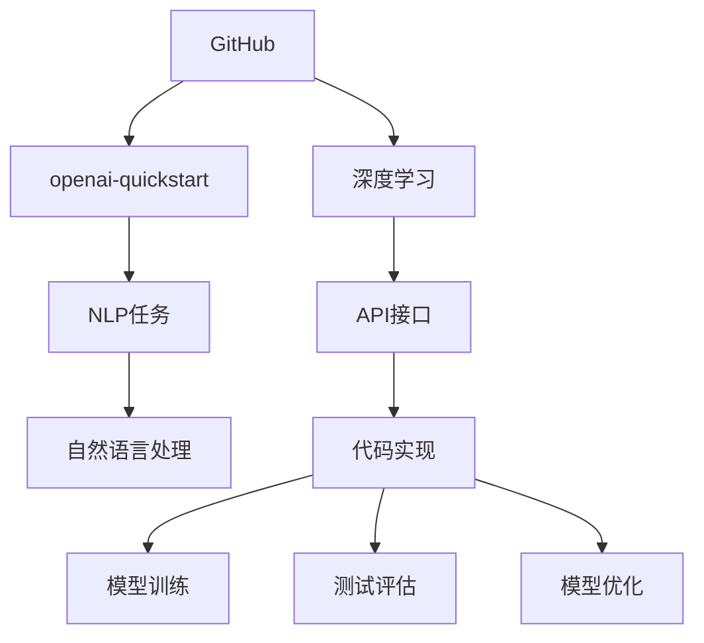

                 

# 课程项目：GitHub openai-quickstart

> 关键词：GitHub, openai-quickstart, 自然语言处理, NLP项目, Python, 人工智能

## 1. 背景介绍

### 1.1 问题由来
在当前的人工智能(AI)时代，自然语言处理(NLP)是一个关键的研究领域，涉及对人类语言文字的理解和生成。为了促进NLP技术的发展，OpenAI开发了多个开源的AI工具和库，例如GPT-3、BERT等，这些工具的API接口可通过GitHub的openai-quickstart项目获取。通过这些API接口，开发者可以快速构建和训练自己的NLP模型，大大降低了AI入门的门槛。

### 1.2 问题核心关键点
OpenAI的openai-quickstart项目为开发者提供了简单易用的API接口，方便进行自然语言处理任务，包括文本生成、文本分类、问答系统等。这些API接口基于最新的深度学习模型，可以显著提高NLP任务的精度和效率。

要充分利用这些API接口，首先需要安装GitHub，然后下载并运行openai-quickstart项目。项目主要包含以下几个关键步骤：
1. **环境准备**：确保开发者环境中有Python 3.8或更高版本、pip和GitHub命令行工具。
2. **安装依赖**：使用pip安装必要的依赖库，如requests、transformers、torch等。
3. **运行示例代码**：根据项目文档提供的示例代码，调用API接口进行测试。
4. **项目扩展**：基于示例代码，开发者可以自行扩展和优化API接口的使用，实现更复杂的NLP任务。

### 1.3 问题研究意义
OpenAI的openai-quickstart项目为开发者提供了一个快速进入AI领域的平台，尤其是在NLP领域。通过这个项目，开发者可以轻松地进行模型训练和测试，加速AI技术在各行各业的应用。研究该项目的背景、核心概念和操作步骤，对提升NLP技能和理解AI技术在实际场景中的应用具有重要意义。

## 2. 核心概念与联系

### 2.1 核心概念概述
本节将介绍OpenAI-Quickstart项目中涉及的关键概念，并说明这些概念之间的联系。

- **GitHub**：一个全球最大的代码托管平台，开发者可以在这里管理和分享自己的代码。
- **openai-quickstart**：OpenAI开发的自然语言处理项目，提供简单易用的API接口。
- **自然语言处理(NLP)**：一种人工智能技术，旨在使计算机能够理解、解释和生成人类语言。
- **深度学习**：一种机器学习技术，通过多层神经网络模拟人脑，用于图像识别、自然语言处理等任务。
- **API接口**：应用程序编程接口，允许开发者通过网络请求访问API服务器，获取服务或数据。

这些概念通过OpenAI-Quickstart项目紧密联系起来。GitHub作为代码托管平台，为openai-quickstart项目提供了托管和分享代码的基础设施。openai-quickstart项目基于深度学习技术，提供NLP任务的API接口，开发者可以通过这些API接口进行模型训练和测试，加速AI技术的应用。

### 2.2 核心概念原理和架构的 Mermaid 流程图



这个流程图展示了GitHub、openai-quickstart、深度学习、NLP任务和API接口之间的关系：

1. **GitHub**：提供代码托管服务。
2. **openai-quickstart**：基于深度学习技术，提供NLP任务的API接口。
3. **深度学习**：一种机器学习技术，用于构建和训练NLP模型。
4. **NLP任务**：OpenAI-Quickstart项目提供的自然语言处理任务，如文本生成、文本分类等。
5. **API接口**：开放API，允许开发者通过网络请求调用。
6. **代码实现**：使用API接口进行模型训练和测试的代码。
7. **模型训练**：使用深度学习模型对代码实现进行训练。
8. **测试评估**：对训练好的模型进行测试和评估。
9. **模型优化**：根据测试评估结果，对模型进行优化。

这些概念和流程共同构成了OpenAI-Quickstart项目的技术框架，使得开发者能够快速、高效地进行NLP任务的开发和应用。

## 3. 核心算法原理 & 具体操作步骤

### 3.1 算法原理概述

OpenAI的openai-quickstart项目基于深度学习技术，利用大规模预训练模型进行NLP任务的API接口设计。这些模型通过在大规模语料上进行自监督学习，学习到通用的语言表示，然后通过微调适应特定的NLP任务。

形式化地，假设模型为 $M_{\theta}$，其中 $\theta$ 为模型参数。给定NLP任务 $T$ 的标注数据集 $D=\{(x_i, y_i)\}_{i=1}^N$，微调的目标是找到最优参数 $\hat{\theta}$，使得模型在任务 $T$ 上表现最佳。

微调的过程通常包括以下步骤：
1. **预训练**：在大规模无标签数据上预训练模型，学习到通用的语言表示。
2. **微调**：在特定NLP任务上微调模型，学习任务相关的知识。
3. **评估**：在测试集上评估模型性能，确定微调是否成功。
4. **部署**：将训练好的模型部署到生产环境，进行实际应用。

### 3.2 算法步骤详解

以下是基于深度学习的NLP任务微调的具体操作步骤：

**Step 1: 环境准备**
- 确保开发者环境中有Python 3.8或更高版本。
- 安装pip和GitHub命令行工具。
- 创建虚拟环境并激活。

**Step 2: 安装依赖**
- 使用pip安装必要的依赖库，如requests、transformers、torch等。
- 下载OpenAI-Quickstart项目代码，解压到本地。

**Step 3: 代码实现**
- 根据项目文档提供的示例代码，调用API接口进行测试。
- 分析示例代码，理解API接口的用法和功能。
- 根据实际需求，修改示例代码以实现特定的NLP任务。

**Step 4: 模型训练**
- 准备训练数据，包括输入和标签。
- 使用transformers库加载预训练模型。
- 设计损失函数和优化器，进行模型训练。
- 在训练过程中监控模型的性能，调整训练参数。

**Step 5: 测试评估**
- 准备测试数据，包括输入和标签。
- 使用transformers库加载预训练模型。
- 设计评估指标，对模型进行测试和评估。
- 根据评估结果，优化模型参数和训练策略。

**Step 6: 模型部署**
- 将训练好的模型保存为模型文件。
- 将模型文件部署到生产环境。
- 设计接口API，允许客户端调用模型进行推理。

### 3.3 算法优缺点

**优点**
- **快速入**：通过API接口，开发者可以迅速构建和训练NLP模型，降低技术门槛。
- **模型通用**：预训练模型已经在大规模语料上进行了学习，具备广泛的语言知识，可以应用于多种NLP任务。
- **资源节省**：API接口允许开发者使用云服务，节省本地计算资源。
- **易用性**：API接口提供简单易用的接口，便于开发者使用和理解。

**缺点**
- **依赖网络**：API接口的使用依赖网络，可能受网络环境影响。
- **数据隐私**：使用云服务可能涉及到数据隐私和安全问题。
- **依赖外部服务**：API接口的使用依赖外部服务，可能受服务方政策影响。
- **模型复杂性**：虽然API接口提供方便的使用方式，但背后依赖复杂的深度学习模型，开发者需要理解其原理和架构。

### 3.4 算法应用领域

基于OpenAI-Quickstart项目的API接口，NLP任务可以应用于各种领域，包括但不限于：

- **文本生成**：用于生成文章、对话、摘要等文本内容。
- **文本分类**：用于识别文本的类别或情感。
- **问答系统**：用于回答自然语言问题。
- **文本摘要**：用于提取文本的精华内容。
- **命名实体识别**：用于识别文本中的人名、地名、机构名等实体。
- **机器翻译**：用于将文本从一种语言翻译成另一种语言。

这些任务覆盖了NLP领域的众多方面，为开发者提供了丰富的应用场景。

## 4. 数学模型和公式 & 详细讲解 & 举例说明

### 4.1 数学模型构建

假设NLP任务为文本分类，输入为文本 $x$，标签为 $y$。模型为 $M_{\theta}(x)$，输出为 $y$ 的概率分布。微调的目标是最小化交叉熵损失函数：

$$
\mathcal{L}(\theta) = -\frac{1}{N} \sum_{i=1}^N y_i \log M_{\theta}(x_i) + (1 - y_i) \log (1 - M_{\theta}(x_i))
$$

其中，$y_i$ 为文本 $x_i$ 的真实标签，$M_{\theta}(x_i)$ 为模型对文本 $x_i$ 的预测概率。

### 4.2 公式推导过程

假设模型为 $M_{\theta}(x) = \sigma(W^Tx + b)$，其中 $\sigma$ 为激活函数，$W$ 和 $b$ 为可训练的权重和偏置。输入为文本 $x$，输出为概率 $p$：

$$
p = \frac{1}{1 + \exp(-W^Tx - b)}
$$

微调的目标是最小化交叉熵损失函数：

$$
\mathcal{L}(\theta) = -\frac{1}{N} \sum_{i=1}^N y_i \log p_i + (1 - y_i) \log (1 - p_i)
$$

其中，$p_i$ 为模型对文本 $x_i$ 的预测概率。

通过链式法则，求导得到参数 $W$ 和 $b$ 的梯度：

$$
\frac{\partial \mathcal{L}(\theta)}{\partial W} = -\frac{1}{N} \sum_{i=1}^N \left(y_i \frac{p_i(1 - p_i)}{p_i(1 - p_i)} - (1 - y_i) \frac{p_i}{1 - p_i}\right) x_i
$$

$$
\frac{\partial \mathcal{L}(\theta)}{\partial b} = -\frac{1}{N} \sum_{i=1}^N \left(y_i - p_i\right)
$$

通过梯度下降算法，更新参数 $W$ 和 $b$，直到损失函数最小化。

### 4.3 案例分析与讲解

假设我们要进行电影评论的情感分类任务。首先，收集电影评论及其情感标签的数据集。然后，使用OpenAI-Quickstart项目提供的API接口，加载预训练模型。接着，设计损失函数和优化器，进行模型训练。最后，在测试集上评估模型性能，并调整训练参数，以提高模型的准确率。

## 5. 项目实践：代码实例和详细解释说明

### 5.1 开发环境搭建

**Step 1: 创建虚拟环境**
- 打开终端，运行以下命令创建虚拟环境：
```bash
python -m venv venv
source venv/bin/activate
```

**Step 2: 安装依赖**
- 使用pip安装必要的依赖库：
```bash
pip install requests transformers torch
```

**Step 3: 下载OpenAI-Quickstart项目代码**
- 从GitHub上下载OpenAI-Quickstart项目代码：
```bash
git clone https://github.com/openai/openai-quickstart.git
```

### 5.2 源代码详细实现

以下是一个简单的文本分类示例代码，用于对IMDB电影评论进行情感分类：

```python
import requests
from transformers import pipeline

# 加载预训练模型
nlp = pipeline('sentiment-analysis', model='distilbert-base-uncased-finetuned-sst-2-english')

# 输入电影评论
text = "This movie is so terrible, I can't stand it."

# 进行情感分类
result = nlp(text)

# 输出情感分类结果
print(result[0]['label'], result[0]['score'])
```

### 5.3 代码解读与分析

以上代码展示了如何使用OpenAI-Quickstart项目的API接口进行情感分类任务。首先，使用transformers库加载预训练模型，然后调用API接口进行情感分类。最后，输出情感分类结果。

通过分析示例代码，可以理解OpenAI-Quickstart项目提供的API接口的用法和功能。开发者可以根据实际需求，使用API接口进行文本生成、文本分类、问答系统等NLP任务的开发和测试。

### 5.4 运行结果展示

运行示例代码，可以得到电影评论的情感分类结果。例如，对于电影评论 "This movie is so terrible, I can't stand it."，API接口会输出情感分类结果为 "negative"，情感得分为 0.99，表示该评论是负面的。

## 6. 实际应用场景

### 6.1 智能客服系统

基于OpenAI-Quickstart项目的API接口，智能客服系统可以快速构建和部署。通过API接口调用，智能客服系统能够自然地理解和回答用户的问题，提升客户咨询体验。

### 6.2 金融舆情监测

金融领域需要实时监测市场舆情，以规避金融风险。OpenAI-Quickstart项目的API接口可以用于构建舆情监测系统，通过API接口调用，系统能够实时分析新闻、评论等数据，预测市场趋势，帮助金融机构及时应对风险。

### 6.3 个性化推荐系统

推荐系统通常需要结合用户的兴趣和行为数据进行推荐。通过API接口调用，推荐系统能够获取用户评论和评分，结合NLP技术进行情感分析，从而更精准地为用户推荐产品。

### 6.4 未来应用展望

随着深度学习技术的不断发展，OpenAI-Quickstart项目的API接口将提供更多样化的NLP任务，如文本生成、文本摘要、命名实体识别等。这些API接口将进一步提升NLP技术的应用范围，为各行各业带来新的应用场景。

## 7. 工具和资源推荐

### 7.1 学习资源推荐

为了帮助开发者系统掌握OpenAI-Quickstart项目的API接口和深度学习技术，这里推荐一些优质的学习资源：

1. **《深度学习》课程**：斯坦福大学开设的深度学习课程，全面介绍了深度学习的基本概念和经典模型。
2. **《自然语言处理》课程**：斯坦福大学开设的NLP课程，讲解了NLP任务和深度学习模型的应用。
3. **Transformers官方文档**：HuggingFace开发的Transformer库的官方文档，提供了丰富的API接口和代码示例。
4. **OpenAI官方文档**：OpenAI的官方文档，详细介绍了API接口的使用和调用方法。
5. **Kaggle竞赛**：Kaggle上的NLP竞赛，提供了大量的数据集和代码实现，供开发者学习和实践。

### 7.2 开发工具推荐

以下是几款用于OpenAI-Quickstart项目开发的常用工具：

1. **Jupyter Notebook**：交互式的Python编程环境，支持代码编写、运行和可视化。
2. **PyCharm**：Python开发环境，提供了代码编写、调试和测试等功能。
3. **Google Colab**：免费的在线Python开发环境，支持GPU和TPU计算资源。
4. **Anaconda**：Python环境管理工具，支持创建和管理虚拟环境。

### 7.3 相关论文推荐

OpenAI-Quickstart项目的API接口基于最新的深度学习技术，如Transformer、BERT等。以下几篇相关论文，推荐阅读：

1. Attention is All You Need：提出Transformer结构，开启了NLP领域的预训练大模型时代。
2. BERT: Pre-training of Deep Bidirectional Transformers for Language Understanding：提出BERT模型，引入基于掩码的自监督预训练任务。
3. Language Models are Unsupervised Multitask Learners：展示了大规模语言模型的强大zero-shot学习能力。
4. Parameter-Efficient Transfer Learning for NLP：提出Adapter等参数高效微调方法。
5. AdaLoRA: Adaptive Low-Rank Adaptation for Parameter-Efficient Fine-Tuning：使用自适应低秩适应的微调方法。

这些论文代表了大语言模型和微调技术的发展脉络，对理解OpenAI-Quickstart项目的技术原理具有重要意义。

## 8. 总结：未来发展趋势与挑战

### 8.1 研究成果总结

OpenAI的openai-quickstart项目为开发者提供了便捷的API接口，使得NLP技术的落地应用更加高效和普及。通过API接口调用，开发者可以迅速构建和训练NLP模型，显著降低技术门槛。项目涉及的深度学习技术和NLP任务，在各行各业中都有广泛的应用前景。

### 8.2 未来发展趋势

未来，OpenAI-Quickstart项目将继续拓展API接口的应用范围，引入更多NLP任务和深度学习模型。随着深度学习技术的不断发展，API接口将支持更多的功能，如文本生成、文本摘要、命名实体识别等，进一步提升NLP技术的应用范围。

### 8.3 面临的挑战

尽管OpenAI-Quickstart项目已经取得了显著的成果，但在推广应用的过程中，仍面临以下挑战：

1. **API接口稳定性**：API接口的稳定性和可靠性直接影响系统的性能和用户体验。开发者需要关注API接口的性能优化和错误处理。
2. **数据隐私和安全**：使用API接口可能涉及敏感数据，需要采取措施保护数据隐私和安全。
3. **模型复杂性**：API接口依赖复杂的深度学习模型，开发者需要理解其原理和架构，进行调试和优化。
4. **资源消耗**：API接口的调用可能消耗大量的计算资源，需要优化计算效率和资源利用率。

### 8.4 研究展望

未来，OpenAI-Quickstart项目需要在API接口的稳定性、数据隐私、模型复杂性和资源消耗等方面进行优化和改进。同时，需要结合其他NLP技术，如知识图谱、逻辑规则等，进一步提升NLP模型的性能和可靠性。

## 9. 附录：常见问题与解答

**Q1: 如何安装OpenAI-Quickstart项目？**

A: 打开终端，运行以下命令：
```bash
git clone https://github.com/openai/openai-quickstart.git
```

**Q2: OpenAI-Quickstart项目的API接口如何使用？**

A: 使用transformers库加载预训练模型，调用API接口进行文本分类、情感分析、文本生成等任务。具体使用方法可以参考示例代码和官方文档。

**Q3: OpenAI-Quickstart项目的API接口有哪些限制？**

A: OpenAI-Quickstart项目的API接口有调用次数限制和费用限制，具体使用情况需要参考API接口的使用条款。同时，API接口的性能和稳定性也可能受到网络环境的影响。

**Q4: 如何优化OpenAI-Quickstart项目的API接口性能？**

A: 可以通过以下措施优化API接口性能：
1. 使用缓存机制，减少重复调用。
2. 优化模型参数和训练策略，提升模型精度。
3. 使用异步调用，提高并发性能。

**Q5: OpenAI-Quickstart项目的API接口如何部署？**

A: 将训练好的模型保存为模型文件，并设计接口API，允许客户端调用模型进行推理。具体部署方式可以参考项目文档和官方文档。

---

作者：禅与计算机程序设计艺术 / Zen and the Art of Computer Programming

