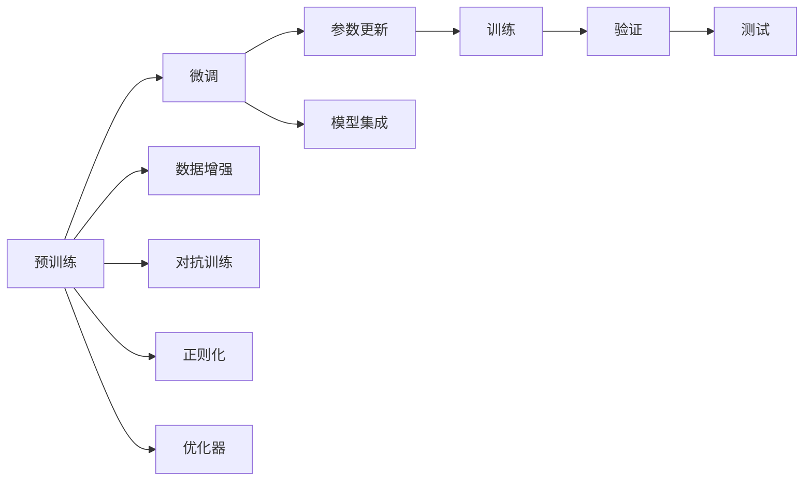

                 

# 谷歌大模型的笑话与数据问题

## 1. 背景介绍

谷歌大模型（Google's Large Model）是当前自然语言处理（NLP）领域最为强劲的技术力量之一。其背后采用深度学习（Deep Learning）和Transformer网络架构，通过海量数据进行预训练，具备强大的语言理解和生成能力。然而，尽管谷歌大模型在各种任务上取得了显著的成果，但也不可避免地面临着一些笑话与数据问题。这些问题既包括技术上的挑战，也有伦理、公平性和透明度上的考量。本文将深入探讨这些问题，并提供相应的解决方案。

## 2. 核心概念与联系

### 2.1 核心概念概述

谷歌大模型基于Transformer架构，通过自监督学习（Self-Supervised Learning）的方式在大量无标签数据上预训练，从而学习到语言的通用表示。常用的预训练任务包括语言建模、掩码语言模型（Masked Language Modeling, MLM）和下一句预测（Next Sentence Prediction, NSP）等。这些预训练任务使得模型能够学习到单词、短语、句子以及段落的上下文关联，从而具备了广泛的语言理解和生成能力。

微调（Fine-Tuning）则是在预训练的基础上，使用下游任务的标注数据，对模型进行有监督学习，以提升其在特定任务上的性能。微调过程通常采用较小的学习率，以避免破坏预训练的权重。此外，为了提高模型的泛化能力，微调过程中常使用正则化技术，如L2正则、Dropout等，并设置早期停止（Early Stopping）来避免过拟合。

### 2.2 核心概念原理和架构的 Mermaid 流程图



## 3. 核心算法原理 & 具体操作步骤

### 3.1 算法原理概述

谷歌大模型的核心算法原理主要基于Transformer网络，该网络采用自注意力机制，通过多头自注意力（Multi-Head Self-Attention）和位置编码（Positional Encoding）等方式，实现了对输入序列的灵活编码和建模。

谷歌大模型通常采用大规模无标签数据进行预训练，学习到语言的通用表示。在微调阶段，通过有监督学习，调整模型参数以适应特定任务的需求。

### 3.2 算法步骤详解

1. **数据准备**：收集预训练数据和下游任务的标注数据。预训练数据通常为大规模无标签文本数据，下游任务数据应与预训练数据的分布相匹配。

2. **模型初始化**：选择适当的预训练模型作为初始化参数。谷歌大模型如BERT、GPT等均有预训练模型可供参考。

3. **微调模型**：根据任务类型，设计合适的输出层和损失函数。常见的输出层包括线性分类器和解码器，损失函数包括交叉熵损失和负对数似然损失等。

4. **训练与验证**：使用训练集进行模型训练，并在验证集上评估模型性能。根据验证集的表现调整模型参数，直到模型收敛。

5. **测试与部署**：在测试集上评估微调后的模型性能，并将模型部署到实际应用中。

### 3.3 算法优缺点

**优点**：
- **高效性**：预训练模型能够从大规模无标签数据中学习到丰富的语言知识，通过微调，可以显著提升模型在特定任务上的性能。
- **泛化能力**：预训练模型具有较强的泛化能力，能够在新领域和新任务上表现出色。
- **可解释性**：相比于深度学习模型，预训练模型可以通过微调，逐步理解和解释其在特定任务上的工作机制。

**缺点**：
- **数据依赖**：微调效果很大程度上取决于标注数据的质量和数量，获取高质量标注数据的成本较高。
- **鲁棒性不足**：预训练模型在特定领域或新数据上的泛化性能可能不足，模型可能出现过拟合或灾难性遗忘的情况。
- **模型复杂性**：大规模模型的参数量庞大，训练和推理成本高，且需要高性能计算资源。

### 3.4 算法应用领域

谷歌大模型在NLP领域的各个任务中均有应用，包括但不限于文本分类、情感分析、机器翻译、问答系统、文本生成等。在医疗、金融、教育等垂直领域，谷歌大模型也展现出其强大的应用潜力。

## 4. 数学模型和公式 & 详细讲解 & 举例说明

### 4.1 数学模型构建

以BERT为例，其数学模型构建主要包括以下几个步骤：
1. 输入表示：将输入文本转化为词向量表示。
2. 自注意力机制：通过多头自注意力机制，计算输入序列中的每个位置与其他位置的注意力权重。
3. 位置编码：通过位置编码，考虑输入序列中不同位置的信息。
4. 前向神经网络：通过前向神经网络对输入进行非线性变换。
5. 输出层：通过输出层计算最终预测结果。

### 4.2 公式推导过程

以BERT中的掩码语言模型（MLM）为例，公式推导如下：
设输入序列为 $\{x_1, x_2, \dots, x_n\}$，其中 $x_i$ 表示第 $i$ 个单词。模型通过掩码语言模型预测 $x_i$ 的掩码位置，即在未掩码的单词中预测 $x_i$。
设 $y_i = [\overline{x}_1, \overline{x}_2, \dots, \overline{x}_n]$ 为掩码后的输入序列，其中 $\overline{x}_i = [x_1, \dots, x_{i-1}, M, x_{i+1}, \dots, x_n]$，$M$ 表示掩码符号。
掩码语言模型的损失函数为：
$$
\mathcal{L} = -\sum_{i=1}^n \log P(y_i | \overline{x}_i, x_i)
$$
其中 $P(y_i | \overline{x}_i, x_i)$ 表示在给定 $\overline{x}_i$ 和 $x_i$ 的情况下，预测 $\overline{x}_i$ 的概率。

### 4.3 案例分析与讲解

以BERT在问答系统中的应用为例，我们可以将问题和候选答案输入BERT模型，通过微调使模型学习到如何从候选答案中识别正确答案。假设问题和候选答案分别为 $q$ 和 $a_1, a_2, \dots, a_k$，模型输出一个概率分布 $P(q, a_i)$，表示问题 $q$ 与候选答案 $a_i$ 的相关性。通过微调，我们可以使模型学习到更加准确的答案匹配。

## 5. 项目实践：代码实例和详细解释说明

### 5.1 开发环境搭建

开发环境搭建包括：
1. 安装Python：从官网下载并安装了Python 3.8。
2. 安装PyTorch：通过conda安装PyTorch 1.8.1。
3. 安装BERT模型：通过HuggingFace的Transformers库安装BERT模型。
4. 准备数据：准备问答系统的训练集、验证集和测试集。

### 5.2 源代码详细实现

以下是一个基于BERT的问答系统微调示例：

```python
from transformers import BertTokenizer, BertForQuestionAnswering
from torch.utils.data import Dataset, DataLoader
from torch.nn import CrossEntropyLoss

class QADataset(Dataset):
    def __init__(self, texts, answers):
        self.tokenizer = BertTokenizer.from_pretrained('bert-base-cased')
        self.texts = texts
        self.answers = answers
        
    def __len__(self):
        return len(self.texts)
    
    def __getitem__(self, item):
        text = self.texts[item]
        answer = self.answers[item]
        encoding = self.tokenizer(text, return_tensors='pt')
        return {'input_ids': encoding['input_ids'].flatten(),
                'attention_mask': encoding['attention_mask'].flatten(),
                'labels': torch.tensor(answer, dtype=torch.long)}
                
# 定义模型和优化器
model = BertForQuestionAnswering.from_pretrained('bert-base-cased')
optimizer = AdamW(model.parameters(), lr=2e-5)

# 数据加载器
train_dataset = QADataset(train_texts, train_answers)
val_dataset = QADataset(dev_texts, dev_answers)
test_dataset = QADataset(test_texts, test_answers)

# 训练函数
def train_epoch(model, dataset, optimizer, loss_fn):
    dataloader = DataLoader(dataset, batch_size=16, shuffle=True)
    model.train()
    epoch_loss = 0
    for batch in dataloader:
        input_ids = batch['input_ids'].to(device)
        attention_mask = batch['attention_mask'].to(device)
        labels = batch['labels'].to(device)
        model.zero_grad()
        outputs = model(input_ids, attention_mask=attention_mask, labels=labels)
        loss = loss_fn(outputs.logits.argmax(dim=2), labels)
        epoch_loss += loss.item()
        loss.backward()
        optimizer.step()
    return epoch_loss / len(dataloader)

# 训练过程
for epoch in range(3):
    train_loss = train_epoch(model, train_dataset, optimizer, CrossEntropyLoss())
    val_loss = evaluate(model, val_dataset, CrossEntropyLoss())
    print(f"Epoch {epoch+1}, train loss: {train_loss:.3f}, val loss: {val_loss:.3f}")

# 测试集评估
test_loss = evaluate(model, test_dataset, CrossEntropyLoss())
print(f"Test loss: {test_loss:.3f}")
```

### 5.3 代码解读与分析

- 数据准备：定义了一个自定义的QADataset类，用于加载问答系统的训练集、验证集和测试集。
- 模型选择：选择了BERT模型作为问答系统的基础模型。
- 损失函数：使用了交叉熵损失函数。
- 训练过程：通过定义train_epoch函数进行模型训练，并在验证集上进行性能评估。
- 测试集评估：在测试集上对模型进行最终的性能评估。

## 6. 实际应用场景

谷歌大模型在实际应用中，已广泛应用于问答系统、机器翻译、文本分类、情感分析等多个领域。以下是具体应用场景的示例：

**问答系统**：通过微调，谷歌大模型能够理解和处理用户自然语言问题，从知识库中检索相关信息，并生成精确的回答。例如，谷歌搜索中的智能问答功能。

**机器翻译**：谷歌大模型在机器翻译任务中表现出色，能够将一种语言翻译成另一种语言，并保持原意。例如，谷歌翻译应用。

**文本分类**：谷歌大模型通过微调，能够对文本进行分类，例如新闻分类、情感分析等。

**情感分析**：谷歌大模型通过微调，能够判断文本的情感倾向，例如社交媒体情绪分析。

## 7. 工具和资源推荐

### 7.1 学习资源推荐

1. 《自然语言处理入门》：一本介绍NLP基础知识的书籍，涵盖语言模型、分类、情感分析等基础概念。
2. 《深度学习与自然语言处理》：一本深入讲解深度学习在NLP中应用的书籍，包括BERT、GPT等模型。
3. 《TensorFlow实战》：一本介绍TensorFlow框架的书籍，包括模型的训练和部署。
4. 《自然语言处理综述》：一篇综述文章，全面介绍了NLP领域的发展历程和最新研究进展。
5. 《自然语言处理教程》：一个在线课程，涵盖NLP基础和前沿技术。

### 7.2 开发工具推荐

1. PyTorch：一个开源深度学习框架，支持GPU加速，适合NLP任务开发。
2. TensorFlow：一个开源深度学习框架，支持分布式计算，适合大规模模型训练。
3. Transformers：一个开源NLP库，提供多种预训练模型，支持微调等操作。
4. HuggingFace：一个NLP工具库，提供模型训练、微调、评估等功能。
5. TensorBoard：一个可视化工具，用于模型训练过程的监测和调试。

### 7.3 相关论文推荐

1. "Attention is All You Need"：Transformer的开创性论文，介绍了自注意力机制。
2. "BERT: Pre-training of Deep Bidirectional Transformers for Language Understanding"：BERT模型的开创性论文，介绍了预训练和微调过程。
3. "GPT-3: Language Models are Unsupervised Multitask Learners"：GPT-3模型的开创性论文，介绍了大规模无监督预训练。
4. "Parameter-Efficient Transfer Learning for NLP"：探讨了参数高效微调技术，以降低微调对标注数据的依赖。
5. "Few-shot Learning via Prefix Tuning: Optimizing Continuous Prompts for Generation"：介绍了基于提示学习的微调方法。

## 8. 总结：未来发展趋势与挑战

### 8.1 总结

谷歌大模型在NLP领域的应用展示了其强大的语言处理能力。然而，在实际应用中，谷歌大模型也面临笑话与数据问题，这些问题需要引起重视和解决。本文详细介绍了谷歌大模型的核心算法原理、微调操作步骤、应用领域等，并给出了具体的代码实例。

### 8.2 未来发展趋势

1. **大规模模型**：未来的模型规模将更大，参数量将更高，这将进一步提升模型的语言理解和生成能力。
2. **参数高效微调**：更多的参数高效微调方法将出现，以降低微调对标注数据的依赖。
3. **多模态融合**：未来的模型将融合视觉、语音等多模态信息，提升对现实世界的建模能力。
4. **伦理和公平性**：未来的模型将更加注重伦理和公平性，避免偏见和歧视。
5. **透明度和可解释性**：未来的模型将更加透明和可解释，以便用户理解和信任。

### 8.3 面临的挑战

1. **标注数据不足**：获取高质量标注数据的成本较高，尤其是在小样本学习场景下，标注数据的获取和处理成为瓶颈。
2. **鲁棒性和泛化能力不足**：模型在特定领域或新数据上的泛化性能不足，容易出现灾难性遗忘等问题。
3. **计算资源成本高**：大规模模型的训练和推理成本高，需要高性能计算资源支持。
4. **模型复杂性高**：模型的参数量和计算复杂度高，导致推理速度慢，难以实时应用。
5. **模型透明度不足**：模型的决策过程难以解释，用户难以理解和信任模型。

### 8.4 研究展望

未来的研究将集中在以下几个方向：
1. **无监督和半监督微调**：通过无监督和半监督学习，减少对标注数据的依赖。
2. **多模态融合**：融合视觉、语音等多模态信息，提升模型的全面性。
3. **参数高效微调**：开发更多参数高效微调方法，提升模型的参数利用率。
4. **伦理和公平性**：设计更加公平和无偏的模型，避免模型偏见和歧视。
5. **透明度和可解释性**：提升模型的透明度和可解释性，增强用户信任。

## 9. 附录：常见问题与解答

**Q1: 谷歌大模型在微调过程中如何避免过拟合？**

A: 在微调过程中，可以通过以下方法避免过拟合：
1. 数据增强：通过回译、近义替换等方式扩充训练集。
2. 正则化：使用L2正则、Dropout等方法避免过拟合。
3. 早期停止：设置早期停止机制，避免模型在验证集上表现不佳时继续训练。
4. 参数高效微调：只调整少量参数，减少过拟合风险。

**Q2: 谷歌大模型在落地部署时需要注意哪些问题？**

A: 在落地部署时，需要注意以下几个问题：
1. 模型裁剪：去除不必要的层和参数，减小模型尺寸，加快推理速度。
2. 量化加速：将浮点模型转为定点模型，压缩存储空间，提高计算效率。
3. 服务化封装：将模型封装为标准化服务接口，便于集成调用。
4. 弹性伸缩：根据请求流量动态调整资源配置，平衡服务质量和成本。
5. 监控告警：实时采集系统指标，设置异常告警阈值，确保服务稳定性。

**Q3: 如何缓解谷歌大模型的笑话问题？**

A: 缓解谷歌大模型的笑话问题可以从以下几个方面入手：
1. 数据多样性：确保训练数据的多样性，避免模型在特定情境下出现笑话。
2. 模型正则化：使用正则化技术，减少模型过拟合。
3. 对抗训练：引入对抗样本，提高模型鲁棒性。
4. 模型集成：使用多个模型的集成方法，避免单个模型出现的笑话问题。

**Q4: 谷歌大模型在微调过程中如何提高泛化能力？**

A: 在微调过程中，可以通过以下方法提高泛化能力：
1. 数据多样性：确保训练数据的多样性，避免模型过拟合。
2. 正则化：使用正则化技术，减少模型过拟合。
3. 模型集成：使用多个模型的集成方法，提高模型的泛化能力。
4. 对抗训练：引入对抗样本，提高模型鲁棒性。

**Q5: 谷歌大模型在微调过程中如何提高模型透明度？**

A: 在微调过程中，可以通过以下方法提高模型透明度：
1. 可解释性模型：使用可解释性模型，如LIME、SHAP等，解释模型的决策过程。
2. 模型可视化：使用模型可视化工具，如TensorBoard等，可视化模型的训练过程和决策结果。
3. 用户反馈：通过用户反馈，不断优化模型的表现和透明度。

---

作者：禅与计算机程序设计艺术 / Zen and the Art of Computer Programming

