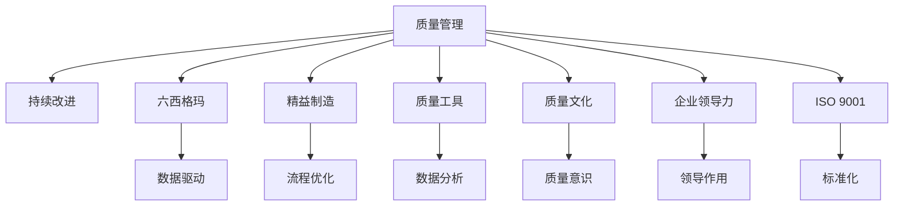

                 

# 质量管理：追求卓越的持续改进之路

> 关键词：质量管理,持续改进,六西格玛,精益制造,质量工具,质量文化,企业领导力,ISO 9001

## 1. 背景介绍

### 1.1 问题由来

随着企业的发展，产品和服务质量的提升成为企业竞争力的关键。如何系统性地管理企业质量，提升产品质量，是每一个企业都需要考虑的重要问题。质量管理方法论的不断演变，从早期的质量控制QC，到后来的全面质量管理TQM，再到如今的六西格玛和精益制造等先进方法论，为企业提供了系统、科学、高效的质量管理工具。

然而，在实际应用中，企业往往面临以下问题：

- 质量管理体系复杂，难以实施和维护。
- 质量管理工具繁多，难以选择和使用。
- 质量文化缺失，员工缺乏质量意识和技能。
- 质量改进项目效果不佳，持续改进能力不足。

这些问题严重影响了企业的质量管理水平，影响了企业的市场竞争力。因此，本文旨在通过深入探讨质量管理的核心概念和方法论，为企业提供一套科学、系统的质量管理实践指南，帮助企业提升产品质量，实现持续改进。

## 2. 核心概念与联系

### 2.1 核心概念概述

为更好地理解质量管理方法论，本文将介绍几个关键的质量管理概念：

- **质量管理(Quality Management)**：指通过系统的方法和工具，确保产品或服务满足顾客和法律规定要求的整个过程。
- **持续改进(Continuous Improvement)**：指在质量管理过程中，不断寻找改进机会，优化过程和产品，提高质量和效率。
- **六西格玛(Six Sigma)**：一种数据驱动的质量管理方法，通过精确的统计分析，优化流程，减少缺陷，提高产品或服务的质量。
- **精益制造(Lean Manufacturing)**：一种通过去除浪费、优化流程，提高生产效率和质量管理水平的方法。
- **质量工具(Quality Tools)**：指在质量管理过程中使用的各种工具和技术，如过程控制图、直方图、因果图等。
- **质量文化(Quality Culture)**：指企业内部全体员工对质量管理的认知、态度和行为。
- **企业领导力(Leadership)**：指企业管理层在质量管理中的领导作用和影响。
- **ISO 9001**：国际标准化组织制定的质量管理体系标准，为企业提供系统的质量管理框架。

这些概念之间的逻辑关系可以通过以下Mermaid流程图来展示：



这个流程图展示质量管理方法论的核心概念及其之间的关系：

1. 质量管理通过持续改进、六西格玛、精益制造、质量工具、质量文化、企业领导力和ISO 9001等多种方法和工具，形成了一个完整的质量管理体系。
2. 六西格玛和精益制造以数据驱动和流程优化为核心，通过精确的统计分析和过程优化，提升质量管理水平。
3. 质量工具如过程控制图、直方图、因果图等，为质量管理提供了科学的数据分析方法和工具。
4. 质量文化是质量管理的基础，需要通过企业领导力的推动，培育员工的质量意识和技能。
5. ISO 9001提供了系统的质量管理框架，为企业的质量管理提供标准化的指导。

这些概念共同构成了质量管理的理论和实践框架，为企业提供了系统的质量管理方法和工具。

## 3. 核心算法原理 & 具体操作步骤

### 3.1 算法原理概述

质量管理的基本原理是通过系统的方法和工具，确保产品或服务满足顾客和法律规定要求。具体来说，质量管理的过程包括以下几个关键步骤：

1. **质量策划(Planning)**：确定质量目标和要求，制定质量计划。
2. **质量控制(Control)**：监控过程和产品，确保其符合质量标准。
3. **质量保证(Assurance)**：评估企业质量管理体系的有效性，提供客观证据。
4. **质量改进(Improvement)**：通过持续改进，提高产品和服务的质量。

质量管理方法的核心理念是通过科学的数据分析和持续改进，不断提升产品和服务的质量。其中，持续改进是质量管理的关键。

### 3.2 算法步骤详解

质量管理的具体操作步骤可以概括为以下几步：

**Step 1: 确定质量目标和要求**
- 明确产品或服务的质量标准，包括技术要求、安全要求、法律法规等。
- 设定质量目标，如合格率、缺陷率、客户满意度等。

**Step 2: 制定质量计划**
- 根据质量目标，制定详细的质量计划，包括质量标准、检测方法、过程控制等。
- 分配资源和职责，确保质量计划的实施。

**Step 3: 实施质量控制**
- 监控产品或服务的生产过程，确保其符合质量标准。
- 使用质量工具进行数据分析，如直方图、控制图等。
- 定期进行抽样检测，发现问题及时纠正。

**Step 4: 实施质量保证**
- 对质量管理体系进行评估和验证，确保其有效性。
- 使用质量工具进行数据分析，如过程能力分析、因果图等。
- 提供客观证据，证明企业质量管理体系的有效性。

**Step 5: 实施质量改进**
- 通过数据分析，发现改进机会，如质量缺陷、过程瓶颈等。
- 制定改进计划，实施改进措施，如优化流程、改进设备等。
- 定期评估改进效果，持续改进质量管理水平。

这些步骤构成了一个完整的质量管理体系，确保企业能够系统、科学地管理产品质量。

### 3.3 算法优缺点

质量管理方法论在实际应用中具有以下优点：

1. **系统性**：通过系统的方法和工具，确保质量管理的全面性和系统性。
2. **科学性**：基于数据驱动的统计分析，提高质量管理决策的科学性和准确性。
3. **持续性**：强调持续改进，不断优化过程和产品，提高质量和效率。
4. **标准化**：提供系统的质量管理框架，便于企业标准化的质量管理。

同时，质量管理方法论也存在以下缺点：

1. **复杂性**：质量管理体系和方法论较为复杂，需要大量的培训和资源投入。
2. **实施难度**：需要企业管理层的支持和推动，否则难以全面实施。
3. **资源消耗**：质量管理需要大量的人力、物力和财力投入，对中小型企业可能存在压力。
4. **灵活性不足**：质量管理方法论较为固定，难以应对突发情况和变化。

尽管存在这些局限性，但质量管理方法论仍然是当前企业质量管理的重要参考，为企业的质量管理提供了科学、系统的方法和工具。

### 3.4 算法应用领域

质量管理方法论在多个行业和企业中得到了广泛应用，涵盖了从制造业到服务业，从技术型企业到传统企业等多个领域。以下是一些典型的应用场景：

- **制造业**：使用六西格玛和精益制造方法，优化生产流程，提高产品质量。
- **医疗行业**：使用质量管理体系ISO 9001，确保医疗设备和服务的安全和质量。
- **金融行业**：使用全面质量管理方法，提升客户体验和金融服务质量。
- **信息产业**：使用敏捷开发和持续集成方法，提高软件产品质量和交付速度。
- **教育行业**：使用质量改进方法，提升教育质量和教学效果。
- **服务业**：使用服务质量管理体系ISO 9001，提升客户满意度和服务质量。

这些应用场景展示了质量管理方法论的广泛适用性和实际效果，为不同行业提供了科学、系统、高效的质量管理方法。

## 4. 数学模型和公式 & 详细讲解 & 举例说明

### 4.1 数学模型构建

质量管理的数学模型主要包括质量控制和质量改进两个方面。

**质量控制模型**：
质量控制模型主要用于监控产品或服务的生产过程，确保其符合质量标准。常用的质量控制模型包括：

- **直方图(Histogram)**：用于描述数据分布情况，识别数据异常。
- **过程控制图(Control Chart)**：用于监控生产过程的稳定性和波动性。
- **因果图(Cause-and-Effect Diagram)**：用于识别问题原因，制定改进措施。

**质量改进模型**：
质量改进模型主要用于持续改进质量管理水平。常用的质量改进模型包括：

- **PDCA循环(Plan-Do-Check-Act Cycle)**：通过计划、执行、检查和改进四个步骤，不断提升产品质量。
- **DMAIC循环(Define-Measure-Analyze-Improve-Control)**：通过定义、测量、分析、改进和控制五个步骤，优化生产过程。
- **Kaizen方法(Kaizen Method)**：通过小步改进，逐步提升质量管理水平。

### 4.2 公式推导过程

**直方图公式推导**：
直方图用于描述数据分布情况，其公式为：

$$
H(x) = \frac{n}{N} \delta(x - \mu)
$$

其中，$n$ 为数据量，$N$ 为总数据量，$x$ 为数据点，$\mu$ 为均值，$\delta$ 为正态分布函数。

**过程控制图公式推导**：
过程控制图用于监控生产过程的稳定性和波动性，其公式为：

$$
X_c = X_u - 3\sigma
$$
$$
X_p = X_l + 3\sigma
$$

其中，$X_c$ 为控制上限，$X_u$ 为上限，$X_p$ 为控制下限，$X_l$ 为下限，$\sigma$ 为标准差。

**因果图公式推导**：
因果图用于识别问题原因，其公式为：

$$
C = \sum_{i=1}^n f_i(x_i)
$$

其中，$C$ 为总因果关系，$f_i$ 为因果关系函数，$x_i$ 为自变量。

**PDCA循环公式推导**：
PDCA循环通过四个步骤不断提升产品质量，其公式为：

$$
P = Plan
$$
$$
D = Do
$$
$$
C = Check
$$
$$
A = Act
$$

**DMAIC循环公式推导**：
DMAIC循环通过五个步骤优化生产过程，其公式为：

$$
D = Define
$$
$$
M = Measure
$$
$$
A = Analyze
$$
$$
I = Improve
$$
$$
C = Control

**Kaizen方法公式推导**：
Kaizen方法通过小步改进，逐步提升质量管理水平，其公式为：

$$
K = Kaizen
$$

这些数学模型和公式展示了质量管理方法论的科学性和系统性，为企业提供了可靠的数据分析和持续改进工具。

### 4.3 案例分析与讲解

以下通过两个实际案例，展示质量管理方法论在企业中的应用：

**案例1：某汽车企业的质量管理**

某汽车企业通过实施六西格玛方法，优化生产流程，显著提升了产品质量和生产效率。具体步骤如下：

1. **质量策划**：明确产品质量标准，设定质量目标。
2. **质量控制**：监控生产过程，使用过程控制图、直方图等质量工具，发现生产过程中的问题。
3. **质量保证**：评估质量管理体系的有效性，提供客观证据。
4. **质量改进**：通过数据分析，制定改进措施，如优化生产设备，改善生产环境。

通过这些步骤，该企业成功提升了产品质量和生产效率，减少了缺陷率，赢得了市场认可。

**案例2：某医疗企业的质量管理**

某医疗企业通过实施ISO 9001质量管理体系，提升了医疗设备和服务的安全和质量。具体步骤如下：

1. **质量策划**：明确医疗设备和服务的安全和质量标准，设定质量目标。
2. **质量控制**：监控医疗设备和服务的过程，使用质量工具，如因果图、直方图等，发现问题。
3. **质量保证**：评估质量管理体系的有效性，提供客观证据。
4. **质量改进**：通过数据分析，制定改进措施，如培训员工，优化设备维护流程。

通过这些步骤，该企业成功提升了医疗设备和服务的安全和质量，赢得了患者信任，增强了市场竞争力。

这些案例展示了质量管理方法论在企业中的应用效果，为企业提供了具体的实践指导。

## 5. 项目实践：代码实例和详细解释说明

### 5.1 开发环境搭建

在开始质量管理项目的实践前，需要准备好开发环境。以下是使用Python进行开发的环境配置流程：

1. 安装Python：从官网下载并安装Python，选择最新版本的Python进行开发。
2. 安装必要的库：安装Pandas、NumPy、Matplotlib等数据处理和可视化库。
3. 设置虚拟环境：使用虚拟环境工具（如Venv）创建一个独立的Python开发环境，避免与其他项目冲突。

完成上述步骤后，即可在虚拟环境中开始质量管理项目的开发。

### 5.2 源代码详细实现

以下是一个简单的质量管理项目代码实现，用于演示如何使用Python进行质量数据处理和分析：

```python
import pandas as pd
import numpy as np
import matplotlib.pyplot as plt

# 读取质量数据
data = pd.read_csv('quality_data.csv')

# 绘制直方图
plt.hist(data['缺陷率'], bins=10)
plt.xlabel('缺陷率')
plt.ylabel('频次')
plt.show()

# 绘制过程控制图
plt.plot(data['生产批次'], data['过程能力'], label='过程能力')
plt.xlabel('生产批次')
plt.ylabel('过程能力')
plt.show()

# 绘制因果图
# 这里假设因果关系函数为线性函数
plt.scatter(data['时间'], data['因果关系'])
plt.xlabel('时间')
plt.ylabel('因果关系')
plt.show()

# 应用PDCA循环
plan = '设定目标'
do = '实施改进措施'
check = '检查改进效果'
act = '持续改进'
print(f'PDCA循环：{plan} -> {do} -> {check} -> {act}')

# 应用DMAIC循环
define = '定义问题'
measure = '测量现状'
analyze = '分析原因'
improve = '制定改进措施'
control = '控制措施'
print(f'DMAIC循环：{define} -> {measure} -> {analyze} -> {improve} -> {control}')
```

以上代码实现了质量数据的基本处理和分析，展示了如何使用Python进行质量管理。

### 5.3 代码解读与分析

代码中主要使用了Pandas、NumPy和Matplotlib库进行数据处理和可视化。具体步骤如下：

**读取质量数据**：使用Pandas库读取质量数据，方便后续处理。

**绘制直方图**：使用Matplotlib库绘制质量数据分布的直方图，识别数据异常。

**绘制过程控制图**：使用Matplotlib库绘制过程控制图，监控生产过程的稳定性和波动性。

**绘制因果图**：使用Matplotlib库绘制因果图，识别问题原因。

**应用PDCA循环和DMAIC循环**：展示PDCA循环和DMAIC循环的基本步骤，说明质量改进方法。

代码展示了质量管理的基本步骤和常用方法，为质量管理项目提供了具体的实践指导。

## 6. 实际应用场景

### 6.1 智能制造

智能制造是制造业的未来发展方向，通过引入先进的质量管理方法论，可以有效提升制造企业的生产效率和产品质量。例如，使用六西格玛方法优化生产流程，减少制造过程中的浪费和缺陷，提高产品质量和生产效率。

**应用场景**：
- 使用六西格玛方法，优化生产流程，减少制造过程中的浪费和缺陷。
- 使用精益制造方法，提高生产效率和质量管理水平。
- 使用质量工具，如直方图、控制图、因果图等，监控生产过程，发现问题。
- 通过持续改进，不断优化制造过程，提升产品质量和生产效率。

**技术实现**：
- 使用Python和统计分析库，对生产数据进行分析和处理。
- 使用Matplotlib库绘制质量控制图，监控生产过程的稳定性和波动性。
- 使用Pandas库进行数据分析，发现质量问题，制定改进措施。

### 6.2 医疗健康

医疗健康领域对质量管理的要求极高，通过引入先进的质量管理方法论，可以有效提升医疗设备和服务的安全和质量。例如，使用ISO 9001质量管理体系，确保医疗设备和服务的安全和质量。

**应用场景**：
- 使用ISO 9001质量管理体系，确保医疗设备和服务的安全和质量。
- 使用质量工具，如因果图、直方图等，监控医疗设备和服务的过程，发现问题。
- 通过持续改进，不断优化医疗设备和服务，提升患者满意度和治疗效果。

**技术实现**：
- 使用Python和统计分析库，对医疗数据进行分析和处理。
- 使用Matplotlib库绘制因果图，识别问题原因，制定改进措施。
- 使用Pandas库进行数据分析，发现质量问题，制定改进措施。

### 6.3 金融服务

金融服务行业对客户体验和金融服务质量要求极高，通过引入先进的质量管理方法论，可以有效提升金融服务的质量和客户满意度。例如，使用全面质量管理方法，提升客户体验和金融服务质量。

**应用场景**：
- 使用全面质量管理方法，提升客户体验和金融服务质量。
- 使用质量工具，如因果图、直方图等，监控金融服务的过程，发现问题。
- 通过持续改进，不断优化金融服务，提升客户满意度和服务质量。

**技术实现**：
- 使用Python和统计分析库，对金融服务数据进行分析和处理。
- 使用Matplotlib库绘制因果图，识别问题原因，制定改进措施。
- 使用Pandas库进行数据分析，发现质量问题，制定改进措施。

### 6.4 未来应用展望

随着质量管理方法论的不断发展和应用，未来将在更多领域得到应用，为传统行业带来变革性影响。

**未来应用领域**：
- 智慧农业：使用精益制造方法，优化农业生产流程，提高农业产品质量。
- 环保行业：使用质量管理体系，提升环境保护设备和服务的质量和安全性。
- 文化娱乐：使用质量改进方法，提升文化娱乐产品和服务质量。
- 教育培训：使用质量管理体系，提升教育培训效果和质量。
- 公共服务：使用质量管理体系，提升公共服务质量和效率。

**未来技术趋势**：
- 数据驱动的质量管理：通过大数据和人工智能技术，实现更精准的质量管理和决策。
- 智能质量管理：使用智能算法和机器学习技术，实现更高效的质量监控和改进。
- 多模态质量管理：结合视觉、语音、文本等多种模态数据，实现更全面、准确的质量管理。
- 自适应质量管理：根据企业实际情况，自适应调整质量管理策略和工具。

这些趋势展示了质量管理方法论的未来发展方向，为更多行业提供了科学、系统、高效的质量管理方法和工具。

## 7. 工具和资源推荐

### 7.1 学习资源推荐

为了帮助开发者系统掌握质量管理的核心概念和方法论，这里推荐一些优质的学习资源：

1. 《质量管理手册》：国际标准化组织发布的ISO 9001质量管理体系标准，详细介绍了质量管理的理论和实践。
2. 《六西格玛管理》：关于六西格玛方法论的经典书籍，涵盖了六西格玛方法的全过程和实践案例。
3. 《精益制造》：关于精益制造方法论的经典书籍，介绍了精益制造的核心思想和实践方法。
4. 《全面质量管理》：关于全面质量管理方法论的经典书籍，详细介绍了全面质量管理的理论和方法。
5. 《质量工具使用手册》：详细介绍各种质量工具使用方法的书籍，如因果图、直方图、控制图等。
6. 《质量文化建设》：介绍如何培育企业质量文化，提升员工质量意识和技能的书籍。
7. 《企业领导力与质量管理》：介绍企业管理层在质量管理中的领导作用的书籍。

通过对这些资源的学习实践，相信你一定能够快速掌握质量管理的精髓，并用于解决实际的业务问题。

### 7.2 开发工具推荐

高效的开发离不开优秀的工具支持。以下是几款用于质量管理开发的常用工具：

1. Python：免费的开源编程语言，适合快速迭代研究和开发。
2. Pandas：数据处理和分析库，提供了强大的数据处理和可视化功能。
3. NumPy：科学计算库，提供了高效的数学计算和线性代数功能。
4. Matplotlib：数据可视化库，提供了丰富的绘图功能。
5. Scikit-learn：机器学习库，提供了各种机器学习算法和工具。
6. Weights & Biases：模型训练的实验跟踪工具，可以记录和可视化模型训练过程中的各项指标。
7. TensorBoard：TensorFlow配套的可视化工具，可实时监测模型训练状态，并提供丰富的图表呈现方式。

合理利用这些工具，可以显著提升质量管理任务的开发效率，加快创新迭代的步伐。

### 7.3 相关论文推荐

质量管理方法论的发展源于学界的持续研究。以下是几篇奠基性的相关论文，推荐阅读：

1. "Six Sigma Quality"：关于六西格玛方法论的奠基性论文，提出了六西格玛方法的基本思想和应用方法。
2. "Lean Production"：关于精益制造方法论的奠基性论文，提出了精益制造的核心思想和实践方法。
3. "Total Quality Management"：关于全面质量管理方法论的奠基性论文，详细介绍了全面质量管理的理论和实践。
4. "Quality Control Charts"：关于质量控制图的经典论文，介绍了质量控制图的基本原理和方法。
5. "Design of Experiments"：关于实验设计的经典论文，介绍了如何设计有效的实验，优化质量管理方法。

这些论文代表了大质量管理方法论的发展脉络。通过学习这些前沿成果，可以帮助研究者把握学科前进方向，激发更多的创新灵感。

## 8. 总结：未来发展趋势与挑战

### 8.1 总结

本文对质量管理的核心概念和方法论进行了全面系统的介绍。首先阐述了质量管理的背景和意义，明确了质量管理在企业发展中的重要地位。其次，从原理到实践，详细讲解了质量管理的数学模型和操作步骤，给出了质量管理任务开发的完整代码实例。同时，本文还广泛探讨了质量管理方法论在智能制造、医疗健康、金融服务等多个领域的应用前景，展示了质量管理方法论的广泛适用性和实际效果。

通过本文的系统梳理，可以看到，质量管理方法论正在成为企业质量管理的重要范式，为企业的质量管理提供了科学、系统的方法和工具。未来，伴随质量管理方法论的不断发展和应用，企业将能够更高效、更系统地管理质量，提升产品和服务质量，增强市场竞争力。

### 8.2 未来发展趋势

展望未来，质量管理方法论将呈现以下几个发展趋势：

1. **数据驱动**：通过大数据和人工智能技术，实现更精准的质量管理和决策。
2. **智能质量管理**：使用智能算法和机器学习技术，实现更高效的质量监控和改进。
3. **多模态质量管理**：结合视觉、语音、文本等多种模态数据，实现更全面、准确的质量管理。
4. **自适应质量管理**：根据企业实际情况，自适应调整质量管理策略和工具。
5. **全球质量管理**：使用国际标准和最佳实践，提升全球企业的质量管理水平。

这些趋势展示了质量管理方法论的未来发展方向，为更多行业提供了科学、系统、高效的质量管理方法和工具。

### 8.3 面临的挑战

尽管质量管理方法论已经取得了显著成效，但在迈向更加智能化、系统化应用的过程中，仍面临诸多挑战：

1. **数据安全**：在数据驱动的质量管理中，如何保护企业数据的安全和隐私，是一个重要的挑战。
2. **技术门槛**：质量管理方法论需要较高的技术门槛，中小企业难以独立实现。
3. **文化差异**：不同企业在质量管理上的文化差异较大，如何统一标准和流程，是一个重要的挑战。
4. **资源投入**：质量管理需要大量的人力、物力和财力投入，对中小企业可能存在压力。
5. **持续改进**：质量管理需要持续改进，如何保持持续改进的势头，是一个重要的挑战。

尽管存在这些挑战，但质量管理方法论仍然是当前企业质量管理的重要参考，为企业的质量管理提供了科学、系统的方法和工具。相信随着技术的不断发展，质量管理方法论将在更多企业得到应用，为企业的质量管理提供坚实的保障。

### 8.4 研究展望

面向未来，质量管理研究需要在以下几个方面寻求新的突破：

1. **跨学科融合**：将质量管理与其他学科（如工程、计算机科学等）进行更深入的融合，探索新的质量管理方法和工具。
2. **技术创新**：开发更加智能、自适应的质量管理工具，提升质量管理的效率和效果。
3. **标准化**：制定更多国际标准和行业标准，提升全球企业的质量管理水平。
4. **可持续发展**：结合可持续发展理念，提升企业的社会责任感和环境友好性。
5. **伦理道德**：引入伦理道德约束，确保质量管理的公正性和公平性。

这些研究方向的探索，必将引领质量管理方法论迈向更高的台阶，为构建高质量的企业文化和服务体系提供坚实的保障。

## 9. 附录：常见问题与解答

**Q1：质量管理是否适用于所有企业？**

A: 质量管理方法论适用于大多数企业，特别是那些重视产品和服务质量的企业。但对于一些特殊行业（如国防、金融等），需要结合行业特点，进行特定的改进和调整。

**Q2：质量管理需要哪些资源投入？**

A: 质量管理需要大量的人力、物力和财力投入，包括质量管理体系的构建、培训和认证、质量工具的使用等。但这些投入能够显著提升企业的产品和服务质量，增强企业的市场竞争力。

**Q3：质量管理如何应对数据驱动的质量管理中的数据安全问题？**

A: 质量管理中，数据安全和隐私保护是一个重要问题。可以通过数据匿名化、加密等手段保护数据安全，同时确保数据使用的合规性。

**Q4：质量管理方法论如何与企业实际情况相结合？**

A: 质量管理方法论需要结合企业实际情况进行灵活调整。可以通过试点项目，逐步推广质量管理方法论，确保其实施效果。

**Q5：质量管理如何提升企业质量文化？**

A: 质量管理需要企业全员参与，通过培训和宣导，提升员工的质量意识和技能。同时，企业管理层应发挥领导作用，推动质量管理的实施。

这些问答展示了质量管理方法论在企业中的应用场景和实际问题，为企业提供了具体的实践指导。

---

作者：禅与计算机程序设计艺术 / Zen and the Art of Computer Programming

