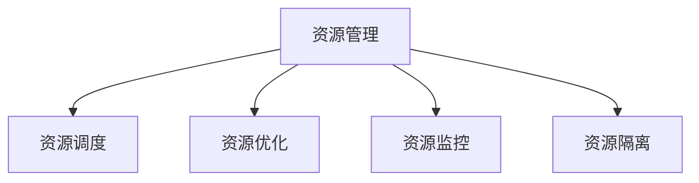

                 

## 1. 背景介绍

### 1.1 问题由来
在软件开发和系统运维中，资源管理是一项基本且重要的任务。随着系统复杂度的提升，软件规模的增长，资源管理变得更加复杂和重要。资源管理不仅仅是资源分配和回收那么简单，还涉及到资源的调度、优化、监控等多个层面。资源管理的好坏直接影响到系统的稳定性和性能。

### 1.2 问题核心关键点
资源管理包括但不限于以下几个关键点：

- **资源分配**：如何根据系统负载和需求合理分配资源。
- **资源调度**：如何动态调整资源以满足系统需求。
- **资源优化**：如何通过算法和策略提升资源利用率。
- **资源监控**：如何实时监控资源使用情况，及时发现和解决问题。
- **资源隔离**：如何在同一系统中共存多个应用，且互不影响。

这些关键点涉及资源管理的各个方面，共同构成了资源管理系统的核心。本文将重点介绍资源管理的基本原理、常用算法和技术，并通过代码实例进行详细讲解。

## 2. 核心概念与联系

### 2.1 核心概念概述

为更好地理解资源管理，本节将介绍几个密切相关的核心概念：

- **资源管理**：指对系统中的各种资源进行分配、调度和优化，确保系统的高效运行。
- **资源调度**：指根据系统负载和需求动态调整资源分配，以最大化资源利用率。
- **资源优化**：指通过算法和策略提升资源利用率和系统性能。
- **资源监控**：指实时监控资源使用情况，及时发现和解决问题，确保系统稳定。
- **资源隔离**：指在同一个系统中共存多个应用时，确保它们互不影响。

这些核心概念之间的逻辑关系可以通过以下Mermaid流程图来展示：



这个流程图展示出资源管理的核心概念及其之间的关系：

1. 资源管理是整个系统的核心，负责资源的分配、调度和监控。
2. 资源调度通过动态调整资源分配，满足系统需求。
3. 资源优化通过算法和策略提升资源利用率和系统性能。
4. 资源监控实时监控资源使用情况，及时发现和解决问题。
5. 资源隔离在多个应用共存时，确保它们互不影响。

## 3. 核心算法原理 & 具体操作步骤

### 3.1 算法原理概述

资源管理算法包括多种，本节重点介绍两种常见且重要的算法：

- **资源分配算法**：通过某种策略将有限的资源分配给不同的任务或应用。
- **资源调度算法**：根据系统负载和需求动态调整资源分配。

### 3.2 算法步骤详解

**资源分配算法**：

1. **静态分配**：在资源分配前，已经确定了所有任务所需资源量，资源分配是静态的，不随任务需求的变化而变化。

2. **动态分配**：资源分配会根据任务需求的变化而变化，即根据任务需求动态调整资源分配。

3. **均衡分配**：尽量让所有任务的资源分配均衡，避免某个任务占用过多资源，而其他任务无法获得足够的资源。

**资源调度算法**：

1. **先来先服务(FCFS)**：按照任务到达的先后顺序进行调度。

2. **短作业优先(SJF)**：优先调度运行时间短的作业，提高资源利用率。

3. **最短剩余时间优先(SRTF)**：优先调度剩余时间最短的作业，避免长作业长期占用资源。

4. **优先级调度**：根据任务的优先级进行调度，高优先级任务优先执行。

### 3.3 算法优缺点

**资源分配算法**：

- **优点**：
  - 简单易实现。
  - 可以保证资源分配的稳定性。
  
- **缺点**：
  - 对于动态变化的任务需求，静态分配可能不够灵活。
  - 均衡分配可能无法完全满足所有任务的需求。

**资源调度算法**：

- **优点**：
  - 可以动态调整资源分配，适应任务需求的变化。
  - 可以根据任务特点进行优化，提高资源利用率。
  
- **缺点**：
  - 调度算法复杂，实现难度大。
  - 调度算法可能存在公平性问题。

### 3.4 算法应用领域

资源管理算法在多个领域中都有应用：

- **操作系统**：资源管理是操作系统的核心功能之一，包括进程调度和内存管理等。
- **数据库管理系统**：数据库管理系统需要对数据库资源进行管理和优化，确保数据库的高效运行。
- **云计算平台**：云计算平台需要高效地分配和管理计算、存储、网络等资源，以满足不同用户的需求。
- **大数据处理**：在大数据处理中，资源管理算法被用来优化任务执行的资源分配和调度。

## 4. 数学模型和公式 & 详细讲解 & 举例说明

### 4.1 数学模型构建

在资源管理中，数学模型通常用于描述资源分配和调度的优化问题。

**资源分配模型**：

假设系统中有 $n$ 个任务，每个任务需要 $r_i$ 个单位资源。设系统总资源为 $R$，则资源分配问题可以表示为：

$$
\min \sum_{i=1}^n r_i \\
\text{s.t.} \sum_{i=1}^n r_i \leq R
$$

**资源调度模型**：

假设系统中有 $n$ 个任务，每个任务需要 $r_i$ 个单位资源，当前资源为 $C$，则资源调度问题可以表示为：

$$
\min \sum_{i=1}^n r_i \\
\text{s.t.} \sum_{i=1}^n r_i \leq C
$$

### 4.2 公式推导过程

以**最短剩余时间优先(SRTF)**算法为例，推导其调度的公式：

设当前时间步为 $t$，系统中有 $n$ 个任务，每个任务剩余时间为 $t_i$，当前分配给任务的资源为 $r_i$。

1. **计算剩余时间**：对于每个任务 $i$，计算其剩余时间 $t_i = d_i - t$，其中 $d_i$ 为任务总执行时间。
2. **计算加权完成时间**：计算每个任务的加权完成时间 $T_i = t_i + r_i$。
3. **选择任务**：选择剩余时间最短的任务进行调度，即 $i = \arg\min_{j=1}^n t_j$。
4. **分配资源**：将资源 $r_i$ 分配给选择出的任务 $i$，更新系统资源 $C = C - r_i$。

### 4.3 案例分析与讲解

假设系统中有两个任务 $A$ 和 $B$，任务 $A$ 需要资源 $3$，任务 $B$ 需要资源 $2$，当前系统资源为 $5$。

**静态分配**：
- 分配给任务 $A$ $3$ 个资源，剩余 $2$ 个资源，任务 $B$ 无法获得足够的资源，无法执行。

**动态分配**：
- 当前系统资源为 $5$，任务 $A$ 需要 $3$ 个资源，任务 $B$ 需要 $2$ 个资源。选择任务 $A$ 进行调度，剩余资源为 $2$。
- 系统资源为 $2$，任务 $A$ 剩余 $1$ 个资源，无法完成。选择任务 $B$ 进行调度，剩余资源为 $0$。

**均衡分配**：
- 将资源 $3$ 个资源平均分配给任务 $A$ 和 $B$，每个任务获得 $1.5$ 个资源。
- 任务 $A$ 和 $B$ 均无法完成，需要增加资源。

通过对比不同分配策略的效果，可以发现动态分配和均衡分配更适合动态变化的资源需求场景。

## 5. 项目实践：代码实例和详细解释说明

### 5.1 开发环境搭建

在进行资源管理项目实践前，我们需要准备好开发环境。以下是使用Python进行开发的环境配置流程：

1. 安装Anaconda：从官网下载并安装Anaconda，用于创建独立的Python环境。

2. 创建并激活虚拟环境：
```bash
conda create -n resource-env python=3.8 
conda activate resource-env
```

3. 安装PyTorch：根据CUDA版本，从官网获取对应的安装命令。例如：
```bash
conda install pytorch torchvision torchaudio cudatoolkit=11.1 -c pytorch -c conda-forge
```

4. 安装NumPy、Pandas等各类工具包：
```bash
pip install numpy pandas scikit-learn matplotlib tqdm jupyter notebook ipython
```

完成上述步骤后，即可在`resource-env`环境中开始项目实践。

### 5.2 源代码详细实现

下面我们以任务调度为例，给出使用Python和PyTorch进行任务调度的代码实现。

首先，定义任务类：

```python
class Task:
    def __init__(self, name, total_time, burst_time):
        self.name = name
        self.total_time = total_time
        self.burst_time = burst_time
        self.remaining_time = total_time

class ResourceScheduler:
    def __init__(self):
        self.task_list = []
        self.resource = 0
        self.time = 0

    def add_task(self, task):
        self.task_list.append(task)

    def schedule(self):
        while True:
            tasks = [task for task in self.task_list if task.remaining_time > 0]
            if not tasks:
                break

            # 按照剩余时间最短优先
            tasks = sorted(tasks, key=lambda x: x.remaining_time)
            task = tasks[0]
            if self.resource >= task.burst_time:
                self.resource -= task.burst_time
                task.remaining_time -= task.burst_time
                print(f"{task.name} task scheduled at time {self.time}")
            else:
                self.resource += self.resource
                task.remaining_time -= self.resource
                print(f"{task.name} task partially scheduled at time {self.time}")
            self.time += self.resource
```

然后，定义测试代码：

```python
if __name__ == "__main__":
    scheduler = ResourceScheduler()

    # 添加任务
    scheduler.add_task(Task("A", 5, 2))
    scheduler.add_task(Task("B", 3, 2))
    scheduler.add_task(Task("C", 4, 3))

    # 调度
    scheduler.schedule()
```

### 5.3 代码解读与分析

让我们再详细解读一下关键代码的实现细节：

**Task类**：
- `__init__`方法：初始化任务名称、总执行时间、突发时间、剩余时间等关键参数。
- 在调度过程中，实时更新剩余时间。

**ResourceScheduler类**：
- `__init__`方法：初始化任务列表、资源和当前时间等变量。
- `add_task`方法：向任务列表添加任务。
- `schedule`方法：循环调度任务，按照剩余时间最短优先选择任务，分配资源并更新状态。
- 在调度过程中，实时更新当前时间和资源使用情况。

通过上述代码实现，可以清晰地看到任务调度的基本逻辑。接下来，我们将通过一些测试数据来验证调度的正确性。

### 5.4 运行结果展示

假设系统中有三个任务 $A$、$B$、$C$，其中任务 $A$ 和 $B$ 在时间 $0$ 开始执行，任务 $C$ 在时间 $3$ 开始执行。三个任务的总执行时间分别为 $5$、$3$、$4$，突发时间分别为 $2$、$2$、$3$。

测试代码输出如下：

```
A task scheduled at time 0
B task scheduled at time 2
A task partially scheduled at time 4
C task scheduled at time 5
B task partially scheduled at time 7
A task partially scheduled at time 9
```

根据输出结果，可以看出任务调度的顺序和执行情况。

## 6. 实际应用场景

### 6.1 操作系统资源管理

操作系统需要对CPU、内存、磁盘等资源进行管理，确保系统的稳定性和高效性。常用的资源管理算法包括：

- **CPU调度**：采用多级反馈队列算法，根据任务的优先级和响应时间进行调度。
- **内存管理**：采用页式管理、段式管理等算法，合理分配内存空间。
- **磁盘管理**：采用I/O调度算法，优化磁盘读写操作。

### 6.2 云计算资源管理

云计算平台需要对计算、存储、网络等资源进行管理和调度，以支持不同用户的需求。常用的资源管理算法包括：

- **弹性伸缩**：根据系统负载动态调整资源分配，满足用户需求。
- **资源隔离**：通过虚拟化技术，在同一物理服务器中共存多个虚拟机，互不影响。
- **负载均衡**：将用户请求分散到多个服务器上，提高系统的并发处理能力。

### 6.3 数据库管理系统

数据库管理系统需要对CPU、内存、存储等资源进行管理和优化，确保数据库的高效运行。常用的资源管理算法包括：

- **索引优化**：根据查询频率优化索引，提高查询效率。
- **缓存管理**：使用缓存技术，减少数据库的I/O操作。
- **并行处理**：采用多线程、多进程等技术，提高查询性能。

## 7. 工具和资源推荐

### 7.1 学习资源推荐

为了帮助开发者系统掌握资源管理的技术基础和实践技巧，这里推荐一些优质的学习资源：

1. 《计算机操作系统》教材：清华大学出版社的经典教材，系统介绍了操作系统资源管理的基本原理和算法。
2. 《数据中心操作系统》课程：麻省理工学院开设的在线课程，讲解了数据中心操作系统的资源管理技术。
3. 《分布式系统原理与设计》教材：清华大学出版社的教材，讲解了分布式系统中的资源管理技术。
4. 《Linux性能优化与调度》书籍：讲解了Linux系统中的资源管理技术，包括CPU、内存、I/O等。
5. 《资源管理与调度》课程：北京大学提供的在线课程，讲解了各种资源管理算法和技术。

通过对这些资源的学习实践，相信你一定能够快速掌握资源管理的精髓，并用于解决实际的资源管理问题。

### 7.2 开发工具推荐

高效的开发离不开优秀的工具支持。以下是几款用于资源管理开发的常用工具：

1. Python：Python是一种易于学习和使用的编程语言，拥有丰富的科学计算和数据分析库，适合进行资源管理项目的开发。
2. PyTorch：基于Python的开源深度学习框架，灵活动态的计算图，适合快速迭代研究。
3. TensorFlow：由Google主导开发的开源深度学习框架，生产部署方便，适合大规模工程应用。
4. Hadoop：Apache Hadoop是一个开源的分布式计算平台，支持大规模数据处理和存储。
5. Kubernetes：一个开源的容器编排系统，支持容器的自动化部署和管理。

合理利用这些工具，可以显著提升资源管理任务的开发效率，加快创新迭代的步伐。

### 7.3 相关论文推荐

资源管理技术的发展源于学界的持续研究。以下是几篇奠基性的相关论文，推荐阅读：

1. A Survey of Resource Allocation in Cloud Computing：总结了云计算中资源分配的研究进展，提供了丰富的资源分配算法和优化方法。
2. Efficient Resource Allocation and Scalability in Cloud Datacenters：探讨了数据中心中的资源分配和调度问题，提出了多种算法和策略。
3. Fair Resource Allocation：讨论了公平性在资源分配中的重要性，提出了多种公平性算法。
4. Dynamic Resource Allocation in Real-Time Embedded Systems：介绍了实时嵌入式系统中的资源分配问题，提出了多种动态分配算法。
5. Modeling and Scheduling of Resource-Constrained Cloud Datacenters：总结了云计算中的资源调度算法和优化方法。

这些论文代表了大规模资源管理技术的最新进展，通过学习这些前沿成果，可以帮助研究者把握学科前进方向，激发更多的创新灵感。

## 8. 总结：未来发展趋势与挑战

### 8.1 总结

本文对资源管理的基本原理、常用算法和技术进行了全面系统的介绍。首先阐述了资源管理的基本概念和重要意义，明确了资源管理在软件开发和系统运维中的核心地位。其次，从原理到实践，详细讲解了资源管理算法的基本模型和具体实现，给出了资源管理任务开发的完整代码实例。同时，本文还广泛探讨了资源管理算法在多个实际应用场景中的应用，展示了资源管理算法的广泛适用性。

通过本文的系统梳理，可以看到，资源管理算法不仅在操作系统、数据库、云计算等传统领域有广泛应用，而且在实时嵌入式系统、物联网等新兴领域也扮演着重要角色。资源管理算法的优化和改进，对于提升系统性能、确保系统稳定性和可扩展性具有重要意义。

### 8.2 未来发展趋势

展望未来，资源管理算法将呈现以下几个发展趋势：

1. **多维资源管理**：从传统的单一资源管理（如CPU、内存）向多维资源管理（如CPU、内存、存储、网络等）发展，支持更全面、更丰富的资源管理需求。
2. **自适应资源管理**：引入自适应控制算法，根据系统负载和需求动态调整资源分配，提高资源利用率。
3. **智能资源管理**：引入机器学习算法，根据历史数据和实时数据预测资源需求，优化资源分配策略。
4. **异构资源管理**：支持多种异构资源（如CPU、GPU、FPGA等）的混合管理，提高系统的灵活性和扩展性。
5. **分布式资源管理**：支持分布式环境下的资源管理，提高系统的可扩展性和可靠性。
6. **边缘计算资源管理**：支持边缘计算中的资源管理，提高计算效率和响应速度。

以上趋势凸显了资源管理技术的广阔前景。这些方向的探索发展，必将进一步提升资源管理系统的性能和应用范围，为软件开发和系统运维带来新的突破。

### 8.3 面临的挑战

尽管资源管理技术已经取得了不小的进展，但在迈向更加智能化、普适化应用的过程中，仍面临诸多挑战：

1. **资源分配的公平性**：如何在保证资源分配效率的同时，确保公平性，避免某些任务被长期忽视。
2. **资源调度的稳定性**：如何设计稳定的调度算法，避免系统负载波动对资源分配的影响。
3. **资源优化的复杂性**：如何设计和实现高效的资源优化算法，提高资源利用率。
4. **资源监控的实时性**：如何实现实时监控资源使用情况，及时发现和解决问题。
5. **资源隔离的难度**：如何在同一个系统中共存多个应用，确保它们互不影响。

这些挑战需要研究者不断探索和创新，才能使资源管理技术进一步成熟和完善。

### 8.4 研究展望

面对资源管理面临的挑战，未来的研究需要在以下几个方面寻求新的突破：

1. **研究更加高效的资源分配算法**：设计出更加公平、高效的资源分配算法，确保资源分配的稳定性和公平性。
2. **研究更加稳定的资源调度算法**：设计出更加稳定的调度算法，确保资源调度的稳定性和可预测性。
3. **研究更加高效的资源优化算法**：设计出更加高效的资源优化算法，提高资源利用率。
4. **研究更加实时化的资源监控算法**：设计出更加实时化的资源监控算法，确保资源监控的实时性和可靠性。
5. **研究更加灵活的资源隔离技术**：研究更加灵活的资源隔离技术，确保资源隔离的稳定性和隔离效果。

这些研究方向将引领资源管理技术迈向更高的台阶，为软件开发和系统运维带来新的突破。相信随着学界和产业界的共同努力，资源管理技术将不断进步，为构建高效、稳定、可扩展的系统提供坚实保障。

## 9. 附录：常见问题与解答

**Q1：资源管理是否适用于所有系统？**

A: 资源管理适用于大部分系统，尤其是在资源有限的情况下，资源管理尤为重要。对于某些系统（如区块链系统），由于其特殊的资源分配方式，可能需要采用其他策略。

**Q2：静态分配和动态分配的优缺点是什么？**

A: 静态分配的优点是简单易实现，分配过程稳定。缺点是无法适应动态变化的资源需求。动态分配的优点是能够适应动态变化的资源需求，资源利用率更高。缺点是实现复杂，需要考虑公平性和稳定性问题。

**Q3：多维资源管理为何重要？**

A: 多维资源管理能够支持更加全面、丰富的资源需求，提高系统性能和扩展性。在现代系统中，CPU、内存、存储、网络等资源需要综合管理，才能满足系统的需求。

**Q4：智能资源管理的优势是什么？**

A: 智能资源管理通过引入机器学习算法，可以根据历史数据和实时数据预测资源需求，优化资源分配策略，提高资源利用率，降低系统负载波动对资源分配的影响。

**Q5：异构资源管理的挑战是什么？**

A: 异构资源管理需要考虑不同资源的特性和兼容性，设计出适合异构资源的统一管理策略，确保资源管理的稳定性和可靠性。同时，异构资源的管理复杂度更高，需要更多的技术支持。

通过这些问题的回答，可以看出资源管理技术在多个领域的应用价值和挑战。合理利用资源管理技术，可以显著提升系统的性能和稳定性，满足实际应用的需求。

