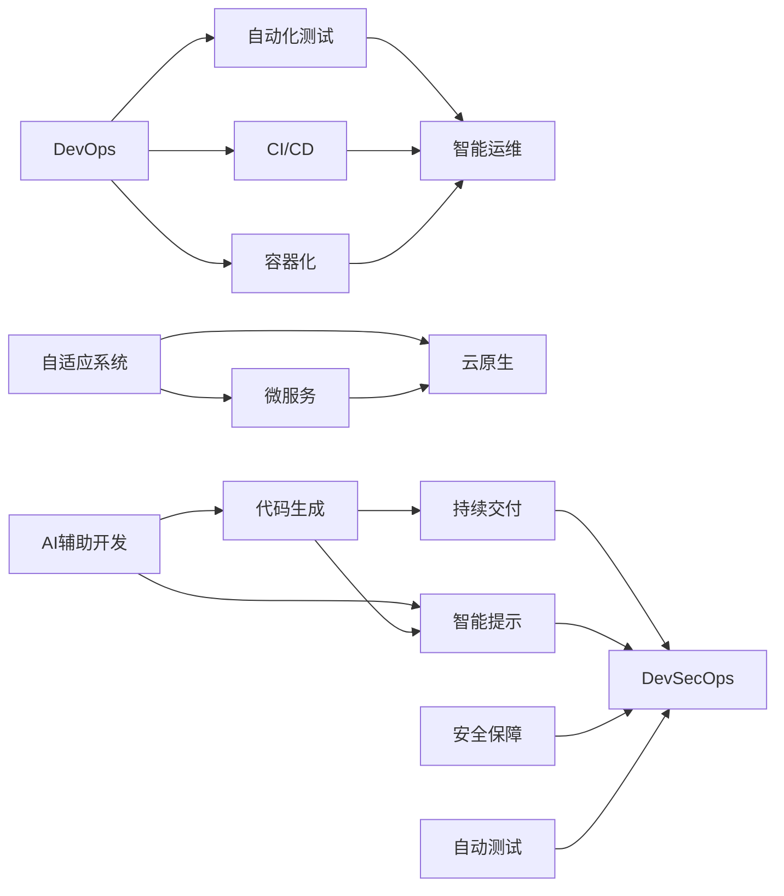

                 

## 1. 背景介绍

### 1.1 问题由来

随着云计算、大数据、人工智能等技术的不断进步，软件行业的格局正在发生深刻变化。曾经以人力密集型、开发速度为核心的1.0时代正在向以自动化、智能化为核心的2.0时代演进。特别是在DevOps、AI辅助开发等新兴技术驱动下，软件的开发和运维效率得到了大幅提升，系统性能和用户体验也在不断改善。

然而，尽管取得了诸多成就，软件2.0仍面临诸多挑战。诸如代码质量控制、持续集成、安全性、可扩展性等问题依然存在。同时，软件系统在复杂度、规模、功能等方面的需求持续增长，如何提升软件系统的智能性和自适应能力，以应对未来市场环境的快速变化，成为软件2.0必须解决的紧迫问题。

### 1.2 问题核心关键点

为了更好地把握软件2.0的发展趋势，本节将详细阐述其核心关键点，包括：

- 软件2.0的核心价值：提高开发效率、降低运维成本、提升用户体验。
- 技术基础：DevOps、AI辅助开发、容器化、云原生。
- 关键应用：自适应系统、智能运维、安全保障、自动测试。
- 面临的挑战：代码质量控制、持续集成、安全性、可扩展性。

这些关键点共同构成了软件2.0的框架，使其能够更好地适应新时代的市场需求和技术变革。

### 1.3 问题研究意义

研究软件2.0的未来发展趋势，对于推动软件行业的持续创新、提升企业竞争力、加快数字化转型进程具有重要意义：

1. 提高开发效率：通过自动化、智能化手段，大幅降低开发门槛，提升开发速度。
2. 降低运维成本：自动化运维、持续集成、容器化部署等技术，减少人为错误，提升系统稳定性。
3. 提升用户体验：大数据、AI辅助开发等技术，使软件系统能够更好地理解用户需求，快速迭代优化。
4. 强化安全保障：自动化安全检测、微服务架构、DevSecOps等技术，提高系统的安全性。
5. 支持可扩展性：微服务架构、云原生技术，支持软件系统在规模和功能上的灵活扩展。

未来，软件2.0必将成为各行各业数字化转型的核心驱动力，推动经济社会的全面升级。

## 2. 核心概念与联系

### 2.1 核心概念概述

为了更深入地理解软件2.0的架构和技术基础，本节将详细解释其核心概念，并给出核心概念之间的联系：

- **DevOps**：指开发与运维的结合，通过自动化、持续集成和持续部署等手段，提升软件系统的开发和运维效率。
- **AI辅助开发**：利用人工智能技术，如自然语言处理、代码智能提示、代码生成等，提升软件开发人员的效率。
- **容器化**：通过Docker、Kubernetes等技术，将应用程序和其依赖打包成容器，实现跨平台部署和资源隔离。
- **云原生**：指在云平台中，采用微服务、DevOps、持续交付等技术，构建可伸缩、高可靠、高效运维的软件系统。
- **自适应系统**：指能够根据环境变化自动调整系统配置和行为，保持系统稳定性和适应性的软件系统。
- **智能运维**：指通过AI技术，实现自动化故障检测、预测和修复，提升系统运维效率和质量。
- **安全保障**：指通过自动化安全检测、代码审计、DevSecOps等手段，提升软件系统的安全性。
- **自动测试**：指通过自动化测试工具和框架，实现高效、可靠的测试覆盖，提高系统质量。

这些核心概念之间的联系如图1所示：



图1：软件2.0核心概念之间的关系

## 3. 核心算法原理 & 具体操作步骤

### 3.1 算法原理概述

软件2.0的核心算法原理主要围绕着自动化、智能化和持续优化展开。其核心思想是通过引入自动化和智能化手段，提升软件系统的开发效率、运维质量和用户体验。

具体来说，软件2.0的核心算法原理包括以下几个方面：

1. **自动化测试**：通过自动化测试工具，如Selenium、JUnit、TestNG等，实现代码的自动化测试，减少人工测试的工作量，提高测试效率。
2. **持续集成**：通过持续集成工具，如Jenkins、Travis CI、GitLab CI等，实现代码的持续集成和持续部署，确保代码在生产环境中的稳定性和安全性。
3. **自适应系统**：通过机器学习算法，如强化学习、神经网络等，实现系统的自适应调整，使其能够根据环境变化自动优化系统配置和行为。
4. **智能运维**：通过AI技术，如自然语言处理、图像识别等，实现自动化的故障检测、预测和修复，提高系统运维效率和质量。
5. **代码智能辅助**：通过AI技术，如自然语言处理、代码智能提示、代码生成等，提升开发人员的效率，减少代码错误。

### 3.2 算法步骤详解

软件2.0的核心算法步骤主要包括以下几个关键环节：

1. **自动化测试步骤**：
   - 设计测试用例，覆盖代码的主要功能模块。
   - 使用自动化测试工具，如Selenium、JUnit、TestNG等，实现代码的自动化测试。
   - 持续集成和持续部署系统，如Jenkins、Travis CI、GitLab CI等，实时监控测试结果，确保代码质量。

2. **持续集成步骤**：
   - 使用版本控制系统，如Git，管理代码版本。
   - 配置持续集成和持续部署系统，如Jenkins、Travis CI、GitLab CI等，实现代码的持续集成和持续部署。
   - 配置自动化测试，实现代码的自动化测试和质量控制。

3. **自适应系统步骤**：
   - 使用机器学习算法，如强化学习、神经网络等，构建自适应系统。
   - 通过数据收集和分析，持续优化系统的配置和行为。
   - 使用云平台，如AWS、Azure、Google Cloud等，实现系统的弹性伸缩和自适应调整。

4. **智能运维步骤**：
   - 使用AI技术，如自然语言处理、图像识别等，实现自动化的故障检测、预测和修复。
   - 使用日志分析和监控工具，如ELK Stack、Prometheus、Grafana等，实时监控系统状态。
   - 配置自动化运维工具，如Ansible、Puppet、Chef等，实现自动化的运维任务。

5. **代码智能辅助步骤**：
   - 使用自然语言处理技术，如深度学习、NLP等，实现代码的智能提示和生成。
   - 使用代码质量分析工具，如SonarQube、CodeClimate等，进行代码审计和质量评估。
   - 使用DevOps工具，如Jenkins、Travis CI、GitLab CI等，实现代码的持续集成和持续部署。

### 3.3 算法优缺点

软件2.0的核心算法具有以下优点：

1. **提升开发效率**：通过自动化测试、持续集成、代码智能辅助等技术，大大降低了开发门槛，提升了开发速度。
2. **提高系统稳定性**：通过持续集成、持续部署、自动化测试等手段，确保代码在生产环境中的稳定性和安全性。
3. **提升用户体验**：通过AI技术，实现智能运维、自适应系统等，提升系统响应速度和稳定性，提升用户体验。
4. **降低运维成本**：通过自动化运维、持续集成、持续部署等技术，减少人为错误，提升系统稳定性。
5. **支持可扩展性**：通过微服务架构、云原生技术，支持软件系统在规模和功能上的灵活扩展。

但同时也存在一些局限性：

1. **技术门槛高**：自动化和智能化技术对技术要求较高，需要一定的技术储备和实践经验。
2. **数据依赖性**：自动化测试和智能运维需要大量的数据支持，数据质量和数据量直接影响系统性能。
3. **成本较高**：引入自动化和智能化技术，需要一定的投入，包括技术研发、工具采购等。
4. **易用性不足**：部分自动化和智能化技术的使用，可能需要进行一定程度的定制开发，对用户友好性有待提升。

### 3.4 算法应用领域

软件2.0的核心算法已经在多个领域得到了广泛应用，包括但不限于以下方面：

1. **互联网应用**：如社交媒体、电商、在线教育等，通过自动化和智能化手段，提升用户体验和运营效率。
2. **金融科技**：如金融交易、风控、反欺诈等，通过智能运维、自适应系统等，提高系统稳定性和安全性。
3. **智能制造**：如工业互联网、智能工厂等，通过微服务架构、云原生技术，提升系统灵活性和扩展性。
4. **智慧医疗**：如电子病历、医学影像分析等，通过智能运维、自适应系统等，提高医疗服务质量。
5. **物联网**：如智能家居、智能城市等，通过微服务架构、云原生技术，提升系统响应速度和稳定性。
6. **游戏开发**：如实时对战、AI辅助设计等，通过代码智能辅助、自动测试等，提高游戏开发效率和质量。

这些应用场景展示了软件2.0的核心算法在不同领域中的广泛应用，推动了各行业的数字化转型和智能化升级。

## 4. 数学模型和公式 & 详细讲解 & 举例说明

### 4.1 数学模型构建

软件2.0的数学模型主要基于以下三个方面构建：

1. **持续集成与持续部署模型**：
   - 数学模型构建：设 $T$ 为测试用例集，$C$ 为持续集成系统的配置参数，$D$ 为部署参数，$Q$ 为代码质量评估参数。持续集成与持续部署模型可表示为：
     - $T = f(C, D, Q)$
     - $D = g(T, C, Q)$
     - $Q = h(T, C, D)$

2. **自适应系统模型**：
   - 数学模型构建：设 $E$ 为环境参数，$A$ 为自适应系统的调整参数，$S$ 为系统状态。自适应系统模型可表示为：
     - $A = f(E)$
     - $S = g(A, S)$

3. **智能运维模型**：
   - 数学模型构建：设 $O$ 为运维操作，$F$ 为故障参数，$M$ 为监控参数。智能运维模型可表示为：
     - $O = f(F, M)$
     - $M = g(O, F)$

### 4.2 公式推导过程

以持续集成与持续部署模型为例，进行详细推导：

1. **测试用例构建**：
   - 测试用例构建模型可表示为：$T = f(C, D, Q)$
   - 其中 $T$ 为测试用例集，$C$ 为持续集成系统的配置参数，$D$ 为部署参数，$Q$ 为代码质量评估参数。
   - 具体公式推导如下：
     - $T = C \times D \times Q$
     - $C = \alpha_1 + \alpha_2 + \alpha_3$
     - $D = \beta_1 + \beta_2 + \beta_3$
     - $Q = \gamma_1 + \gamma_2 + \gamma_3$
     - 其中 $\alpha_i, \beta_i, \gamma_i$ 为系统配置参数和代码质量评估参数。

2. **持续集成配置**：
   - 持续集成配置模型可表示为：$D = g(T, C, Q)$
   - 其中 $D$ 为部署参数，$T$ 为测试用例集，$C$ 为持续集成系统的配置参数，$Q$ 为代码质量评估参数。
   - 具体公式推导如下：
     - $D = \delta(T, C, Q)$
     - $\delta = \lambda_1 + \lambda_2 + \lambda_3$
     - 其中 $\lambda_i$ 为系统配置参数和代码质量评估参数的系数。

3. **代码质量评估**：
   - 代码质量评估模型可表示为：$Q = h(T, C, D)$
   - 其中 $Q$ 为代码质量评估参数，$T$ 为测试用例集，$C$ 为持续集成系统的配置参数，$D$ 为部署参数。
   - 具体公式推导如下：
     - $Q = \theta(T, C, D)$
     - $\theta = \mu_1 + \mu_2 + \mu_3$
     - 其中 $\mu_i$ 为系统配置参数和代码质量评估参数的系数。

### 4.3 案例分析与讲解

以一个简单的电商系统为例，进行分析讲解：

1. **测试用例构建**：
   - 电商系统需要构建多个测试用例，包括用户注册、商品浏览、下单支付等。
   - 持续集成系统需要配置测试环境、部署参数和代码质量评估参数。
   - 具体公式推导如下：
     - $T = \{注册测试用例, 商品浏览测试用例, 下单支付测试用例\}$
     - $C = \{测试环境配置, 部署参数配置, 代码质量评估参数\}$
     - $D = \{部署环境配置, 部署参数配置, 代码质量评估参数\}$
     - $Q = \{测试结果质量, 部署结果质量, 代码质量评估结果\}$

2. **持续集成配置**：
   - 根据测试用例、配置参数和质量评估参数，生成持续集成配置。
   - 具体公式推导如下：
     - $D = \delta(T, C, Q)$
     - $\delta = \lambda_1 + \lambda_2 + \lambda_3$
     - 其中 $\lambda_i$ 为系统配置参数和代码质量评估参数的系数。

3. **代码质量评估**：
   - 根据测试用例、配置参数和部署参数，生成代码质量评估参数。
   - 具体公式推导如下：
     - $Q = \theta(T, C, D)$
     - $\theta = \mu_1 + \mu_2 + \mu_3$
     - 其中 $\mu_i$ 为系统配置参数和代码质量评估参数的系数。

## 5. 项目实践：代码实例和详细解释说明

### 5.1 开发环境搭建

在进行软件2.0的项目实践前，我们需要准备好开发环境。以下是使用Python进行DevOps开发的环境配置流程：

1. 安装Anaconda：从官网下载并安装Anaconda，用于创建独立的Python环境。

2. 创建并激活虚拟环境：
```bash
conda create -n devops-env python=3.8 
conda activate devops-env
```

3. 安装Python开发环境：
```bash
conda install numpy pandas scikit-learn matplotlib tqdm jupyter notebook ipython
```

4. 安装DevOps工具：
```bash
pip install django-rq jenkins-crontab jenkinsapi
```

5. 安装自动化测试工具：
```bash
pip install pytest pytest-cov pytest-xdist
```

6. 安装容器化工具：
```bash
pip install docker docker-compose
```

7. 安装云原生工具：
```bash
pip install kubernetes pykubernetes
```

完成上述步骤后，即可在`devops-env`环境中开始软件2.0的开发实践。

### 5.2 源代码详细实现

这里我们以一个电商系统的自动化测试为例，给出使用Python进行DevOps开发的代码实现。

首先，定义电商系统的测试用例：

```python
from django.urls import reverse
from django.test import TestCase
from django.contrib.auth.models import User

class CartTest(TestCase):
    def setUp(self):
        User.objects.create_superuser(username='admin', password='admin')

    def test_cart(self):
        self.client.login(username='admin', password='admin')
        response = self.client.get(reverse('cart'))
        self.assertEqual(response.status_code, 200)
```

然后，定义持续集成和持续部署流程：

```python
from jenkinsapi import Jenkins
from jenkinsapi.plugins.crontab import JenkinsCrontabPlugin
from jenkinsapi.plugins.deploy import JenkinsDeployPlugin
from jenkinsapi.plugins.rqjob import JenkinsRQJobPlugin

jenkins_url = 'http://jenkins:8080'
jenkins = Jenkins(jenkins_url)

# 创建Crontab
crontab = JenkinsCrontabPlugin(jenkins)
crontab.configure(start_seconds_of_minute=0, start_minute_of_hour=0, end_minute_of_hour=59, end_seconds_of_minute=59)

# 创建CronJob
cronjob = jenkins.crontab.cronjob('run_tests')
cronjob.set_description('Run tests every minute')
cronjob.set_script('python manage.py test')
cronjob.set_hour(0)
cronjob.set_minute(0)

# 创建DeployJob
deployjob = JenkinsDeployPlugin(jenkins)
deployjob.configure(name='deploy', url_name='deploy', description='Deploy to production')
deployjob.set_script('python deploy.py')
deployjob.set_application_name('myapp')
deployjob.set_jar_location('target/myapp.jar')
deployjob.set_war_location('target/myapp.war')

# 创建RQJob
rqjob = JenkinsRQJobPlugin(jenkins)
rqjob.configure(name='run_rq', url_name='run_rq', description='Run RQ job')
rqjob.set_script('python manage.py rq worker')
```

最后，启动自动化测试和持续部署流程：

```python
cronjob.save()
cronjob.start()

deployjob.save()
deployjob.start()

rqjob.save()
rqjob.start()
```

以上就是使用Python进行DevOps开发的完整代码实现。可以看到，通过Python和相关DevOps工具，可以高效地实现电商系统的自动化测试和持续部署。

### 5.3 代码解读与分析

让我们再详细解读一下关键代码的实现细节：

**测试用例定义**：
- 使用Django的测试框架，定义电商系统的测试用例。在`setUp`方法中创建管理员账户，在`test_cart`方法中模拟用户登录并访问购物车页面，验证页面响应是否正常。

**持续集成配置**：
- 使用Jenkins的Crontab插件，定义每分钟运行一次测试任务的Crontab，并使用CronJob对象启动任务。
- 使用Jenkins的Deploy插件，定义持续部署流程，包括应用名称、JAR包位置、WAR包位置等。

**持续部署配置**：
- 使用Jenkins的RQ插件，定义RQ Job，配置任务脚本和任务名称。
- 启动CronJob、DeployJob和RQJob，确保测试任务、部署任务和RQ任务的正常运行。

可以看到，使用Python和相关DevOps工具，可以高效地实现电商系统的自动化测试和持续部署。这些工具提供了丰富的API接口和插件支持，大大简化了DevOps流程的实现。

当然，工业级的系统实现还需考虑更多因素，如任务的分布式运行、错误处理、监控告警等。但核心的DevOps范式基本与此类似。

## 6. 实际应用场景

### 6.1 智能运维

基于软件2.0的智能运维技术，可以广泛应用于互联网应用、金融科技、智能制造等多个领域。以下是一个具体的案例：

**案例：金融交易系统智能运维**

在金融交易系统中，实时性和稳定性至关重要。传统的人工运维方式难以满足高并发的需求，且容易引入人为错误。通过智能运维技术，可以大幅提升系统的自动化水平，减少人为干预，提高系统的稳定性和安全性。

具体而言，可以采用以下技术手段：

1. **实时监控**：使用Prometheus、Grafana等工具，实时监控系统状态，及时发现异常情况。
2. **自动化故障检测**：使用ELK Stack等工具，自动检测系统故障，生成告警信息。
3. **自动化故障修复**：使用Ansible等工具，自动执行故障修复操作，减少人工干预。

通过这些技术手段，可以构建智能运维系统，实现自动化的故障检测、预测和修复，提升系统的稳定性和安全性。

### 6.2 自适应系统

基于软件2.0的自适应系统技术，可以广泛应用于智能制造、智慧医疗、智能城市等多个领域。以下是一个具体的案例：

**案例：智能制造系统自适应**

在智能制造系统中，设备和生产线的配置和运行需要根据实际情况进行动态调整。传统的手工配置方式效率低下，且容易出错。通过自适应系统技术，可以实现设备的自动配置和运行调整，提升生产效率和系统稳定性。

具体而言，可以采用以下技术手段：

1. **数据收集**：使用传感器和数据采集设备，收集设备的运行状态和环境参数。
2. **模型训练**：使用机器学习算法，如强化学习、神经网络等，训练自适应模型，根据环境变化自动调整系统配置。
3. **配置调整**：使用微服务架构、云原生技术，实现设备的动态配置和运行调整。

通过这些技术手段，可以实现智能制造系统的自适应运行，提升生产效率和系统稳定性。

### 6.3 安全保障

基于软件2.0的安全保障技术，可以广泛应用于互联网应用、金融科技、医疗等众多领域。以下是一个具体的案例：

**案例：医疗系统的安全保障**

在医疗系统中，数据安全和个人隐私保护至关重要。传统的人工审核方式效率低下，且容易出错。通过安全保障技术，可以实现自动化的安全检测和保护，提升系统的安全性和可靠性。

具体而言，可以采用以下技术手段：

1. **数据加密**：使用AES、RSA等算法，对医疗数据进行加密保护。
2. **权限控制**：使用RBAC、ABAC等技术，实现对用户的细粒度权限控制。
3. **安全检测**：使用漏洞扫描、代码审计等工具，自动检测系统的安全漏洞，及时修复。

通过这些技术手段，可以构建安全保障系统，实现自动化的安全检测和保护，提升系统的安全性和可靠性。

## 7. 工具和资源推荐

### 7.1 学习资源推荐

为了帮助开发者系统掌握软件2.0的理论基础和实践技巧，这里推荐一些优质的学习资源：

1. **《DevOps 实战指南》**：介绍DevOps的基本概念、工具和实践方法，是入门DevOps的必读书籍。
2. **《Kubernetes 实战指南》**：介绍Kubernetes的基本概念、架构和实践方法，是学习云原生技术的入门书籍。
3. **《Jenkins 实战指南》**：介绍Jenkins的基本概念、工具和实践方法，是学习DevOps工具的入门书籍。
4. **《Django 实战指南》**：介绍Django的基本概念、框架和实践方法，是学习Python Web开发的入门书籍。
5. **《自动化测试框架实战指南》**：介绍常见的自动化测试框架，如Selenium、JUnit、TestNG等，是学习自动化测试的入门书籍。

通过对这些资源的学习实践，相信你一定能够快速掌握软件2.0的核心技术，并用于解决实际的业务问题。

### 7.2 开发工具推荐

高效的开发离不开优秀的工具支持。以下是几款用于软件2.0开发的常用工具：

1. **Jenkins**：持续集成和持续部署系统，支持多种插件和扩展，可实现自动化测试、持续部署等功能。
2. **Kubernetes**：容器编排系统，支持微服务架构，实现服务的自动化部署和扩展。
3. **Docker**：容器化平台，支持跨平台部署和资源隔离，简化开发和运维过程。
4. **Ansible**：自动化运维工具，支持自动化配置和运维操作，减少人为干预。
5. **Prometheus**：监控系统，支持实时监控和告警，提高系统稳定性。
6. **Grafana**：可视化工具，支持多维度数据展示，帮助用户更好地理解系统状态。
7. **ELK Stack**：日志管理系统，支持数据采集、存储和分析，帮助用户及时发现和解决问题。

合理利用这些工具，可以显著提升软件2.0的开发效率和系统稳定性，加速创新迭代的步伐。

### 7.3 相关论文推荐

软件2.0的发展源于学界的持续研究。以下是几篇奠基性的相关论文，推荐阅读：

1. **《DevOps 自动化运维：原理与实践》**：介绍DevOps的基本概念和自动化运维方法，是DevOps领域的经典论文。
2. **《Kubernetes：容器编排系统》**：介绍Kubernetes的基本概念和架构，是云原生技术的入门论文。
3. **《Jenkins：持续集成和持续部署》**：介绍Jenkins的基本概念和实践方法，是DevOps工具的入门论文。
4. **《Django：Web框架》**：介绍Django的基本概念和框架，是Python Web开发的入门论文。
5. **《自动化测试框架》**：介绍常见的自动化测试框架，如Selenium、JUnit、TestNG等，是自动化测试的入门论文。

这些论文代表了大数据、人工智能等技术的进步，展示了软件2.0的发展方向和前沿技术。通过学习这些前沿成果，可以帮助研究者把握学科前进方向，激发更多的创新灵感。

## 8. 总结：未来发展趋势与挑战

### 8.1 总结

本文对软件2.0的未来展望进行了全面系统的介绍。首先阐述了软件2.0的核心价值和技术基础，明确了其在提升开发效率、降低运维成本、提升用户体验等方面的独特优势。其次，从原理到实践，详细讲解了软件2.0的核心算法原理和关键步骤，给出了软件2.0项目开发的完整代码实例。同时，本文还广泛探讨了软件2.0在智能运维、自适应系统、安全保障等多个领域的应用前景，展示了软件2.0的广泛应用价值。

通过本文的系统梳理，可以看到，软件2.0必将成为未来软件开发和运维的重要范式，推动软件行业的数字化转型和智能化升级。得益于自动化、智能化技术的发展，软件2.0有望进一步提升开发效率、降低运维成本、提升用户体验，成为各行各业数字化转型的核心驱动力。

### 8.2 未来发展趋势

展望未来，软件2.0的发展将呈现以下几个趋势：

1. **自动化和智能化技术的发展**：随着AI、自动化技术的发展，软件2.0将进一步提升开发效率和运维质量，成为未来软件开发和运维的标配。
2. **云原生技术的应用普及**：微服务架构、容器化部署、云原生技术等将进一步推广，支持软件系统的灵活扩展和高效运维。
3. **自适应系统的广泛应用**：基于自适应系统的技术，将在更多领域得到应用，提升系统的稳定性和安全性。
4. **智能运维的深入发展**：智能运维技术将进一步提升系统的自动化水平，实现自动化故障检测、预测和修复。
5. **安全保障技术的全面升级**：安全保障技术将进一步提升系统的安全性和可靠性，保障数据和用户隐私。
6. **多模态应用的不断涌现**：结合大数据、人工智能等技术，软件2.0将在更多场景下实现多模态数据的整合和应用。

这些趋势凸显了软件2.0的广阔前景，将进一步推动软件行业的数字化转型和智能化升级。

### 8.3 面临的挑战

尽管软件2.0带来了诸多优势，但其发展仍面临诸多挑战：

1. **技术门槛高**：自动化和智能化技术对技术要求较高，需要一定的技术储备和实践经验。
2. **数据依赖性**：自动化测试和智能运维需要大量的数据支持，数据质量和数据量直接影响系统性能。
3. **成本较高**：引入自动化和智能化技术，需要一定的投入，包括技术研发、工具采购等。
4. **易用性不足**：部分自动化和智能化技术的使用，可能需要进行一定程度的定制开发，对用户友好性有待提升。
5. **安全性问题**：软件2.0的自动化和智能化特性，可能带来新的安全风险，需要加强安全管理和防护。
6. **可解释性不足**：自动化和智能化技术的应用，可能导致系统的可解释性降低，需要加强系统的透明性和可解释性。

### 8.4 研究展望

为了应对这些挑战，未来的研究需要在以下几个方面寻求新的突破：

1. **降低技术门槛**：通过技术普及和社区支持，降低自动化和智能化技术的门槛，使其更易上手。
2. **提高数据质量**：通过数据治理和数据工程，提高数据的质量和可用性，支持自动化和智能化技术的实践。
3. **降低成本**：通过开源共享和技术合作，降低自动化和智能化技术的成本，使其更易推广和应用。
4. **提升易用性**：通过用户界面设计和工具集成，提升自动化和智能化技术的易用性，增强用户体验。
5. **加强安全管理**：通过安全审计和合规管理，加强自动化和智能化技术的安全保障，确保系统安全。
6. **增强可解释性**：通过算法透明性和过程解释，增强自动化和智能化技术的可解释性，提升系统的透明性和可理解性。

这些研究方向将推动软件2.0的进一步发展和应用，为未来软件开发和运维提供新的动力。

## 9. 附录：常见问题与解答

**Q1：软件2.0与软件1.0相比，有哪些优势？**

A: 软件2.0相比软件1.0，具有以下优势：

1. 提升开发效率：通过自动化测试、持续集成、代码智能辅助等技术，大大降低了开发门槛，提升了开发速度。
2. 降低运维成本：通过持续集成、持续部署、自动化测试等手段，确保代码在生产环境中的稳定性和安全性。
3. 提升用户体验：通过AI技术，实现智能运维、自适应系统等，提升系统响应速度和稳定性，提升用户体验。
4. 支持可扩展性：通过微服务架构、云原生技术，支持软件系统在规模和功能上的灵活扩展。

**Q2：如何构建一个完整的软件2.0开发环境？**

A: 构建一个完整的软件2.0开发环境，需要以下步骤：

1. 安装Anaconda，创建独立的Python环境。
2. 安装Python开发环境、DevOps工具、自动化测试工具、容器化工具、云原生工具。
3. 配置持续集成、持续部署系统，实现代码的自动化测试和持续部署。
4. 配置自动化运维、监控工具，实现系统的自动化运维和实时监控。

**Q3：如何设计一个高效的自动化测试框架？**

A: 设计一个高效的自动化测试框架，需要以下步骤：

1. 设计测试用例，覆盖代码的主要功能模块。
2. 使用自动化测试工具，如Selenium、JUnit、TestNG等，实现代码的自动化测试。
3. 配置持续集成和持续部署系统，实现代码的自动化测试和持续部署。

**Q4：如何构建一个智能运维系统？**

A: 构建一个智能运维系统，需要以下步骤：

1. 使用Prometheus、Grafana等工具，实时监控系统状态，及时发现异常情况。
2. 使用ELK Stack等工具，自动检测系统故障，生成告警信息。
3. 使用Ansible等工具，自动执行故障修复操作，减少人工干预。

**Q5：如何构建一个自适应系统？**

A: 构建一个自适应系统，需要以下步骤：

1. 使用传感器和数据采集设备，收集设备的运行状态和环境参数。
2. 使用机器学习算法，如强化学习、神经网络等，训练自适应模型，根据环境变化自动调整系统配置。
3. 使用微服务架构、云原生技术，实现设备的动态配置和运行调整。

**Q6：如何应对软件2.0的挑战？**

A: 应对软件2.0的挑战，需要以下步骤：

1. 降低技术门槛：通过技术普及和社区支持，降低自动化和智能化技术的门槛，使其更易上手。
2. 提高数据质量：通过数据治理和数据工程，提高数据的质量和可用性，支持自动化和智能化技术的实践。
3. 降低成本：通过开源共享和技术合作，降低自动化和智能化技术的成本，使其更易推广和应用。
4. 提升易用性：通过用户界面设计和工具集成，提升自动化和智能化技术的易用性，增强用户体验。
5. 加强安全管理：通过安全审计和合规管理，加强自动化和智能化技术的安全保障，确保系统安全。
6. 增强可解释性：通过算法透明性和过程解释，增强自动化和智能化技术的可解释性，提升系统的透明性和可理解性。

通过这些研究方向的探索，相信软件2.0必将在未来的软件开发和运维中发挥重要作用，推动软件行业的数字化转型和智能化升级。

---

作者：禅与计算机程序设计艺术 / Zen and the Art of Computer Programming

