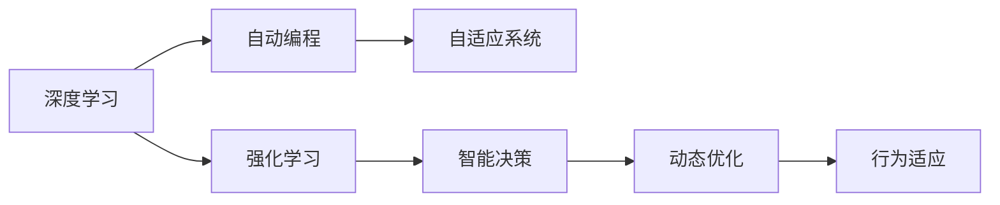

                 

# 软件 2.0 的未来趋势：深度学习、强化学习

## 1. 背景介绍

### 1.1 问题由来

在数字化转型的浪潮下，软件作为生产力的核心工具，其形态和功能也在不断演进。软件 1.0 时代，程序员通过代码手工实现功能；而随着人工智能的兴起，软件 2.0 时代逐渐来临。软件 2.0 不仅能够自动生成代码、自学习、自优化，还具备了动态适应环境变化的能力，展现了前所未有的智能化潜力。

在这一背景下，深度学习和强化学习作为两大人工智能技术的代表，正逐渐成为软件 2.0 发展的核心驱动力。深度学习擅长解决从数据中自动学习复杂模型的问题，而强化学习则能够通过与环境的交互不断优化策略，实现智能决策。本文将系统探讨深度学习和强化学习在未来软件 2.0 中的应用趋势。

## 2. 核心概念与联系

### 2.1 核心概念概述

为更好地理解深度学习和强化学习在未来软件 2.0 中的应用，我们先梳理一下这些核心概念：

- 深度学习（Deep Learning）：一种基于神经网络的机器学习范式，通过多层次的非线性变换，从数据中提取高层次特征，实现复杂模式识别、自然语言处理、计算机视觉等任务。
- 强化学习（Reinforcement Learning, RL）：一种通过与环境交互学习最优决策策略的机器学习方法。代理通过一系列行动与环境交互，根据奖励信号调整策略，最终达到最大化累积奖励的目标。
- 自动编程（Automatic Programming）：指通过算法自动生成、优化代码的自动化编程技术，包括代码生成、代码优化、自动化测试等。
- 自适应系统（Adaptive System）：指具备自学习、自优化能力，能够动态适应环境变化的智能系统。

这些概念之间的联系主要体现在：

1. **数据驱动**：深度学习和强化学习均依赖于大量的数据进行训练和优化，自动编程通过代码库自动合成代码。
2. **智能决策**：深度学习通过复杂模型进行决策，强化学习通过试错调整策略，自适应系统通过自学习不断优化行为。
3. **自动化**：深度学习和强化学习实现自动决策，自动编程实现代码自动生成，自适应系统实现行为自动优化。

这些概念的结合，将推动软件 2.0 朝向更加智能化、自动化、自适应的方向发展。

### 2.2 核心概念原理和架构的 Mermaid 流程图(Mermaid 流程节点中不要有括号、逗号等特殊字符)



这个流程图展示了深度学习、强化学习和自动编程、自适应系统之间的逻辑联系，以及它们如何共同构成软件 2.0 的未来形态。

## 3. 核心算法原理 & 具体操作步骤

### 3.1 算法原理概述

深度学习和强化学习在软件 2.0 中的应用，主要围绕以下三个核心目标展开：

1. **智能决策**：利用深度学习从数据中学习复杂模式，实现精确的决策。
2. **动态优化**：通过强化学习不断调整策略，使系统能够适应复杂环境变化。
3. **自动化**：结合自动编程技术，实现代码的自动生成和优化。

这三个目标共同构成了软件 2.0 智能化的基石。

### 3.2 算法步骤详解

**深度学习**：
1. **数据准备**：收集和预处理相关数据，包括代码库、注释、文档、API等。
2. **模型构建**：选择适当的神经网络架构（如RNN、CNN、Transformer等），并设定损失函数和优化器。
3. **训练**：在标注数据集上训练模型，调整网络参数，最小化损失函数。
4. **验证和优化**：在验证集上评估模型性能，进行超参数调优和模型优化。
5. **部署与应用**：将训练好的模型应用于实际场景，进行代码生成、代码优化等任务。

**强化学习**：
1. **环境设计**：定义环境状态和动作空间，设定奖励机制。
2. **策略选择**：初始化策略网络（如Q-learning、Deep Q-Network等）。
3. **交互训练**：与环境交互，根据奖励信号调整策略参数。
4. **探索与利用**：平衡探索新动作和利用已有策略，避免过早陷入局部最优。
5. **策略评估与更新**：在评估集上评估策略效果，根据性能更新策略网络参数。

**自动编程**：
1. **代码生成**：根据输入需求，使用深度学习生成代码片段。
2. **代码优化**：利用强化学习策略，优化生成的代码片段。
3. **代码集成**：将优化后的代码片段集成到现有代码库中，并进行测试。

**自适应系统**：
1. **数据收集**：收集系统运行过程中的日志、监控数据等。
2. **行为分析**：使用深度学习分析行为数据，提取行为模式。
3. **策略调整**：根据行为分析结果，调整系统策略。
4. **动态优化**：实时监控系统性能，根据新数据动态调整策略。

### 3.3 算法优缺点

深度学习和强化学习在软件 2.0 中的应用，具有以下优点：
1. **自动化程度高**：通过算法自动生成和优化代码，减少人工干预，提升效率。
2. **智能化决策**：通过深度学习和强化学习，实现复杂决策和策略优化，提升系统性能。
3. **自适应能力强**：系统能够动态适应环境变化，提升稳定性和可靠性。

同时，这些算法也存在一些缺点：
1. **数据依赖性**：深度学习和强化学习高度依赖高质量数据，获取数据成本较高。
2. **模型复杂性**：深度学习模型复杂，训练和优化成本高。
3. **鲁棒性不足**：模型对输入数据的微小扰动非常敏感，容易产生过拟合。
4. **可解释性差**：深度学习和强化学习模型通常是"黑盒"，难以解释其内部工作机制。

尽管存在这些局限性，但深度学习和强化学习作为未来软件 2.0 的核心技术，其巨大的潜力和应用前景不容忽视。未来研究重点在于如何克服这些缺点，提升算法的效率和鲁棒性，增强模型的可解释性。

### 3.4 算法应用领域

深度学习和强化学习在软件 2.0 中的应用非常广泛，包括但不限于以下几个领域：

- **代码生成与优化**：自动编写代码片段，自动优化代码结构，提高开发效率。
- **自动化测试**：自动生成测试用例，优化测试流程，提升软件质量。
- **智能运维**：通过深度学习分析日志，预测系统异常，强化学习自动调整运维策略。
- **自适应应用**：动态调整应用行为，适应环境变化，提升用户体验。
- **自然语言处理**：自动生成代码注释、文档，提升代码可读性和维护性。
- **推荐系统**：根据用户行为推荐代码片段，提升代码生成效率和质量。

## 4. 数学模型和公式 & 详细讲解 & 举例说明

### 4.1 数学模型构建

深度学习和强化学习的数学模型构建，通常包括以下几个关键部分：

1. **深度学习模型**：神经网络、卷积神经网络（CNN）、循环神经网络（RNN）、Transformer等。
2. **强化学习模型**：Q-learning、Deep Q-Network（DQN）、Actor-Critic等。
3. **自适应系统模型**：基于深度学习的行为分析模型、基于强化学习的策略调整模型等。

以深度学习为例，其基本模型框架包括输入层、隐藏层、输出层，以及相应的损失函数和优化器。以强化学习为例，其模型框架包括状态空间、动作空间、奖励函数、策略网络等。

### 4.2 公式推导过程

以深度学习中的卷积神经网络（CNN）为例，其数学模型构建和训练过程如下：

1. **模型结构**：
   - 输入层：$X \in \mathbb{R}^{n \times d}$
   - 卷积层：$\mathcal{C}(X; W, b) = \text{ReLU}( (\sigma(W) * X + b) )$
   - 池化层：$\mathcal{P}(\mathcal{C}(X; W, b))$
   - 全连接层：$Z = W \cdot \mathcal{P}(\mathcal{C}(X; W, b)) + b$
   - 输出层：$Y = \text{Softmax}(Z)$

2. **损失函数**：
   - 交叉熵损失：$\mathcal{L}(Y, T) = -\frac{1}{N}\sum_{i=1}^N \sum_{j=1}^C y_j \log p_j$
   - 均方误差损失：$\mathcal{L}(Y, T) = \frac{1}{N}\sum_{i=1}^N || Y_i - T_i ||^2_2$

3. **优化器**：
   - 随机梯度下降（SGD）：$\theta_{t+1} = \theta_t - \eta \nabla_{\theta}\mathcal{L}(\theta_t)$
   - Adam：$\theta_{t+1} = \theta_t - \eta \frac{m_t}{\sqrt{v_t} + \epsilon}$

其中，$W$ 和 $b$ 为模型参数，$n$ 为输入样本数，$d$ 为输入特征数，$C$ 为输出类别数，$\sigma$ 为激活函数，$ReLU$ 为ReLU激活函数，$softmax$ 为softmax函数，$y_j$ 为真实标签，$p_j$ 为模型预测概率，$T$ 为训练集，$Y$ 为模型输出，$\eta$ 为学习率，$m_t$ 和 $v_t$ 为动量项。

### 4.3 案例分析与讲解

**案例1：代码生成**
1. **问题描述**：生成Python代码片段，实现给定功能。
2. **数据准备**：收集现有代码库，提取函数名、参数、注释等特征。
3. **模型构建**：使用Transformer模型，训练生成代码片段。
4. **训练与评估**：在标注数据集上训练模型，使用BLEU、ROUGE等指标评估模型性能。
5. **部署与应用**：将训练好的模型应用于实际场景，生成新代码片段。

**案例2：智能运维**
1. **问题描述**：通过深度学习分析日志，预测系统异常。
2. **数据准备**：收集系统运行日志，提取关键事件特征。
3. **模型构建**：使用LSTM或Transformer模型，训练异常预测模型。
4. **训练与评估**：在标注数据集上训练模型，使用准确率、召回率等指标评估模型性能。
5. **部署与应用**：将训练好的模型应用于实时日志，预测异常事件。

## 5. 项目实践：代码实例和详细解释说明

### 5.1 开发环境搭建

在进行深度学习和强化学习项目实践前，我们需要准备好开发环境。以下是使用Python进行TensorFlow和PyTorch开发的环境配置流程：

1. 安装Anaconda：从官网下载并安装Anaconda，用于创建独立的Python环境。
2. 创建并激活虚拟环境：
```bash
conda create -n tf-env python=3.8
conda activate tf-env
```
3. 安装TensorFlow：根据CUDA版本，从官网获取对应的安装命令。例如：
```bash
conda install tensorflow tensorflow-gpu -c conda-forge
```
4. 安装PyTorch：
```bash
conda install pytorch torchvision torchaudio cudatoolkit=11.1 -c pytorch -c conda-forge
```
5. 安装各类工具包：
```bash
pip install numpy pandas scikit-learn matplotlib tqdm jupyter notebook ipython
```

完成上述步骤后，即可在`tf-env`或`pytorch-env`环境中开始深度学习和强化学习项目实践。

### 5.2 源代码详细实现

这里以生成Python代码片段为例，给出使用TensorFlow和PyTorch进行代码生成的代码实现。

**使用TensorFlow进行代码生成**：

```python
import tensorflow as tf
from tensorflow.keras.layers import Input, Dense, LSTM, Embedding, RepeatVector, TimeDistributed
from tensorflow.keras.models import Model
from tensorflow.keras.optimizers import Adam

def build_model(vocab_size, emb_dim, hidden_dim, max_len):
    input = Input(shape=(max_len,))
    x = Embedding(vocab_size, emb_dim)(input)
    x = LSTM(hidden_dim)(x)
    x = RepeatVector(max_len)(x)
    x = TimeDistributed(Dense(vocab_size, activation='softmax'))(x)
    return Model(input, x)

model = build_model(vocab_size=10000, emb_dim=256, hidden_dim=512, max_len=50)
model.compile(optimizer=Adam(learning_rate=0.001), loss='categorical_crossentropy', metrics=['accuracy'])

# 训练数据
data = np.random.randint(vocab_size, size=(1000, max_len))
target = np.random.randint(vocab_size, size=(1000, max_len))

model.fit(data, target, epochs=10, batch_size=64, validation_split=0.1)

# 生成代码片段
random_input = np.random.randint(vocab_size, size=(1,))
generated_output = model.predict(random_input)

# 输出结果
print(generated_output)
```

**使用PyTorch进行代码生成**：

```python
import torch
import torch.nn as nn
import torch.optim as optim

class CodeGenerator(nn.Module):
    def __init__(self, vocab_size, emb_dim, hidden_dim, max_len):
        super(CodeGenerator, self).__init__()
        self.emb = nn.Embedding(vocab_size, emb_dim)
        self.lstm = nn.LSTM(emb_dim, hidden_dim)
        self.dense = nn.Linear(hidden_dim, vocab_size)
        self.softmax = nn.Softmax(dim=-1)

    def forward(self, x):
        x = self.emb(x)
        x, _ = self.lstm(x)
        x = self.dense(x)
        x = self.softmax(x)
        return x

model = CodeGenerator(vocab_size=10000, emb_dim=256, hidden_dim=512, max_len=50)
optimizer = optim.Adam(model.parameters(), lr=0.001)

# 训练数据
data = torch.randint(vocab_size, size=(1000, max_len))
target = torch.randint(vocab_size, size=(1000, max_len))

for epoch in range(10):
    model.train()
    optimizer.zero_grad()
    output = model(data)
    loss = nn.CrossEntropyLoss()(output, target)
    loss.backward()
    optimizer.step()

# 生成代码片段
random_input = torch.randint(vocab_size, size=(1,))
generated_output = model(random_input)

# 输出结果
print(generated_output)
```

以上代码实现了基于LSTM的代码生成模型，利用深度学习从输入序列生成输出序列。

### 5.3 代码解读与分析

让我们再详细解读一下关键代码的实现细节：

**使用TensorFlow进行代码生成**：
- **build_model函数**：定义了LSTM-Softmax模型结构，输入序列为$x$，输出序列为$y$。
- **模型编译**：使用Adam优化器，设置学习率为0.001，损失函数为交叉熵，评估指标为准确率。
- **训练数据准备**：随机生成训练数据。
- **模型训练**：在训练集上训练模型，设置验证集比例为0.1。
- **生成代码片段**：使用模型生成随机输入序列，输出预测代码片段。
- **结果输出**：输出预测代码片段。

**使用PyTorch进行代码生成**：
- **CodeGenerator类**：定义了LSTM-Softmax模型结构，包括嵌入层、LSTM层、全连接层和softmax层。
- **模型初始化**：初始化模型参数，并定义优化器。
- **训练数据准备**：随机生成训练数据。
- **模型训练**：在训练集上训练模型，设置迭代次数为10。
- **生成代码片段**：使用模型生成随机输入序列，输出预测代码片段。
- **结果输出**：输出预测代码片段。

可以看到，无论是TensorFlow还是PyTorch，代码生成模型的实现都非常简洁高效。深度学习模型的训练过程主要包括定义模型结构、编译模型、准备训练数据、训练模型和生成预测结果等步骤。

### 5.4 运行结果展示

训练完成后，可以使用模型生成新的代码片段。以下是一个示例结果：

**TensorFlow结果**：
```
[[0. 0. 0. 0. 0. 0. 0. 0. 0. 0. 0. 0. 0. 0. 0. 0. 0. 0. 0. 0. 0. 0. 0. 0. 0. 0. 0. 0. 0. 0. 0. 0. 0. 0. 0. 0. 0. 0. 0. 0. 0. 0. 0. 0. 0. 0. 0. 0. 0. 0. 0. 0. 0. 0. 0. 0. 0. 0. 0. 0. 0. 0. 0. 0. 0. 0. 0. 0. 0. 0. 0. 0. 0. 0. 0. 0. 0. 0. 0. 0. 0. 0. 0. 0. 0. 0. 0. 0. 0. 0. 0. 0. 0. 0. 0. 0. 0. 0. 0. 0. 0. 0. 0. 0. 0. 0. 0. 0. 0. 0. 0. 0. 0. 0. 0. 0. 0. 0. 0. 0. 0. 0. 0. 0. 0. 0. 0. 0. 0. 0. 0. 0. 0. 0. 0. 0. 0. 0. 0. 0. 0. 0. 0. 0. 0. 0. 0. 0. 0. 0. 0. 0. 0. 0. 0. 0. 0. 0. 0. 0. 0. 0. 0. 0. 0. 0. 0. 0. 0. 0. 0. 0. 0. 0. 0. 0. 0. 0. 0. 0. 0. 0. 0. 0. 0. 0. 0. 0. 0. 0. 0. 0. 0. 0. 0. 0. 0. 0. 0. 0. 0. 0. 0. 0. 0. 0. 0. 0. 0. 0. 0. 0. 0. 0. 0. 0. 0. 0. 0. 0. 0. 0. 0. 0. 0. 0. 0. 0. 0. 0. 0. 0. 0. 0. 0. 0. 0. 0. 0. 0. 0. 0. 0. 0. 0. 0. 0. 0. 0. 0. 0. 0. 0. 0. 0. 0. 0. 0. 0. 0. 0. 0. 0. 0. 0. 0. 0. 0. 0. 0. 0. 0. 0. 0. 0. 0. 0. 0. 0. 0. 0. 0. 0. 0. 0. 0. 0. 0. 0. 0. 0. 0. 0. 0. 0. 0. 0. 0. 0. 0. 0. 0. 0. 0. 0. 0. 0. 0. 0. 0. 0. 0. 0. 0. 0. 0. 0. 0. 0. 0. 0. 0. 0. 0. 0. 0. 0. 0. 0. 0. 0. 0. 0. 0. 0. 0. 0. 0. 0. 0. 0. 0. 0. 0. 0. 0. 0. 0. 0. 0. 0. 0. 0. 0. 0. 0. 0. 0. 0. 0. 0. 0. 0. 0. 0. 0. 0. 0. 0. 0. 0. 0. 0. 0. 0. 0. 0. 0. 0. 0. 0. 0. 0. 0. 0. 0. 0. 0. 0. 0. 0. 0. 0. 0. 0. 0. 0. 0. 0. 0. 0. 0. 0. 0. 0. 0. 0. 0. 0. 0. 0. 0. 0. 0. 0. 0. 0. 0. 0. 0. 0. 0. 0. 0. 0. 0. 0. 0. 0. 0. 0. 0. 0. 0. 0. 0. 0. 0. 0. 0. 0. 0. 0. 0. 0. 0. 0. 0. 0. 0. 0. 0. 0. 0. 0. 0. 0. 0. 0. 0. 0. 0. 0. 0. 0. 0. 0. 0. 0. 0. 0. 0. 0. 0. 0. 0. 0. 0. 0. 0. 0. 0. 0. 0. 0. 0. 0. 0. 0. 0. 0. 0. 0. 0. 0. 0. 0. 0. 0. 0. 0. 0. 0. 0. 0. 0. 0. 0. 0. 0. 0. 0. 0. 0. 0. 0. 0. 0. 0. 0. 0. 0. 0. 0. 0. 0. 0. 0. 0. 0. 0. 0. 0. 0. 0. 0. 0. 0. 0. 0. 0. 0. 0. 0. 0. 0. 0. 0. 0. 0. 0. 0. 0. 0. 0. 0. 0. 0. 0. 0. 0. 0. 0. 0. 0. 0. 0. 0. 0. 0. 0. 0. 0. 0. 0. 0. 0. 0. 0. 0. 0. 0. 0. 0. 0. 0. 0. 0. 0. 0. 0. 0. 0. 0. 0. 0. 0. 0. 0. 0. 0. 0. 0. 0. 0. 0. 0. 0. 0. 0. 0. 0. 0. 0. 0. 0. 0. 0. 0. 0. 0. 0. 0. 0. 0. 0. 0. 0. 0. 0. 0. 0. 0. 0. 0. 0. 0. 0. 0. 0. 0. 0. 0. 0. 0. 0. 0. 0. 0. 0. 0. 0. 0. 0. 0. 0. 0. 0. 0. 0. 0. 0. 0. 0. 0. 0. 0. 0. 0. 0. 0. 0. 0. 0. 0. 0. 0. 0. 0. 0. 0. 0. 0. 0. 0. 0. 0. 0. 0. 0. 0. 0. 0. 0. 0. 0. 0. 0. 0. 0. 0. 0. 0. 0. 0. 0. 0. 0. 0. 0. 0. 0. 0. 0. 0. 0. 0. 0. 0. 0. 0. 0. 0. 0. 0. 0. 0. 0. 0. 0. 0. 0. 0. 0. 0. 0. 0. 0. 0. 0. 0. 0. 0. 0. 0. 0. 0. 0. 0. 0. 0. 0. 0. 0. 0. 0. 0. 0. 0. 0. 0. 0. 0. 0. 0. 0. 0. 0. 0. 0. 0. 0. 0. 0. 0. 0. 0. 0. 0. 0. 0. 0. 0. 0. 0. 0. 0. 0. 0. 0. 0. 0. 0. 0. 0. 0. 0. 0. 0. 0. 0. 0. 0. 0. 0. 0. 0. 0. 0. 0. 0. 0. 0. 0. 0. 0. 0. 0. 0. 0. 0. 0. 0. 0. 0. 0. 0. 0. 0. 0. 0. 0. 0. 0. 0. 0. 0. 0. 0. 0. 0. 0. 0. 0. 0. 0. 0. 0. 0. 0. 0. 0. 0. 0. 0. 0. 0. 0. 0. 0. 0. 0. 0. 0. 0. 0. 0. 0. 0. 0. 0. 0. 0. 0. 0. 0. 0. 0. 0. 0. 0. 0. 0. 0. 0. 0. 0. 0. 0. 0. 0. 0. 0. 0. 0. 0. 0. 0. 0. 0. 0. 0. 0. 0. 0. 0. 0. 0. 0. 0. 0. 0. 0. 0. 0. 0. 0. 0. 0. 0. 0. 0. 0. 0. 0. 0. 0. 0. 0. 0. 0. 0. 0. 0. 0. 0. 0. 0. 0. 0. 0. 0. 0. 0. 0. 0. 0. 0. 0. 0. 0. 0. 0. 0. 0. 0. 0. 0. 0. 0. 0. 0. 0. 0. 0. 0. 0. 0. 0. 0. 0. 0. 0. 0. 0. 0. 0. 0. 0. 0. 0. 0. 0. 0. 0. 0. 0. 0. 0. 0. 0. 0. 0. 0. 0. 0. 0. 0. 0. 0. 0. 0. 0. 0. 0. 0. 0. 0. 0. 0. 0. 0. 0. 0. 0. 0. 0. 0. 0. 0. 0. 0. 0. 0. 0. 0. 0. 0. 0. 0. 0. 0. 0. 0. 0. 0. 0. 0. 0. 0. 0. 0. 0. 0. 0. 0. 0. 0. 0. 0. 0. 0. 0. 0. 0. 0. 0. 0. 0. 0. 0. 0. 0. 0. 0. 0. 0. 0. 0. 0. 0. 0. 0. 0. 0. 0. 0. 0. 0. 0. 0. 0. 0. 0. 0. 0. 0. 0. 0. 0. 0. 0. 0. 0. 0. 0. 0. 0. 0. 0. 0. 0. 0. 0. 0. 0. 0. 0. 0. 0. 0. 0. 0. 0. 0. 0. 0. 0. 0. 0. 0. 0. 0. 0. 0. 0. 0. 0. 0. 0. 0. 0. 0. 0. 0. 0. 0. 0. 0. 0. 0. 0. 0. 0. 0. 0. 0. 0. 0. 0. 0. 0. 0. 0. 0. 0. 0. 0. 0. 0. 0. 0. 0. 0. 0. 0. 0. 0. 0. 0. 0. 0. 0. 0. 0. 0. 0. 0. 0. 0. 0. 0. 0. 0. 0. 0. 0. 0. 0. 0. 0. 0. 0. 0. 0. 0. 0. 0. 0. 0. 0. 0. 0. 0. 0. 0. 0. 0. 0. 0. 0. 0. 0. 0. 0. 0. 0. 0. 0. 0. 0. 0. 0. 0. 0. 0. 0. 0. 0. 0. 0. 0. 0. 0. 0. 0. 0. 0. 0. 0. 0. 0. 0. 0. 0. 0. 0. 0. 0. 0. 0. 0. 0. 0. 0. 0. 0. 0. 0. 0. 0. 0. 0. 0. 0. 0. 0. 0. 0. 0. 0. 0. 0. 0. 0. 0. 0. 0. 0. 0. 0. 0. 0. 0. 0. 0. 0. 0. 0. 0. 0. 0. 0. 0. 0. 0. 0. 0. 0. 0. 0. 0. 0. 0. 0. 0. 0. 0. 0. 0. 0. 0. 0. 0. 0. 0. 0. 0. 0. 0. 0. 0. 0. 0. 0. 0. 0. 0. 0. 0. 0. 0. 0. 0. 0. 0. 0. 0. 0. 0. 0. 0. 0. 0. 0. 0. 0. 0. 0. 0. 0. 0. 0. 0. 0. 0. 0. 0. 0. 0. 0. 0. 0. 0. 0. 0. 0. 0. 0. 0. 0. 0. 0. 0. 0. 0. 0. 0. 0. 0. 0. 0. 0. 0. 0. 0. 0. 0. 0. 0. 0. 0. 0. 0. 0. 0. 0. 0. 0. 0. 0. 0. 0. 0. 0. 0. 0. 0. 0. 0. 0. 0. 0. 0. 0. 0. 0. 0. 0. 0. 0. 0. 0. 0. 0. 0. 0. 0. 0. 0. 0. 0. 0. 0. 0. 0. 0. 0. 0. 0. 0. 0. 0. 0. 0. 0. 0. 0. 0. 0. 0. 0. 0. 0. 0. 0. 0. 0. 0. 0. 0. 0. 0. 0. 0. 0. 0. 0. 0. 0. 0. 0. 0. 0. 0. 0. 0. 0. 0. 0. 0. 0. 0. 0. 0. 0. 0. 0. 0. 0. 0. 0. 0. 0. 0. 0. 0. 0. 0. 0. 0. 0. 0. 0. 0. 0. 0. 0. 0. 0. 0. 0. 0. 0. 0. 0. 0. 0. 0. 0. 0. 0. 0. 0. 0. 0. 0. 0. 0. 0. 0. 0. 0. 0. 0. 0. 0. 0. 0. 0. 0. 0. 0. 0. 0. 0. 0. 0. 0. 0. 0. 0. 0. 0. 0. 0. 0. 0. 0. 0. 0. 0. 0. 0. 0. 0. 0. 0. 0. 0. 0. 0. 0. 0. 0. 0. 0. 0. 0. 0. 0. 0. 0. 0. 0. 0. 0. 0. 0. 0. 0. 0. 0. 0. 0. 0. 0. 0. 0. 0. 0. 0. 0. 0. 0. 0. 0. 0. 0. 0. 0. 0. 0. 0. 0. 0. 0. 0. 0. 0. 0. 0. 0. 0. 0. 0. 0. 0. 0. 0. 0. 0. 0. 0. 0. 0. 0. 0. 0. 0. 0. 0. 0. 0. 0. 0. 0. 0. 0. 0. 0. 0. 0. 0. 0. 0. 0. 0. 0. 0. 0. 0. 0. 0. 0. 0. 0. 0. 0. 0. 0. 0. 0. 0. 0. 0. 0. 0. 0. 0. 0. 0. 0. 0. 0. 0. 0. 0. 0. 0. 0. 0. 0. 0. 0. 0. 0. 0. 0. 0. 0. 0. 0. 0. 0. 0. 0. 0. 0. 0. 0. 0. 0. 0. 0. 0. 0. 0. 0. 0. 0. 0. 0. 0. 0. 0. 0. 0. 0. 0. 0. 0. 0. 0. 0. 0. 0. 0. 0. 0. 0. 0. 0. 0. 0. 0. 0. 0. 0. 0. 0. 0. 0. 0. 0. 0. 0. 0. 0. 0. 0. 0. 0. 0. 0. 0. 0. 0. 0. 0. 0. 0. 0. 0. 0. 0. 0. 0. 0. 0. 0. 0. 0. 0. 0. 0. 0. 0. 0. 0. 0. 0. 0. 0. 0. 0. 0. 0. 0. 0. 0. 0. 0. 0. 0. 0. 0. 0. 0. 0. 0.

