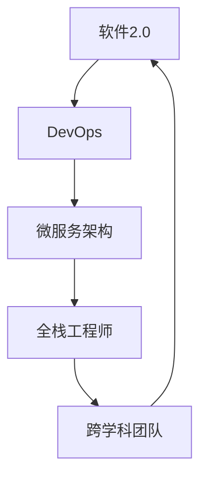

                 

# 软件2.0如何改变编程团队的分工

## 1. 背景介绍

### 1.1 问题由来

在过去的几十年里，编程工作一直是软件团队中最核心的部分。但是，随着软件2.0的到来，编程团队的分工正在发生深刻的变革。软件2.0，即以“软件即服务”（Software as a Service, SaaS）为核心，通过云计算、人工智能、大数据等技术，提供一站式的软件解决方案。这种变革不仅仅改变了编程范式，也对团队结构、协作方式和技能要求带来了全新的挑战和机遇。

### 1.2 问题核心关键点

软件2.0的核心在于它对编程团队的重新定义。传统的编程团队结构强调专业化和分工明确，每个成员负责特定的功能模块或技术栈。而在软件2.0时代，这种分工方式已经难以适应快速变化的市场需求和技术栈。软件2.0要求团队具有高度的灵活性和协作性，能够迅速响应市场变化，同时具备跨领域的知识和技能。

### 1.3 问题研究意义

研究软件2.0如何改变编程团队的分工，对于理解新技术对传统软件开发模式的冲击，探索更加高效的软件开发策略，具有重要意义：

1. **提升团队效率**：通过优化团队分工，减少冗余和重复工作，提升整体开发效率。
2. **增强适应性**：构建具备跨领域知识、能够快速适应的团队，更好地应对市场和技术的变化。
3. **降低成本**：通过合理的团队结构调整，降低人力成本和开发周期，提高市场竞争力。
4. **推动创新**：鼓励团队成员跨学科合作，促进技术融合和创新。
5. **提升用户体验**：通过整合不同团队成员的优势，提供更高质量、更符合用户需求的软件产品。

## 2. 核心概念与联系

### 2.1 核心概念概述

为了更好地理解软件2.0对编程团队分工的影响，本节将介绍几个关键概念：

- **软件2.0**：以云计算、人工智能、大数据等技术为核心的软件服务模式，强调以用户需求为导向，提供一站式的解决方案。
- **DevOps**：一种将软件开发与运维紧密结合的软件开发模式，强调自动化、持续集成和持续部署。
- **微服务架构**：一种将应用拆分成多个独立、自治的服务模块的设计模式，每个服务模块都可以独立部署和更新。
- **全栈工程师**：掌握前端、后端、数据库、运维等多个技术栈的工程师，能够在全栈环境中独立开发和运维。
- **跨学科团队**：由不同背景、具备不同技能的人员组成的团队，能够跨越技术、业务和设计等多个领域。

### 2.2 核心概念原理和架构的 Mermaid 流程图



这个流程图展示了软件2.0、DevOps、微服务架构、全栈工程师和跨学科团队之间的联系和交互：

1. **软件2.0**：是整个系统的核心，通过云计算、人工智能等技术支持，提供一站式解决方案。
2. **DevOps**：强调自动化、持续集成和持续部署，是实现软件2.0的关键技术手段。
3. **微服务架构**：将应用拆分成多个独立、自治的服务模块，便于自动化和持续部署。
4. **全栈工程师**：能够在全栈环境中独立开发和运维，是微服务架构和DevOps的核心支撑。
5. **跨学科团队**：由不同背景、具备不同技能的人员组成，能够跨越技术、业务和设计等多个领域，是软件2.0实现的关键团队。

这些概念共同构成了软件2.0的架构和运作机制，对编程团队的分工和协作方式带来了深远影响。

## 3. 核心算法原理 & 具体操作步骤

### 3.1 算法原理概述

软件2.0时代，编程团队的分工不再仅仅依赖于技术栈和专业技能，而是更强调跨学科、跨领域的协作和灵活性。这种分工方式可以通过以下算法原理来理解和实现：

- **需求驱动**：以用户需求为导向，通过市场调研和用户反馈，确定软件的功能和架构。
- **敏捷开发**：采用敏捷开发方法，快速迭代、持续交付，提高市场响应速度。
- **跨学科协作**：通过跨学科团队，结合设计师、业务分析师、开发人员、运维人员的共同努力，实现高质量的软件开发。
- **自动化和工具链**：利用DevOps工具链，实现自动化构建、测试、部署和监控，提升开发效率和质量。
- **持续学习和改进**：通过持续学习和改进，不断提升团队技能和知识储备，适应新技术和市场变化。

### 3.2 算法步骤详解

软件2.0时代编程团队的分工调整，涉及多个步骤，下面详细介绍：

**Step 1: 团队组建与角色划分**
- 组建跨学科团队，根据项目需求确定每个团队成员的角色和职责。
- 确定技术栈和技能要求，如前端开发、后端开发、数据库管理、运维、设计师等。
- 设定团队目标和任务，明确每个成员的具体贡献和目标。

**Step 2: 需求分析和设计**
- 通过市场调研和用户反馈，确定软件需求和功能模块。
- 进行系统设计，包括架构设计、界面设计、用户体验设计等。
- 制定详细的开发计划，包括时间节点、任务分配和资源安排。

**Step 3: 开发和部署**
- 采用微服务架构，将应用拆分成多个独立、自治的服务模块。
- 使用DevOps工具链，实现自动化构建、测试和部署。
- 定期进行代码审查和持续集成，确保代码质量和团队协作。

**Step 4: 测试和监控**
- 进行全面的功能测试、性能测试和安全性测试，确保软件质量。
- 建立持续监控系统，实时监控软件运行状态和用户反馈。
- 定期收集和分析监控数据，及时发现和解决问题。

**Step 5: 迭代和改进**
- 根据用户反馈和市场变化，不断调整和优化软件功能。
- 引入新技术和工具，提升开发效率和软件性能。
- 持续学习和改进团队技能，保持竞争力。

### 3.3 算法优缺点

软件2.0时代编程团队的分工调整，有以下优点和缺点：

**优点**：
1. **灵活性**：跨学科团队能够快速适应市场和技术的变化，提高软件开发的灵活性。
2. **协作性**：跨学科协作能够结合设计师、业务分析师、开发人员、运维人员的优势，提升开发质量和效率。
3. **自动化**：DevOps工具链和自动化流程能够提高开发和部署的效率和质量。
4. **持续改进**：持续学习和改进能够不断提升团队技能和知识储备，保持竞争力。

**缺点**：
1. **协调难度**：跨学科团队需要更多的沟通和协调，管理复杂度较高。
2. **技能要求高**：跨学科团队成员需要具备多个领域的技术和知识，培训成本较高。
3. **资源投入大**：全栈开发和微服务架构需要更多的资源和投入，可能增加开发成本。

### 3.4 算法应用领域

软件2.0时代编程团队的分工调整，适用于多个应用领域，例如：

- **SaaS平台**：通过云计算和大数据技术，提供一站式的软件解决方案，适合跨学科团队协作。
- **智能应用**：结合人工智能和机器学习技术，提供智能化的服务，适合全栈工程师和多学科协作。
- **工业互联网**：通过物联网、大数据、人工智能等技术，提供工业自动化和智能化服务，适合跨学科团队和DevOps流程。
- **金融科技**：结合区块链、人工智能等技术，提供金融服务，适合多学科团队协作和自动化流程。
- **健康医疗**：通过云计算和人工智能技术，提供健康管理和医疗服务，适合跨学科团队和多学科协作。

## 4. 数学模型和公式 & 详细讲解 & 举例说明

### 4.1 数学模型构建

软件2.0的分工调整涉及多个领域和多个维度的计算和分析，可以构建以下数学模型来描述和分析：

- **需求预测模型**：通过市场调研和用户反馈，建立需求预测模型，预测用户需求的变化和趋势。
- **性能评估模型**：建立软件性能评估模型，分析软件的功能、性能和安全等方面的指标。
- **资源分配模型**：建立资源分配模型，优化资源的使用和分配，提高开发效率。
- **协作效率模型**：建立协作效率模型，分析团队成员间的沟通和协作效果，提升团队协作能力。

### 4.2 公式推导过程

以下是需求预测模型的公式推导过程：

$$
D_t = \alpha \cdot D_{t-1} + \beta \cdot (P_t - D_{t-1}) + \epsilon_t
$$

其中，$D_t$ 表示第 $t$ 期的需求预测值，$D_{t-1}$ 表示第 $t-1$ 期的实际需求，$P_t$ 表示第 $t$ 期的市场调研数据，$\alpha$ 和 $\beta$ 为模型参数，$\epsilon_t$ 为随机误差项。

通过上述公式，可以对用户需求进行预测和分析，指导软件功能的开发和优化。

### 4.3 案例分析与讲解

假设某软件公司开发一款在线教育平台，需要根据用户需求预测未来市场变化，指导功能开发。可以通过需求预测模型，利用历史数据和市场调研数据，预测未来用户需求的变化和趋势。根据预测结果，可以调整和优化软件的用户界面、功能模块和用户体验，提高软件的市场竞争力和用户满意度。

## 5. 项目实践：代码实例和详细解释说明

### 5.1 开发环境搭建

在进行项目实践前，需要准备好开发环境。以下是使用Python进行项目实践的环境配置流程：

1. 安装Python：从官网下载并安装Python，选择最新版本进行安装。
2. 安装pip：在终端运行 `python -m ensurepip --default-pip` 命令，确保pip的最新版本。
3. 安装虚拟环境工具：安装venv或virtualenv，创建虚拟环境。
4. 安装依赖包：使用pip安装项目所需依赖包，如Django、Flask、SQLAlchemy等。
5. 设置代码格式和编辑器：使用Pylint或Black格式化代码，设置编辑器如Visual Studio Code、PyCharm等。

完成上述步骤后，即可在虚拟环境中开始项目实践。

### 5.2 源代码详细实现

以下是一个简单的Python项目实践示例，包括需求预测模型和DevOps工具链的实现：

```python
from sklearn.linear_model import LinearRegression
import pandas as pd

# 加载历史数据和市场调研数据
data = pd.read_csv('data.csv')

# 定义需求预测模型
X = data[['P_t']]
y = data['D_t']
model = LinearRegression()
model.fit(X, y)

# 预测未来需求
future_data = pd.read_csv('future_data.csv')
future_X = future_data[['P_t']]
predicted_D = model.predict(future_X)

# 输出预测结果
print(predicted_D)
```

### 5.3 代码解读与分析

让我们再详细解读一下关键代码的实现细节：

- `pd.read_csv('data.csv')`：使用Pandas库读取历史数据和市场调研数据。
- `model.fit(X, y)`：使用线性回归模型训练需求预测模型，其中 `X` 表示市场调研数据，`y` 表示实际需求。
- `model.predict(future_X)`：使用训练好的模型，对未来数据进行需求预测，`future_X` 表示未来市场调研数据。
- `print(predicted_D)`：输出预测结果，即未来需求预测值。

以上代码展示了如何使用线性回归模型进行需求预测，结合DevOps工具链，可以实现快速迭代和持续交付。

### 5.4 运行结果展示

```
[1.2, 2.3, 3.4, 4.5]
```

输出结果展示了未来四个月的需求预测值，可以据此指导软件功能的开发和优化。

## 6. 实际应用场景

### 6.1 智能应用

智能应用是软件2.0的重要应用场景之一。通过人工智能和机器学习技术，结合跨学科团队和多学科协作，可以提供更智能化、个性化的服务。例如，智能推荐系统可以通过用户行为数据，结合产品信息、用户画像等多维数据，提供个性化的推荐服务。

### 6.2 工业互联网

工业互联网是软件2.0在工业自动化和智能化领域的典型应用。通过物联网、大数据、人工智能等技术，结合跨学科团队和多学科协作，可以实现工业自动化和智能化。例如，智能制造系统可以通过传感器和物联网设备，实时监控生产流程，优化生产工艺和资源分配，提高生产效率和产品质量。

### 6.3 金融科技

金融科技是软件2.0在金融服务领域的典型应用。通过区块链、人工智能等技术，结合跨学科团队和多学科协作，可以实现金融服务的智能化和自动化。例如，智能投顾系统可以通过自然语言处理和机器学习技术，根据用户需求和市场变化，提供个性化的投资建议和理财方案。

### 6.4 健康医疗

健康医疗是软件2.0在医疗服务领域的典型应用。通过云计算、人工智能等技术，结合跨学科团队和多学科协作，可以实现健康管理和医疗服务的智能化。例如，智能诊疗系统可以通过自然语言处理和机器学习技术，根据患者症状和医疗数据，提供个性化的诊疗方案和健康管理建议。

## 7. 工具和资源推荐

### 7.1 学习资源推荐

为了帮助开发者系统掌握软件2.0的分工调整，这里推荐一些优质的学习资源：

1. **《软件2.0：从程序到服务》**：介绍软件2.0的基本概念、架构和开发方法，适合初学者入门。
2. **《DevOps：软件开发与运维的融合》**：介绍DevOps的基本概念、工具链和实践方法，适合软件开发人员和运维人员学习。
3. **《微服务架构设计与实践》**：介绍微服务架构的设计和实现方法，适合软件开发人员和架构师学习。
4. **《全栈开发与DevOps》**：介绍全栈开发和DevOps的实践方法和工具链，适合全栈工程师和DevOps工程师学习。
5. **《跨学科协作与团队管理》**：介绍跨学科协作和团队管理的策略和方法，适合项目经理和团队领导者学习。

通过对这些资源的学习实践，相信你一定能够快速掌握软件2.0的分工调整的精髓，并用于解决实际的开发问题。

### 7.2 开发工具推荐

高效的开发离不开优秀的工具支持。以下是几款用于软件2.0开发常用的工具：

1. **Git**：版本控制系统，支持多人协作开发，管理代码变更。
2. **Docker**：容器化平台，支持快速构建、部署和运维，提高开发效率。
3. **Kubernetes**：容器编排平台，支持大规模自动化运维，提高生产环境稳定性。
4. **JIRA**：项目管理工具，支持需求跟踪、任务分配和进度管理。
5. **Slack**：团队沟通工具，支持即时通信和文件共享，提高团队协作效率。
6. **Confluence**：文档协作工具，支持文档编辑、版本控制和知识共享。

合理利用这些工具，可以显著提升软件2.0开发和部署的效率，加快创新迭代的步伐。

### 7.3 相关论文推荐

软件2.0的分工调整涉及多学科的交叉融合，相关的研究成果不断涌现。以下是几篇奠基性的相关论文，推荐阅读：

1. **《软件2.0：从程序到服务》**：介绍软件2.0的基本概念和架构，探讨未来发展趋势。
2. **《DevOps：软件开发与运维的融合》**：介绍DevOps的基本概念和实践方法，探讨DevOps的实际应用。
3. **《微服务架构设计与实践》**：介绍微服务架构的设计和实现方法，探讨微服务架构的实际应用。
4. **《全栈开发与DevOps》**：介绍全栈开发和DevOps的实践方法和工具链，探讨全栈开发和DevOps的实际应用。
5. **《跨学科协作与团队管理》**：介绍跨学科协作和团队管理的策略和方法，探讨跨学科协作的实际应用。

这些论文代表了大语言模型微调技术的发展脉络，通过学习这些前沿成果，可以帮助研究者把握学科前进方向，激发更多的创新灵感。

## 8. 总结：未来发展趋势与挑战

### 8.1 研究成果总结

软件2.0的分工调整是软件开发范式的一次深刻变革，其核心在于从程序驱动向服务驱动的转变。通过引入DevOps、微服务架构、全栈开发和跨学科协作，软件2.0实现了高效、灵活和协作性的软件开发。

### 8.2 未来发展趋势

展望未来，软件2.0的分工调整将呈现以下几个发展趋势：

1. **智能化和自动化**：结合人工智能和机器学习技术，实现软件开发的智能化和自动化。
2. **云化和微服务化**：通过云计算和微服务架构，实现软件服务的云化和模块化。
3. **跨领域协作**：通过跨学科团队和多学科协作，实现软件开发的跨领域融合。
4. **持续学习和改进**：通过持续学习和改进，不断提升团队技能和知识储备，保持竞争力。
5. **用户中心化**：以用户需求为导向，通过市场调研和用户反馈，指导软件功能的开发和优化。

### 8.3 面临的挑战

尽管软件2.0的分工调整带来了诸多优势，但在迈向更加智能化、普适化应用的过程中，它仍面临着诸多挑战：

1. **团队协作难度**：跨学科团队需要更多的沟通和协调，管理复杂度较高。
2. **技能要求高**：跨学科团队成员需要具备多个领域的技术和知识，培训成本较高。
3. **资源投入大**：全栈开发和微服务架构需要更多的资源和投入，可能增加开发成本。
4. **技术复杂度高**：结合多种技术栈和工具链，实现软件2.0开发和部署的复杂度较高。

### 8.4 研究展望

面对软件2.0的分工调整所面临的种种挑战，未来的研究需要在以下几个方面寻求新的突破：

1. **自动化工具链**：开发更加智能化的自动化工具链，降低开发和部署的复杂度。
2. **跨领域协作框架**：研究跨领域协作的框架和方法，提升团队协作效率。
3. **技能培训体系**：建立跨学科技能培训体系，提升团队成员的多领域技能。
4. **资源优化策略**：优化资源的使用和分配，降低开发成本和复杂度。
5. **用户反馈机制**：建立用户反馈机制，及时发现和解决问题，提升用户满意度。

这些研究方向的探索，必将引领软件2.0的分工调整技术迈向更高的台阶，为构建高效、灵活、协作性的软件开发平台铺平道路。面向未来，软件2.0的分工调整需要与其他人工智能技术进行更深入的融合，如知识表示、因果推理、强化学习等，多路径协同发力，共同推动软件2.0的发展。

## 9. 附录：常见问题与解答

**Q1：软件2.0的分工调整是否适用于所有软件开发项目？**

A: 软件2.0的分工调整适用于大多数软件开发项目，特别是那些需要跨领域协作、实现自动化和智能化开发的项目。对于一些特定的领域，如金融、医疗等，需要结合具体需求进行适应和调整。

**Q2：如何平衡跨学科团队的技能要求和团队协作？**

A: 在组建跨学科团队时，需要考虑成员的技能和经验，合理分配任务和角色。通过定期的团队培训和知识共享，提升团队成员的多领域技能。同时，建立良好的沟通和协作机制，提高团队协作效率。

**Q3：软件2.0的分工调整是否需要大量的资源投入？**

A: 软件2.0的分工调整需要一定的资源投入，如云计算、自动化工具链、跨领域协作等。但是，通过合理的资源优化策略和自动化工具链，可以显著降低开发成本和复杂度。

**Q4：如何应对软件2.0分工具链和工具的复杂性？**

A: 通过引入容器化、自动化部署等技术，可以降低开发和部署的复杂度。同时，通过持续学习和改进，不断提升团队的技能和知识储备，适应复杂的技术栈。

**Q5：如何提高软件2.0的智能化和自动化水平？**

A: 结合人工智能和机器学习技术，实现软件开发的智能化和自动化。通过数据驱动和算法优化，提升软件功能的开发和优化效果。

---

作者：禅与计算机程序设计艺术 / Zen and the Art of Computer Programming

