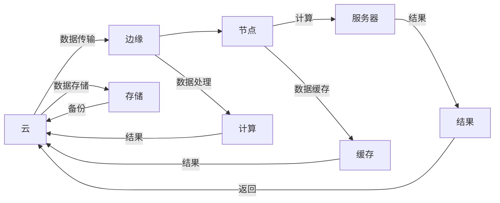

                 

# 软件2.0的云边协同计算框架

> 关键词：云原生,边缘计算,函数计算,云边协同,分布式计算,分布式系统

## 1. 背景介绍

在过去的几十年里，软件技术的演进经历了两次重大变革，即软件1.0和软件2.0时代。软件1.0时代以传统的单体应用为主，应用功能通过本地计算资源来实现，缺乏弹性、可扩展性和自动化。软件2.0时代则以微服务架构、DevOps、容器化和云原生等为核心，应用被设计成一组松耦合、可独立部署、可水平扩展的服务，通过基础设施即服务（IaaS）、平台即服务（PaaS）和软件即服务（SaaS）等方式，实现了应用的自动化、快速部署、弹性扩展和持续集成/持续交付（CI/CD）。

随着云原生技术的不断发展，云原生架构已经成为构建现代应用的重要基础。云原生应用能够提供更好的弹性、可伸缩性和自动化，使得应用的开发、部署、运维和更新变得更加高效和便捷。然而，传统的云原生架构也面临着一些挑战，如云的过度依赖、资源浪费和边缘计算的限制等。为了解决这些问题，云边协同计算框架应运而生。

## 2. 核心概念与联系

### 2.1 核心概念概述

云边协同计算框架是指将云和边缘计算结合起来，形成分布式计算架构，以应对大规模数据处理和实时计算的需求。它利用云的弹性和边缘计算的低时延特性，实现了云与边缘计算的协同工作，大大提升了系统的响应速度和数据处理能力。

核心概念包括：
- 云原生：一种基于容器化和微服务架构的软件开发和部署模式，以支持弹性、可扩展和自动化。
- 边缘计算：在数据源附近进行的分布式计算，以降低延迟、提高处理效率和增强可用性。
- 函数计算：一种事件驱动、按需计费的计算方式，使开发者只需编写函数代码，无需管理基础设施，即可轻松部署和运行应用。
- 分布式系统：由多个计算节点组成的系统，各节点协同工作，实现高效的数据处理和计算能力。

### 2.2 核心概念原理和架构的 Mermaid 流程图



### 2.3 核心概念联系

云边协同计算框架的核心概念通过数据和计算的协同工作，实现了云和边缘计算的相互补充和优化。云计算提供了弹性和高可用性，而边缘计算则提供了低时延和本地处理能力。函数计算则实现了事件驱动、按需计费的计算模式，简化了应用的开发和部署。分布式系统通过多个节点的协同工作，提升了系统的处理能力和容错性。

## 3. 核心算法原理 & 具体操作步骤

### 3.1 算法原理概述

云边协同计算框架的核心算法原理是分布式计算和事件驱动编程模型。分布式计算利用多个计算节点并行处理数据，通过分布式算法优化资源分配，提高系统的吞吐量和响应速度。事件驱动编程模型则基于事件的触发和响应，简化了应用的逻辑处理，提高了系统的灵活性和可扩展性。

### 3.2 算法步骤详解

云边协同计算框架的主要算法步骤包括：

1. **数据分发**：将数据分散传输到云和边缘计算节点，根据数据量和计算需求自动选择最佳的传输路径和节点。

2. **任务分配**：根据计算任务的规模和复杂度，将任务分配到不同的计算节点进行处理。

3. **数据处理**：在边缘计算节点上对数据进行初步处理和分析，减小数据传输量和计算负担。

4. **任务调度和执行**：根据任务执行状态和节点资源利用率，动态调整任务的执行顺序和资源分配。

5. **结果聚合**：将各节点处理结果汇总，并通过云和边缘计算的协同工作，进行最终的数据处理和结果返回。

6. **性能优化**：通过监控和反馈机制，对系统的性能进行实时调整和优化。

### 3.3 算法优缺点

云边协同计算框架的优点包括：

- 弹性和可扩展性：可以根据实际需求，动态调整计算资源和节点数，实现弹性扩展。
- 低时延和高可用性：边缘计算可以降低数据传输延迟，提高系统的可用性和可靠性。
- 简化开发和部署：函数计算和微服务架构简化了应用的开发和部署，提高了开发效率。
- 自动化和监控：云边协同计算框架提供了自动化的监控和优化机制，提高了系统的稳定性和性能。

缺点包括：

- 数据传输和存储：需要考虑数据的传输和存储问题，增加系统复杂性。
- 边缘计算成本：边缘计算设备需要较高的初始投资和维护成本。
- 跨域协同：需要解决跨域协同计算的问题，增加系统复杂度。

### 3.4 算法应用领域

云边协同计算框架在多个领域都有广泛的应用，包括：

- 智能制造：在工厂、生产线等场景中，利用边缘计算进行实时数据处理和决策，提升生产效率和质量。
- 智慧城市：在城市交通、环境监测、公共安全等领域，利用云边协同计算框架进行实时数据处理和分析，提升城市管理水平。
- 医疗健康：在远程医疗、智慧医疗等场景中，利用云边协同计算框架进行实时数据处理和分析，提升医疗服务的质量和效率。
- 金融服务：在金融交易、风险控制等领域，利用云边协同计算框架进行实时数据处理和分析，提升金融服务的安全性和效率。

## 4. 数学模型和公式 & 详细讲解 & 举例说明

### 4.1 数学模型构建

云边协同计算框架的数学模型主要涉及分布式计算、事件驱动编程模型和函数计算三个方面。

- **分布式计算模型**：利用MapReduce等分布式算法，对数据进行分布式处理，优化资源分配和任务执行。

- **事件驱动编程模型**：基于事件驱动模型，编写事件触发和响应代码，简化应用逻辑处理。

- **函数计算模型**：基于函数计算模型，编写函数代码，实现按需计费和自动化的应用部署。

### 4.2 公式推导过程

以MapReduce算法为例，假设数据集大小为$n$，每个节点处理的数据量为$m$，则MapReduce算法的计算时间$T$可以表示为：

$$ T = \frac{n}{m} \times \frac{n}{m} \times \frac{1}{p} \times c $$

其中$p$为节点数，$c$为节点计算速度。

### 4.3 案例分析与讲解

以智能制造为例，假设在工厂生产线中，每个节点处理的数据量为$10GB$，计算时间为$1ms$，则整个数据集的计算时间为$n=10GB$，每个节点的处理时间为$m=1ms$。假设工厂有$10$个节点，则整个数据集的计算时间为：

$$ T = \frac{10GB}{10GB} \times \frac{10GB}{10GB} \times \frac{1}{10} \times 1ms = 1ms $$

这表明，通过分布式计算，可以在较短的时间内处理大规模数据，大大提高了生产效率。

## 5. 项目实践：代码实例和详细解释说明

### 5.1 开发环境搭建

为了搭建云边协同计算框架，需要准备以下开发环境：

1. **云平台**：选择云平台，如AWS、Azure、Google Cloud等，搭建云基础设施。
2. **边缘计算设备**：选择适当的边缘计算设备，如边缘服务器、物联网设备等。
3. **函数计算框架**：选择函数计算框架，如AWS Lambda、Azure Functions、Google Cloud Functions等。
4. **分布式计算框架**：选择分布式计算框架，如Apache Hadoop、Apache Spark等。
5. **开发工具**：选择开发工具，如IDE、IDEA、Visual Studio Code等。

### 5.2 源代码详细实现

以下是一个简单的云边协同计算框架的实现示例，使用AWS Lambda和Apache Spark进行数据处理和分布式计算：

1. **云函数代码**：

```python
import os
import boto3
import pandas as pd

def lambda_handler(event, context):
    # 从AWS S3读取数据
    s3 = boto3.client('s3')
    bucket = 'my-bucket'
    key = 'my-data.csv'
    obj = s3.get_object(Bucket=bucket, Key=key)
    data = obj['Body'].read().decode('utf-8')
    df = pd.read_csv(data)
    
    # 分布式计算
    spark = SparkSession.builder.appName('my-app').getOrCreate()
    spark_data = spark.read.csv('hdfs://my-hdfs:9000/my-data.csv')
    
    # 函数计算
    result = {}
    for row in df.itertuples():
        result[row.key] = row.value
    
    # 返回结果
    return {'result': result}
```

2. **分布式计算代码**：

```python
from pyspark.sql import SparkSession
from pyspark.sql.functions import col

spark = SparkSession.builder.appName('my-app').getOrCreate()

# 读取数据
df = spark.read.csv('hdfs://my-hdfs:9000/my-data.csv', header=True)

# 数据处理
df = df.select(
    col('key').alias('key'),
    col('value').alias('value')
)

# 写入结果
df.write.csv('hdfs://my-hdfs:9000/my-result.csv', header=True)
```

### 5.3 代码解读与分析

- **云函数代码**：使用AWS Lambda函数，从AWS S3读取数据，利用Pandas进行数据处理，再使用Spark进行分布式计算。
- **分布式计算代码**：使用Apache Spark，读取HDFS上的数据，进行数据处理，并写入结果。

## 6. 实际应用场景

### 6.1 智能制造

在智能制造中，云边协同计算框架可以用于实时监控生产线，提高生产效率和质量。例如，工厂可以利用边缘计算设备实时监控生产线上的设备状态和数据，通过云边协同计算框架进行处理和分析，从而快速响应异常情况，优化生产流程。

### 6.2 智慧城市

在智慧城市中，云边协同计算框架可以用于实时监测城市交通、环境监测、公共安全等数据，提升城市管理水平。例如，城市可以利用边缘计算设备实时监测交通流量、环境污染等数据，通过云边协同计算框架进行处理和分析，从而实现智能交通、环境监测和应急响应等功能。

### 6.3 医疗健康

在医疗健康中，云边协同计算框架可以用于远程医疗、智慧医疗等场景，提高医疗服务的质量和效率。例如，医院可以利用边缘计算设备实时监测患者的生命体征数据，通过云边协同计算框架进行处理和分析，从而快速响应医疗需求，优化医疗服务流程。

## 7. 工具和资源推荐

### 7.1 学习资源推荐

为了深入了解云边协同计算框架，以下是一些推荐的资源：

1. **《云计算原理与实践》**：讲解云计算的基础知识和技术原理，包括云原生、函数计算和边缘计算。
2. **《分布式系统设计与实现》**：讲解分布式系统的设计原理和实现方法，包括MapReduce和Spark等分布式计算框架。
3. **《事件驱动编程：架构、模式和实践》**：讲解事件驱动编程模型的设计和实现方法，包括Spring Boot、Firebase等技术。

### 7.2 开发工具推荐

为了构建云边协同计算框架，以下是一些推荐的开发工具：

1. **AWS CLI**：AWS的命令行工具，方便管理和操作AWS云资源。
2. **AWS Management Console**：AWS的管理控制台，方便图形化管理云资源。
3. **Pyspark**：Apache Spark的Python API，方便进行分布式计算和数据处理。
4. **Spark UI**：Spark的管理界面，方便监控和调试分布式计算任务。
5. **AWS Lambda**：AWS的函数计算服务，方便编写和部署函数代码。

### 7.3 相关论文推荐

为了深入了解云边协同计算框架的研究现状和前沿技术，以下是一些推荐的论文：

1. **《Cloud-Edge Computing: A Survey》**：概述了云边协同计算框架的研究现状和未来发展方向。
2. **《Edge Computing in the Internet of Things: Opportunities and Challenges》**：讨论了边缘计算在物联网中的机遇和挑战，探讨了云边协同计算框架在物联网中的应用。
3. **《Event-driven Programming Models for Distributed Systems》**：探讨了事件驱动编程模型在分布式系统中的应用和实现方法。

## 8. 总结：未来发展趋势与挑战

### 8.1 研究成果总结

云边协同计算框架通过结合云和边缘计算的优势，实现了分布式计算和事件驱动编程模型的优化，大大提升了系统的响应速度和数据处理能力。它已经在多个领域得到了广泛应用，如智能制造、智慧城市、医疗健康等，展示了强大的应用前景。

### 8.2 未来发展趋势

云边协同计算框架的未来发展趋势包括：

1. **智能化和自动化**：云边协同计算框架将更加智能化和自动化，通过机器学习和人工智能技术，实现更高效的资源分配和任务执行。
2. **边缘计算优化**：边缘计算设备将更加高效和智能化，能够处理更多数据，实现更低时延和更高吞吐量。
3. **分布式系统优化**：分布式系统将更加高效和可靠，通过分布式算法优化资源分配和任务执行，提升系统的稳定性和性能。
4. **跨域协同优化**：云边协同计算框架将更加注重跨域协同计算的优化，实现数据和计算的更大范围整合和优化。

### 8.3 面临的挑战

云边协同计算框架在发展过程中也面临一些挑战：

1. **数据传输和存储**：需要考虑数据的传输和存储问题，增加系统复杂性。
2. **边缘计算成本**：边缘计算设备需要较高的初始投资和维护成本。
3. **跨域协同**：需要解决跨域协同计算的问题，增加系统复杂度。
4. **安全性**：云边协同计算框架需要保障数据和计算的安全性，避免数据泄露和计算误用。

### 8.4 研究展望

云边协同计算框架的研究展望包括：

1. **智能协同计算**：通过引入人工智能和机器学习技术，实现更智能的资源分配和任务执行。
2. **边缘计算优化**：进一步优化边缘计算设备，提升其处理能力和效率。
3. **分布式系统优化**：进一步优化分布式系统，提升其稳定性和性能。
4. **跨域协同优化**：进一步优化跨域协同计算，实现更大范围的数据和计算整合。

## 9. 附录：常见问题与解答

**Q1: 什么是云边协同计算框架？**

A: 云边协同计算框架是指将云和边缘计算结合起来，形成分布式计算架构，以应对大规模数据处理和实时计算的需求。它利用云的弹性和边缘计算的低时延特性，实现了云与边缘计算的协同工作，大大提升了系统的响应速度和数据处理能力。

**Q2: 云边协同计算框架有哪些优点和缺点？**

A: 云边协同计算框架的优点包括弹性和可扩展性、低时延和高可用性、简化开发和部署、自动化和监控。缺点包括数据传输和存储问题、边缘计算成本、跨域协同问题和安全性问题。

**Q3: 云边协同计算框架在实际应用中有哪些场景？**

A: 云边协同计算框架在智能制造、智慧城市、医疗健康等领域都有广泛应用。例如，在智能制造中，可以利用边缘计算设备实时监控生产线，提高生产效率和质量。在智慧城市中，可以利用边缘计算设备实时监测交通流量、环境污染等数据，提升城市管理水平。在医疗健康中，可以利用边缘计算设备实时监测患者的生命体征数据，提高医疗服务的质量和效率。

**Q4: 如何构建云边协同计算框架？**

A: 构建云边协同计算框架需要选择合适的云平台、边缘计算设备和函数计算框架，并搭建分布式计算基础设施。可以使用AWS Lambda和Apache Spark等工具进行数据处理和分布式计算，同时利用AWS CLI和AWS Management Console等工具进行云资源管理和监控。

**Q5: 云边协同计算框架的未来发展趋势是什么？**

A: 云边协同计算框架的未来发展趋势包括智能化和自动化、边缘计算优化、分布式系统优化和跨域协同优化。通过引入人工智能和机器学习技术，实现更智能的资源分配和任务执行。进一步优化边缘计算设备和分布式系统，提升其处理能力和效率。优化跨域协同计算，实现更大范围的数据和计算整合。

