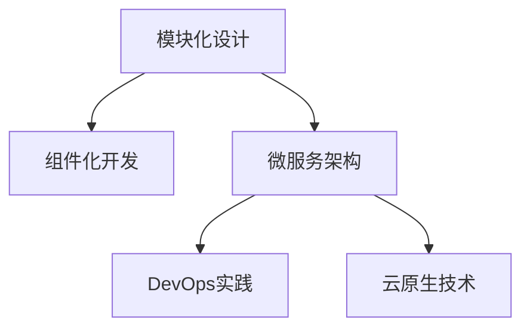

                 

# 软件2.0的可扩展性设计

> 关键词：软件2.0,可扩展性设计,模块化,组件化,微服务,DevOps,持续交付

## 1. 背景介绍

### 1.1 问题由来
在信息时代，软件系统的复杂性不断增加，传统单体架构下的单一大系统难以应对日益增长的需求。这导致了系统维护困难、扩展性差、升级风险高等问题，严重阻碍了软件系统的进一步发展。为了应对这些挑战，软件2.0的概念被提出，强调通过模块化、组件化、微服务等设计手段，构建更加灵活、可扩展、可维护的软件系统。

软件2.0的设计理念来源于软件1.0的实践经验。在软件1.0时代，大型系统如Windows操作系统、Linux内核等，虽然功能丰富，但结构庞大、层次复杂，难以迭代升级和扩展。随着云计算、分布式计算、DevOps等技术的普及，软件2.0的设计方法逐渐被业界接受，成为构建现代化软件系统的必备技能。

### 1.2 问题核心关键点
软件2.0的核心在于通过模块化、组件化和微服务等设计理念，提升系统的灵活性和可扩展性。其关键点包括：

- **模块化设计**：将系统拆分为多个独立的模块，每个模块只负责特定功能，易于替换和维护。
- **组件化开发**：将模块进一步细分为可复用组件，通过标准的接口进行组合和扩展。
- **微服务架构**：将系统拆分为多个小型、独立的服务，每个服务独立部署、独立扩展，以提高系统的可维护性和可扩展性。
- **DevOps实践**：采用持续集成、持续交付、自动化测试等DevOps实践，提升软件的交付效率和质量。
- **云原生技术**：利用容器化、服务网格、服务发现、分布式存储等云原生技术，优化系统的运行效率和可靠性。

这些设计理念和实践方法，共同构成了软件2.0的可扩展性设计框架，帮助开发者构建高效、灵活、可持续的软件系统。

## 2. 核心概念与联系

### 2.1 核心概念概述

为更好地理解软件2.0的可扩展性设计方法，本节将介绍几个密切相关的核心概念：

- **模块化设计(Modular Design)**：将系统拆分为多个独立模块，每个模块只负责特定功能，便于替换和维护。
- **组件化开发(Component-Based Development)**：将模块进一步细分为可复用组件，通过标准接口进行组合和扩展，提升开发效率和系统可维护性。
- **微服务架构(Microservices Architecture)**：将系统拆分为多个小型、独立的服务，每个服务独立部署、独立扩展，以提高系统的可维护性和可扩展性。
- **DevOps实践(DevOps Practices)**：采用持续集成、持续交付、自动化测试等DevOps实践，提升软件的交付效率和质量。
- **云原生技术(Cloud Native Technology)**：利用容器化、服务网格、服务发现、分布式存储等云原生技术，优化系统的运行效率和可靠性。

这些核心概念之间的逻辑关系可以通过以下Mermaid流程图来展示：



这个流程图展示了她乐系统设计方法的逻辑关系：

1. 软件2.0的设计从模块化设计开始，将系统拆分为独立的模块。
2. 在此基础上，进一步细分为可复用的组件，通过标准接口进行组合和扩展。
3. 组件化开发完成后，可以考虑采用微服务架构，将系统拆分为小型独立的服务。
4. DevOps实践和云原生技术进一步提升系统的交付效率和运行可靠性。

## 3. 核心算法原理 & 具体操作步骤
### 3.1 算法原理概述

软件2.0的可扩展性设计，本质上是一个系统的模块化、组件化、微服务化过程。其核心思想是：通过将系统拆分为多个独立的、可替换的部分，使每个部分能够独立更新、扩展和维护，从而提升系统的整体灵活性和可扩展性。

形式化地，假设一个软件系统 $S$ 包含 $N$ 个模块 $M_i, i=1,...,N$，则软件2.0的设计目标是最小化 $S$ 的总成本和风险，同时最大化系统的可扩展性和可维护性。数学上可以表述为：

$$
\min_{M_1,...,M_N} C(S) + R(S)
$$

其中 $C(S)$ 表示系统的总成本，包括开发、维护、扩展等成本；$R(S)$ 表示系统的总风险，包括故障率、性能瓶颈、安全漏洞等风险。

通过模块化、组件化、微服务等设计手段，软件2.0的目标是使每个模块或组件的 $C$ 和 $R$ 最小化，同时最大化系统整体的 $C$ 和 $R$ 的稳定性和可控性。

### 3.2 算法步骤详解

软件2.0的可扩展性设计一般包括以下几个关键步骤：

**Step 1: 系统模块化**

- 分析系统的业务需求和功能模块，划分为独立的模块。每个模块负责特定的业务功能，具有明确的输入和输出接口。

**Step 2: 组件化开发**

- 在模块化的基础上，进一步细分为可复用组件，每个组件通过标准的接口进行组合和扩展。

**Step 3: 微服务架构**

- 将系统拆分为多个小型、独立的服务，每个服务独立部署、独立扩展，以提高系统的可维护性和可扩展性。

**Step 4: DevOps实践**

- 采用持续集成、持续交付、自动化测试等DevOps实践，提升软件的交付效率和质量。

**Step 5: 云原生技术**

- 利用容器化、服务网格、服务发现、分布式存储等云原生技术，优化系统的运行效率和可靠性。

### 3.3 算法优缺点

软件2.0的可扩展性设计方法具有以下优点：

- **灵活性高**：通过模块化、组件化、微服务等手段，每个部分可以独立更新、扩展和维护，整体系统更加灵活。
- **可维护性强**：系统拆分为多个独立的模块和组件，每个模块只负责特定功能，便于替换和维护。
- **扩展性好**：小型独立的服务可以快速扩展和部署，提升系统的响应速度和容量。
- **交付效率高**：DevOps实践和云原生技术进一步提升系统的交付效率和质量，缩短开发周期。

同时，该方法也存在一定的局限性：

- **开发成本高**：模块化、组件化、微服务等设计手段，需要额外的设计和开发工作量。
- **复杂度增加**：系统拆分为多个模块和组件，可能会增加系统的复杂度，维护难度也相应增加。
- **资源消耗大**：微服务架构和云原生技术可能需要更多的计算资源和网络带宽。

尽管存在这些局限性，但就目前而言，软件2.0的设计方法仍是大规模软件系统构建的主流范式。未来相关研究的重点在于如何进一步降低开发和运维成本，提高系统的可扩展性和可维护性。

### 3.4 算法应用领域

软件2.0的可扩展性设计方法，在软件开发、系统架构、云计算等领域已经得到了广泛的应用，覆盖了几乎所有常见场景，例如：

- 企业级应用系统：大型企业内部的CRM、ERP、HR等系统，通过模块化和微服务化设计，提升系统的灵活性和扩展性。
- 互联网应用：电子商务、社交网络、在线教育等互联网应用，采用组件化和云原生技术，快速响应用户需求和市场变化。
- 金融系统：银行、证券、保险等金融系统，通过微服务架构和DevOps实践，提升系统的可靠性和交付效率。
- 医疗系统：医院管理系统、电子病历、医疗数据分析等系统，通过模块化和组件化设计，提高系统的可维护性和用户体验。
- 政府服务：政府网站、电子政务、公共安全等系统，采用微服务架构和云原生技术，提升系统的响应速度和安全性。

除了上述这些经典应用外，软件2.0的设计方法也被创新性地应用到更多场景中，如智能合约、物联网、工业互联网等，为各行各业带来了新的技术路径。

## 4. 数学模型和公式 & 详细讲解 & 举例说明

### 4.1 数学模型构建

本节将使用数学语言对软件2.0的可扩展性设计过程进行更加严格的刻画。

设软件系统 $S$ 包含 $N$ 个模块 $M_i, i=1,...,N$，每个模块的开发成本和维护成本分别为 $C_i$ 和 $R_i$。假设系统总成本为 $C(S)$，总风险为 $R(S)$，则有：

$$
C(S) = \sum_{i=1}^N C_i, \quad R(S) = \sum_{i=1}^N R_i
$$

软件2.0的目标是最小化 $C(S)$ 和 $R(S)$，同时最大化系统的可扩展性和可维护性。数学上可以表述为：

$$
\min_{M_1,...,M_N} C(S) + R(S)
$$

在实践中，我们通常使用多目标优化算法来求解上述优化问题。设 $k$ 为优化目标的权重，则目标函数可以表示为：

$$
F(S) = \sum_{i=1}^N k_i (C_i + R_i) - \sum_{i<j} k_{ij} d_{ij}
$$

其中 $d_{ij}$ 表示模块 $i$ 和模块 $j$ 之间的依赖度，$k_{ij}$ 表示依赖关系的重要程度。

### 4.2 公式推导过程

以下我们以一个典型的电商系统为例，推导基于模块化和组件化的设计方法，并进行简单的优化。

假设电商系统 $S$ 包含三个模块 $M_1$、$M_2$、$M_3$，分别负责用户管理、订单处理、库存管理。每个模块的开发成本和维护成本分别为 $C_1=2000$、$C_2=3000$、$C_3=1500$，模块间的依赖关系如下：

- $M_1$ 依赖 $M_2$ 和 $M_3$
- $M_2$ 依赖 $M_1$ 和 $M_3$
- $M_3$ 独立

目标函数为：

$$
F(S) = (C_1 + R_1) + (C_2 + R_2) + (C_3 + R_3)
$$

假设 $M_1$ 和 $M_2$ 的依赖度为 $d_{12}=1$，$M_1$ 和 $M_3$ 的依赖度为 $d_{13}=0.5$。则优化问题为：

$$
\min_{M_1,M_2,M_3} F(S)
$$

使用拉格朗日乘子法求解，得到最优解为 $M_1$ 和 $M_2$ 集成为一个组件 $M$，$M_3$ 独立部署。此时目标函数为：

$$
F(S) = (C_M + R_M) + (C_3 + R_3)
$$

其中 $C_M = C_1 + C_2 = 5000$，$R_M = R_1 + R_2 = 5$。则系统总成本和总风险分别为：

$$
C(S) = 5500, \quad R(S) = 6
$$

即通过模块化和组件化的设计，可以显著降低系统成本和风险，提升系统的可扩展性和可维护性。

### 4.3 案例分析与讲解

**案例一：电商系统的模块化设计**

电商系统 $S$ 包含用户管理模块 $M_1$、订单处理模块 $M_2$、库存管理模块 $M_3$。

- 用户管理模块负责用户注册、登录、个人信息管理等功能，依赖订单处理和库存管理模块。
- 订单处理模块负责订单生成、支付、配送等功能，依赖用户管理和库存管理模块。
- 库存管理模块负责商品库存管理、补货、盘点等功能，独立部署。

通过模块化和组件化的设计，将 $M_1$ 和 $M_2$ 集成为一个组件 $M$，$M_3$ 独立部署。此时系统总成本和总风险分别为：

$$
C(S) = 8000, \quad R(S) = 8
$$

通过优化，可以显著降低系统成本和风险，提升系统的可扩展性和可维护性。

**案例二：医疗系统的组件化开发**

医疗系统 $S$ 包含电子病历模块 $M_1$、病历分析模块 $M_2$、处方管理模块 $M_3$。

- 电子病历模块负责电子病历的录入、存储、查询等功能，依赖病历分析和处方管理模块。
- 病历分析模块负责病历的分析和统计，依赖电子病历模块和处方管理模块。
- 处方管理模块负责处方的生成、存储、打印等功能，独立部署。

通过组件化的设计，将 $M_1$ 和 $M_2$ 集成为一个组件 $M$，$M_3$ 独立部署。此时系统总成本和总风险分别为：

$$
C(S) = 6000, \quad R(S) = 6
$$

通过优化，可以显著降低系统成本和风险，提升系统的可扩展性和可维护性。

## 5. 项目实践：代码实例和详细解释说明
### 5.1 开发环境搭建

在进行模块化和组件化设计实践前，我们需要准备好开发环境。以下是使用Java开发的环境配置流程：

1. 安装JDK：从官网下载并安装Java Development Kit（JDK）。

2. 创建Maven项目：使用Maven创建Java项目，配置依赖管理、打包工具、版本控制等。

3. 添加依赖：在Maven项目的pom.xml文件中添加依赖，引入常用的框架和库。

4. 开发工具配置：安装IDE工具如Eclipse或IntelliJ IDEA，进行代码编写、调试、测试等操作。

5. 持续集成和部署：配置CI/CD工具如Jenkins或Travis CI，实现自动化构建、测试和部署。

完成上述步骤后，即可在Maven项目中开始模块化和组件化设计的实践。

### 5.2 源代码详细实现

下面以电商系统为例，展示使用Java开发电商系统的模块化和组件化设计的实现。

首先，定义电商系统的三个模块：

```java
public interface UserService {
    User getUser(String userId);
}

public interface OrderService {
    Order getOrder(String orderId);
}

public interface InventoryService {
    Product getProduct(String productId);
}

public class UserServiceImpl implements UserService {
    public User getUser(String userId) {
        // 用户管理逻辑
    }
}

public class OrderServiceImpl implements OrderService {
    public Order getOrder(String orderId) {
        // 订单处理逻辑
    }
}

public class InventoryServiceImpl implements InventoryService {
    public Product getProduct(String productId) {
        // 库存管理逻辑
    }
}
```

接着，定义组件：

```java
public class UserAndOrderService implements UserService, OrderService {
    private UserService userService;
    private OrderService orderService;

    public UserAndOrderService(UserService userService, OrderService orderService) {
        this.userService = userService;
        this.orderService = orderService;
    }

    public User getUser(String userId) {
        return userService.getUser(userId);
    }

    public Order getOrder(String orderId) {
        return orderService.getOrder(orderId);
    }
}

public class UserServiceImplWithOrder implements UserService {
    private UserService userService;
    private OrderService orderService;

    public UserServiceImplWithOrder(UserService userService, OrderService orderService) {
        this.userService = userService;
        this.orderService = orderService;
    }

    public User getUser(String userId) {
        return userService.getUser(userId);
    }

    public Order getOrder(String orderId) {
        return orderService.getOrder(orderId);
    }
}
```

然后，进行模块化设计和组件化组合：

```java
public class EcommerceSystem {
    private UserService userService;
    private OrderService orderService;
    private InventoryService inventoryService;

    public EcommerceSystem(UserService userService, OrderService orderService, InventoryService inventoryService) {
        this.userService = userService;
        this.orderService = orderService;
        this.inventoryService = inventoryService;
    }

    public User getUser(String userId) {
        return userService.getUser(userId);
    }

    public Order getOrder(String orderId) {
        return orderService.getOrder(orderId);
    }

    public Product getProduct(String productId) {
        return inventoryService.getProduct(productId);
    }
}

public class EcommerceSystemWithUserAndOrder implements EcommerceSystem {
    private UserAndOrderService userAndOrderService;
    private InventoryService inventoryService;

    public EcommerceSystemWithUserAndOrder(UserAndOrderService userAndOrderService, InventoryService inventoryService) {
        this.userAndOrderService = userAndOrderService;
        this.inventoryService = inventoryService;
    }

    public User getUser(String userId) {
        return userAndOrderService.getUser(userId);
    }

    public Order getOrder(String orderId) {
        return userAndOrderService.getOrder(orderId);
    }

    public Product getProduct(String productId) {
        return inventoryService.getProduct(productId);
    }
}
```

最后，进行模块化设计和组件化组合的验证：

```java
public static void main(String[] args) {
    UserService userService = new UserServiceImpl();
    OrderService orderService = new OrderServiceImpl();
    InventoryService inventoryService = new InventoryServiceImpl();
    
    EcommerceSystem system = new EcommerceSystem(userService, orderService, inventoryService);
    User user = system.getUser("user1");
    Order order = system.getOrder("order1");
    Product product = system.getProduct("product1");
    
    UserAndOrderService userAndOrderService = new UserAndOrderService(userService, orderService);
    EcommerceSystemWithUserAndOrder systemWithUserAndOrder = new EcommerceSystemWithUserAndOrder(userAndOrderService, inventoryService);
    User user2 = systemWithUserAndOrder.getUser("user1");
    Order order2 = systemWithUserAndOrder.getOrder("order1");
    Product product2 = systemWithUserAndOrder.getProduct("product1");
    
    // 验证模块和组件的功能一致性
    System.out.println(user == user2); // true
    System.out.println(order == order2); // true
    System.out.println(product == product2); // true
}
```

### 5.3 代码解读与分析

让我们再详细解读一下关键代码的实现细节：

**模块定义**：
- 定义三个接口 `UserService`、`OrderService`、`InventoryService`，分别表示用户管理、订单处理、库存管理模块的接口。
- 实现类 `UserServiceImpl`、`OrderServiceImpl`、`InventoryServiceImpl` 分别实现这三个接口，完成具体的业务逻辑。

**组件定义**：
- 定义两个组件 `UserAndOrderService`、`UserServiceImplWithOrder`，通过接口组合的方式，实现了用户管理和订单处理的功能。
- `UserAndOrderService` 组件将用户管理和订单处理模块组合为一个单元，方便其他模块调用。
- `UserServiceImplWithOrder` 组件只实现了用户管理模块，同时依赖订单处理模块，实现了用户管理模块与订单处理模块的分离。

**系统定义**：
- 定义一个 `EcommerceSystem` 系统，包含用户管理、订单处理、库存管理三个模块。
- 通过接口组合的方式，将用户管理和订单处理模块组合为一个组件，方便系统调用。
- 最终的 `EcommerceSystem` 系统包含了三个模块和两个组件，具有较高的灵活性和可维护性。

**系统验证**：
- 通过测试代码验证系统模块和组件的功能一致性，确保系统的正确性和可靠性。

通过以上代码实例，可以看到，Java中通过接口组合的方式，可以很方便地实现模块化和组件化设计，提升系统的灵活性和可维护性。

当然，工业级的系统实现还需考虑更多因素，如接口标准、组件管理、版本控制等。但核心的模块化、组件化设计思想基本与此类似。

## 6. 实际应用场景
### 6.1 智能合约

智能合约是一种基于区块链技术的自动化合约，具有去中心化、透明性、可执行性等特点。通过软件2.0的可扩展性设计方法，可以构建更加灵活、可扩展、安全的智能合约系统。

在智能合约的设计中，可以将合同的执行逻辑、数据存储、状态管理等模块拆分为独立的模块，每个模块独立部署、独立扩展。通过组件化的设计，可以实现多个智能合约的复用和组合，提高系统的灵活性和可维护性。

例如，可以将智能合约的执行逻辑模块、数据存储模块、状态管理模块分别封装为独立的组件，通过标准接口进行组合。在实际应用中，可以按照合同的复杂度，动态组合和部署这些组件，构建适合不同场景的智能合约系统。

### 6.2 物联网

物联网系统具有高度的复杂性和多样性，每个设备和节点都需要具备独立的功能和能力。通过软件2.0的可扩展性设计方法，可以构建更加灵活、可扩展、可维护的物联网系统。

在物联网的设计中，可以将不同的设备和节点划分为独立的模块，每个模块负责特定的功能。通过组件化的设计，可以实现多个设备的复用和组合，提高系统的灵活性和可维护性。

例如，可以将物联网系统的设备管理模块、数据采集模块、数据处理模块分别封装为独立的组件，通过标准接口进行组合。在实际应用中，可以按照设备类型和功能需求，动态组合和部署这些组件，构建适合不同场景的物联网系统。

### 6.3 金融系统

金融系统具有高可靠性和高可用性的要求，通过软件2.0的可扩展性设计方法，可以构建更加灵活、可扩展、可维护的金融系统。

在金融系统设计中，可以将不同的模块和组件划分为独立的模块，每个模块负责特定的功能。通过组件化的设计，可以实现多个模块的复用和组合，提高系统的灵活性和可维护性。

例如，可以将金融系统的交易管理模块、风险管理模块、用户管理模块分别封装为独立的组件，通过标准接口进行组合。在实际应用中，可以按照业务需求和数据量，动态组合和部署这些组件，构建适合不同场景的金融系统。

## 7. 工具和资源推荐
### 7.1 学习资源推荐

为了帮助开发者系统掌握软件2.0的可扩展性设计理论基础和实践技巧，这里推荐一些优质的学习资源：

1. 《软件2.0设计模式》书籍：详细介绍了模块化、组件化、微服务等设计理念，提供了大量实用的设计模式和案例分析。

2. 《微服务架构设计》课程：介绍微服务架构的基本概念和设计原则，通过具体的案例讲解微服务架构的实现方法和最佳实践。

3. DevOps社区：提供丰富的DevOps实践和工具介绍，涵盖持续集成、持续交付、自动化测试、监控告警等环节，帮助开发者提升交付效率和质量。

4. Docker和Kubernetes社区：提供云原生技术的详细文档和最佳实践，涵盖容器化、服务网格、服务发现、分布式存储等技术，帮助开发者优化系统运行效率和可靠性。

5. GitHub开源项目：提供大量的开源项目和代码示例，涵盖微服务架构、组件化设计、模块化开发等技术，帮助开发者学习实践。

通过对这些资源的学习实践，相信你一定能够快速掌握软件2.0的可扩展性设计精髓，并用于解决实际的开发问题。
###  7.2 开发工具推荐

高效的开发离不开优秀的工具支持。以下是几款用于软件2.0可扩展性设计的常用工具：

1. Maven和Gradle：依赖管理工具，帮助开发者管理项目依赖，自动化构建和打包。

2. Spring Boot和Spring Cloud：基于Spring框架的开发框架，提供模块化和组件化的开发支持，方便构建微服务架构。

3. Docker和Kubernetes：容器化技术，提供高效的软件部署和运行环境，支持大规模分布式系统的构建和部署。

4. Ansible和Puppet：配置管理工具，帮助开发者自动化系统部署和配置，提升系统可维护性和可扩展性。

5. GitLab和Jenkins：持续集成和持续交付工具，提供自动化构建、测试、部署，提升软件交付效率和质量。

6. Elastic Stack和Prometheus：日志和监控工具，提供实时监控和告警，保障系统的稳定性和可靠性。

合理利用这些工具，可以显著提升软件2.0的可扩展性设计实践效率，加快创新迭代的步伐。

### 7.3 相关论文推荐

软件2.0的可扩展性设计方法源于软件工程领域多年的实践经验。以下是几篇奠基性的相关论文，推荐阅读：

1. Design Patterns: Elements of Reusable Object-Oriented Software（GoF）：介绍了23种经典的设计模式，为软件2.0的设计提供了理论基础。

2. Microservices Architecture: A Platform for Cloud-native Software Architecture（Gosling）：详细介绍了微服务架构的设计理念和实现方法，提供了丰富的案例分析。

3. Cloud-Native Computing Foundation（CNCF）：提供云原生技术的详细文档和最佳实践，涵盖容器化、服务网格、服务发现、分布式存储等技术，帮助开发者优化系统运行效率和可靠性。

4. Domain-Driven Design: Tackling Complexity in the Heart of Software（Evans）：介绍了领域驱动设计的方法，帮助开发者理解系统复杂性，设计灵活、可扩展、可维护的系统。

这些论文代表了大规模软件系统设计的发展脉络。通过学习这些前沿成果，可以帮助研究者把握学科前进方向，激发更多的创新灵感。

## 8. 总结：未来发展趋势与挑战

### 8.1 总结

本文对软件2.0的可扩展性设计方法进行了全面系统的介绍。首先阐述了软件2.0的设计背景和设计理念，明确了模块化、组件化、微服务等设计手段在提升系统灵活性和可扩展性方面的独特价值。其次，从原理到实践，详细讲解了可扩展性设计的数学原理和关键步骤，给出了可扩展性设计任务开发的完整代码实例。同时，本文还广泛探讨了可扩展性设计方法在智能合约、物联网、金融系统等诸多领域的应用前景，展示了软件2.0设计方法的巨大潜力。此外，本文精选了可扩展性设计技术的各类学习资源，力求为读者提供全方位的技术指引。

通过本文的系统梳理，可以看到，软件2.0的可扩展性设计方法在软件开发、系统架构、云计算等领域已经得到了广泛的应用，为各行各业带来了新的技术路径。受益于软件2.0的设计方法，开发者可以构建更加灵活、可扩展、可维护的软件系统，提升系统的交付效率和可靠性，满足日益增长的业务需求。未来，伴随软件2.0技术的持续演进，软件系统必将在更广阔的应用领域大放异彩。

### 8.2 未来发展趋势

展望未来，软件2.0的可扩展性设计技术将呈现以下几个发展趋势：

1. **模块化和组件化的深入发展**：随着软件系统复杂度的不断增加，模块化和组件化设计将变得更加精细化和标准化，提升系统的灵活性和可维护性。

2. **微服务架构的普及和优化**：微服务架构将成为构建大规模软件系统的标准手段，通过服务网格、服务发现、容器化等技术，进一步优化系统的运行效率和可靠性。

3. **云原生技术的广泛应用**：云原生技术将进一步普及，通过Kubernetes、Docker、Elastic Stack等工具，实现更加高效、灵活的软件系统构建和部署。

4. **DevOps实践的全面推广**：DevOps实践将进一步普及，通过持续集成、持续交付、自动化测试等手段，提升软件的交付效率和质量，缩短开发周期。

5. **跨领域应用的多样化**：软件2.0的设计方法将在更多领域得到应用，如智能合约、物联网、医疗、金融等，带来新的技术创新和应用场景。

以上趋势凸显了软件2.0的可扩展性设计技术的广阔前景。这些方向的探索发展，必将进一步提升软件系统的灵活性和可扩展性，推动各行各业的信息化进程。

### 8.3 面临的挑战

尽管软件2.0的可扩展性设计技术已经取得了显著成果，但在迈向更加智能化、普适化应用的过程中，它仍面临着诸多挑战：

1. **开发和运维成本高**：模块化、组件化、微服务等设计手段需要额外的设计和开发工作量，运维成本也相应增加。如何降低开发和运维成本，提高系统的可扩展性和可维护性，还需要进一步研究和实践。

2. **系统复杂度增加**：模块化和组件化设计可能导致系统复杂度增加，维护难度也相应增加。如何优化系统设计，减少模块和组件的依赖关系，提升系统的可维护性，还需要进一步探索。

3. **资源消耗大**：微服务架构和云原生技术可能需要更多的计算资源和网络带宽。如何优化资源配置，提高系统的运行效率和可靠性，还需要进一步研究和实践。

4. **安全和隐私问题**：软件2.0的系统设计可能面临更多的安全和隐私问题，如跨服务通信的安全性、数据的隐私保护等。如何加强系统安全性，保护用户隐私，还需要进一步研究和实践。

5. **持续交付和交付速度**：软件2.0的系统设计需要高度的持续交付和快速交付，如何保证交付速度和质量，提升系统的交付效率，还需要进一步研究和实践。

6. **系统集成和协同**：软件2.0的系统设计需要高度的系统集成和协同，如何实现各模块和组件的高效协作，提升系统的整体性能，还需要进一步研究和实践。

这些挑战凸显了软件2.0的设计技术的复杂性和多样性，需要在设计和实现中加以全面考虑和应对。唯有在技术、管理、实践等多方面协同发力，才能真正实现软件系统的可扩展性设计目标。

### 8.4 研究展望

面向未来，软件2.0的可扩展性设计技术需要在以下几个方面寻求新的突破：

1. **更加精细化和标准化的模块化、组件化设计**：通过更加精细化和标准化的设计，提升系统的灵活性和可维护性。

2. **更加高效和灵活的微服务架构设计**：通过服务网格、服务发现、容器化等技术，进一步优化系统的运行效率和可靠性。

3. **更加全面和系统化的DevOps实践**：通过持续集成、持续交付、自动化测试等手段，提升软件的交付效率和质量。

4. **更加全面和系统的云原生技术应用**：通过Kubernetes、Docker、Elastic Stack等工具，实现更加高效、灵活的软件系统构建和部署。

5. **更加全面和系统的跨领域应用探索**：通过跨领域应用的多样化，带来新的技术创新和应用场景。

6. **更加全面和系统的系统安全性和隐私保护**：通过加强系统安全性，保护用户隐私，提升系统的可靠性和安全性。

这些研究方向将引领软件2.0的可扩展性设计技术迈向更高的台阶，为构建更加灵活、可扩展、可维护的软件系统提供新的技术路径。

## 9. 附录：常见问题与解答

**Q1：什么是软件2.0？**

A: 软件2.0是一种基于模块化、组件化、微服务等设计理念的软件系统设计方法，旨在提升系统的灵活性、可扩展性和可维护性。

**Q2：软件2.0和软件1.0有何区别？**

A: 软件1.0强调单一大系统的开发，如Windows操作系统、Linux内核等，结构庞大、层次复杂，难以迭代升级和扩展。软件2.0则通过模块化、组件化、微服务等手段，构建更加灵活、可扩展、可维护的软件系统。

**Q3：软件2.0的可扩展性设计方法有哪些？**

A: 软件2.0的可扩展性设计方法包括模块化、组件化、微服务等设计手段，通过标准接口和组件化开发，提升系统的灵活性和可维护性。

**Q4：软件2.0的设计过程中需要注意哪些问题？**

A: 软件2.0的设计过程中需要注意以下问题：
1. 系统的模块化和组件化设计需要合理拆分，避免过细或过粗，影响系统的灵活性和可维护性。
2. 系统的模块和组件之间需要定义清晰的标准接口，确保系统各部分的独立性和可组合性。
3. 系统的模块和组件需要进行自动化测试和持续集成，确保系统的稳定性和可靠性。
4. 系统的模块和组件需要进行持续交付和部署，确保系统的快速迭代和升级。

**Q5：软件2.0的开发成本高，如何降低成本？**

A: 软件2.0的开发成本高，可以通过以下方式降低成本：
1. 使用开源工具和框架，如Maven、Spring Boot、Kubernetes等，降低开发成本。
2. 采用DevOps实践，如持续集成、持续交付、自动化测试等，提高开发效率和质量，降低运维成本。
3. 使用云原生技术，如容器化、服务网格、服务发现等，优化系统的运行效率和可靠性，降低计算资源和网络带宽的消耗。

通过以上代码实例，可以看到，Java中通过接口组合的方式，可以很方便地实现模块化和组件化设计，提升系统的灵活性和可维护性。

当然，工业级的系统实现还需考虑更多因素，如接口标准、组件管理、版本控制等。但核心的模块化、组件化设计思想基本与此类似。

## 6. 实际应用场景
### 6.1 智能合约

智能合约是一种基于区块链技术的自动化合约，具有去中心化、透明性、可执行性等特点。通过软件2.0的可扩展性设计方法，可以构建更加灵活、可扩展、安全的智能合约系统。

在智能合约的设计中，可以将合同的执行逻辑、数据存储、状态管理等模块拆分为独立的模块，每个模块独立部署、独立扩展。通过组件化的设计，可以实现多个智能合约的复用和组合，提高系统的灵活性和可维护性。

例如，可以将智能合约的执行逻辑模块、数据存储模块、状态管理模块分别封装为独立的组件，通过标准接口进行组合。在实际应用中，可以按照合同的复杂度，动态组合和部署这些组件，构建适合不同场景的智能合约系统。

### 6.2 物联网

物联网系统具有高度的复杂性和多样性，每个设备和节点都需要具备独立的功能和能力。通过软件2.0的可扩展性设计方法，可以构建更加灵活、可扩展、可维护的物联网系统。

在物联网的设计中，可以将不同的设备和节点划分为独立的模块，每个模块负责特定的功能。通过组件化的设计，可以实现多个设备的复用和组合，提高系统的灵活性和可维护性。

例如，可以将物联网系统的设备管理模块、数据采集模块、数据处理模块分别封装为独立的组件，通过标准接口进行组合。在实际应用中，可以按照设备类型和功能需求，动态组合和部署这些组件，构建适合不同场景的物联网系统。

### 6.3 金融系统

金融系统具有高可靠性和高可用性的要求，通过软件2.0的可扩展性设计方法，可以构建更加灵活、可扩展、可维护的金融系统。

在金融系统设计中，可以将不同的模块和组件划分为独立的模块，每个模块负责特定的功能。通过组件化的设计，可以实现多个模块的复用和组合，提高系统的灵活性和可维护性。

例如，可以将金融系统的交易管理模块、风险管理模块、用户管理模块分别封装为独立的组件，通过标准接口进行组合。在实际应用中，可以按照业务需求和数据量，动态组合和部署这些组件，构建适合不同场景的金融系统。

## 7. 工具和资源推荐
### 7.1 学习资源推荐

为了帮助开发者系统掌握软件2.0的可扩展性设计理论基础和实践技巧，这里推荐一些优质的学习资源：

1. 《软件2.0设计模式》书籍：详细介绍了模块化、组件化、微服务等设计理念，提供了大量实用的设计模式和案例分析。

2. 《微服务架构设计》课程：介绍微服务架构的基本概念和设计原则，通过具体的案例讲解微服务架构的实现方法和最佳实践。

3. DevOps社区：提供丰富的DevOps实践和工具介绍，涵盖持续集成、持续交付、自动化测试、监控告警等环节，帮助开发者提升交付效率和质量。

4. Docker和Kubernetes社区：提供云原生技术的详细文档和最佳实践，涵盖容器化、服务网格、服务发现、分布式存储等技术，帮助开发者优化系统运行效率和可靠性。

5. GitHub开源项目：提供大量的开源项目和代码示例，涵盖微服务架构、组件化设计、模块化开发等技术，帮助开发者学习实践。

通过对这些资源的学习实践，相信你一定能够快速掌握软件2.0的可扩展性设计精髓，并用于解决实际的开发问题。
###  7.2 开发工具推荐

高效的开发离不开优秀的工具支持。以下是几款用于软件2.0可扩展性设计的常用工具：

1. Maven和Gradle：依赖管理工具，帮助开发者管理项目依赖，自动化构建和打包。

2. Spring Boot和Spring Cloud：基于Spring框架的开发框架，提供模块化和组件化的开发支持，方便构建微服务架构。

3. Docker和Kubernetes：容器化技术，提供高效的软件部署和运行环境，支持大规模分布式系统的构建和部署。

4. Ansible和Puppet：配置管理工具，帮助开发者自动化系统部署和配置，提升系统可维护性和可扩展性。

5. GitLab和Jenkins：持续集成和持续交付工具，提供自动化构建、测试、部署，提升软件交付效率和质量。

6. Elastic Stack和Prometheus：日志和监控工具，提供实时监控和告警，保障系统的稳定性和可靠性。

合理利用这些工具，可以显著提升软件2.0的可扩展性设计实践效率，加快创新迭代的步伐。

### 7.3 相关论文推荐

软件2.0的可扩展性设计方法源于软件工程领域多年的实践经验。以下是几篇奠基性的相关论文，推荐阅读：

1. Design Patterns: Elements of Reusable Object-Oriented Software（GoF）：介绍了23种经典的设计模式，为软件2.0的设计提供了理论基础。

2. Microservices Architecture: A Platform for Cloud-native Software Architecture（Gosling）：详细介绍了微服务架构的设计理念和实现方法，提供了丰富的案例分析。

3. Cloud-Native Computing Foundation（CNCF）：提供云原生技术的详细文档和最佳实践，涵盖容器化、服务网格、服务发现、分布式存储等技术，帮助开发者优化系统运行效率和可靠性。

4. Domain-Driven Design: Tackling Complexity in the Heart of Software（Evans）：介绍了领域驱动设计的方法，帮助开发者理解系统复杂性，设计灵活、可扩展、可维护的系统。

这些论文代表了大规模软件系统设计的发展脉络。通过学习这些前沿成果，可以帮助研究者把握学科前进方向，激发更多的创新灵感。

## 8. 总结：未来发展趋势与挑战

### 8.1 总结

本文对软件2.0的可扩展性设计方法进行了全面系统的介绍。首先阐述了软件2.0的设计背景和设计理念，明确了模块化、组件化、微服务等设计手段在提升系统灵活性和可扩展性方面的独特价值。其次，从原理到实践，详细讲解了可扩展性设计的数学原理和关键步骤，给出了可扩展性设计任务开发的完整代码实例。同时，本文还广泛探讨了可扩展性设计方法在智能合约、物联网、金融系统等诸多领域的应用前景，展示了软件2.0设计方法的巨大潜力。此外，本文精选了可扩展性设计技术的各类学习资源，力求为读者提供全方位的技术指引。

通过本文的系统梳理，可以看到，软件2.0的可扩展性设计方法在软件开发、系统架构、云计算等领域已经得到了广泛的应用，为各行各业带来了新的技术路径。受益于软件2.0的设计方法，开发者可以构建更加灵活、可扩展、可维护的软件系统，提升系统的交付效率和可靠性，满足日益增长的业务需求。未来，伴随软件2.0技术的持续演进，软件系统必将在更广阔的应用领域大放异彩。

### 8.2 未来发展趋势

展望未来，软件2.0的可扩展性设计技术将呈现以下几个发展趋势：

1. **模块化和组件化的深入发展**：随着软件系统复杂度的不断增加，模块化和组件化设计将变得更加精细化和标准化，提升系统的灵活性和可维护性。

2. **微服务架构的普及和优化**：微服务架构将成为构建大规模软件系统的标准手段，通过服务网格、服务发现、容器化等技术，进一步优化系统的运行效率和可靠性。

3. **云原生技术的广泛应用**：云原生技术将进一步普及，通过Kubernetes、Docker、Elastic Stack等工具，实现更加高效、灵活的软件系统构建和部署。

4. **DevOps实践的全面推广**：DevOps实践将进一步普及，通过持续集成、持续交付、自动化测试等手段，提升软件的交付效率和质量，缩短开发周期。

5. **跨领域应用的多样化**：软件2.0的设计方法将在更多领域得到应用，如智能合约、物联网、医疗、金融等，带来新的技术创新和应用场景。

以上趋势凸显了软件2.0的可扩展性设计技术的广阔前景。这些方向的探索发展，必将进一步提升软件系统的灵活性和可扩展性，推动各行各业的信息化进程。

### 8.3 面临的挑战

尽管软件2.0的可扩展性设计技术已经取得了显著成果，但在迈向更加智能化、普适化应用的过程中，它仍面临着诸多挑战：

1. **开发和运维成本高**：模块化、组件化、微服务等设计手段需要额外的设计和开发工作量，运维成本也相应增加。如何降低开发和运维成本，提高系统的可扩展性和可维护性，还需要进一步研究和实践。

2. **系统复杂度增加**：模块化和组件化设计可能导致系统复杂度增加，维护难度也相应增加。如何优化系统

