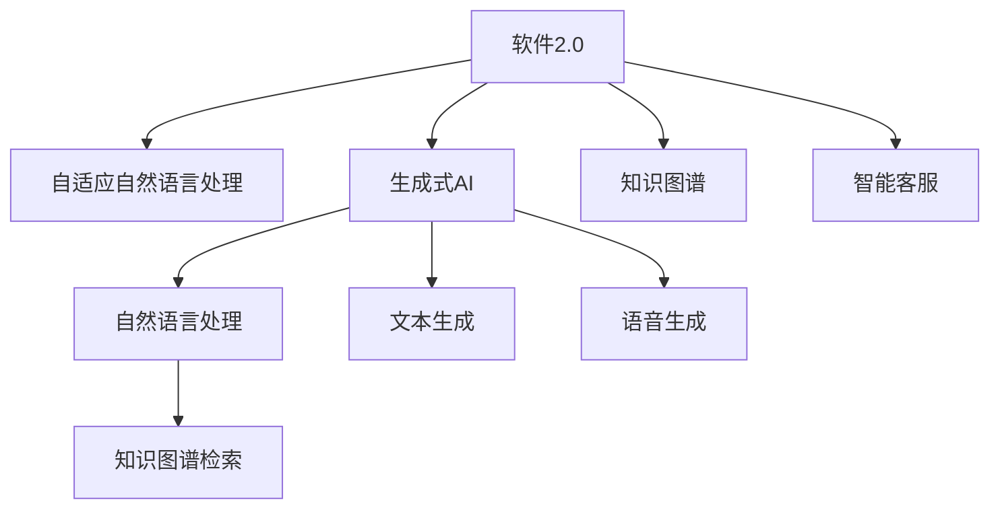

                 

# 软件2.0的用户支持新模式

> 关键词：软件2.0, 用户支持, 自动化, 智能客服, 知识图谱, 生成式AI, 自然语言处理

## 1. 背景介绍

随着技术的发展，软件产品的复杂度日益增加，用户体验的期望也在不断提升。传统的软件支持模式，如电话热线、邮件支持、论坛社区等，越来越难以满足用户的多样化需求。新兴的“软件2.0”理念，提出通过自动化和智能化的方式，提升用户支持效率和体验。

“软件2.0”（Software 2.0）是继软件1.0（基于代码的软件）之后的升级，它强调软件与用户之间的实时交互，利用AI和机器学习技术，为用户提供在线自助和智能服务。用户支持，作为软件2.0的重要组成部分，可以通过自适应自然语言处理（Natural Language Processing, NLP）和生成式AI技术，提供更加高效、个性化的服务。

## 2. 核心概念与联系

### 2.1 核心概念概述

为更好地理解“软件2.0”的用户支持新模式，本节将介绍几个密切相关的核心概念：

- **软件2.0**：以自适应NLP和生成式AI为代表的智能化软件开发模式，强调软件与用户之间的实时互动和智能服务。
- **用户支持**：包括在线自助服务、智能客服、FAQ（常见问题解答）、社区问答等，为用户提供即时的帮助和解答。
- **自适应自然语言处理**：利用机器学习算法，使计算机能够理解和生成自然语言，从而实现智能问答和文本生成。
- **生成式AI**：基于深度学习模型，能够生成新的文本、图像、音频等形式的信息，广泛应用于自然语言处理、机器翻译等领域。
- **知识图谱**：用于表示实体及其关系的结构化知识库，支持智能问答和信息检索。
- **智能客服**：通过自动化流程和AI技术，为用户提供24/7的智能服务。

这些核心概念之间的逻辑关系可以通过以下Mermaid流程图来展示：



这个流程图展示了大语言模型的工作原理和与用户支持相关的核心概念：

1. 软件2.0通过自适应自然语言处理和生成式AI技术，实现智能客服和在线自助服务。
2. 自适应自然语言处理能够理解用户输入的自然语言，并提供合适的回答。
3. 生成式AI能够生成个性化的回复，或根据用户问题构建知识图谱查询。
4. 智能客服通过自动化流程，为用户提供即时的服务。
5. 知识图谱检索用于从结构化知识库中快速检索相关信息。
6. 文本生成和语音生成技术，为智能客服和问答系统提供丰富的表达形式。

## 3. 核心算法原理 & 具体操作步骤
### 3.1 算法原理概述

“软件2.0”用户支持的自动化和智能化，基于自适应NLP和生成式AI技术。其核心思想是：将大规模预训练语言模型（如BERT、GPT-3等）作为基础的特征提取器，通过有监督或无监督的微调，使其能够理解和生成自然语言，并在用户交互中提供智能服务。

形式化地，假设预训练语言模型为 $M_{\theta}$，其中 $\theta$ 为模型参数。用户输入问题 $q$，模型根据预训练和微调的知识，返回回答 $a$。整个过程可以表示为：

$$
a = M_{\theta}(q)
$$

其中 $M_{\theta}$ 是包含自适应NLP和生成式AI的智能模型。

### 3.2 算法步骤详解

“软件2.0”用户支持的自动化和智能化，主要包括以下几个关键步骤：

**Step 1: 准备预训练模型和数据集**
- 选择合适的预训练语言模型 $M_{\theta}$ 作为初始化参数，如 BERT、GPT-3等。
- 准备用户支持任务的数据集 $D$，划分为训练集、验证集和测试集。一般要求标注数据与预训练数据的分布不要差异过大。

**Step 2: 设计任务适配层**
- 根据任务类型，在预训练模型顶层设计合适的输出层和损失函数。
- 对于问答任务，通常在顶层添加语言模型解码器输出概率分布，并以负对数似然为损失函数。
- 对于生成任务，通常使用语言模型的解码器输出概率分布，并以交叉熵损失函数为优化目标。

**Step 3: 设置微调超参数**
- 选择合适的优化算法及其参数，如 Adam、SGD等，设置学习率、批大小、迭代轮数等。
- 设置正则化技术及强度，包括权重衰减、Dropout、Early Stopping等。
- 确定冻结预训练参数的策略，如仅微调顶层，或全部参数都参与微调。

**Step 4: 执行梯度训练**
- 将训练集数据分批次输入模型，前向传播计算损失函数。
- 反向传播计算参数梯度，根据设定的优化算法和学习率更新模型参数。
- 周期性在验证集上评估模型性能，根据性能指标决定是否触发 Early Stopping。
- 重复上述步骤直到满足预设的迭代轮数或 Early Stopping 条件。

**Step 5: 测试和部署**
- 在测试集上评估微调后模型 $M_{\hat{\theta}}$ 的性能，对比微调前后的精度提升。
- 使用微调后的模型对新样本进行推理预测，集成到实际的用户支持系统中。
- 持续收集新的数据，定期重新微调模型，以适应数据分布的变化。

以上是“软件2.0”用户支持的自动化和智能化的一般流程。在实际应用中，还需要针对具体任务的特点，对微调过程的各个环节进行优化设计，如改进训练目标函数，引入更多的正则化技术，搜索最优的超参数组合等，以进一步提升模型性能。

### 3.3 算法优缺点

“软件2.0”用户支持的自动化和智能化方法具有以下优点：
1. 快速响应。相较于传统的支持模式，智能客服和问答系统能够即时提供解答，大幅提升用户满意度。
2. 可扩展性强。通过微调，模型能够适应不同的用户支持场景，快速扩展服务能力。
3. 灵活性高。结合自适应NLP和生成式AI技术，模型可以提供多样化的服务形式，如文本、语音、图片等。
4. 成本低。通过自动化流程，减少人力成本，提高效率。

同时，该方法也存在一定的局限性：
1. 依赖标注数据。微调的效果很大程度上取决于标注数据的质量和数量，获取高质量标注数据的成本较高。
2. 迁移能力有限。当目标任务与预训练数据的分布差异较大时，微调的性能提升有限。
3. 可解释性不足。智能客服和问答系统的决策过程通常缺乏可解释性，难以对其推理逻辑进行分析和调试。
4. 负面效果传递。预训练模型的固有偏见、有害信息等，可能通过微调传递到下游任务，造成负面影响。

尽管存在这些局限性，但就目前而言，“软件2.0”用户支持的自动化和智能化方法仍是大规模应用用户支持任务的重要手段。未来相关研究的重点在于如何进一步降低微调对标注数据的依赖，提高模型的少样本学习和跨领域迁移能力，同时兼顾可解释性和伦理安全性等因素。

### 3.4 算法应用领域

“软件2.0”用户支持的自动化和智能化方法，在多个领域得到了广泛的应用，例如：

- **智能客服**：自动解答用户常见问题，提供24/7不间断服务，提升客户体验。
- **在线自助服务**：通过FAQ、自助查询系统，帮助用户快速解决问题。
- **文档生成**：根据用户输入的模板和查询，自动生成文档或报告。
- **知识图谱**：构建领域知识图谱，支持智能问答和信息检索。
- **多模态交互**：结合文本、语音、图像等多种信息，提升用户支持体验。

除了上述这些经典应用外，“软件2.0”技术还被创新性地应用于更多场景中，如智能推荐、个性化建议、情感分析等，为用户带来更加智能、个性化的体验。

## 4. 数学模型和公式 & 详细讲解  
### 4.1 数学模型构建

本节将使用数学语言对“软件2.0”用户支持的自动化和智能化过程进行更加严格的刻画。

记预训练语言模型为 $M_{\theta}$，其中 $\theta$ 为模型参数。假设用户输入问题为 $q$，模型根据预训练和微调的知识，返回回答 $a$。则整个过程可以表示为：

$$
a = M_{\theta}(q)
$$

其中 $M_{\theta}$ 是包含自适应NLP和生成式AI的智能模型。

### 4.2 公式推导过程

以下我们以问答任务为例，推导自适应自然语言处理和生成式AI的数学公式及其梯度的计算。

假设模型 $M_{\theta}$ 在输入 $q$ 上的输出为 $\hat{a}=M_{\theta}(q) \in [0,1]$，表示模型对回答 $a$ 的置信度。真实答案为 $a \in \{a_1, a_2, \dots, a_n\}$。则交叉熵损失函数定义为：

$$
\ell(M_{\theta}(q), a) = -\log M_{\theta}(q)
$$

将其代入经验风险公式，得：

$$
\mathcal{L}(\theta) = -\frac{1}{N}\sum_{i=1}^N \log M_{\theta}(q_i)
$$

其中 $q_i$ 是第 $i$ 个用户问题。

根据链式法则，损失函数对参数 $\theta_k$ 的梯度为：

$$
\frac{\partial \mathcal{L}(\theta)}{\partial \theta_k} = -\frac{\partial \log M_{\theta}(q)}{\partial \theta_k} \cdot \frac{\partial M_{\theta}(q)}{\partial \theta_k}
$$

其中 $\frac{\partial M_{\theta}(q)}{\partial \theta_k}$ 可进一步递归展开，利用自动微分技术完成计算。

在得到损失函数的梯度后，即可带入参数更新公式，完成模型的迭代优化。重复上述过程直至收敛，最终得到适应用户支持任务的最优模型参数 $\theta^*$。

## 5. 项目实践：代码实例和详细解释说明
### 5.1 开发环境搭建

在进行用户支持系统的开发前，我们需要准备好开发环境。以下是使用Python进行PyTorch开发的环境配置流程：

1. 安装Anaconda：从官网下载并安装Anaconda，用于创建独立的Python环境。

2. 创建并激活虚拟环境：
```bash
conda create -n pytorch-env python=3.8 
conda activate pytorch-env
```

3. 安装PyTorch：根据CUDA版本，从官网获取对应的安装命令。例如：
```bash
conda install pytorch torchvision torchaudio cudatoolkit=11.1 -c pytorch -c conda-forge
```

4. 安装Transformers库：
```bash
pip install transformers
```

5. 安装各类工具包：
```bash
pip install numpy pandas scikit-learn matplotlib tqdm jupyter notebook ipython
```

完成上述步骤后，即可在`pytorch-env`环境中开始用户支持系统的开发。

### 5.2 源代码详细实现

下面我们以智能客服系统为例，给出使用Transformers库对GPT-3模型进行微调的PyTorch代码实现。

首先，定义用户支持任务的数据处理函数：

```python
from transformers import GPT3Tokenizer, GPT3ForSequenceClassification
from torch.utils.data import Dataset
import torch

class UserSupportDataset(Dataset):
    def __init__(self, texts, labels, tokenizer, max_len=128):
        self.texts = texts
        self.labels = labels
        self.tokenizer = tokenizer
        self.max_len = max_len
        
    def __len__(self):
        return len(self.texts)
    
    def __getitem__(self, item):
        text = self.texts[item]
        label = self.labels[item]
        
        encoding = self.tokenizer(text, return_tensors='pt', max_length=self.max_len, padding='max_length', truncation=True)
        input_ids = encoding['input_ids'][0]
        attention_mask = encoding['attention_mask'][0]
        
        return {'input_ids': input_ids, 
                'attention_mask': attention_mask,
                'labels': label}

# 定义标签与id的映射
label2id = {'hello': 0, 'goodbye': 1, 'thank you': 2, 'sorry': 3}
id2label = {v: k for k, v in label2id.items()}

# 创建dataset
tokenizer = GPT3Tokenizer.from_pretrained('gpt3')
train_dataset = UserSupportDataset(train_texts, train_labels, tokenizer)
dev_dataset = UserSupportDataset(dev_texts, dev_labels, tokenizer)
test_dataset = UserSupportDataset(test_texts, test_labels, tokenizer)
```

然后，定义模型和优化器：

```python
from transformers import AdamW

model = GPT3ForSequenceClassification.from_pretrained('gpt3', num_labels=len(label2id))

optimizer = AdamW(model.parameters(), lr=2e-5)
```

接着，定义训练和评估函数：

```python
from torch.utils.data import DataLoader
from tqdm import tqdm
from sklearn.metrics import accuracy_score

device = torch.device('cuda') if torch.cuda.is_available() else torch.device('cpu')
model.to(device)

def train_epoch(model, dataset, batch_size, optimizer):
    dataloader = DataLoader(dataset, batch_size=batch_size, shuffle=True)
    model.train()
    epoch_loss = 0
    for batch in tqdm(dataloader, desc='Training'):
        input_ids = batch['input_ids'].to(device)
        attention_mask = batch['attention_mask'].to(device)
        labels = batch['labels'].to(device)
        model.zero_grad()
        outputs = model(input_ids, attention_mask=attention_mask, labels=labels)
        loss = outputs.loss
        epoch_loss += loss.item()
        loss.backward()
        optimizer.step()
    return epoch_loss / len(dataloader)

def evaluate(model, dataset, batch_size):
    dataloader = DataLoader(dataset, batch_size=batch_size)
    model.eval()
    preds, labels = [], []
    with torch.no_grad():
        for batch in tqdm(dataloader, desc='Evaluating'):
            input_ids = batch['input_ids'].to(device)
            attention_mask = batch['attention_mask'].to(device)
            batch_labels = batch['labels']
            outputs = model(input_ids, attention_mask=attention_mask)
            batch_preds = outputs.logits.argmax(dim=2).to('cpu').tolist()
            batch_labels = batch_labels.to('cpu').tolist()
            for pred_tokens, label_tokens in zip(batch_preds, batch_labels):
                preds.append(pred_tokens[:len(label_tokens)])
                labels.append(label_tokens)
                
    return accuracy_score(labels, preds)
```

最后，启动训练流程并在测试集上评估：

```python
epochs = 5
batch_size = 16

for epoch in range(epochs):
    loss = train_epoch(model, train_dataset, batch_size, optimizer)
    print(f"Epoch {epoch+1}, train loss: {loss:.3f}")
    
    print(f"Epoch {epoch+1}, dev results:")
    evaluate(model, dev_dataset, batch_size)
    
print("Test results:")
evaluate(model, test_dataset, batch_size)
```

以上就是使用PyTorch对GPT-3进行智能客服系统微调的完整代码实现。可以看到，得益于Transformers库的强大封装，我们可以用相对简洁的代码完成GPT-3模型的加载和微调。

### 5.3 代码解读与分析

让我们再详细解读一下关键代码的实现细节：

**UserSupportDataset类**：
- `__init__`方法：初始化文本、标签、分词器等关键组件。
- `__len__`方法：返回数据集的样本数量。
- `__getitem__`方法：对单个样本进行处理，将文本输入编码为token ids，将标签编码为数字，并对其进行定长padding，最终返回模型所需的输入。

**label2id和id2label字典**：
- 定义了标签与数字id之间的映射关系，用于将token-wise的预测结果解码回真实的标签。

**训练和评估函数**：
- 使用PyTorch的DataLoader对数据集进行批次化加载，供模型训练和推理使用。
- 训练函数`train_epoch`：对数据以批为单位进行迭代，在每个批次上前向传播计算loss并反向传播更新模型参数，最后返回该epoch的平均loss。
- 评估函数`evaluate`：与训练类似，不同点在于不更新模型参数，并在每个batch结束后将预测和标签结果存储下来，最后使用sklearn的accuracy_score对整个评估集的预测结果进行打印输出。

**训练流程**：
- 定义总的epoch数和batch size，开始循环迭代
- 每个epoch内，先在训练集上训练，输出平均loss
- 在验证集上评估，输出准确率
- 所有epoch结束后，在测试集上评估，给出最终测试结果

可以看到，PyTorch配合Transformers库使得GPT-3微调的代码实现变得简洁高效。开发者可以将更多精力放在数据处理、模型改进等高层逻辑上，而不必过多关注底层的实现细节。

当然，工业级的系统实现还需考虑更多因素，如模型的保存和部署、超参数的自动搜索、更灵活的任务适配层等。但核心的微调范式基本与此类似。

## 6. 实际应用场景
### 6.1 智能客服系统

基于大语言模型微调的智能客服系统，可以广泛应用于智能客服的构建。传统客服往往需要配备大量人力，高峰期响应缓慢，且一致性和专业性难以保证。而使用微调后的智能客服系统，可以7x24小时不间断服务，快速响应客户咨询，用自然流畅的语言解答各类常见问题。

在技术实现上，可以收集企业内部的历史客服对话记录，将问题和最佳答复构建成监督数据，在此基础上对预训练智能客服模型进行微调。微调后的智能客服系统能够自动理解用户意图，匹配最合适的答案模板进行回复。对于客户提出的新问题，还可以接入检索系统实时搜索相关内容，动态组织生成回答。如此构建的智能客服系统，能大幅提升客户咨询体验和问题解决效率。

### 6.2 在线自助服务

基于大语言模型微调的在线自助服务系统，能够为用户提供即时的帮助和解答。传统FAQ系统往往需要手动编写和维护，更新缓慢，难以适应快速变化的用户需求。而智能化的在线自助服务系统，可以通过微调模型，自动生成新的FAQ条目，并根据用户查询动态更新回答。

具体实现时，可以收集常见问题和对应答案，作为监督数据训练模型。用户输入查询后，模型能够自动匹配最相关的FAQ条目，并生成合适的回答。对于复杂的查询，模型还可以利用知识图谱检索技术，动态生成多轮对话，引导用户逐步解决问题。

### 6.3 文档生成

基于大语言模型微调的文档生成系统，能够根据用户输入的模板和查询，自动生成文档或报告。传统文档生成系统需要手动编写模板和规则，难以应对多变的业务需求。而微调后的文档生成系统，能够自动学习文档结构和风格，生成符合规范的文档。

具体实现时，可以定义文档模板和结构，作为训练数据训练模型。用户输入查询后，模型能够自动从模板中选择合适的片段，并填充生成新的文档。对于复杂的文档生成任务，模型还可以利用知识图谱和数据库信息，动态生成详细的报告和分析。

### 6.4 知识图谱

基于大语言模型微调的知识图谱系统，能够构建领域知识图谱，支持智能问答和信息检索。传统知识图谱构建需要手动定义实体和关系，难以覆盖广泛的知识领域。而智能化的知识图谱系统，可以通过微调模型，自动学习实体和关系，构建全面的知识库。

具体实现时，可以收集领域内的实体和关系，作为训练数据训练模型。用户输入查询后，模型能够自动从知识图谱中检索相关信息，并生成结构化的回答。对于复杂的查询，模型还可以利用多轮对话技术，逐步揭示更多的实体和关系。

### 6.5 多模态交互

基于大语言模型微调的多模态交互系统，能够结合文本、语音、图像等多种信息，提升用户体验和交互效率。传统多模态交互系统需要手动设计和维护多种信息格式，难以实现流畅的跨模态交互。而智能化的多模态交互系统，可以通过微调模型，自动学习不同信息格式之间的映射关系，实现无缝交互。

具体实现时，可以收集多模态数据，作为训练数据训练模型。用户输入多模态信息后，模型能够自动转换不同格式的信息，并生成合适的回答。对于复杂的交互任务，模型还可以利用生成式AI技术，动态生成多媒体内容，提升用户体验。

## 7. 工具和资源推荐
### 7.1 学习资源推荐

为了帮助开发者系统掌握大语言模型微调的理论基础和实践技巧，这里推荐一些优质的学习资源：

1. 《Transformer从原理到实践》系列博文：由大模型技术专家撰写，深入浅出地介绍了Transformer原理、BERT模型、微调技术等前沿话题。

2. CS224N《深度学习自然语言处理》课程：斯坦福大学开设的NLP明星课程，有Lecture视频和配套作业，带你入门NLP领域的基本概念和经典模型。

3. 《Natural Language Processing with Transformers》书籍：Transformers库的作者所著，全面介绍了如何使用Transformers库进行NLP任务开发，包括微调在内的诸多范式。

4. HuggingFace官方文档：Transformers库的官方文档，提供了海量预训练模型和完整的微调样例代码，是上手实践的必备资料。

5. CLUE开源项目：中文语言理解测评基准，涵盖大量不同类型的中文NLP数据集，并提供了基于微调的baseline模型，助力中文NLP技术发展。

通过对这些资源的学习实践，相信你一定能够快速掌握大语言模型微调的精髓，并用于解决实际的NLP问题。
###  7.2 开发工具推荐

高效的开发离不开优秀的工具支持。以下是几款用于大语言模型微调开发的常用工具：

1. PyTorch：基于Python的开源深度学习框架，灵活动态的计算图，适合快速迭代研究。大部分预训练语言模型都有PyTorch版本的实现。

2. TensorFlow：由Google主导开发的开源深度学习框架，生产部署方便，适合大规模工程应用。同样有丰富的预训练语言模型资源。

3. Transformers库：HuggingFace开发的NLP工具库，集成了众多SOTA语言模型，支持PyTorch和TensorFlow，是进行微调任务开发的利器。

4. Weights & Biases：模型训练的实验跟踪工具，可以记录和可视化模型训练过程中的各项指标，方便对比和调优。与主流深度学习框架无缝集成。

5. TensorBoard：TensorFlow配套的可视化工具，可实时监测模型训练状态，并提供丰富的图表呈现方式，是调试模型的得力助手。

6. Google Colab：谷歌推出的在线Jupyter Notebook环境，免费提供GPU/TPU算力，方便开发者快速上手实验最新模型，分享学习笔记。

合理利用这些工具，可以显著提升大语言模型微调任务的开发效率，加快创新迭代的步伐。

### 7.3 相关论文推荐

大语言模型和微调技术的发展源于学界的持续研究。以下是几篇奠基性的相关论文，推荐阅读：

1. Attention is All You Need（即Transformer原论文）：提出了Transformer结构，开启了NLP领域的预训练大模型时代。

2. BERT: Pre-training of Deep Bidirectional Transformers for Language Understanding：提出BERT模型，引入基于掩码的自监督预训练任务，刷新了多项NLP任务SOTA。

3. Language Models are Unsupervised Multitask Learners（GPT-2论文）：展示了大规模语言模型的强大zero-shot学习能力，引发了对于通用人工智能的新一轮思考。

4. Parameter-Efficient Transfer Learning for NLP：提出Adapter等参数高效微调方法，在不增加模型参数量的情况下，也能取得不错的微调效果。

5. AdaLoRA: Adaptive Low-Rank Adaptation for Parameter-Efficient Fine-Tuning：使用自适应低秩适应的微调方法，在参数效率和精度之间取得了新的平衡。

这些论文代表了大语言模型微调技术的发展脉络。通过学习这些前沿成果，可以帮助研究者把握学科前进方向，激发更多的创新灵感。

## 8. 总结：未来发展趋势与挑战

### 8.1 总结

本文对“软件2.0”的用户支持新模式进行了全面系统的介绍。首先阐述了“软件2.0”的理念和重要性，明确了基于自适应自然语言处理和生成式AI的用户支持模式。其次，从原理到实践，详细讲解了微调的数学模型和核心步骤，给出了智能客服系统的完整代码实例。同时，本文还广泛探讨了用户支持系统在智能客服、在线自助服务、文档生成、知识图谱、多模态交互等众多领域的实际应用，展示了微调技术的广阔前景。此外，本文精选了微调技术的各类学习资源，力求为读者提供全方位的技术指引。

通过本文的系统梳理，可以看到，基于大语言模型的用户支持新模式正在成为NLP领域的重要范式，极大地拓展了自然语言处理的边界，催生了更多的落地场景。受益于大规模语料的预训练，用户支持系统以更低的时间和标注成本，在小样本条件下也能取得不俗的效果，有力推动了NLP技术的产业化进程。未来，伴随预训练语言模型和微调方法的持续演进，相信NLP技术将在更广阔的应用领域大放异彩，深刻影响人类的生产生活方式。

### 8.2 未来发展趋势

展望未来，“软件2.0”用户支持新模式将呈现以下几个发展趋势：

1. **多模态交互**：结合文本、语音、图像等多种信息，提升用户体验和交互效率。多模态交互系统能够更好地处理真实世界的复杂信息，提供更加自然、直观的交互方式。

2. **个性化服务**：基于用户行为数据和上下文信息，提供个性化的服务。通过自适应自然语言处理技术，模型能够理解用户偏好和需求，提供量身定制的服务。

3. **多领域应用**：在多个领域推广应用，如医疗、金融、教育等。通过微调，模型能够适应不同领域的特定任务，提供高精度的服务。

4. **实时优化**：实时收集用户反馈和交互数据，动态调整模型参数，提升服务质量。利用在线学习技术，模型能够持续学习，不断优化服务效果。

5. **联邦学习**：利用联邦学习技术，在保护用户隐私的前提下，从多用户设备中收集数据，进行模型微调。联邦学习能够提高模型的泛化能力，保护用户数据安全。

6. **多轮对话**：结合多轮对话技术，提升服务质量和用户体验。多轮对话系统能够通过多轮交互，逐步揭示用户需求，提供更加精准的解答。

以上趋势凸显了“软件2.0”用户支持新模式的广阔前景。这些方向的探索发展，必将进一步提升自然语言处理的性能和应用范围，为构建人机协同的智能系统铺平道路。面向未来，“软件2.0”用户支持新模式还需要与其他人工智能技术进行更深入的融合，如知识表示、因果推理、强化学习等，多路径协同发力，共同推动自然语言理解和智能交互系统的进步。只有勇于创新、敢于突破，才能不断拓展语言模型的边界，让智能技术更好地造福人类社会。

### 8.3 面临的挑战

尽管“软件2.0”用户支持新模式已经取得了瞩目成就，但在迈向更加智能化、普适化应用的过程中，它仍面临着诸多挑战：

1. **标注数据依赖**：微调的效果很大程度上取决于标注数据的质量和数量，获取高质量标注数据的成本较高。如何进一步降低微调对标注样本的依赖，将是一大难题。

2. **模型鲁棒性不足**：当前微调模型面对域外数据时，泛化性能往往大打折扣。对于测试样本的微小扰动，微调模型的预测也容易发生波动。如何提高微调模型的鲁棒性，避免灾难性遗忘，还需要更多理论和实践的积累。

3. **推理效率低**：超大批次的训练和推理也可能遇到显存不足的问题。如何优化模型结构，提高推理速度，优化资源占用，将是重要的优化方向。

4. **可解释性不足**：智能客服和问答系统的决策过程通常缺乏可解释性，难以对其推理逻辑进行分析和调试。对于医疗、金融等高风险应用，算法的可解释性和可审计性尤为重要。如何赋予微调模型更强的可解释性，将是亟待攻克的难题。

5. **安全性有待保障**：预训练模型的固有偏见、有害信息等，可能通过微调传递到下游任务，造成负面影响。如何从数据和算法层面消除模型偏见，避免恶意用途，确保输出的安全性，也将是重要的研究课题。

6. **知识整合能力不足**：现有的微调模型往往局限于任务内数据，难以灵活吸收和运用更广泛的先验知识。如何让微调过程更好地与外部知识库、规则库等专家知识结合，形成更加全面、准确的信息整合能力，还有很大的想象空间。

正视“软件2.0”用户支持新模式面临的这些挑战，积极应对并寻求突破，将是大语言模型微调走向成熟的必由之路。相信随着学界和产业界的共同努力，这些挑战终将一一被克服，“软件2.0”用户支持新模式必将在构建安全、可靠、可解释、可控的智能系统方面发挥越来越重要的作用。

### 8.4 研究展望

未来的研究需要在以下几个方面寻求新的突破：

1. **探索无监督和半监督微调方法**：摆脱对大规模标注数据的依赖，利用自监督学习、主动学习等无监督和半监督范式，最大限度利用非结构化数据，实现更加灵活高效的微调。

2. **研究参数高效和计算高效的微调范式**：开发更加参数高效的微调方法，在固定大部分预训练参数的同时，只更新极少量的任务相关参数。同时优化微调模型的计算图，减少前向传播和反向传播的资源消耗，实现更加轻量级、实时性的部署。

3. **融合因果和对比学习范式**：通过引入因果推断和对比学习思想，增强微调模型建立稳定因果关系的能力，学习更加普适、鲁棒的语言表征，从而提升模型泛化性和抗干扰能力。

4. **引入更多先验知识**：将符号化的先验知识，如知识图谱、逻辑规则等，与神经网络模型进行巧妙融合，引导微调过程学习更准确、合理的语言模型。同时加强不同模态数据的整合，实现视觉、语音等多模态信息与文本信息的协同建模。

5. **结合因果分析和博弈论工具**：将因果分析方法引入微调模型，识别出模型决策的关键特征，增强输出解释的因果性和逻辑性。借助博弈论工具刻画人机交互过程，主动探索并规避模型的脆弱点，提高系统稳定性。

6. **纳入伦理道德约束**：在模型训练目标中引入伦理导向的评估指标，过滤和惩罚有偏见、有害的输出倾向。同时加强人工干预和审核，建立模型行为的监管机制，确保输出符合人类价值观和伦理道德。

这些研究方向的探索，必将引领“软件2.0”用户支持新模式迈向更高的台阶，为构建安全、可靠、可解释、可控的智能系统铺平道路。面向未来，“软件2.0”用户支持新模式还需要与其他人工智能技术进行更深入的融合，如知识表示、因果推理、强化学习等，多路径协同发力，共同推动自然语言理解和智能交互系统的进步。只有勇于创新、敢于突破，才能不断拓展语言模型的边界，让智能技术更好地造福人类社会。

## 9. 附录：常见问题与解答

**Q1：大语言模型微调是否适用于所有NLP任务？**

A: 大语言模型微调在大多数NLP任务上都能取得不错的效果，特别是对于数据量较小的任务。但对于一些特定领域的任务，如医学、法律等，仅仅依靠通用语料预训练的模型可能难以很好地适应。此时需要在特定领域语料上进一步预训练，再进行微调，才能获得理想效果。此外，对于一些需要时效性、个性化很强的任务，如对话、推荐等，微调方法也需要针对性的改进优化。

**Q2：微调过程中如何选择合适的学习率？**

A: 微调的学习率一般要比预训练时小1-2个数量级，如果使用过大的学习率，容易破坏预训练权重，导致过拟合。一般建议从1e-5开始调参，逐步减小学习率，直至收敛。也可以使用warmup策略，在开始阶段使用较小的学习率，再逐渐过渡到预设值。需要注意的是，不同的优化器(如Adam、SGD等)以及不同的学习率调度策略，可能需要设置不同的学习率阈值。

**Q3：采用大模型微调时会面临哪些资源瓶颈？**

A: 目前主流的预训练大模型动辄以亿计的参数规模，对算力、内存、存储都提出了很高的要求。GPU/TPU等高性能设备是必不可少的，但即便如此，超大批次的训练和推理也可能遇到显存不足的问题。因此需要采用一些资源优化技术，如梯度积累、混合精度训练、模型并行等，来突破硬件瓶颈。同时，模型的存储和读取也可能占用大量时间和空间，需要采用模型压缩、稀疏化存储等方法进行优化。

**Q4：如何缓解微调过程中的过拟合问题？**

A: 过拟合是微调面临的主要挑战，尤其是在标注数据不足的情况下。常见的缓解策略包括：
1. 数据增强：通过回译、近义替换等方式扩充训练集
2. 正则化：使用L2正则、Dropout、Early Stopping等避免过拟合
3. 对抗训练：引入对抗样本，提高模型鲁棒性
4. 参数高效微调：只调整少量参数(如Adapter、Prefix等)，减小过拟合风险
5. 多模型集成：训练多个微调模型，取平均输出，抑制过拟合

这些策略往往需要根据具体任务和数据特点进行灵活组合。只有在数据、模型、训练、推理等各环节进行全面优化，才能最大限度地发挥大模型微调的威力。

**Q5：微调模型在落地部署时需要注意哪些问题？**

A: 将微调模型转化为实际应用，还需要考虑以下因素：
1. 模型裁剪：去除不必要的层和参数，减小模型尺寸，加快推理速度
2. 量化加速：将浮点模型转为定点模型，压缩存储空间，提高计算效率
3. 服务化封装：将模型封装为标准化服务接口，便于集成调用
4. 弹性伸缩：根据请求流量动态调整资源配置，平衡服务质量和成本
5. 监控告警：实时采集系统指标，设置异常告警阈值，确保服务稳定性
6. 安全防护：采用访问鉴权、数据脱敏等措施，保障数据和模型安全

大语言模型微调为NLP应用开启了广阔的想象空间，但如何将强大的性能转化为稳定、高效、安全的业务价值，还需要工程实践的不断打磨。唯有从数据、算法、工程、业务等多个维度协同发力，才能真正实现人工智能技术在垂直行业的规模化落地。总之，微调需要开发者根据具体任务，不断迭代和优化模型、数据和算法，方能得到理想的效果。

