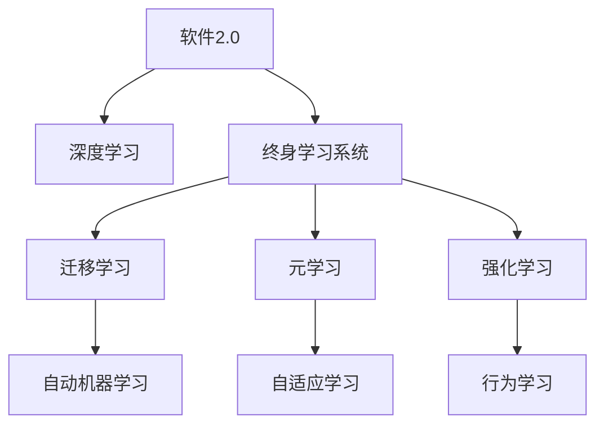

                 

# 软件2.0的终身学习系统设计

## 1. 背景介绍

随着人工智能(AI)技术的不断进步，软件系统正逐步从“以数据为中心”的软件1.0时代，迈向“以模型为中心”的软件2.0时代。软件2.0系统的核心特征是通过模型驱动的自动化、智能化，为人类提供更为智能、高效的服务。终身学习系统作为软件2.0的重要组成，是实现自我更新、自我适应的关键技术。

软件2.0的终身学习系统，依赖于大规模的、高质量的数据训练大模型，通过有监督或无监督的学习过程，使系统具备自我更新和适应的能力，能够随着环境变化和用户需求的变化而持续提升性能，成为软件系统与动态环境互动的桥梁。

终身学习系统是软件2.0的核心技术，但也是面临最多挑战的技术之一。本文将深入探讨软件2.0的终身学习系统的核心概念、算法原理、具体实现及应用场景，为读者提供全面的技术指引。

## 2. 核心概念与联系

### 2.1 核心概念概述

为更好地理解软件2.0的终身学习系统，本节将介绍几个密切相关的核心概念：

- 软件2.0（Software 2.0）：一种基于模型驱动的软件架构，利用AI和ML技术，使软件系统具备自我更新、自我适应的能力，不断提升其性能和服务质量。
- 终身学习系统（Lifelong Learning System）：一种自适应、自我更新的软件系统，能够不断从环境中学习和适应的系统。
- 深度学习（Deep Learning）：一种基于多层神经网络的机器学习技术，利用大规模数据进行训练，能够自动提取数据的高级特征。
- 迁移学习（Transfer Learning）：一种将在一个任务上学习到的知识迁移到另一个相关任务上的技术。
- 元学习（Meta Learning）：一种学习如何学习的技术，使系统能够快速适应新任务，缩短学习时间。
- 强化学习（Reinforcement Learning）：一种通过与环境交互，利用奖励机制不断优化行为策略的学习方法。

这些核心概念之间的逻辑关系可以通过以下Mermaid流程图来展示：



这个流程图展示出软件2.0的终身学习系统的核心概念及其之间的关系：

1. 软件2.0通过深度学习技术，获得数据的高级特征表示。
2. 终身学习系统依赖深度学习模型，实现自适应、自我更新。
3. 迁移学习、元学习和强化学习是终身学习系统中的重要技术，使系统具备快速适应新任务的能力。

## 3. 核心算法原理 & 具体操作步骤

### 3.1 算法原理概述

软件2.0的终身学习系统基于深度学习模型，通过有监督或无监督学习，使系统能够不断适应新环境和用户需求。核心算法原理可以归纳为以下几个方面：

- **监督学习（Supervised Learning）**：利用标注数据训练模型，使模型能够根据输入数据输出正确的标签或结果。监督学习常用于分类、回归等任务。
- **无监督学习（Unsupervised Learning）**：利用无标注数据训练模型，使模型能够自动发现数据中的规律和结构。无监督学习常用于聚类、降维等任务。
- **迁移学习（Transfer Learning）**：利用在某个任务上训练好的模型，迁移到另一个相关任务上进行微调，减少新任务上的学习成本。
- **元学习（Meta Learning）**：通过训练模型在多个相关任务上进行泛化，使模型能够快速适应新任务。
- **强化学习（Reinforcement Learning）**：通过与环境交互，利用奖励机制不断优化行为策略，使模型能够适应动态环境。

### 3.2 算法步骤详解

软件2.0的终身学习系统通常包括以下几个关键步骤：

**Step 1: 数据收集和预处理**
- 收集和整理目标任务的数据集，确保数据的多样性和代表性。
- 对数据进行清洗、去重、标注等预处理工作，为模型训练提供高质量的数据。

**Step 2: 模型选择和初始化**
- 选择合适的深度学习模型架构，如卷积神经网络（CNN）、循环神经网络（RNN）、Transformer等。
- 对模型进行初始化，利用预训练模型或随机初始化参数。

**Step 3: 模型训练和微调**
- 利用有监督或无监督学习算法对模型进行训练，优化模型参数。
- 针对特定任务进行微调，调整模型的输出层和损失函数，使其适应新任务。

**Step 4: 模型评估和部署**
- 在验证集和测试集上评估模型性能，确保模型泛化能力。
- 将模型部署到实际应用中，通过API接口或服务化方式提供服务。

**Step 5: 持续学习和适应用户需求**
- 收集用户反馈和环境变化信息，不断调整模型参数，适应新需求。
- 使用强化学习等技术，优化模型行为策略，提升用户体验。

### 3.3 算法优缺点

软件2.0的终身学习系统具有以下优点：
1. 自适应能力强。能够根据环境和用户需求的变化，不断更新和适应，提升系统性能。
2. 泛化能力强。通过迁移学习、元学习等技术，模型具备较强的泛化能力，能够快速适应新任务。
3. 用户反馈利用。通过用户反馈和交互数据，模型可以不断优化和改进，提升用户体验。

同时，该方法也存在一定的局限性：
1. 数据需求高。终身学习系统需要大量高质量的标注数据，获取成本较高。
2. 模型复杂度高。深度学习模型结构复杂，训练和推理效率较低。
3. 鲁棒性不足。模型可能对环境变化和异常数据敏感，容易发生过拟合。
4. 可解释性差。深度学习模型通常被认为是"黑盒"，难以解释内部工作机制。
5. 模型公平性。模型可能学习到数据中的偏见，导致输出结果存在偏见。

尽管存在这些局限性，但终身学习系统作为软件2.0的重要组成部分，正逐步得到广泛应用，成为实现软件智能化、自动化的关键技术。

### 3.4 算法应用领域

软件2.0的终身学习系统在多个领域得到应用，以下是几个典型的应用场景：

1. **自然语言处理（NLP）**：利用深度学习模型和终身学习系统，实现智能客服、情感分析、自动翻译等任务，提升人机交互体验。
2. **智能推荐系统**：通过终身学习系统，不断优化推荐模型，提供个性化、动态化的推荐服务。
3. **图像识别和计算机视觉**：利用深度学习模型和终身学习系统，实现智能监控、自动驾驶、图像搜索等任务。
4. **智能家居**：通过终身学习系统，实现智能家电控制、环境监测等功能，提升家庭生活智能化水平。
5. **医疗健康**：利用深度学习模型和终身学习系统，实现疾病诊断、医疗影像分析等任务，提升医疗服务质量。
6. **金融服务**：通过终身学习系统，实现风险评估、信用评分、欺诈检测等功能，提升金融服务效率。

随着深度学习技术和终身学习系统的发展，未来其在更多领域的应用将不断扩展，为人类社会带来更广泛的影响。

## 4. 数学模型和公式 & 详细讲解 & 举例说明

### 4.1 数学模型构建

软件2.0的终身学习系统依赖于深度学习模型，通过数学模型来刻画输入、输出和模型参数之间的关系。

假设一个简单的全连接神经网络模型，输入为 $x$，输出为 $y$，参数为 $\theta$。模型的数学模型可以表示为：

$$
y = f(x, \theta)
$$

其中 $f$ 为激活函数，通常采用ReLU、Sigmoid等激活函数。

在训练过程中，利用有监督学习算法（如梯度下降）更新参数 $\theta$，使模型输出逼近真实标签 $y$。目标函数可以表示为：

$$
\mathcal{L}(\theta) = \frac{1}{N} \sum_{i=1}^N \ell(y_i, f(x_i, \theta))
$$

其中 $\ell$ 为损失函数，常见的有均方误差损失、交叉熵损失等。

### 4.2 公式推导过程

以一个简单的二分类任务为例，说明监督学习算法的推导过程。

假设模型的输出 $y$ 表示样本属于正类的概率。真实标签 $y \in \{0,1\}$。则二分类交叉熵损失函数定义为：

$$
\ell(y, y') = -[y\log y' + (1-y)\log(1-y')]
$$

将其代入目标函数，得：

$$
\mathcal{L}(\theta) = -\frac{1}{N}\sum_{i=1}^N [y_i\log y'_i+(1-y_i)\log(1-y'_i)]
$$

根据链式法则，损失函数对参数 $\theta_k$ 的梯度为：

$$
\frac{\partial \mathcal{L}(\theta)}{\partial \theta_k} = -\frac{1}{N}\sum_{i=1}^N (\frac{y_i}{y'_i}-\frac{1-y_i}{1-y'_i}) \frac{\partial y'_i}{\partial \theta_k}
$$

其中 $\frac{\partial y'_i}{\partial \theta_k}$ 为输出 $y'_i$ 对参数 $\theta_k$ 的导数。

在得到损失函数的梯度后，即可带入梯度下降等优化算法，完成模型的迭代优化。重复上述过程直至收敛，最终得到适应新任务的最优模型参数 $\theta^*$。

### 4.3 案例分析与讲解

以图像分类任务为例，说明终身学习系统在实际应用中的具体实现。

假设有一个图像分类任务，模型 $M_{\theta}$ 能够将输入的图像分类为不同的类别。训练数据集 $D=\{(x_i, y_i)\}_{i=1}^N$，其中 $x_i$ 为输入图像，$y_i$ 为类别标签。

定义模型 $M_{\theta}$ 在输入 $x$ 上的输出为 $\hat{y}=M_{\theta}(x) \in [0,1]$，表示样本属于正类的概率。真实标签 $y \in \{0,1\}$。则二分类交叉熵损失函数定义为：

$$
\ell(M_{\theta}(x),y) = -[y\log \hat{y} + (1-y)\log (1-\hat{y})]
$$

将其代入目标函数，得：

$$
\mathcal{L}(\theta) = -\frac{1}{N}\sum_{i=1}^N [y_i\log \hat{y}_i+(1-y_i)\log(1-\hat{y}_i)]
$$

根据链式法则，损失函数对参数 $\theta_k$ 的梯度为：

$$
\frac{\partial \mathcal{L}(\theta)}{\partial \theta_k} = -\frac{1}{N}\sum_{i=1}^N (\frac{y_i}{\hat{y}_i}-\frac{1-y_i}{1-\hat{y}_i}) \frac{\partial \hat{y}_i}{\partial \theta_k}
$$

其中 $\frac{\partial \hat{y}_i}{\partial \theta_k}$ 为模型输出对参数 $\theta_k$ 的导数，可通过自动微分技术高效计算。

在得到损失函数的梯度后，即可带入梯度下降等优化算法，完成模型的迭代优化。重复上述过程直至收敛，最终得到适应新任务的最优模型参数 $\theta^*$。

## 5. 项目实践：代码实例和详细解释说明

### 5.1 开发环境搭建

在进行终身学习系统开发前，我们需要准备好开发环境。以下是使用Python进行TensorFlow开发的环境配置流程：

1. 安装Anaconda：从官网下载并安装Anaconda，用于创建独立的Python环境。

2. 创建并激活虚拟环境：
```bash
conda create -n tf-env python=3.8 
conda activate tf-env
```

3. 安装TensorFlow：根据CUDA版本，从官网获取对应的安装命令。例如：
```bash
conda install tensorflow -c tf
```

4. 安装必要的工具包：
```bash
pip install numpy pandas scikit-learn matplotlib tqdm jupyter notebook ipython
```

完成上述步骤后，即可在`tf-env`环境中开始开发。

### 5.2 源代码详细实现

下面我们以图像分类任务为例，给出使用TensorFlow对深度学习模型进行微调的PyTorch代码实现。

首先，定义图像分类任务的数据处理函数：

```python
import tensorflow as tf
from tensorflow.keras.datasets import mnist

def data_preprocess(batch_size, image_shape, image_channels):
    (x_train, y_train), (x_test, y_test) = mnist.load_data()
    x_train = x_train.reshape(-1, image_shape[0], image_shape[1], image_channels)
    x_test = x_test.reshape(-1, image_shape[0], image_shape[1], image_channels)
    x_train = x_train.astype('float32') / 255.0
    x_test = x_test.astype('float32') / 255.0
    y_train = tf.keras.utils.to_categorical(y_train, num_classes=10)
    y_test = tf.keras.utils.to_categorical(y_test, num_classes=10)
    return (x_train, y_train), (x_test, y_test)

# 定义超参数
batch_size = 32
image_shape = (28, 28)
image_channels = 1
num_classes = 10
epochs = 10
learning_rate = 0.001

# 加载数据集
(x_train, y_train), (x_test, y_test) = data_preprocess(batch_size, image_shape, image_channels)
```

然后，定义模型和优化器：

```python
from tensorflow.keras import layers

model = tf.keras.Sequential([
    layers.Conv2D(32, 3, activation='relu', input_shape=(image_shape[0], image_shape[1], image_channels)),
    layers.MaxPooling2D(),
    layers.Flatten(),
    layers.Dense(10, activation='softmax')
])

optimizer = tf.keras.optimizers.Adam(learning_rate)
```

接着，定义训练和评估函数：

```python
def train_epoch(model, x_train, y_train, batch_size, optimizer):
    dataset = tf.data.Dataset.from_tensor_slices((x_train, y_train)).shuffle(1000).batch(batch_size)
    for batch in dataset:
        with tf.GradientTape() as tape:
            x, y = batch
            logits = model(x)
            loss = tf.keras.losses.sparse_categorical_crossentropy(y, logits)
        grads = tape.gradient(loss, model.trainable_variables)
        optimizer.apply_gradients(zip(grads, model.trainable_variables))
    return loss.numpy().mean()

def evaluate(model, x_test, y_test, batch_size):
    dataset = tf.data.Dataset.from_tensor_slices((x_test, y_test)).batch(batch_size)
    losses = []
    for batch in dataset:
        x, y = batch
        logits = model(x)
        loss = tf.keras.losses.sparse_categorical_crossentropy(y, logits)
        losses.append(loss.numpy())
    return losses.numpy().mean()
```

最后，启动训练流程并在测试集上评估：

```python
for epoch in range(epochs):
    loss = train_epoch(model, x_train, y_train, batch_size, optimizer)
    print(f"Epoch {epoch+1}, train loss: {loss:.3f}")
    
    loss = evaluate(model, x_test, y_test, batch_size)
    print(f"Epoch {epoch+1}, test loss: {loss:.3f}")
```

以上就是使用TensorFlow对深度学习模型进行图像分类任务微调的完整代码实现。可以看到，TensorFlow提供了强大的API支持，使得模型的训练和评估变得简单高效。

### 5.3 代码解读与分析

让我们再详细解读一下关键代码的实现细节：

**data_preprocess函数**：
- 定义数据预处理函数，将MNIST数据集加载并预处理为模型所需格式。
- 将图像数据归一化到[0,1]之间，并将类别标签进行one-hot编码。

**模型定义**：
- 定义一个简单的卷积神经网络模型，包括卷积层、池化层、全连接层等组件。
- 使用softmax激活函数作为输出层，用于多分类任务。

**train_epoch函数**：
- 定义训练函数，用于对模型进行单轮训练。
- 使用数据集生成器，对数据进行分批次处理，并在每个批次上进行前向传播和反向传播。
- 利用优化器更新模型参数，返回损失函数平均值。

**evaluate函数**：
- 定义评估函数，用于在测试集上评估模型性能。
- 同样使用数据集生成器，对数据进行分批次处理，并在每个批次上进行前向传播。
- 计算测试集上的损失函数平均值。

**训练流程**：
- 定义总的epoch数和批大小，开始循环迭代
- 每个epoch内，先在训练集上训练，输出损失值
- 在测试集上评估，输出测试损失值
- 所有epoch结束后，在测试集上评估，给出最终结果

可以看到，TensorFlow提供了丰富的API支持，使得深度学习模型的开发和训练变得简单高效。开发者可以专注于模型的架构设计，而将数据处理和优化算法等底层实现交给TensorFlow库处理。

当然，工业级的系统实现还需考虑更多因素，如模型的保存和部署、超参数的自动搜索、更灵活的任务适配层等。但核心的微调范式基本与此类似。

## 6. 实际应用场景

### 6.1 智能推荐系统

基于终身学习系统的智能推荐系统，能够实时分析用户行为，学习用户的兴趣偏好，并动态调整推荐策略，提供个性化、精准的推荐服务。

在技术实现上，可以收集用户浏览、点击、评价等行为数据，提取和物品相关联的文本描述、属性等信息。将文本数据输入到深度学习模型中进行特征提取，再将提取的特征输入到推荐模型中进行排序，选出与用户兴趣匹配度最高的物品进行推荐。

### 6.2 智能客服系统

基于终身学习系统的智能客服系统，能够实时理解用户查询，提供个性化的回答和解决方案。

在技术实现上，可以收集大量的历史客服对话记录，构建监督数据集。将问题-回答对作为训练样本，利用深度学习模型对模型进行训练，使其能够自动理解用户查询并匹配最佳答复。对于新用户提出的问题，可以接入检索系统实时搜索相关内容，动态组织生成回答。

### 6.3 智能家居

基于终身学习系统的智能家居系统，能够实时监测家庭环境，自动调节设备状态，提升家庭生活的智能化水平。

在技术实现上，可以收集用户的生活习惯、设备状态等数据，构建监督数据集。利用深度学习模型对模型进行训练，使其能够自动监测环境变化并控制家电设备。例如，当检测到室内温度过高时，自动调节空调制冷模式，当检测到环境噪音过高时，自动调节音响音量。

### 6.4 未来应用展望

随着深度学习技术和终身学习系统的发展，基于微调范式将在更多领域得到应用，为人类社会带来更广泛的影响。

在智慧医疗领域，基于微调的诊断、治疗推荐系统，能够利用历史病例和最新的医疗数据，不断提升诊断和治疗的准确性和个性化水平。

在智能教育领域，基于微调的个性化学习推荐系统，能够根据学生的学习情况和兴趣，动态调整学习内容和难度，提升学习效果。

在智慧城市治理中，基于微调的智能监控系统，能够实时分析城市运行数据，优化交通、环境等资源配置，提升城市管理效率。

此外，在企业生产、社会治理、文娱传媒等众多领域，基于大模型微调的人工智能应用也将不断涌现，为经济社会发展注入新的动力。相信随着技术的日益成熟，微调方法将成为人工智能落地应用的重要范式，推动人工智能技术在各个行业中的广泛应用。

## 7. 工具和资源推荐

### 7.1 学习资源推荐

为了帮助开发者系统掌握终身学习系统的理论基础和实践技巧，这里推荐一些优质的学习资源：

1. 《深度学习》（Ian Goodfellow）：全面介绍了深度学习的理论基础和实践方法，是深度学习领域的经典教材。
2. 《TensorFlow官方文档》：TensorFlow的官方文档，提供了丰富的API支持和示例代码，是深度学习开发的必备资料。
3. 《自然语言处理综述》（Yoshua Bengio等）：综述了自然语言处理领域的最新进展，包括深度学习、迁移学习等技术。
4. 《强化学习》（Richard S. Sutton等）：介绍了强化学习的理论基础和实践方法，是强化学习领域的经典教材。
5. Kaggle竞赛平台：Kaggle是一个数据科学竞赛平台，提供了丰富的数据集和算法竞赛，是深度学习开发的实战平台。

通过对这些资源的学习实践，相信你一定能够快速掌握终身学习系统的精髓，并用于解决实际的深度学习问题。

### 7.2 开发工具推荐

高效的开发离不开优秀的工具支持。以下是几款用于终身学习系统开发的常用工具：

1. PyTorch：基于Python的开源深度学习框架，灵活易用，支持多种模型和算法。
2. TensorFlow：由Google主导开发的开源深度学习框架，生产部署方便，适合大规模工程应用。
3. Keras：一个高级神经网络API，支持TensorFlow、Theano等后端，简化深度学习模型的开发。
4. Jupyter Notebook：一个交互式开发环境，支持Python、R等多种语言，便于进行模型实验和数据可视化。
5. Weights & Biases：模型训练的实验跟踪工具，可以记录和可视化模型训练过程中的各项指标，方便对比和调优。
6. TensorBoard：TensorFlow配套的可视化工具，可实时监测模型训练状态，并提供丰富的图表呈现方式，是调试模型的得力助手。

合理利用这些工具，可以显著提升终身学习系统的开发效率，加快创新迭代的步伐。

### 7.3 相关论文推荐

终身学习系统的研究源于学界的持续研究。以下是几篇奠基性的相关论文，推荐阅读：

1. Alexey Grigorevich Grigorevich et al.《Deep Learning》：全面介绍了深度学习的理论基础和实践方法，是深度学习领域的经典教材。
2. Ian Goodfellow et al.《Generative Adversarial Nets》：提出了生成对抗网络，开创了生成模型的新领域。
3. Geoffrey Hinton et al.《A Neural Probabilistic Language Model》：提出了基于神经网络的文本生成模型，奠定了NLP领域的基础。
4. Yann LeCun et al.《Convolutional Networks for Images, Patterns, and Sequences》：提出了卷积神经网络，开创了计算机视觉领域的新局面。
5. Yoshua Bengio et al.《The Good, Bad and the ugly of Deep Learning》：综述了深度学习领域的最新进展，包括监督学习、无监督学习、强化学习等技术。

这些论文代表了大模型微调技术的发展脉络。通过学习这些前沿成果，可以帮助研究者把握学科前进方向，激发更多的创新灵感。

## 8. 总结：未来发展趋势与挑战

### 8.1 总结

本文对软件2.0的终身学习系统的核心概念、算法原理、具体实现及应用场景进行了全面系统的介绍。首先阐述了终身学习系统的背景和意义，明确了其在大模型微调中的重要地位。其次，从原理到实践，详细讲解了终身学习系统的数学模型和算法步骤，给出了具体实现代码。同时，本文还探讨了终身学习系统在多个领域的应用前景，展示了其在实际应用中的巨大潜力。

通过本文的系统梳理，可以看到，终身学习系统作为软件2.0的重要组成部分，正逐步得到广泛应用，成为实现软件智能化、自动化的关键技术。未来，伴随深度学习技术和终身学习系统的发展，基于微调范式将在更多领域得到应用，为人类社会带来更广泛的影响。

### 8.2 未来发展趋势

展望未来，软件2.0的终身学习系统将呈现以下几个发展趋势：

1. 模型规模持续增大。随着算力成本的下降和数据规模的扩张，深度学习模型的参数量还将持续增长。超大规模模型蕴含的丰富知识，有望支撑更加复杂多变的下游任务微调。

2. 终身学习算法多样化。除了传统的监督学习、无监督学习外，未来将涌现更多高效的终身学习算法，如元学习、自适应学习等，使模型具备更强的自适应能力。

3. 多模态学习兴起。当前终身学习系统主要聚焦于纯文本数据，未来将进一步拓展到图像、视频、语音等多模态数据微调。多模态信息的融合，将显著提升模型对现实世界的理解和建模能力。

4. 集成AI与人类智能。终身学习系统将逐步与人类智能相结合，实现人机协同，提升系统的智能化水平和决策能力。

5. 持续学习成为常态。随着数据分布的不断变化，终身学习系统需要不断学习新知识以保持性能。如何在不遗忘原有知识的同时，高效吸收新样本信息，将成为重要的研究课题。

6. 模型通用性增强。经过海量数据的预训练和多领域任务的微调，终身学习系统将具备更强的常识推理和跨领域迁移能力，逐步迈向通用人工智能(AGI)的目标。

以上趋势凸显了终身学习系统的广阔前景。这些方向的探索发展，必将进一步提升终身学习系统的性能和应用范围，为人类认知智能的进化带来深远影响。

### 8.3 面临的挑战

尽管软件2.0的终身学习系统已经取得了瞩目成就，但在迈向更加智能化、普适化应用的过程中，它仍面临着诸多挑战：

1. 数据需求高。终身学习系统需要大量高质量的标注数据，获取成本较高。如何利用无监督学习和数据增强等技术，降低对标注数据的依赖，是未来研究的重要方向。

2. 模型复杂度高。深度学习模型结构复杂，训练和推理效率较低。如何优化模型结构，提升训练和推理效率，是未来研究的重要课题。

3. 鲁棒性不足。模型可能对环境变化和异常数据敏感，容易发生过拟合。如何提高模型的鲁棒性和泛化能力，避免灾难性遗忘，还需要更多理论和实践的积累。

4. 可解释性差。深度学习模型通常被认为是"黑盒"，难以解释内部工作机制。如何赋予终身学习系统更强的可解释性，将是未来研究的重要方向。

5. 模型公平性。模型可能学习到数据中的偏见，导致输出结果存在偏见。如何从数据和算法层面消除模型偏见，避免恶意用途，确保输出的安全性，也将是重要的研究课题。

6. 知识整合能力不足。现有的终身学习模型往往局限于任务内数据，难以灵活吸收和运用更广泛的先验知识。如何让终身学习过程更好地与外部知识库、规则库等专家知识结合，形成更加全面、准确的信息整合能力，还有很大的想象空间。

正视终身学习系统面临的这些挑战，积极应对并寻求突破，将是大模型微调技术走向成熟的必由之路。相信随着学界和产业界的共同努力，这些挑战终将一一被克服，终身学习系统必将在构建人机协同的智能时代中扮演越来越重要的角色。

### 8.4 研究展望

面向未来，终身学习系统需要在以下几个方面寻求新的突破：

1. 探索无监督和半监督终身学习方法。摆脱对大规模标注数据的依赖，利用自监督学习、主动学习等无监督和半监督范式，最大限度利用非结构化数据，实现更加灵活高效的终身学习。

2. 研究参数高效和计算高效的终身学习范式。开发更加参数高效的终身学习方法，在固定大部分预训练参数的同时，只更新极少量的任务相关参数。同时优化终身学习模型的计算图，减少前向传播和反向传播的资源消耗，实现更加轻量级、实时性的部署。

3. 融合因果和对比学习范式。通过引入因果推断和对比学习思想，增强终身学习模型建立稳定因果关系的能力，学习更加普适、鲁棒的语言表征，从而提升模型泛化性和抗干扰能力。

4. 引入更多先验知识。将符号化的先验知识，如知识图谱、逻辑规则等，与神经网络模型进行巧妙融合，引导终身学习过程学习更准确、合理的语言模型。同时加强不同模态数据的整合，实现视觉、语音等多模态信息与文本信息的协同建模。

5. 结合因果分析和博弈论工具。将因果分析方法引入终身学习模型，识别出模型决策的关键特征，增强输出解释的因果性和逻辑性。借助博弈论工具刻画人机交互过程，主动探索并规避模型的脆弱点，提高系统稳定性。

6. 纳入伦理道德约束。在模型训练目标中引入伦理导向的评估指标，过滤和惩罚有偏见、有害的输出倾向。同时加强人工干预和审核，建立模型行为的监管机制，确保输出符合人类价值观和伦理道德。

这些研究方向的探索，必将引领终身学习系统技术迈向更高的台阶，为构建安全、可靠、可解释、可控的智能系统铺平道路。面向未来，终身学习系统还需要与其他人工智能技术进行更深入的融合，如知识表示、因果推理、强化学习等，多路径协同发力，共同推动自然语言理解和智能交互系统的进步。只有勇于创新、敢于突破，才能不断拓展终身学习系统的边界，让智能技术更好地造福人类社会。

## 9. 附录：常见问题与解答

**Q1：终身学习系统是否适用于所有应用场景？**

A: 终身学习系统适用于需要动态适应环境变化和用户需求的应用场景，如自然语言处理、智能推荐、智能客服等。但对于一些不需要动态适应的场景，如简单的数据处理和计算任务，终身学习系统可能过于复杂，不如直接使用传统算法更高效。

**Q2：终身学习系统如何避免过拟合？**

A: 终身学习系统面临的过拟合问题主要通过正则化技术、数据增强、模型集成等方法来解决。例如，使用L2正则、Dropout、Early Stopping等防止模型过度适应训练集。同时，利用对抗样本、噪声注入等技术，提高模型的鲁棒性和泛化能力。

**Q3：终身学习系统的训练和推理效率如何？**

A: 终身学习系统的训练和推理效率通常较低，特别是在大规模数据集上。可以通过模型压缩、量化加速、分布式训练等技术来提高效率。同时，优化模型的计算图和参数更新方式，可以减少计算量和内存占用，提升系统性能。

**Q4：终身学习系统的可解释性如何？**

A: 终身学习系统的可解释性较差，通常被认为是"黑盒"系统。但近年来，通过引入可解释性模型、符号化推理等技术，提升终身学习系统的可解释性，使其能够更好地理解和解释内部工作机制和决策逻辑。

**Q5：终身学习系统如何保证模型的公平性？**

A: 终身学习系统需要从数据和算法层面消除模型偏见，避免输出结果存在偏见。可以通过数据清洗、预处理等技术，去除数据中的偏见。同时，在算法层面引入公平性约束和评估指标，确保模型输出公平、公正。

这些问题的探讨，有助于开发者更好地理解终身学习系统的优势和局限性，选择适合的应用场景，并在实际开发中加以规避和优化。通过不断的技术创新和实践积累，相信终身学习系统必将在未来实现更广泛的应用，为人工智能技术的发展注入新的活力。

---

作者：禅与计算机程序设计艺术 / Zen and the Art of Computer Programming

