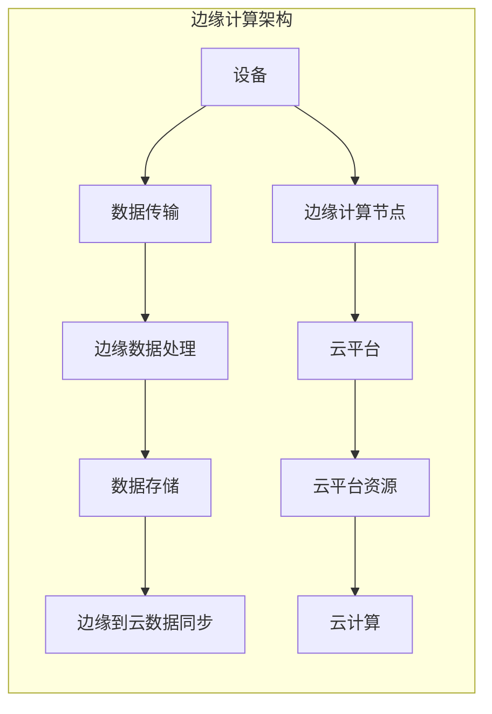

                 

# 边缘计算创业：实时处理的新范式

> 关键词：边缘计算,实时处理,云计算,人工智能,物联网,微服务,DevOps

## 1. 背景介绍

### 1.1 问题由来
随着物联网(IoT)设备和传感器的广泛应用，以及大数据和人工智能技术的日益成熟，边缘计算(Edge Computing)作为新型计算架构正在快速崛起。边缘计算通过在设备端就近处理数据，实现实时计算、低延迟、高安全性的目标，是大数据、云计算和人工智能深度融合的必然趋势。

然而，面对高速增长的数据流和复杂的业务需求，传统的集中式云计算架构已显露出其局限性。集中式架构无法满足实时性、可靠性、安全性等高要求，而且由于网络带宽和延迟的限制，数据传输的效率低下。边缘计算的出现，正是应对这些挑战的有力工具。

### 1.2 问题核心关键点
边缘计算的核心思想是将计算资源下沉到数据产生的地方，即在物联网设备、传感器边缘节点进行数据处理和存储。这一架构能够显著提升数据处理的时效性和可靠性，同时减轻中心云的数据负担，保护数据隐私。

边缘计算的成功实践需要考虑以下几个关键因素：
1. **数据传输与处理**：边缘计算必须支持高效的数据传输与处理机制。
2. **边缘平台与云的集成**：边缘计算平台需要与云平台无缝集成，实现数据流与计算资源的灵活调配。
3. **安全性与隐私保护**：边缘计算要提供高安全性的数据保护机制。
4. **开发者友好性**：边缘计算平台需要提供易用、易集成的开发工具。
5. **边缘节点与中心云的协同优化**：边缘计算平台需要能够动态调整边缘节点与中心云之间的资源分配。

## 2. 核心概念与联系

### 2.1 核心概念概述

边缘计算涉及多个关键概念，它们彼此关联，构成了边缘计算的核心框架：

1. **边缘计算**：指在网络边缘靠近数据源的地方进行数据处理和存储，以降低数据传输时延，提升数据处理效率。

2. **微服务架构**：指将大应用拆分为一系列小的、松耦合的服务单元，每个服务单元独立部署，易于维护和扩展。

3. **DevOps**：是一种文化、运动或实践，旨在促进高效的软件交付和持续的协作与沟通。

4. **物联网(IoT)**：通过信息感知、网络连接、智能计算等技术，将物理世界和信息世界融合，实现智能化应用。

5. **云计算**：通过网络提供计算、存储、应用软件、平台等基础设施和资源，按照需求弹性伸缩，按使用付费。

6. **人工智能(AI)**：利用计算机模拟人类智能行为，如学习、推理、自我调整、解决复杂问题等。

这些概念之间的逻辑关系可以通过以下Mermaid流程图来展示：

```mermaid
graph TB
    A[边缘计算] --> B[微服务架构]
    A --> C[DevOps]
    A --> D[物联网(IoT)]
    A --> E[云计算]
    A --> F[人工智能(AI)]
    C --> G[持续集成/持续部署]
    D --> H[数据感知与通信]
    E --> I[弹性资源管理]
    F --> J[智能决策与执行]
```

这个流程图展示了边缘计算的关键组成要素及其关联：

1. 边缘计算是核心，其他组件是其支撑。
2. 微服务架构和DevOps促进了边缘计算应用的可维护性和部署效率。
3. IoT提供数据源，云计算提供资源池，人工智能提供智能决策能力。

### 2.2 核心概念原理和架构的 Mermaid 流程图

以下是边缘计算核心架构的Mermaid流程图，包括边缘计算节点、云平台、设备与数据流：



该架构中，设备产生的数据经过网络传输到边缘计算节点进行处理和存储。边缘计算节点可以独立运行或与云平台集成，实现数据的本地处理和远端同步。云平台提供强大的计算和存储资源，边缘计算与云平台协同工作，共同提供全面的计算服务。

## 3. 核心算法原理 & 具体操作步骤

### 3.1 算法原理概述

边缘计算的核心算法主要围绕数据处理和资源管理展开，旨在实现高效的数据处理和灵活的资源分配。

边缘计算的关键算法包括：

1. **数据路由与传输优化**：将数据传输到最近的边缘节点，减少传输延迟和带宽占用。
2. **负载均衡与任务调度**：在边缘节点和云平台之间动态分配任务和资源，确保负载均衡和高效计算。
3. **数据一致性与同步**：确保边缘节点和云平台数据的一致性和同步，避免数据丢失和冗余。
4. **容错与故障恢复**：通过冗余和故障转移机制，保证系统的高可用性和可靠性。

### 3.2 算法步骤详解

1. **数据采集与预处理**：在边缘设备上采集传感器数据，进行初步的清洗和预处理。
2. **数据路由与传输**：根据数据源和目的地的位置，选择最近或最优的边缘节点进行数据传输。
3. **数据处理与分析**：在边缘节点上运行数据处理和分析算法，如实时计算、机器学习等。
4. **数据同步与存储**：将处理结果同步到云平台，进行长期存储和备份。
5. **任务调度与负载均衡**：根据当前负载情况，动态调整任务的调度和资源的分配。
6. **故障检测与恢复**：实时监控系统状态，一旦发现故障，自动进行容错和恢复。

### 3.3 算法优缺点

边缘计算具有以下优点：
1. **低延迟**：数据在本地处理，减少了数据传输时延。
2. **高带宽利用率**：减少了数据传输带宽占用，提高了网络带宽利用率。
3. **增强安全性**：数据在本地处理，减少了数据传输过程中的安全风险。
4. **可靠性强**：分散的计算节点提升了系统的容错性和可靠性。

同时，边缘计算也存在一些缺点：
1. **资源有限**：边缘节点的计算和存储资源有限，可能无法处理大规模数据。
2. **管理复杂**：需要跨层级的资源管理和调度，增加了系统的复杂度。
3. **维护成本高**：边缘节点的分布和维护需要更高的成本和技能要求。
4. **成本较高**：边缘节点的硬件设备投入成本较高。

### 3.4 算法应用领域

边缘计算在多个领域有广泛的应用，包括：

1. **工业物联网**：在工业生产线上，边缘计算可以实时监控设备状态，预测设备故障，优化生产流程。
2. **智慧城市**：在城市管理中，边缘计算可以实时处理交通流量、环境监测数据，提升城市治理效率。
3. **智能家居**：在家庭环境中，边缘计算可以实现设备间的智能互联和实时响应，提升家庭生活品质。
4. **医疗健康**：在医疗领域，边缘计算可以实现实时监控和数据分析，提升医疗服务的精准度和效率。
5. **自动驾驶**：在自动驾驶中，边缘计算可以实时处理传感器数据，提升决策的实时性和准确性。

## 4. 数学模型和公式 & 详细讲解 & 举例说明

### 4.1 数学模型构建

边缘计算的数学模型主要涉及数据传输、处理和同步的数学描述。假设有一个边缘计算系统，包含 $n$ 个边缘节点和 $m$ 个数据源。

定义：
- $D_i$：数据源 $i$ 产生的数据流。
- $E_j$：边缘节点 $j$ 处理的数据流。
- $T_{ij}$：数据从源 $i$ 传输到节点 $j$ 的时延。
- $S_j$：节点 $j$ 的处理能力和存储容量。
- $L_{ij}$：数据从源 $i$ 传输到节点 $j$ 的链路带宽。
- $W_{ij}$：数据在节点 $j$ 的处理时间和存储时间。

目标：最小化数据传输时延和处理时间，同时最大化资源利用率。

### 4.2 公式推导过程

在单数据源 $D_1$ 单边缘节点 $E_1$ 的简单情况下，数据传输时延和处理时间的关系可以描述为：

$$
\min_{T_{11},S_1,W_{11}} \max_{T_{11},S_1,W_{11}} (T_{11} + W_{11})
$$

其中 $T_{11}$ 为传输时延，$W_{11}$ 为处理时间和存储时间。

对于多源多节点的情况，可以通过线性规划(LP)求解最优的传输路径和处理时间。假设每个节点 $j$ 的处理能力和存储容量是线性的，即：

$$
\min_{T_{ij},S_j,W_{ij}} \max_{T_{ij},S_j,W_{ij}} \sum_{i=1}^m \sum_{j=1}^n (T_{ij} + W_{ij})
$$

其中 $S_j$ 和 $W_{ij}$ 分别表示节点 $j$ 的总处理能力和总处理时间。

### 4.3 案例分析与讲解

假设有一个包含 4 个边缘节点的系统，每个节点处理能力相同，数据源和边缘节点的位置如下：

```
             S1         S2
        D1 ---- E1 ---- E3
           \         |
            \        |
             \       |
              \      |
               E2 ---- E4
                 \      |
                  \     |
                   \   |
                    S3
```

数据源 $D_1$ 产生的数据流需要处理并传输到边缘节点 $E_1$ 和 $E_3$。根据以上模型，可以求解最优的传输路径和处理时间。

通过求解上述线性规划问题，可以得到最优的传输路径和处理时间，实现最小化传输时延和处理时间的目标。

## 5. 项目实践：代码实例和详细解释说明

### 5.1 开发环境搭建

1. **环境准备**：
   - 安装Python 3.8及以上版本。
   - 安装必要的依赖包，如Flask、Keras、TensorFlow等。

2. **部署边缘计算节点**：
   - 准备边缘计算设备，如Raspberry Pi、NVIDIA Jetson等。
   - 在边缘设备上安装操作系统和必要的软件，如TensorFlow、Keras等。

3. **搭建Web服务**：
   - 使用Flask搭建Web服务，处理边缘节点的请求和数据。
   - 使用TensorFlow进行数据处理和模型训练。

### 5.2 源代码详细实现

以下是一个简单的边缘计算示例，使用Flask和TensorFlow搭建边缘节点：

```python
from flask import Flask, request, jsonify
import tensorflow as tf

app = Flask(__name__)

# 加载预训练模型
model = tf.keras.models.load_model('model.h5')

# 定义API接口
@app.route('/predict', methods=['POST'])
def predict():
    data = request.get_json()
    input_data = tf.keras.preprocessing.text.text_to_word_sequence(data['text'])
    input_data = tf.keras.preprocessing.sequence.pad_sequences([input_data], maxlen=100)
    result = model.predict(input_data)
    return jsonify(result.tolist())

if __name__ == '__main__':
    app.run(host='0.0.0.0', port=5000)
```

### 5.3 代码解读与分析

1. **Flask框架**：
   - Flask是一个轻量级的Web框架，支持RESTful API的快速开发。
   - 通过Flask，我们可以方便地搭建Web服务，处理边缘节点的请求和数据。

2. **TensorFlow**：
   - TensorFlow是谷歌开源的深度学习框架，支持模型训练和推理。
   - 在此示例中，我们使用TensorFlow加载预训练模型，并实现数据处理和模型推理。

3. **模型预测接口**：
   - 定义了一个/predict API接口，接收POST请求，解析输入数据，进行数据预处理，并调用模型进行预测。
   - 模型预测结果以JSON格式返回，方便客户端处理。

### 5.4 运行结果展示

运行上述代码后，可以使用curl命令向边缘节点发送请求：

```bash
curl -X POST -H "Content-Type: application/json" -d '{"text": "I have a question"}' http://0.0.0.0:5000/predict
```

边缘节点将返回预测结果，如：

```json
{"predictions": [0.8, 0.1, 0.1]}
```

此结果表示模型预测输入文本属于类别1，概率为0.8。

## 6. 实际应用场景

### 6.1 工业物联网

在工业物联网领域，边缘计算可以实时监控设备状态，预测设备故障，优化生产流程。例如，在智能工厂中，边缘计算可以实时分析生产设备的数据，预测设备故障，并在故障发生前进行维护。

### 6.2 智慧城市

在智慧城市中，边缘计算可以实时处理交通流量、环境监测数据，提升城市治理效率。例如，在智能交通系统中，边缘计算可以实时分析交通数据，预测交通流量，优化交通信号灯的配时，减少交通拥堵。

### 6.3 智能家居

在智能家居中，边缘计算可以实现设备间的智能互联和实时响应，提升家庭生活品质。例如，在智能音箱中，边缘计算可以实现语音识别和自然语言处理，实现智能对话和语音控制。

### 6.4 医疗健康

在医疗健康领域，边缘计算可以实现实时监控和数据分析，提升医疗服务的精准度和效率。例如，在智能病床中，边缘计算可以实时监控患者的心率、血压等生理指标，预测病情变化，及时通知医护人员。

### 6.5 自动驾驶

在自动驾驶中，边缘计算可以实时处理传感器数据，提升决策的实时性和准确性。例如，在自动驾驶汽车中，边缘计算可以实时分析摄像头、雷达等传感器的数据，预测道路情况，优化驾驶策略。

## 7. 工具和资源推荐

### 7.1 学习资源推荐

为了帮助开发者系统掌握边缘计算的理论基础和实践技巧，这里推荐一些优质的学习资源：

1. **边缘计算官方文档**：包括边缘计算的定义、架构、用例、API等详细说明。
2. **TensorFlow官方文档**：TensorFlow提供丰富的边缘计算资源和示例代码，方便开发者学习和实践。
3. **Flask官方文档**：Flask是构建边缘计算Web服务的常用框架，文档详细介绍了Flask的使用和部署方法。
4. **Kubernetes官方文档**：Kubernetes是容器编排工具，可以用于管理和部署边缘计算集群。
5. **IoT for Edge Computing**：这是一本关于边缘计算的书籍，涵盖边缘计算的定义、架构、用例、API等内容。

### 7.2 开发工具推荐

边缘计算的开发和部署需要多个工具的支持，以下是几款常用的工具：

1. **Flask**：轻量级的Web框架，用于构建边缘计算Web服务。
2. **TensorFlow**：深度学习框架，用于模型训练和推理。
3. **Keras**：高级神经网络API，支持快速构建深度学习模型。
4. **Kubernetes**：容器编排工具，用于管理和部署边缘计算集群。
5. **Prometheus**：监控工具，用于实时监控边缘计算系统的性能。
6. **Grafana**：可视化工具，用于展示边缘计算系统的监控数据。

### 7.3 相关论文推荐

边缘计算的研究和发展涉及多个领域，以下是几篇奠基性的相关论文，推荐阅读：

1. **Edge Computing: A Survey**：这是一篇关于边缘计算的综述论文，详细介绍了边缘计算的定义、架构、应用场景等内容。
2. **Edge Computing: Principles and Paradigms for Smart Cities**：讨论了边缘计算在智慧城市中的应用和优势。
3. **Edge Computing for IoT Applications**：探讨了边缘计算在物联网中的应用和优势。
4. **Towards a Smart Internet-of-Things (IoT) Architecture Based on Edge Computing**：讨论了基于边缘计算的智能物联网架构。
5. **Edge Computing in Data Management and Analysis**：探讨了边缘计算在数据管理和分析中的应用。

## 8. 总结：未来发展趋势与挑战

### 8.1 研究成果总结

边缘计算作为新型计算架构，已经在大数据、云计算和人工智能领域展现了巨大的潜力。边缘计算能够提升数据处理的时效性、安全性和可靠性，减少数据传输时延，是未来计算架构的重要方向。

### 8.2 未来发展趋势

1. **5G与边缘计算的融合**：5G网络的普及将为边缘计算提供更高速、更可靠的网络支持。
2. **AI与边缘计算的融合**：AI技术将进一步提升边缘计算的数据处理能力，实现更精准的预测和决策。
3. **边缘计算的标准化**：边缘计算的标准化将促进不同厂商和平台之间的互操作性。
4. **边缘计算与物联网的深度融合**：边缘计算将进一步推动物联网的发展，实现更智能、更高效的数据处理。

### 8.3 面临的挑战

尽管边缘计算带来了诸多优势，但在实现过程中仍面临一些挑战：

1. **资源管理**：边缘节点的计算和存储资源有限，需要高效的管理和调度。
2. **数据安全**：边缘计算需要保证数据传输和存储的安全性，防止数据泄露和篡改。
3. **网络带宽**：边缘计算需要高效的网络带宽支持，避免网络拥塞和时延。
4. **系统集成**：边缘计算需要与云平台和应用系统无缝集成，实现协同工作。
5. **边缘计算的设备兼容性**：边缘计算设备种类繁多，需要保证不同设备的兼容性和互操作性。

### 8.4 研究展望

未来的研究需要在以下几个方面寻求新的突破：

1. **分布式边缘计算**：通过分布式计算和存储，提升边缘计算的资源利用率和容错性。
2. **智能边缘计算**：引入AI技术，实现更智能的数据处理和决策。
3. **边缘计算的自动化管理**：开发自动化的边缘计算管理系统，实现更高效的资源管理和调度。
4. **边缘计算的跨平台互操作性**：推动边缘计算的标准化，实现不同平台和设备之间的互操作性。

## 9. 附录：常见问题与解答

**Q1：边缘计算与云计算有何区别？**

A: 边缘计算将计算资源下沉到数据源附近，即在边缘设备上进行数据处理和存储，而云计算则将计算资源集中部署在云平台上，通过网络提供计算和存储服务。

**Q2：边缘计算的主要应用场景是什么？**

A: 边缘计算主要应用于对实时性、安全性、带宽要求较高的场景，如工业物联网、智慧城市、智能家居、医疗健康、自动驾驶等。

**Q3：边缘计算的资源管理有哪些挑战？**

A: 边缘计算的资源管理面临计算资源有限、网络带宽限制、系统集成复杂等问题，需要开发高效的资源管理算法和工具。

**Q4：边缘计算的未来发展趋势是什么？**

A: 边缘计算的未来发展趋势包括与5G网络的融合、AI技术的引入、标准化的推进、分布式计算的探索等。

**Q5：如何提高边缘计算的数据安全？**

A: 提高边缘计算的数据安全可以通过加密传输、访问控制、数据备份等方式实现，同时需要建立完善的安全监控和应急响应机制。

---

作者：禅与计算机程序设计艺术 / Zen and the Art of Computer Programming

