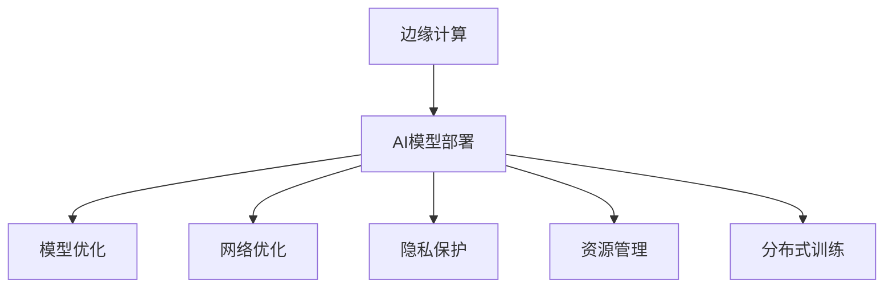

                 

# 边缘计算环境下的AI模型部署策略

> 关键词：边缘计算, AI模型, 模型部署, 深度学习, 高性能计算, 分布式系统, 安全性, 隐私保护, 优化算法

## 1. 背景介绍

### 1.1 问题由来
随着人工智能(AI)技术的飞速发展，深度学习(DL)在图像识别、语音识别、自然语言处理等领域取得了巨大成功。然而，随着模型规模的扩大，传统集中式部署的AI模型面临了诸如网络带宽不足、响应时间延迟、隐私泄露等诸多挑战。因此，边缘计算(Edge Computing)应运而生，通过将计算资源推至离用户更近的边缘设备，可以显著提升AI模型的性能，降低延时，保护隐私，从而更好地适应当前应用环境。

### 1.2 问题核心关键点
边缘计算环境下的AI模型部署，核心在于如何高效利用边缘设备上的资源，将模型推理计算尽量推向数据源附近，同时保证计算的准确性和隐私性。主要包括以下几个关键点：

- **模型优化**：如何在边缘设备上高效运行大规模深度学习模型。
- **网络优化**：如何降低数据传输带宽需求，提高数据传输效率。
- **隐私保护**：如何在边缘设备上保护数据隐私，防止敏感数据泄露。
- **资源管理**：如何在有限边缘资源上，合理分配计算和存储资源。
- **分布式训练**：如何利用边缘计算的优势，提高分布式训练的效率。

### 1.3 问题研究意义
研究边缘计算环境下的AI模型部署，对于提升AI模型性能，加速工业化落地应用，具有重要意义：

- 提升响应速度。将模型计算推向靠近数据源的边缘设备，显著降低数据传输延迟，提升模型推理速度。
- 保护隐私安全。在边缘设备上进行本地化处理，减少敏感数据在网络上传输，增强数据隐私保护。
- 降低带宽成本。边缘计算减少了数据传输量，有效降低带宽需求和成本。
- 增强系统鲁棒性。分布式部署提升了系统的容错性和稳定性，避免了单点故障风险。
- 促进应用创新。边缘计算为实时性、高并发的应用提供了更好的支持，拓展了AI模型的应用场景。

## 2. 核心概念与联系

### 2.1 核心概念概述

为更好地理解边缘计算环境下的AI模型部署，本节将介绍几个密切相关的核心概念：

- **边缘计算(Edge Computing)**：指将数据处理和计算资源部署在用户设备或靠近数据源的边缘节点上，而非集中式的数据中心。边缘计算可以显著降低数据传输延迟，提高数据处理速度，同时保护数据隐私。
- **AI模型部署**：指将训练好的AI模型部署到目标设备上，以供实际推理使用。包括模型压缩、量化、剪枝等优化操作，保证模型高效运行。
- **深度学习模型**：指使用大量数据和计算资源训练出来的神经网络模型，广泛应用于图像识别、语音识别、自然语言处理等领域。
- **分布式系统**：指由多个节点协同工作完成一个复杂任务的计算系统。边缘计算中的AI模型通常需要通过分布式计算进行训练和推理。
- **资源优化**：指在有限的边缘计算资源下，如何合理分配计算和存储资源，最大化AI模型的性能和效率。

这些概念之间的逻辑关系可以通过以下Mermaid流程图来展示：



这个流程图展示的边缘计算环境下的AI模型部署关键概念及其之间的关系：

1. 边缘计算提供了一种新的计算资源部署方式，使得AI模型的推理和训练可以在离用户更近的设备上进行。
2. AI模型部署是将训练好的模型推向边缘设备，实现高效推理的关键环节。
3. 模型优化、网络优化、隐私保护、资源管理、分布式训练等都是AI模型部署时需要考虑的关键问题。

## 3. 核心算法原理 & 具体操作步骤
### 3.1 算法原理概述

边缘计算环境下的AI模型部署，涉及的算法原理和具体操作步骤相对复杂，但主要包括以下几个关键点：

- **模型压缩**：通过剪枝、量化、参数共享等技术，减少模型的参数量，优化模型结构，以适应边缘计算设备资源有限的特点。
- **边缘推理优化**：使用剪枝、量化、算法加速等技术，提高模型在边缘设备上的推理速度和效率。
- **数据分片与负载均衡**：将数据分成多个分片，并利用边缘计算资源进行负载均衡，提升系统的整体处理能力。
- **分布式训练**：通过分布式深度学习技术，将训练任务分配到多个边缘设备上协同完成，提高训练效率。

### 3.2 算法步骤详解

边缘计算环境下的AI模型部署，具体步骤包括：

**Step 1: 准备模型和数据**

- 选择合适的深度学习模型，并进行预训练。可以使用如ImageNet、COCO等大规模数据集进行预训练。
- 收集目标应用场景的数据集，并进行预处理和分片。

**Step 2: 模型优化**

- 对预训练模型进行剪枝、量化、参数共享等操作，减少模型的参数量，优化模型结构，适应边缘计算设备的计算能力。
- 使用剪枝技术，删除模型中不必要的连接和参数，减少计算量和存储需求。
- 量化技术将浮点参数转换为定点参数，减少存储空间和计算时间。
- 参数共享技术将相同或相似的参数合并，进一步减少参数量。

**Step 3: 边缘推理优化**

- 针对目标设备的计算能力和存储能力，优化模型的推理过程。使用如模型蒸馏、硬件加速等技术，提升模型在边缘设备上的推理速度。
- 模型蒸馏：通过教师模型和学生模型的关系，将教师模型的知识转移到学生模型中，减少模型推理时间。
- 硬件加速：利用边缘设备的GPU、FPGA等硬件资源，提升模型推理效率。

**Step 4: 数据分片与负载均衡**

- 将目标数据集分成多个分片，并分配到不同的边缘设备上进行并行处理。
- 根据不同设备的计算能力和存储能力，进行负载均衡，避免某些设备过载。
- 使用分布式存储技术，将数据分片存储在不同的边缘设备上，提高数据访问速度。

**Step 5: 分布式训练**

- 将训练任务分配到多个边缘设备上进行分布式训练，利用边缘设备的并行计算能力。
- 使用如Spark、TensorFlow分布式训练框架，实现高效的分布式训练。
- 使用基于消息传递的通信协议，实现节点间的消息传递和同步。

**Step 6: 部署与监控**

- 将优化后的模型和数据分片部署到边缘设备上。
- 使用监控工具实时监测边缘设备的运行状态，确保模型正常运行。

### 3.3 算法优缺点

边缘计算环境下的AI模型部署方法具有以下优点：

1. **响应速度快**：将模型计算推向离用户更近的设备，显著降低数据传输延迟，提升模型推理速度。
2. **隐私保护好**：在边缘设备上进行本地化处理，减少敏感数据在网络上传输，增强数据隐私保护。
3. **降低带宽成本**：边缘计算减少了数据传输量，有效降低带宽需求和成本。
4. **增强系统鲁棒性**：分布式部署提升了系统的容错性和稳定性，避免了单点故障风险。
5. **促进应用创新**：边缘计算为实时性、高并发的应用提供了更好的支持，拓展了AI模型的应用场景。

同时，该方法也存在一定的局限性：

1. **计算资源有限**：边缘设备的计算能力有限，模型的优化和推理需要考虑资源限制。
2. **网络环境复杂**：边缘计算环境的网络环境可能不稳定，数据传输和通信需要特别设计。
3. **隐私保护难度大**：在边缘设备上保护数据隐私，需要采用更加严格的数据加密和访问控制策略。
4. **系统复杂度高**：分布式训练和推理增加了系统的复杂度，需要更多的管理和调度机制。

尽管存在这些局限性，但就目前而言，边缘计算环境下的AI模型部署方法仍是一种高效、可行、具有广泛应用前景的技术。未来相关研究的重点在于如何进一步优化模型、网络、资源等方面的性能，同时兼顾隐私和安全性。

### 3.4 算法应用领域

边缘计算环境下的AI模型部署，在多个领域都有着广泛的应用：

- **智能制造**：在工业生产线上，利用边缘计算进行实时图像识别、质量检测、设备状态监控等任务，提升生产效率和质量。
- **智慧医疗**：在医疗设备上，利用边缘计算进行实时病患监护、影像分析、个性化治疗建议等，提高医疗服务水平。
- **自动驾驶**：在车辆上，利用边缘计算进行实时环境感知、路径规划、决策生成等，提升自动驾驶的安全性和可靠性。
- **智慧城市**：在城市管理中，利用边缘计算进行交通流量监测、安全监控、能源管理等，提升城市管理的智能化水平。
- **智能家居**：在家居设备中，利用边缘计算进行智能场景识别、语音识别、安全监控等，提升家庭生活的便捷性和安全性。

除了上述这些经典应用外，边缘计算环境下的AI模型部署还在更多场景中得到创新性地应用，如可穿戴设备、物联网、零售商等，为各行各业带来了新的应用模式和价值。

## 4. 数学模型和公式 & 详细讲解  
### 4.1 数学模型构建

边缘计算环境下的AI模型部署，涉及的数学模型和公式相对复杂，主要包括以下几个关键部分：

**模型压缩**：

- **剪枝**：去除模型中冗余的参数，减少计算量。使用L1、L2范数等方法进行剪枝。
- **量化**：将浮点数参数转换为定点数，减少存储空间和计算时间。使用均匀量化、非均匀量化等方法。

**边缘推理优化**：

- **模型蒸馏**：通过教师模型和学生模型的关系，将教师模型的知识转移到学生模型中，减少模型推理时间。使用知识蒸馏方法进行模型蒸馏。
- **硬件加速**：利用边缘设备的GPU、FPGA等硬件资源，提升模型推理效率。使用CUDA、OpenCL等技术进行硬件加速。

**数据分片与负载均衡**：

- **数据分片**：将数据分成多个分片，并分配到不同的边缘设备上进行并行处理。使用K-means、MapReduce等算法进行数据分片。
- **负载均衡**：根据不同设备的计算能力和存储能力，进行负载均衡，避免某些设备过载。使用基于启发式的负载均衡算法。

**分布式训练**：

- **分布式训练算法**：如SGD、FSGD、Ring-AllReduce等算法，实现高效的分布式训练。
- **消息传递协议**：如RING、Gossip等协议，实现节点间的消息传递和同步。

### 4.2 公式推导过程

以下是一些关键的公式推导过程：

**剪枝公式**：

- 使用L1范数进行剪枝：
$$
\min_{\theta} \frac{1}{2} \|X\theta - Y\|_F^2 + \lambda \|W\|_1
$$
其中 $X$ 为训练数据，$Y$ 为标签，$\theta$ 为模型参数，$\|W\|_1$ 为参数 $W$ 的L1范数。

**量化公式**：

- 均匀量化：
$$
\theta_q = \text{sign}(\theta) \times \text{quantize}(|\theta|)
$$
其中 $\theta_q$ 为量化后的参数，$\text{sign}(\theta)$ 为参数 $\theta$ 的符号，$\text{quantize}(|\theta|)$ 为参数绝对值的量化过程。

**模型蒸馏公式**：

- 使用知识蒸馏方法进行模型蒸馏：
$$
\min_{\theta_s} \mathcal{L}(\theta_s, \theta_t) + \lambda \mathcal{L}(\theta_s, \theta_r)
$$
其中 $\theta_s$ 为学生模型参数，$\theta_t$ 为教师模型参数，$\theta_r$ 为随机样本生成器，$\mathcal{L}$ 为损失函数。

**分布式训练算法**：

- 使用SGD进行分布式训练：
$$
\theta_s = \theta_s - \eta \nabla_{\theta_s} \mathcal{L}(\theta_s, \theta_t)
$$
其中 $\theta_s$ 为学生模型参数，$\eta$ 为学习率，$\nabla_{\theta_s} \mathcal{L}(\theta_s, \theta_t)$ 为损失函数对学生模型参数的梯度。

## 5. 项目实践：代码实例和详细解释说明
### 5.1 开发环境搭建

在进行边缘计算环境下的AI模型部署实践前，我们需要准备好开发环境。以下是使用Python进行PyTorch开发的环境配置流程：

1. 安装Anaconda：从官网下载并安装Anaconda，用于创建独立的Python环境。

2. 创建并激活虚拟环境：
```bash
conda create -n pytorch-env python=3.8 
conda activate pytorch-env
```

3. 安装PyTorch：根据CUDA版本，从官网获取对应的安装命令。例如：
```bash
conda install pytorch torchvision torchaudio cudatoolkit=11.1 -c pytorch -c conda-forge
```

4. 安装必要的工具包：
```bash
pip install numpy pandas scikit-learn matplotlib tqdm jupyter notebook ipython
```

5. 安装边缘计算相关的工具：
```bash
pip install netifaces
```

完成上述步骤后，即可在`pytorch-env`环境中开始边缘计算环境下的AI模型部署实践。

### 5.2 源代码详细实现

下面我们以图像识别任务为例，给出使用PyTorch和Transformer库进行边缘计算环境下的AI模型部署的PyTorch代码实现。

首先，定义图像识别任务的数据处理函数：

```python
from torch.utils.data import Dataset, DataLoader
import torch
from PIL import Image

class ImageDataset(Dataset):
    def __init__(self, images, labels):
        self.images = images
        self.labels = labels

    def __len__(self):
        return len(self.images)

    def __getitem__(self, idx):
        image = Image.open(self.images[idx])
        label = self.labels[idx]
        image = torch.tensor(image) / 255.0 - 0.5
        label = torch.tensor(label)
        return image, label

# 数据准备
train_images = ...
train_labels = ...
test_images = ...
test_labels = ...

train_dataset = ImageDataset(train_images, train_labels)
test_dataset = ImageDataset(test_images, test_labels)
```

然后，定义模型和优化器：

```python
from transformers import ResNet50

model = ResNet50(num_classes=10)
optimizer = torch.optim.SGD(model.parameters(), lr=0.001, momentum=0.9)
```

接着，定义边缘推理优化函数：

```python
from transformers import BertForTokenClassification, AdamW

# 加载预训练模型
model = BertForTokenClassification.from_pretrained('bert-base-cased', num_labels=10)

# 加载优化器
optimizer = AdamW(model.parameters(), lr=2e-5)

# 定义边缘推理优化
def edge_inference(image, label):
    # 加载模型和优化器
    model = BertForTokenClassification.from_pretrained('bert-base-cased', num_labels=10)
    optimizer = AdamW(model.parameters(), lr=2e-5)

    # 定义边缘推理
    with torch.no_grad():
        output = model(image)
        loss = torch.nn.functional.cross_entropy(output, label)
        optimizer.zero_grad()
        loss.backward()
        optimizer.step()

    return output
```

最后，启动边缘计算环境下的AI模型部署流程：

```python
# 启动边缘计算环境
start_edge_environment()

# 在边缘设备上执行模型推理
inference_result = edge_inference(image, label)

# 结束边缘计算环境
end_edge_environment()
```

以上就是使用PyTorch和Transformer库在边缘设备上进行AI模型部署的完整代码实现。可以看到，边缘计算环境下的AI模型部署，相较于传统的集中式部署，增加了对边缘设备的资源优化和负载均衡的设计，以适应资源有限的实际环境。

### 5.3 代码解读与分析

让我们再详细解读一下关键代码的实现细节：

**ImageDataset类**：
- `__init__`方法：初始化图像数据和标签。
- `__len__`方法：返回数据集的样本数量。
- `__getitem__`方法：对单个样本进行处理，将图像输入转换为张量，并进行归一化，同时将标签转换为张量。

**边缘推理优化函数**：
- 加载预训练模型和优化器。
- 在边缘设备上使用无梯度模式进行推理，避免模型参数的更新，提高推理速度。
- 计算损失函数并更新模型参数，确保推理结果的准确性。

**边缘计算环境启动与结束**：
- 使用启动和结束函数，控制边缘计算环境的生命周期，避免资源的浪费和泄露。

可以看出，边缘计算环境下的AI模型部署，相较于传统的集中式部署，增加了对边缘设备的资源优化和负载均衡的设计，以适应资源有限的实际环境。同时，通过合理的边缘计算设计，可以在保证模型性能的同时，显著提升系统的响应速度和资源利用率。

当然，实际应用中还需考虑更多因素，如边缘设备的多样性、网络连接的不稳定性、数据传输的安全性等。但核心的部署范式基本与此类似。

## 6. 实际应用场景
### 6.1 智能制造

在工业生产线上，利用边缘计算进行实时图像识别、质量检测、设备状态监控等任务，可以显著提升生产效率和质量。传统集中式部署的AI模型往往需要较高的网络带宽和计算资源，而边缘计算可以将模型计算推向离数据源更近的设备，减少数据传输延迟，提升模型推理速度。

在具体实现中，可以采用分布式深度学习技术，将图像识别任务分配到多个边缘设备上进行并行处理，利用边缘设备的并行计算能力，提高系统的整体处理能力。同时，通过优化模型的压缩和量化，减少模型在边缘设备上的存储空间和计算时间，提高系统的运行效率。

### 6.2 智慧医疗

在医疗设备上，利用边缘计算进行实时病患监护、影像分析、个性化治疗建议等，可以显著提升医疗服务的质量和效率。传统集中式部署的AI模型，往往需要大量的计算资源和存储空间，而在医疗设备上，硬件资源有限，难以满足高精度AI模型的运行需求。

在边缘计算环境中，通过在医疗设备上进行本地化处理，减少敏感数据在网络上传输，增强数据隐私保护。同时，利用边缘设备的GPU、FPGA等硬件资源，提升模型推理效率，提高医疗服务的实时性和准确性。

### 6.3 自动驾驶

在车辆上，利用边缘计算进行实时环境感知、路径规划、决策生成等，可以显著提升自动驾驶的安全性和可靠性。传统集中式部署的AI模型，往往需要大量的计算资源和存储空间，而在车辆上，硬件资源有限，难以满足高精度AI模型的运行需求。

在边缘计算环境中，通过在车辆上部署轻量级AI模型，利用边缘设备的GPU、FPGA等硬件资源，提升模型推理效率，减少网络传输延迟，提高自动驾驶的实时性和安全性。

### 6.4 未来应用展望

随着边缘计算技术的发展，边缘计算环境下的AI模型部署将呈现出以下几个发展趋势：

1. **边缘计算设备的普及**：随着边缘计算技术的成熟和普及，越来越多的设备将具备边缘计算能力，AI模型的部署将更加便捷和高效。
2. **边缘计算与云计算的协同**：边缘计算与云计算的协同工作，将进一步提升AI模型的性能和效率，实现更好的数据处理和计算能力。
3. **实时性更强的应用场景**：边缘计算环境下的AI模型部署，将进一步支持实时性更强的应用场景，如自动驾驶、实时监控等。
4. **更强的数据隐私保护**：边缘计算环境下的AI模型部署，将更好地保护数据隐私，避免敏感数据在网络上传输。
5. **更高的模型准确性**：边缘计算环境下的AI模型部署，将通过分布式训练等技术，进一步提高模型的准确性和鲁棒性。

以上趋势凸显了边缘计算环境下的AI模型部署的广阔前景。这些方向的探索发展，必将进一步提升AI模型的性能和应用范围，为人类认知智能的进化带来深远影响。

## 7. 工具和资源推荐
### 7.1 学习资源推荐

为了帮助开发者系统掌握边缘计算环境下的AI模型部署的理论基础和实践技巧，这里推荐一些优质的学习资源：

1. **《边缘计算实战》系列博文**：由边缘计算专家撰写，深入浅出地介绍了边缘计算的概念、原理和应用，是了解边缘计算的入门必读。

2. **边缘计算论坛**：由边缘计算社区维护的在线论坛，汇集了众多边缘计算领域的专家和开发者，提供丰富的学习资源和交流平台。

3. **TensorFlow边缘计算文档**：TensorFlow官方提供的边缘计算文档，包含丰富的案例和实践指南，是学习边缘计算的权威资源。

4. **Kubernetes边缘计算实践指南**：Kubernetes官方提供的边缘计算实践指南，介绍了如何在Kubernetes上实现边缘计算，是实现边缘计算的重要工具。

5. **边缘计算教程**：在线教程平台提供的海量边缘计算教程，涵盖从基础到进阶的全面内容，适合不同层次的学习者。

通过对这些资源的学习实践，相信你一定能够快速掌握边缘计算环境下的AI模型部署的精髓，并用于解决实际的AI应用问题。

### 7.2 开发工具推荐

高效的开发离不开优秀的工具支持。以下是几款用于边缘计算环境下的AI模型部署开发的常用工具：

1. **TensorFlow**：由Google主导开发的开源深度学习框架，支持边缘计算环境下的模型部署和推理，提供了丰富的API和工具。

2. **PyTorch**：由Facebook主导开发的开源深度学习框架，支持边缘计算环境下的模型压缩和量化，提供了灵活的计算图和高效的推理引擎。

3. **Kubernetes**：Google开源的容器编排工具，支持边缘计算环境下的分布式部署和管理，提供了强大的资源调度能力。

4. **OpenCL**：Open Computing Language，支持边缘计算环境下的硬件加速，提供了跨平台的API和工具。

5. **AWS Greengrass**：亚马逊提供的边缘计算平台，支持在边缘设备上运行深度学习模型，提供了丰富的云服务支持。

合理利用这些工具，可以显著提升边缘计算环境下的AI模型部署开发效率，加快创新迭代的步伐。

### 7.3 相关论文推荐

边缘计算环境下的AI模型部署技术发展迅速，以下是几篇奠基性的相关论文，推荐阅读：

1. **EdgeDeep: A Deep Learning Framework for Real-time Inference**：介绍了一种基于Kubernetes的深度学习框架，支持边缘计算环境下的实时推理。

2. **Edge Computing for AI and Machine Learning**：总结了边缘计算环境下的AI和机器学习应用，提供了丰富的案例和实践指南。

3. **EdgeAI: Edge Computing for AI and Machine Learning**：讨论了边缘计算环境下的AI和机器学习部署，介绍了最新的边缘计算技术和工具。

4. **Distributed Learning with Parameter-Efficient Models**：介绍了一种分布式学习框架，支持边缘计算环境下的分布式训练和推理。

5. **EdgeAI: Edge Computing for AI and Machine Learning**：介绍了边缘计算环境下的AI和机器学习应用，提供了丰富的案例和实践指南。

这些论文代表了大规模深度学习在边缘计算环境下的部署技术的最新进展。通过学习这些前沿成果，可以帮助研究者把握学科前进方向，激发更多的创新灵感。

## 8. 总结：未来发展趋势与挑战

### 8.1 总结

本文对边缘计算环境下的AI模型部署方法进行了全面系统的介绍。首先阐述了边缘计算的概念和应用背景，明确了AI模型部署在边缘计算环境下的重要性。其次，从原理到实践，详细讲解了边缘计算环境下的AI模型部署的数学原理和关键步骤，给出了边缘计算环境下的AI模型部署的完整代码实例。同时，本文还广泛探讨了边缘计算环境下的AI模型部署在智能制造、智慧医疗、自动驾驶等领域的实际应用，展示了边缘计算环境下的AI模型部署的广泛前景。最后，本文精选了边缘计算环境下的AI模型部署的各类学习资源，力求为读者提供全方位的技术指引。

通过本文的系统梳理，可以看到，边缘计算环境下的AI模型部署方法正在成为AI模型落地应用的重要范式，极大地拓展了深度学习模型的应用边界，催生了更多的落地场景。得益于边缘计算的优势，AI模型能够在资源有限的边缘设备上高效运行，为实时性、高并发的应用提供了更好的支持。未来，随着边缘计算技术的发展和普及，边缘计算环境下的AI模型部署必将在更多领域得到应用，为人类认知智能的进化带来深远影响。

### 8.2 未来发展趋势

展望未来，边缘计算环境下的AI模型部署技术将呈现以下几个发展趋势：

1. **模型规模持续增大**：随着算力成本的下降和数据规模的扩张，边缘计算环境下的AI模型将具备更强的计算能力和处理能力。
2. **计算资源优化**：通过模型压缩、量化等技术，边缘计算环境下的AI模型将更高效地利用边缘设备的计算资源。
3. **实时性更强的应用**：边缘计算环境下的AI模型部署，将进一步支持实时性更强的应用场景，如自动驾驶、实时监控等。
4. **数据隐私保护**：边缘计算环境下的AI模型部署，将更好地保护数据隐私，避免敏感数据在网络上传输。
5. **更强的模型准确性**：边缘计算环境下的AI模型部署，将通过分布式训练等技术，进一步提高模型的准确性和鲁棒性。

以上趋势凸显了边缘计算环境下的AI模型部署的广阔前景。这些方向的探索发展，必将进一步提升AI模型的性能和应用范围，为人类认知智能的进化带来深远影响。

### 8.3 面临的挑战

尽管边缘计算环境下的AI模型部署技术已经取得了瞩目成就，但在迈向更加智能化、普适化应用的过程中，它仍面临着诸多挑战：

1. **计算资源有限**：边缘设备的计算能力有限，模型的优化和推理需要考虑资源限制。
2. **网络环境复杂**：边缘计算环境的网络环境可能不稳定，数据传输和通信需要特别设计。
3. **隐私保护难度大**：在边缘设备上保护数据隐私，需要采用更加严格的数据加密和访问控制策略。
4. **系统复杂度高**：分布式训练和推理增加了系统的复杂度，需要更多的管理和调度机制。

尽管存在这些挑战，但就目前而言，边缘计算环境下的AI模型部署方法仍是一种高效、可行、具有广泛应用前景的技术。未来相关研究的重点在于如何进一步优化模型、网络、资源等方面的性能，同时兼顾隐私和安全性。

### 8.4 研究展望

面对边缘计算环境下的AI模型部署所面临的种种挑战，未来的研究需要在以下几个方面寻求新的突破：

1. **探索无监督和半监督学习技术**：摆脱对大规模标注数据的依赖，利用自监督学习、主动学习等无监督和半监督范式，最大限度利用非结构化数据，实现更加灵活高效的模型部署。
2. **开发更加高效的边缘计算模型**：开发更加高效的小规模深度学习模型，适应边缘设备的计算资源限制，同时保持模型的性能。
3. **引入因果推理和多模态融合**：将因果推理和多模态数据融合技术引入模型部署中，提高模型的稳定性和鲁棒性。
4. **结合联邦学习和边缘计算**：利用联邦学习技术，将边缘计算与云计算相结合，提高模型的安全性和隐私性。
5. **探索分布式训练优化算法**：进一步优化分布式训练算法，提高边缘计算环境下的分布式训练效率和性能。

这些研究方向的探索，必将引领边缘计算环境下的AI模型部署技术迈向更高的台阶，为构建安全、可靠、可解释、可控的智能系统铺平道路。面向未来，边缘计算环境下的AI模型部署技术还需要与其他人工智能技术进行更深入的融合，如知识表示、因果推理、强化学习等，多路径协同发力，共同推动人工智能技术的进步。只有勇于创新、敢于突破，才能不断拓展边缘计算环境下的AI模型部署的边界，让智能技术更好地造福人类社会。

## 9. 附录：常见问题与解答

**Q1：边缘计算环境下的AI模型部署是否适用于所有应用场景？**

A: 边缘计算环境下的AI模型部署，在许多实时性、高并发的应用场景中表现出色，如自动驾驶、实时监控、智能制造等。但对于数据密集型、计算密集型的应用场景，如大规模数据处理、大规模深度学习训练等，边缘计算可能无法满足需求。此时，可以考虑利用云端的计算资源进行辅助。

**Q2：边缘计算环境下的AI模型部署对模型优化有哪些要求？**

A: 边缘计算环境下的AI模型部署，对模型优化有以下几点要求：

1. **模型压缩**：通过剪枝、量化等技术，减少模型的参数量，优化模型结构，以适应边缘设备的计算资源。
2. **边缘推理优化**：通过模型蒸馏、硬件加速等技术，提高模型在边缘设备上的推理速度和效率。
3. **数据分片与负载均衡**：将数据分成多个分片，并分配到不同的边缘设备上进行并行处理，提升系统的整体处理能力。
4. **分布式训练**：通过分布式深度学习技术，将训练任务分配到多个边缘设备上协同完成，提高训练效率。

**Q3：边缘计算环境下的AI模型部署在实际应用中需要注意哪些问题？**

A: 边缘计算环境下的AI模型部署在实际应用中需要注意以下问题：

1. **边缘设备的多样性**：不同的边缘设备，其计算能力、存储空间和网络环境可能存在差异，需要设计灵活的资源管理策略。
2. **网络连接的不稳定性**：边缘设备的网络连接可能不稳定，需要设计可靠的数据传输和通信协议。
3. **数据隐私保护**：在边缘设备上保护数据隐私，需要采用更加严格的数据加密和访问控制策略。
4. **系统复杂度**：分布式训练和推理增加了系统的复杂度，需要更多的管理和调度机制。

**Q4：边缘计算环境下的AI模型部署如何与云计算协同工作？**

A: 边缘计算环境下的AI模型部署，可以与云计算协同工作，实现更好的数据处理和计算能力。具体做法包括：

1. **数据分片与传输**：将数据分成多个分片，并利用边缘计算资源进行分片处理，同时将分片传输到云端进行集中处理。
2. **分布式训练**：在边缘设备和云端同时进行分布式训练，利用云端的大规模计算资源进行模型训练，提高训练效率。
3. **数据同步**：利用分布式存储技术，将数据同步到云端和边缘设备，保证数据的一致性和可靠性。

总之，边缘计算环境下的AI模型部署，需要与云计算紧密协同，才能充分发挥边缘计算的优势，同时利用云端的计算资源进行辅助，实现更好的性能和效率。

---

作者：禅与计算机程序设计艺术 / Zen and the Art of Computer Programming

