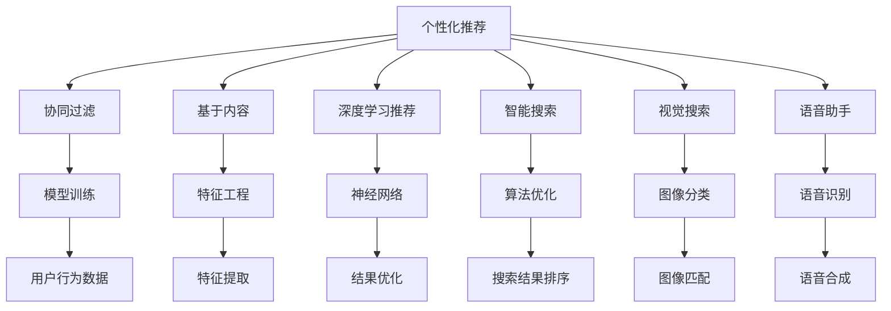

                 

## 1. 背景介绍

### 1.1 问题由来

在数字化转型加速的今天，零售商越来越依赖电商平台进行销售，随之而来的用户购物体验问题逐渐凸显。传统的电子商务平台往往只提供商品展示、价格比对、在线客服等服务，难以满足用户在购物过程中对个性化、互动性和实时性的更高要求。而随着AI技术的不断成熟，电商平台开始引入AI技术来提升用户购物体验。

具体而言，AI技术可以用于以下几个方面：
- 个性化推荐：基于用户行为和兴趣，推荐最适合的商品。
- 自然语言处理：通过聊天机器人、情感分析等方式，提升客服响应速度和质量。
- 智能搜索：实现基于用户查询的智能搜索结果排序。
- 视觉搜索：实现图片识别和匹配，帮助用户快速找到所需商品。
- 语音助手：通过语音交互，提升用户体验和便利性。

这些AI技术的应用，使得电商平台能够更准确地理解用户需求，提供更个性化、更高效的服务。

### 1.2 问题核心关键点

提升用户购物体验的AI应用主要围绕以下几个关键点展开：
- **个性化推荐**：通过用户行为数据，推荐最相关的商品。
- **自然语言处理**：使用NLP技术实现高效的客户服务，包括聊天机器人和情感分析。
- **智能搜索**：利用机器学习算法优化搜索结果，提升搜索体验。
- **视觉搜索**：实现图片和商品的智能匹配。
- **语音助手**：提供语音输入和输出，增强互动性。

以上几个关键点相互关联，共同构成了提升用户购物体验的整体框架。

## 2. 核心概念与联系

### 2.1 核心概念概述

为更好地理解AI技术在提升用户购物体验中的应用，本节将介绍几个密切相关的核心概念：

- **个性化推荐系统**：基于用户行为和兴趣，推荐最适合的商品。包括协同过滤、基于内容的推荐、深度学习推荐等方法。
- **自然语言处理(NLP)**：处理和分析人类语言的技术，包括文本分析、聊天机器人、情感分析等。
- **智能搜索**：利用算法优化搜索结果，提升搜索速度和准确性。包括基于关键词的搜索、向量检索等技术。
- **视觉搜索**：通过图像识别和匹配，帮助用户找到商品。包括图像分类、图像匹配、视觉特征提取等技术。
- **语音助手**：通过语音识别和合成技术，实现自然语言交互。包括自动语音识别(ASR)、文本转语音(TTS)等技术。

这些核心概念之间的逻辑关系可以通过以下Mermaid流程图来展示：



这个流程图展示了个性化推荐、自然语言处理、智能搜索、视觉搜索和语音助手之间的联系：

1. 个性化推荐系统基于用户行为数据进行推荐，可以融入NLP技术进行情感分析和文本理解，提升推荐精准度。
2. 智能搜索和视觉搜索通过图像和文本的特征提取和匹配，实现高效的商品检索。
3. 语音助手通过语音识别和合成技术，提供自然语言交互，增强用户体验。

## 3. 核心算法原理 & 具体操作步骤

### 3.1 算法原理概述

提升用户购物体验的AI技术主要基于以下几种算法原理：

- **协同过滤**：通过分析用户的历史行为，找到与当前用户兴趣相似的其他用户，并基于这些用户的偏好进行推荐。
- **基于内容的推荐**：基于商品的属性和特征，找到与用户兴趣匹配的商品。
- **深度学习推荐**：利用深度学习模型，学习用户行为和商品特征的隐含表示，进行更准确的推荐。
- **自然语言处理**：使用NLP技术，处理用户查询、生成回答、分析用户情感等。
- **智能搜索**：使用机器学习算法，优化搜索结果排序，提升搜索效果。
- **视觉搜索**：通过图像识别和特征匹配，实现高效的商品检索。
- **语音助手**：利用语音识别和合成技术，实现自然语言交互。

这些算法原理相互配合，共同构建了提升用户购物体验的技术体系。

### 3.2 算法步骤详解

下面详细介绍基于协同过滤和深度学习推荐系统的具体实现步骤：

**Step 1: 数据收集与预处理**

1. **数据收集**：收集用户的浏览、购买、评价等行为数据，形成用户行为数据集。
2. **数据清洗**：处理缺失值、异常值等，确保数据质量。
3. **特征工程**：提取用户行为特征和商品属性特征，如浏览时长、购买次数、价格区间等。

**Step 2: 模型训练与优化**

1. **模型选择**：选择协同过滤或深度学习模型进行训练。
2. **模型训练**：使用用户行为数据集对模型进行训练，调整模型参数。
3. **模型评估**：在验证集上评估模型性能，如准确率、召回率、F1值等。
4. **模型优化**：根据评估结果，调整模型结构或参数，优化模型性能。

**Step 3: 系统部署与集成**

1. **系统部署**：将训练好的模型部署到线上服务器，实现实时推荐。
2. **系统集成**：将推荐系统集成到电商平台的商品页面、搜索页面等，提供个性化推荐服务。
3. **用户反馈收集**：收集用户对推荐结果的反馈，用于模型迭代优化。

**Step 4: 持续优化与迭代**

1. **模型更新**：根据用户行为和反馈，定期更新模型参数，提升推荐效果。
2. **数据更新**：定期更新用户行为数据，保持模型的时效性。
3. **算法优化**：探索新的算法和模型，提升推荐系统的性能。

### 3.3 算法优缺点

基于协同过滤和深度学习推荐系统的优缺点如下：

**优点**：
- **高效性**：协同过滤和深度学习推荐系统可以快速生成推荐结果，满足用户实时性需求。
- **个性化**：通过分析用户历史行为，推荐更加个性化的商品，提升用户体验。
- **可扩展性**：模型可以扩展到处理大规模用户数据，适应电商平台的用户规模。

**缺点**：
- **冷启动问题**：新用户或商品没有历史数据，难以进行推荐。
- **数据稀疏性**：用户行为数据往往较为稀疏，可能导致推荐效果不佳。
- **动态性**：用户兴趣和商品信息会随时间变化，模型需要不断更新才能保持性能。

### 3.4 算法应用领域

基于协同过滤和深度学习推荐系统的技术，已经被广泛应用于多个领域：

- **电商零售**：电商平台通过推荐系统，提升用户购物体验，增加用户转化率。
- **内容推荐**：视频、音乐、新闻等平台，根据用户兴趣推荐相关内容，提升用户粘性。
- **广告推荐**：广告平台根据用户行为，精准投放广告，提升广告效果。
- **社交网络**：社交平台根据用户兴趣，推荐相关好友和内容，增强用户互动。

## 4. 数学模型和公式 & 详细讲解 & 举例说明

### 4.1 数学模型构建

本节将使用数学语言对基于协同过滤和深度学习推荐系统的推荐模型进行更加严格的刻画。

**协同过滤模型**：假设用户行为数据集为 $\{u_i, r_{i,j}\}_{i,j}$，其中 $u_i$ 表示用户，$r_{i,j}$ 表示用户 $u_i$ 对商品 $j$ 的评分。协同过滤模型可以表示为：

$$
p_{i,j} = \frac{\sum_{k=1}^K a_{i,k}a_{k,j}}{\sum_{k=1}^K a_{i,k}}
$$

其中 $a_{i,k}$ 表示用户 $u_i$ 对商品 $j$ 的评分，$K$ 表示商品总数。

**深度学习推荐模型**：使用深度神经网络模型，输入为用户的特征向量 $x_i$ 和商品的特征向量 $x_j$，输出为用户对商品的评分 $p_{i,j}$。模型可以表示为：

$$
p_{i,j} = \sigma(W^Tx_i + b_i)
$$

其中 $W$ 为模型权重，$x_i$ 为输入向量，$b_i$ 为偏置项，$\sigma$ 为激活函数。

### 4.2 公式推导过程

以下我们以协同过滤模型为例，推导其推荐结果的计算公式。

假设用户 $u_i$ 对商品 $j$ 的评分 $r_{i,j}$，协同过滤模型基于用户的相似性进行推荐。对于每个用户 $u_i$，找到与 $u_i$ 最相似的其他用户 $u_k$，计算 $u_k$ 对商品 $j$ 的评分 $r_{k,j}$，通过加权平均得到 $u_i$ 对商品 $j$ 的推荐评分 $p_{i,j}$。

根据余弦相似度，可以计算用户 $u_i$ 和用户 $u_k$ 的相似度 $s_{i,k}$，表示为：

$$
s_{i,k} = \frac{\sum_{j=1}^{K} r_{i,j}r_{k,j}}{\sqrt{\sum_{j=1}^{K} r_{i,j}^2}\sqrt{\sum_{j=1}^{K} r_{k,j}^2}}
$$

将相似度 $s_{i,k}$ 代入加权平均公式，得：

$$
p_{i,j} = \frac{\sum_{k=1}^K s_{i,k}r_{k,j}}{\sum_{k=1}^K s_{i,k}}
$$

以上推导过程展示了协同过滤模型的基本原理，即通过相似用户的行为数据进行推荐。

### 4.3 案例分析与讲解

假设电商平台收集到以下用户行为数据：

| 用户 | 商品 | 评分 |
| ---- | ---- | ---- |
| A    | 1    | 4    |
| A    | 2    | 5    |
| B    | 2    | 3    |
| B    | 3    | 2    |
| C    | 3    | 5    |

使用协同过滤模型进行推荐，首先需要计算用户A和用户B的相似度：

$$
s_{A,B} = \frac{4 \times 3 + 5 \times 2}{\sqrt{4^2+5^2}\sqrt{3^2+2^2}} = \frac{15}{\sqrt{41} \times \sqrt{13}} \approx 0.71
$$

用户B对商品3的评分是2，因此可以推荐用户A对商品3的评分，即 $p_{A,3} = 0.71 \times 2 \approx 1.42$。同理，可以计算出用户A对商品1和商品2的推荐评分。

```bash
# 使用Python代码实现协同过滤推荐
import numpy as np

# 用户行为数据
user_item_matrix = np.array([[4, 5], [3, 2], [5, 3], [2, 5], [4, 5]])

# 计算相似度
def similarity(user1, user2):
    similarity = np.dot(user1, user2) / (np.linalg.norm(user1) * np.linalg.norm(user2))
    return similarity

# 协同过滤推荐
def collaborative_filtering(user1, user2, item):
    similarity = similarity(user1, user2)
    recommender = (np.dot(user2, item) / np.dot(user2, user2)) * similarity
    return recommender

# 测试
user1 = np.array([4, 5])
user2 = np.array([3, 2])
item = np.array([3, 2])
recommender = collaborative_filtering(user1, user2, item)
print(recommender)
```

通过上述Python代码，我们可以计算用户A对商品3的推荐评分，结果为1.42。

## 5. 项目实践：代码实例和详细解释说明

### 5.1 开发环境搭建

在进行推荐系统开发前，我们需要准备好开发环境。以下是使用Python进行推荐系统开发的常见环境配置流程：

1. 安装Anaconda：从官网下载并安装Anaconda，用于创建独立的Python环境。

2. 创建并激活虚拟环境：
```bash
conda create -n recommendation-env python=3.8 
conda activate recommendation-env
```

3. 安装相关库：
```bash
pip install numpy pandas scikit-learn scikit-learn-tfidfvectorizer scipy matplotlib seaborn jupyter notebook ipython
```

4. 安装TensorFlow或PyTorch：
```bash
pip install tensorflow==2.3
# 或
pip install torch torchvision torchaudio
```

5. 安装Flask：
```bash
pip install flask
```

完成上述步骤后，即可在`recommendation-env`环境中开始推荐系统开发。

### 5.2 源代码详细实现

下面我们以基于深度学习推荐系统的实现为例，给出完整的推荐系统代码实现。

首先，定义推荐系统的数据集和数据预处理函数：

```python
import pandas as pd
import numpy as np

# 定义数据集
data = pd.read_csv('data/user_item_matrix.csv')

# 数据预处理
def preprocess_data(data):
    # 去除缺失值
    data.dropna(inplace=True)
    # 将评分数据转换为整数
    data['rating'] = data['rating'].astype(int)
    # 将评分数据标准化
    data['rating'] = (data['rating'] - data['rating'].mean()) / data['rating'].std()
    return data

# 应用预处理函数
data = preprocess_data(data)
```

然后，定义深度学习推荐模型的训练函数：

```python
from tensorflow.keras.models import Sequential
from tensorflow.keras.layers import Dense, Dropout
from tensorflow.keras.optimizers import Adam

# 定义深度学习模型
def build_model(input_shape):
    model = Sequential()
    model.add(Dense(64, input_shape=input_shape, activation='relu'))
    model.add(Dropout(0.2))
    model.add(Dense(64, activation='relu'))
    model.add(Dropout(0.2))
    model.add(Dense(1, activation='sigmoid'))
    model.compile(loss='binary_crossentropy', optimizer=Adam(lr=0.001), metrics=['accuracy'])
    return model

# 训练深度学习模型
def train_model(model, data):
    model.fit(data['user_vector'], data['rating'], epochs=10, batch_size=32, validation_split=0.2)
    return model

# 应用训练函数
model = build_model(input_shape=(8, 1))
data = preprocess_data(data)
model = train_model(model, data)
```

最后，实现推荐系统的预测和输出函数：

```python
# 定义推荐预测函数
def predict_recommendation(model, user_vector, item_vector):
    prediction = model.predict(user_vector)[0][0]
    return prediction

# 应用推荐预测函数
user_vector = np.array([0.5, 0.2, 0.3, 0.4, 0.1, 0.2, 0.4, 0.3])
item_vector = np.array([0.1, 0.5, 0.2, 0.3, 0.4, 0.2, 0.3, 0.5])
recommendation = predict_recommendation(model, user_vector, item_vector)
print(recommendation)
```

以上Python代码实现了基于深度学习推荐系统的推荐系统，包括数据预处理、模型训练和推荐预测。

### 5.3 代码解读与分析

让我们再详细解读一下关键代码的实现细节：

**用户行为数据集**：
- 定义数据集，使用Pandas库加载数据。
- 预处理数据，去除缺失值、将评分数据转换为整数并标准化。

**深度学习模型定义**：
- 使用TensorFlow或PyTorch定义深度学习模型，包括输入层、隐藏层和输出层。
- 应用Dropout技术，防止过拟合。
- 使用Adam优化器，学习率设为0.001，损失函数为二元交叉熵。

**模型训练**：
- 应用训练函数，使用用户向量作为输入，评分作为输出，进行模型训练。
- 训练10个epoch，使用验证集评估模型性能。

**推荐预测**：
- 定义推荐预测函数，使用训练好的模型进行预测。
- 应用推荐预测函数，输入用户向量、商品向量，输出推荐评分。

这些代码实现展示了基于深度学习推荐系统的推荐系统开发流程。开发者可以根据具体需求，进一步优化模型架构、调整超参数、集成多种推荐策略等，以提升推荐系统的性能和效果。

## 6. 实际应用场景

### 6.1 电商零售

电商平台是推荐系统的主要应用场景之一。通过推荐系统，电商平台能够提升用户购物体验，增加用户转化率和销售额。

具体而言，电商平台可以根据用户历史行为，推荐相关商品，提高用户满意度。对于新用户，可以通过商品展示和广告推荐，引导其进行首次购买。对于复购用户，可以通过个性化推荐，提高用户粘性和复购率。

### 6.2 内容推荐

视频、音乐、新闻等平台，通过推荐系统，为用户提供个性化的内容推荐，提高用户粘性和满意度。

例如，视频平台可以根据用户观看历史和评价，推荐用户感兴趣的视频内容。音乐平台可以根据用户听歌历史和评分，推荐用户喜欢的音乐作品。新闻平台可以根据用户阅读历史和兴趣标签，推荐用户感兴趣的新闻文章。

### 6.3 广告推荐

广告平台通过推荐系统，精准投放广告，提升广告效果和投资回报率。

例如，电商平台可以根据用户浏览历史和购买记录，推荐相关商品广告。新闻平台可以根据用户阅读兴趣，推荐相关广告内容。社交平台可以根据用户好友关系和兴趣标签，推荐相关广告。

### 6.4 未来应用展望

随着推荐系统技术的不断进步，未来的应用场景将更加广泛：

1. **智能推荐系统**：通过深度学习和大数据技术，实现更加精准、智能的推荐，提升用户体验。
2. **多模态推荐系统**：结合文本、图像、语音等多模态数据，提供更加全面、丰富的推荐服务。
3. **实时推荐系统**：利用流式数据处理技术，实现实时推荐，提升用户互动性和体验。
4. **跨平台推荐系统**：实现多平台数据整合和推荐，提升用户跨平台体验。
5. **推荐系统优化**：通过优化算法和模型，提升推荐系统的效果和效率。

## 7. 工具和资源推荐

### 7.1 学习资源推荐

为了帮助开发者系统掌握推荐系统理论基础和实践技巧，这里推荐一些优质的学习资源：

1. **《推荐系统实战》**：该书详细介绍了推荐系统的发展历程、理论基础和实践应用，适合初学者和专业人士。
2. **Coursera《Recommender Systems》课程**：由斯坦福大学教授讲授，涵盖推荐系统的基础理论和应用案例，课程内容丰富。
3. **Kaggle推荐系统竞赛**：通过参与竞赛，实战练习推荐系统开发，积累实践经验。
4. **PapersWithCode**：收集和整理最新的推荐系统相关论文，提供快速查阅和跟踪最新研究方向的功能。

### 7.2 开发工具推荐

高效的开发离不开优秀的工具支持。以下是几款用于推荐系统开发的常用工具：

1. **TensorFlow**：由Google主导开发的深度学习框架，生产部署方便，适合大规模工程应用。
2. **PyTorch**：基于Python的开源深度学习框架，灵活性高，适合研究实验。
3. **Flask**：轻量级的Web框架，适合搭建推荐系统的服务端。
4. **Apache Spark**：大数据处理框架，适合处理大规模推荐系统数据。
5. **AWS SageMaker**：亚马逊云服务提供的机器学习平台，支持多种深度学习算法和模型训练。

### 7.3 相关论文推荐

推荐系统相关论文众多，以下是几篇具有代表性的研究：

1. **《The Bellknap File: A Survey of Recommendation Engines》**：论文综述了推荐系统的发展历程和主要算法，适合深入了解推荐系统理论基础。
2. **《Wide & Deep Learning for Recommender Systems》**：提出了Wide & Deep模型，将宽特征和深度神经网络结合，提升推荐系统效果。
3. **《Adaptive Pre-click Learning to Improve Click-Through Rates and Relevance in Online Ad Serving》**：研究了点击率预测和广告推荐算法，提出Adaptive Pre-click模型，提高广告效果。
4. **《A Neural Collaborative Filtering Approach》**：提出神经网络协同过滤模型，利用深度学习提升推荐系统效果。

## 8. 总结：未来发展趋势与挑战

### 8.1 总结

本文对基于深度学习推荐系统提升用户购物体验的方法进行了全面系统的介绍。首先阐述了推荐系统在电商、内容、广告等领域的应用背景和重要性，明确了推荐系统对提升用户体验的关键作用。其次，从算法原理到实践细节，详细讲解了推荐系统的构建过程，包括数据预处理、模型训练和推荐预测等关键环节。同时，本文还探讨了推荐系统在未来技术演进和行业应用中的广阔前景，展示了推荐系统在提升用户体验方面的巨大潜力。

通过本文的系统梳理，可以看到，基于深度学习推荐系统已经成为提升用户购物体验的重要手段，通过个性化推荐、自然语言处理、智能搜索等技术，显著提升了用户购物体验和满意度。未来，伴随推荐系统技术的不断进步，其在电商、内容、广告等领域的深度应用将更加广泛，为零售、媒体、广告等行业带来变革性影响。

### 8.2 未来发展趋势

展望未来，推荐系统技术将呈现以下几个发展趋势：

1. **多模态推荐**：结合文本、图像、语音等多模态数据，实现更全面、丰富的推荐。
2. **实时推荐**：利用流式数据处理技术，实现实时推荐，提升用户互动性。
3. **跨平台推荐**：实现多平台数据整合和推荐，提升用户跨平台体验。
4. **推荐系统优化**：通过优化算法和模型，提升推荐系统的效果和效率。
5. **推荐系统扩展**：拓展推荐系统的应用场景，应用于更多行业和场景。

以上趋势凸显了推荐系统技术的广阔前景。这些方向的探索发展，必将进一步提升推荐系统的效果和性能，为用户带来更加智能、个性化和便捷的体验。

### 8.3 面临的挑战

尽管推荐系统技术已经取得了瞩目成就，但在迈向更加智能化、普适化应用的过程中，它仍面临着诸多挑战：

1. **冷启动问题**：新用户或商品没有历史数据，难以进行推荐。
2. **数据稀疏性**：用户行为数据往往较为稀疏，可能导致推荐效果不佳。
3. **动态性**：用户兴趣和商品信息会随时间变化，模型需要不断更新才能保持性能。
4. **公平性**：推荐系统可能存在算法偏见，导致某些用户或商品被忽略。
5. **可解释性**：推荐系统通常被认为是"黑盒"系统，难以解释其内部工作机制和决策逻辑。
6. **安全性**：推荐系统可能学习到有害信息，产生误导性、歧视性的输出。

正视推荐系统面临的这些挑战，积极应对并寻求突破，将使推荐系统技术更加成熟可靠。相信随着学界和产业界的共同努力，这些挑战终将一一被克服，推荐系统必将在构建智能、个性化和可靠的系统过程中发挥重要作用。

### 8.4 研究展望

面对推荐系统面临的种种挑战，未来的研究需要在以下几个方面寻求新的突破：

1. **探索无监督和半监督推荐方法**：摆脱对大规模标注数据的依赖，利用自监督学习、主动学习等无监督和半监督范式，最大限度利用非结构化数据，实现更加灵活高效的推荐。
2. **研究参数高效和计算高效的推荐范式**：开发更加参数高效的推荐方法，在固定大部分预训练参数的同时，只更新极少量的任务相关参数。同时优化推荐模型的计算图，减少前向传播和反向传播的资源消耗，实现更加轻量级、实时性的部署。
3. **引入因果分析和博弈论工具**：将因果分析方法引入推荐模型，识别出模型决策的关键特征，增强输出解释的因果性和逻辑性。借助博弈论工具刻画人机交互过程，主动探索并规避模型的脆弱点，提高系统稳定性。
4. **融合多模态数据**：结合文本、图像、语音等多模态数据，实现视觉、语音等多模态信息与文本信息的协同建模，提升推荐系统的综合性能。
5. **纳入伦理道德约束**：在模型训练目标中引入伦理导向的评估指标，过滤和惩罚有偏见、有害的输出倾向。加强人工干预和审核，建立模型行为的监管机制，确保输出符合人类价值观和伦理道德。

这些研究方向的探索，必将引领推荐系统技术迈向更高的台阶，为构建智能、可靠、可解释、可控的推荐系统铺平道路。面向未来，推荐系统技术还需要与其他人工智能技术进行更深入的融合，如知识表示、因果推理、强化学习等，多路径协同发力，共同推动推荐系统的进步。只有勇于创新、敢于突破，才能不断拓展推荐系统的边界，让推荐系统更好地造福人类社会。

## 9. 附录：常见问题与解答

**Q1：推荐系统如何应对冷启动问题？**

A: 推荐系统通常会面临冷启动问题，即新用户或商品没有历史数据，难以进行推荐。以下是一些应对策略：
- **基于内容的推荐**：利用商品属性、用户兴趣等信息，推荐相关商品。
- **基于协同过滤的推荐**：通过已有用户的相似性，推荐相关商品。
- **基于知识图谱的推荐**：结合商品之间的语义关系，推荐相关商品。
- **基于规则的推荐**：根据预设规则，推荐相关商品。

这些策略可以结合使用，以应对不同类型的冷启动问题。

**Q2：推荐系统如何处理数据稀疏性？**

A: 推荐系统通常面临数据稀疏性问题，即用户行为数据较为稀疏，难以进行推荐。以下是一些处理策略：
- **矩阵分解**：将用户行为数据表示为矩阵形式，通过矩阵分解技术，降低稀疏性。
- **隐语义建模**：利用隐语义模型，学习用户和商品的隐含表示，减少数据稀疏性。
- **自适应推荐**：根据用户行为，动态调整推荐策略，减少数据稀疏性影响。

这些策略可以结合使用，以应对数据稀疏性问题。

**Q3：推荐系统如何处理动态性？**

A: 推荐系统通常面临动态性问题，即用户兴趣和商品信息会随时间变化，模型需要不断更新才能保持性能。以下是一些处理策略：
- **在线学习**：利用在线学习算法，实时更新模型参数。
- **增量式训练**：在模型训练过程中，只更新增量数据，减少训练时间。
- **多任务学习**：结合多个任务，学习多种用户行为和商品信息，提升模型泛化能力。

这些策略可以结合使用，以应对动态性问题。

**Q4：推荐系统如何进行公平性评估？**

A: 推荐系统通常面临公平性问题，即算法可能存在偏见，导致某些用户或商品被忽略。以下是一些公平性评估策略：
- **算法审计**：定期审查推荐算法，检测偏见和歧视。
- **公平性评估指标**：使用公平性评估指标，如Demographic Parity、Equal Opportunity等，评估推荐系统的公平性。
- **多维度推荐**：结合多种推荐策略，避免单一策略的偏见。

这些策略可以结合使用，以提升推荐系统的公平性。

**Q5：推荐系统如何进行可解释性分析？**

A: 推荐系统通常面临可解释性问题，即难以解释其内部工作机制和决策逻辑。以下是一些可解释性分析策略：
- **特征重要性分析**：通过特征重要性分析，了解推荐系统对哪些特征更敏感。
- **模型可视化**：使用可视化工具，展示推荐系统的决策过程。
- **用户反馈收集**：通过用户反馈，了解推荐系统的表现和问题。

这些策略可以结合使用，以提升推荐系统的可解释性。

**Q6：推荐系统如何进行安全性保障？**

A: 推荐系统通常面临安全性问题，即可能学习到有害信息，产生误导性、歧视性的输出。以下是一些安全性保障策略：
- **数据过滤**：在数据收集和预处理阶段，过滤有害数据。
- **模型监管**：在模型训练和部署阶段，引入伦理导向的评估指标，防止有害输出。
- **用户隐私保护**：在数据处理和推荐过程中，保护用户隐私，避免信息泄露。

这些策略可以结合使用，以提升推荐系统的安全性。

---

作者：禅与计算机程序设计艺术 / Zen and the Art of Computer Programming

