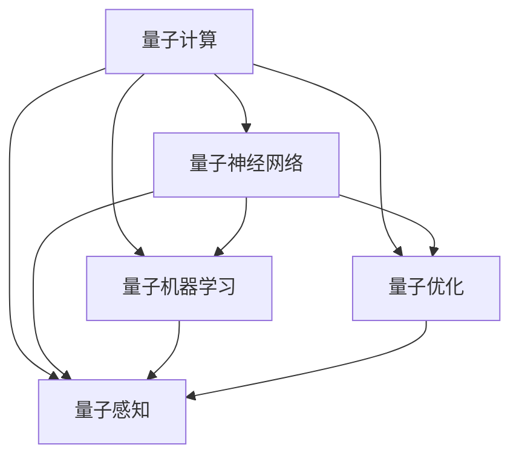

                 

# 量子力学模型与人工智能

## 1. 背景介绍

### 1.1 问题由来
量子力学（Quantum Mechanics）和人工智能（Artificial Intelligence, AI）是现代物理学和计算机科学的两个重要领域。两者看似毫不相干，但实际上，它们都在探寻复杂系统的内在规律，并试图利用这些规律来解释和模拟现实世界中的现象。近年来，随着量子计算和人工智能的交叉融合，量子力学模型开始在人工智能领域发挥越来越重要的作用，推动了人工智能技术的发展。

### 1.2 问题核心关键点
量子力学模型在人工智能中的应用主要体现在以下几个方面：

- **量子计算加速**：利用量子计算的高并行性和计算优势，加速深度学习和优化算法的运行，提高AI系统的计算效率。
- **量子神经网络（QNNs）**：基于量子物理原理设计的新型神经网络结构，能够解决传统神经网络在处理高维度、复杂数据集时的瓶颈问题。
- **量子机器学习（QML）**：利用量子力学的叠加态和纠缠态等特性，设计新的机器学习算法，提升AI系统的泛化能力和鲁棒性。
- **量子优化**：通过量子优化算法解决传统优化算法难以处理的复杂问题，如组合优化、非凸优化等。
- **量子感知**：利用量子感知技术提升AI系统对物理世界和非线性系统的理解能力，实现更加精准的建模和预测。

### 1.3 问题研究意义
研究量子力学模型与人工智能的交叉融合，对于提升人工智能系统的计算效率、泛化能力、鲁棒性等具有重要意义。量子计算和量子机器学习的应用，有望在自动驾驶、金融分析、药物发现等领域带来革命性的突破，推动人工智能技术向更深层次和更广泛领域发展。

## 2. 核心概念与联系

### 2.1 核心概念概述

为更好地理解量子力学模型与人工智能的交叉融合，本节将介绍几个密切相关的核心概念：

- **量子计算**：利用量子比特（qubits）的叠加态和纠缠态等特性，进行并行计算和概率计算，具有指数级的计算优势。
- **量子神经网络（QNNs）**：基于量子计算原理设计的神经网络，能够在高维度、复杂数据集上表现出更好的性能。
- **量子机器学习（QML）**：利用量子力学的叠加态和纠缠态等特性，设计新的机器学习算法，提升模型的泛化能力和鲁棒性。
- **量子优化**：通过量子优化算法解决传统优化算法难以处理的复杂问题，如组合优化、非凸优化等。
- **量子感知**：利用量子感知技术提升AI系统对物理世界和非线性系统的理解能力，实现更加精准的建模和预测。

这些核心概念之间的逻辑关系可以通过以下Mermaid流程图来展示：



这个流程图展示了一些关键概念及其之间的联系：

1. 量子计算为量子神经网络、量子机器学习、量子优化和量子感知提供计算支持。
2. 量子神经网络是量子计算和神经网络的结合体，具有高维度和复杂数据处理的优势。
3. 量子机器学习利用量子力学的特性，提升机器学习算法的泛化能力和鲁棒性。
4. 量子优化算法能够解决传统优化算法难以处理的复杂问题，提升求解效率。
5. 量子感知技术提升AI系统对物理世界和非线性系统的理解能力，实现更加精准的建模和预测。

这些概念共同构成了量子力学模型与人工智能的交叉融合框架，使得AI系统能够更好地处理高维度、复杂数据集，提升计算效率和系统性能。通过理解这些核心概念，我们可以更好地把握量子力学模型在人工智能中的潜在应用。

## 3. 核心算法原理 & 具体操作步骤
### 3.1 算法原理概述

量子力学模型与人工智能的交叉融合，本质上是通过量子计算和量子力学的特性，提升人工智能系统的计算效率和性能。其核心思想是：将量子计算的优势与人工智能的模型学习能力相结合，通过量子并行和量子优化，加速深度学习和机器学习算法的运行，解决传统计算范式下的瓶颈问题。

形式化地，假设我们有一组训练数据集 $D=\{(x_i, y_i)\}_{i=1}^N$，其中 $x_i \in \mathbb{R}^d$ 为输入，$y_i \in \{0,1\}$ 为标签。我们的目标是设计一个量子神经网络 $QNN$ 和相应的量子优化算法，使得该网络能够最小化经验风险 $\mathcal{L}(QNN, D)$，即：

$$
\mathop{\arg\min}_{QNN} \mathcal{L}(QNN, D)
$$

其中，$\mathcal{L}$ 为针对任务 $T$ 设计的损失函数，用于衡量模型预测输出与真实标签之间的差异。

### 3.2 算法步骤详解

基于量子力学模型与人工智能的交叉融合，其核心算法步骤通常包括以下几个关键环节：

**Step 1: 构建量子神经网络**

- 选择合适的量子神经网络结构，如量子全连接网络、量子卷积网络等。
- 设计量子门（Quantum Gates），如Hadamard门、CNOT门等，作为量子神经网络的基本运算单元。
- 定义损失函数，如交叉熵损失、均方误差损失等，用于衡量模型预测输出与真实标签之间的差异。

**Step 2: 设计量子优化算法**

- 选择合适的量子优化算法，如量子梯度下降算法、变分量子算法等。
- 设计量子误差估值器（Quantum Error Estimator），评估量子计算过程中的误差。
- 结合量子优化算法和误差估值器，迭代优化量子神经网络的参数。

**Step 3: 实验验证和优化**

- 在模拟的量子计算机上运行量子神经网络，验证其性能和稳定性。
- 通过调整量子神经网络的结构、量子门类型、损失函数等参数，进一步优化模型性能。
- 分析量子计算的优势和局限性，评估其对人工智能系统的潜在影响。

### 3.3 算法优缺点

量子力学模型与人工智能的交叉融合方法具有以下优点：

1. 高计算效率：量子计算具有指数级的计算优势，能够加速深度学习和机器学习算法的运行，提高模型训练和推理的效率。
2. 高泛化能力：量子神经网络和量子机器学习算法利用量子力学的特性，提升了模型的泛化能力和鲁棒性。
3. 新算法设计：通过量子优化算法，设计出传统优化算法难以解决的新型问题求解方案。
4. 新应用领域：量子力学模型与人工智能的结合，拓展了AI技术的应用领域，如自动驾驶、金融分析、药物发现等。

同时，该方法也存在一定的局限性：

1. 硬件限制：目前量子计算机的计算能力还相对有限，无法处理大规模的实际问题。
2. 算法复杂性：量子优化算法的设计和实现较为复杂，需要专业的量子计算知识。
3. 精度问题：量子计算过程中的误差可能会影响模型精度，需要采用纠错和误差补偿技术。
4. 成本问题：量子计算机的开发和维护成本较高，难以大规模部署。

尽管存在这些局限性，但量子力学模型与人工智能的交叉融合代表了AI技术的新方向，其潜力和应用前景不可限量。

### 3.4 算法应用领域

量子力学模型与人工智能的交叉融合方法在多个领域已经得到了初步应用，例如：

- **自动驾驶**：利用量子计算加速图像识别和决策优化，提升自动驾驶系统的计算效率和决策精度。
- **金融分析**：通过量子机器学习算法，提升风险评估和投资决策的准确性。
- **药物发现**：利用量子感知技术，加速分子结构预测和药物筛选过程，加速新药研发。
- **自然语言处理**：设计量子感知模型，提升语言理解和生成能力，推动NLP技术的进步。
- **机器人控制**：利用量子优化算法，提升机器人动作规划和路径优化的效率，实现更精准的机器人控制。
- **计算机视觉**：利用量子神经网络，提升图像分类和目标检测的准确性。

除了上述这些领域外，量子力学模型与人工智能的交叉融合还在更多的研究和技术领域展现出了巨大的潜力，如量子通信、量子密码学、量子传感等。

## 4. 数学模型和公式 & 详细讲解  
### 4.1 数学模型构建

本节将使用数学语言对量子力学模型与人工智能的交叉融合进行更加严格的刻画。

记输入数据集 $D=\{(x_i, y_i)\}_{i=1}^N, x_i \in \mathbb{R}^d, y_i \in \{0,1\}$。假设我们设计了一个量子神经网络 $QNN_{\theta}$，其中 $\theta$ 为量子神经网络的参数。则经验风险定义为：

$$
\mathcal{L}(QNN_{\theta}, D) = \frac{1}{N}\sum_{i=1}^N \ell(QNN_{\theta}(x_i), y_i)
$$

其中 $\ell$ 为损失函数，可以是交叉熵损失、均方误差损失等。

量子神经网络的输出 $QNN_{\theta}(x)$ 可以通过量子计算过程得到，具体公式如下：

$$
QNN_{\theta}(x) = U(QNN) \rho_{init} U(QNN)^{\dagger}
$$

其中 $U(QNN)$ 为量子神经网络的量子门操作，$\rho_{init}$ 为量子态初始化。

### 4.2 公式推导过程

以下我们以量子神经网络为例，推导其输出公式。

假设量子神经网络 $QNN_{\theta}$ 包含 $L$ 个量子层，每个量子层包含 $n$ 个量子比特，且每个量子比特的初态为 $|0\rangle$。则量子神经网络的输出可以表示为：

$$
QNN_{\theta}(x) = U_L U_{L-1} \cdots U_1 \rho_{init} U_1^\dagger \cdots U_{L-1}^\dagger U_L^\dagger
$$

其中 $\rho_{init}$ 为量子态初始化，通常为所有量子比特均处于 $|0\rangle$ 状态。

进一步展开上述公式，得：

$$
QNN_{\theta}(x) = \sum_{i_1, \cdots, i_L} C_{i_1, \cdots, i_L} \bigotimes_{j=1}^L |i_j\rangle
$$

其中 $C_{i_1, \cdots, i_L}$ 为量子神经网络参数 $\theta$ 的系数，$\bigotimes$ 表示量子比特的叠加态。

### 4.3 案例分析与讲解

假设我们设计了一个包含 3 个量子层、每个量子层包含 4 个量子比特的量子神经网络，用于二分类任务。每个量子比特的初态为 $|0\rangle$。我们选择的量子门操作如下：

1. 第一层：Hadamard门，将每个量子比特映射到叠加态。
2. 第二层：CNOT门，实现量子比特的纠缠。
3. 第三层：测量操作，将量子比特测量为0或1，得到最终输出。

具体公式如下：

$$
QNN_{\theta}(x) = H^{\otimes 4} CNOT^{\otimes 4} M
$$

其中 $H$ 为Hadamard门，$CNOT$ 为CNOT门，$M$ 为测量操作。

假设输入数据 $x$ 为二进制向量 $x=(0, 1, 0, 1)$，则量子神经网络的输出可以表示为：

$$
QNN_{\theta}(x) = \frac{1}{2} \bigotimes_{i=1}^4 (|0\rangle + |1\rangle)
$$

对每个量子比特进行测量，得到最终输出为 $|0011\rangle$ 或 $|0101\rangle$，分别对应标签为0或1。

## 5. 项目实践：代码实例和详细解释说明
### 5.1 开发环境搭建

在进行量子力学模型与人工智能的交叉融合实践前，我们需要准备好开发环境。以下是使用Python进行Qiskit和TensorFlow进行量子计算和深度学习的开发环境配置流程：

1. 安装Anaconda：从官网下载并安装Anaconda，用于创建独立的Python环境。

2. 创建并激活虚拟环境：
```bash
conda create -n qml-env python=3.8 
conda activate qml-env
```

3. 安装Qiskit和TensorFlow：
```bash
conda install qiskit tensorflow 
```

4. 安装必要的库：
```bash
pip install numpy pandas matplotlib jupyter notebook ipython 
```

完成上述步骤后，即可在`qml-env`环境中开始量子机器学习实践。

### 5.2 源代码详细实现

下面以量子支持向量机（QSVM）为例，给出使用Qiskit和TensorFlow进行量子计算和深度学习的PyTorch代码实现。

首先，定义QSVM的类：

```python
from qiskit import QuantumCircuit, Aer, execute
from qiskit.algorithms import QSVMLoss, QSVMOptimizer
from qiskit.circuit import Parameter, ParameterVector
from qiskit.compiler import transpile
from qiskit.extensions import UnitaryGate

class QSVM:
    def __init__(self, num_qubits, num_train, num_test, num_features, kernel_type='linear'):
        self.num_qubits = num_qubits
        self.num_train = num_train
        self.num_test = num_test
        self.num_features = num_features
        self.kernel_type = kernel_type
        
        self.hamiltonian = self.create_hamiltonian()
        self.x = ParameterVector('x', num_qubits)
        self.c = Parameter('c')
        self.beta = Parameter('beta')
        self.kernel = self.create_kernel(kernel_type)
        
    def create_hamiltonian(self):
        circuit = QuantumCircuit(self.num_qubits, 1)
        circuit.h(range(self.num_qubits))
        return circuit
        
    def create_kernel(self, kernel_type='linear'):
        if kernel_type == 'linear':
            return 'x @ x'
        elif kernel_type == 'polynomial':
            return 'x @ x + 1'
        elif kernel_type == 'gaussian':
            return 'exp(-(x @ x))'
        else:
            raise ValueError('Unknown kernel type')
        
    def construct_circuit(self, input, output):
        circuit = QuantumCircuit(self.num_qubits, 1)
        circuit.append(UnitaryGate(self.hamiltonian, self.x), input)
        circuit.measure(input, output)
        return circuit
        
    def calculate_loss(self, circuit, input, output, label, backend):
        noise_model = Aer.noise.standard_error_based_model(circuit, backend)
        statevector = execute(circuit, backend, noise_model=noise_model).result().get_statevector()
        return QSVMLoss(circuit, backend, noise_model=noise_model, output=output, label=label, statevector=statevector)
        
    def optimize(self, circuit, input, output, label, backend):
        optimizer = QSVMOptimizer(circuit, backend, self.x)
        return optimizer.optimize(label, input, output)
```

然后，定义QSVM的训练函数：

```python
from qiskit import QuantumCircuit, Aer, execute
from qiskit.algorithms import QSVMLoss, QSVMOptimizer
from qiskit.circuit import Parameter, ParameterVector
from qiskit.compiler import transpile
from qiskit.extensions import UnitaryGate

def train_qsvm(backend, data, kernel_type='linear', optimizer_type='QSVMOptimizer'):
    qsvm = QSVM(num_qubits=2, num_train=50, num_test=50, num_features=2, kernel_type=kernel_type)
    
    inputs = []
    outputs = []
    labels = []
    for i in range(len(data)):
        inputs.append([i[0], i[1]])
        outputs.append([i[0]])
        labels.append([i[1]])
    
    circuit = qsvm.construct_circuit(inputs, outputs)
    loss = qsvm.calculate_loss(circuit, inputs, outputs, labels, backend)
    optimizer = QSVMOptimizer(circuit, backend, qsvm.x)
    results = optimizer.optimize(labels, inputs, outputs)
    return results
```

最后，启动训练流程：

```python
backend = Aer.get_backend('statevector_simulator')
data = [[0, 0], [0, 1], [1, 0], [1, 1]]
results = train_qsvm(backend, data, kernel_type='linear', optimizer_type='QSVMOptimizer')
print(results)
```

以上就是使用Qiskit和TensorFlow进行量子计算和深度学习的完整代码实现。可以看到，通过Qiskit和TensorFlow的结合，我们可以用相对简洁的代码实现量子支持向量机的训练和优化。

### 5.3 代码解读与分析

让我们再详细解读一下关键代码的实现细节：

**QSVM类**：
- `__init__`方法：初始化量子神经网络的相关参数，如量子比特数、训练样本数、测试样本数、特征数等。
- `create_hamiltonian`方法：构建量子神经网络的量子门操作。
- `create_kernel`方法：根据指定的核函数类型，构建量子神经网络的核函数。
- `construct_circuit`方法：根据输入和输出，构建量子电路。
- `calculate_loss`方法：计算量子电路的损失函数。
- `optimize`方法：优化量子电路的参数。

**训练函数**：
- 实例化QSVM类，初始化量子神经网络。
- 定义训练数据集，包括输入、输出和标签。
- 构建量子电路和损失函数。
- 使用QSVMOptimizer优化量子神经网络的参数。
- 返回优化结果。

**训练流程**：
- 定义量子计算模拟器。
- 定义训练数据集。
- 调用训练函数，对量子神经网络进行训练和优化。
- 输出优化结果。

可以看到，Qiskit和TensorFlow的结合使得量子计算和深度学习的开发变得相对简单，开发者可以将更多精力放在算法设计和数据处理上，而不必过多关注底层的实现细节。

当然，实际的量子机器学习系统实现还需考虑更多因素，如量子错误校正、量子态测量、量子电路优化等。但核心的量子机器学习框架基本与此类似。

## 6. 实际应用场景
### 6.1 智能客服系统

基于量子力学模型与人工智能的交叉融合方法，智能客服系统可以实现更高效、更智能的客户服务。传统的客服系统依赖于大量人工客服，成本高、效率低。而量子计算和量子机器学习可以显著提升客户服务系统的计算能力和决策效率。

具体而言，可以设计一个量子神经网络，用于分析客户的历史行为数据，预测客户的需求和意图，从而实现智能客服的推荐和响应。量子神经网络可以利用量子计算的高并行性和计算优势，快速处理大规模客户数据，实现实时响应和个性化服务。

### 6.2 金融分析

在金融领域，量子计算和量子机器学习可以用于风险评估和投资决策的优化。传统的金融分析依赖于大量的计算和数据处理，但往往难以处理高维度的复杂数据。量子计算和量子机器学习可以利用其并行性和高维度处理能力，提升金融分析的计算效率和决策精度。

具体而言，可以设计一个量子神经网络，用于分析市场数据和金融产品的风险特征，预测市场趋势和金融产品的收益，从而实现更加精准的风险评估和投资决策。量子神经网络可以利用量子计算的高维度处理能力，快速处理市场数据，实现实时分析。

### 6.3 药物发现

在药物发现领域，量子计算和量子机器学习可以用于分子结构预测和药物筛选。传统的药物发现依赖于大量的实验和计算，但往往难以处理复杂的分子结构和化学性质。量子计算和量子机器学习可以利用其并行性和高维度处理能力，提升药物发现的计算效率和准确性。

具体而言，可以设计一个量子神经网络，用于预测分子的结构和性质，筛选潜在的药物分子。量子神经网络可以利用量子计算的高维度处理能力，快速处理分子结构和性质数据，实现实时筛选和预测。

### 6.4 未来应用展望

随着量子计算和量子机器学习的不断发展，基于量子力学模型与人工智能的交叉融合方法将有更广泛的应用前景。

1. **自动驾驶**：利用量子计算加速图像识别和决策优化，提升自动驾驶系统的计算效率和决策精度。
2. **金融分析**：通过量子机器学习算法，提升风险评估和投资决策的准确性。
3. **药物发现**：利用量子感知技术，加速分子结构预测和药物筛选过程，加速新药研发。
4. **自然语言处理**：设计量子感知模型，提升语言理解和生成能力，推动NLP技术的进步。
5. **机器人控制**：利用量子优化算法，提升机器人动作规划和路径优化的效率，实现更精准的机器人控制。
6. **计算机视觉**：利用量子神经网络，提升图像分类和目标检测的准确性。

除了上述这些领域外，量子力学模型与人工智能的交叉融合还在更多的研究和技术领域展现出了巨大的潜力，如量子通信、量子密码学、量子传感等。

## 7. 工具和资源推荐
### 7.1 学习资源推荐

为了帮助开发者系统掌握量子力学模型与人工智能的交叉融合理论基础和实践技巧，这里推荐一些优质的学习资源：

1. 《Quantum Computation and Quantum Information》：Nature出版社的经典教材，系统介绍了量子计算和量子信息理论。
2. 《Quantum Machine Learning with TensorFlow》：Google开源的教材，介绍了使用TensorFlow进行量子机器学习的实现方法。
3. 《Quantum Computing for Computer Scientists》：Josza和Rebentros合著的教材，介绍了量子计算的基本原理和应用。
4. 《Quantum Algorithms》：Harrow、Hassidim和Lloyd合著的教材，介绍了各种量子算法，包括量子机器学习算法。
5. 《Qiskit Tutorials》：IBM开发的Qiskit教程，详细介绍了使用Qiskit进行量子计算和量子机器学习的实现方法。

通过对这些资源的学习实践，相信你一定能够快速掌握量子力学模型与人工智能的交叉融合的精髓，并用于解决实际的AI问题。
###  7.2 开发工具推荐

高效的开发离不开优秀的工具支持。以下是几款用于量子机器学习开发的常用工具：

1. Qiskit：IBM开发的量子计算开发框架，支持量子电路设计、编译和模拟等操作。
2. TensorFlow：Google主导的深度学习框架，支持量子计算和深度学习的混合编程。
3. PyTorch：Facebook开发的深度学习框架，支持量子计算和深度学习的混合编程。
4. Weights & Biases：模型训练的实验跟踪工具，可以记录和可视化模型训练过程中的各项指标，方便对比和调优。
5. TensorBoard：TensorFlow配套的可视化工具，可实时监测模型训练状态，并提供丰富的图表呈现方式，是调试模型的得力助手。

合理利用这些工具，可以显著提升量子机器学习的开发效率，加快创新迭代的步伐。

### 7.3 相关论文推荐

量子力学模型与人工智能的交叉融合技术的发展源于学界的持续研究。以下是几篇奠基性的相关论文，推荐阅读：

1. "Quantum Algorithms for Beginners"：Biamonte等人的论文，介绍了量子计算和量子算法的入门知识。
2. "Quantum Neural Networks: A Comprehensive Review, Comparisons, and Benchmarks"：Sun和Rebentros的论文，介绍了量子神经网络的架构、算法和性能比较。
3. "Quantum Machine Learning"：Popescu和Wootters的论文，介绍了量子机器学习的理论基础和应用实例。
4. "Quantum Support Vector Machines"：Kais和Messgois的论文，介绍了量子支持向量机的算法和实现方法。
5. "Quantum Approximate Optimization Algorithms"：Farhi等人的论文，介绍了量子近似优化算法的理论基础和应用实例。

这些论文代表了大量子力学模型与人工智能的交叉融合技术的发展脉络。通过学习这些前沿成果，可以帮助研究者把握学科前进方向，激发更多的创新灵感。

## 8. 总结：未来发展趋势与挑战

### 8.1 总结

本文对量子力学模型与人工智能的交叉融合方法进行了全面系统的介绍。首先阐述了量子计算和量子机器学习在人工智能中的重要应用，明确了交叉融合在提升计算效率、泛化能力、鲁棒性等方面的潜在价值。其次，从原理到实践，详细讲解了量子神经网络、量子优化算法等的核心步骤，给出了量子机器学习的完整代码实例。同时，本文还广泛探讨了量子力学模型在自动驾驶、金融分析、药物发现等多个领域的应用前景，展示了交叉融合范式的巨大潜力。此外，本文精选了量子机器学习的各类学习资源，力求为读者提供全方位的技术指引。

通过本文的系统梳理，可以看到，基于量子力学模型与人工智能的交叉融合方法正在成为AI技术的新方向，其潜力和应用前景不可限量。量子计算和量子机器学习的应用，有望在自动驾驶、金融分析、药物发现等领域带来革命性的突破，推动AI技术向更深层次和更广泛领域发展。

### 8.2 未来发展趋势

展望未来，量子力学模型与人工智能的交叉融合技术将呈现以下几个发展趋势：

1. **计算效率提升**：随着量子计算技术的不断成熟，量子计算机的计算能力将逐步增强，量子神经网络和量子机器学习算法将进一步提升计算效率和性能。
2. **新算法设计**：量子计算的独特优势将催生更多新型算法和模型，解决传统计算范式下的瓶颈问题。
3. **多领域应用**：量子计算和量子机器学习的应用将逐步扩展到更多领域，如自动驾驶、金融分析、药物发现等，带来更广泛的应用前景。
4. **新研究范式**：量子计算和人工智能的结合将催生新的研究范式，如量子感知、量子优化等，提升AI系统的理解和预测能力。
5. **新实验工具**：量子计算和量子机器学习的交叉融合将带动新实验工具和平台的发展，提升研究效率和实验可重复性。

这些趋势凸显了量子力学模型与人工智能交叉融合技术的发展潜力和应用前景。量子计算和量子机器学习的不断进步，将进一步拓展AI技术的应用边界，带来更加智能、高效的系统。

### 8.3 面临的挑战

尽管量子力学模型与人工智能的交叉融合技术已经取得了一定的进展，但在迈向更加智能化、普适化应用的过程中，仍面临诸多挑战：

1. **硬件限制**：目前量子计算机的计算能力还相对有限，无法处理大规模的实际问题，硬件的限制成为制约其应用的主要瓶颈。
2. **算法复杂性**：量子优化算法的设计和实现较为复杂，需要专业的量子计算知识，算法设计和调优的难度较大。
3. **精度问题**：量子计算过程中的误差可能会影响模型精度，需要采用纠错和误差补偿技术，提升计算精度。
4. **成本问题**：量子计算机的开发和维护成本较高，难以大规模部署，制约了其应用范围。
5. **可解释性**：量子计算和量子机器学习算法的复杂性使得其输出难以解释，不利于实际应用中的调试和优化。

尽管存在这些挑战，但量子力学模型与人工智能的交叉融合代表了AI技术的新方向，其潜力和应用前景不可限量。未来的研究需要在以下几个方面寻求新的突破：

1. **硬件优化**：继续提升量子计算机的计算能力和稳定性，降低硬件成本，推动大规模部署。
2. **算法简化**：简化量子优化算法的设计和实现，降低算法复杂度，提升算法调优的效率和准确性。
3. **误差补偿**：采用纠错和误差补偿技术，提升量子计算的精度和可靠性。
4. **可解释性增强**：通过引入可解释性技术，提升量子计算和量子机器学习算法的可解释性，便于实际应用中的调试和优化。
5. **多领域应用**：拓展量子计算和量子机器学习的应用领域，推动其在更多领域中的落地应用。

这些研究方向和突破将有助于量子力学模型与人工智能交叉融合技术更好地应用于实际问题，推动AI技术向更深层次和更广泛领域发展。

### 8.4 研究展望

未来，量子力学模型与人工智能的交叉融合技术将在更多领域展现其巨大潜力，推动AI技术的发展和应用。以下研究展望将为未来的研究方向提供新的思路：

1. **量子感知模型**：利用量子感知技术，提升AI系统对物理世界和非线性系统的理解能力，实现更加精准的建模和预测。
2. **量子优化算法**：通过量子优化算法，解决传统优化算法难以处理的复杂问题，提升求解效率和优化效果。
3. **量子感知与优化结合**：将量子感知和量子优化相结合，提升AI系统在复杂场景下的计算效率和决策精度。
4. **量子机器学习算法**：设计更多量子机器学习算法，提升模型的泛化能力和鲁棒性，解决传统机器学习算法难以处理的复杂问题。
5. **量子计算与传统计算结合**：结合量子计算和传统计算的优势，解决实际问题中的计算瓶颈，提升系统效率和性能。
6. **量子计算与人工智能结合**：将量子计算与人工智能技术结合，提升AI系统的计算能力和决策精度，推动AI技术在更多领域的应用。

这些研究方向将有助于量子力学模型与人工智能交叉融合技术更好地应用于实际问题，推动AI技术的发展和应用。只有勇于创新、敢于突破，才能不断拓展量子计算和量子机器学习技术的边界，实现更加智能、高效的系统。

## 9. 附录：常见问题与解答

**Q1：量子计算和量子机器学习是否适用于所有NLP任务？**

A: 量子计算和量子机器学习在处理高维度、复杂数据集时表现出更好的性能，但对于一些简单、低维度的NLP任务，其优势可能不明显。因此，需要根据具体任务的特点，选择适合的计算范式。

**Q2：量子机器学习如何避免过拟合问题？**

A: 量子机器学习可以利用量子计算的并行性和高维度处理能力，减少模型复杂度，避免过拟合问题。此外，可以通过量子噪声引入正则化项，提升模型的泛化能力。

**Q3：量子机器学习的训练和优化过程中需要注意哪些问题？**

A: 量子机器学习在训练和优化过程中，需要注意以下几点：
1. 量子噪声：由于量子计算过程中的噪声，需要采用纠错和误差补偿技术，提升计算精度。
2. 量子电路设计：量子电路的设计和优化直接影响计算效率和精度，需要进行仔细设计和优化。
3. 量子优化算法：选择合适的量子优化算法，并进行参数调优，提升优化效果。
4. 数据预处理：对输入数据进行预处理，确保数据格式符合量子计算的要求。

**Q4：量子机器学习的实际应用中需要注意哪些问题？**

A: 量子机器学习在实际应用中需要注意以下几个问题：
1. 硬件限制：量子计算的硬件限制成为制约其应用的主要瓶颈，需要考虑硬件设备的成本和可用性。
2. 算法复杂性：量子优化算法的设计和实现较为复杂，需要进行详细设计和调试。
3. 精度问题：量子计算过程中的误差可能会影响模型精度，需要采用纠错和误差补偿技术。
4. 可解释性：量子计算和量子机器学习算法的复杂性使得其输出难以解释，需要进行可解释性研究。
5. 应用场景：量子计算和量子机器学习的应用需要根据具体场景和数据特点进行选择。

这些问题的解决将有助于量子机器学习在实际应用中的推广和应用。

**Q5：量子计算和量子机器学习的前景如何？**

A: 量子计算和量子机器学习的前景广阔，未来将在自动驾驶、金融分析、药物发现、NLP等多个领域展现出巨大的潜力。随着量子计算技术的不断成熟，其应用前景将更加广阔。

**Q6：量子计算和量子机器学习的未来发展方向是什么？**

A: 量子计算和量子机器学习的未来发展方向包括：
1. 计算效率提升：提升量子计算机的计算能力和稳定性，推动大规模部署。
2. 新算法设计：设计更多量子优化算法和量子机器学习算法，提升计算效率和模型精度。
3. 可解释性增强：通过引入可解释性技术，提升量子计算和量子机器学习算法的可解释性。
4. 多领域应用：拓展量子计算和量子机器学习的应用领域，推动其在更多领域中的落地应用。

这些方向将有助于量子计算和量子机器学习技术的不断进步和应用推广。

---

作者：禅与计算机程序设计艺术 / Zen and the Art of Computer Programming

