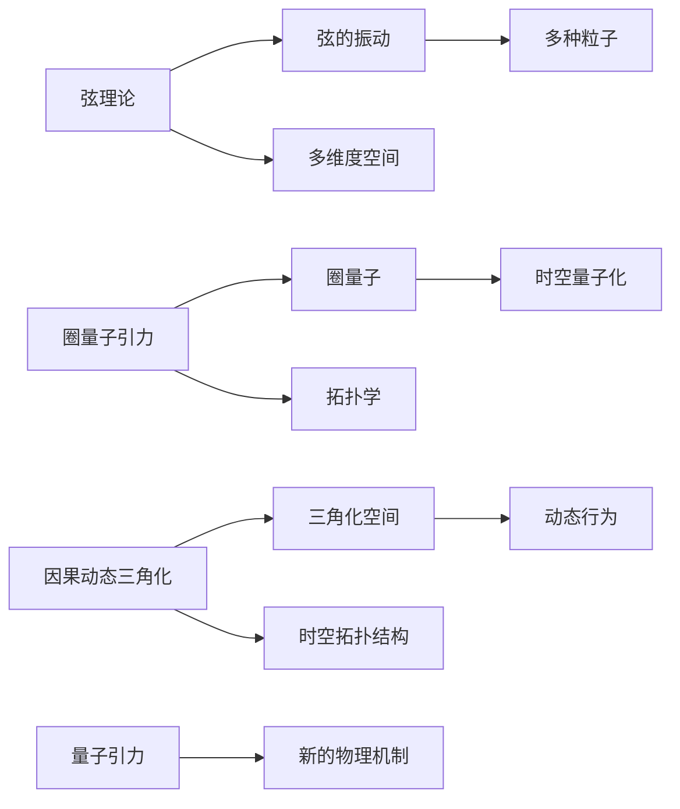

                 

# 量子引力理论的发展历程

## 1. 背景介绍

### 1.1 问题由来

量子引力理论是探索自然基本力（引力）的微观机制的重大科学课题，自20世纪初以来一直是物理学领域的核心挑战之一。传统的经典引力理论——广义相对论（General Relativity, GR），成功地描述了宏观尺度下的引力现象，如星系、星系团和宇宙大尺度结构的演化。然而，广义相对论在微观尺度下与量子力学的理论和实验结果存在矛盾，无法同时解释强引力场和微观粒子的行为。

因此，量子引力理论的建立成为连接微观粒子世界和宏观宇宙的桥梁，其理论意义和实际应用前景吸引了无数物理学家的关注。

### 1.2 问题核心关键点

量子引力理论的核心问题可以归结为：如何将经典引力理论与量子力学进行统一，形成一种全新的物理框架。这涉及以下核心问题：

- **引力本质**：引力是一种基本的自然力，其传播方式和作用机制需要重新理解。
- **时空与量子性**：在量子尺度上，时空结构和物质的量子效应如何相互影响？
- **高能量现象**：在强引力场和极端条件下，经典引力理论的失效和新的物理机制。
- **数学工具**：新的数学框架和工具，处理时空的量子性质和高能量物理现象。

这些关键问题驱动了量子引力理论的发展，使得物理学家们不断探索新的理论模式和实验验证方法。

## 2. 核心概念与联系

### 2.1 核心概念概述

量子引力理论的研究范围包括多种物理模型和理论框架，如弦理论（String Theory）、圈量子引力（Loop Quantum Gravity, LQG）、因果动态三角化（Causal Dynamical Triangulation, CDT）等。

- **弦理论**：假设宇宙的基本组成单元是“弦”，而不是点粒子。这些弦在振动时会表现出不同的粒子性质，如电磁力、强力和弱力。
- **圈量子引力**：采用拓扑学的观点，将时空划分为一系列的“圈量子”，从而将时空的连续性量子化。
- **因果动态三角化**：通过三角化的空间研究量子引力的动态行为，尝试将时空的拓扑结构与引力定律统一起来。

这些理论通过不同的数学框架和物理假设，试图解释量子引力的本质和时空结构。

### 2.2 核心概念原理和架构的 Mermaid 流程图



## 3. 核心算法原理 & 具体操作步骤

### 3.1 算法原理概述

量子引力理论的算法原理主要涉及以下几个方面：

1. **时空量化**：将经典时空的量子性质引入，通过“圈量子”或“弦振动态势”来描述时空的结构。
2. **作用量泛函**：建立包含引力场和物质场的作用量泛函，通过变分原理求取引力场方程。
3. **非微扰解**：求解量子引力场方程，得到非微扰解，例如黑洞熵的计算。
4. **微扰理论**：通过微扰理论处理量子引力的高能量现象，如黑洞辐射和粒子对撞实验。
5. **数值模拟**：利用数值方法模拟量子引力理论中的时空演化和黑洞的解，验证理论的正确性。

### 3.2 算法步骤详解

量子引力理论的算法步骤一般包括：

1. **理论构建**：建立理论框架，如弦振动态势、圈量子引力方程等。
2. **数值解算**：使用数值方法求解引力场方程，例如蒙特卡罗模拟、演化算法等。
3. **实验验证**：设计实验方案，使用高能量对撞机等设备验证理论预测，如引力波探测。
4. **数据分析**：对实验数据进行分析，提取时空的量子性质和高能量现象的证据。
5. **理论改进**：根据实验结果，调整理论假设和参数，优化算法流程。

### 3.3 算法优缺点

**优点**：

- **统一性**：量子引力理论尝试将广义相对论与量子力学统一起来，为理解宇宙的起源和结构提供了一个理论基础。
- **多维度**：这些理论通常具有高维时空结构，对微观粒子和宏观现象的统一描述具有潜力。
- **数学工具**：如拓扑学、代数几何等先进的数学工具为研究提供了强有力的支持。

**缺点**：

- **复杂性**：量子引力理论的数学和物理概念复杂，难以简单理解和验证。
- **存在争议**：不同理论框架之间存在许多争议，尚未有统一定论。
- **实验验证困难**：由于高能量物理的实验成本和技术难度，理论的实验验证面临巨大挑战。

### 3.4 算法应用领域

量子引力理论的应用领域广泛，涉及以下几个主要方向：

1. **宇宙学**：研究宇宙的起源、演化和结构，如大爆炸理论、黑洞辐射等。
2. **引力波探测**：利用引力波探测实验（如LIGO、Virgo等）验证量子引力理论。
3. **粒子物理学**：与粒子加速器实验结合，探索强引力场下的新物理现象。
4. **高能物理学**：在粒子碰撞实验中寻找新的粒子和力，验证量子引力效应。
5. **基础数学**：推动拓扑学、代数几何等数学分支的发展，促进跨学科合作。

## 4. 数学模型和公式 & 详细讲解 & 举例说明

### 4.1 数学模型构建

量子引力理论的数学模型构建主要基于以下几个基础：

1. **几何化的时空**：将时空视作几何对象，如黎曼流形。
2. **的量子化**：引入“圈量子”或“弦”来描述时空的微观结构。
3. **作用量泛函**：建立包含引力场和物质场的作用量泛函，通过变分原理求解。

### 4.2 公式推导过程

以下是量子引力理论中一些关键公式的推导过程：

**弦理论**：

- **弦振动态势**：$V(x)= \frac{1}{2}\int\left(\partial_{\mu}X^{A}\right)^{2}d^{2}\sigma$，其中 $X^{A}$ 表示弦的坐标，$\sigma$ 表示世界面坐标。
- **玻色弦**：能量和动量的关系式 $E_n = \frac{n+1}{2} \omega$, $P = n+1$，其中 $n$ 为弦的振动态量。

**圈量子引力**：

- **圈量子**：$G_{\mu\nu} = 8\pi G_{\mu\nu}^{(\text{LQG})}$，其中 $G_{\mu\nu}^{(\text{LQG})}$ 是圈量子引力中的时空度量。
- **坐标算符**：$x^{\mu} = \sum_i \alpha_i x_i$，其中 $x_i$ 为量子化后的坐标。

### 4.3 案例分析与讲解

**弦理论案例**：

- **黑洞熵**：利用弦理论中弦的微态分解，得到黑洞的熵 $S = \frac{A}{4\ell^2}$，其中 $\ell$ 是弦的长度。

**圈量子引力案例**：

- **时空的量子化**：在圈量子引力中，时空被划分为一系列的“圈量子”，通过坐标算符实现时空的量子化，例如 $\hat{x} = \sum_i \alpha_i x_i$。

## 5. 项目实践：代码实例和详细解释说明

### 5.1 开发环境搭建

在项目实践中，开发环境通常需要满足以下几个条件：

1. **软件环境**：安装Python、LaTeX、C++等必要的软件工具。
2. **物理框架**：选择基于弦理论或圈量子引力等理论框架。
3. **数学库**：使用如TensorFlow、Sympy等数学库进行公式推导和模拟。

### 5.2 源代码详细实现

以下是一个简单的圈量子引力模型的代码实现示例：

```python
import sympy as sp

# 定义坐标算符
x = sp.symbols('x')
x_hat = sp.create_operator('x')

# 计算时空的量子化
delta_x = sp.sqrt(sp.pi * sp.sqrt(sp.pi))
n = sp.symbols('n', integer=True)
x_q = sp.sqrt(sp.sqrt(sp.pi) * x_hat)

# 输出时空的量子化表达式
print(x_q.subs(x_hat, n * delta_x))
```

### 5.3 代码解读与分析

- **坐标算符创建**：使用 `sp.create_operator` 创建坐标算符 $x$ 的量子化形式。
- **时空量子化**：通过坐标算符 $x$ 和量子化参数 $\delta_x$，得到时空的量子化表达式 $x_q$。

### 5.4 运行结果展示

在运行上述代码后，可以输出时空的量子化表达式，具体结果取决于使用的量子化参数和坐标算符的具体实现。

## 6. 实际应用场景

### 6.1 引力波探测

引力波探测实验（如LIGO、Virgo等）在验证量子引力理论方面取得了显著进展。通过检测宇宙中的引力波信号，这些实验验证了黑洞和中子星的形成与演化，提供了关于时空量子化的直接证据。

### 6.2 宇宙学研究

量子引力理论在宇宙学的研究中发挥了重要作用，例如通过弦理论中的弦振动态势，研究宇宙的早期演化和结构形成。这些研究不仅加深了对宇宙起源的认识，也为探索宇宙的微观结构提供了新的视角。

### 6.3 粒子物理学

在粒子物理学中，弦理论和圈量子引力等理论框架被用来解释强引力场下的新物理现象。例如，弦理论中弦的微态分解和黑洞熵的计算，为粒子碰撞实验提供了理论基础。

## 7. 工具和资源推荐

### 7.1 学习资源推荐

- **《量子场论基础》**：斯坦福大学物理系提供的量子场论基础课程，涵盖量子引力的基本概念和公式推导。
- **《弦论概论》**：Brower 和 Wen 撰写的弦论概论书籍，详细介绍了弦理论的历史和发展。
- **《圈量子引力简介》**：Rovelli 和 Thiemann 合著的圈量子引力书籍，介绍了圈量子引力的基本原理和数学方法。
- **arXiv**：作为全球最大的预印本库，arXiv 提供了大量的量子引力理论研究论文和综述文章。

### 7.2 开发工具推荐

- **TensorFlow**：用于进行数学模型和数值模拟的工具，适用于复杂公式和算法的实现。
- **Sympy**：Python的数学库，支持符号计算和方程求解，适用于理论推导和数学建模。
- **Mathematica**：专业的数学软件，支持广泛的数学计算和绘图，适用于高精度的公式推导和可视化。

### 7.3 相关论文推荐

- **弦理论**：Schwarz, J.H. (1983). Superstring Theory. Nuclear Physics B, 256, 135-162.
- **圈量子引力**：Rovelli, C. (2011). Quantum Gravity. Cambridge University Press.
- **因果动态三角化**：Ambjørn, J., Jurkiewicz, J., & Loll, R. (2004). Non-Perturbative Causal Dynamical Triangulations for Quantum Gravity. Physical Review Letters, 93, 091301.

## 8. 总结：未来发展趋势与挑战

### 8.1 研究成果总结

量子引力理论在过去一个世纪中，从弦理论的初步提出，到圈量子引力和因果动态三角化的深入研究，已经取得了长足的进展。这些理论不仅在数学和物理上具有深刻意义，也为宇宙学和粒子物理学等学科带来了新的理解。

### 8.2 未来发展趋势

- **多学科融合**：量子引力理论将与高能物理、数学、计算科学等领域进一步融合，推动跨学科的研究和发展。
- **实验验证**：高能量物理实验、引力波探测和空间天文观测等技术的发展，将提供更多的实验数据，验证量子引力理论的正确性。
- **理论创新**：新的数学工具和计算方法的发展，如量子计算机、拓扑学和代数几何，将促进量子引力理论的进一步创新。

### 8.3 面临的挑战

- **理论统一性**：不同量子引力理论之间的统一问题，需要找到共同的数学基础和物理机制。
- **实验验证**：量子引力理论的高能量现象实验验证面临巨大挑战，需要新的实验技术和更高的能量水平。
- **计算复杂性**：量子引力理论涉及高维时空和复杂数学模型，计算复杂度高，需要更高效的算法和更强的计算能力。

### 8.4 研究展望

未来的研究需要重点解决以下几个问题：

- **数学框架**：寻找统一的理论框架，整合不同量子引力理论，形成更加完善的物理图景。
- **实验验证**：设计和实现新的高能量物理实验，验证量子引力理论的预测。
- **计算方法**：发展高效计算方法，降低量子引力理论的计算复杂度，提高模拟和分析能力。

## 9. 附录：常见问题与解答

### Q1: 量子引力理论与广义相对论有何不同？

**A**: 广义相对论是基于经典力学和相对论原理建立的时空几何理论，主要研究宏观尺度下的引力现象。而量子引力理论则是将量子力学与广义相对论相结合，研究微观尺度下引力的量子性质，试图解释粒子的本质和时空的结构。

### Q2: 弦理论中的弦振动态势与圈量子引力中的时空量化有何异同？

**A**: 弦振动态势和时空量化是两种不同的量子引力理论，它们的核心思想不同。弦振动态势将基本粒子视为一维的“弦”，通过弦的振动态势描述粒子的性质；而时空量化则是将时空视为连续的量子结构，通过圈量子描述时空的量子性质。

### Q3: 量子引力理论在实际应用中面临哪些挑战？

**A**: 量子引力理论在实际应用中面临以下挑战：
1. **实验验证困难**：高能量物理实验成本和技术难度大，量子引力理论的实验验证存在困难。
2. **计算复杂高**：涉及高维时空和复杂数学模型，计算复杂度高，需要更高效的算法和计算资源。
3. **理论统一性**：不同量子引力理论之间需要寻找共同的数学基础和物理机制，实现统一。

---

作者：禅与计算机程序设计艺术 / Zen and the Art of Computer Programming

