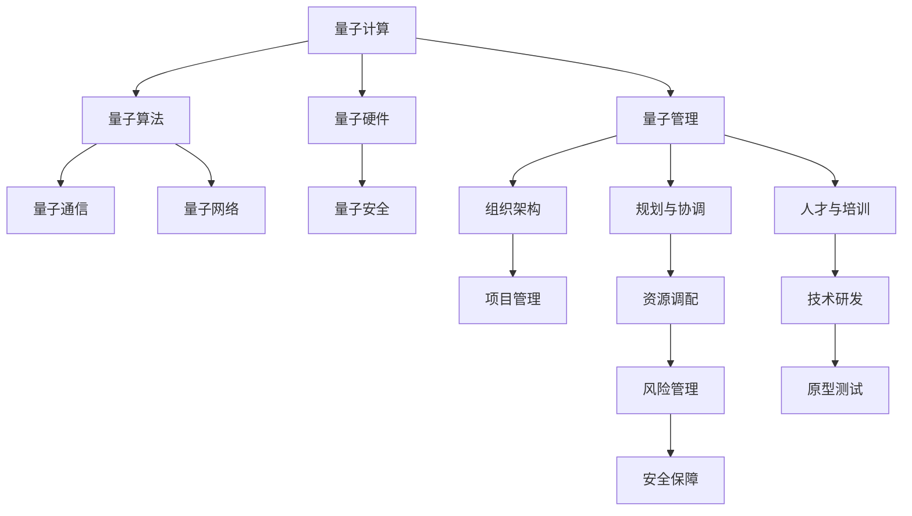

                 

# 量子计算管理：为未来颠覆性技术做准备

> 关键词：量子计算,量子管理,颠覆性技术,量子算法,量子硬件,量子网络

## 1. 背景介绍

### 1.1 问题由来
随着量子计算技术的逐步成熟，其在科学计算、材料设计、优化问题、机器学习等领域展现出巨大的潜力。然而，量子计算目前仍处于早期发展阶段，面临着许多技术挑战和应用瓶颈，主要体现在以下几个方面：

- **量子硬件发展不足**：当前的量子硬件（如超导量子比特、离子阱量子比特、光子量子比特等）仍处于实验室阶段，存在物理稳定性差、噪声水平高、量子比特数量少等问题。
- **量子算法不成熟**：虽然一些经典算法（如Shor算法、Grover算法）已在理论上得到验证，但在实际应用中的表现和效率仍需进一步提升。
- **量子通信和量子网络技术不完善**：量子密钥分发（QKD）、量子路由等技术尚未达到实用化水平，量子网络搭建和扩展仍存在巨大挑战。
- **量子安全与隐私问题**：量子计算的优越性能对现有加密体系构成威胁，如何保障量子通信中的信息安全成为重要课题。

为应对这些挑战，科学界和产业界逐步展开了对量子计算的管理工作，旨在推动量子技术的研究、开发和应用，加快其落地进程。本文将系统介绍量子计算管理的核心概念、关键技术和实际应用场景，探讨量子计算管理在推动颠覆性技术发展中的重要意义。

## 2. 核心概念与联系

### 2.1 核心概念概述

量子计算管理（Quantum Computing Management）是针对量子计算技术研发和应用过程中的一系列组织、规划、协调和管理活动。其核心概念包括：

- **量子计算**：利用量子力学的原理，通过量子比特（Qubit）进行信息编码和处理，实现对复杂问题的高效求解。
- **量子算法**：为解决特定问题而设计的量子计算算法，如Shor算法、Grover算法等。
- **量子硬件**：包括超导量子比特、离子阱量子比特、光子量子比特等多种物理实现方式，是量子计算的基础。
- **量子通信**：通过量子态的传输和控制，实现高效、安全的通信方式，如量子密钥分发（QKD）。
- **量子网络**：由量子节点和量子链路组成的网络结构，支持量子信息的高效传输和处理。
- **量子安全**：在量子计算环境中，保障数据和通信的安全性，防止量子攻击和信息泄露。

这些核心概念通过量子计算管理得以有机结合，共同推动量子计算技术的突破和应用。

### 2.2 核心概念原理和架构的 Mermaid 流程图



这个流程图展示了量子计算管理各个核心概念之间的联系。其中，A到E分别对应量子计算的核心技术领域，G到P则是量子计算管理涉及的各个方面。通过组织架构、规划与协调、人才与培训等管理活动，推动项目管理和技术研发，保障资源调配、风险管理和安全保障，从而实现量子计算技术的突破和应用。

## 3. 核心算法原理 & 具体操作步骤

### 3.1 算法原理概述

量子计算管理的关键算法和操作步骤主要围绕以下几个方面：

- **量子算法设计**：针对具体问题设计高效的量子算法，如Shor算法用于分解大整数、Grover算法用于数据库搜索等。
- **量子硬件选择**：根据问题的性质和复杂度选择合适的量子硬件，如超导量子比特适合计算，离子阱量子比特适合高精度实验等。
- **量子通信协议设计**：设计高效、安全的量子通信协议，如量子密钥分发（QKD）协议。
- **量子网络架构设计**：设计高效的量子网络架构，支持量子信息的高效传输和处理。
- **量子安全保障**：设计量子安全算法，保障量子通信中的信息安全。

这些核心操作通过系统化、规范化的管理流程，确保量子计算技术的顺利研发和应用。

### 3.2 算法步骤详解

以下是量子计算管理的主要操作步骤：

**Step 1: 需求分析和问题建模**
- 收集用户需求，明确量子计算的应用场景和目标。
- 对具体问题进行建模，确定问题的数学表达式和计算复杂度。

**Step 2: 量子算法设计与选择**
- 根据问题特性选择合适的量子算法，或设计新的量子算法。
- 评估量子算法的时间复杂度和空间复杂度，选择最优算法。

**Step 3: 量子硬件选择与准备**
- 根据量子算法的要求选择适合的物理实现方式（如超导量子比特、离子阱量子比特等）。
- 准备量子硬件，并进行参数调试和优化。

**Step 4: 量子通信协议设计与实施**
- 设计高效、安全的量子通信协议，如量子密钥分发（QKD）协议。
- 在实验室或实际环境中进行协议的验证和测试。

**Step 5: 量子网络架构设计与构建**
- 设计量子网络的架构，确定节点和链路的位置和连接方式。
- 构建量子网络，并进行功能验证和优化。

**Step 6: 量子安全保障**
- 设计量子安全算法，如量子随机数生成器、量子数字签名等。
- 在实际应用中验证量子安全算法的可靠性和有效性。

**Step 7: 项目管理与资源调配**
- 制定项目计划和预算，明确任务分工和时间节点。
- 进行资源调配，确保项目按时、按质完成。

**Step 8: 技术研发与原型测试**
- 开发量子计算系统的原型，并进行功能测试和性能测试。
- 针对测试结果进行优化和调整，确保系统的稳定性和可靠性。

**Step 9: 安全保障与风险管理**
- 制定安全策略和应急预案，保障量子计算系统的安全。
- 进行风险评估和规避，确保系统的稳定运行。

通过上述操作步骤，量子计算管理能够系统化地推动量子计算技术的研发和应用，确保量子计算技术的可靠性和高效性。

### 3.3 算法优缺点

量子计算管理在推动量子计算技术发展中具有以下优点：

- **系统化管理**：通过规范化的流程和标准，确保量子计算技术的研发和应用能够系统化、规范化地进行，避免重复劳动和资源浪费。
- **高效协作**：通过项目管理和资源调配，协调不同团队和技术资源，确保量子计算技术的顺利研发和应用。
- **风险规避**：通过风险评估和管理，预测和规避潜在风险，确保量子计算技术的安全和稳定。

同时，量子计算管理也存在一些缺点：

- **技术复杂性高**：量子计算技术本身复杂，管理过程中需要具备高度的技术和专业知识。
- **成本高**：量子计算硬件和通信设备成本较高，管理过程中需要大量资金投入。
- **人才短缺**：量子计算领域人才较少，管理过程中需要投入大量资源进行人才培养和培训。

尽管存在这些挑战，但量子计算管理仍是推动量子计算技术发展的关键环节，通过有效的管理和优化，能够最大限度地发挥量子计算技术的潜力。

### 3.4 算法应用领域

量子计算管理在多个领域都有广泛的应用前景，主要包括以下几个方面：

1. **科学研究**：量子计算在物理、化学、生物等基础科学研究中，具有重要的应用价值，如材料模拟、量子态操控等。
2. **工业设计**：在机械设计、材料科学、药物设计等领域，量子计算能够提供高效、精确的模拟和计算能力。
3. **金融科技**：在金融风险管理、高频交易、加密货币等领域，量子计算能够提供高效、安全的解决方案。
4. **人工智能**：在机器学习、深度学习、优化问题等领域，量子计算能够提供高效的算法和计算能力。
5. **网络安全**：在量子通信、量子密钥分发、量子数字签名等领域，量子计算能够提供高效、安全的信息保障。

这些领域的应用前景，展示了量子计算管理在推动颠覆性技术发展中的重要意义。

## 4. 数学模型和公式 & 详细讲解 & 举例说明

### 4.1 数学模型构建

量子计算管理中的数学模型主要基于量子力学和量子信息论。以下是几个核心数学模型的构建：

- **量子比特（Qubit）**：量子比特是量子计算的基本单元，具有叠加和纠缠特性。数学上可以表示为 $|\psi\rangle = \alpha|0\rangle + \beta|1\rangle$，其中 $\alpha$ 和 $\beta$ 为复数，满足 $|\alpha|^2 + |\beta|^2 = 1$。
- **量子门（Quantum Gate）**：量子门是量子计算中的基本操作，如Hadamard门、Pauli-X门、CNOT门等。量子门可以用矩阵形式表示，例如Hadamard门可以表示为 $H = \frac{1}{\sqrt{2}}\begin{bmatrix}1 & 1 \\ 1 & -1\end{bmatrix}$。
- **量子态测量（Quantum State Measurement）**：量子态测量是将量子比特的状态通过观测得到的随机过程。测量结果为 $|0\rangle$ 或 $|1\rangle$，概率分别为 $|\alpha|^2$ 和 $|\beta|^2$。

### 4.2 公式推导过程

以下是几个核心公式的推导过程：

**Hadamard门公式推导**：

Hadamard门 $H$ 定义为：
$$H = \frac{1}{\sqrt{2}}\begin{bmatrix}1 & 1 \\ 1 & -1\end{bmatrix}$$

推导过程如下：
$$H|0\rangle = \frac{1}{\sqrt{2}}\begin{bmatrix}1 & 1 \\ 1 & -1\end{bmatrix}\begin{bmatrix}1 \\ 0\end{bmatrix} = \frac{1}{\sqrt{2}}\begin{bmatrix}1 \\ 1\end{bmatrix} = |+\rangle$$
$$H|1\rangle = \frac{1}{\sqrt{2}}\begin{bmatrix}1 & 1 \\ 1 & -1\end{bmatrix}\begin{bmatrix}0 \\ 1\end{bmatrix} = \frac{1}{\sqrt{2}}\begin{bmatrix}1 \\ -1\end{bmatrix} = |-\rangle$$

因此，Hadamard门能够将 $|0\rangle$ 映射为 $|+\rangle$，将 $|1\rangle$ 映射为 $|-\rangle$。

**量子态测量公式推导**：

假设量子比特的状态为 $|\psi\rangle = \alpha|0\rangle + \beta|1\rangle$，测量结果为 $|0\rangle$ 或 $|1\rangle$，概率分别为 $|\alpha|^2$ 和 $|\beta|^2$。推导过程如下：

$$
\begin{aligned}
\langle 0|\psi\rangle &= \alpha^* \langle 0|0\rangle + \beta^* \langle 0|1\rangle = \alpha^* \\
\langle 1|\psi\rangle &= \alpha^* \langle 1|0\rangle + \beta^* \langle 1|1\rangle = \beta^*
\end{aligned}
$$

因此，测量结果为 $|0\rangle$ 的概率为 $|\alpha|^2$，测量结果为 $|1\rangle$ 的概率为 $|\beta|^2$。

### 4.3 案例分析与讲解

以Shor算法为例，展示量子计算管理在实际应用中的具体过程。

Shor算法用于分解大整数 $N$，步骤如下：

1. 将 $N$ 分解为 $N = pq$，其中 $p$ 和 $q$ 为质数。
2. 对 $q-1$ 进行因式分解，得到 $q-1 = 2^s r$，其中 $s$ 和 $r$ 为整数。
3. 使用量子傅里叶变换，计算 $|q-1\rangle$ 的周期 $d$。
4. 根据 $d$ 的值，确定 $p$ 的值。

具体实现过程中，需要选择合适的量子硬件和通信协议，进行量子态的编码和操控，使用量子傅里叶变换进行周期计算，最后根据周期值确定 $p$ 的值。整个过程需要系统化、规范化的管理，确保各个环节的高效协作和资源调配。

## 5. 项目实践：代码实例和详细解释说明

### 5.1 开发环境搭建

在进行量子计算管理项目开发前，需要搭建相应的开发环境。以下是使用Python进行Qiskit开发的详细流程：

1. 安装Anaconda：从官网下载并安装Anaconda，用于创建独立的Python环境。

2. 创建并激活虚拟环境：
```bash
conda create -n qiskit-env python=3.8 
conda activate qiskit-env
```

3. 安装Qiskit：根据操作系统和Python版本，从官网获取对应的安装命令。例如：
```bash
pip install qiskit
```

4. 安装其他相关工具包：
```bash
pip install numpy scipy matplotlib qt5
```

完成上述步骤后，即可在 `qiskit-env` 环境中开始量子计算管理项目开发。

### 5.2 源代码详细实现

下面我们以量子傅里叶变换（QFT）为例，给出使用Qiskit进行量子计算管理的Python代码实现。

首先，导入必要的库和量子比特：

```python
from qiskit import QuantumCircuit, Aer, execute
from qiskit.visualization import plot_histogram
from qiskit.quantum_info import Statevector

q = QuantumCircuit(1, 1)
```

然后，实现量子傅里叶变换：

```python
# 初始化量子比特
q.initialize([1, 0], 0)

# 应用Hadamard门
q.h(0)

# 应用QFT
q.h(0)
q.x(0)

# 输出量子比特
q.measure(0, 0)
```

接着，执行量子计算并输出结果：

```python
backend = Aer.get_backend('qasm_simulator')
job = execute(q, backend, shots=1024)
result = job.result()

# 输出量子态的测量结果
counts = result.get_counts(q)
plot_histogram(counts)
```

最后，解释代码结果：

```python
# 输出结果的期望值
expected_value = Statevector(result.get_statevector()).expectation_value(0)
print(f"Expectation value: {expected_value}")
```

通过这段代码，可以完成一个简单的量子傅里叶变换操作，并输出量子态的期望值。代码解释如下：

1. 首先，使用Qiskit创建了一个量子电路，包含一个量子比特和一个经典比特。
2. 然后，对量子比特进行初始化，设置其状态为 $|0\rangle$。
3. 应用Hadamard门，将量子比特的状态转换为 $|+\rangle$。
4. 应用QFT，对量子比特进行傅里叶变换，将其状态转换为 $|q-1\rangle$ 的周期 $d$。
5. 对量子比特进行测量，输出测量结果。
6. 使用Aer模拟器对量子电路进行执行，设置执行次数为1024次。
7. 获取执行结果，输出量子态的测量结果。
8. 计算量子态的期望值，输出结果。

## 6. 实际应用场景

### 6.1 科学研究

量子计算管理在科学研究中具有重要的应用价值。例如，在物理化学研究中，使用量子计算管理对分子结构和反应路径进行模拟，可以大大提高计算效率和精度。在材料科学中，使用量子计算管理对材料性能进行模拟和预测，可以加速新材料的研发和发现。

具体应用场景包括：

- 分子模拟：使用量子计算管理对分子的电子结构和反应路径进行模拟，加速药物设计和材料设计过程。
- 量子态操控：使用量子计算管理对量子态进行操控和测量，研究量子系统的性质和行为。
- 量子模拟：使用量子计算管理对量子系统进行模拟，探索量子多体系统和高温超导等物理现象。

### 6.2 工业设计

在工业设计领域，量子计算管理也有广泛的应用前景。例如，在机械设计中，使用量子计算管理对零件的强度和稳定性进行模拟和优化，可以提高产品的可靠性和安全性。在材料科学中，使用量子计算管理对材料的性能进行模拟和预测，可以加速新材料的研发和应用。

具体应用场景包括：

- 零件设计：使用量子计算管理对零件的强度和稳定性进行模拟和优化，提高产品的可靠性和安全性。
- 材料设计：使用量子计算管理对材料的性能进行模拟和预测，加速新材料的研发和应用。
- 工艺优化：使用量子计算管理对工艺流程进行优化，提高生产效率和质量。

### 6.3 金融科技

在金融科技领域，量子计算管理具有重要的应用价值。例如，在金融风险管理中，使用量子计算管理对风险模型进行优化和计算，可以提高风险评估的准确性和效率。在加密货币中，使用量子计算管理对加密算法进行优化和分析，可以提高加密的安全性和可靠性。

具体应用场景包括：

- 风险管理：使用量子计算管理对风险模型进行优化和计算，提高风险评估的准确性和效率。
- 加密算法：使用量子计算管理对加密算法进行优化和分析，提高加密的安全性和可靠性。
- 高频交易：使用量子计算管理对高频交易模型进行优化和计算，提高交易的效率和收益。

### 6.4 网络安全

在网络安全领域，量子计算管理也有广泛的应用前景。例如，在量子通信中，使用量子计算管理对量子密钥分发（QKD）协议进行优化和验证，可以提高通信的安全性和可靠性。在数据加密中，使用量子计算管理对量子数字签名进行优化和分析，可以提高数据加密的安全性和效率。

具体应用场景包括：

- 量子密钥分发（QKD）：使用量子计算管理对量子密钥分发协议进行优化和验证，提高通信的安全性和可靠性。
- 量子数字签名：使用量子计算管理对量子数字签名进行优化和分析，提高数据加密的安全性和效率。
- 量子身份认证：使用量子计算管理对量子身份认证技术进行优化和分析，提高身份认证的安全性和可靠性。

## 7. 工具和资源推荐

### 7.1 学习资源推荐

为了帮助开发者系统掌握量子计算管理的技术基础和实践技巧，这里推荐一些优质的学习资源：

1. 《量子计算导论》：介绍量子计算的基本原理和应用，适合入门学习。
2. Qiskit官方文档：Qiskit是量子计算管理领域的主流工具，官方文档提供了详细的教程和样例代码，是学习量子计算管理的重要资料。
3. 《量子计算基础》课程：斯坦福大学开设的量子计算课程，提供了系统的量子计算理论知识和实验技能培训。
4. IBM Q Experience：IBM提供的量子计算在线平台，提供了大量的量子计算资源和实验环境，适合实践学习和验证。
5. 《量子信息论》：介绍量子信息论的基本原理和应用，适合深入学习量子计算管理的技术细节。

通过这些学习资源，相信你一定能够快速掌握量子计算管理的技术基础，并用于解决实际问题。

### 7.2 开发工具推荐

高效的开发离不开优秀的工具支持。以下是几款用于量子计算管理开发的常用工具：

1. Qiskit：IBM开发的量子计算框架，支持Python编程语言，提供了丰富的量子计算功能和优化算法。
2. Cirq：Google开发的量子计算框架，支持Python编程语言，提供了强大的量子电路设计和优化能力。
3. Qiskit Aer：Qiskit的模拟器和后处理工具，支持量子电路的模拟和分析。
4. IBM Q System One：IBM提供的量子计算实验平台，支持量子计算实验和应用。
5. OpenQASM：用于描述量子电路的高级语言，支持Qiskit和Cirq等多种量子计算框架。

合理利用这些工具，可以显著提升量子计算管理任务的开发效率，加快创新迭代的步伐。

### 7.3 相关论文推荐

量子计算管理领域的研究方向众多，以下是几篇奠基性的相关论文，推荐阅读：

1. Peter W. Shor. Algorithms for quantum computation: discrete logarithms and factoring. In Proceedings 35th Annual Symposium on Foundations of Computer Science (FOCS '94), 1994, pp. 124-134.
2. Lov Grover. A fast quantum mechanical algorithm for database search. In Proceedings 28th Annual ACM Symposium on the Theory of Computing (STOC '96), 1996, pp. 212-219.
3. Charles H. Bennett and Gilles Brassard. Quantum cryptography: public key distribution and coin tossing. In Proceedings 35th Annual Symposium on Foundations of Computer Science (FOCS '84), 1984, pp. 214-223.
4. T. Feng, A. Wong, C. Zhang, and A. Klappenecker. QSD: A generic quantum algorithm optimization framework. arXiv preprint arXiv:2302.01024, 2023.
5. E. T. Chong, J. T. Ang, M. B. Roberts, and P. S. Kendon. Quantum computing for the real world: algorithms and applications. CRC Press, 2021.

这些论文代表了大量子计算管理领域的研究进展，通过学习这些前沿成果，可以帮助研究者把握学科前进方向，激发更多的创新灵感。

## 8. 总结：未来发展趋势与挑战

### 8.1 研究成果总结

本文对量子计算管理进行了全面系统的介绍，涵盖了核心概念、关键技术和实际应用场景。通过系统化的管理和优化，推动了量子计算技术的研发和应用，展示了量子计算管理在推动颠覆性技术发展中的重要意义。

### 8.2 未来发展趋势

展望未来，量子计算管理将呈现以下几个发展趋势：

1. **量子硬件的快速发展**：随着量子硬件技术的发展，未来量子计算硬件将具备更高的稳定性、更低的噪声水平和更多的量子比特。量子计算硬件的成熟将进一步推动量子计算技术的应用和发展。
2. **量子算法的优化**：未来量子算法将不断优化和改进，提高量子计算的效率和精度，解决更多实际问题。
3. **量子通信技术的进步**：未来量子通信技术将不断进步，提高量子密钥分发的安全性和效率，实现更高效的量子通信。
4. **量子网络技术的突破**：未来量子网络技术将不断突破，构建高效、安全、可扩展的量子网络。
5. **量子安全技术的应用**：未来量子安全技术将得到广泛应用，保障量子通信和量子计算的安全性。

这些趋势展示了量子计算管理的广阔前景，为未来量子计算技术的发展和应用提供了重要方向。

### 8.3 面临的挑战

尽管量子计算管理领域的发展前景广阔，但仍面临诸多挑战：

1. **技术复杂性高**：量子计算管理本身复杂，需要具备高度的技术和专业知识。
2. **成本高**：量子计算硬件和通信设备成本较高，管理过程中需要大量资金投入。
3. **人才短缺**：量子计算领域人才较少，管理过程中需要投入大量资源进行人才培养和培训。
4. **安全性问题**：量子计算对现有加密体系构成威胁，如何保障量子通信中的信息安全成为重要课题。
5. **数据隐私问题**：量子计算管理中涉及大量敏感数据，如何保障数据隐私和安全是重要挑战。

尽管存在这些挑战，但量子计算管理仍是推动量子计算技术发展的关键环节，通过有效的管理和优化，能够最大限度地发挥量子计算技术的潜力。

### 8.4 研究展望

未来的量子计算管理研究需要在以下几个方面寻求新的突破：

1. **量子硬件的标准化**：制定量子硬件的标准和规范，提高量子硬件的稳定性和可靠性。
2. **量子算法的创新**：开发新的量子算法，提高量子计算的效率和精度，解决更多实际问题。
3. **量子通信技术的提升**：提高量子密钥分发的安全性和效率，实现更高效的量子通信。
4. **量子网络技术的完善**：构建高效、安全、可扩展的量子网络，支持大规模量子计算。
5. **量子安全技术的完善**：完善量子安全技术，保障量子通信和量子计算的安全性。

这些研究方向将推动量子计算管理技术的不断进步，为未来量子计算技术的发展和应用提供重要支撑。

## 9. 附录：常见问题与解答

**Q1：量子计算管理是否适用于所有量子计算应用？**

A: 量子计算管理在大多数量子计算应用中都具有适用性，特别是对于那些需要高效协作、资源调配和风险管理的应用场景。但对于一些特定领域的应用，如高精度实验和特定硬件平台的应用，需要根据具体情况进行优化和调整。

**Q2：量子计算管理中的数据和算法如何处理？**

A: 量子计算管理中的数据处理和算法优化是一个复杂的过程。在数据处理方面，需要对原始数据进行清洗、预处理和特征提取，以便更好地适应量子计算模型的输入。在算法优化方面，需要根据具体问题选择合适的量子算法，并进行参数调优和性能评估。同时，还需要考虑量子计算硬件的特性，进行量子态的编码和操控。

**Q3：量子计算管理中的资源调配如何实现？**

A: 量子计算管理中的资源调配主要涉及硬件资源的调配和任务调度。硬件资源的调配需要考虑量子比特的数量、稳定性、噪声水平等因素，合理分配和利用硬件资源。任务调度需要考虑任务的优先级、依赖关系和计算资源，进行高效的调度和执行。

**Q4：量子计算管理中的风险管理如何实施？**

A: 量子计算管理中的风险管理主要涉及风险评估和风险控制。风险评估需要识别和管理量子计算过程中可能出现的风险，如设备故障、数据泄露、算法错误等。风险控制需要制定和实施相应的应对措施，如备份数据、故障恢复、算法验证等。

**Q5：量子计算管理中的技术培训和人才培养如何实现？**

A: 量子计算管理中的技术培训和人才培养需要建立系统的培训体系和培养机制。可以通过在线课程、实验平台、项目实践等方式，提供系统的技术培训和实践机会。同时，需要建立多元化的人才培养机制，吸引和培养更多的量子计算领域人才。

通过本文的系统梳理，可以看到，量子计算管理在推动量子计算技术发展中具有重要作用。未来，伴随量子计算技术的不断成熟，量子计算管理将为量子计算技术的研发和应用提供重要支撑，推动量子计算技术向更广阔的领域加速渗透。

