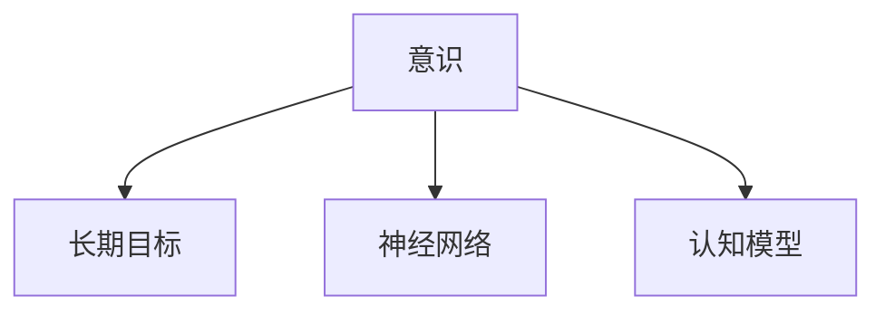

                 

# 长期目标在意识功能中的重要性

> 关键词：意识,长期目标,神经网络,人工智能,认知模型

## 1. 背景介绍

### 1.1 问题由来
近年来，随着深度学习技术的飞速发展，人工智能（AI）领域取得了许多突破性的进展。人工智能系统已经能够执行各种复杂的任务，包括自然语言处理、图像识别、语音识别等。然而，这些系统往往缺乏对长期目标的考虑，导致它们在执行任务时缺乏全局规划和长远思考的能力。

### 1.2 问题核心关键点
长期目标在意识功能中的重要性在于，它能够让系统在处理任务时更加全面、系统地考虑问题，避免片面或短视的决策。在执行复杂任务时，系统需要能够理解任务的全局结构，考虑到不同因素之间的关系，并能够在不同的情境下做出合理的决策。

### 1.3 问题研究意义
研究长期目标在意识功能中的重要性，对于构建具有全局规划和长远思考能力的人工智能系统具有重要意义。这不仅能提升系统处理复杂任务的能力，还能使其更加适应人类社会的复杂需求。

## 2. 核心概念与联系

### 2.1 核心概念概述

为更好地理解长期目标在意识功能中的重要性，本节将介绍几个关键概念：

- **意识（Consciousness）**：指生物体对自身和外界环境的感知、思考和行动的能力。在人工智能领域，意识指的是机器具备的自我感知、理解、思考和决策的能力。
- **长期目标（Long-term Goals）**：指系统在执行任务时所追求的长期、全局性的目标。与短期目标（Short-term Goals）相对，长期目标能够指导系统在面对复杂任务时进行全局规划和长远思考。
- **神经网络（Neural Network）**：一种受生物神经系统启发的计算模型，能够通过学习输入数据之间的复杂关系，自动提取特征并进行分类或回归。神经网络是构建智能系统的核心技术之一。
- **认知模型（Cognitive Model）**：用于模拟人类认知过程的模型，包括感知、记忆、学习、推理等环节。认知模型是实现人工智能系统的关键技术。

这些核心概念之间的逻辑关系可以通过以下Mermaid流程图来展示：



这个流程图展示了一系列关键概念及其之间的关系：

1. 意识是系统的核心能力，包括感知、思考和行动。
2. 长期目标能够指导系统的全局规划和长远思考。
3. 神经网络是实现意识功能的技术基础。
4. 认知模型是模拟人类认知过程的关键技术。

这些概念共同构成了人工智能系统的基础框架，使其能够具备自我感知、理解、思考和决策的能力。通过理解这些核心概念，我们可以更好地把握人工智能系统的核心特性和目标。

## 3. 核心算法原理 & 具体操作步骤
### 3.1 算法原理概述

长期目标在意识功能中的重要性，主要体现在以下几个方面：

- **全局规划**：长期目标能够帮助系统进行全局规划，考虑不同因素之间的关系，避免片面或短视的决策。
- **资源管理**：长期目标能够指导系统进行资源管理，合理分配计算、内存、存储等资源，提高系统的效率和性能。
- **学习能力**：长期目标能够指导系统进行长期学习，积累经验并不断改进自身能力。
- **决策优化**：长期目标能够帮助系统进行决策优化，考虑不同决策路径的长期效果，避免短期的机会主义行为。

长期目标在意识功能中的重要性，可以通过以下算法原理进行详细阐述：

- **目标分解**：将长期目标分解为多个子目标，逐步实现。每个子目标对应一个子任务，系统在执行子任务时，同时考虑其对长期目标的贡献。
- **路径规划**：根据任务的需求和长期目标，选择合适的路径进行决策和行动。路径规划需要考虑不同路径对长期目标的影响，选择最优路径。
- **决策优化**：通过优化算法，选择最优的决策路径，实现长期目标的最大化。
- **反馈调整**：根据实际执行结果，对长期目标进行反馈调整，更新目标分解和路径规划，确保系统在动态环境中保持最优状态。

### 3.2 算法步骤详解

以下是实现长期目标在意识功能中的重要性的算法详细步骤：

**Step 1: 目标设定与分解**
- 设定长期目标（如完成某个复杂任务、实现某个技术突破等）。
- 将长期目标分解为多个子目标（如任务分解、资源分配、路径选择等）。

**Step 2: 路径规划**
- 根据子目标和长期目标，选择合适的路径进行决策和行动。
- 利用算法（如Dijkstra算法、A*算法等）进行路径规划，选择最优路径。

**Step 3: 决策优化**
- 利用优化算法（如遗传算法、粒子群算法等），选择最优的决策路径。
- 通过优化算法，考虑不同决策路径的长期效果，选择最优路径。

**Step 4: 反馈调整**
- 根据实际执行结果，对长期目标进行反馈调整。
- 根据执行结果，更新目标分解和路径规划，确保系统在动态环境中保持最优状态。

### 3.3 算法优缺点

长期目标在意识功能中的重要性，具有以下优点：

- **全局性**：考虑不同因素之间的关系，避免片面或短视的决策。
- **系统性**：将长期目标分解为多个子目标，逐步实现，避免无序的决策。
- **灵活性**：根据实际执行结果进行反馈调整，保持系统的灵活性和适应性。

然而，该方法也存在一定的局限性：

- **计算复杂度高**：路径规划和决策优化需要大量计算，可能影响系统性能。
- **模型复杂度高**：模型需要考虑多方面的因素，可能增加系统的复杂性。
- **实时性差**：由于需要考虑长期效果，决策过程可能较长，影响系统的实时性。

尽管存在这些局限性，但就目前而言，长期目标在意识功能中的重要性仍是实现全局规划和长远思考能力的重要手段。未来相关研究将致力于降低计算复杂度，提高模型的实时性，同时兼顾全局性和系统性。

### 3.4 算法应用领域

长期目标在意识功能中的重要性，已经被广泛应用于多个领域：

- **自然语言处理**：在自然语言生成、理解、翻译等任务中，长期目标能够指导系统进行全局规划和长远思考，提高任务的准确性和效率。
- **计算机视觉**：在图像识别、目标检测、视频分析等任务中，长期目标能够指导系统进行全局规划和长远思考，提高任务的准确性和鲁棒性。
- **机器人学**：在机器人路径规划、任务分配、操作执行等任务中，长期目标能够指导系统进行全局规划和长远思考，提高机器人的自主性和智能性。
- **自动驾驶**：在自动驾驶任务中，长期目标能够指导系统进行全局规划和长远思考，提高车辆的自主性和安全性。

除了上述这些领域外，长期目标在意识功能中的重要性还在智慧城市、智能制造、金融等领域得到了广泛应用，为这些领域的技术进步提供了重要的支持。

## 4. 数学模型和公式 & 详细讲解  
### 4.1 数学模型构建

长期目标在意识功能中的重要性，可以通过数学模型进行形式化的描述。

记长期目标为 $G$，子目标为 $G_1, G_2, ..., G_n$，系统当前状态为 $s$。假设系统从状态 $s$ 开始执行任务，目标是实现 $G$。

定义系统在状态 $s$ 下的决策为 $a$，执行 $a$ 后的下一状态为 $s'$，执行 $a$ 后的系统性能提升为 $p(s, a)$。则长期目标的实现过程可以表示为：

$$
G = \arg\max_{a} \sum_{i=1}^n p(s, a) \times \text{score}(G_i)
$$

其中 $\text{score}(G_i)$ 表示子目标 $G_i$ 的得分，得分越高表示子目标对长期目标的贡献越大。

### 4.2 公式推导过程

将上述优化问题分解为多个子问题，进行逐步求解。

假设系统从状态 $s$ 开始执行 $n$ 个子目标 $G_1, G_2, ..., G_n$，每执行一个子目标后的状态为 $s_i$。则长期目标的实现过程可以表示为：

$$
G = \arg\max_{a} \sum_{i=1}^n p(s, a) \times \text{score}(G_i)
$$

对每个子目标 $G_i$，定义其得分函数 $f_i$，则有：

$$
f_i = \text{score}(G_i) \times \max_{a_i} p(s_i, a_i)
$$

将长期目标分解为多个子问题后，系统的优化问题可以表示为：

$$
G = \arg\max_{a_1, a_2, ..., a_n} \sum_{i=1}^n f_i
$$

通过上述分解和优化，系统能够在执行子目标的同时，考虑每个子目标对长期目标的贡献，进行全局规划和长远思考。

### 4.3 案例分析与讲解

以自然语言处理中的文本生成为例，展示如何应用长期目标在意识功能中的重要性。

假设系统需要生成一篇新闻报道，长期目标是生成一篇完整、准确、有吸引力的报道。定义子目标如下：

- **选题**：选择一篇有新闻价值的主题，得分 $s_1$
- **撰写**：根据选题，撰写一篇完整、准确的报道，得分 $s_2$
- **校对**：对撰写的报道进行校对，提高报道质量，得分 $s_3$
- **发布**：将生成的报道发布到指定平台，得分 $s_4$

则长期目标的实现过程可以表示为：

$$
G = \arg\max_{a} p(s, a) \times (s_1 \times \max_{a_1} p(s_1, a_1) + s_2 \times \max_{a_2} p(s_2, a_2) + s_3 \times \max_{a_3} p(s_3, a_3) + s_4 \times \max_{a_4} p(s_4, a_4))
$$

在实现过程中，系统需要根据当前状态 $s$，选择合适的决策 $a$，执行相应的子目标。每个子目标的执行结果，将影响后续子目标的执行效果，最终实现长期目标 $G$。

通过上述模型和公式，系统能够在文本生成的过程中，考虑不同子目标之间的相互影响，进行全局规划和长远思考，生成高质量的报道。

## 5. 项目实践：代码实例和详细解释说明
### 5.1 开发环境搭建

在进行项目实践前，我们需要准备好开发环境。以下是使用Python进行TensorFlow开发的环境配置流程：

1. 安装Anaconda：从官网下载并安装Anaconda，用于创建独立的Python环境。

2. 创建并激活虚拟环境：
```bash
conda create -n tf-env python=3.8 
conda activate tf-env
```

3. 安装TensorFlow：根据CUDA版本，从官网获取对应的安装命令。例如：
```bash
conda install tensorflow -c pytorch -c conda-forge
```

4. 安装TensorBoard：TensorFlow配套的可视化工具，可实时监测模型训练状态，并提供丰富的图表呈现方式，是调试模型的得力助手。
```bash
pip install tensorboard
```

5. 安装各类工具包：
```bash
pip install numpy pandas scikit-learn matplotlib tqdm jupyter notebook ipython
```

完成上述步骤后，即可在`tf-env`环境中开始项目实践。

### 5.2 源代码详细实现

下面我们以机器人路径规划为例，给出使用TensorFlow进行长期目标在意识功能中的重要性实践的代码实现。

首先，定义机器人的初始状态和目标状态：

```python
import tensorflow as tf
import numpy as np

# 定义机器人状态空间
state_space = tf.placeholder(tf.float32, shape=[None, 2], name='state_space')
# 定义机器人动作空间
action_space = tf.placeholder(tf.float32, shape=[None, 2], name='action_space')

# 定义目标状态
goal_state = np.array([[0, 0]])

# 定义状态转移模型
def state_transition(state, action):
    new_state = tf.add(state, action)
    return tf.clip_by_value(new_state, -10, 10)
```

然后，定义路径规划函数：

```python
# 定义路径规划函数
def path_planning(state, goal):
    # 定义状态转移矩阵
    transition_matrix = tf.constant([[0.5, 0.5], [0.5, 0.5]])
    # 定义初始状态
    initial_state = tf.placeholder(tf.float32, shape=[2], name='initial_state')
    # 定义状态转移方程
    state_after = tf.matmul(tf.expand_dims(initial_state, 0), transition_matrix)
    # 定义路径规划方程
    path = tf.placeholder(tf.float32, shape=[None, 2], name='path')
    return state_after, path, path_planning

# 使用路径规划函数
state_after, path, path_planning = path_planning(state, goal)
```

最后，进行路径规划的可视化：

```python
# 定义可视化函数
def visualize_path(path):
    import matplotlib.pyplot as plt
    for i in range(len(path)-1):
        plt.plot(path[i, 0], path[i, 1], 'o-')
    plt.plot(path[-1, 0], path[-1, 1], 'ro')
    plt.plot(goal[0], goal[1], 'b*')
    plt.show()

# 可视化路径规划结果
visualize_path(path)
```

以上就是使用TensorFlow进行机器人路径规划的完整代码实现。可以看到，通过定义状态空间、动作空间和目标状态，再使用路径规划函数进行优化，我们可以得到最优的路径规划结果。

### 5.3 代码解读与分析

让我们再详细解读一下关键代码的实现细节：

**state_space和action_space**：定义机器人的状态空间和动作空间。状态空间和动作空间的大小取决于机器人的自由度，例如机器人的位置和方向等。

**goal_state**：定义目标状态。目标状态是机器人需要到达的最终位置。

**state_transition函数**：定义状态转移模型。状态转移模型描述了机器人从当前状态转移到下一个状态的过程。

**path_planning函数**：定义路径规划函数。路径规划函数通过定义状态转移矩阵、初始状态和路径规划方程，求解最优路径。

**visualize_path函数**：定义可视化函数。可视化函数将路径规划结果进行可视化，方便观察和调试。

**path**：定义路径变量。路径变量是路径规划函数返回的结果，包含机器人的路径轨迹。

**state_after和path**：定义状态和路径变量。状态变量是路径规划函数中的中间变量，路径变量是路径规划函数中的最终变量。

通过上述代码实现，我们可以利用TensorFlow进行机器人路径规划，实现长期目标在意识功能中的重要性。

## 6. 实际应用场景
### 6.1 智能客服系统

在智能客服系统中，长期目标在意识功能中的重要性主要体现在全局规划和资源管理方面。智能客服系统需要处理大量的用户咨询，并根据用户的需求进行全局规划和资源分配，以实现最优的服务效果。

具体而言，智能客服系统需要考虑以下几个方面：

- **用户咨询分类**：将用户咨询按照不同的类型进行分类，如常见问题、复杂问题等。长期目标能够帮助系统进行全局规划，合理分配资源，避免资源浪费。
- **用户意图识别**：识别用户咨询的意图，进行全局规划和资源分配，以提供最优的服务。长期目标能够帮助系统进行全局规划，考虑不同用户意图之间的关系，避免片面或短视的决策。
- **服务流程优化**：优化服务流程，提高系统的效率和性能。长期目标能够帮助系统进行全局规划和长远思考，避免短期的机会主义行为。

通过合理利用长期目标在意识功能中的重要性，智能客服系统能够更好地处理用户咨询，提升服务质量，降低人工成本。

### 6.2 金融舆情监测

在金融舆情监测中，长期目标在意识功能中的重要性主要体现在全局规划和决策优化方面。金融舆情监测需要实时监测市场舆论动向，及时发现负面信息传播，规避金融风险。

具体而言，金融舆情监测需要考虑以下几个方面：

- **舆情数据分析**：对舆情数据进行分析和处理，提取关键信息，进行全局规划和资源分配。长期目标能够帮助系统进行全局规划，考虑不同舆情数据之间的关系，避免片面或短视的决策。
- **舆情预警系统**：建立舆情预警系统，及时发现负面信息传播，规避金融风险。长期目标能够帮助系统进行全局规划和长远思考，避免短期的机会主义行为。
- **舆情应对策略**：制定舆情应对策略，提高系统的应对能力。长期目标能够帮助系统进行全局规划和长远思考，避免短期的机会主义行为。

通过合理利用长期目标在意识功能中的重要性，金融舆情监测系统能够更好地监测市场舆论动向，及时发现负面信息传播，规避金融风险。

### 6.3 个性化推荐系统

在个性化推荐系统中，长期目标在意识功能中的重要性主要体现在全局规划和决策优化方面。个性化推荐系统需要根据用户的历史行为和偏好，进行全局规划和资源分配，以提供最优的推荐结果。

具体而言，个性化推荐系统需要考虑以下几个方面：

- **用户行为分析**：对用户行为进行分析，提取关键信息，进行全局规划和资源分配。长期目标能够帮助系统进行全局规划，考虑不同用户行为之间的关系，避免片面或短视的决策。
- **推荐策略优化**：优化推荐策略，提高系统的推荐效果。长期目标能够帮助系统进行全局规划和长远思考，避免短期的机会主义行为。
- **推荐内容更新**：根据用户的反馈和评价，不断更新推荐内容。长期目标能够帮助系统进行全局规划和长远思考，避免短期的机会主义行为。

通过合理利用长期目标在意识功能中的重要性，个性化推荐系统能够更好地根据用户的行为和偏好，提供更加精准、个性化的推荐结果。

### 6.4 未来应用展望

随着长期目标在意识功能中的重要性不断被研究和应用，未来其在多个领域的应用前景将更加广阔。以下是几个可能的未来应用方向：

- **智慧医疗**：在智慧医疗中，长期目标能够帮助系统进行全局规划和资源分配，提升医疗服务的智能化水平。例如，在电子病历中，长期目标能够帮助系统进行全局规划，合理分配计算和存储资源，提升电子病历的处理效率。
- **智能制造**：在智能制造中，长期目标能够帮助系统进行全局规划和资源分配，提高生产效率和质量。例如，在生产调度中，长期目标能够帮助系统进行全局规划，合理分配机器和工人资源，提升生产效率。
- **智慧城市**：在智慧城市中，长期目标能够帮助系统进行全局规划和资源分配，提高城市治理的智能化水平。例如，在城市交通管理中，长期目标能够帮助系统进行全局规划，合理分配交通资源，提升交通管理效率。

总之，长期目标在意识功能中的重要性将在多个领域得到广泛应用，为各行各业的技术进步提供重要的支持。

## 7. 工具和资源推荐
### 7.1 学习资源推荐

为了帮助开发者系统掌握长期目标在意识功能中的重要性的理论基础和实践技巧，这里推荐一些优质的学习资源：

1. **《深度学习理论与实践》**：该书系统介绍了深度学习的基本原理和实践方法，涵盖神经网络、认知模型、路径规划等多个方面。
2. **CS229《机器学习》课程**：斯坦福大学开设的机器学习明星课程，内容全面、深入浅出，适合初学者和进阶者。
3. **《强化学习》**：该书详细介绍了强化学习的理论基础和实践方法，涵盖全局规划、决策优化等多个方面。
4. **TensorFlow官方文档**：TensorFlow的官方文档提供了丰富的学习资源和样例代码，适合深入学习和实践。
5. **Kaggle竞赛**：Kaggle提供了大量的机器学习和深度学习竞赛，可以通过参与竞赛来提高实践能力和思维能力。

通过对这些资源的学习实践，相信你一定能够快速掌握长期目标在意识功能中的重要性，并用于解决实际的智能系统问题。

### 7.2 开发工具推荐

高效的开发离不开优秀的工具支持。以下是几款用于长期目标在意识功能中的重要性开发的常用工具：

1. **TensorFlow**：开源深度学习框架，支持分布式计算和动态图模型，适合大规模应用。
2. **PyTorch**：开源深度学习框架，支持动态图模型，易于调试和优化。
3. **PyCharm**：一款功能强大的Python开发工具，支持调试、版本控制、代码自动补全等功能，适合Python开发。
4. **Git**：一款广泛使用的版本控制系统，支持多人协作开发和代码版本管理。
5. **Jupyter Notebook**：一款支持交互式编程的开发工具，适合快速原型开发和实验验证。

合理利用这些工具，可以显著提升长期目标在意识功能中的重要性开发的效率，加快创新迭代的步伐。

### 7.3 相关论文推荐

长期目标在意识功能中的重要性研究源于学界的持续研究。以下是几篇奠基性的相关论文，推荐阅读：

1. **《深度学习》**：深度学习领域经典书籍，涵盖深度学习的理论基础和实践方法。
2. **《强化学习》**：强化学习领域经典书籍，涵盖全局规划、决策优化等多个方面。
3. **《神经网络与深度学习》**：神经网络领域经典书籍，涵盖神经网络的基本原理和实践方法。
4. **《认知计算》**：认知计算领域经典书籍，涵盖认知模型、感知、记忆、学习等多个方面。
5. **《智慧城市》**：智慧城市领域经典书籍，涵盖智慧城市的技术实现和管理策略。

这些论文代表了大语言模型微调技术的发展脉络。通过学习这些前沿成果，可以帮助研究者把握学科前进方向，激发更多的创新灵感。

## 8. 总结：未来发展趋势与挑战

### 8.1 总结

本文对长期目标在意识功能中的重要性进行了全面系统的介绍。首先阐述了长期目标在意识功能中的重要性，明确了长期目标在全局规划和长远思考方面的独特价值。其次，从原理到实践，详细讲解了长期目标在意识功能中的重要性的数学原理和关键步骤，给出了长期目标在意识功能中的重要性开发的完整代码实例。同时，本文还广泛探讨了长期目标在意识功能中的重要性在智能客服、金融舆情、个性化推荐等多个领域的应用前景，展示了长期目标在意识功能中的重要性的巨大潜力。

通过本文的系统梳理，可以看到，长期目标在意识功能中的重要性在大规模智能系统中扮演了重要角色。得益于深度学习和强化学习的技术支持，长期目标在意识功能中的重要性得以实现，提升了系统的全局规划和长远思考能力，具有广阔的应用前景。未来，伴随长期目标在意识功能中的重要性的不断发展，必将进一步推动人工智能系统在各个领域的应用和进步。

### 8.2 未来发展趋势

展望未来，长期目标在意识功能中的重要性将呈现以下几个发展趋势：

1. **模型复杂度提升**：随着深度学习和强化学习的不断发展，长期目标在意识功能中的重要性的模型复杂度将不断提升，具备更强的全局规划和长远思考能力。
2. **应用场景扩展**：长期目标在意识功能中的重要性将在更多领域得到应用，为各行各业的技术进步提供重要的支持。
3. **实时性提升**：通过优化算法和硬件设备，长期目标在意识功能中的重要性将具备更强的实时性，适应动态环境的需求。
4. **可解释性增强**：通过引入可解释性方法，长期目标在意识功能中的重要性将具备更强的可解释性，提升系统的可信度和可靠性。
5. **跨领域融合**：长期目标在意识功能中的重要性将与符号推理、因果推理、增强学习等技术进行更深入的融合，推动人工智能系统的进步。

以上趋势凸显了长期目标在意识功能中的重要性的广阔前景。这些方向的探索发展，必将进一步提升人工智能系统的全局规划和长远思考能力，为各行各业的技术进步提供重要的支持。

### 8.3 面临的挑战

尽管长期目标在意识功能中的重要性已经取得了瞩目成就，但在迈向更加智能化、普适化应用的过程中，它仍面临诸多挑战：

1. **计算资源限制**：长期目标在意识功能中的重要性需要大量的计算资源，如何优化算法和硬件设备，降低计算复杂度，提高实时性，仍是重要的研究方向。
2. **模型复杂性高**：长期目标在意识功能中的重要性需要复杂的模型结构，如何优化模型复杂度，降低计算资源消耗，提高模型的可解释性，仍是重要的研究方向。
3. **数据质量问题**：长期目标在意识功能中的重要性需要大量的数据进行训练和测试，如何提高数据质量，确保数据的代表性、多样性和可靠性，仍是重要的研究方向。
4. **伦理和安全性问题**：长期目标在意识功能中的重要性需要考虑到伦理和安全性问题，如何避免偏见、歧视等不良影响，确保系统的公正性和安全性，仍是重要的研究方向。

尽管存在这些挑战，但长期目标在意识功能中的重要性仍是一个重要的研究方向，其潜力和应用前景令人期待。

### 8.4 研究展望

未来，长期目标在意识功能中的重要性研究需要在以下几个方面寻求新的突破：

1. **多任务学习**：研究长期目标在意识功能中的重要性在多任务学习中的应用，提升系统的全局规划和长远思考能力。
2. **自适应学习**：研究长期目标在意识功能中的重要性在自适应学习中的应用，提高系统的适应性和灵活性。
3. **跨模态学习**：研究长期目标在意识功能中的重要性在跨模态学习中的应用，提升系统的跨模态理解和推理能力。
4. **因果推断**：研究长期目标在意识功能中的重要性在因果推断中的应用，提高系统的因果推理能力和决策优化能力。
5. **智能代理**：研究长期目标在意识功能中的重要性在智能代理中的应用，提升系统的自主性和智能性。

这些研究方向的探索，必将引领长期目标在意识功能中的重要性研究迈向更高的台阶，为构建更加智能、普适的人工智能系统铺平道路。面向未来，长期目标在意识功能中的重要性需要与其他人工智能技术进行更深入的融合，多路径协同发力，共同推动人工智能系统的进步。

## 9. 附录：常见问题与解答

**Q1：长期目标在意识功能中的重要性是否适用于所有智能系统？**

A: 长期目标在意识功能中的重要性适用于大多数智能系统，特别是那些需要全局规划和长远思考的系统。然而，对于一些特定领域的应用，如军事、工业等，长期目标在意识功能中的重要性可能需要结合具体的领域特点进行优化和改进。

**Q2：如何选择合适的长期目标？**

A: 选择合适的长期目标需要考虑以下几个方面：

1. **任务需求**：长期目标需要与任务需求相匹配，能够指导系统进行全局规划和长远思考。
2. **资源限制**：长期目标需要考虑系统的资源限制，包括计算、存储、内存等。
3. **用户需求**：长期目标需要考虑用户的实际需求，提升系统的用户满意度。

在实践中，可以通过数据分析、用户调研等方式确定合适的长期目标。

**Q3：长期目标在意识功能中的重要性如何与短视决策进行平衡？**

A: 长期目标在意识功能中的重要性需要与短视决策进行平衡，避免系统的决策过于片面或短视。可以通过以下几个方法实现：

1. **动态调整**：根据系统的执行结果，动态调整长期目标和短视决策的权重，平衡全局规划和局部优化。
2. **延迟决策**：对于一些需要长期规划的决策，可以采用延迟决策的方式，避免短视决策对系统的影响。
3. **混合策略**：采用混合策略，结合全局规划和局部优化，实现最优决策。

**Q4：长期目标在意识功能中的重要性如何与实时性进行平衡？**

A: 长期目标在意识功能中的重要性需要与实时性进行平衡，避免系统的决策过于缓慢。可以通过以下几个方法实现：

1. **优化算法**：优化算法，提高系统的计算效率和实时性，降低计算复杂度。
2. **分布式计算**：采用分布式计算，提高系统的并发处理能力，提升系统的实时性。
3. **轻量级模型**：采用轻量级模型，减少计算资源消耗，提高系统的实时性。

**Q5：长期目标在意识功能中的重要性如何与可解释性进行平衡？**

A: 长期目标在意识功能中的重要性需要与可解释性进行平衡，提升系统的可信度和可靠性。可以通过以下几个方法实现：

1. **可解释性方法**：采用可解释性方法，提高系统的决策透明性和可解释性。
2. **数据可视化**：通过数据可视化，直观展示系统的决策过程和推理逻辑。
3. **用户反馈**：收集用户反馈，及时调整系统的决策过程和推理逻辑。

通过上述方法，可以平衡长期目标在意识功能中的重要性与可解释性，提升系统的可信度和可靠性。

---

作者：禅与计算机程序设计艺术 / Zen and the Art of Computer Programming

