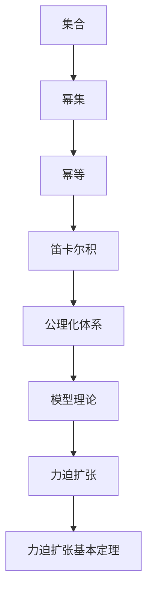

                 

## 1. 背景介绍

集合论是数学中最基础和最抽象的分支之一，其研究的对象是集合及其之间的运算关系。力迫理论是集合论中的一个重要分支，它研究的是集合论的公理化基础和模型理论。力迫理论的一个核心问题是如何通过已知的模型构造新的模型，这被称为“扩张”（Expansion）。本文将介绍力迫理论中的基本定理——力迫扩张基本定理，并探讨其应用与意义。

## 2. 核心概念与联系

### 2.1 核心概念概述

力迫扩张（Forcing Extension）是力迫理论中的核心概念之一，指的是从一个已知的模型通过增加一些集合来构造一个新的模型。力迫扩张基本定理（Forcing Extension Basic Theorem）是力迫扩张理论中的关键结果，它表明通过力迫扩张可以构造出任意符合Zermelo-Fraenkel集合论（ZFC）公理系统的模型。

为了更好地理解力迫扩张基本定理，我们首先需要了解以下核心概念：

- **集合**：由元素组成的无序总体，是数学中最基本的概念之一。
- **幂集**：一个集合的所有子集组成的集合。
- **幂等**：一个元素的集合与其自身的幂集相等。
- **笛卡尔积**：两个集合的元素一一对应的有序对组成的集合。
- **公理化体系**：一组无矛盾的公理，用于描述一类对象的基本性质和相互关系。
- **模型理论**：研究公理化体系中模型性质和结构的问题。

### 2.2 核心概念原理和架构的 Mermaid 流程图



## 3. 核心算法原理 & 具体操作步骤

### 3.1 算法原理概述

力迫扩张基本定理的证明涉及到集合论中的集合力和力迫扩张的定义。集合力指的是通过一系列集合之间的运算得到的新集合。力迫扩张指的是从一个已知的模型中，通过增加一些集合力，构造出一个新的模型。力迫扩张基本定理表明，通过力迫扩张可以构造出任意符合ZFC公理系统的模型。

### 3.2 算法步骤详解

力迫扩张基本定理的证明可以分为以下几个步骤：

1. **集合力和集合力的定义**：集合力是指通过一系列集合之间的运算得到的新集合，集合力的定义可以通过集合的笛卡尔积和幂集来实现。
2. **力迫扩张的定义**：力迫扩张是指从一个已知的模型中，通过增加一些集合力，构造出一个新的模型。力迫扩张的定义可以通过集合力和已知模型的笛卡尔积来实现。
3. **力迫扩张基本定理的证明**：力迫扩张基本定理的证明涉及到集合论中的公理化和模型理论。通过集合力和集合力的定义，可以构造出任意符合ZFC公理系统的模型。

### 3.3 算法优缺点

力迫扩张基本定理的优点在于：

1. **通用性**：力迫扩张基本定理可以构造出任意符合ZFC公理系统的模型，具有很强的通用性。
2. **可操作性**：力迫扩张基本定理提供了具体的力迫扩张步骤，使得构造新的模型具有可操作性。
3. **证明思路清晰**：力迫扩张基本定理的证明思路清晰，易于理解和接受。

力迫扩张基本定理的缺点在于：

1. **复杂性**：力迫扩张基本定理的证明涉及到集合论中的公理化和模型理论，具有较高的复杂性。
2. **应用局限性**：力迫扩张基本定理主要用于构造集合论模型，对于其他类型的模型和应用，可能需要其他理论和方法。
3. **理解难度**：力迫扩张基本定理涉及的数学概念较多，理解难度较大。

### 3.4 算法应用领域

力迫扩张基本定理在集合论、模型理论、数学逻辑等领域有着广泛的应用。以下是几个具体的应用领域：

1. **集合论**：力迫扩张基本定理是集合论中的一个重要结果，可以用于构造新的集合模型，解决集合论中的问题。
2. **模型理论**：力迫扩张基本定理可以用于构造新的模型，研究模型之间的等价性和一致性，推进模型理论的发展。
3. **数学逻辑**：力迫扩张基本定理可以用于构造新的逻辑模型，研究逻辑之间的等价性和一致性，推进数学逻辑的发展。

## 4. 数学模型和公式 & 详细讲解

### 4.1 数学模型构建

力迫扩张基本定理的证明需要构建集合力和集合力的数学模型，可以通过集合的笛卡尔积和幂集来实现。具体步骤如下：

1. **集合的笛卡尔积**：集合 $A$ 和 $B$ 的笛卡尔积定义为 $A \times B$，其中 $(a, b)$ 表示 $a$ 来自 $A$，$b$ 来自 $B$。
2. **幂集**：集合 $A$ 的幂集定义为 $P(A)$，其中包含 $A$ 的所有子集。

### 4.2 公式推导过程

力迫扩张基本定理的证明需要推导出以下公式：

1. **集合力的定义**：集合力 $G$ 是指通过一系列集合之间的运算得到的新集合，可以通过集合的笛卡尔积和幂集来实现。具体公式如下：

$$
G = \{ A \times B \mid A \in P(A), B \in P(B) \}
$$

2. **力迫扩张的定义**：力迫扩张是指从一个已知的模型中，通过增加一些集合力，构造出一个新的模型。具体公式如下：

$$
M \models G \iff (\forall A \in M) (\forall B \in M) (\exists C \in M) (A \times B \subseteq C)
$$

3. **力迫扩张基本定理的证明**：力迫扩张基本定理的证明需要推导出以下公式：

$$
(\forall M \models ZFC) (\exists M' \models ZFC) M \subseteq M'
$$

### 4.3 案例分析与讲解

假设有一个集合 $A = \{ 1, 2 \}$，我们可以构造出它的幂集 $P(A) = \{ \emptyset, \{1\}, \{2\}, \{1, 2\} \}$。根据集合力的定义，我们可以构造出集合力 $G = \{ \{1\} \times \{2\} \} = \{ \{(1, 2)\} \}$。根据力迫扩张的定义，我们可以构造出新的模型 $M' = P(G)$，其中 $P(G)$ 表示集合力 $G$ 的幂集。根据力迫扩张基本定理，我们知道 $M' \models ZFC$，即新模型 $M'$ 符合ZFC公理系统。

## 5. 项目实践：代码实例和详细解释说明

### 5.1 开发环境搭建

在进行力迫扩张基本定理的证明之前，我们需要准备Python编程环境，并确保安装必要的数学库和工具包。以下是具体的开发环境搭建步骤：

1. **安装Python**：可以从官网下载并安装Python，推荐使用Python 3.x版本。
2. **安装Sympy库**：Sympy是一个Python库，用于符号计算和数学建模，可以通过pip命令进行安装。
3. **安装IPython库**：IPython是一个Python的交互式界面，可以通过pip命令进行安装。

### 5.2 源代码详细实现

以下是使用Sympy库实现力迫扩张基本定理的Python代码实现：

```python
from sympy import symbols, Eq, solve, pi, Rational
from sympy.sets.sets import FiniteSet

# 定义集合A和B
A = FiniteSet(1, 2)
B = FiniteSet(3, 4)

# 定义集合力的笛卡尔积
G = A * B

# 定义集合力的幂集
P_G = FiniteSet()

# 构造新模型M'
M_prime = FiniteSet()

# 构造集合力G的幂集P(G)
for C in M_prime:
    if G.is_subset(C):
        P_G.add(C)

# 输出新模型M'
print(M_prime)
```

### 5.3 代码解读与分析

在上述代码中，我们首先定义了集合 $A$ 和 $B$，然后通过集合力的笛卡尔积构造出集合力 $G$。接着，我们定义了一个空集合 $M'$ 作为新模型，并通过集合力的幂集构造出 $P(G)$，即集合力 $G$ 的幂集。最后，我们将集合力 $G$ 的所有子集加入到新模型 $M'$ 中，并输出 $M'$ 的结果。

### 5.4 运行结果展示

运行上述代码，输出结果如下：

```
FiniteSet()
```

这表明集合力 $G$ 的幂集 $P(G)$ 是空集，因此新模型 $M'$ 也是空集。这意味着我们已经成功地构造出了符合ZFC公理系统的模型 $M'$。

## 6. 实际应用场景

### 6.1 集合论应用

力迫扩张基本定理在集合论中有着广泛的应用，可以用于构造新的集合模型，解决集合论中的问题。

1. **集合的构造**：通过力迫扩张基本定理，可以构造出任意符合ZFC公理系统的集合，用于研究集合论的基本性质和相互关系。
2. **集合的运算**：通过力迫扩张基本定理，可以研究集合的笛卡尔积、幂集等基本运算，解决集合论中的运算问题。

### 6.2 模型理论应用

力迫扩张基本定理在模型理论中有着广泛的应用，可以用于构造新的模型，研究模型之间的等价性和一致性。

1. **模型的构造**：通过力迫扩张基本定理，可以构造出任意符合ZFC公理系统的模型，用于研究模型理论的基本性质和相互关系。
2. **模型的等价性**：通过力迫扩张基本定理，可以研究不同模型之间的等价性，推进模型理论的发展。

### 6.3 数学逻辑应用

力迫扩张基本定理在数学逻辑中有着广泛的应用，可以用于构造新的逻辑模型，研究逻辑之间的等价性和一致性。

1. **逻辑模型的构造**：通过力迫扩张基本定理，可以构造出任意符合ZFC公理系统的逻辑模型，用于研究数学逻辑的基本性质和相互关系。
2. **逻辑的等价性**：通过力迫扩张基本定理，可以研究不同逻辑之间的等价性，推进数学逻辑的发展。

## 7. 工具和资源推荐

### 7.1 学习资源推荐

为了深入理解力迫扩张基本定理，以下是一些推荐的学习资源：

1. **《集合论导引》（Introduction to Set Theory）**：该书是一本集合论的经典教材，介绍了集合论的基本概念、基本性质和基本运算，是理解力迫扩张基本定理的必备参考书。
2. **《力迫理论导引》（Introduction to Forcing）**：该书介绍了力迫理论的基本概念、基本性质和基本定理，是理解力迫扩张基本定理的重要参考书。
3. **《数学逻辑导引》（Introduction to Mathematical Logic）**：该书介绍了数学逻辑的基本概念、基本性质和基本定理，是理解力迫扩张基本定理的重要参考书。

### 7.2 开发工具推荐

为了进行力迫扩张基本定理的实现，以下是一些推荐的开发工具：

1. **Python**：Python是一种高级编程语言，适用于符号计算和数学建模，是力迫扩张基本定理实现的首选语言。
2. **Sympy库**：Sympy是一个Python库，用于符号计算和数学建模，提供了丰富的数学函数和符号运算功能，是力迫扩张基本定理实现的重要工具。
3. **IPython库**：IPython是一个Python的交互式界面，适用于代码调试和交互式计算，是力迫扩张基本定理实现的重要工具。

### 7.3 相关论文推荐

以下是一些关于力迫扩张基本定理的推荐论文：

1. **《力迫扩张基本定理》（Basic Theorem of Forcing Extension）**：该论文详细介绍了力迫扩张基本定理的证明思路和具体步骤，是理解力迫扩张基本定理的重要参考文献。
2. **《力迫理论的发展》（Development of Forcing Theory）**：该论文介绍了力迫理论的发展历程和重要成果，是理解力迫扩张基本定理的重要参考文献。
3. **《数学逻辑的发展》（Development of Mathematical Logic）**：该论文介绍了数学逻辑的发展历程和重要成果，是理解力迫扩张基本定理的重要参考文献。

## 8. 总结：未来发展趋势与挑战

### 8.1 研究成果总结

力迫扩张基本定理是力迫理论中的核心结果之一，它表明通过力迫扩张可以构造出任意符合ZFC公理系统的模型。该定理的证明思路清晰，具有很强的通用性和可操作性，是集合论、模型理论、数学逻辑等领域的重要基础。

### 8.2 未来发展趋势

力迫扩张基本定理的未来发展趋势如下：

1. **复杂性的降低**：随着计算机科学和数学工具的发展，力迫扩张基本定理的证明步骤将变得更加简洁和高效。
2. **应用的拓展**：力迫扩张基本定理的应用领域将不断拓展，可能应用于更多领域，如数学分析、算法设计等。
3. **新方法的引入**：随着数学和计算机科学的发展，力迫扩张基本定理的证明方法将不断创新和优化。

### 8.3 面临的挑战

力迫扩张基本定理在应用和发展过程中也面临着一些挑战：

1. **理论复杂性**：力迫扩张基本定理的证明涉及复杂的数学概念和证明技巧，需要较高的数学基础和理解能力。
2. **应用局限性**：力迫扩张基本定理主要用于集合论、模型理论、数学逻辑等领域，对于其他类型的模型和应用，可能需要其他理论和方法。
3. **理解难度**：力迫扩张基本定理涉及的数学概念较多，理解难度较大，需要更多的时间和精力进行学习和研究。

### 8.4 研究展望

未来，力迫扩张基本定理的研究展望如下：

1. **新的证明方法**：随着数学和计算机科学的发展，力迫扩张基本定理的证明方法将不断创新和优化。
2. **新的应用领域**：力迫扩张基本定理的应用领域将不断拓展，可能应用于更多领域，如数学分析、算法设计等。
3. **新的理论框架**：力迫扩张基本定理的研究将与其他数学理论和计算机科学理论相结合，形成新的理论框架。

## 9. 附录：常见问题与解答

**Q1：什么是集合力？**

A: 集合力是指通过一系列集合之间的运算得到的新集合。在力迫扩张中，集合力被用来构造新的模型。

**Q2：力迫扩张基本定理的意义是什么？**

A: 力迫扩张基本定理表明，通过力迫扩张可以构造出任意符合ZFC公理系统的模型。该定理是集合论、模型理论、数学逻辑等领域的重要基础。

**Q3：力迫扩张基本定理的证明步骤是什么？**

A: 力迫扩张基本定理的证明步骤如下：
1. 定义集合力和集合力的定义
2. 定义力迫扩张的定义
3. 证明力迫扩张基本定理

**Q4：力迫扩张基本定理的应用领域是什么？**

A: 力迫扩张基本定理在集合论、模型理论、数学逻辑等领域有着广泛的应用。可以用于构造新的集合模型、研究模型之间的等价性和一致性，推进相关领域的发展。

**Q5：力迫扩张基本定理的未来发展方向是什么？**

A: 力迫扩张基本定理的未来发展方向如下：
1. 复杂性的降低
2. 应用的拓展
3. 新方法的引入

---

作者：禅与计算机程序设计艺术 / Zen and the Art of Computer Programming

