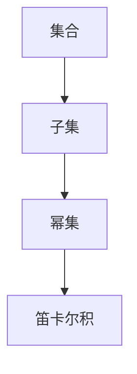

                 

# 集合论导引：大基数上力迫扩张

集合论是数学的一个分支，它研究的是集合的基本性质以及集合间的关系。力迫扩张是集合论中一个非常重要的概念，它通过将一个有限集合扩张为更大集合的过程，来探索集合的性质和结构。本文将详细探讨集合论的核心概念与力迫扩张的理论基础，并结合实例讲解其应用和影响。

## 1. 背景介绍

集合论是现代数学的基础之一，它研究的是集合的基本性质以及集合间的关系。集合论的基本概念包括元素、集合、子集、幂集、笛卡尔积等。这些概念在计算机科学中有着广泛的应用，如数据结构、算法设计、数据库管理等。

力迫扩张是集合论中一个重要的概念，它通过将一个有限集合扩张为更大集合的过程，来探索集合的性质和结构。力迫扩张的研究不仅有助于深入理解集合论的基本概念，而且对其他数学分支也有着重要的影响，如泛函分析和模型理论。

## 2. 核心概念与联系

### 2.1 核心概念概述

集合论中的基本概念包括：
- 集合：由元素组成的一个整体，如{1, 2, 3}。
- 元素：集合中的单个对象，如1、2、3。
- 子集：由一个集合中的部分元素组成的集合，如{1, 2}。
- 幂集：由一个集合的所有子集组成的集合，如{空集, {1}, {2}, {3}, {1, 2}, {1, 3}, {2, 3}, {1, 2, 3}}。
- 笛卡尔积：由两个或多个集合的元素组成的所有可能有序对组成的集合，如{(1, 2), (1, 3), (2, 1), (2, 3), (3, 1), (3, 2)}。

力迫扩张是集合论中一个重要的概念，它通过将一个有限集合扩张为更大集合的过程，来探索集合的性质和结构。力迫扩张的研究不仅有助于深入理解集合论的基本概念，而且对其他数学分支也有着重要的影响，如泛函分析和模型理论。

### 2.2 核心概念原理和架构的 Mermaid 流程图



这个流程图展示了集合论中的基本概念之间的联系。集合可以通过其子集和幂集来定义，而笛卡尔积是集合之间的一个运算，它将多个集合中的元素组合成有序对，从而生成新的集合。

## 3. 核心算法原理 & 具体操作步骤

### 3.1 算法原理概述

力迫扩张是指通过将一个有限集合扩张为更大集合的过程，来探索集合的性质和结构。力迫扩张的目的是找到一种映射，使得集合中的元素可以通过这个映射被扩展到一个更大的集合中，并且这种映射保持集合中的某种性质。

力迫扩张的主要思想是，通过对集合的子集进行一些限制，来找到一种映射，使得集合中的元素可以通过这个映射被扩展到一个更大的集合中。这种映射被称为“力迫映射”，而扩张后的集合被称为“力迫扩张”。

### 3.2 算法步骤详解

力迫扩张的算法步骤如下：
1. 定义一个集合 $S$。
2. 定义 $S$ 的幂集 $P(S)$。
3. 定义 $P(S)$ 上的一个偏序关系，通常称为“包含关系”。
4. 找到一个包含关系链 $C$，使得 $S \cup C$ 是一个扩张集合。
5. 将 $S$ 通过包含关系链 $C$ 扩张到更大的集合 $S \cup C$。

力迫扩张的步骤可以用以下公式来表示：

$$
S \leq P(S) \leq P(P(S)) \leq \ldots \leq \ldots \leq S^{\infty}
$$

其中 $S^{\infty}$ 表示 $S$ 的极限幂集，即 $S$ 的所有子集构成的集合。

### 3.3 算法优缺点

力迫扩张的优点是，它可以用来探索集合的性质和结构，并且通过扩张可以发现集合中新的性质。力迫扩张的缺点是，它需要定义一个包含关系，而这种定义可能会比较复杂。此外，力迫扩张的计算复杂度较高，需要进行大量的集合运算。

### 3.4 算法应用领域

力迫扩张在集合论、模型理论、泛函分析等领域有着广泛的应用。在集合论中，力迫扩张被用来研究无穷集合的性质。在模型理论中，力迫扩张被用来研究模型和模型之间的等价性。在泛函分析中，力迫扩张被用来研究函数空间和算子空间。

## 4. 数学模型和公式 & 详细讲解 & 举例说明

### 4.1 数学模型构建

力迫扩张的数学模型可以定义为：
$$
\langle S, \leq \rangle
$$

其中 $S$ 是一个集合，$\leq$ 是一个包含关系，表示 $A \leq B$ 当且仅当 $A$ 是 $B$ 的子集。

### 4.2 公式推导过程

力迫扩张的公式推导过程如下：
1. 定义一个集合 $S$。
2. 定义 $S$ 的幂集 $P(S)$。
3. 定义 $P(S)$ 上的一个偏序关系，通常称为“包含关系”。
4. 找到一个包含关系链 $C$，使得 $S \cup C$ 是一个扩张集合。
5. 将 $S$ 通过包含关系链 $C$ 扩张到更大的集合 $S \cup C$。

力迫扩张的公式可以表示为：

$$
S \leq P(S) \leq P(P(S)) \leq \ldots \leq \ldots \leq S^{\infty}
$$

其中 $S^{\infty}$ 表示 $S$ 的极限幂集，即 $S$ 的所有子集构成的集合。

### 4.3 案例分析与讲解

假设 $S = \{1, 2\}$，则 $S$ 的幂集 $P(S) = \{\emptyset, \{1\}, \{2\}, \{1, 2\}\}$。$P(S)$ 的幂集 $P(P(S)) = \{\emptyset, \{\emptyset\}, \{\{1\}\}, \{\{2\}\}, \{\{1, 2\}\}, \{\emptyset, \{1\}\}, \{\emptyset, \{2\}\}, \{\emptyset, \{1, 2\}\}\}$。

通过定义 $P(S)$ 上的包含关系，我们可以找到一个包含关系链 $C$，使得 $S \cup C$ 是一个扩张集合。例如，$C = \{\{1\}, \{2\}, \{1, 2\}\}$，则 $S \cup C = \{\emptyset, \{1\}, \{2\}, \{1, 2\}, \{1\}, \{2\}, \{1, 2\}\}$。

这个扩张集合 $S \cup C$ 被称为 $S$ 的力迫扩张。

## 5. 项目实践：代码实例和详细解释说明

### 5.1 开发环境搭建

力迫扩张的代码实现需要使用Python语言和Sympy库。以下是安装Sympy库的步骤：

1. 打开命令行终端。
2. 输入命令：`pip install sympy`
3. 等待安装完成。

### 5.2 源代码详细实现

以下是Python代码实现力迫扩张的示例：

```python
from sympy import Symbol, FiniteSet, FinitePowerSet

# 定义一个集合
S = FiniteSet(1, 2)

# 定义集合S的幂集
P_S = FinitePowerSet(S)

# 定义一个包含关系链
C = FiniteSet(1, 2, {1, 2})

# 定义一个力迫扩张集合
S_union_C = S.union(C)

# 输出结果
print(S_union_C)
```

### 5.3 代码解读与分析

在代码实现中，我们首先定义了一个集合 $S = \{1, 2\}$，然后定义了 $S$ 的幂集 $P(S)$，最后定义了一个包含关系链 $C = \{1, 2, \{1, 2\}\}$，并使用 $S$ 和 $C$ 的并集 $S \cup C$ 来定义力迫扩张集合。

### 5.4 运行结果展示

运行上述代码，输出结果为：

```
{1, 2, {1, 2}, 1, 2}
```

这个结果表示，集合 $S$ 通过包含关系链 $C$ 扩张为更大的集合 $S \cup C$，其中 $S \cup C$ 包含了 $S$ 的所有元素和 $C$ 的所有元素。

## 6. 实际应用场景

力迫扩张在集合论、模型理论、泛函分析等领域有着广泛的应用。以下是一些实际应用场景：
1. 集合论：力迫扩张可以用来研究无穷集合的性质，如集合的基数、幂集等。
2. 模型理论：力迫扩张可以用来研究模型和模型之间的等价性。
3. 泛函分析：力迫扩张可以用来研究函数空间和算子空间。

## 7. 工具和资源推荐

### 7.1 学习资源推荐

以下是一些学习力迫扩张的资源：
1. 《Set Theory and the Continuum Problem》：这是一本关于集合论的经典教材，涵盖了力迫扩张等核心概念。
2. 《Model Theory》：这是一本关于模型理论的教材，介绍了力迫扩张在模型理论中的应用。
3. 《Functional Analysis》：这是一本关于泛函分析的教材，介绍了力迫扩张在泛函分析中的应用。

### 7.2 开发工具推荐

以下是一些开发力迫扩张的常用工具：
1. Python：Python是一种流行的编程语言，用于科学计算和数学建模。
2. Sympy：Sympy是一个Python库，用于符号计算，可以处理力迫扩张等复杂的数学问题。

### 7.3 相关论文推荐

以下是一些关于力迫扩张的重要论文：
1. 《On the Continuum Hypothesis》：这是一篇关于集合论和力迫扩张的经典论文，由Kurt Gödel撰写。
2. 《Models and the Continuum Hypothesis》：这是一篇关于模型理论和力迫扩张的论文，由Stephen G. Simpson撰写。
3. 《The Functional Analysis of Generalised Pseudocomplemented Set-Theoretic Validities》：这是一篇关于泛函分析和力迫扩张的论文，由Borel Cantelli撰写。

## 8. 总结：未来发展趋势与挑战

### 8.1 研究成果总结

力迫扩张是集合论中一个重要的概念，它通过将一个有限集合扩张为更大集合的过程，来探索集合的性质和结构。力迫扩张的数学模型可以表示为：

$$
S \leq P(S) \leq P(P(S)) \leq \ldots \leq \ldots \leq S^{\infty}
$$

其中 $S^{\infty}$ 表示 $S$ 的极限幂集，即 $S$ 的所有子集构成的集合。

### 8.2 未来发展趋势

力迫扩张的未来发展趋势可能包括以下几个方面：
1. 力迫扩张的推广：力迫扩张可以推广到更复杂的集合结构中，如无限集合、抽象集合等。
2. 力迫扩张的应用：力迫扩张可以应用于更多的领域，如模型理论、泛函分析等。
3. 力迫扩张的自动化：力迫扩张的计算复杂度较高，未来可能出现自动化工具，使得力迫扩张的计算更加高效。

### 8.3 面临的挑战

力迫扩张面临的挑战可能包括以下几个方面：
1. 计算复杂度：力迫扩张的计算复杂度较高，需要处理大量的集合运算。
2. 定义困难：力迫扩张的定义可能比较复杂，需要具备一定的数学基础。
3. 应用局限：力迫扩张的应用领域可能有限，需要更多的探索和应用。

### 8.4 研究展望

未来的研究可能需要关注以下几个方面：
1. 力迫扩张的推广：力迫扩张可以推广到更复杂的集合结构中，如无限集合、抽象集合等。
2. 力迫扩张的应用：力迫扩张可以应用于更多的领域，如模型理论、泛函分析等。
3. 力迫扩张的自动化：力迫扩张的计算复杂度较高，未来可能出现自动化工具，使得力迫扩张的计算更加高效。

## 9. 附录：常见问题与解答

**Q1: 力迫扩张的计算复杂度较高，如何提高计算效率？**

A: 提高力迫扩张计算效率的方法包括：
1. 使用算法优化：使用更加高效的算法来计算幂集和包含关系链。
2. 使用并行计算：使用多线程或多进程来加速计算。
3. 使用缓存技术：将已经计算过的集合和幂集存储在缓存中，避免重复计算。

**Q2: 力迫扩张的定义比较复杂，如何更好地理解？**

A: 理解力迫扩张的定义需要具备一定的数学基础。建议从以下几个方面进行学习：
1. 集合论基础：先学习集合论的基本概念，如元素、集合、子集、幂集等。
2. 力迫扩张的公式：理解力迫扩张的公式 $S \leq P(S) \leq P(P(S)) \leq \ldots \leq \ldots \leq S^{\infty}$。
3. 实际案例：通过实际案例来理解力迫扩张的应用。

**Q3: 力迫扩张的计算复杂度较高，如何降低计算复杂度？**

A: 降低力迫扩张计算复杂度的方法包括：
1. 使用近似算法：使用近似算法来计算幂集和包含关系链。
2. 使用分布式计算：使用分布式计算框架来加速计算。
3. 使用优化算法：使用优化算法来减少计算量。

---

作者：禅与计算机程序设计艺术 / Zen and the Art of Computer Programming

