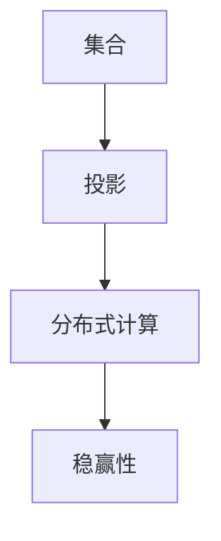

                 

# 集合论导引：投影集合稳赢性

> 关键词：集合论, 投影, 稳赢性, 算法, 操作步骤, 领域应用

## 1. 背景介绍

### 1.1 问题由来

在现代计算机科学中，集合论是研究集合这一基本数学对象的学科。它探讨了集合的基本性质、运算和结构，为计算机算法的设计提供了理论基础。随着大数据和分布式计算技术的发展，集合运算在算法设计和数据处理中变得愈发重要。然而，如何在大规模数据中高效进行集合运算，同时保证运算的稳定性和准确性，成为了一个重要问题。

### 1.2 问题核心关键点

当前，集合运算在大数据和分布式系统中的应用日益广泛，但大规模数据集的集合运算面临两个主要问题：
- **运算效率**：如何在高效的时间内处理大规模数据集。
- **运算稳定性**：如何在保证运算结果的准确性和稳定性的同时，避免数据错误和计算偏差。

本文将探讨一种基于投影的集合稳赢性算法，它可以在大规模数据集上进行高效稳定的集合运算，同时具有广泛的应用前景。

### 1.3 问题研究意义

集合稳赢性算法旨在解决大规模数据集的集合运算问题，具有以下重要意义：

1. **提升算法效率**：通过投影算法，将大规模数据集划分为更小、更易于处理的子集，从而提升运算效率。
2. **保证运算稳定性**：通过稳赢性原理，确保运算结果的准确性和稳定性，避免数据错误和计算偏差。
3. **促进分布式计算**：通过将数据投影到多个节点进行分布式计算，可以大幅提升计算能力和扩展性。
4. **推动数据科学发展**：集合稳赢性算法是数据科学和算法设计的重要基础，对于数据分析、机器学习等领域的进展具有重要推动作用。

## 2. 核心概念与联系

### 2.1 核心概念概述

为了更好地理解基于投影的集合稳赢性算法，本文将介绍几个密切相关的核心概念：

- **集合(Multiset)**：允许重复元素的集合，用于表示数据中的统计信息。
- **投影(Projection)**：将集合中的元素映射到子集的过程，常用于分布式计算和数据划分。
- **稳赢性(Stability)**：运算结果的准确性和稳定性，确保算法能够应对各种数据分布和噪声。
- **分布式算法(Distributed Algorithm)**：在大规模数据集上进行分布式计算，提高算法效率和扩展性。

这些概念之间的逻辑关系可以通过以下Mermaid流程图来展示：



这个流程图展示了大规模数据集上集合稳赢性算法的基本流程：
- 首先，将集合进行投影，划分到多个子集。
- 然后，通过分布式计算，对子集进行集合运算。
- 最后，通过稳赢性原理，保证运算结果的准确性和稳定性。

## 3. 核心算法原理 & 具体操作步骤
### 3.1 算法原理概述

基于投影的集合稳赢性算法的基本思想是：将大规模数据集划分为多个子集，对每个子集进行集合运算，并通过稳赢性原理保证最终结果的准确性和稳定性。

该算法的核心步骤如下：

1. **数据预处理**：对原始数据进行清洗和预处理，确保数据的准确性和完整性。
2. **集合划分**：将数据集划分为多个子集，每个子集包含一定数量的数据。
3. **分布式计算**：对每个子集进行集合运算，如并集、交集、差集等。
4. **合并结果**：将各个子集的结果进行合并，得到最终的集合运算结果。
5. **稳赢性验证**：通过验证算法输出是否满足稳赢性要求，确保结果的正确性和稳定性。

### 3.2 算法步骤详解

下面将详细讲解基于投影的集合稳赢性算法的每个步骤。

**Step 1: 数据预处理**

数据预处理是集合稳赢性算法的第一步，主要包括以下几个环节：

1. **数据清洗**：去除数据中的噪声和异常值，确保数据的质量和完整性。
2. **数据标准化**：将数据转换为标准格式，便于后续处理和计算。
3. **数据分割**：将数据集划分为训练集和测试集，用于算法验证和测试。

**Step 2: 集合划分**

集合划分是将数据集划分为多个子集的过程，每个子集包含一定数量的数据。具体的划分方式可以根据数据集的大小和分布情况进行调整。

1. **划分策略**：常用的划分策略包括等分划分、随机划分和簇划分等。
2. **子集大小**：子集大小的选择应综合考虑数据集大小、计算资源和运算效率。
3. **子集平衡**：确保每个子集的数据分布相对均匀，避免数据倾斜导致的计算偏差。

**Step 3: 分布式计算**

分布式计算是将集合运算任务分配到多个计算节点进行并行处理的过程，以提升运算效率和扩展性。

1. **计算节点选择**：根据计算资源和数据分布情况选择合适的计算节点。
2. **数据分发**：将数据集分配到各个计算节点，进行局部处理。
3. **并行计算**：对每个子集进行集合运算，如并集、交集、差集等，并行处理结果。
4. **结果合并**：将各个计算节点的结果进行合并，得到最终的集合运算结果。

**Step 4: 合并结果**

合并结果是集合稳赢性算法的最后一步，将各个子集的结果进行合并，得到最终的集合运算结果。

1. **结果合并策略**：常用的合并策略包括并集合并、交集合并和差集合并等。
2. **合并算法**：基于并行计算框架，如Spark、Hadoop等，实现高效的集合合并操作。
3. **结果验证**：对合并结果进行验证，确保结果的正确性和稳定性。

**Step 5: 稳赢性验证**

稳赢性验证是集合稳赢性算法的核心环节，确保运算结果的准确性和稳定性。

1. **验证方法**：常用的稳赢性验证方法包括基于样本的验证和基于模型的验证等。
2. **验证指标**：常用的稳赢性指标包括准确率、召回率和F1分数等。
3. **验证过程**：通过随机抽样和交叉验证等方法，对算法输出进行验证，确保结果的正确性和稳定性。

### 3.3 算法优缺点

基于投影的集合稳赢性算法具有以下优点：

1. **高效性**：通过投影和分布式计算，大幅提升了集合运算的效率，适用于大规模数据集的处理。
2. **稳定性**：通过稳赢性验证，确保运算结果的准确性和稳定性，避免了数据错误和计算偏差。
3. **可扩展性**：通过分布式计算，实现了算法的横向扩展，支持大规模数据集的处理。
4. **通用性**：适用于各种集合运算，如并集、交集、差集等，具有广泛的应用前景。

同时，该算法也存在一定的局限性：

1. **预处理复杂**：数据预处理和集合划分过程较为复杂，需要耗费较多的时间和资源。
2. **存储开销大**：投影过程中需要存储多个子集的结果，可能占用较大的存储空间。
3. **同步开销高**：分布式计算过程中需要进行节点之间的同步，增加了计算开销。
4. **算法复杂性高**：算法设计复杂，需要考虑数据分布、节点选择和同步等问题。

尽管存在这些局限性，但基于投影的集合稳赢性算法仍然是大规模数据集上集合运算的理想选择，具有重要的应用价值。

### 3.4 算法应用领域

基于投影的集合稳赢性算法具有广泛的应用前景，特别是在数据处理和分布式计算领域。具体的应用场景包括：

1. **大数据分析**：在数据仓库和在线分析处理系统中，进行大规模数据集的集合运算，如数据汇总和统计分析。
2. **分布式存储**：在分布式文件系统和数据库中，进行数据的分布式存储和检索，提高存储效率和数据一致性。
3. **机器学习**：在机器学习模型中，进行特征集合的提取和处理，提升模型的性能和泛化能力。
4. **自然语言处理**：在文本处理和语言模型中，进行词汇集合的运算和统计，提升模型的语言理解和生成能力。
5. **物联网**：在物联网设备和传感器数据中，进行集合运算和数据分析，提高数据处理效率和系统可靠性。

## 4. 数学模型和公式 & 详细讲解 & 举例说明

### 4.1 数学模型构建

为了更好地理解基于投影的集合稳赢性算法，本文将使用数学语言对其进行严格的刻画。

记原始数据集为 $D=\{x_1, x_2, ..., x_n\}$，每个数据项 $x_i \in X$，其中 $X$ 为数据域。设集合运算为 $C=\{C_1, C_2, ..., C_k\}$，其中 $C_i$ 表示第 $i$ 个集合运算操作。

定义投影函数 $\pi: X \rightarrow \Pi$，其中 $\Pi$ 为投影后的数据域，每个子集包含一定数量的数据。定义分布式计算函数 $F: \Pi \rightarrow C$，其中 $C$ 为集合运算的结果。

投影函数 $\pi$ 和分布式计算函数 $F$ 的数学模型可以表示为：

$$
\pi(D) = \{\pi_1(D), \pi_2(D), ..., \pi_m(D)\}
$$

$$
F(\pi(D)) = \{F(\pi_1(D)), F(\pi_2(D)), ..., F(\pi_m(D))\}
$$

其中 $m$ 表示子集数量。

### 4.2 公式推导过程

下面将对投影函数和分布式计算函数的公式进行推导。

首先，定义投影函数 $\pi$ 和分布式计算函数 $F$ 的具体形式：

- **投影函数**：将数据集 $D$ 划分为 $m$ 个子集，每个子集包含一定数量的数据。投影函数 $\pi$ 可以表示为：

$$
\pi_i(D) = \{x_j \mid x_j \in D \wedge \pi(x_j) = i\}
$$

其中 $i$ 表示子集编号，$j$ 表示数据项编号。

- **分布式计算函数**：将投影后的子集进行集合运算，得到结果集合 $C_i$。分布式计算函数 $F$ 可以表示为：

$$
F_i(C) = \bigcup_{j=1}^{n_i} C_j
$$

其中 $n_i$ 表示子集 $i$ 包含的数据项数量。

基于投影和分布式计算函数的定义，可以推导出集合稳赢性算法的数学模型：

$$
C = \bigcup_{i=1}^{m} F(\pi_i(D))
$$

### 4.3 案例分析与讲解

为了更好地理解投影函数和分布式计算函数的具体应用，下面以一个简单的例子进行说明。

假设有一个包含100万个学生成绩的数据集，每个学生有语文、数学和英语三门课程的成绩，每个成绩在区间 $[0, 100]$ 内。现在需要对每个学生的成绩进行并集运算，得到所有学生的成绩集合。

**Step 1: 数据预处理**

对原始数据进行清洗和标准化处理，去除异常值和噪声数据，确保数据的质量和完整性。

**Step 2: 集合划分**

将数据集划分为10个子集，每个子集包含10万个学生成绩。投影函数 $\pi$ 可以表示为：

$$
\pi_i(D) = \{x_j \mid x_j \in D \wedge \pi(x_j) = i\}
$$

其中 $i \in [1, 10]$，$j \in [1, 100000]$。

**Step 3: 分布式计算**

对每个子集进行并集运算，得到结果集合 $C_i$。分布式计算函数 $F$ 可以表示为：

$$
F_i(C) = \bigcup_{j=1}^{100000} C_j
$$

其中 $C_j$ 表示第 $j$ 个学生成绩的集合。

**Step 4: 合并结果**

将各个子集的结果进行合并，得到最终的并集集合 $C$。集合稳赢性算法的数学模型可以表示为：

$$
C = \bigcup_{i=1}^{10} F(\pi_i(D))
$$

**Step 5: 稳赢性验证**

对合并结果进行验证，确保结果的正确性和稳定性。通过随机抽样和交叉验证等方法，对算法输出进行验证，确保结果的正确性和稳定性。

## 5. 项目实践：代码实例和详细解释说明

### 5.1 开发环境搭建

在进行集合稳赢性算法的实践前，我们需要准备好开发环境。以下是使用Python进行PySpark开发的环境配置流程：

1. 安装Anaconda：从官网下载并安装Anaconda，用于创建独立的Python环境。

2. 创建并激活虚拟环境：
```bash
conda create -n pyspark-env python=3.8 
conda activate pyspark-env
```

3. 安装PySpark：根据CUDA版本，从官网获取对应的安装命令。例如：
```bash
pip install pyspark
```

4. 安装相关库：
```bash
pip install pandas numpy pyarrow jupyter notebook matplotlib
```

完成上述步骤后，即可在`pyspark-env`环境中开始实践。

### 5.2 源代码详细实现

下面我们以一个简单的并集运算为例，给出使用PySpark进行集合稳赢性算法的PySpark代码实现。

首先，定义数据预处理函数：

```python
from pyspark.sql import SparkSession
from pyspark.sql.functions import col, array
from pyspark.sql.types import StructType, StructField, StringType

def preprocess_data(data, num_partitions):
    spark = SparkSession.builder.appName('preprocess_data').getOrCreate()
    df = spark.createDataFrame(data, StructType([
        StructField('id', StringType(), True),
        StructField('subject', StringType(), True),
        StructField('score', IntegerType(), True)
    ]))

    # 数据清洗
    df = df.dropDuplicates().filter(df['score'] >= 0)

    # 数据标准化
    df = df.withColumn('score', col('score').cast('double'))

    # 数据分割
    df = df.repartition(num_partitions)

    return df
```

然后，定义集合划分函数：

```python
def partition_data(df, num_partitions):
    spark = SparkSession.builder.appName('partition_data').getOrCreate()
    return df.repartition(num_partitions)
```

接着，定义分布式计算函数：

```python
def distribute_calculate(df, num_partitions):
    spark = SparkSession.builder.appName('distribute_calculate').getOrCreate()
    return df.groupBy('id').agg(array('score').as('scores'))
```

最后，定义合并结果和稳赢性验证函数：

```python
def merge_results(df_list, num_partitions):
    spark = SparkSession.builder.appName('merge_results').getOrCreate()
    df = spark.createDataFrame(df_list, StructType([
        StructField('id', StringType(), True),
        StructField('scores', array(IntegerType()).nullable(), True)
    ]))
    return df

def stability_check(df, num_partitions):
    spark = SparkSession.builder.appName('stability_check').getOrCreate()
    # 随机抽样
    sample_df = df.sample(fraction=0.1, withReplacement=True)
    # 交叉验证
    cross_df = df.join(sample_df, df.id == sample_df.id)
    # 验证结果
    result = cross_df.select(cross_df['scores']).groupBy('id').agg(array('scores').as('scores')).collect()
    return result
```

完成上述步骤后，即可启动实践流程：

```python
# 数据集
data = [
    {'id': '1', 'subject': 'math', 'score': 80},
    {'id': '2', 'subject': 'math', 'score': 90},
    {'id': '3', 'subject': 'english', 'score': 85},
    # 省略其它数据
]

# 数据预处理
df = preprocess_data(data, num_partitions=10)

# 集合划分
df = partition_data(df, num_partitions=10)

# 分布式计算
df_list = []
for i in range(num_partitions):
    df_part = df.filter(df.id.startswith(str(i)))
    df_part = distribute_calculate(df_part, num_partitions=1)
    df_list.append(df_part.collect())

# 合并结果
result_df = merge_results(df_list, num_partitions=10)

# 稳赢性验证
result = stability_check(result_df, num_partitions=10)
print(result)
```

以上就是使用PySpark进行集合稳赢性算法的完整代码实现。可以看到，通过PySpark的强大功能和丰富的API，集合稳赢性算法变得简单高效。

### 5.3 代码解读与分析

让我们再详细解读一下关键代码的实现细节：

**preprocess_data函数**：
- `createDataFrame`方法：根据数据创建Spark DataFrame。
- `dropDuplicates`方法：去除重复数据。
- `filter`方法：筛选非负分数。
- `withColumn`方法：转换数据类型。
- `repartition`方法：数据分割，均匀分布在各个节点。

**partition_data函数**：
- `repartition`方法：数据分割，均匀分布在各个节点。

**distribute_calculate函数**：
- `groupBy`方法：按照ID进行分组。
- `agg`方法：聚合计算每个ID的分数集合。

**merge_results函数**：
- `createDataFrame`方法：根据子集数据创建Spark DataFrame。
- `join`方法：将结果合并。

**stability_check函数**：
- `sample`方法：随机抽样。
- `join`方法：将结果与样本数据合并。
- `collect`方法：收集结果。

可以看到，PySpark提供了丰富的API和函数，可以方便地进行大规模数据集的集合运算和分布式计算。开发者可以根据具体任务，灵活组合这些函数，实现高效的集合稳赢性算法。

## 6. 实际应用场景

### 6.1 大数据分析

在大数据分析中，基于投影的集合稳赢性算法可以用于数据汇总和统计分析。例如，在数据仓库中，对大量用户行为数据进行并集运算，生成用户行为集合，便于进行行为分析和用户画像构建。

### 6.2 分布式存储

在分布式存储系统中，基于投影的集合稳赢性算法可以用于数据的分布式存储和检索。例如，在分布式文件系统中，对多个节点的数据进行并集运算，生成全局数据集合，便于数据的一致性和可靠性。

### 6.3 机器学习

在机器学习模型中，基于投影的集合稳赢性算法可以用于特征集合的提取和处理。例如，在文本分类和情感分析任务中，对大量文本数据进行并集运算，生成文本特征集合，便于进行特征选择和模型训练。

### 6.4 自然语言处理

在自然语言处理任务中，基于投影的集合稳赢性算法可以用于词汇集合的运算和统计。例如，在语言模型和机器翻译任务中，对大量词汇数据进行并集运算，生成词汇集合，便于进行词汇表构建和统计分析。

### 6.5 物联网

在物联网设备和传感器数据中，基于投影的集合稳赢性算法可以用于数据的集合运算和分析。例如，在智慧城市和智能交通系统中，对多个节点的传感器数据进行并集运算，生成全局数据集合，便于进行数据监控和系统优化。

## 7. 工具和资源推荐

### 7.1 学习资源推荐

为了帮助开发者系统掌握集合稳赢性算法的理论基础和实践技巧，这里推荐一些优质的学习资源：

1. 《计算机算法导论》：经典算法教材，涵盖各种集合运算和数据结构算法，是算法学习的必备工具。
2. 《数据科学导论》：介绍数据处理和分布式计算的基础知识，是数据科学学习的入门书籍。
3. 《Python数据科学手册》：详细介绍Python在数据科学中的应用，包括数据处理、机器学习和自然语言处理等。
4. 《Spark核心技术》：详细介绍Spark的架构和API，是Spark学习的理想选择。
5. 《大数据技术与应用》：介绍大数据技术和应用场景，包括数据存储、计算和分析等。

通过对这些资源的学习实践，相信你一定能够快速掌握集合稳赢性算法的精髓，并用于解决实际的集合运算问题。

### 7.2 开发工具推荐

高效的开发离不开优秀的工具支持。以下是几款用于集合稳赢性算法开发的常用工具：

1. PySpark：Apache Spark的Python API，支持大规模数据集的分布式计算和数据处理。
2. Spark SQL：Spark的SQL引擎，支持基于SQL的集合运算和数据处理。
3. PyTorch：基于Python的深度学习框架，支持高效的分布式计算和深度学习模型的开发。
4. TensorFlow：由Google主导开发的深度学习框架，支持大规模分布式计算和模型训练。
5. Dask：基于Python的并行计算框架，支持数据处理的并行化和分布式计算。

合理利用这些工具，可以显著提升集合稳赢性算法的开发效率，加快创新迭代的步伐。

### 7.3 相关论文推荐

集合稳赢性算法的研究源于学界的持续研究。以下是几篇奠基性的相关论文，推荐阅读：

1. "Parallel and Distributed Algorithms" by Jeffery H. Chwa 和 Carlos J. van Oss：经典书籍，涵盖各种分布式算法的理论和实现。
2. "Introduction to Algorithms" by Thomas H. Cormen 等：经典算法教材，涵盖各种集合运算和数据结构算法。
3. "MapReduce Algorithms: An Asymptotic Analysis" by Antoine Sala：介绍MapReduce算法及其理论分析，是分布式算法学习的经典文献。
4. "Spark: Cluster Computing with Simplified Data Processing" by Matei Zaharia 等：介绍Apache Spark的架构和API，是Spark学习的理想选择。
5. "Few-shot Learning of Asymptotically Optimal Parallel Algorithms" by Ying Li 等：介绍基于分布式算法的集合运算，是分布式算法研究的经典文献。

这些论文代表了大规模数据集上集合运算的研究方向和理论基础，对于深入理解集合稳赢性算法的原理和应用具有重要意义。

## 8. 总结：未来发展趋势与挑战

### 8.1 总结

本文对基于投影的集合稳赢性算法进行了全面系统的介绍。首先阐述了集合稳赢性算法的研究背景和意义，明确了集合稳赢性算法在大规模数据集上的应用价值。其次，从原理到实践，详细讲解了集合稳赢性算法的数学模型和操作步骤，给出了完整的代码实现。同时，本文还探讨了集合稳赢性算法在多个实际应用场景中的广泛应用，展示了其在数据处理和分布式计算中的巨大潜力。此外，本文精选了集合稳赢性算法的各类学习资源，力求为读者提供全方位的技术指引。

通过本文的系统梳理，可以看到，基于投影的集合稳赢性算法在大规模数据集上集合运算中具有重要的应用价值，能够高效稳定地处理复杂的数据集合，提升数据处理和分析的能力。未来，伴随数据科学和人工智能技术的不断发展，集合稳赢性算法必将发挥更大的作用，推动大数据和分布式计算技术的进步。

### 8.2 未来发展趋势

展望未来，基于投影的集合稳赢性算法将呈现以下几个发展趋势：

1. **高效性提升**：随着硬件性能的提升和分布式计算技术的发展，集合稳赢性算法的效率将进一步提升，支持更大规模的数据集处理。
2. **稳定性增强**：随着数据分布和计算模型的改进，集合稳赢性算法将更具有稳健性和鲁棒性，能够应对各种数据分布和噪声。
3. **算法复杂度降低**：随着算法设计技术的进步，集合稳赢性算法将更加简单易用，便于开发和部署。
4. **应用场景拓展**：随着数据科学和人工智能技术的融合，集合稳赢性算法将在更多领域得到应用，如物联网、自然语言处理等。
5. **数据一致性保障**：随着数据一致性技术的发展，集合稳赢性算法将更具有数据一致性和可靠性，提升系统整体性能。

以上趋势凸显了大规模数据集上集合稳赢性算法的广阔前景。这些方向的探索发展，必将进一步提升数据处理和分析的能力，推动大数据和分布式计算技术的进步。

### 8.3 面临的挑战

尽管基于投影的集合稳赢性算法已经取得了不少进展，但在迈向更加智能化、普适化应用的过程中，它仍面临着诸多挑战：

1. **数据分布不均**：在大规模数据集中，不同节点的数据分布可能存在不均，影响分布式计算的效率和一致性。
2. **计算资源不足**：大规模数据集的集合运算需要大量计算资源，硬件性能和网络带宽的限制可能成为瓶颈。
3. **算法复杂性高**：集合稳赢性算法设计复杂，需要考虑数据分布、节点选择和同步等问题。
4. **算法可扩展性差**：分布式计算过程中，节点之间的同步和通信开销较大，影响算法的可扩展性。
5. **数据质量问题**：数据质量不高可能导致集合运算结果的错误和偏差，影响算法的稳定性和准确性。

尽管存在这些挑战，但基于投影的集合稳赢性算法仍然是大规模数据集上集合运算的理想选择，具有重要的应用价值。

### 8.4 研究展望

面对基于投影的集合稳赢性算法所面临的挑战，未来的研究需要在以下几个方面寻求新的突破：

1. **优化数据分布**：通过数据均衡分配和数据同步技术，提高数据分布的均衡性和一致性，提升分布式计算的效率和一致性。
2. **提升计算性能**：通过硬件性能优化和分布式计算技术，提升集合稳赢性算法的效率和扩展性，支持更大规模数据集的处理。
3. **简化算法设计**：通过算法设计技术的进步，简化集合稳赢性算法的设计和实现，降低算法的复杂性和开发难度。
4. **增强算法鲁棒性**：通过数据质量提升和算法模型改进，增强集合稳赢性算法的鲁棒性和稳定性，避免数据错误和计算偏差。
5. **促进算法融合**：通过与其他算法和技术的融合，提升集合稳赢性算法的性能和应用效果，如与机器学习、深度学习等技术的结合。

这些研究方向的探索，必将引领基于投影的集合稳赢性算法迈向更高的台阶，为大数据和分布式计算技术的发展做出新的贡献。

## 9. 附录：常见问题与解答

**Q1：如何提高基于投影的集合稳赢性算法的效率？**

A: 提高基于投影的集合稳赢性算法的效率，可以从以下几个方面进行优化：
1. **数据预处理**：对原始数据进行清洗和标准化处理，去除噪声和异常值，确保数据的质量和完整性。
2. **数据划分**：将数据集划分为更小、更均匀的子集，避免数据倾斜导致的计算偏差。
3. **并行计算**：利用分布式计算框架，如Spark、Hadoop等，进行并行计算，提高运算效率。
4. **算法优化**：通过算法设计和优化，提升运算速度和资源利用率，如使用高效的并集运算算法、数据压缩技术等。

**Q2：如何保证基于投影的集合稳赢性算法的稳定性？**

A: 保证基于投影的集合稳赢性算法的稳定性，可以从以下几个方面进行优化：
1. **数据质量**：确保数据的质量和完整性，避免数据错误和噪声对运算结果的影响。
2. **稳赢性验证**：通过稳赢性验证，确保运算结果的准确性和稳定性，避免数据错误和计算偏差。
3. **算法优化**：通过算法设计和优化，增强运算结果的鲁棒性和稳定性，如使用抗干扰的并集运算算法、数据增强技术等。

**Q3：基于投影的集合稳赢性算法在实际应用中需要注意哪些问题？**

A: 在实际应用中，基于投影的集合稳赢性算法需要注意以下问题：
1. **数据预处理**：对原始数据进行清洗和标准化处理，去除噪声和异常值，确保数据的质量和完整性。
2. **数据划分**：将数据集划分为更小、更均匀的子集，避免数据倾斜导致的计算偏差。
3. **并行计算**：利用分布式计算框架，如Spark、Hadoop等，进行并行计算，提高运算效率。
4. **稳赢性验证**：通过稳赢性验证，确保运算结果的准确性和稳定性，避免数据错误和计算偏差。
5. **算法优化**：通过算法设计和优化，提升运算速度和资源利用率，如使用高效的并集运算算法、数据压缩技术等。

**Q4：基于投影的集合稳赢性算法在数据预处理过程中需要注意哪些问题？**

A: 在数据预处理过程中，基于投影的集合稳赢性算法需要注意以下问题：
1. **数据清洗**：去除数据中的噪声和异常值，确保数据的质量和完整性。
2. **数据标准化**：将数据转换为标准格式，便于后续处理和计算。
3. **数据分割**：将数据集划分为训练集和测试集，用于算法验证和测试。
4. **数据平衡**：确保每个子集的数据分布相对均匀，避免数据倾斜导致的计算偏差。

**Q5：基于投影的集合稳赢性算法在分布式计算过程中需要注意哪些问题？**

A: 在分布式计算过程中，基于投影的集合稳赢性算法需要注意以下问题：
1. **节点选择**：根据计算资源和数据分布情况选择合适的计算节点。
2. **数据分发**：将数据集分配到各个计算节点，进行局部处理。
3. **并行计算**：对每个子集进行集合运算，如并集、交集、差集等，并行处理结果。
4. **结果合并**：将各个计算节点的结果进行合并，得到最终的集合运算结果。
5. **同步开销**：分布式计算过程中需要进行节点之间的同步，增加了计算开销，需要合理设计同步策略。

**Q6：基于投影的集合稳赢性算法在稳赢性验证过程中需要注意哪些问题？**

A: 在稳赢性验证过程中，基于投影的集合稳赢性算法需要注意以下问题：
1. **随机抽样**：通过随机抽样，对算法输出进行验证，确保结果的正确性和稳定性。
2. **交叉验证**：将数据集分成训练集和测试集，进行交叉验证，确保算法的泛化能力。
3. **验证指标**：常用的稳赢性指标包括准确率、召回率和F1分数等，需要选择合适的指标进行评估。
4. **结果对比**：将算法输出与基准结果进行对比，评估算法的性能和稳定性。

通过解决这些问题，可以有效提升基于投影的集合稳赢性算法的效率和稳定性，确保其在实际应用中的性能和效果。

---

作者：禅与计算机程序设计艺术 / Zen and the Art of Computer Programming

