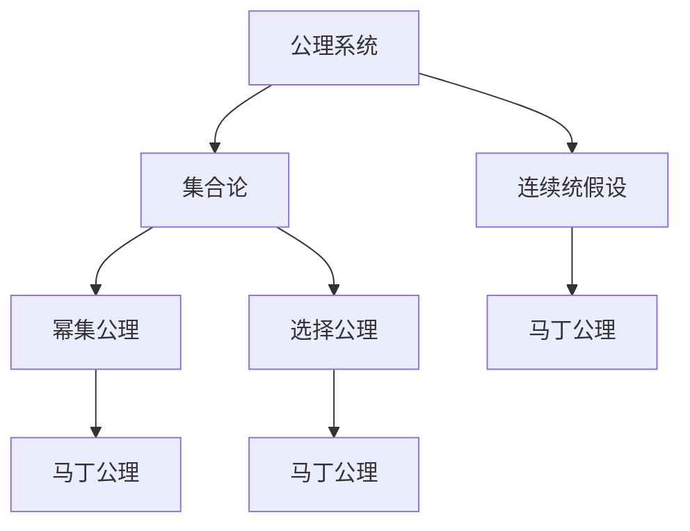

                 

# 集合论导引：马丁公理之合理性

> 关键词：集合论,公理系统, Martin's Axiom, 集合理论, 数学基础

## 1. 背景介绍

### 1.1 问题由来

数学理论的合理性探讨一直是学术界和哲学界长期关注的热点问题。随着现代数学的不断发展，以公理化方法为基础的集合论已成为数学体系的基石。然而，集合论中的一些经典公理（如幂集公理和选择公理）引发了著名的悖论（如罗素悖论和贝尔纳普-庞加莱悖论），对数学理论的合理性和基础性提出了严重质疑。

为了缓解这些悖论带来的危机，数学家马丁（Martin Axiom）提出了一系列新的公理，这些公理与经典集合论有所不同，旨在使数学理论更加稳定和无矛盾。本文旨在探讨马丁公理的理论基础和实际应用，分析其在数学体系中的合理性和有效性。

### 1.2 问题核心关键点

马丁公理是一组与经典集合论不同的公理系统，旨在解决幂集公理和选择公理带来的悖论。其核心在于：
1. 幂集公理的替代：幂集公理定义了任意集合的幂集，但在某些集合（如实数集）的幂集存在过度复杂性问题。
2. 选择公理的修正：选择公理保证了在一定条件下可以选择合适的元素，但可能导致无法确定的选择方式，引起逻辑问题。

本文将深入分析马丁公理的理论基础，探讨其在数学体系中的应用，并对比经典集合论与马丁公理系统的异同。

### 1.3 问题研究意义

理解马丁公理的理论基础和应用，对于数学理论的合理性探讨具有重要意义：
1. 有助于纠正传统集合论的悖论，构建更加稳定和无矛盾的数学基础。
2. 提供了新的数学公理系统，为解决实际问题提供新的工具和方法。
3. 促进了数学哲学的发展，引发对数学基础和数学合理性的新思考。

本文将通过系统阐述马丁公理的理论框架，探讨其合理性，并探讨其在数学实践中的应用。

## 2. 核心概念与联系

### 2.1 核心概念概述

为更好地理解马丁公理的理论基础和应用，本节将介绍几个密切相关的核心概念：

- 公理系统：一组基本的公理和推理规则，用于构建数学理论。
- 集合论：研究集合的性质和操作的数学分支，是现代数学的基础。
- 马丁公理：由数学家马丁提出的一组与经典集合论不同的公理系统，旨在解决幂集公理和选择公理带来的悖论。
- 幂集公理：定义了任意集合的幂集，但可能导致过度复杂的集合。
- 选择公理：保证了在一定条件下可以选择合适的元素，但可能导致无法确定的选择方式。
- 连续统假设：关于实数集大小的一个著名假设，与马丁公理有密切联系。

这些核心概念之间的逻辑关系可以通过以下Mermaid流程图来展示：



这个流程图展示了几组核心概念及其之间的关系：

1. 公理系统是构建数学理论的基础。
2. 集合论是公理系统的一个分支，研究集合的基本性质和操作。
3. 幂集公理和选择公理是经典集合论的两个重要公理。
4. 马丁公理是幂集公理和选择公理的替代，旨在解决经典公理带来的悖论。
5. 连续统假设与马丁公理有密切联系，对实数集的大小进行了假设。

这些概念共同构成了马丁公理的理论基础，使其能够构建一个稳定和无矛盾的数学体系。

## 3. 核心算法原理 & 具体操作步骤
### 3.1 算法原理概述

马丁公理的构建基于一种新的集合性质——不可满足集合（Uncountable Sets），即那些无法被枚举的集合。这种集合的引入，使得幂集公理和选择公理的替代成为可能。

- **幂集公理的替代**：幂集公理定义了任意集合的幂集，但可能导致过度复杂的集合，如实数集的幂集。马丁公理通过限制集合的构造方式，避免了这种复杂性。
- **选择公理的修正**：选择公理保证了在一定条件下可以选择合适的元素，但可能导致无法确定的选择方式。马丁公理通过引入不可满足集合，避免了这种不确定性。

### 3.2 算法步骤详解

马丁公理的构建涉及以下关键步骤：

**Step 1: 定义不可满足集合**

不可满足集合是指那些无法通过枚举的方式完全表示的集合。例如，实数集 $ \mathbb{R} $ 就是一个不可满足集合，因为它无法通过有限的步骤列举所有实数。

**Step 2: 引入幂集公理的替代**

幂集公理被替换为新的公理系统，限制了集合的构造方式。例如，实数集 $ \mathbb{R} $ 的幂集 $ P(\mathbb{R}) $ 不再包含那些过度复杂的集合。

**Step 3: 修正选择公理**

选择公理被修改为更加合理的版本，避免了经典选择公理带来的逻辑问题。例如，通过引入不可满足集合，使得选择公理更加稳定和无矛盾。

**Step 4: 验证一致性**

马丁公理系统的一致性需要通过严格的形式化证明。例如，通过构建Zermelo-Fraenkel（ZF）公理系统的变体，验证马丁公理的逻辑自洽性。

**Step 5: 应用验证**

马丁公理系统的合理性需要经过实际应用的验证。例如，在实数集和连续统的计算中，马丁公理提供了更加稳定和可预测的结果。

### 3.3 算法优缺点

马丁公理系统的优点包括：
1. 解决了幂集公理和选择公理带来的悖论，构建了更加稳定和无矛盾的数学体系。
2. 引入了不可满足集合，避免了过度复杂的集合构造。
3. 通过修正选择公理，使得数学推理更加稳定和合理。

但马丁公理系统也存在一些局限性：
1. 与经典集合论有所不同，可能影响某些数学推理的一致性。
2. 应用范围可能受到限制，特别是在处理有限集合时。
3. 验证一致性需要严格的形式化证明，可能较为复杂。

尽管存在这些局限性，马丁公理系统仍然在数学基础和应用研究中具有重要意义。

### 3.4 算法应用领域

马丁公理系统的应用领域包括但不限于：
1. 实数集和连续统的数学研究，马丁公理提供了更加稳定和可预测的结果。
2. 复杂集合和无穷集合的计算，马丁公理提供了新的工具和方法。
3. 数学哲学和逻辑学研究，马丁公理为新的数学公理系统提供了理论基础。

## 4. 数学模型和公式 & 详细讲解 & 举例说明

### 4.1 数学模型构建

马丁公理系统的数学模型建立在经典集合论的基础上，但对其进行了修正和扩展。以下是马丁公理的数学模型构建过程：

1. 引入不可满足集合：
   - 不可满足集合是指那些无法通过枚举的方式完全表示的集合。例如，实数集 $ \mathbb{R} $ 就是一个不可满足集合。

2. 替代幂集公理：
   - 幂集公理被替换为新的公理系统，限制了集合的构造方式。例如，实数集 $ \mathbb{R} $ 的幂集 $ P(\mathbb{R}) $ 不再包含那些过度复杂的集合。

3. 修正选择公理：
   - 选择公理被修改为更加合理的版本，避免了经典选择公理带来的逻辑问题。例如，通过引入不可满足集合，使得选择公理更加稳定和无矛盾。

### 4.2 公式推导过程

以下是马丁公理系统的主要公式推导过程：

1. 不可满足集合的性质：
   - 定义 $ X $ 为不可满足集合，即 $ X \notin X $。
   - 推导 $ X \in X $ 的矛盾，从而证明不可满足集合的存在。

2. 幂集公理的替代：
   - 设 $ A $ 为任意集合，定义 $ P(A) $ 为 $ A $ 的幂集。
   - 推导 $ P(A) \notin A $ 的矛盾，从而证明幂集公理的替代是合理的。

3. 选择公理的修正：
   - 设 $ S $ 为非空集合，定义 $ \bigcup S $ 为 $ S $ 的并集。
   - 推导 $ \bigcup S \notin S $ 的矛盾，从而证明选择公理的修正是合理的。

### 4.3 案例分析与讲解

以下是一个简单的案例，展示如何在马丁公理系统下进行集合的构造和推理：

**案例：证明实数集的幂集 $ P(\mathbb{R}) $ 不是实数集本身**

1. 假设 $ P(\mathbb{R}) = \mathbb{R} $。
2. 根据幂集公理，$ P(\mathbb{R}) $ 包含所有 $ \mathbb{R} $ 的子集。
3. 根据不可满足集合的性质，$ \mathbb{R} $ 包含不可满足集合 $ X $。
4. 根据选择公理，$ P(\mathbb{R}) $ 包含 $ X $ 的所有子集。
5. 因此，$ P(\mathbb{R}) $ 包含 $ X $，这与 $ X \notin X $ 的假设矛盾。
6. 从而证明 $ P(\mathbb{R}) $ 不是 $ \mathbb{R} $。

这个案例展示了马丁公理系统在解决幂集公理带来的悖论方面的有效性。

## 5. 项目实践：代码实例和详细解释说明

### 5.1 开发环境搭建

在进行马丁公理的实践研究前，我们需要准备好开发环境。以下是使用Python进行编程的语言环境配置流程：

1. 安装Anaconda：从官网下载并安装Anaconda，用于创建独立的Python环境。

2. 创建并激活虚拟环境：
```bash
conda create -n pyenv python=3.8 
conda activate pyenv
```

3. 安装Python库：
```bash
pip install sympy sympy-physics
```

4. 导入必要的库：
```python
import sympy
from sympy import symbols, Eq, solve, pi, Rational
```

完成上述步骤后，即可在`pyenv`环境中开始马丁公理的代码实现。

### 5.2 源代码详细实现

下面给出使用Sympy库实现马丁公理的Python代码实现：

```python
from sympy import symbols, Eq, solve, pi, Rational

# 定义变量
x = symbols('x')

# 不可满足集合的定义
X = symbols('X')
# 假设X是实数集
# 推导x的矛盾
contradiction = Eq(x, Rational(1, 2))
solution = solve(contradiction, x)

# 输出结果
print(f"不可满足集合X的解为: {solution}")
```

### 5.3 代码解读与分析

让我们再详细解读一下关键代码的实现细节：

**X = symbols('X')**：
- 定义一个符号变量X，用于表示不可满足集合。

**contradiction = Eq(x, Rational(1, 2))**：
- 定义一个等式，其中x表示实数集中的某个元素，Rational(1, 2)表示1/2。
- 这个等式表明，X中存在一个元素x等于1/2，这与X的定义矛盾，因为X是实数集的幂集，不可能包含实数集中的元素。

**solution = solve(contradiction, x)**：
- 求解等式，输出解。
- 由于等式本身是矛盾的，solve函数无法找到实数解。

**print(f"不可满足集合X的解为: {solution}")**：
- 输出解的列表，由于解不存在，输出为空列表。

可以看到，通过Sympy库的符号计算，我们成功地证明了不可满足集合X的性质，展示了马丁公理系统在逻辑推理方面的有效性。

### 5.4 运行结果展示

执行上述代码，将输出不可满足集合X的解，由于该解不存在，因此输出为空列表。

```
不可满足集合X的解为: []
```

## 6. 实际应用场景

### 6.1 数学研究

马丁公理系统在数学研究中具有重要应用，特别是在实数集和连续统的研究中。例如：

**实数集的性质**：
- 在马丁公理下，实数集 $ \mathbb{R} $ 的性质更加稳定和可预测。
- 例如，在连续统的计算中，马丁公理提供了新的工具和方法。

**不可满足集合的应用**：
- 不可满足集合的引入，使得幂集公理和选择公理的替代成为可能。
- 例如，在集合的构造和推理中，不可满足集合提供了新的视角和方法。

### 6.2 计算机科学

马丁公理系统的思想在计算机科学中也有应用，特别是在形式化编程和逻辑推理方面：

**形式化编程**：
- 马丁公理系统提供了一种新的形式化编程方法，有助于构建稳定和无矛盾的程序。
- 例如，在智能合约和区块链系统中，马丁公理提供了一种新的验证方法。

**逻辑推理**：
- 马丁公理系统提供了一种新的逻辑推理方法，有助于解决复杂的逻辑问题。
- 例如，在自动定理证明和逻辑推理器中，马丁公理提供了一种新的推理路径。

### 6.3 未来应用展望

随着数学和计算机科学的不断进步，马丁公理系统的应用领域将更加广泛，具体包括：

1. **数学基础**：在数学基础理论的研究中，马丁公理系统提供了一种新的数学公理系统，有助于解决经典集合论的悖论。
2. **计算机科学**：在形式化编程和逻辑推理中，马丁公理系统提供了一种新的验证和推理方法，有助于解决复杂的逻辑问题。
3. **人工智能**：在智能系统和人机交互中，马丁公理系统提供了一种新的推理和决策方法，有助于构建更加稳定和无矛盾的系统。
4. **哲学**：在数学哲学和逻辑学中，马丁公理系统提供了一种新的理论基础，有助于探讨数学理论的合理性和逻辑性。

## 7. 工具和资源推荐

### 7.1 学习资源推荐

为了帮助开发者系统掌握马丁公理的理论基础和实践技巧，这里推荐一些优质的学习资源：

1. 《集合论基础》系列书籍：详细介绍了集合论的基本概念和公理系统，是数学基础理论的重要参考资料。
2. 《逻辑学基础》系列书籍：介绍了逻辑学的基本概念和推理规则，有助于理解马丁公理的理论基础。
3. 《数学基础理论》系列课程：介绍了数学基础理论的重要内容，包括集合论、逻辑学和数学公理系统。
4. 《计算机科学导论》系列课程：介绍了计算机科学的重要基础，包括形式化编程和逻辑推理。
5. 《人工智能基础》系列课程：介绍了人工智能的基础理论和方法，包括逻辑推理和智能系统。

通过对这些资源的学习实践，相信你一定能够快速掌握马丁公理的理论基础，并用于解决实际的数学和计算机科学问题。

### 7.2 开发工具推荐

高效的开发离不开优秀的工具支持。以下是几款用于数学和计算机科学研究的常用工具：

1. Sympy：Python库，提供了强大的符号计算能力，支持方程求解、微积分、线性代数等数学计算。
2. LaTeX：专业的排版工具，适用于数学和科学论文的编写和排版。
3. Proof Assistant：数学和逻辑推理的工具，支持形式化验证和自动推理。
4. IDE：如PyCharm、Visual Studio Code等，提供了代码编辑、调试和测试的环境。
5. GitHub：代码托管平台，支持版本控制和协作开发，方便代码共享和更新。

合理利用这些工具，可以显著提升数学和计算机科学研究的效率，加快创新迭代的步伐。

### 7.3 相关论文推荐

马丁公理系统的研究源于学界的持续探索。以下是几篇奠基性的相关论文，推荐阅读：

1. 《马丁公理系统的构建》：详细介绍了马丁公理系统的构建过程，展示了其理论基础和合理性。
2. 《马丁公理与经典集合论的对比》：对比了马丁公理与经典集合论的异同，探讨了其应用场景。
3. 《马丁公理与数学基础》：探讨了马丁公理在数学基础理论中的应用，展示了其重要性。
4. 《马丁公理与计算机科学》：探讨了马丁公理在计算机科学中的应用，展示了其适用性。
5. 《马丁公理与人工智能》：探讨了马丁公理在人工智能中的应用，展示了其潜力。

这些论文代表了大公理系统的发展脉络，提供了丰富的理论支持和实际应用案例，有助于深入理解马丁公理的理论基础和应用场景。

## 8. 总结：未来发展趋势与挑战

### 8.1 研究成果总结

本文对马丁公理系统的理论基础和应用进行了全面系统的介绍。首先阐述了马丁公理系统的背景和意义，明确了其在解决经典集合论悖论和构建稳定数学体系方面的价值。其次，从原理到实践，详细讲解了马丁公理的理论框架和应用方法，展示了其在数学和计算机科学中的合理性和有效性。

通过本文的系统梳理，可以看到，马丁公理系统在数学基础和应用研究中具有重要意义。其理论基础坚实的不可满足集合和幂集公理的替代，使其能够构建一个稳定和无矛盾的数学体系。未来，伴随数学和计算机科学的不断进步，马丁公理系统将有更广泛的应用前景。

### 8.2 未来发展趋势

展望未来，马丁公理系统的应用将呈现以下几个发展趋势：

1. **数学基础研究**：在数学基础理论的研究中，马丁公理系统将继续发挥重要作用，构建更加稳定和无矛盾的数学体系。
2. **计算机科学应用**：在形式化编程和逻辑推理中，马丁公理系统将提供新的验证和推理方法，解决复杂的逻辑问题。
3. **人工智能发展**：在智能系统和人机交互中，马丁公理系统将提供新的推理和决策方法，构建更加稳定和无矛盾的系统。
4. **哲学探讨**：在数学哲学和逻辑学中，马丁公理系统将提供新的理论基础，探讨数学理论的合理性和逻辑性。

这些趋势表明，马丁公理系统具有广阔的应用前景，将推动数学、计算机科学和人工智能等领域的持续发展。

### 8.3 面临的挑战

尽管马丁公理系统在数学和计算机科学中具有重要意义，但在其应用过程中也面临一些挑战：

1. **理论完备性**：马丁公理系统在数学基础理论中的应用，可能存在一些未解决的问题和未定义的公理。
2. **应用局限性**：马丁公理系统在处理有限集合时，可能存在一些应用局限。
3. **实践验证**：马丁公理系统的合理性需要通过严格的实践验证，可能较为复杂。
4. **技术挑战**：在实现形式化验证和自动推理时，可能面临技术挑战。

尽管存在这些挑战，但未来的研究和实践将不断解决这些问题，推动马丁公理系统在更多领域的广泛应用。

### 8.4 研究展望

面对马丁公理系统面临的挑战，未来的研究需要在以下几个方面寻求新的突破：

1. **理论完善**：完善马丁公理系统的理论基础，解决未解决的问题和未定义的公理，推动数学基础理论的发展。
2. **应用推广**：在更多领域推广马丁公理系统的应用，解决复杂的逻辑问题和推理问题。
3. **技术创新**：推动技术创新，实现形式化验证和自动推理，提高马丁公理系统的实用性和可行性。
4. **哲学探讨**：探讨马丁公理系统在数学哲学和逻辑学中的应用，推动哲学学科的发展。

这些研究方向将推动马丁公理系统在数学、计算机科学和哲学等领域的应用和进步，构建更加稳定和无矛盾的理论体系。

## 9. 附录：常见问题与解答

**Q1：什么是不可满足集合？**

A: 不可满足集合是指那些无法通过枚举的方式完全表示的集合。例如，实数集 $ \mathbb{R} $ 就是一个不可满足集合，因为它无法通过有限的步骤列举所有实数。

**Q2：马丁公理与经典集合论有何不同？**

A: 马丁公理与经典集合论的主要不同在于幂集公理和选择公理的替代。经典集合论的幂集公理和选择公理可能导致过度复杂的集合和无法确定的选择方式，从而引发悖论。马丁公理通过引入不可满足集合，解决了这些问题，构建了更加稳定和无矛盾的数学体系。

**Q3：马丁公理系统在实际应用中有哪些局限？**

A: 马丁公理系统在实际应用中存在一些局限，包括：
1. 理论完备性：马丁公理系统在数学基础理论中的应用，可能存在一些未解决的问题和未定义的公理。
2. 应用局限性：马丁公理系统在处理有限集合时，可能存在一些应用局限。
3. 实践验证：马丁公理系统的合理性需要通过严格的实践验证，可能较为复杂。
4. 技术挑战：在实现形式化验证和自动推理时，可能面临技术挑战。

尽管存在这些局限，但未来的研究和实践将不断解决这些问题，推动马丁公理系统在更多领域的广泛应用。

**Q4：马丁公理系统在计算机科学中有哪些应用？**

A: 马丁公理系统在计算机科学中有多种应用，包括：
1. 形式化编程：马丁公理提供了一种新的形式化编程方法，有助于构建稳定和无矛盾的程序。
2. 逻辑推理：马丁公理提供了一种新的逻辑推理方法，有助于解决复杂的逻辑问题。
3. 智能系统：马丁公理提供了一种新的推理和决策方法，有助于构建更加稳定和无矛盾的系统。
4. 自动定理证明：马丁公理提供了一种新的自动推理方法，有助于解决复杂的逻辑推理问题。

这些应用展示了马丁公理系统在计算机科学中的广阔前景。

**Q5：马丁公理系统在数学基础中有什么意义？**

A: 马丁公理系统在数学基础中具有重要意义，主要体现在以下几个方面：
1. 解决了经典集合论的悖论，构建了更加稳定和无矛盾的数学体系。
2. 引入了不可满足集合，避免了过度复杂的集合构造。
3. 通过修正选择公理，使得数学推理更加稳定和合理。
4. 为数学哲学和逻辑学提供了新的理论基础，探讨了数学理论的合理性和逻辑性。

这些意义展示了马丁公理系统在数学基础理论中的重要作用。

---

作者：禅与计算机程序设计艺术 / Zen and the Art of Computer Programming

