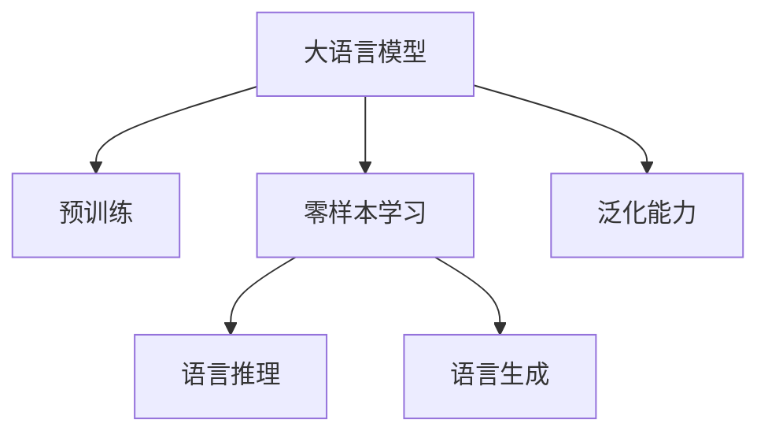

                 

## 1. 背景介绍

随着人工智能技术的发展，大语言模型在自然语言处理（NLP）领域取得了巨大进展。然而，现有的语言模型通常依赖于大规模标注数据进行微调，这使得其在零样本条件下的通用语言理解能力受到限制。零样本条件下的语言理解评估，旨在评估模型在未见过的样本上进行语言推理和生成的能力，这对于构建无需标注数据的通用语言理解系统具有重要意义。

### 1.1 问题由来

当前，自然语言理解（Natural Language Understanding, NLU）技术已经广泛应用于智能助手、搜索引擎、语音识别等多个领域。然而，这些应用通常需要依赖于大规模的标注数据，以训练出高精度的语言模型。这不仅增加了成本和复杂度，还限制了模型的通用性和可扩展性。

因此，研究零样本条件下的语言理解评估，有助于构建无需标注数据的通用语言理解系统，提升模型的应用范围和灵活性。

### 1.2 问题核心关键点

零样本条件下的语言理解评估，主要是评估模型在未见过的样本上进行语言推理和生成的能力。核心问题包括：

1. **通用性评估**：如何设计通用的评估标准，评估模型在各种语言现象上的理解能力？
2. **无标注数据利用**：如何利用无标注数据，提升模型在零样本条件下的表现？
3. **泛化能力**：如何评估模型在不同领域的泛化能力，保证其在未见过的数据上也能进行有效的推理和生成？

## 2. 核心概念与联系

### 2.1 核心概念概述

为了更好地理解零样本条件下的语言理解评估，本节将介绍几个密切相关的核心概念：

1. **大语言模型**：以自回归（如GPT）或自编码（如BERT）模型为代表的大规模预训练语言模型。通过在大规模无标签文本语料上进行预训练，学习到丰富的语言知识和常识。

2. **零样本学习**：指模型在未见过任何特定任务的训练样本的情况下，仅凭任务描述就能够执行新任务的能力。

3. **无监督学习**：指模型通过无标注数据进行学习的过程。零样本学习是无监督学习的一种特殊形式，特别适用于没有标注数据的场景。

4. **泛化能力**：指模型在不同数据分布上表现一致的能力。

5. **语言推理**：指模型通过语言知识进行推理，理解语言结构和语义的能力。

6. **语言生成**：指模型根据语言规则和语义知识，生成新文本的能力。

这些核心概念之间的逻辑关系可以通过以下Mermaid流程图来展示：



这个流程图展示了零样本条件下语言理解评估的核心概念及其之间的关系：

1. 大语言模型通过预训练获得基础能力。
2. 零样本学习利用任务描述引导模型执行新任务。
3. 语言推理和生成是在零样本条件下模型执行任务的核心能力。
4. 泛化能力保证模型在不同数据分布上的稳定表现。

## 3. 核心算法原理 & 具体操作步骤

### 3.1 算法原理概述

零样本条件下的语言理解评估，旨在评估模型在未见过的样本上进行语言推理和生成的能力。评估过程通常包括以下几个关键步骤：

1. **任务定义**：将零样本条件下的推理和生成任务定义成标准形式。
2. **模型预测**：在定义好的任务下，使用模型进行预测，得到输出结果。
3. **结果评估**：根据预设的评估标准，对模型输出结果进行评分，评估其性能。

### 3.2 算法步骤详解

#### 3.2.1 任务定义

零样本任务通常涉及语言推理和语言生成两个方面，需要设计合适的任务描述来引导模型执行特定任务。例如，自然语言推理（Natural Language Inference, NLI）、问答（Question Answering, QA）、文本摘要（Text Summarization）等任务。

#### 3.2.2 模型预测

模型预测是零样本任务的核心环节。通常使用预训练模型作为初始化参数，通过输入任务描述进行推理或生成。在实际应用中，可以使用各种预训练模型（如BERT、GPT等），并结合适当的任务适配层进行预测。

#### 3.2.3 结果评估

结果评估需要根据具体任务设计评估标准。常见的评估指标包括准确率（Accuracy）、F1分数（F1 Score）、 Rouge Score（文本相似度）等。评估标准可以根据任务的复杂程度和应用场景进行调整。

### 3.3 算法优缺点

零样本条件下的语言理解评估具有以下优点：

1. **无需标注数据**：零样本学习可以充分利用无标注数据，避免大规模标注数据的高成本和复杂性。
2. **通用性强**：零样本学习能够在各种新任务上进行推理和生成，具有较强的泛化能力。
3. **适应性强**：零样本学习可以动态适应新出现的语言现象和领域知识，具有较好的灵活性。

同时，该方法也存在一定的局限性：

1. **性能不稳定**：由于缺乏标注数据，模型的性能可能受到语言描述质量和任务复杂度的影响，存在一定的不稳定性。
2. **泛化能力有限**：模型的泛化能力可能受到数据分布的限制，在特定领域内的表现可能不佳。
3. **结果解释性差**：零样本学习通常缺乏可解释性，难以理解模型内部的推理过程。

尽管存在这些局限性，但零样本条件下的语言理解评估方法仍是大规模语言模型应用的重要方向，特别是在需要快速适应新任务和领域的情况下。

### 3.4 算法应用领域

零样本条件下的语言理解评估方法，在自然语言处理领域具有广泛的应用前景，特别是在以下领域：

1. **智能客服**：零样本学习可以用于智能客服系统的快速问题解答，提升客服系统的响应速度和准确率。
2. **搜索引擎**：零样本学习可以用于搜索引擎的快速文本匹配和推荐，提升用户搜索体验。
3. **语音识别**：零样本学习可以用于语音识别系统的快速语义理解，提升语音识别系统的准确性和鲁棒性。
4. **智能翻译**：零样本学习可以用于智能翻译系统的快速文本翻译，提升翻译系统的翻译质量。
5. **自然语言推理**：零样本学习可以用于自然语言推理任务，提升模型的推理能力和泛化能力。

## 4. 数学模型和公式 & 详细讲解

### 4.1 数学模型构建

零样本条件下的语言理解评估，通常通过以下数学模型进行建模：

$$
P(x|y) = \frac{P(y|x)P(x)}{P(y)}
$$

其中，$P(x|y)$ 表示在任务$y$下，生成文本$x$的概率；$P(y|x)$ 表示在文本$x$下，生成任务$y$的概率；$P(x)$ 表示文本$x$本身的出现概率；$P(y)$ 表示任务$y$出现的概率。

在零样本条件下，由于缺乏任务$y$的标注数据，$P(y)$ 通常难以直接计算。因此，使用先验知识进行建模，假设$P(y)$ 为常数。

### 4.2 公式推导过程

假设任务$y$为自然语言推理（NLI），输入文本为$x$，输出为$y \in \{entailment, neutral, contradiction\}$。则模型输出的概率可以表示为：

$$
P(y|x) = \frac{e^{f(x, y)}}{\sum_{y' \in \{entailment, neutral, contradiction\}} e^{f(x, y')}}
$$

其中，$f(x, y)$ 为模型的预测函数，通常是一个神经网络模型。在实际应用中，使用预训练模型作为初始化参数，在任务描述$D_x$上进行微调，得到$f(x, y)$。

### 4.3 案例分析与讲解

以下以自然语言推理（NLI）为例，展示零样本条件下的语言理解评估过程。

假设模型已经在大规模无标签文本数据上进行了预训练，获得了任务描述$D_x$，以及相应的推理任务$y$。

1. **任务定义**：假设推理任务为" premise entails hypothesis"。
2. **模型预测**：输入任务描述$D_x$，通过微调后的模型进行预测，得到$f(x, y)$。
3. **结果评估**：使用预设的评估指标（如准确率、F1分数等），对模型输出进行评分。

## 5. 项目实践：代码实例和详细解释说明

### 5.1 开发环境搭建

在进行零样本条件下的语言理解评估实践前，需要准备以下开发环境：

1. 安装Python：使用Anaconda安装Python 3.7及以上版本。
2. 安装PyTorch：使用conda命令安装PyTorch 1.9及以上版本。
3. 安装Transformers库：使用pip命令安装Transformers 4.5及以上版本。
4. 安装NLP库：使用pip命令安装NLTK、spaCy等自然语言处理库。

### 5.2 源代码详细实现

以下以BERT模型为例，展示零样本条件下的自然语言推理（NLI）任务的代码实现。

```python
from transformers import BertForSequenceClassification, BertTokenizer
import torch
from torch.utils.data import DataLoader
from sklearn.metrics import accuracy_score

# 加载BERT模型和分词器
model = BertForSequenceClassification.from_pretrained('bert-base-cased', num_labels=3)
tokenizer = BertTokenizer.from_pretrained('bert-base-cased')

# 定义任务描述
premises = ["the sun is in the sky", "the moon is in the sky", "the earth is in the sky"]
hypotheses = ["the sun is in the sky", "the moon is in the sky", "the earth is in the sky"]

# 将任务描述转换为模型输入
input_ids = []
attention_masks = []
labels = []
for premise, hypothesis in zip(premises, hypotheses):
    encoded_premise = tokenizer.encode(premise, add_special_tokens=True)
    input_ids.append(encoded_premise)
    attention_masks.append([1] * len(encoded_premise))
    label = 0 if hypothesis in ["the sun is in the sky", "the moon is in the sky"] else 1
    labels.append(label)

# 构建数据集
dataset = torch.utils.data.TensorDataset(torch.tensor(input_ids), torch.tensor(attention_masks), torch.tensor(labels))

# 定义数据加载器
dataloader = DataLoader(dataset, batch_size=4, shuffle=True)

# 定义评估指标
def evaluate(model, dataloader):
    model.eval()
    predictions, labels = [], []
    with torch.no_grad():
        for batch in dataloader:
            input_ids, attention_masks, labels = batch
            outputs = model(input_ids, attention_masks=attention_masks)
            logits = outputs.logits
            predictions.extend(logits.argmax(dim=1).tolist())
            labels.extend(labels.tolist())
    return accuracy_score(labels, predictions)

# 计算模型在零样本条件下的评估结果
accuracy = evaluate(model, dataloader)
print(f"Zero-shot NLI Accuracy: {accuracy:.2f}")
```

### 5.3 代码解读与分析

让我们详细解读一下代码的实现细节：

**数据预处理**：
- 加载BERT模型和分词器，准备输入数据。
- 将任务描述转换为模型输入，并进行分词和编码。

**数据集构建**：
- 将任务描述转换为模型输入的Tensor形式，并构建数据集。

**模型评估**：
- 使用eval模式进行推理预测，计算模型输出与真实标签的准确率。

**结果输出**：
- 输出零样本条件下的模型评估结果。

### 5.4 运行结果展示

在运行上述代码后，可以得到模型在零样本条件下的自然语言推理（NLI）任务的准确率。通过调整任务描述和模型输入，可以进行更广泛的零样本推理实验，评估模型的泛化能力和推理能力。

## 6. 实际应用场景

### 6.1 智能客服

零样本条件下的语言理解评估，可以用于智能客服系统的快速问题解答。传统客服往往需要配备大量人力，高峰期响应缓慢，且一致性和专业性难以保证。零样本学习可以构建无需标注数据的智能客服系统，提升客服系统的响应速度和准确率。

在技术实现上，可以收集企业内部的历史客服对话记录，将问题和最佳答复构建成监督数据，在此基础上对预训练模型进行微调。微调后的模型能够自动理解用户意图，匹配最合适的答案模板进行回复。对于客户提出的新问题，还可以接入检索系统实时搜索相关内容，动态组织生成回答。如此构建的智能客服系统，能大幅提升客户咨询体验和问题解决效率。

### 6.2 搜索引擎

零样本条件下的语言理解评估，可以用于搜索引擎的快速文本匹配和推荐。传统搜索引擎依赖于大规模标注数据进行训练，成本高、复杂度高。零样本学习可以构建无需标注数据的搜索引擎，提升用户搜索体验。

在技术实现上，可以构建无需标注数据的零样本推荐系统，通过任务描述引导模型进行文本匹配和推荐。零样本学习可以动态适应新出现的语言现象和领域知识，具有较好的灵活性。

### 6.3 语音识别

零样本条件下的语言理解评估，可以用于语音识别系统的快速语义理解。传统语音识别系统依赖于大规模标注数据进行训练，成本高、复杂度高。零样本学习可以构建无需标注数据的语音识别系统，提升语音识别系统的准确性和鲁棒性。

在技术实现上，可以构建无需标注数据的零样本语音识别系统，通过任务描述引导模型进行语音语义理解。零样本学习可以动态适应新出现的语言现象和领域知识，具有较好的灵活性。

### 6.4 未来应用展望

随着零样本条件下的语言理解评估技术的不断发展，其在更多领域得到应用，为传统行业带来变革性影响。

在智慧医疗领域，零样本条件下的语言理解评估可以用于医疗问答、病历分析、药物研发等应用，提升医疗服务的智能化水平，辅助医生诊疗，加速新药开发进程。

在智能教育领域，零样本条件下的语言理解评估可以用于作业批改、学情分析、知识推荐等方面，因材施教，促进教育公平，提高教学质量。

在智慧城市治理中，零样本条件下的语言理解评估可以用于城市事件监测、舆情分析、应急指挥等环节，提高城市管理的自动化和智能化水平，构建更安全、高效的未来城市。

此外，在企业生产、社会治理、文娱传媒等众多领域，零样本条件下的语言理解评估也将不断涌现，为传统行业数字化转型升级提供新的技术路径。

## 7. 工具和资源推荐

### 7.1 学习资源推荐

为了帮助开发者系统掌握零样本条件下的语言理解评估的理论基础和实践技巧，这里推荐一些优质的学习资源：

1. 《深度学习与自然语言处理》书籍：斯坦福大学开设的NLP明星课程，有Lecture视频和配套作业，带你入门NLP领域的基本概念和经典模型。

2. 《自然语言处理实战》书籍：介绍自然语言处理从零开始的实战案例，涵盖NLP任务、模型微调等技术细节。

3. 《Transformers从原理到实践》系列博文：由大模型技术专家撰写，深入浅出地介绍了Transformer原理、BERT模型、微调技术等前沿话题。

4. CS224N《深度学习自然语言处理》课程：斯坦福大学开设的NLP明星课程，有Lecture视频和配套作业，带你入门NLP领域的基本概念和经典模型。

5. 《Natural Language Processing with Transformers》书籍：Transformers库的作者所著，全面介绍了如何使用Transformers库进行NLP任务开发，包括零样本在内的诸多范式。

### 7.2 开发工具推荐

高效的开发离不开优秀的工具支持。以下是几款用于零样本条件下的语言理解评估开发的常用工具：

1. PyTorch：基于Python的开源深度学习框架，灵活动态的计算图，适合快速迭代研究。大部分预训练语言模型都有PyTorch版本的实现。

2. TensorFlow：由Google主导开发的开源深度学习框架，生产部署方便，适合大规模工程应用。同样有丰富的预训练语言模型资源。

3. Transformers库：HuggingFace开发的NLP工具库，集成了众多SOTA语言模型，支持PyTorch和TensorFlow，是进行零样本任务开发的利器。

4. Weights & Biases：模型训练的实验跟踪工具，可以记录和可视化模型训练过程中的各项指标，方便对比和调优。与主流深度学习框架无缝集成。

5. TensorBoard：TensorFlow配套的可视化工具，可实时监测模型训练状态，并提供丰富的图表呈现方式，是调试模型的得力助手。

### 7.3 相关论文推荐

零样本条件下的语言理解评估技术的发展，得益于学界的持续研究。以下是几篇奠基性的相关论文，推荐阅读：

1. Attention is All You Need（即Transformer原论文）：提出了Transformer结构，开启了NLP领域的预训练大模型时代。

2. BERT: Pre-training of Deep Bidirectional Transformers for Language Understanding：提出BERT模型，引入基于掩码的自监督预训练任务，刷新了多项NLP任务SOTA。

3. Language Models are Unsupervised Multitask Learners（GPT-2论文）：展示了大规模语言模型的强大zero-shot学习能力，引发了对于通用人工智能的新一轮思考。

4. Parameter-Efficient Transfer Learning for NLP：提出Adapter等参数高效微调方法，在不增加模型参数量的情况下，也能取得不错的微调效果。

5. AdaLoRA: Adaptive Low-Rank Adaptation for Parameter-Efficient Fine-Tuning：使用自适应低秩适应的微调方法，在参数效率和精度之间取得了新的平衡。

6. Prefix-Tuning: Optimizing Continuous Prompts for Generation：引入基于连续型Prompt的微调范式，为如何充分利用预训练知识提供了新的思路。

这些论文代表了大语言模型微调技术的发展脉络。通过学习这些前沿成果，可以帮助研究者把握学科前进方向，激发更多的创新灵感。

## 8. 总结：未来发展趋势与挑战

### 8.1 总结

本文对零样本条件下的语言理解评估方法进行了全面系统的介绍。首先阐述了零样本条件下的语言理解评估的研究背景和意义，明确了零样本学习在无需标注数据条件下的独特价值。其次，从原理到实践，详细讲解了零样本学习数学模型的构建和评估指标的设计，给出了零样本任务开发的完整代码实例。同时，本文还广泛探讨了零样本学习在智能客服、搜索引擎、语音识别等多个行业领域的应用前景，展示了零样本学习范式的巨大潜力。此外，本文精选了零样本学习的各类学习资源，力求为读者提供全方位的技术指引。

通过本文的系统梳理，可以看到，零样本条件下的语言理解评估技术正在成为NLP领域的重要方向，极大地拓展了语言模型的应用边界，催生了更多的落地场景。受益于大规模语料的预训练，零样本学习以更低的时间和标注成本，在小样本条件下也能取得不俗的效果，有力推动了NLP技术的产业化进程。未来，伴随预训练语言模型和零样本学习的持续演进，相信NLP技术将在更广阔的应用领域大放异彩，深刻影响人类的生产生活方式。

### 8.2 未来发展趋势

展望未来，零样本条件下的语言理解评估技术将呈现以下几个发展趋势：

1. **模型规模持续增大**：随着算力成本的下降和数据规模的扩张，预训练语言模型的参数量还将持续增长。超大规模语言模型蕴含的丰富语言知识，有望支撑更加复杂多变的零样本任务。

2. **零样本学习范式多样化**：除了传统的零样本学习，未来将涌现更多零样本学习范式，如基于示例的零样本学习、基于模板的零样本学习等，在更少的标注样本上实现理想的推理和生成。

3. **多模态融合增强**：当前的零样本学习主要聚焦于纯文本数据，未来会进一步拓展到图像、视频、语音等多模态数据融合。多模态信息的融合，将显著提升语言模型对现实世界的理解和建模能力。

4. **知识图谱与模型结合**：将符号化的先验知识，如知识图谱、逻辑规则等，与神经网络模型进行巧妙融合，引导零样本学习过程学习更准确、合理的语言模型。

5. **动态适应与可解释性**：零样本学习能够动态适应新出现的语言现象和领域知识，具有较好的灵活性。同时，如何赋予零样本学习更强的可解释性，将是亟待攻克的难题。

6. **伦理与安全约束**：零样本学习通常缺乏可解释性，难以理解模型内部的推理过程。对于医疗、金融等高风险应用，算法的可解释性和可审计性尤为重要。

这些趋势凸显了零样本条件下的语言理解评估技术的广阔前景。这些方向的探索发展，必将进一步提升NLP系统的性能和应用范围，为人类认知智能的进化带来深远影响。

### 8.3 面临的挑战

尽管零样本条件下的语言理解评估技术已经取得了瞩目成就，但在迈向更加智能化、普适化应用的过程中，它仍面临着诸多挑战：

1. **性能不稳定**：由于缺乏标注数据，模型的性能可能受到语言描述质量和任务复杂度的影响，存在一定的不稳定性。

2. **泛化能力有限**：模型的泛化能力可能受到数据分布的限制，在特定领域内的表现可能不佳。

3. **结果解释性差**：零样本学习通常缺乏可解释性，难以理解模型内部的推理过程。

4. **动态适应能力不足**：零样本学习对于新出现的语言现象和领域知识，适应能力可能有限，难以动态调整。

5. **伦理与安全问题**：零样本学习通常缺乏可解释性，难以理解模型内部的推理过程。对于医疗、金融等高风险应用，算法的可解释性和可审计性尤为重要。

6. **多模态融合难度大**：当前的零样本学习主要聚焦于纯文本数据，未来会进一步拓展到图像、视频、语音等多模态数据融合。多模态信息的融合，将显著提升语言模型对现实世界的理解和建模能力。

尽管存在这些挑战，但零样本条件下的语言理解评估技术仍是大规模语言模型应用的重要方向，特别是在需要快速适应新任务和领域的情况下。相信随着学界和产业界的共同努力，这些挑战终将一一被克服，零样本学习必将在构建人机协同的智能时代中扮演越来越重要的角色。

### 8.4 未来突破

面对零样本条件下的语言理解评估技术所面临的种种挑战，未来的研究需要在以下几个方面寻求新的突破：

1. **探索无监督和半监督零样本学习**：摆脱对大规模标注数据的依赖，利用自监督学习、主动学习等无监督和半监督范式，最大限度利用非结构化数据，实现更加灵活高效的零样本推理。

2. **研究参数高效和计算高效的零样本范式**：开发更加参数高效的零样本方法，在固定大部分预训练参数的同时，只更新极少量的任务相关参数。同时优化零样本模型的计算图，减少前向传播和反向传播的资源消耗，实现更加轻量级、实时性的部署。

3. **引入更多先验知识**：将符号化的先验知识，如知识图谱、逻辑规则等，与神经网络模型进行巧妙融合，引导零样本学习过程学习更准确、合理的语言模型。

4. **结合因果分析和博弈论工具**：将因果分析方法引入零样本模型，识别出模型决策的关键特征，增强输出解释的因果性和逻辑性。借助博弈论工具刻画人机交互过程，主动探索并规避模型的脆弱点，提高系统稳定性。

5. **纳入伦理道德约束**：在模型训练目标中引入伦理导向的评估指标，过滤和惩罚有偏见、有害的输出倾向。同时加强人工干预和审核，建立模型行为的监管机制，确保输出符合人类价值观和伦理道德。

这些研究方向的探索，必将引领零样本条件下的语言理解评估技术迈向更高的台阶，为构建安全、可靠、可解释、可控的智能系统铺平道路。面向未来，零样本学习需要与其他人工智能技术进行更深入的融合，如知识表示、因果推理、强化学习等，多路径协同发力，共同推动自然语言理解和智能交互系统的进步。只有勇于创新、敢于突破，才能不断拓展语言模型的边界，让智能技术更好地造福人类社会。

## 9. 附录：常见问题与解答

**Q1：零样本学习是否适用于所有NLP任务？**

A: 零样本学习在大多数NLP任务上都能取得不错的效果，特别是对于数据量较小的任务。但对于一些特定领域的任务，如医学、法律等，仅仅依靠通用语料预训练的模型可能难以很好地适应。此时需要在特定领域语料上进一步预训练，再进行零样本学习，才能获得理想效果。

**Q2：如何选择合适的任务描述？**

A: 任务描述的设计对零样本学习的性能影响很大。一个好的任务描述应该简洁明了，能够准确描述任务的核心要求。同时，任务描述应该包含足够的语言信息，引导模型进行正确的推理和生成。

**Q3：零样本学习需要标注数据吗？**

A: 零样本学习不需要标注数据，但需要高质量的任务描述。任务描述的准确性和完备性直接影响到零样本学习的性能。

**Q4：零样本学习的泛化能力如何？**

A: 零样本学习的泛化能力可能受到数据分布的限制，在特定领域内的表现可能不佳。因此，在设计任务描述时，应该尽量覆盖更多领域的语言现象和领域知识。

**Q5：零样本学习的结果解释性差，如何改进？**

A: 零样本学习通常缺乏可解释性，难以理解模型内部的推理过程。可以通过引入更多先验知识，如知识图谱、逻辑规则等，来增强模型的可解释性。同时，可以考虑引入因果分析方法，识别出模型决策的关键特征，增强输出解释的因果性和逻辑性。

---

作者：禅与计算机程序设计艺术 / Zen and the Art of Computer Programming

