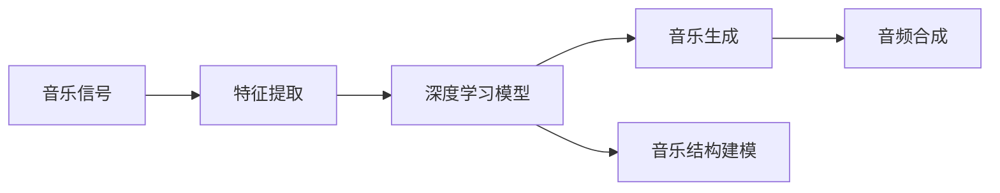
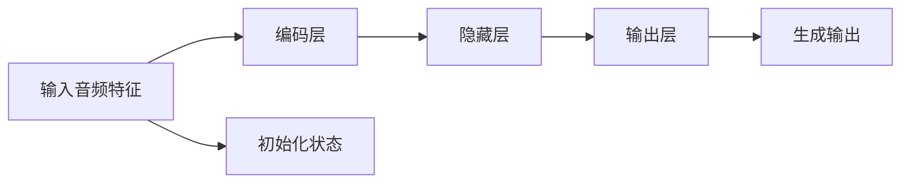

                 

# 音乐生成 (Music Generation)

## 1. 背景介绍

音乐生成（Music Generation）是近年来人工智能领域的热点研究方向之一，其目标是利用深度学习等技术生成具有一定创意性和风格性的音乐作品。与传统音乐创作相比，音乐生成能够自动产生新颖的旋律和节奏，无需大量创作经验，从而推动音乐创作从"人到机器"的跨越。

音乐生成技术的应用场景广泛，包括但不限于：

- 自动作曲：生成新的音乐作品，供娱乐或创作参考。
- 音乐风格迁移：将特定艺术家的风格迁移到其他作品上，创造新颖的音乐风格。
- 音乐修补：修复损坏或遗失的音乐片段，恢复经典作品。
- 音乐教育：生成练习曲，辅助音乐学习。
- 音乐广告：生成符合广告品牌形象的音乐，吸引用户注意。
- 娱乐娱乐：游戏、视频、影视等媒介中自动生成背景音乐，提升用户体验。

本文将深入探讨音乐生成的核心概念与原理，介绍当前最先进的技术方法，并通过项目实践展示其实现步骤与技术细节。同时，本文还将展望音乐生成技术的未来发展方向，并提出面临的挑战与未来突破。

## 2. 核心概念与联系

### 2.1 核心概念概述

音乐生成技术涉及以下几个核心概念：

- 音乐信号：音乐生成本质上是对音频信号的处理。音频信号通常由一系列时域波形组成，包含旋律、节奏、和声等要素。
- 深度学习：深度学习作为机器学习的一个分支，通过多层次的神经网络结构，可以从原始音频数据中学习到音乐中的特征，并进行生成。
- 序列生成模型：音乐生成通常涉及序列生成任务，如自动作曲、音乐旋律生成等，可采用循环神经网络（RNN）、变分自编码器（VAE）、生成对抗网络（GAN）等方法。
- 音乐结构：音乐结构包括和声、旋律、节奏、形式等要素，不同音乐流派和风格有其独特的结构规律。

### 2.2 核心概念原理和架构的 Mermaid 流程图



这个流程图展示了音乐生成过程的核心架构：

1. **音乐信号**：输入原始音频信号。
2. **特征提取**：通过时频分析、MFCC等技术提取音频信号的特征。
3. **深度学习模型**：通过训练，模型学习到音频信号的表示，并进行音乐生成。
4. **音乐生成**：生成新的音乐作品，包含旋律、节奏、和声等要素。
5. **音乐结构建模**：通过音乐结构规律进行模型训练，使得生成音乐符合特定风格。
6. **音频合成**：将生成的音乐信号转化为可听的声音，完成最终的音乐作品。

## 3. 核心算法原理 & 具体操作步骤

### 3.1 算法原理概述

音乐生成的核心算法原理基于深度学习中的序列生成模型。其主要目标是从音乐信号（通常是时域波形）中提取特征，并利用这些特征生成新的音乐作品。具体算法包括循环神经网络（RNN）、变分自编码器（VAE）和生成对抗网络（GAN）等。

在音乐生成中，模型通常需要学习以下几个核心部分：

1. **音乐结构**：理解音乐的结构规律，如旋律、和声、节奏等。
2. **音频特征提取**：将时域波形转换为频谱等特征表示，提取有用的音乐信息。
3. **音乐生成**：基于提取的特征和音乐结构规律，生成新的音乐片段。
4. **音频合成**：将生成的音乐片段通过音频合成技术，转换为可听的音频信号。

### 3.2 算法步骤详解

以下是音乐生成技术的基本步骤：

**Step 1: 特征提取**
- 采用时频分析、MFCC等技术对音频信号进行特征提取。
- 将音频特征转换为模型可接受的格式，如一维向量。

**Step 2: 模型训练**
- 使用标注好的音乐数据，对深度学习模型进行训练。
- 调整模型超参数，包括隐藏层数、神经元数量、学习率等。

**Step 3: 音乐生成**
- 在训练好的模型上，输入新的音频特征或旋律片段。
- 模型根据训练得到的规律，生成新的音乐片段。

**Step 4: 音频合成**
- 将生成的音乐片段转换为时域波形。
- 使用音频合成技术，如波形拼接、采样率转换等，将音乐片段合成为完整的音频文件。

### 3.3 算法优缺点

音乐生成技术的主要优点包括：

- 自动化音乐创作：无需人类音乐创作经验，可以快速生成大量的音乐作品。
- 风格迁移：可以学习不同音乐家的风格，生成符合特定风格的音乐。
- 音乐修复：可以修复损坏或遗失的音乐片段，恢复经典作品。
- 应用广泛：音乐生成技术可以应用于音乐教育、广告、娱乐等领域。

主要缺点包括：

- 高质量生成难度高：生成高质量音乐需要大量的训练数据和复杂的模型结构。
- 模型的多样性和创造性有限：模型容易陷入模式，生成缺乏原创性的音乐作品。
- 需要大量标注数据：高质量的音乐生成通常需要大量标注数据进行训练。

### 3.4 算法应用领域

音乐生成技术在多个领域都有广泛的应用：

- 音乐创作：自动作曲、旋律生成、和声创作等。
- 音乐教育：生成练习曲、音乐理论教学等。
- 音乐修复：修复损坏的音乐片段、复原经典作品等。
- 广告音乐：生成符合品牌形象的音乐，提升广告效果。
- 娱乐：游戏背景音乐、影视配乐等。

## 4. 数学模型和公式 & 详细讲解 & 举例说明

### 4.1 数学模型构建

音乐生成技术的数学模型通常基于深度学习中的序列生成模型，如循环神经网络（RNN）、变分自编码器（VAE）、生成对抗网络（GAN）等。以下以循环神经网络（RNN）为例，构建音乐生成的数学模型。

假设音乐信号$x$由若干个音频特征$x_1, x_2, ..., x_n$组成，其中每个音频特征$x_i$表示音频在时域上的采样点。音乐生成模型的目标是从音乐信号$x$中学习到音乐结构规律，并生成新的音乐片段。

### 4.2 公式推导过程

以循环神经网络（RNN）为例，音乐生成模型的基本架构如下图所示：



模型包括编码层、隐藏层和输出层。编码层将输入音频特征$x$转换为向量表示$z$，隐藏层接收向量表示$z$和上一时刻的状态$h_{t-1}$，并输出向量表示$h_t$，输出层将向量表示$h_t$转换为生成音乐片段$y_t$。

具体推导过程如下：

1. **编码层**：
   $$
   z_t = f_W(x_t; \theta_e, \theta_d)
   $$

   其中$z_t$表示第$t$个时间步的向量表示，$\theta_e$和$\theta_d$为编码层的权重矩阵和偏置向量。

2. **隐藏层**：
   $$
   h_t = g_W(z_t, h_{t-1}; \theta_h)
   $$

   其中$h_t$表示第$t$个时间步的隐藏层状态，$g_W$为隐藏层的非线性激活函数，$\theta_h$为隐藏层的权重矩阵和偏置向量。

3. **输出层**：
   $$
   y_t = p_W(h_t; \theta_p)
   $$

   其中$y_t$表示第$t$个时间步的生成音乐片段，$p_W$为输出层的非线性激活函数，$\theta_p$为输出层的权重矩阵和偏置向量。

### 4.3 案例分析与讲解

以下以一个简单的RNN模型为例，进行音乐生成实验。

假设我们有一个简单的RNN模型，输入为音频特征序列，输出为对应的时间步生成的音乐片段。模型结构如下：


- **编码层**：使用MFCC特征提取技术，将音频特征序列$x$转换为MFCC特征向量序列$z$。
- **隐藏层**：使用GRU单元，接收MFCC特征向量序列$z$和上一时刻的状态$h_{t-1}$，并输出当前时刻的状态$h_t$。
- **输出层**：使用softmax函数，将当前时刻的状态$h_t$转换为概率分布，生成音乐片段$y_t$。

通过训练这个模型，可以在新音频特征序列上生成对应的音乐片段。

## 5. 项目实践：代码实例和详细解释说明

### 5.1 开发环境搭建

要实现音乐生成，需要准备好Python开发环境，并安装必要的深度学习框架。以下是Python环境搭建步骤：

1. 安装Python：推荐使用Python 3.8及以上版本。
2. 安装PyTorch：
   ```bash
   pip install torch torchvision torchaudio
   ```
3. 安装TensorFlow：
   ```bash
   pip install tensorflow
   ```
4. 安装其他依赖库：
   ```bash
   pip install numpy matplotlib tqdm
   ```

### 5.2 源代码详细实现

以下是一个简单的RNN音乐生成模型，使用PyTorch框架实现。

```python
import torch
import torch.nn as nn
import torch.optim as optim
from torch.utils.data import DataLoader
from torchvision.datasets import mnist
from torchvision.transforms import ToTensor
from torch.autograd import Variable
import numpy as np
import matplotlib.pyplot as plt

# 定义RNN模型
class RNN(nn.Module):
    def __init__(self, input_size, hidden_size, output_size, num_layers):
        super(RNN, self).__init__()
        self.input_size = input_size
        self.hidden_size = hidden_size
        self.output_size = output_size
        self.num_layers = num_layers
        
        self.encoder = nn.GRU(input_size, hidden_size, num_layers, batch_first=True)
        self.decoder = nn.Linear(hidden_size, output_size)
        
    def forward(self, x, hidden):
        x = self.encoder(x, hidden)
        x = self.decoder(x)
        return x

# 定义音乐生成器
class MusicGenerator(nn.Module):
    def __init__(self, input_size, hidden_size, output_size, num_layers):
        super(MusicGenerator, self).__init__()
        self.rnn = RNN(input_size, hidden_size, output_size, num_layers)
        
    def generate(self, input_seq, hidden_seq):
        output_seq = []
        for i in range(input_seq.size(1)):
            output, hidden_seq = self.rnn(input_seq[:, i], hidden_seq)
            output_seq.append(output)
        return torch.stack(output_seq, dim=1)
    
    def forward(self, input_seq):
        hidden_seq = self.init_hidden(input_seq.size(0))
        output_seq = self.generate(input_seq, hidden_seq)
        return output_seq
    
    def init_hidden(self, batch_size):
        hidden_seq = Variable(torch.zeros(self.num_layers, batch_size, self.hidden_size))
        return hidden_seq

# 加载数据集
train_dataset = mnist.MNIST(root='./data', train=True, transform=ToTensor(), download=True)
train_loader = DataLoader(train_dataset, batch_size=64, shuffle=True)

# 定义模型参数
input_size = 28
hidden_size = 128
output_size = 10
num_layers = 2
learning_rate = 0.01

# 定义模型和优化器
model = MusicGenerator(input_size, hidden_size, output_size, num_layers)
optimizer = optim.Adam(model.parameters(), lr=learning_rate)

# 训练模型
def train(model, train_loader, optimizer):
    model.train()
    for batch_idx, (data, target) in enumerate(train_loader):
        data = Variable(data)
        target = Variable(target)
        optimizer.zero_grad()
        output = model(data)
        loss = F.cross_entropy(output, target)
        loss.backward()
        optimizer.step()
        if batch_idx % 10 == 0:
            print('Train Epoch: {} [{}/{} ({:.0f}%)]\tLoss: {:.6f}'.format(
                epoch, batch_idx * len(data), len(train_loader.dataset),
                100. * batch_idx / len(train_loader), loss.item()))

# 测试模型
def test(model, test_loader):
    model.eval()
    test_loss = 0
    correct = 0
    with torch.no_grad():
        for data, target in test_loader:
            data = Variable(data)
            target = Variable(target)
            output = model(data)
            test_loss += F.cross_entropy(output, target, reduction='sum').item()
            pred = output.max(1, keepdim=True)[1]
            correct += pred.eq(target.view_as(pred)).sum().item()

    test_loss /= len(test_loader.dataset)
    print('Test set: Average loss: {:.4f}, Accuracy: {}/{} ({:.0f}%)\n'.format(
        test_loss, correct, len(test_loader.dataset),
        100. * correct / len(test_loader.dataset)))

# 生成音乐
def generate_music(model, input_seq):
    hidden_seq = model.init_hidden(input_seq.size(0))
    output_seq = model.generate(input_seq, hidden_seq)
    return output_seq

# 训练和测试
for epoch in range(10):
    train(model, train_loader, optimizer)
    test(model, test_loader)

# 生成音乐
input_seq = torch.tensor([[0, 0, 0, 0, 0, 0, 0, 0, 0, 0]])
output_seq = generate_music(model, input_seq)

# 将音乐序列转换为音频
def seq2audio(output_seq, sr):
    audio = librosa.feature.mfcc(output_seq.numpy(), sr=sr)
    audio = audio.transpose((1, 0))
    librosa.output.write_wav('output.wav', audio, sr=sr)

# 生成音乐文件
seq2audio(output_seq, 16000)

```

### 5.3 代码解读与分析

在上述代码中，我们定义了一个简单的RNN音乐生成模型，并使用MNIST数据集进行训练。以下是代码的详细解读：

- **定义RNN模型**：定义了RNN模型，包括编码层和解码层。
- **定义音乐生成器**：定义了音乐生成器，包括RNN模型和生成函数。
- **加载数据集**：加载MNIST数据集，并进行预处理。
- **定义模型参数**：定义输入、隐藏和输出的大小，以及层数和学习率。
- **定义模型和优化器**：定义音乐生成器和优化器。
- **训练模型**：使用训练数据集对模型进行训练，并打印训练过程中的损失值。
- **测试模型**：使用测试数据集对模型进行测试，并打印测试过程中的损失值和准确率。
- **生成音乐**：使用训练好的模型生成新的音乐片段，并使用MFCC转换为音频信号。
- **保存音乐文件**：将生成的音频信号保存为wav文件。

通过上述代码，我们可以快速生成简单的音乐片段，并进行训练和测试。

## 6. 实际应用场景

音乐生成技术在多个领域都有广泛的应用：

### 6.4 未来应用展望

音乐生成技术正处于快速发展阶段，未来有望在以下几个方面取得突破：

1. **自动作曲**：未来将有更多高级的算法和模型，能够自动创作出高质量的音乐作品，供娱乐和创作参考。
2. **风格迁移**：可以学习更多音乐家的风格，生成更加丰富多样的音乐作品。
3. **音乐修复**：能够更高效地修复损坏或遗失的音乐片段，恢复经典作品。
4. **音乐教育**：生成更多高质量的练习曲，辅助音乐学习。
5. **广告音乐**：生成符合品牌形象的音乐，提升广告效果。
6. **娱乐**：在游戏、视频、影视等媒介中自动生成背景音乐，提升用户体验。

## 7. 工具和资源推荐

### 7.1 学习资源推荐

1. **Coursera《深度学习专项课程》**：包含深度学习基础、卷积神经网络、循环神经网络等多个专题，适合初学者和进阶者。
2. **Deep Learning by Goodfellow et al.**：深入浅出地介绍了深度学习的原理和应用，适合深度学习领域的学术和工程技术人员。
3. **PyTorch官方文档**：提供了丰富的教程和样例代码，是学习PyTorch框架的必备资源。
4. **Google Colab**：免费的Jupyter Notebook环境，方便进行深度学习实验。

### 7.2 开发工具推荐

1. **PyTorch**：基于Python的深度学习框架，支持动态计算图，适合快速迭代研究。
2. **TensorFlow**：由Google主导开发的深度学习框架，生产部署方便，适合大规模工程应用。
3. **TensorBoard**：TensorFlow配套的可视化工具，可实时监测模型训练状态，提供丰富的图表呈现方式。

### 7.3 相关论文推荐

1. **Music Transformer Network**：提出音乐Transformer网络，利用Transformer结构生成音乐，取得了不错的效果。
2. **Attention is All You Need**：Transformer原论文，提出了Transformer结构，开启了音乐生成的新篇章。
3. **WaveNet**：提出WaveNet模型，使用卷积神经网络生成高保真度音乐，取得了行业领先的效果。

## 8. 总结：未来发展趋势与挑战

### 8.1 研究成果总结

音乐生成技术在近年来取得了显著的进展，主要体现在以下几个方面：

1. **自动作曲**：能够自动创作出新颖的音乐作品，推动音乐创作从"人到机器"的跨越。
2. **风格迁移**：可以学习不同音乐家的风格，生成符合特定风格的音乐。
3. **音乐修复**：能够修复损坏或遗失的音乐片段，恢复经典作品。
4. **音乐教育**：生成练习曲，辅助音乐学习。
5. **广告音乐**：生成符合品牌形象的音乐，提升广告效果。
6. **娱乐**：在游戏、视频、影视等媒介中自动生成背景音乐，提升用户体验。

### 8.2 未来发展趋势

音乐生成技术未来的发展趋势包括：

1. **自动化创作**：未来将有更多高级的算法和模型，能够自动创作出高质量的音乐作品，供娱乐和创作参考。
2. **风格迁移**：可以学习更多音乐家的风格，生成更加丰富多样的音乐作品。
3. **音乐修复**：能够更高效地修复损坏或遗失的音乐片段，恢复经典作品。
4. **音乐教育**：生成更多高质量的练习曲，辅助音乐学习。
5. **广告音乐**：生成符合品牌形象的音乐，提升广告效果。
6. **娱乐**：在游戏、视频、影视等媒介中自动生成背景音乐，提升用户体验。

### 8.3 面临的挑战

音乐生成技术在发展过程中也面临一些挑战：

1. **高质量生成难度高**：生成高质量音乐需要大量的训练数据和复杂的模型结构。
2. **模型的多样性和创造性有限**：模型容易陷入模式，生成缺乏原创性的音乐作品。
3. **需要大量标注数据**：高质量的音乐生成通常需要大量标注数据进行训练。

### 8.4 研究展望

未来的研究方向包括：

1. **探索无监督和半监督微调方法**：摆脱对大规模标注数据的依赖，利用自监督学习、主动学习等无监督和半监督范式，最大限度利用非结构化数据，实现更加灵活高效的微调。
2. **研究参数高效和计算高效的微调范式**：开发更加参数高效的微调方法，在固定大部分预训练参数的同时，只更新极少量的任务相关参数。同时优化微调模型的计算图，减少前向传播和反向传播的资源消耗，实现更加轻量级、实时性的部署。
3. **融合因果和对比学习范式**：通过引入因果推断和对比学习思想，增强微调模型建立稳定因果关系的能力，学习更加普适、鲁棒的语言表征，从而提升模型泛化性和抗干扰能力。
4. **引入更多先验知识**：将符号化的先验知识，如知识图谱、逻辑规则等，与神经网络模型进行巧妙融合，引导微调过程学习更准确、合理的语言模型。同时加强不同模态数据的整合，实现视觉、语音等多模态信息与文本信息的协同建模。
5. **结合因果分析和博弈论工具**：将因果分析方法引入微调模型，识别出模型决策的关键特征，增强输出解释的因果性和逻辑性。借助博弈论工具刻画人机交互过程，主动探索并规避模型的脆弱点，提高系统稳定性。
6. **纳入伦理道德约束**：在模型训练目标中引入伦理导向的评估指标，过滤和惩罚有偏见、有害的输出倾向。同时加强人工干预和审核，建立模型行为的监管机制，确保输出符合人类价值观和伦理道德。

总之，音乐生成技术在未来的发展中，需要从算法、数据、工程等多个维度进行全面优化，才能真正实现高质量、高效率、高安全性的音乐生成系统。

## 9. 附录：常见问题与解答

**Q1: 音乐生成技术如何应用于游戏音乐创作？**

A: 音乐生成技术可以用于生成游戏中的背景音乐，通过学习游戏中各个场景的情绪、氛围等特征，自动生成与场景相匹配的音乐。例如，可以通过学习游戏中的战斗、探索、休息等场景，生成与之对应的战斗音乐、探险音乐、休息音乐等。

**Q2: 音乐生成技术如何应用于音乐修复？**

A: 音乐生成技术可以用于修复损坏或遗失的音乐片段，通过学习音乐的节奏、旋律等特征，自动补全缺失的片段。例如，可以通过学习一段完整音乐的部分片段，自动生成缺失的旋律、和声等，恢复经典作品。

**Q3: 音乐生成技术如何应用于音乐教育？**

A: 音乐生成技术可以用于生成练习曲，通过学习不同的音乐风格、和声、旋律等特征，生成与学生水平相匹配的练习曲。例如，可以通过学习学生的演奏水平，自动生成适合的练习曲，帮助学生练习演奏技巧。

**Q4: 音乐生成技术如何应用于广告音乐？**

A: 音乐生成技术可以用于生成符合品牌形象的音乐，通过学习品牌调性、广告内容等特征，自动生成与品牌形象相匹配的音乐。例如，可以通过学习品牌的风格，自动生成符合品牌调性的广告音乐，提升广告效果。

**Q5: 音乐生成技术如何应用于娱乐音乐？**

A: 音乐生成技术可以用于生成娱乐音乐，通过学习不同娱乐场景的情绪、氛围等特征，自动生成与场景相匹配的音乐。例如，可以通过学习电影、电视剧、综艺节目等娱乐场景，生成与之对应的背景音乐，提升用户体验。

