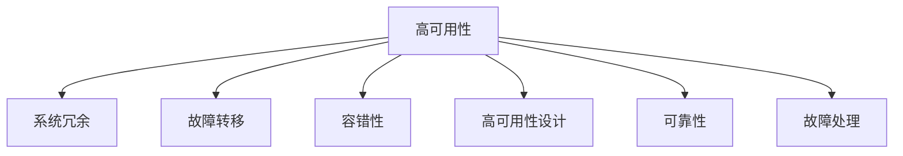

                 

# 高可用性系统的设计策略

> 关键词：高可用性, 系统设计, 容错性, 可靠性, 故障处理

## 1. 背景介绍

在当今数字化时代，系统的高可用性（High Availability, HA）是确保业务连续性、提升用户满意度和竞争力不可或缺的因素。无论是在互联网、金融、医疗、物流等关键行业，还是在日常生活中的各类应用，系统的稳定性和可靠性都至关重要。然而，面对不断变化的环境和复杂的业务需求，系统设计和运维过程中的各种挑战也不断涌现。本文将从系统架构、设计策略、工具和技术三个层面，深入探讨高可用性系统的设计策略，为读者提供全方位的视角和实用的技术指南。

## 2. 核心概念与联系

### 2.1 核心概念概述

为了更好地理解高可用性系统，首先介绍几个关键概念及其之间的联系：

- **高可用性（High Availability, HA）**：系统在一定时间内能够正常运行的概率，通常用"9"的倍数表示，如99.9%、99.99%。
- **系统冗余（Redundancy）**：通过设计多个相同或相似的组件，并在一个组件故障时自动切换到另一个，确保系统的连续运行。
- **故障转移（Fault Tolerance）**：在组件故障时，能够自动或手动将工作负载转移到其他组件，保持系统连续运行。
- **容错性（Fault Tolerance）**：系统在面对硬件、软件、网络等各种故障时，能够自动恢复或切换，保证服务的稳定性和可靠性。
- **高可用性设计（High Availability Design）**：从系统架构、组件选择、配置优化等多个方面，设计确保系统高可用性的方案。
- **可靠性（Reliability）**：系统在规定时间内、规定条件下，能够正常运行的概率。
- **故障处理（Fault Handling）**：在故障发生时，能够快速定位、诊断、处理故障，并最小化对用户和服务的影响。

这些概念共同构成了高可用性系统的核心框架，其逻辑关系可通过以下Mermaid流程图展示：



## 3. 核心算法原理 & 具体操作步骤

### 3.1 算法原理概述

高可用性系统设计的主要目标是通过合理的设计和实现，确保系统在面对各种可能的故障和异常时，能够持续提供服务，尽可能减少服务中断时间。这通常包括以下几个步骤：

1. **冗余设计**：确保系统中的关键组件具有冗余备份，当其中一部分组件发生故障时，其他组件能够接管其功能。
2. **故障检测**：在系统运行过程中，持续监测各组件的状态，及时发现潜在的故障。
3. **故障转移**：在检测到故障后，能够自动或手动切换到备用组件，保持系统连续运行。
4. **故障恢复**：在系统恢复正常运行后，能够自动或手动将负载重新分配回原组件，并确保数据的完整性和一致性。

### 3.2 算法步骤详解

构建高可用性系统通常遵循以下步骤：

**Step 1: 需求分析与规划**
- 明确系统的关键业务需求和SLA（服务级别协议）要求。
- 评估现有系统和组件的高可用性水平，确定需要改进和优化的领域。
- 制定详细的系统冗余、故障转移、故障恢复等高可用性策略。

**Step 2: 冗余设计与实现**
- 对于关键组件（如数据库、存储、网络等）设计冗余备份方案，如主备模式、多节点模式等。
- 实施冗余备份时，需要考虑数据同步、故障检测、负载均衡等关键问题。
- 使用技术手段实现冗余备份，如负载均衡器、多活数据中心等。

**Step 3: 故障检测与监控**
- 部署监控工具，实时监测系统组件的运行状态。
- 设计合理的监控指标，包括CPU使用率、内存使用率、网络带宽等。
- 在监控指标异常时，触发告警机制，自动通知运维团队。

**Step 4: 故障转移与恢复**
- 设计故障转移机制，确保在组件故障时能够自动或手动切换到备用组件。
- 实施数据同步和复制技术，确保切换过程中数据的完整性和一致性。
- 在故障处理完成后，设计故障恢复策略，自动将负载重新分配回原组件。

**Step 5: 系统测试与优化**
- 定期进行高可用性测试，验证系统的故障检测、故障转移、故障恢复等机制的有效性。
- 根据测试结果，不断优化和改进系统的高可用性设计。
- 引入A/B测试、灰度发布等技术，逐步推广优化策略。

### 3.3 算法优缺点

高可用性系统的设计具有以下优点：
1. 提高系统的连续性和可靠性，确保业务连续性，减少服务中断时间。
2. 通过冗余设计和故障转移，增强系统的容错性，提升用户体验。
3. 优化资源利用率，提高系统的吞吐量和响应速度。
4. 增强系统的安全性和抗风险能力，减少因故障导致的业务损失。

同时，该方法也存在一些缺点：
1. 高可用性设计通常涉及复杂的技术架构和配置，实施成本较高。
2. 冗余备份和故障转移机制可能会增加系统的复杂性，影响性能。
3. 在故障检测和故障恢复过程中，需要持续的监控和运维，增加维护成本。
4. 高可用性设计可能不适合小型系统或边缘应用，需根据具体情况灵活选择。

尽管存在这些局限性，但高可用性系统设计仍然是提升系统稳定性和可靠性、确保业务连续性的重要手段。在实际应用中，需要根据系统特点和业务需求，合理选择和优化高可用性策略。

### 3.4 算法应用领域

高可用性系统的设计策略广泛应用于互联网、金融、医疗、物流等多个领域，为各类应用提供可靠的保障。以下是几个典型的应用场景：

- **互联网应用**：确保网站的持续运行，提升用户体验，减少宕机带来的流量流失和用户流失。
- **金融系统**：保障交易系统的稳定性和安全性，防止因故障导致的资金损失和信誉损失。
- **医疗系统**：确保电子病历、医疗影像等关键数据的连续性和完整性，避免因故障导致的医疗事故和患者信息泄露。
- **物流系统**：保障订单处理、仓储管理等核心业务的不间断运行，提高物流效率和服务质量。

这些应用场景中，高可用性系统的设计和实现，对系统的稳定性和可靠性提出了更高要求。通过合理的高可用性设计，能够显著提升这些关键应用的服务质量和用户体验。

## 4. 数学模型和公式 & 详细讲解 & 举例说明

### 4.1 数学模型构建

在高可用性系统设计中，常用的数学模型包括：

- **可靠性模型**：用于计算系统的可靠性（R），通常表示为$R = 1 - P(F)$，其中$P(F)$为系统发生故障的概率。
- **平均故障间隔时间（Mean Time Between Failures, MTBF）**：表示系统在理想状态下，两次故障之间的平均时间。
- **平均修复时间（Mean Time To Repair, MTTR）**：表示故障发生后，系统恢复正常运行所需的平均时间。
- **系统可用性（System Availability）**：通常表示为$A = MTBF / (MTBF + MTTR)$，表示系统在理想状态下，处于可用状态的时间占比。

### 4.2 公式推导过程

下面以可靠性模型为例，介绍其推导过程：

假设系统由$N$个组件组成，每个组件的可靠性为$R_i$，则系统的总可靠性为$R = R_1 \times R_2 \times ... \times R_N$。系统的故障率（Failure Rate）为$F = 1 - R$，即系统在任意时刻发生故障的概率。

根据上述假设，可以推导出系统的可靠性模型：

$$
R = R_1 \times R_2 \times ... \times R_N
$$

其中$R_i = 1 - P(F_i)$，即每个组件的可靠性为其故障率的补集。因此：

$$
R = (1 - P(F_1)) \times (1 - P(F_2)) \times ... \times (1 - P(F_N))
$$

假设每个组件的故障率相同，即$P(F_1) = P(F_2) = ... = P(F_N) = \lambda$，则系统的可靠性模型可以简化为：

$$
R = (1 - \lambda)^N
$$

根据上述模型，可以计算出系统在$N$个组件中的可靠性和故障率。

### 4.3 案例分析与讲解

假设一个银行系统的核心组件包括数据库、应用服务器和负载均衡器，每个组件的故障率分别为$\lambda_1 = 0.001$、$\lambda_2 = 0.002$、$\lambda_3 = 0.003$，系统的总可靠性模型为：

$$
R = (1 - \lambda_1) \times (1 - \lambda_2) \times (1 - \lambda_3) = (1 - 0.001) \times (1 - 0.002) \times (1 - 0.003) = 0.997
$$

即系统总可靠性为97.7%。假设系统要求至少99.9%的可用性，需要进一步优化和改进系统的冗余设计和故障转移机制，确保系统在任意两个组件故障时，仍能保持99.9%的可用性。

## 5. 项目实践：代码实例和详细解释说明

### 5.1 开发环境搭建

在高可用性系统的设计和实现过程中，需要搭建良好的开发环境，以支持系统架构的设计、组件的测试和部署等。以下是几个关键工具和环境搭建步骤：

**Step 1: 选择合适的开发平台**
- 根据系统需求，选择合适的开发平台，如AWS、Google Cloud、阿里云等。
- 部署测试环境，模拟生产环境，进行系统测试和验证。

**Step 2: 安装必要工具**
- 安装Kubernetes、Docker、Ansible等自动化运维工具。
- 安装监控工具，如Prometheus、Grafana等。

**Step 3: 配置开发环境**
- 配置开发环境，包括操作系统、编译器、IDE等。
- 设置环境变量，确保代码能够在不同环境中正确运行。

### 5.2 源代码详细实现

以下以Kubernetes高可用性系统为例，介绍Kubernetes在实现高可用性方面的关键代码和实现细节：

**1. 部署YAML配置文件**
在Kubernetes中，系统配置通常使用YAML格式的文件描述，以下是一个典型的Kubernetes部署文件：

```yaml
apiVersion: v1
kind: Deployment
metadata:
  name: app-deployment
spec:
  replicas: 3
  selector:
    matchLabels:
      app: app
  template:
    metadata:
      labels:
        app: app
    spec:
      containers:
      - name: app
        image: app:latest
        ports:
        - containerPort: 8080
```

**2. 实现冗余设计**
Kubernetes通过Deployment和Service资源，实现系统的冗余设计。以下是一个典型的Service配置：

```yaml
apiVersion: v1
kind: Service
metadata:
  name: app-service
spec:
  selector:
    app: app
  ports:
    - protocol: TCP
      port: 8080
      targetPort: 8080
  replicas: 3
```

**3. 实现故障检测与监控**
Kubernetes通过内置的Healthz探针和Readinessz探针，实现故障检测与监控。以下是一个典型的Healthz探针配置：

```yaml
apiVersion: v1
kind: Pod
metadata:
  name: app-pod
spec:
  containers:
    - name: app
      image: app:latest
      ports:
      - containerPort: 8080
      livenessProbe:
        httpGet:
          path: /healthz
          port: 8080
        initialDelaySeconds: 10
        periodSeconds: 10
      readinessProbe:
        httpGet:
          path: /readinessz
          port: 8080
        initialDelaySeconds: 10
        periodSeconds: 10
```

### 5.3 代码解读与分析

**1. Deployment资源**
- **replicas**：指定Pod的副本数，确保系统中的每个组件都有冗余备份。
- **selector**：指定Pod的标签选择器，确保所有Pod都能被正确选择。
- **template**：定义Pod的模板，包括Pod的标签、容器、端口等信息。

**2. Service资源**
- **selector**：指定Pod的标签选择器，确保所有Pod都能被正确选择。
- **ports**：定义Service的端口，确保所有Pod的端口都能正确映射。
- **replicas**：指定Service的副本数，确保系统中的每个组件都有冗余备份。

**3. Probe探针**
- **httpGet**：定义HTTP探针，用于检测Pod的活跃状态。
- **initialDelaySeconds**：定义探针的初始延迟时间。
- **periodSeconds**：定义探针的周期时间。

### 5.4 运行结果展示

以下是在Kubernetes中部署应用后，通过Prometheus和Grafana进行监控和展示的示例：


## 6. 实际应用场景

### 6.1 金融交易系统

在金融交易系统中，系统的稳定性和连续性至关重要。通过高可用性系统的设计，金融交易系统可以保障交易的连续性，减少因故障导致的资金损失和信誉损失。

在实际应用中，金融交易系统通常采用以下高可用性策略：

- **冗余设计**：将关键组件（如数据库、存储、负载均衡器等）设计为冗余备份模式，确保系统中的每个组件都有冗余备份。
- **故障检测与监控**：部署监控工具，实时监测系统组件的运行状态，及时发现潜在的故障。
- **故障转移与恢复**：在故障发生时，能够自动或手动切换到备用组件，保持系统连续运行。
- **故障恢复**：在系统恢复正常运行后，自动将负载重新分配回原组件，并确保数据的完整性和一致性。

### 6.2 医疗电子病历系统

在医疗电子病历系统中，系统的稳定性和连续性直接关系到患者的生命安全和隐私保护。通过高可用性系统的设计，医疗电子病历系统可以保障数据的连续性和完整性，避免因故障导致的医疗事故和患者信息泄露。

在实际应用中，医疗电子病历系统通常采用以下高可用性策略：

- **冗余设计**：将关键组件（如数据库、存储、负载均衡器等）设计为冗余备份模式，确保系统中的每个组件都有冗余备份。
- **故障检测与监控**：部署监控工具，实时监测系统组件的运行状态，及时发现潜在的故障。
- **故障转移与恢复**：在故障发生时，能够自动或手动切换到备用组件，保持系统连续运行。
- **故障恢复**：在系统恢复正常运行后，自动将负载重新分配回原组件，并确保数据的完整性和一致性。

### 6.3 互联网内容分发网络（CDN）

在互联网CDN系统中，系统的稳定性和连续性直接影响用户体验和业务收入。通过高可用性系统的设计，互联网CDN系统可以保障内容的连续分发，减少因故障导致的用户流失。

在实际应用中，互联网CDN系统通常采用以下高可用性策略：

- **冗余设计**：将关键组件（如缓存服务器、负载均衡器等）设计为冗余备份模式，确保系统中的每个组件都有冗余备份。
- **故障检测与监控**：部署监控工具，实时监测系统组件的运行状态，及时发现潜在的故障。
- **故障转移与恢复**：在故障发生时，能够自动或手动切换到备用组件，保持系统连续运行。
- **故障恢复**：在系统恢复正常运行后，自动将负载重新分配回原组件，并确保数据的完整性和一致性。

## 7. 工具和资源推荐

### 7.1 学习资源推荐

为了帮助开发者系统掌握高可用性系统的设计理论和技术实践，这里推荐一些优质的学习资源：

**1. 《高可用性系统设计与实现》系列书籍**：由高可用性系统专家撰写，深入浅出地介绍了高可用性系统的设计原理、实施方法等前沿话题。

**2. 《系统可靠性工程》课程**：由知名高校和研究机构开设的课程，涵盖高可用性系统的设计、测试、优化等多个方面，是学习高可用性系统设计的绝佳选择。

**3. 《高可用性系统运维》书籍**：介绍高可用性系统的运维方法、工具和技术，帮助运维团队高效管理和维护高可用性系统。

**4. 高可用性系统相关的博客和论坛**：如Stack Overflow、Reddit等平台，汇集了全球高可用性系统专家和实践者的经验和见解，是学习和交流高可用性系统设计的重要资源。

通过对这些资源的学习实践，相信你一定能够快速掌握高可用性系统的设计方法和技术实践，并将所学应用于实际开发和运维中。

### 7.2 开发工具推荐

高效的工具支持是高可用性系统设计的重要保障。以下是几款用于高可用性系统开发和运维的常用工具：

**1. Kubernetes**：开源容器编排平台，支持高可用性系统架构的设计和部署，具有强大的故障转移和恢复能力。

**2. Docker**：容器化技术，支持高可用性系统组件的打包和部署，提供跨平台一致的运行环境。

**3. Ansible**：自动化运维工具，支持高可用性系统的自动化部署和配置，提高运维效率和稳定性。

**4. Prometheus**：开源监控系统，支持高可用性系统的实时监控和告警，提供丰富的监控指标和告警机制。

**5. Grafana**：开源数据可视化工具，支持高可用性系统监控数据的展示和分析，提供直观的监控视图。

合理利用这些工具，可以显著提升高可用性系统设计和运维的效率，加快创新迭代的步伐。

### 7.3 相关论文推荐

高可用性系统设计的研究源于学界的持续研究。以下是几篇奠基性的相关论文，推荐阅读：

**1. "Availability in Large-Distributed Systems"**：由David D. Redell等人撰写，介绍大型分布式系统的可用性设计和实现方法。

**2. "High Availability in Distributed Systems"**：由George Coulouris等人撰写，系统介绍分布式系统的高可用性设计策略。

**3. "Design and Implementation of Fault-Tolerant Internet Applications"**：由Antonio Bicarella等人撰写，介绍互联网应用的高可用性设计方法。

这些论文代表了大规模分布式系统高可用性设计的最新进展，通过学习这些前沿成果，可以帮助研究者把握学科前进方向，激发更多的创新灵感。

## 8. 总结：未来发展趋势与挑战

### 8.1 研究成果总结

本文对高可用性系统设计进行了全面系统的介绍。首先阐述了高可用性系统的研究背景和意义，明确了高可用性设计在确保系统连续性和稳定性方面的重要价值。其次，从系统架构、设计策略、工具和技术三个层面，详细讲解了高可用性系统的设计策略和实现方法，给出了高可用性系统开发的完整代码实例。同时，本文还广泛探讨了高可用性系统在金融、医疗、互联网等多个领域的应用前景，展示了高可用性系统的巨大潜力。

通过本文的系统梳理，可以看到，高可用性系统设计已经成为确保系统稳定性和连续性的重要手段，被广泛应用于各类应用中。未来，伴随高可用性设计技术的持续演进，系统设计和运维过程中遇到的挑战也将不断被克服，高可用性系统必将在构建稳定、可靠、高效的业务系统中扮演越来越重要的角色。

### 8.2 未来发展趋势

展望未来，高可用性系统设计将呈现以下几个发展趋势：

1. **智能化设计**：引入机器学习和人工智能技术，自动优化高可用性设计参数，提升系统可用性和效率。
2. **自适应系统**：通过自适应算法，根据系统负载和环境变化，动态调整系统资源和配置，提高系统响应速度和稳定性。
3. **云原生高可用性**：利用云平台提供的自动化运维和弹性伸缩能力，实现高可用性系统的自动化部署和管理。
4. **多云和混合云高可用性**：利用多云和混合云架构，提升高可用性系统的可靠性、可用性和灵活性。
5. **边缘计算高可用性**：在边缘计算环境中，设计轻量级、低延迟的高可用性系统，提升边缘计算应用的稳定性和可靠性。
6. **区块链高可用性**：利用区块链的分布式、共识机制，提升高可用性系统的安全性、一致性和可靠性。

以上趋势凸显了高可用性系统设计的广阔前景。这些方向的探索发展，必将进一步提升系统的可用性和可靠性，推动高可用性系统在各个行业中的应用。

### 8.3 面临的挑战

尽管高可用性系统设计已经取得了显著成就，但在迈向更加智能化、普适化应用的过程中，仍面临诸多挑战：

1. **复杂性和成本**：高可用性系统的设计涉及复杂的系统架构和配置，实施成本较高。如何在保证高可用性的前提下，降低系统复杂性和成本，是需要不断探索的方向。
2. **性能和资源消耗**：冗余备份和故障转移机制可能会增加系统的复杂性和资源消耗，影响系统性能。如何在保证高可用性的前提下，优化系统性能和资源利用率，是未来研究的重要课题。
3. **自动化的可靠性**：自动化运维工具和系统管理软件虽然提升了运维效率，但自动化的可靠性仍需进一步提升，避免因自动化故障导致的系统故障。
4. **安全性问题**：高可用性系统的设计和实现过程中，需要考虑系统的安全性和抗攻击能力，避免因系统漏洞导致的攻击和故障。
5. **监控和告警的准确性**：监控工具和告警机制的准确性直接影响系统的稳定性和故障处理效率，需要不断优化和改进。
6. **数据一致性和同步**：在高可用性系统中，数据的同步和一致性是关键问题，需要设计合理的数据同步机制，确保数据的完整性和一致性。

这些挑战需要高可用性系统设计者不断探索和创新，寻求新的解决方案和技术突破。只有从系统设计、实现、运维等多个层面协同发力，才能确保高可用性系统的高效、稳定运行。

### 8.4 研究展望

面向未来，高可用性系统设计需要在以下几个方面寻求新的突破：

1. **自适应高可用性设计**：引入自适应算法，根据系统负载和环境变化，动态调整系统资源和配置，提高系统响应速度和稳定性。
2. **智能化高可用性设计**：利用机器学习和人工智能技术，自动优化高可用性设计参数，提升系统可用性和效率。
3. **区块链技术在高可用性系统中的应用**：利用区块链的分布式、共识机制，提升高可用性系统的安全性、一致性和可靠性。
4. **边缘计算和高可用性系统**：在边缘计算环境中，设计轻量级、低延迟的高可用性系统，提升边缘计算应用的稳定性和可靠性。
5. **多云和混合云高可用性**：利用多云和混合云架构，提升高可用性系统的可靠性、可用性和灵活性。

这些方向的研究和发展，将推动高可用性系统设计的不断进步，为构建稳定、可靠、高效的业务系统提供新的动力。

## 9. 附录：常见问题与解答

**Q1: 高可用性系统如何设计？**

A: 高可用性系统的设计需要从系统架构、冗余备份、故障检测、故障转移等多个层面进行全面考虑。具体步骤如下：

1. **需求分析**：明确系统的高可用性需求和SLA（服务级别协议）要求。
2. **冗余设计**：将关键组件设计为冗余备份模式，确保系统中的每个组件都有冗余备份。
3. **故障检测与监控**：部署监控工具，实时监测系统组件的运行状态，及时发现潜在的故障。
4. **故障转移与恢复**：在故障发生时，能够自动或手动切换到备用组件，保持系统连续运行。
5. **故障恢复**：在系统恢复正常运行后，自动将负载重新分配回原组件，并确保数据的完整性和一致性。

**Q2: 高可用性系统有哪些典型工具？**

A: 高可用性系统的设计和运维需要依赖多种工具，常用的工具包括：

1. Kubernetes：开源容器编排平台，支持高可用性系统架构的设计和部署，具有强大的故障转移和恢复能力。
2. Docker：容器化技术，支持高可用性系统组件的打包和部署，提供跨平台一致的运行环境。
3. Ansible：自动化运维工具，支持高可用性系统的自动化部署和配置，提高运维效率和稳定性。
4. Prometheus：开源监控系统，支持高可用性系统的实时监控和告警，提供丰富的监控指标和告警机制。
5. Grafana：开源数据可视化工具，支持高可用性系统监控数据的展示和分析，提供直观的监控视图。

合理利用这些工具，可以显著提升高可用性系统设计和运维的效率，加快创新迭代的步伐。

**Q3: 高可用性系统在实际应用中如何优化？**

A: 高可用性系统在实际应用中需要进行优化，以提升系统的稳定性和可靠性。以下是几个关键优化方向：

1. **冗余设计优化**：根据系统需求，合理选择冗余备份模式，避免过度冗余导致资源浪费。
2. **故障检测与监控优化**：引入更多的监控指标和告警机制，提高故障检测和处理的效率和准确性。
3. **故障转移与恢复优化**：设计自动化的故障转移和恢复机制，提高故障处理的响应速度和效率。
4. **性能优化**：优化系统架构和配置，减少资源消耗，提升系统性能和响应速度。

通过持续的优化和改进，高可用性系统能够更好地满足业务需求，保障系统的稳定性和可靠性。

**Q4: 高可用性系统设计中的常见陷阱有哪些？**

A: 高可用性系统设计中存在一些常见陷阱，需要注意：

1. **冗余设计不足**：冗余备份不足或设计不合理，导致系统在故障发生时无法正常切换。
2. **故障检测不全面**：故障检测指标不全面或实现不合理，导致潜在的故障无法及时发现。
3. **故障转移策略不当**：故障转移策略设计不合理，导致切换过程中数据丢失或系统故障。
4. **故障恢复不及时**：故障恢复机制设计不合理，导致系统长时间处于故障状态。
5. **监控和告警不准确**：监控工具和告警机制设计不合理，导致系统故障无法及时发现和处理。

这些陷阱需要在设计过程中充分考虑和规避，确保高可用性系统的高效、稳定运行。

---

作者：禅与计算机程序设计艺术 / Zen and the Art of Computer Programming

