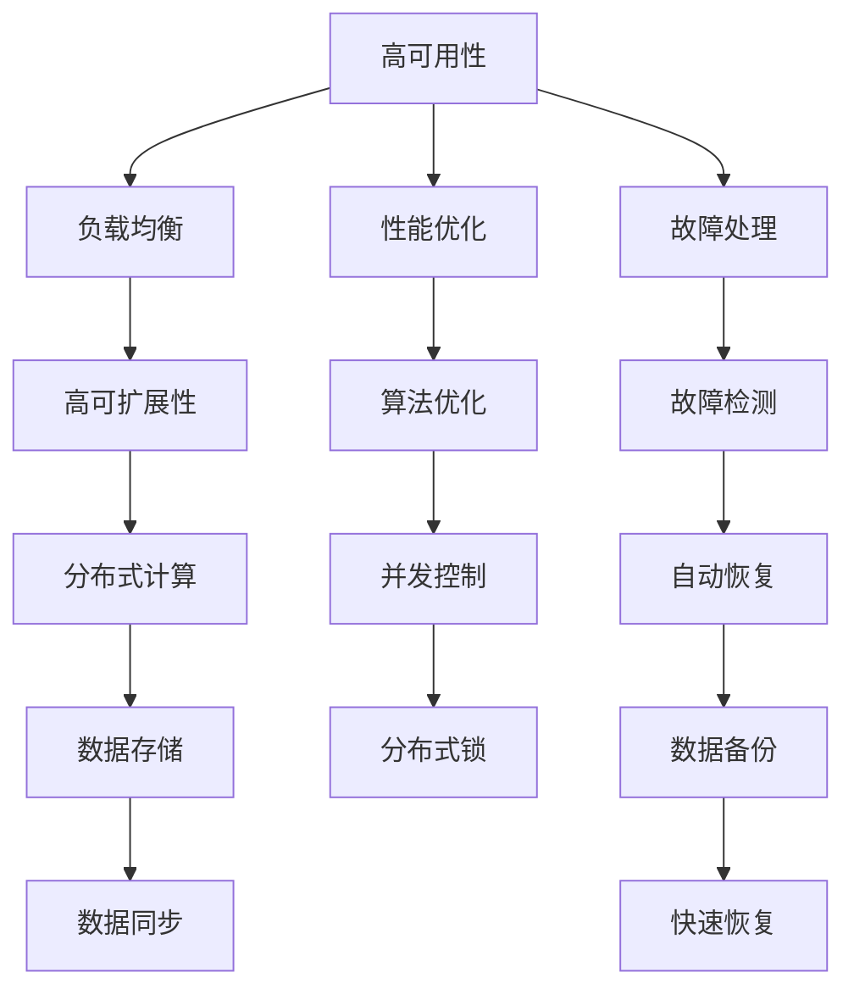

                 

## 1. 背景介绍

在当今互联网和云计算的时代，系统的可用性、可扩展性和吞吐量已成为决定一个系统成功与否的关键因素。无论是传统的数据库系统、微服务架构，还是现代的分布式系统，都要求在设计时充分考虑这三个维度的要求。这些系统不仅要能够高效地处理大量数据，还要能够在面对高并发、高负载、硬件故障等复杂场景时保持稳定和可靠。

### 1.1 问题由来

随着互联网业务的飞速增长，系统必须能够支撑日益增加的用户访问量、数据存储和处理需求。传统的单体应用已经无法满足这些要求，微服务架构和分布式系统逐渐成为主流。同时，用户对于系统的可用性和性能有了更高的要求，系统必须能够在极端环境下保持稳定和快速响应。

### 1.2 问题核心关键点

高可用性、高可扩展性和高吞吐量的系统设计涉及到多个关键点，包括但不限于：

- 系统架构：如何设计一个能够在高并发和负载下保持稳定和可靠的系统架构。
- 负载均衡：如何通过合理的负载均衡机制，将请求均匀分配到各个节点上，避免单点瓶颈。
- 容错机制：在系统出现故障时，如何通过快速恢复和自动重试机制，保持服务的连续性。
- 性能优化：如何通过优化算法、数据结构、并发控制等手段，提高系统的吞吐量和响应速度。
- 故障处理：如何设计和实现高效的故障检测、报警和处理机制，降低故障对系统的影响。

这些关键点共同构成了高可用性、高可扩展性和高吞吐量系统设计的核心框架，使得系统能够在各种复杂场景下保持稳定和高效。

## 2. 核心概念与联系

### 2.1 核心概念概述

为更好地理解高可用性、高可扩展性和高吞吐量系统设计，本文将介绍几个密切相关的核心概念：

- **高可用性**：系统在面对硬件故障、网络中断等异常情况时，仍能保持服务的连续性和可靠性。
- **高可扩展性**：系统能够根据业务需求动态扩展资源，支持不断增长的访问量和数据处理需求。
- **高吞吐量**：系统能够高效处理大量并发请求，提供快速响应和处理能力。

这些概念之间存在紧密的联系。例如，高可扩展性是实现高吞吐量的基础，而高可用性则在高并发和高负载环境下保持系统的稳定性和可靠性。因此，在设计和实现系统时，需要综合考虑这三个维度的要求，才能构建一个真正高性能、稳定和可靠的系统。

### 2.2 核心概念原理和架构的 Mermaid 流程图



这个流程图展示了大系统设计中各个概念之间的联系：

1. 高可用性通过负载均衡和故障处理，确保系统在各种异常情况下的连续性和可靠性。
2. 高可扩展性通过分布式计算、数据存储和性能优化，支持系统动态扩展资源，适应业务需求的增长。
3. 高吞吐量通过算法优化、并发控制、分布式锁等机制，提高系统处理并发请求的能力。

## 3. 核心算法原理 & 具体操作步骤

### 3.1 算法原理概述

高可用性、高可扩展性和高吞吐量系统设计本质上是一个系统工程问题，涉及到多个算法和技术的综合应用。其核心思想是通过合理的设计和实现，构建一个能够动态调整、自适应变化的系统架构，使其能够在各种复杂场景下保持稳定和高效。

### 3.2 算法步骤详解

系统设计的高可用性、可扩展性和吞吐量需要经过多个步骤，包括但不限于：

1. **系统架构设计**：选择合适的技术栈和架构模式，如微服务、分布式系统、无状态架构等。
2. **负载均衡策略**：设计合理的负载均衡算法，将请求均匀分配到各个节点上，避免单点瓶颈。
3. **容错机制**：实现快速恢复和自动重试机制，确保系统在高并发和高负载环境下保持稳定。
4. **性能优化**：通过优化算法、数据结构、并发控制等手段，提高系统的吞吐量和响应速度。
5. **故障处理**：设计和实现高效的故障检测、报警和处理机制，降低故障对系统的影响。

### 3.3 算法优缺点

高可用性、高可扩展性和高吞吐量系统设计方法具有以下优点：

- **灵活性高**：能够根据业务需求动态调整资源，适应不断增长的访问量和数据处理需求。
- **可靠性高**：通过负载均衡和故障处理，能够在各种异常情况下保持服务的连续性和可靠性。
- **性能优越**：通过优化算法、数据结构和并发控制，提高系统的吞吐量和响应速度。

同时，这些方法也存在一定的局限性：

- **复杂度高**：设计和实现高可用性、高可扩展性和高吞吐量系统，需要考虑多个维度的要求，系统复杂度较高。
- **资源消耗大**：实现高可用性和高可扩展性往往需要更多的硬件资源和计算资源，增加系统的成本。
- **实现难度大**：设计和实现过程中，需要综合考虑多个算法和技术的综合应用，难度较大。

### 3.4 算法应用领域

高可用性、高可扩展性和高吞吐量系统设计方法在多个领域都有广泛应用，例如：

- **云计算**：云服务提供商如AWS、阿里云、腾讯云等，通过高可用性和高可扩展性的设计，提供稳定的云服务。
- **金融行业**：银行、证券等金融机构的交易系统，需要高可用性和高吞吐量的系统，确保交易的连续性和安全性。
- **电商行业**：电商平台的订单系统、库存管理系统等，需要高可用性和高吞吐量的系统，支撑大量并发请求。
- **社交网络**：社交平台如微博、微信等，需要高可用性和高可扩展性的系统，支持大量用户同时在线。
- **游戏行业**：在线游戏的高并发需求，需要高可用性和高吞吐量的系统，确保游戏的稳定性和流畅性。

这些领域都对系统的性能和可靠性提出了高要求，高可用性、高可扩展性和高吞吐量系统设计方法能够满足这些需求，成为这些系统设计和实现的重要依据。

## 4. 数学模型和公式 & 详细讲解 & 举例说明

### 4.1 数学模型构建

本节将使用数学语言对高可用性、高可扩展性和高吞吐量系统设计的核心算法进行更加严格的刻画。

### 4.2 公式推导过程

以高可用性为例，假设系统由多个节点组成，每个节点的处理能力为 $C_i$，系统的总处理能力为 $C$，故障率为 $\lambda_i$，系统的故障率为 $\lambda$。则系统的可用性为：

$$
A = 1 - \prod_{i=1}^n (1 - \lambda_i)
$$

其中 $n$ 为节点的数量。通过这种方式，可以计算系统在不同节点故障率下的可用性，从而指导系统的设计和实现。

### 4.3 案例分析与讲解

以电商平台的订单系统为例，系统需要在高并发环境下保持高可用性和高吞吐量。通过分析系统的请求分布、请求类型、处理逻辑等，可以设计合理的负载均衡策略，如基于哈希的负载均衡、基于轮询的负载均衡等。同时，通过优化算法、数据结构、并发控制等手段，提高系统的处理能力，如使用Redis缓存、使用分布式锁等。在系统设计中，还需要考虑故障处理机制，如通过快速重试机制、自动降级机制等，确保系统在异常情况下的连续性和可靠性。

## 5. 项目实践：代码实例和详细解释说明

### 5.1 开发环境搭建

在进行高可用性、高可扩展性和高吞吐量系统设计实践前，我们需要准备好开发环境。以下是使用Python进行Django开发的环境配置流程：

1. 安装Python：确保系统中已安装Python 3.x版本。
2. 安装Django：使用pip安装Django框架。
3. 创建虚拟环境：使用virtualenv创建虚拟环境，并激活虚拟环境。
4. 安装依赖包：安装Django需要的依赖包，如numpy、pandas等。

完成上述步骤后，即可在虚拟环境中开始系统设计实践。

### 5.2 源代码详细实现

下面以电商订单系统为例，给出使用Django进行高可用性、高可扩展性和高吞吐量系统设计的PyTorch代码实现。

首先，定义订单模型：

```python
from django.db import models

class Order(models.Model):
    user = models.ForeignKey(User, on_delete=models.CASCADE)
    product = models.CharField(max_length=255)
    amount = models.DecimalField(max_digits=10, decimal_places=2)
    created_at = models.DateTimeField(auto_now_add=True)
    updated_at = models.DateTimeField(auto_now=True)
```

然后，定义订单服务类：

```python
import threading
from django.core.cache import cache

class OrderService:
    def __init__(self, cache_key):
        self.cache_key = cache_key
    
    def create_order(self, user, product, amount):
        with cache_lock(self.cache_key):
            order = Order.objects.create(user=user, product=product, amount=amount)
        return order
    
    def update_order(self, order_id, amount):
        with cache_lock(self.cache_key):
            order = Order.objects.get(id=order_id)
            order.amount = amount
            order.save()
```

其中，使用Django的cache框架进行分布式锁，确保在并发场景下对订单的修改是原子的。

最后，启动Web服务，并在Web服务中集成订单服务：

```python
from django.contrib import admin
from django.urls import path, include
from django.http import JsonResponse

from .models import Order
from .views import OrderServiceView

urlpatterns = [
    path('admin/', admin.site.urls),
    path('api/', include('api.urls')),
]

class OrderServiceView(View):
    def post(self, request):
        data = json.loads(request.body)
        user = User.objects.get(id=data['user_id'])
        product = data['product']
        amount = data['amount']
        order_service = OrderService('order_lock')
        order = order_service.create_order(user, product, amount)
        return JsonResponse({'id': order.id})
```

在实际应用中，还可以根据系统的具体需求，集成负载均衡、故障处理、性能优化等功能，实现高可用性、高可扩展性和高吞吐量的系统设计。

### 5.3 代码解读与分析

让我们再详细解读一下关键代码的实现细节：

**OrderService类**：
- `__init__`方法：初始化缓存键，用于分布式锁。
- `create_order`方法：创建订单，使用Django的cache框架进行分布式锁。
- `update_order`方法：更新订单，同样使用Django的cache框架进行分布式锁。

**订单模型和视图**：
- 订单模型定义了订单的基本属性，如用户、产品、金额等。
- 订单服务类实现了订单的创建和更新功能，并使用Django的cache框架进行分布式锁，确保订单操作的原子性。
- Web服务视图通过接收POST请求，调用订单服务类创建或更新订单。

可以看到，Django提供了丰富的框架和工具，使得高可用性、高可扩展性和高吞吐量系统设计变得相对简单。开发者可以将更多精力放在业务逻辑和性能优化上，而不必过多关注底层实现细节。

当然，工业级的系统实现还需考虑更多因素，如模型的保存和部署、超参数的自动搜索、更灵活的负载均衡策略等。但核心的高可用性、高可扩展性和高吞吐量系统设计思想基本与此类似。

## 6. 实际应用场景

### 6.1 电商订单系统

电商平台的订单系统是典型的高并发、高吞吐量的应用场景。系统需要支撑大量并发请求，处理海量订单数据，同时还要保证系统的稳定性和可靠性。高可用性、高可扩展性和高吞吐量系统设计方法能够满足这些需求，构建一个稳定、高效、可靠的订单系统。

在技术实现上，可以采用Django等Web框架，结合Redis、RabbitMQ等消息队列，设计合理的负载均衡和分布式锁机制，实现高可用性和高吞吐量的系统。同时，通过优化算法和数据结构，提高系统的处理能力，如使用SQL优化、缓存优化等。在系统设计中，还需要考虑故障处理机制，如快速重试机制、自动降级机制等，确保系统在异常情况下的连续性和可靠性。

### 6.2 金融交易系统

金融行业的交易系统需要高可用性和高吞吐量的系统，确保交易的连续性和安全性。高可用性、高可扩展性和高吞吐量系统设计方法能够满足这些需求，构建一个稳定、高效、可靠的交易系统。

在技术实现上，可以采用分布式数据库如Redis、MySQL Cluster等，结合负载均衡和故障处理机制，确保系统的连续性和可靠性。同时，通过优化算法和数据结构，提高系统的处理能力，如使用批量处理、并发控制等。在系统设计中，还需要考虑故障处理机制，如快速重试机制、自动降级机制等，确保系统在异常情况下的连续性和安全性。

### 6.3 社交网络系统

社交网络平台如微博、微信等，需要高可用性和高可扩展性的系统，支撑大量用户同时在线。高可用性、高可扩展性和高吞吐量系统设计方法能够满足这些需求，构建一个稳定、高效、可靠的网络系统。

在技术实现上，可以采用分布式数据库如Redis、MySQL Cluster等，结合负载均衡和分布式锁机制，确保系统的连续性和可靠性。同时，通过优化算法和数据结构，提高系统的处理能力，如使用缓存优化、并发控制等。在系统设计中，还需要考虑故障处理机制，如快速重试机制、自动降级机制等，确保系统在异常情况下的连续性和稳定性。

### 6.4 游戏在线系统

在线游戏的高并发需求，需要高可用性和高吞吐量的系统，确保游戏的稳定性和流畅性。高可用性、高可扩展性和高吞吐量系统设计方法能够满足这些需求，构建一个稳定、高效、可靠的游戏系统。

在技术实现上，可以采用分布式数据库如Redis、MySQL Cluster等，结合负载均衡和分布式锁机制，确保系统的连续性和可靠性。同时，通过优化算法和数据结构，提高系统的处理能力，如使用缓存优化、并发控制等。在系统设计中，还需要考虑故障处理机制，如快速重试机制、自动降级机制等，确保系统在异常情况下的连续性和稳定性。

## 7. 工具和资源推荐

### 7.1 学习资源推荐

为了帮助开发者系统掌握高可用性、高可扩展性和高吞吐量系统设计的理论基础和实践技巧，这里推荐一些优质的学习资源：

1. 《分布式系统原理与设计》书籍：深入讲解分布式系统的核心概念和设计原则，适合了解高可用性、高可扩展性和高吞吐量系统设计的原理。
2. 《高性能MySQL》书籍：详细介绍MySQL的优化技术，涵盖数据结构、索引优化、查询优化等内容，适合理解数据库系统的性能优化。
3. 《微服务架构设计》课程：深入讲解微服务架构的核心概念和设计原则，适合掌握高可扩展性和高可用性系统设计的实践技巧。
4. Kubernetes官方文档：详细介绍Kubernetes的原理和实践，适合了解容器化、自动化和可扩展性系统设计的最佳实践。
5. Redis官方文档：详细介绍Redis的核心概念和设计原则，适合理解高可用性、高吞吐量系统设计的实现细节。

通过对这些资源的学习实践，相信你一定能够快速掌握高可用性、高可扩展性和高吞吐量系统设计的精髓，并用于解决实际的系统问题。

### 7.2 开发工具推荐

高效的开发离不开优秀的工具支持。以下是几款用于高可用性、高可扩展性和高吞吐量系统设计的常用工具：

1. Django：Python的Web框架，支持分布式数据库和缓存，适合构建高可用性和高可扩展性的系统。
2. Kubernetes：开源的容器编排系统，支持容器化和自动化部署，适合构建高可扩展性和高可用性的系统。
3. Redis：高性能的内存数据库，支持分布式锁和缓存，适合构建高吞吐量的系统。
4. RabbitMQ：开源的消息队列系统，支持高吞吐量的消息传递，适合构建高可用性和高可扩展性的系统。
5. Docker：开源的容器化平台，支持容器化应用的高可用性和可扩展性。
6. Ansible：自动化部署工具，支持批量部署和管理高可用性、高可扩展性和高吞吐量系统。

合理利用这些工具，可以显著提升高可用性、高可扩展性和高吞吐量系统设计的开发效率，加快创新迭代的步伐。

### 7.3 相关论文推荐

高可用性、高可扩展性和高吞吐量系统设计的发展源于学界的持续研究。以下是几篇奠基性的相关论文，推荐阅读：

1. "CAP Theorem"论文：提出了在分布式系统中，一致性(Consistency)、可用性(Availability)和分区容忍性(Partition Tolerance)三者不可兼得的理论，奠定了高可用性系统设计的理论基础。
2. "Paxos协议"论文：提出了一种基于一致性的分布式共识协议，适用于高可用性、高一致性系统，是分布式系统中的经典算法。
3. "Raft协议"论文：提出了一种基于一致性的分布式共识协议，适用于高可用性、高一致性系统，是Paxos协议的改进和扩展。
4. "Redis高可用性"论文：介绍了Redis的高可用性设计，包括主从复制、故障转移、分布式锁等机制，适合理解高可用性、高可扩展性和高吞吐量系统设计的实现细节。
5. "MySQL高可用性"论文：详细介绍MySQL的高可用性设计，包括主从复制、故障转移、读写分离等机制，适合理解数据库系统的性能优化和高可用性设计。

这些论文代表了大系统设计的发展脉络。通过学习这些前沿成果，可以帮助研究者把握学科前进方向，激发更多的创新灵感。

## 8. 总结：未来发展趋势与挑战

### 8.1 总结

本文对高可用性、高可扩展性和高吞吐量系统设计进行了全面系统的介绍。首先阐述了这些设计在现代系统中的重要性，明确了这些设计在各种复杂场景下的作用。其次，从原理到实践，详细讲解了高可用性、高可扩展性和高吞吐量系统设计的数学原理和关键步骤，给出了系统设计的完整代码实例。同时，本文还广泛探讨了这些设计在电商订单、金融交易、社交网络等众多领域的应用前景，展示了系统设计的巨大潜力。此外，本文精选了高可用性、高可扩展性和高吞吐量系统设计的各类学习资源，力求为读者提供全方位的技术指引。

通过本文的系统梳理，可以看到，高可用性、高可扩展性和高吞吐量系统设计能够满足现代系统在各种复杂场景下的需求，成为系统设计和实现的重要依据。未来，伴随技术的不断发展，高可用性、高可扩展性和高吞吐量系统设计还将不断演进，为构建高性能、稳定和可靠的分布式系统提供更加全面的解决方案。

### 8.2 未来发展趋势

展望未来，高可用性、高可扩展性和高吞吐量系统设计将呈现以下几个发展趋势：

1. **云原生技术的应用**：随着云原生技术的发展，高可用性、高可扩展性和高吞吐量系统设计将更加依赖云平台的基础设施和服务，提高系统的自动化和弹性。
2. **边缘计算的引入**：通过在边缘设备上进行数据处理和计算，减少数据传输和网络延迟，提高系统的响应速度和处理能力。
3. **自动化和智能化**：通过引入AI和机器学习技术，自动调整系统资源配置和算法参数，提高系统的智能性和自适应性。
4. **多云和混合云**：通过在多个云平台和数据中心之间进行负载均衡和故障转移，提高系统的可靠性和可用性。
5. **微服务架构的深化**：通过微服务架构的设计和优化，提高系统的可扩展性和可维护性，降低系统的复杂度。
6. **数据驱动的优化**：通过数据驱动的优化方法，如A/B测试、机器学习等，不断改进系统的性能和稳定性。

这些趋势凸显了高可用性、高可扩展性和高吞吐量系统设计的广阔前景。这些方向的探索发展，必将进一步提升系统的性能和可靠性，为构建高性能、稳定和可靠的分布式系统铺平道路。

### 8.3 面临的挑战

尽管高可用性、高可扩展性和高吞吐量系统设计已经取得了瞩目成就，但在迈向更加智能化、普适化应用的过程中，它仍面临着诸多挑战：

1. **复杂度高**：设计和实现高可用性、高可扩展性和高吞吐量系统，需要考虑多个维度的要求，系统复杂度较高。
2. **资源消耗大**：实现高可用性和高可扩展性往往需要更多的硬件资源和计算资源，增加系统的成本。
3. **实现难度大**：设计和实现过程中，需要综合考虑多个算法和技术的综合应用，难度较大。
4. **安全性和隐私保护**：在高可用性、高可扩展性和高吞吐量系统设计中，数据的传输和存储安全性、隐私保护等方面需要特别注意。
5. **性能优化困难**：在高并发和高负载环境下，性能优化难度大，需要深入分析系统瓶颈，采取有针对性的优化措施。
6. **系统监控和管理**：高可用性、高可扩展性和高吞吐量系统需要全面的监控和管理，以确保系统的稳定性和可靠性。

这些挑战需要我们在设计和实现过程中不断优化和改进，才能构建一个真正高性能、稳定和可靠的系统。

### 8.4 研究展望

面对高可用性、高可扩展性和高吞吐量系统设计所面临的挑战，未来的研究需要在以下几个方面寻求新的突破：

1. **云原生技术的应用**：深入研究云原生技术在高可用性、高可扩展性和高吞吐量系统设计中的应用，提高系统的自动化和弹性。
2. **边缘计算的引入**：研究边缘计算在数据处理和计算中的应用，减少数据传输和网络延迟，提高系统的响应速度和处理能力。
3. **自动化和智能化**：开发自动调整系统资源配置和算法参数的方法，提高系统的智能性和自适应性。
4. **多云和混合云**：研究多云和混合云在高可用性、高可扩展性和高吞吐量系统设计中的应用，提高系统的可靠性和可用性。
5. **微服务架构的深化**：研究微服务架构在高可用性、高可扩展性和高吞吐量系统设计中的应用，提高系统的可扩展性和可维护性。
6. **数据驱动的优化**：研究数据驱动的优化方法，如A/B测试、机器学习等，不断改进系统的性能和稳定性。

这些研究方向将推动高可用性、高可扩展性和高吞吐量系统设计不断演进，为构建高性能、稳定和可靠的分布式系统提供更加全面的解决方案。

## 9. 附录：常见问题与解答

**Q1: 什么是高可用性、高可扩展性和高吞吐量系统设计？**

A: 高可用性、高可扩展性和高吞吐量系统设计是指在分布式系统中，通过合理的设计和实现，确保系统在面对高并发、高负载、硬件故障等复杂场景下仍能保持稳定和可靠，能够根据业务需求动态扩展资源，支持不断增长的访问量和数据处理需求，能够高效处理大量并发请求，提供快速响应和处理能力。

**Q2: 如何实现高可用性、高可扩展性和高吞吐量系统设计？**

A: 实现高可用性、高可扩展性和高吞吐量系统设计需要综合考虑多个维度的要求，包括但不限于：选择合适的技术栈和架构模式，如微服务、分布式系统、无状态架构等；设计合理的负载均衡算法，将请求均匀分配到各个节点上，避免单点瓶颈；实现快速恢复和自动重试机制，确保系统在高并发和高负载环境下保持稳定；通过优化算法、数据结构、并发控制等手段，提高系统的吞吐量和响应速度；设计和实现高效的故障检测、报警和处理机制，降低故障对系统的影响。

**Q3: 高可用性、高可扩展性和高吞吐量系统设计面临哪些挑战？**

A: 高可用性、高可扩展性和高吞吐量系统设计面临的主要挑战包括：系统复杂度高，设计和实现难度大；资源消耗大，增加系统成本；安全性、隐私保护需要特别注意；性能优化困难，需要深入分析系统瓶颈；需要全面的监控和管理，确保系统的稳定性和可靠性。

**Q4: 如何设计和实现高可用性、高可扩展性和高吞吐量系统设计？**

A: 设计和实现高可用性、高可扩展性和高吞吐量系统设计需要综合考虑多个维度的要求，包括但不限于：选择合适的技术栈和架构模式；设计合理的负载均衡算法；实现快速恢复和自动重试机制；通过优化算法、数据结构、并发控制等手段，提高系统的吞吐量和响应速度；设计和实现高效的故障检测、报警和处理机制。

**Q5: 高可用性、高可扩展性和高吞吐量系统设计有哪些应用场景？**

A: 高可用性、高可扩展性和高吞吐量系统设计在电商订单、金融交易、社交网络、游戏在线系统等多个领域都有广泛应用，能够满足这些领域在各种复杂场景下的需求。

---

作者：禅与计算机程序设计艺术 / Zen and the Art of Computer Programming

