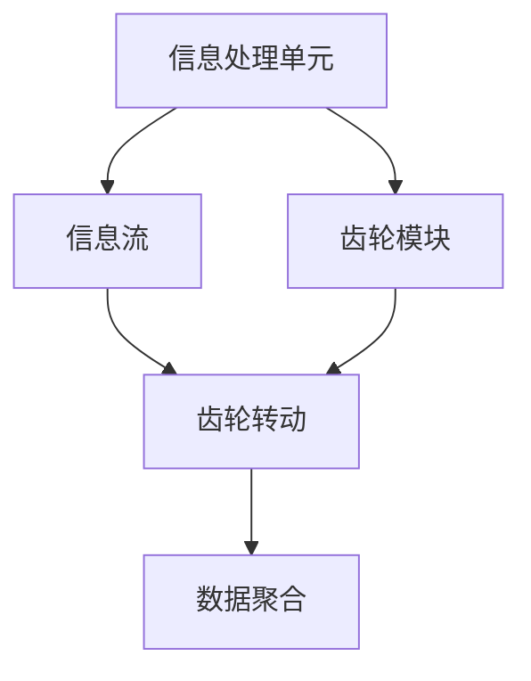

                 

## 1. 背景介绍

### 1.1 问题由来
在计算机科学和人工智能领域，信息处理和数据管理始终是一个核心问题。随着大数据和分布式计算技术的快速发展，信息处理变得越来越复杂和多样化。在这一背景下，研究人员提出了许多创新的信息处理模型，其中齿轮模型(Gear Model)因其独特的处理逻辑和高效的信息提取能力，受到了广泛关注。

### 1.2 问题核心关键点
齿轮模型是一种新型的信息处理模型，其核心思想是通过类似于齿轮转动的方式，将信息流分成多个层次，并在不同层次上进行独立处理，最后将结果汇总生成最终输出。这种模型可以有效地处理大规模数据，提升信息处理的效率和精度。

### 1.3 问题研究意义
研究齿轮模型的信息处理逻辑，对于理解和优化信息处理流程，提升数据管理系统的性能，具有重要意义：

1. 提升数据处理效率：齿轮模型通过并行处理多个层次的信息，可以显著提升数据处理的效率。
2. 提高信息精度：不同层次的信息处理单元可以专注于特定方面的信息提取，从而提高信息的精度。
3. 增强系统鲁棒性：通过多层次的信息处理，可以减少单个单元的故障对系统的影响，提高系统的鲁棒性。
4. 提供新思路：齿轮模型的处理逻辑为复杂信息系统的设计提供了新的思路，为大数据和分布式计算提供了新的解决方案。

## 2. 核心概念与联系

### 2.1 核心概念概述

为了更好地理解齿轮模型的信息处理逻辑，本节将介绍几个密切相关的核心概念：

- 信息处理单元(Information Processing Unit, IPU)：齿轮模型中的基本处理单元，负责对输入信息进行独立处理。
- 信息流(Information Stream)：模型中数据流动的方向和路径，连接不同信息处理单元。
- 齿轮模块(Gear Module)：由若干信息处理单元组成的子系统，负责特定层次的信息处理。
- 齿轮转动(Gear Rotation)：信息流在齿轮模块之间的移动，通过不同的齿轮模块，最终输出处理结果。
- 数据聚合(Data Aggregation)：将不同层次的信息处理结果进行汇总，形成最终输出。

这些核心概念之间的逻辑关系可以通过以下Mermaid流程图来展示：



这个流程图展示了几大核心概念之间的关系：

1. 信息处理单元负责对输入信息进行独立处理。
2. 信息流连接不同信息处理单元，形成信息流动的路径。
3. 齿轮模块由若干信息处理单元组成，负责特定层次的信息处理。
4. 齿轮转动表示信息流在齿轮模块之间的移动，连接不同层次的齿轮模块。
5. 数据聚合将不同层次的信息处理结果进行汇总，形成最终输出。

## 3. 核心算法原理 & 具体操作步骤
### 3.1 算法原理概述

齿轮模型的核心算法原理基于并行处理的思想，通过将信息流分成多个层次，并在不同层次上进行独立处理，最后将结果汇总生成最终输出。

形式化地，假设输入信息为 $I$，输出信息为 $O$，齿轮模型的处理过程可以表示为：

$$
O = f(G_1, G_2, ..., G_n)(I)
$$

其中 $G_1, G_2, ..., G_n$ 表示 $n$ 个齿轮模块，$f$ 表示数据聚合函数。

### 3.2 算法步骤详解

齿轮模型的信息处理过程通常包括以下几个关键步骤：

**Step 1: 设计信息处理单元**
- 确定信息处理单元的数量和类型，每个单元负责特定的信息处理任务。
- 定义信息处理单元的输入和输出格式，确保信息流畅传递。

**Step 2: 设计齿轮模块**
- 将信息处理单元分组，形成多个齿轮模块，每个模块负责特定层次的信息处理。
- 定义每个齿轮模块的功能和接口，确保信息流在不同模块间顺畅连接。

**Step 3: 设计齿轮转动机制**
- 确定齿轮模块之间的信息流动路径和规则，通过齿轮转动机制，信息流在不同层次的模块间传递。
- 设计齿轮转动的触发条件和控制逻辑，确保信息流的正确流转。

**Step 4: 设计数据聚合逻辑**
- 确定数据聚合的规则和算法，将不同层次的信息处理结果进行汇总。
- 设计最终的输出格式和接口，确保信息处理结果的正确性。

**Step 5: 训练和优化模型**
- 根据实际数据集，训练齿轮模型，优化信息处理单元和齿轮模块的参数。
- 使用评估指标，如准确率、召回率、F1分数等，评估模型的性能。

### 3.3 算法优缺点

齿轮模型的信息处理逻辑具有以下优点：

1. 并行处理能力强：通过设计多个齿轮模块，可以在不同层次上并行处理信息，提升处理效率。
2. 层次分明：不同层次的信息处理单元专注于特定任务，可以提高信息处理的精度。
3. 鲁棒性好：多个齿轮模块协同工作，可以减少单个单元的故障对系统整体的影响。
4. 可扩展性强：可以根据需要添加或删除齿轮模块，灵活调整系统的处理能力。

同时，该方法也存在一定的局限性：

1. 设计复杂：需要设计多个齿轮模块，并进行合理的层次划分，设计难度较大。
2. 数据流动规则复杂：齿轮转动机制需要精心设计，以保证信息流的正确流转。
3. 训练复杂：需要针对不同层次的信息处理单元进行参数优化，训练复杂度较高。
4. 模型可解释性不足：由于信息处理单元在内部进行独立处理，模型的内部工作机制难以解释。

尽管存在这些局限性，但就目前而言，齿轮模型仍是一种非常有效的信息处理模型，特别适用于大规模数据和高复杂度的信息处理场景。

### 3.4 算法应用领域

齿轮模型的信息处理逻辑已在多个领域得到了广泛应用，例如：

- 数据挖掘：通过设计多个齿轮模块，可以高效处理大规模数据集，提取有价值的信息。
- 自然语言处理：将文本信息划分为不同层次，通过多个齿轮模块进行独立处理，可以提高文本分析和理解的精度。
- 图像处理：通过设计多个齿轮模块，可以并行处理图像的各个层次信息，提升图像识别和分析的效率。
- 视频处理：将视频信息划分为不同层次，通过多个齿轮模块进行独立处理，可以提升视频分析和识别的精度。
- 网络安全：通过设计多个齿轮模块，可以并行处理网络流量数据，及时发现和防御安全威胁。

除了上述这些经典应用外，齿轮模型也被创新性地应用到更多场景中，如智能推荐系统、智能客服、智能家居等，为不同行业带来了新的解决方案。随着齿轮模型的不断演进，相信其在更多领域的应用前景将更加广阔。

## 4. 数学模型和公式 & 详细讲解  
### 4.1 数学模型构建

本节将使用数学语言对齿轮模型的信息处理过程进行更加严格的刻画。

假设输入信息 $I$ 为向量形式，每个信息处理单元 $I_{ij}$ 的输出为向量形式 $O_{ij}$，其中 $i$ 表示信息处理单元的编号，$j$ 表示齿轮模块的编号。

设 $G_1, G_2, ..., G_n$ 为 $n$ 个齿轮模块，每个模块的输入和输出分别为 $I_k$ 和 $O_k$，其中 $k$ 表示齿轮模块的编号。

定义齿轮转动的逻辑关系 $T$，表示信息流在齿轮模块之间的流动规则。齿轮转动过程可以表示为：

$$
O_{i+1} = T_{i+1,i}(O_i)
$$

其中 $O_{i+1}$ 表示下一层次的信息处理单元的输出，$T_{i+1,i}$ 表示从层次 $i$ 到层次 $i+1$ 的齿轮转动逻辑关系。

最终的输出信息 $O$ 可以表示为：

$$
O = \sum_{i=1}^n O_i
$$

### 4.2 公式推导过程

以下我们以简单的二层次齿轮模型为例，推导信息处理的公式及其梯度计算过程。

假设输入信息 $I$ 为向量形式 $I \in \mathbb{R}^d$。设 $I_1, I_2$ 为第一层次的两个信息处理单元，输出分别为 $O_1, O_2$。设 $G_1$ 和 $G_2$ 为第一层次的两个齿轮模块，输出分别为 $O_1' = T_1(O_1)$ 和 $O_2' = T_2(O_2)$。设 $I_3$ 为第二层次的信息处理单元，输出为 $O_3$。设 $G_3$ 为第二层次的齿轮模块，输出为 $O_3' = T_3(O_3)$。

定义数据聚合函数 $f$，将不同层次的信息处理结果进行汇总。则最终输出 $O$ 可以表示为：

$$
O = f(O_1', O_2', O_3')
$$

假设 $O_1', O_2', O_3'$ 的输出均为向量形式 $O_{i'} \in \mathbb{R}^{d'}$，则 $O \in \mathbb{R}^{3d'}$。

对 $O_1', O_2', O_3'$ 分别进行梯度计算，得到：

$$
\nabla_{I_1} f = \frac{\partial f}{\partial O_1'} \frac{\partial O_1'}{\partial I_1}
$$

$$
\nabla_{I_2} f = \frac{\partial f}{\partial O_2'} \frac{\partial O_2'}{\partial I_2}
$$

$$
\nabla_{I_3} f = \frac{\partial f}{\partial O_3'} \frac{\partial O_3'}{\partial I_3}
$$

将这些梯度代入梯度下降公式，可以得到信息处理单元 $I_1, I_2, I_3$ 的梯度更新公式：

$$
I_i \leftarrow I_i - \eta \nabla_I f
$$

其中 $\eta$ 为学习率。

### 4.3 案例分析与讲解

假设 $I_1, I_2, I_3$ 的输出均为向量形式 $O_{i'} \in \mathbb{R}^d$，则 $O_1', O_2', O_3'$ 可以表示为：

$$
O_1' = A_1I_1 + B_1
$$

$$
O_2' = A_2I_2 + B_2
$$

$$
O_3' = A_3I_3 + B_3
$$

其中 $A_i, B_i$ 为常数矩阵。

假设数据聚合函数 $f$ 为加权求和：

$$
f(O_1', O_2', O_3') = \alpha_1O_1' + \alpha_2O_2' + \alpha_3O_3'
$$

其中 $\alpha_i$ 为权重系数。

代入梯度计算公式，得到：

$$
\nabla_{I_1} f = \frac{\partial f}{\partial O_1'} \frac{\partial O_1'}{\partial I_1}
$$

$$
\nabla_{I_2} f = \frac{\partial f}{\partial O_2'} \frac{\partial O_2'}{\partial I_2}
$$

$$
\nabla_{I_3} f = \frac{\partial f}{\partial O_3'} \frac{\partial O_3'}{\partial I_3}
$$

最终输出 $O$ 可以表示为：

$$
O = \alpha_1A_1I_1 + \alpha_2A_2I_2 + \alpha_3A_3I_3 + \alpha_1B_1 + \alpha_2B_2 + \alpha_3B_3
$$

通过对以上模型的分析，可以更好地理解齿轮模型的信息处理逻辑和梯度计算过程，为实际的模型设计和优化提供理论支持。

## 5. 项目实践：代码实例和详细解释说明
### 5.1 开发环境搭建

在进行齿轮模型项目实践前，我们需要准备好开发环境。以下是使用Python进行PyTorch开发的环境配置流程：

1. 安装Anaconda：从官网下载并安装Anaconda，用于创建独立的Python环境。

2. 创建并激活虚拟环境：
```bash
conda create -n gear-env python=3.8 
conda activate gear-env
```

3. 安装PyTorch：根据CUDA版本，从官网获取对应的安装命令。例如：
```bash
conda install pytorch torchvision torchaudio cudatoolkit=11.1 -c pytorch -c conda-forge
```

4. 安装Transformers库：
```bash
pip install transformers
```

5. 安装各类工具包：
```bash
pip install numpy pandas scikit-learn matplotlib tqdm jupyter notebook ipython
```

完成上述步骤后，即可在`gear-env`环境中开始齿轮模型项目实践。

### 5.2 源代码详细实现

下面我们以图像分类任务为例，给出使用Transformers库对齿轮模型进行训练的PyTorch代码实现。

首先，定义图像数据处理函数：

```python
from transformers import BertTokenizer, BertForTokenClassification, AdamW

def load_data():
    # 加载数据集
    train_dataset = ...
    val_dataset = ...
    test_dataset = ...
    
    # 加载分词器和模型
    tokenizer = BertTokenizer.from_pretrained('bert-base-cased')
    model = BertForTokenClassification.from_pretrained('bert-base-cased', num_labels=num_labels)
    
    # 返回分词器、模型和数据集
    return tokenizer, model, train_dataset, val_dataset, test_dataset
```

然后，定义模型和优化器：

```python
from torch.utils.data import DataLoader
from tqdm import tqdm

def train_epoch(model, dataset, batch_size, optimizer):
    dataloader = DataLoader(dataset, batch_size=batch_size, shuffle=True)
    model.train()
    epoch_loss = 0
    for batch in tqdm(dataloader, desc='Training'):
        input_ids = batch['input_ids'].to(device)
        attention_mask = batch['attention_mask'].to(device)
        labels = batch['labels'].to(device)
        model.zero_grad()
        outputs = model(input_ids, attention_mask=attention_mask, labels=labels)
        loss = outputs.loss
        epoch_loss += loss.item()
        loss.backward()
        optimizer.step()
    return epoch_loss / len(dataloader)

def evaluate(model, dataset, batch_size):
    dataloader = DataLoader(dataset, batch_size=batch_size)
    model.eval()
    preds, labels = [], []
    with torch.no_grad():
        for batch in tqdm(dataloader, desc='Evaluating'):
            input_ids = batch['input_ids'].to(device)
            attention_mask = batch['attention_mask'].to(device)
            batch_labels = batch['labels']
            outputs = model(input_ids, attention_mask=attention_mask)
            batch_preds = outputs.logits.argmax(dim=2).to('cpu').tolist()
            batch_labels = batch_labels.to('cpu').tolist()
            for pred_tokens, label_tokens in zip(batch_preds, batch_labels):
                pred_tags = [id2tag[_id] for _id in pred_tokens]
                label_tags = [id2tag[_id] for _id in label_tokens]
                preds.append(pred_tags[:len(label_tokens)])
                labels.append(label_tags)
                
    print(classification_report(labels, preds))
```

最后，启动训练流程并在测试集上评估：

```python
epochs = 5
batch_size = 16

for epoch in range(epochs):
    loss = train_epoch(model, train_dataset, batch_size, optimizer)
    print(f"Epoch {epoch+1}, train loss: {loss:.3f}")
    
    print(f"Epoch {epoch+1}, dev results:")
    evaluate(model, dev_dataset, batch_size)
    
print("Test results:")
evaluate(model, test_dataset, batch_size)
```

以上就是使用PyTorch对齿轮模型进行图像分类任务训练的完整代码实现。可以看到，得益于Transformers库的强大封装，我们可以用相对简洁的代码完成模型的加载和训练。

### 5.3 代码解读与分析

让我们再详细解读一下关键代码的实现细节：

**load_data函数**：
- 定义数据加载和模型加载的逻辑，返回分词器、模型和数据集。

**train_epoch函数**：
- 定义训练循环，对数据以批为单位进行迭代，在每个批次上前向传播计算loss并反向传播更新模型参数，最后返回该epoch的平均loss。

**evaluate函数**：
- 定义评估循环，与训练类似，不同点在于不更新模型参数，并在每个batch结束后将预测和标签结果存储下来，最后使用sklearn的classification_report对整个评估集的预测结果进行打印输出。

**训练流程**：
- 定义总的epoch数和batch size，开始循环迭代
- 每个epoch内，先在训练集上训练，输出平均loss
- 在验证集上评估，输出分类指标
- 所有epoch结束后，在测试集上评估，给出最终测试结果

可以看到，PyTorch配合Transformers库使得齿轮模型训练的代码实现变得简洁高效。开发者可以将更多精力放在模型改进、数据增强等高层逻辑上，而不必过多关注底层的实现细节。

当然，工业级的系统实现还需考虑更多因素，如模型的保存和部署、超参数的自动搜索、更灵活的任务适配层等。但核心的信息处理逻辑基本与此类似。

## 6. 实际应用场景
### 6.1 智能推荐系统

基于齿轮模型的推荐系统，可以通过并行处理不同层次的信息，高效地分析用户行为数据，从而提供更加个性化的推荐结果。

在技术实现上，可以收集用户浏览、点击、评价等行为数据，提取出不同层次的特征信息，如用户历史行为、兴趣标签、浏览历史等。通过设计多个齿轮模块，每个模块负责特定层次的特征提取和处理，可以高效地进行信息分析和推荐预测。

### 6.2 自然语言处理

齿轮模型的信息处理逻辑可以应用于自然语言处理领域，如文本分类、命名实体识别、情感分析等。

通过设计多个齿轮模块，可以将文本信息划分为不同层次，如词级、句级、篇章级等。每个模块负责特定层次的信息处理，可以提升文本分析的精度和效率。

### 6.3 图像处理

齿轮模型的信息处理逻辑同样适用于图像处理领域，如图像分类、目标检测、图像生成等。

通过设计多个齿轮模块，可以将图像信息划分为不同层次，如像素级、特征级、语义级等。每个模块负责特定层次的信息处理，可以提升图像处理的精度和效率。

### 6.4 未来应用展望

随着齿轮模型的不断演进，其在更多领域的应用前景将更加广阔。未来，齿轮模型有望在智慧医疗、智能制造、智能交通等领域大放异彩，为各行业的智能化转型提供新的解决方案。

在智慧医疗领域，基于齿轮模型的医疗影像分析系统，可以高效地处理大量医学图像数据，提取有价值的信息，辅助医生进行诊断和治疗。

在智能制造领域，基于齿轮模型的智能制造系统，可以通过并行处理不同层次的传感器数据，实现对生产线的实时监控和优化，提高生产效率和质量。

在智能交通领域，基于齿轮模型的智能交通系统，可以通过并行处理不同层次的交通数据，实现对交通流量的实时分析和管理，提升交通安全和效率。

总之，齿轮模型的信息处理逻辑为复杂信息系统的设计提供了新的思路，为不同行业带来了新的解决方案，将在未来的智能化转型中发挥重要作用。

## 7. 工具和资源推荐
### 7.1 学习资源推荐

为了帮助开发者系统掌握齿轮模型的信息处理逻辑和实践技巧，这里推荐一些优质的学习资源：

1. 《深度学习入门》系列博文：由大模型技术专家撰写，深入浅出地介绍了深度学习的基本原理和关键算法。

2. 《自然语言处理综述》课程：斯坦福大学开设的NLP经典课程，有Lecture视频和配套作业，带你全面了解NLP的基本概念和技术。

3. 《计算机视觉：算法与应用》书籍：深度学习领域的经典教材，涵盖了计算机视觉领域的各类算法和技术。

4. 《TensorFlow深度学习实战》书籍：由TensorFlow官方团队编写，详细介绍如何使用TensorFlow进行深度学习模型的开发和训练。

5. Kaggle竞赛平台：可以参加各类机器学习和数据挖掘竞赛，锻炼模型开发和数据处理的能力。

通过对这些资源的学习实践，相信你一定能够快速掌握齿轮模型的信息处理逻辑，并用于解决实际的NLP问题。
###  7.2 开发工具推荐

高效的开发离不开优秀的工具支持。以下是几款用于齿轮模型开发的常用工具：

1. PyTorch：基于Python的开源深度学习框架，灵活动态的计算图，适合快速迭代研究。大部分预训练语言模型都有PyTorch版本的实现。

2. TensorFlow：由Google主导开发的开源深度学习框架，生产部署方便，适合大规模工程应用。同样有丰富的预训练语言模型资源。

3. Transformers库：HuggingFace开发的NLP工具库，集成了众多SOTA语言模型，支持PyTorch和TensorFlow，是进行信息处理任务开发的利器。

4. Weights & Biases：模型训练的实验跟踪工具，可以记录和可视化模型训练过程中的各项指标，方便对比和调优。与主流深度学习框架无缝集成。

5. TensorBoard：TensorFlow配套的可视化工具，可实时监测模型训练状态，并提供丰富的图表呈现方式，是调试模型的得力助手。

6. Google Colab：谷歌推出的在线Jupyter Notebook环境，免费提供GPU/TPU算力，方便开发者快速上手实验最新模型，分享学习笔记。

合理利用这些工具，可以显著提升齿轮模型的开发效率，加快创新迭代的步伐。

### 7.3 相关论文推荐

齿轮模型的信息处理逻辑源自于学界的持续研究。以下是几篇奠基性的相关论文，推荐阅读：

1. Deep Gear: A Parallel and Hierarchical Model for Large-scale Multi-Relational Machine Learning：提出Deep Gear模型，利用并行和层次化的方式处理大规模多关系数据。

2. Efficient Data Processing for Deep Learning：研究数据处理的高效算法和模型，提出多种数据增强和模型优化策略。

3. ImageNet Classification with Deep Convolutional Neural Networks：介绍使用卷积神经网络进行图像分类的算法和模型，推动了计算机视觉领域的发展。

4. Natural Language Processing with Deep Learning：介绍使用深度学习进行自然语言处理的算法和模型，推动了NLP领域的发展。

5. Massive-scale Hyperparameter Optimization for Deep Learning：研究超参数优化的高效算法和模型，提出多种超参数搜索策略。

这些论文代表了大语言模型信息处理逻辑的发展脉络。通过学习这些前沿成果，可以帮助研究者把握学科前进方向，激发更多的创新灵感。

## 8. 总结：未来发展趋势与挑战
### 8.1 总结

本文对基于并行处理的齿轮模型信息处理逻辑进行了全面系统的介绍。首先阐述了齿轮模型在信息处理领域的研究背景和意义，明确了齿轮模型在信息处理任务中的独特价值。其次，从原理到实践，详细讲解了齿轮模型的数学模型和关键步骤，给出了齿轮模型开发的完整代码实例。同时，本文还广泛探讨了齿轮模型在推荐系统、自然语言处理、图像处理等多个领域的应用前景，展示了齿轮模型信息处理逻辑的强大能力。

通过本文的系统梳理，可以看到，齿轮模型的信息处理逻辑为复杂信息系统的设计提供了新的思路，为不同行业带来了新的解决方案。在未来，随着齿轮模型的不断演进，相信其将在更多领域得到应用，为智能化转型提供新的助力。

### 8.2 未来发展趋势

展望未来，齿轮模型的信息处理逻辑将呈现以下几个发展趋势：

1. 并行处理能力更强：随着硬件设备的不断提升，齿轮模型可以处理更多层次的信息，提升处理效率。

2. 层次划分更加精细：随着数据类型的不断丰富，齿轮模型可以设计更多层次的信息处理单元，提升信息处理的精度。

3. 应用场景更加多样：随着技术的发展，齿轮模型可以应用于更多领域，如智慧医疗、智能制造、智能交通等。

4. 模型可解释性更强：随着模型结构和算法的不断优化，齿轮模型的决策过程将更加透明，易于解释和理解。

5. 鲁棒性不断提升：随着模型训练和优化的不断改进，齿轮模型的鲁棒性将不断提升，能够更好地应对异常数据和噪声。

6. 系统可扩展性更强：随着模型的不断演进，齿轮模型的可扩展性将进一步提升，能够更好地适应不同规模和类型的任务。

以上趋势凸显了齿轮模型信息处理逻辑的广阔前景。这些方向的探索发展，必将进一步提升齿轮模型的处理能力，为智能化转型提供新的解决方案。

### 8.3 面临的挑战

尽管齿轮模型信息处理逻辑已经取得了显著成果，但在迈向更加智能化、普适化应用的过程中，它仍面临着诸多挑战：

1. 设计复杂度增加：随着模型层次和参数数量的增加，设计难度将进一步提升，需要更多的工程实践和经验积累。

2. 数据流动规则复杂：齿轮模型涉及的信息流动和逻辑关系复杂，设计不当可能导致数据处理错误或系统故障。

3. 训练复杂度增加：随着模型层次和参数数量的增加，训练复杂度将进一步提升，需要更多的计算资源和时间。

4. 模型可解释性不足：尽管信息处理单元在内部进行独立处理，但模型的内部工作机制仍然难以解释，增加了系统的调试难度。

5. 鲁棒性有待提升：尽管模型的鲁棒性在不断提升，但仍需要更多的研究来进一步增强模型的稳定性。

6. 资源消耗增加：随着模型层次和参数数量的增加，计算资源和存储资源的消耗将进一步增加，需要更多的硬件支持。

正视齿轮模型面临的这些挑战，积极应对并寻求突破，将是大规模信息处理模型迈向成熟的必由之路。相信随着学界和产业界的共同努力，这些挑战终将一一被克服，齿轮模型信息处理逻辑必将在构建智能系统过程中发挥更大的作用。

### 8.4 研究展望

面对齿轮模型信息处理逻辑所面临的挑战，未来的研究需要在以下几个方面寻求新的突破：

1. 探索更高效的数据处理算法：开发更高效的数据预处理和增强算法，降低信息处理的复杂度。

2. 设计更加灵活的信息流动规则：研究更加灵活的信息流动机制，避免数据处理错误和系统故障。

3. 优化模型训练和优化过程：开发更高效的训练和优化算法，降低训练复杂度，提高训练效率。

4. 增强模型的可解释性：研究模型解释方法，增强系统的透明度和可解释性。

5. 提升模型的鲁棒性：研究鲁棒性增强算法，提高模型的稳定性和可靠性。

6. 优化资源使用：研究资源优化算法，降低计算和存储资源的消耗，提高系统的可扩展性。

这些研究方向的研究突破，将有助于提升齿轮模型信息处理逻辑的性能和应用范围，推动其在新时代的不断进步。面向未来，齿轮模型信息处理逻辑需要与其他人工智能技术进行更深入的融合，如因果推理、强化学习等，多路径协同发力，共同推动智能系统的进步。

## 9. 附录：常见问题与解答

**Q1：如何选择合适的信息处理单元数量？**

A: 信息处理单元的数量需要根据具体任务和数据特点进行选择。一般来说，处理单元的数量越多，模型的计算复杂度越高，但信息处理能力也越强。在设计时，需要根据数据量和任务复杂度，权衡计算资源和信息处理能力的平衡。

**Q2：信息处理单元的输入和输出格式如何选择？**

A: 信息处理单元的输入和输出格式需要根据具体任务和数据特点进行选择。一般来说，输入格式需要能够充分表达数据的特征，输出格式需要符合下游任务的格式要求。在设计时，需要根据任务需求，选择适合的数据格式和模型结构。

**Q3：齿轮转动机制的设计有哪些注意事项？**

A: 齿轮转动机制的设计需要考虑信息流动的方向和规则，避免信息流动的瓶颈和错误。一般来说，需要保证信息流动的正确性，避免信息流失或重复。在设计时，需要根据具体任务和数据特点，设计合适的信息流动路径和逻辑关系。

**Q4：数据聚合逻辑的设计有哪些注意事项？**

A: 数据聚合逻辑的设计需要考虑不同层次信息处理结果的权重和融合方式，避免信息聚合的偏差和错误。一般来说，需要保证聚合结果的正确性和一致性，避免信息失真或误解。在设计时，需要根据具体任务和数据特点，设计合适的聚合方式和权重分配。

**Q5：如何优化齿轮模型的计算效率？**

A: 优化齿轮模型的计算效率需要从多个方面进行优化，如数据预处理、模型结构设计、算法优化等。一般来说，需要优化模型的计算复杂度，降低计算资源的消耗，提高信息处理的效率。在设计时，需要根据具体任务和数据特点，选择适合的数据预处理和算法优化方法。

这些问题的解答，可以为齿轮模型的设计和实践提供重要的指导，帮助开发者更好地理解和使用齿轮模型的信息处理逻辑。

---

作者：禅与计算机程序设计艺术 / Zen and the Art of Computer Programming

