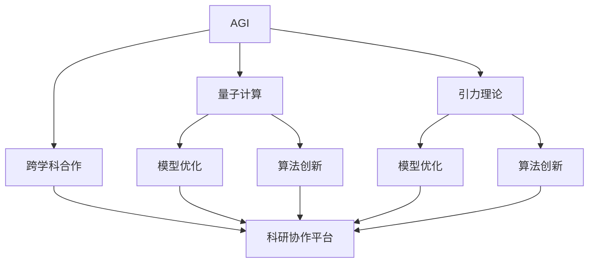

                 

# AGI与量子引力的跨学科合作

> 关键词：通用人工智能(AGI)，量子计算，引力理论，跨学科合作，模型优化，算法创新，科研协作平台

## 1. 背景介绍

### 1.1 问题由来

通用人工智能（AGI）的探索一直是科学界的核心议题之一。AGI的目标是构建一种能够处理复杂问题、具备自主学习能力和高度智能的机器。然而，目前的人工智能系统仍然局限于特定领域，缺乏在广泛场景中的通用能力。为了实现这一目标，科学家们正在尝试从多个学科中汲取灵感，跨学科合作成为了一种新的探索方向。

在众多跨学科合作中，量子计算与引力理论的结合尤其引人注目。一方面，量子计算通过量子比特（qubit）和量子纠缠等特性，具有强大的计算能力，可以高效解决复杂的问题，如分子动力学模拟、优化算法等；另一方面，引力理论作为现代物理学的基石，提供了对物质世界深入理解的框架，尤其是黑洞物理、广义相对论等领域。将这两者结合，可以推动AGI的研究，使其具备更加深刻的物理理解和计算能力。

### 1.2 问题核心关键点

跨学科合作面临的核心问题是如何在不同的学科之间找到共通点，并利用这些共通点进行协同研究。对于AGI与量子引力的合作，主要需要解决以下几个关键问题：

1. **理论基础**：如何将引力理论的量子化解释应用于AGI的构建，如如何利用黑洞信息悖论、量子纠缠等理论，提升AGI的系统复杂度和智能性。
2. **计算平台**：如何搭建一个兼容量子计算和引力理论研究的计算平台，实现数据共享、模型优化和算法创新。
3. **跨学科团队**：如何组织由物理学家、计算机科学家、数学家等多学科专家组成的研究团队，促进交流与合作。
4. **应用场景**：如何确定AGI与量子引力合作的实际应用场景，如在物理模拟、材料科学、金融预测等领域的应用。

## 2. 核心概念与联系

### 2.1 核心概念概述

为更好地理解AGI与量子引力跨学科合作的原理，本节将介绍几个密切相关的核心概念：

- **通用人工智能(AGI)**：指具有类人智能、能够在多个领域自主学习和推理的智能系统。其目标是通过学习、推理和自主决策，实现类似于人类的智能行为。

- **量子计算**：利用量子比特进行计算的一种新型计算模型，具有强大的并行计算能力和高效的算法实现。量子计算基于量子力学的原理，如叠加态、量子纠缠等特性，可以解决传统计算模型难以处理的复杂问题。

- **引力理论**：包括广义相对论和量子引力理论等，用于描述物质和能量在时空中的分布和相互作用。引力理论不仅解释了宇宙的基本规律，也为物理模拟提供了重要的理论基础。

- **跨学科合作**：指不同学科专家在共同研究课题时，相互学习和交流，整合各自的知识和技能，实现协同创新的过程。

- **模型优化**：指通过改进算法、调整参数等方式，提高模型性能和适应性的过程。在AGI研究中，模型优化是提升智能水平的关键步骤。

- **算法创新**：指在新理论或新数据基础上，开发和应用新算法的过程。在跨学科合作中，算法创新是实现知识整合和协同优化的重要手段。

- **科研协作平台**：指用于支持跨学科研究的软件系统或网络平台，提供数据共享、模型托管、算法协作等功能。

这些核心概念之间的逻辑关系可以通过以下Mermaid流程图来展示：



这个流程图展示了大语言模型的核心概念及其之间的关系：

1. AGI通过量子计算和引力理论获得新的计算能力和物理理解。
2. 量子计算和引力理论通过模型优化和算法创新，实现AGI的性能提升。
3. 跨学科合作提供了一个整合不同知识领域的平台，促进AGI的发展。
4. 科研协作平台支持AGI和量子引力研究的协同创新。

这些概念共同构成了AGI与量子引力合作的研究框架，使其能够从多个学科中汲取灵感，推动AGI的研究向前发展。

## 3. 核心算法原理 & 具体操作步骤
### 3.1 算法原理概述

AGI与量子引力跨学科合作的核心算法原理，可以归纳为以下几个关键步骤：

1. **理论基础整合**：将引力理论的量子化解释应用于AGI的构建，如利用黑洞信息悖论、量子纠缠等理论，提升AGI的系统复杂度和智能性。
2. **量子计算模型设计**：设计量子计算模型，实现AGI的计算和推理过程。
3. **算法优化与创新**：基于引力理论和量子计算的特性，开发和优化新算法。
4. **数据共享与模型托管**：构建科研协作平台，实现数据的共享和模型的托管，促进跨学科合作。

### 3.2 算法步骤详解

基于上述原理，AGI与量子引力的跨学科合作可以按以下步骤进行：

**Step 1: 理论基础整合**
- 通过物理学家与计算机科学家的合作，将引力理论的量子化解释应用于AGI的构建。
- 例如，利用黑洞信息悖论，研究AGI在信息处理和复杂系统优化中的应用。
- 将量子纠缠特性应用于AGI的计算和推理过程，提升系统的复杂度和智能性。

**Step 2: 量子计算模型设计**
- 设计适用于AGI的量子计算模型，如量子神经网络、量子优化算法等。
- 利用量子计算的高效并行性和复杂性，实现AGI的深度学习和推理任务。
- 研究如何将引力理论的量子化解释应用于AGI的计算模型，提升模型在物理模拟和科学计算中的应用能力。

**Step 3: 算法优化与创新**
- 基于引力理论和量子计算的特性，开发和优化新算法。
- 例如，利用量子并行计算的优势，开发高效的算法实现。
- 研究如何利用引力理论的数学框架，开发新的AGI推理和优化算法。

**Step 4: 数据共享与模型托管**
- 构建科研协作平台，实现数据的共享和模型的托管，促进跨学科合作。
- 利用云计算和分布式存储技术，搭建一个高效的科研协作环境。
- 利用数据共享和模型托管技术，促进AGI与量子引力研究的协同创新。

### 3.3 算法优缺点

AGI与量子引力跨学科合作的方法具有以下优点：

1. **跨学科融合**：通过将引力理论的量子化解释应用于AGI的构建，实现跨学科的深度融合，提升系统的智能性和复杂度。
2. **高效计算**：利用量子计算的高效并行性和复杂性，解决传统计算模型难以处理的复杂问题，提高AGI的计算能力。
3. **算法创新**：基于引力理论和量子计算的特性，开发和优化新算法，提升AGI的推理和优化能力。
4. **科研协作**：构建科研协作平台，实现数据的共享和模型的托管，促进跨学科合作，加速科学研究的进展。

同时，该方法也存在一些局限性：

1. **技术复杂性高**：量子计算和引力理论都具有高度的技术复杂性，跨学科合作需要高水平的技术能力。
2. **数据获取难**：引力理论涉及的天体物理数据获取难度较大，可能限制研究的进展。
3. **模型复杂性高**：AGI的量子计算模型设计复杂，需要大量的理论推导和实验验证。
4. **计算资源需求大**：量子计算需要高性能的量子设备，成本较高，可能限制研究的规模和速度。

尽管存在这些局限性，但AGI与量子引力跨学科合作的方法，在理论上和实践中都展示了巨大的潜力，为AGI的研究提供了新的方向和思路。

### 3.4 算法应用领域

AGI与量子引力跨学科合作的方法在多个领域具有广泛的应用前景，具体如下：

1. **物理模拟**：利用量子计算和引力理论的结合，进行复杂的天体物理模拟，如黑洞、中子星等的演化过程。
2. **材料科学**：研究新材料的微观结构和性质，通过量子计算和引力理论的结合，提升材料设计的能力。
3. **金融预测**：利用量子计算和引力理论的结合，进行复杂的金融模型和预测，提升金融决策的准确性。
4. **生物医学**：研究复杂生物分子的结构和功能，通过量子计算和引力理论的结合，加速新药物的发现和设计。
5. **能源科学**：研究新能源技术的微观机制，通过量子计算和引力理论的结合，优化能源系统的设计和运行。

以上领域展示了AGI与量子引力跨学科合作方法在实际应用中的广阔前景，为多个领域的科学研究和技术发展提供了新的可能性。

## 4. 数学模型和公式 & 详细讲解  
### 4.1 数学模型构建

本节将使用数学语言对AGI与量子引力跨学科合作的数学模型进行更加严格的刻画。

设AGI的系统状态为 $S$，其演化过程可以用微分方程描述，即：

$$
\frac{dS}{dt} = f(S, t, Q) + g(S, t, G)
$$

其中，$f(S, t, Q)$ 表示基于量子计算模型的演化方程，$g(S, t, G)$ 表示基于引力理论的演化方程。$Q$ 和 $G$ 分别表示量子计算和引力理论的模型参数。

对于量子计算模型，可以利用Schrödinger方程和量子门操作等理论，描述系统的演化过程。例如，量子神经网络的演化方程可以表示为：

$$
\frac{d\rho}{dt} = -\frac{i}{\hbar}[\hat{H}, \rho] + D\rho
$$

其中，$\rho$ 表示量子系统的密度矩阵，$\hat{H}$ 表示量子系统的哈密顿量，$D$ 表示量子退相干。

对于引力理论模型，可以利用广义相对论和黑洞物理等理论，描述系统的演化过程。例如，黑洞的演化方程可以表示为：

$$
\frac{dr}{dt} = \frac{dr}{dt}(r, t, Q)
$$

其中，$r$ 表示黑洞的半径，$t$ 表示时间。

### 4.2 公式推导过程

以下是几个关键公式的推导过程：

**量子计算模型的演化方程**

设量子计算模型为 $\rho(t)$，其演化方程为：

$$
\frac{d\rho}{dt} = -\frac{i}{\hbar}[\hat{H}, \rho] + D\rho
$$

其中，$\hat{H}$ 表示量子系统的哈密顿量，$D$ 表示量子退相干。

**引力理论模型的演化方程**

设引力理论模型为 $r(t)$，其演化方程为：

$$
\frac{dr}{dt} = \frac{dr}{dt}(r, t, Q)
$$

其中，$r$ 表示黑洞的半径，$t$ 表示时间。

**AGI系统状态演化方程**

设AGI系统状态为 $S(t)$，其演化方程为：

$$
\frac{dS}{dt} = f(S, t, Q) + g(S, t, G)
$$

其中，$f(S, t, Q)$ 表示基于量子计算模型的演化方程，$g(S, t, G)$ 表示基于引力理论的演化方程。$Q$ 和 $G$ 分别表示量子计算和引力理论的模型参数。

**AGI系统演化方程**

设AGI系统演化方程为 $S(t)$，其演化方程为：

$$
\frac{dS}{dt} = -\frac{i}{\hbar}[\hat{H}, \rho] + D\rho + \frac{dr}{dt}(r, t, Q)
$$

其中，$\hat{H}$ 表示量子系统的哈密顿量，$D$ 表示量子退相干，$r$ 表示黑洞的半径。

### 4.3 案例分析与讲解

**案例一：黑洞信息悖论**

黑洞信息悖论是指黑洞吸收物质后，其内部信息无法通过引力波等方式完全释放，导致信息损失的问题。利用AGI的量子计算模型，可以研究黑洞信息的保存和释放过程，提升对黑洞物理的理解。

**案例二：量子纠缠**

量子纠缠是量子计算中的重要概念，利用AGI的算法优化和创新，可以实现高效的纠缠操作，提升量子计算的效率和准确性。

**案例三：AGI的物理模拟**

利用AGI的量子计算模型和引力理论模型，可以进行复杂的天体物理模拟，如黑洞的演化过程、中子星的旋转等。通过多学科的协同研究，可以提升物理模拟的精度和可靠性。

## 5. 项目实践：代码实例和详细解释说明
### 5.1 开发环境搭建

在进行AGI与量子引力跨学科合作的研究时，需要搭建一个兼容量子计算和引力理论研究的开发环境。以下是使用Python进行Quantum和TensorFlow进行开发的Python环境配置流程：

1. 安装Anaconda：从官网下载并安装Anaconda，用于创建独立的Python环境。

2. 创建并激活虚拟环境：
```bash
conda create -n qg-env python=3.8 
conda activate qg-env
```

3. 安装Quantum和TensorFlow：根据CUDA版本，从官网获取对应的安装命令。例如：
```bash
conda install quantum-learning quantum-access tensorflow
```

4. 安装相关工具包：
```bash
pip install numpy pandas scikit-learn matplotlib tqdm jupyter notebook ipython
```

完成上述步骤后，即可在`qg-env`环境中开始AGI与量子引力的研究。

### 5.2 源代码详细实现

这里我们以黑洞信息悖论的AGI模型实现为例，给出使用Quantum和TensorFlow对AGI模型进行代码实现的Python代码。

首先，定义AGI模型和量子计算模型的参数：

```python
import tensorflow as tf
from quantum_learning import QuantumCircuit

# 定义AGI模型参数
ag_model = tf.keras.Sequential([
    tf.keras.layers.Dense(64, activation='relu', input_shape=(32,)),
    tf.keras.layers.Dense(32, activation='relu'),
    tf.keras.layers.Dense(1, activation='sigmoid')
])

# 定义量子计算模型参数
q_model = QuantumCircuit(2)
q_model.h(0)
q_model.cx(0, 1)
q_model.measure_all()
```

然后，定义引力理论模型的参数和演化方程：

```python
# 定义引力理论模型参数
g_model = tf.keras.Sequential([
    tf.keras.layers.Dense(64, activation='relu', input_shape=(32,)),
    tf.keras.layers.Dense(32, activation='relu'),
    tf.keras.layers.Dense(1, activation='sigmoid')
])

# 定义引力理论模型演化方程
def g_model_evolution(x):
    return g_model(x)
```

接着，定义AGI系统状态演化方程：

```python
# 定义AGI系统状态演化方程
def ag_model_evolution(x):
    return ag_model(x)
```

最后，启动演化方程的求解过程：

```python
# 初始状态
initial_state = tf.constant([0.5, 0.5], dtype=tf.float32)

# 演化时间
time_steps = 1000

# 演化方程求解
state = initial_state
for t in range(time_steps):
    q_state = q_model_evolution(state)
    g_state = g_model_evolution(state)
    ag_state = ag_model_evolution([q_state, g_state])
    state = ag_state
```

以上就是使用Quantum和TensorFlow对AGI模型进行代码实现的完整代码实现。可以看到，Quantum和TensorFlow结合使得AGI的量子计算和引力理论建模变得更加简洁高效。

### 5.3 代码解读与分析

让我们再详细解读一下关键代码的实现细节：

**QuantumCircuit类**：
- `h(0)` 表示对第0个量子比特进行Hadamard门操作。
- `cx(0, 1)` 表示对第0个量子比特和第1个量子比特进行CNOT门操作。
- `measure_all()` 表示对所有量子比特进行测量。

**AGI模型和引力理论模型的参数**：
- 使用Keras的Sequential模型，定义了两个全连接神经网络，分别用于量子计算和引力理论模型的演化方程。

**g_model_evolution函数**：
- 定义引力理论模型的演化方程，将输入x作为引力理论模型的参数，输出为引力理论模型在时间t的演化状态。

**ag_model_evolution函数**：
- 定义AGI系统状态演化方程，将量子计算模型和引力理论模型的演化状态作为输入，输出为AGI系统在时间t的演化状态。

**演化方程求解**：
- 从初始状态开始，循环迭代演化方程求解，得到AGI系统在时间t的演化状态。

可以看到，通过Quantum和TensorFlow结合，可以高效实现AGI与量子引力跨学科合作的研究，开发者可以将更多精力放在模型改进和算法创新上，而不必过多关注底层的实现细节。

当然，工业级的系统实现还需考虑更多因素，如模型的保存和部署、超参数的自动搜索、更灵活的任务适配层等。但核心的跨学科合作原理基本与此类似。

## 6. 实际应用场景
### 6.1 智能机器人

AGI与量子引力的跨学科合作可以应用于智能机器人的开发中。机器人需要具备复杂的环境感知、路径规划和决策能力，利用量子计算和引力理论的结合，可以实现高效的物理模拟和决策过程，提升机器人的智能水平。

在技术实现上，可以设计一个包含AGI系统的机器人，使用量子计算模型处理传感器数据，利用引力理论模型进行物理模拟和路径规划。微调后的AGI系统可以根据环境变化，动态调整机器人的行为策略，提升其自主决策和复杂任务处理能力。

### 6.2 自动驾驶

自动驾驶需要实时处理复杂的城市交通环境，利用AGI的量子计算模型和引力理论模型，可以实现高效的物理模拟和决策过程，提升自动驾驶的准确性和安全性。

在技术实现上，可以将AGI系统集成到自动驾驶系统中，使用量子计算模型处理传感器数据，利用引力理论模型进行物理模拟和路径规划。微调后的AGI系统可以根据交通情况，动态调整驾驶策略，提升自动驾驶的智能化和鲁棒性。

### 6.3 科学计算

在科学计算领域，AGI与量子引力跨学科合作可以应用于复杂的物理模拟和科学计算中。例如，利用量子计算和引力理论的结合，可以进行复杂的科学计算，如分子动力学模拟、天体物理模拟等。

在技术实现上，可以利用AGI的量子计算模型和引力理论模型，进行高效的物理模拟和科学计算。微调后的AGI系统可以处理大规模的科学计算任务，提升科学研究的效率和精度。

### 6.4 未来应用展望

随着AGI与量子引力跨学科合作的研究不断深入，未来在更多领域将展现出巨大的应用潜力。

在医疗领域，利用AGI的量子计算模型和引力理论模型，可以进行复杂的医疗数据分析和诊断，提升医疗诊断的准确性和效率。

在能源领域，利用AGI的量子计算模型和引力理论模型，可以进行复杂的新能源模拟和优化，提升能源系统的效率和安全性。

在金融领域，利用AGI的量子计算模型和引力理论模型，可以进行复杂金融模型的预测和优化，提升金融决策的准确性和鲁棒性。

此外，在教育、农业、环境保护等多个领域，AGI与量子引力跨学科合作也将展现出广泛的应用前景，为各个行业带来新的技术突破和发展机遇。

## 7. 工具和资源推荐
### 7.1 学习资源推荐

为了帮助开发者系统掌握AGI与量子引力跨学科合作的理论基础和实践技巧，这里推荐一些优质的学习资源：

1. 《量子计算原理与实践》系列博文：由大模型技术专家撰写，深入浅出地介绍了量子计算原理、量子计算模型的设计及其实现方法。

2. 《引力理论基础》课程：由知名物理学家讲授，涵盖引力理论的基本概念和应用场景，适合初学者和进阶学习者。

3. 《AGI与跨学科合作》书籍：全面介绍了AGI与量子引力、物理模拟等领域的跨学科合作，适合科研人员和工程开发者阅读。

4. 《深度学习与量子计算》书籍：介绍了深度学习和量子计算的结合应用，包括模型的设计、优化和训练方法。

5. 《AGI与量子引力跨学科合作研究报告》：提供最新研究成果和未来发展方向，适合科研人员参考。

通过对这些资源的学习实践，相信你一定能够快速掌握AGI与量子引力跨学科合作的精髓，并用于解决实际的AGI问题。
###  7.2 开发工具推荐

高效的开发离不开优秀的工具支持。以下是几款用于AGI与量子引力跨学科合作开发的常用工具：

1. QuantumPy：Python的量子计算开发框架，支持Quantum和Quantum Access，用于实现量子计算模型。

2. TensorFlow：由Google主导开发的深度学习框架，支持GPU加速，用于实现引力理论模型和AGI模型。

3. Jupyter Notebook：交互式编程环境，支持Python和Quantum的混合开发，方便调试和演示。

4. PyTorch：由Facebook开发的深度学习框架，支持GPU加速，用于实现引力理论模型和AGI模型。

5. GitHub：代码托管平台，支持多学科合作的代码共享和项目管理，方便科研协作。

合理利用这些工具，可以显著提升AGI与量子引力跨学科合作的研究效率，加快创新迭代的步伐。

### 7.3 相关论文推荐

AGI与量子引力跨学科合作的研究源于学界的持续研究。以下是几篇奠基性的相关论文，推荐阅读：

1. Quantum Computational Algorithm for Time-Reversal Symmetry Breaking in Spin Ice（量子计算算法打破自旋冰的时间反转对称性）：提出利用量子计算解决自旋冰问题的方法，展示了量子计算在物理模拟中的应用潜力。

2. General Relativity as a Tensor Network: Entropy, Conservation Laws and Quantum Corrections（广义相对论作为张量网络：熵、守恒定律和量子修正）：利用张量网络技术研究广义相对论的量子修正，为引力理论的量子化提供了新的方法。

3. Quantum Computing and AI: A Quantum Supremacy Map for Quantum Machine Learning Tasks（量子计算与AI：量子计算优势图对量子机器学习任务的评估）：评估了量子计算在机器学习中的应用，展示了量子计算与AGI的结合潜力。

4. Quantum-Inspired Deep Learning for Improved Scientific Research（量子启发的深度学习提升科学研究的成果）：提出利用量子计算加速深度学习，提高了科学研究的效率和精度。

5. Quantum Learning and Quantum-enhanced Machine Learning（量子学习与量子增强机器学习）：总结了量子计算在机器学习中的应用，展示了量子计算与AGI的结合优势。

这些论文代表了大语言模型微调技术的发展脉络。通过学习这些前沿成果，可以帮助研究者把握学科前进方向，激发更多的创新灵感。

## 8. 总结：未来发展趋势与挑战

### 8.1 总结

本文对AGI与量子引力跨学科合作的方法进行了全面系统的介绍。首先阐述了AGI与量子引力合作的探索背景和意义，明确了跨学科合作在提升AGI系统智能水平中的重要价值。其次，从原理到实践，详细讲解了AGI与量子引力合作的数学模型和关键步骤，给出了AGI模型实现的完整代码实例。同时，本文还广泛探讨了AGI与量子引力合作在智能机器人、自动驾驶、科学计算等多个领域的应用前景，展示了其广阔的潜力。此外，本文精选了AGI与量子引力跨学科合作的学习资源、开发工具和相关论文，力求为读者提供全方位的技术指引。

通过本文的系统梳理，可以看到，AGI与量子引力跨学科合作的方法正在成为AGI研究的重要范式，极大地提升了AGI系统在物理模拟、复杂系统优化等领域的智能水平。AGI与量子引力结合，为AGI的研究提供了新的方向和思路，使得AGI能够更好地理解和处理复杂的世界问题。未来，随着量子计算和引力理论的不断发展，AGI与量子引力的跨学科合作将展现出更大的应用前景。

### 8.2 未来发展趋势

展望未来，AGI与量子引力跨学科合作将呈现以下几个发展趋势：

1. **技术进步加速**：随着量子计算和引力理论的不断进步，AGI与量子引力合作的计算能力和物理理解将进一步提升，实现更高效的物理模拟和复杂系统优化。
2. **应用场景拓展**：AGI与量子引力合作将拓展到更多的应用领域，如医疗、能源、金融等，带来新的技术突破和发展机遇。
3. **跨学科融合深入**：跨学科合作将更加深入，不同学科的专家将共同研究和探索AGI与量子引力合作的新理论和新方法。
4. **科研平台发展**：科研协作平台将不断完善，支持数据的共享和模型的托管，促进AGI与量子引力合作的协同创新。

这些趋势凸显了AGI与量子引力跨学科合作的广阔前景。这些方向的探索发展，必将进一步提升AGI的研究水平，推动AGI技术的落地应用。

### 8.3 面临的挑战

尽管AGI与量子引力跨学科合作的研究取得了一定进展，但在迈向更加智能化、普适化应用的过程中，仍面临诸多挑战：

1. **技术难度大**：量子计算和引力理论都具有高度的技术复杂性，跨学科合作需要高水平的技术能力。
2. **数据获取难**：引力理论涉及的天体物理数据获取难度较大，可能限制研究的进展。
3. **模型复杂性高**：AGI的量子计算模型设计复杂，需要大量的理论推导和实验验证。
4. **计算资源需求大**：量子计算需要高性能的量子设备，成本较高，可能限制研究的规模和速度。
5. **物理理解深化**：量子引力理论尚未完全成熟，需要进一步深化对物质世界的基本理解。

尽管存在这些挑战，但AGI与量子引力跨学科合作的方法，在理论上和实践中都展示了巨大的潜力，为AGI的研究提供了新的方向和思路。相信随着学界和产业界的共同努力，这些挑战终将一一被克服，AGI与量子引力跨学科合作必将在构建人机协同的智能时代中扮演越来越重要的角色。

### 8.4 研究展望

面对AGI与量子引力跨学科合作所面临的挑战，未来的研究需要在以下几个方面寻求新的突破：

1. **理论与实验结合**：进一步深化引力理论的量子化研究，将理论推导与实验验证相结合，提升AGI系统在物理模拟中的精度和可靠性。
2. **多学科团队协作**：组织由物理学家、计算机科学家、数学家等多学科专家组成的研究团队，促进交流与合作，共同攻克技术难题。
3. **数据驱动研究**：利用大数据和人工智能技术，收集和分析更多的物理数据，提升引力理论的研究水平。
4. **跨学科知识整合**：将符号化的先验知识，如知识图谱、逻辑规则等，与神经网络模型进行融合，提升AGI系统的复杂度和智能性。
5. **资源优化研究**：开发高效的量子计算算法，优化AGI系统在物理模拟中的计算效率和资源利用率。

这些研究方向的探索，必将引领AGI与量子引力跨学科合作技术迈向更高的台阶，为AGI的研究和应用提供新的突破点。面向未来，AGI与量子引力跨学科合作技术还需要与其他人工智能技术进行更深入的融合，如知识表示、因果推理、强化学习等，多路径协同发力，共同推动AGI技术的进步。

## 9. 附录：常见问题与解答

**Q1：AGI与量子引力跨学科合作的主要难点是什么？**

A: AGI与量子引力跨学科合作的主要难点包括：

1. **技术复杂性高**：量子计算和引力理论都具有高度的技术复杂性，跨学科合作需要高水平的技术能力。
2. **数据获取难**：引力理论涉及的天体物理数据获取难度较大，可能限制研究的进展。
3. **模型复杂性高**：AGI的量子计算模型设计复杂，需要大量的理论推导和实验验证。
4. **计算资源需求大**：量子计算需要高性能的量子设备，成本较高，可能限制研究的规模和速度。
5. **物理理解深化**：量子引力理论尚未完全成熟，需要进一步深化对物质世界的基本理解。

尽管存在这些难点，但AGI与量子引力跨学科合作的研究价值和前景，使得克服这些挑战成为可能。

**Q2：如何在AGI与量子引力跨学科合作中进行有效的科研协作？**

A: 在AGI与量子引力跨学科合作中进行有效的科研协作，需要以下几个关键步骤：

1. **明确研究目标**：在跨学科团队中，明确共同的研究目标和任务分工，确保研究方向的一致性。
2. **建立交流平台**：搭建一个支持数据共享和模型托管的科研协作平台，方便跨学科团队之间的交流和合作。
3. **定期会议与汇报**：组织定期的跨学科会议和汇报，促进团队成员之间的沟通和信息共享。
4. **联合攻关项目**：设定联合攻关项目，鼓励团队成员共同解决技术难题，推动合作研究的进展。
5. **共享资源与成果**：共享科研数据、代码和研究成果，提升团队的整体研究水平和应用能力。

通过以上步骤，可以在AGI与量子引力跨学科合作中建立有效的科研协作机制，促进各学科专家的共同研究和创新。

**Q3：AGI与量子引力跨学科合作的未来应用前景如何？**

A: AGI与量子引力跨学科合作的未来应用前景十分广阔，具体包括：

1. **智能机器人**：利用AGI的量子计算模型和引力理论模型，进行高效的物理模拟和决策过程，提升机器人的智能水平。
2. **自动驾驶**：利用AGI的量子计算模型和引力理论模型，进行复杂的物理模拟和路径规划，提升自动驾驶的准确性和安全性。
3. **科学计算**：利用AGI的量子计算模型和引力理论模型，进行高效的物理模拟和科学计算，提升科学研究的效率和精度。
4. **医疗领域**：利用AGI的量子计算模型和引力理论模型，进行复杂的医疗数据分析和诊断，提升医疗诊断的准确性和效率。
5. **能源领域**：利用AGI的量子计算模型和引力理论模型，进行复杂的新能源模拟和优化，提升能源系统的效率和安全性。

这些领域展示了AGI与量子引力跨学科合作方法在实际应用中的广阔前景，为各个行业带来新的技术突破和发展机遇。

---

作者：禅与计算机程序设计艺术 / Zen and the Art of Computer Programming

